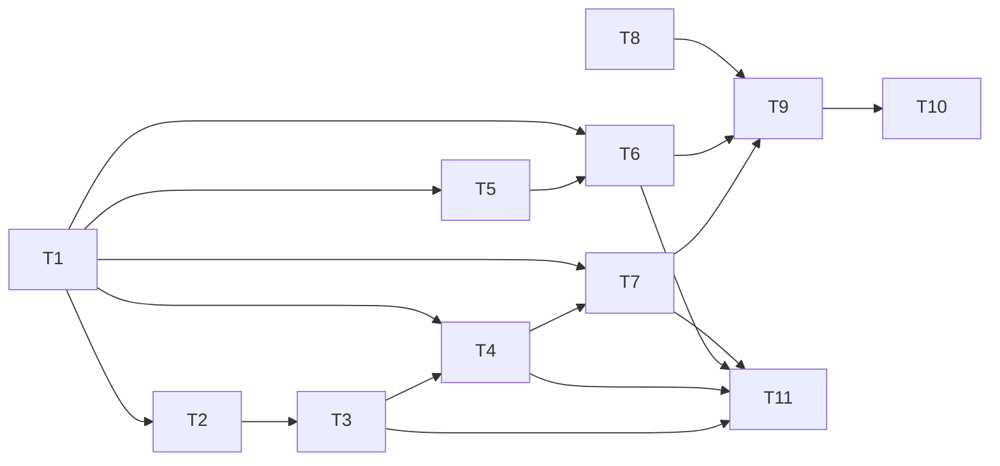

# タスク: 02-agent-detection（エージェントの検出と状態の判定）

> 親の割れ目（親 `tasks.md`「subtask の割れ目」）: architecture の段階 9。作るもの＝`ManifestStore`・`ManifestEngine`・
> `ProcessMatcher`・`AgentTracker`・`AgentMonitor`、`ManifestSource` の実装の利用、`composeServer`（組み立て）への組み込み。
> 境界の約束＝`pane.agent_status_changed` と `AgentInfo`（型は 01 の `protocol` で定義済み。変えない）。
> 担当の AC＝AC6（判定一式）・AC16（Windows の前面プロセスでの判定）・AC17（判定の周期）。

## 実装方針

- **herdr の判定の実行部を TypeScript に移植する**（D5・D45）。判定ルール（23 ファイル）は 01 で `third_party/herdr/` に
  無改変で取り込み済みなので、そのまま読む。実行部（region の切り出し・gate の評価・反映の判断・プロセスの特定）は
  herdr のソース（`da6bcd5`。Apache-2.0）を読んで同じ意味論で書く。design の「自前の推測」で作らない。
- **純関数から積む**（architecture「tasks への申し送り」）: 正規表現の変換 → ルールの読み込み → エンジン（純関数）→
  プロセスの特定（純関数）→ 1 pane の状態（時計を注入した純粋なクラス）→ 周期を回す `AgentMonitor` → 組み立て。
  下の 4 つは偽物なしで単体テストできる。
- **01 の成果物への変更は追加だけにする**: `ProcessInspector.foregroundJob`（D45）と
  `SessionService.allocateAgentInstanceId` の 2 つ。既存のメソッドのシグネチャは変えない。
- herdr のソースの手元の clone:
  `/tmp/claude-1000/-workspaces-web-tn-multiplexer/c9cb88b9-7a6c-4993-91e8-f1039355706b/scratchpad/herdr`
  （無ければ `git clone https://github.com/herdrdev/herdr && git -C herdr checkout da6bcd5969779bfe0396bcf89a8025d4375d611e`）。
  以下の `[herdr]` はこの clone のルートからの相対パス。

## 作業順序と依存関係

下の `依存:` に従う。依存では表せない順序の理由:

- **T1（U1）を最初に行う**（親 tasks「不確実な箇所を先に確かめる」）。T1 の結果が D45 の見立て（ヒステリシス・前面ジョブ・
  herdr の対応表の移植）と食い違ったら、ここで tasks を分解し直す（範囲は変えない）。
- **T2（U2）は T1 の直後**。23 ファイルの正規表現が JavaScript へ変換できない場合、エンジンの作り方が変わる。
- T8 は 01 の `SessionService` への小さな追加で、ほかと独立している（いつ行ってもよい）。

（図は説明。正典は各タスクの `依存:` 行）

## リスク / 留意点

- **正規表現の変換（U2）**: Rust の `regex` と JavaScript の `RegExp` は構文が違う（`\x{…}`、先頭のインラインフラグ `(?i)`・`(?m)`、
  POSIX 文字クラス等）。変換できない式が出たら、その 1 ルールだけ無効にしてログに残す（ファイル全体は捨てない）か、
  design の「読めないファイルはそのエージェントだけ無効」に従うかを T2 で決め、decisions.md に残す。
- **ヒステリシスの時間の尺度**: herdr は保留中に 100ms 間隔で再確認する。本製品の周期（500ms / 1 秒）のままだと保留が
  700ms の上限に先に当たり、確認回数の条件が実質働かない。`AgentMonitor` は保留中の pane だけ短い間隔で再確認する（T9）。
- **`ProcessInspector` への追加（D45）**: 01 の成果物に手を入れる。Linux は `/proc/*/stat` の走査（pane の数 × プロセス数）が
  周期ごとに走るので、1 周期の所要時間を測って記録する（T9。AC17）。
- **Windows ネイティブ**: 単体テストは Linux で回す（fake のプロセスツリー）。実機での確認は親の統合 test（AC16）。
- **herdr からの移植と帰属表示**: 移植したコード・テストの出所を残す（T11）。ライセンスの条件（D5）を満たさないまま review に出さない。

## テスト方針

- **T2**: 23 ファイルに含まれる全正規表現を抜き出し、変換後に `new RegExp` でき、代表的な文字列で Rust と同じ結果になること。
- **T3**: 23 ファイル全部が読み込めてコンパイルできること（U2 の確認）。壊れたファイル・上限超え・未対応の
  `min_engine_version` は、そのエージェントだけ無効になること。
- **T4**: herdr の `[herdr]src/detect/manifest/tests.rs` のケースを画面の fixture として移植し、同じ結果になること。
  region ごとの切り出しの単体テスト。claude・codex のルールでの blocked / working / idle / skip。
- **T5**: Linux は実物の PTY（対話シェルでパイプラインを前面に置く）で、前面ジョブに複数プロセスが並ぶこと。Windows は fake の tree。
- **T6**: herdr の `[herdr]src/detect/mod.rs` の identify 系テスト（cmdline の fixture）の移植＋手元の実物の
  `claude`・`codex` の cmdline（Linux で実際に起動して採取）。Windows の `node.exe`・`cmd /c`・`powershell -Command` の fixture。
- **T7**: 遷移の表（時計を注入）。herdr の `[herdr]src/pane/agent_detection.rs` の tests（保留・visible による即時反映）の移植。
- **T9**: 偽の `TerminalManager`・`ProcessInspector`・時計で、周期・直列化・保留中の短い再確認・focus による既読・pane の消滅。
  16 pane での 1 周期の所要時間の計測。
- **T10**: 実物の PTY で、`claude` という名前の偽のエージェント（プロンプトの画面を出して待つ実行ファイル）を pane で起動し、
  `pane.agent_status_changed` が kind='claude' で届くこと（サーバ内の結合テスト。ブラウザ込みの E2E は 05）。smoke。

## タスク

- [x] T1: U1 — herdr の判定の意味論をソースで確かめ、decisions.md に記録する（コードの差分は生まない）。
      確かめること: 11 種＋未使用 4 種の region の切り出し（プロンプトの印・横線・プロンプトの箱の見つけ方）、
      `contains`（大小文字・複数の値は AND か）・`regex`・`line_regex`（複数の式の結合）・`any`/`all`/`not` の評価、
      `priority` の同点の扱い、`skip_state_update`、`visible_*`、既定の idle（`DEFAULT_KNOWN_AGENT_IDLE_FALLBACK`）、
      `min_engine_version` と region の関係、`stabilize_agent_detection`、判定に渡す画面の範囲（何行か・alt 画面・scrollback を含むか）、
      検証の上限（ルール数・gate の深さ等）、`AGENT_STARTUP_GRACE_WINDOW` の使いどころ、前面ジョブの取り方（Linux・Windows）。
      D45 の見立てと食い違えば tasks を分解し直す。
      対象: `[herdr]src/detect/manifest.rs`（`region`・`compiled_gate_matches`・`validate_manifest`・`evaluate_loaded_manifest`）
      `[herdr]src/detect/mod.rs`（`identify_agent_in_job`・`normalized_process_name`）`[herdr]src/pane/agent_detection.rs`
      `[herdr]src/terminal/state.rs`（`stabilize_agent_detection`）`[herdr]src/platform/mod.rs`（`ForegroundJob`）/ 根拠: design U1・D45・research F12.2
      依存: なし
      AC: AC6
- [x] T2: U2 — Rust の正規表現を JavaScript の `RegExp` へ変換する純関数を作り、23 ファイルの全式で確かめる。
      `\x{…}` → `\u{…}`（`u` または `v` フラグ）、先頭のインラインフラグ（`(?i)`・`(?m)`・`(?s)`）→ フラグ、
      そのほか T1 で見つかった差。変換できない式は理由つきで失敗を返す（例外で落とさない）。
      対象: `packages/server/src/agent/regexConvert.ts`（新規作成）/ 根拠: design U2・research F12.2・「実装時の注意」
      依存: T1
      AC: AC6
- [x] T3: `ManifestStore` — `index.toml` と各ファイルを `ManifestSource` 越しに読み、zod で検証し、コンパイルする。
      smol-toml で解釈、herdr と同じ検証の上限、`min_engine_version` がエンジンの版（3）以下であること、正規表現は T2 で変換。
      読めない・検証に落ちたエージェントは無効にしてログに残す（ほかのエージェントは使える）。`get(kind)` と、読み込みの結果の要約
      （成功・失敗の件数と理由。smoke と起動時のログで使う）。コンパイル済みの型（`CompiledManifest`・rule・gate）もここで定義する。
      対象: `packages/server/src/agent/ManifestStore.ts`（新規作成）`packages/server/src/infra/ManifestSource.ts`・`FsManifestSource.ts`（既存・読むだけ）
      `third_party/herdr/agent-detection/*.toml` / 根拠: architecture「agent/ManifestStore」・design「判定ルールのエンジン」・D29
      依存: T2
      AC: AC6
- [x] T4: `ManifestEngine` — ルールの評価（純関数）。`evaluate(snapshot, manifest)` →
      `{ state, ruleId, visibleIdle, visibleBlocker, visibleWorking } | 'skip'`（D45 でシグネチャを拡張）。
      herdr のエンジンが持つ全 region の切り出し、gate の評価、`priority` の順、`skip_state_update`、どれにも一致しなければ既定の idle。
      `DetectionSnapshot`（画面の下部の行・OSC タイトル・OSC 9;4）の型もここで定義する。
      herdr の `[herdr]src/detect/manifest/tests.rs` のケースを fixture として移植する。
      対象: `packages/server/src/agent/ManifestEngine.ts`（新規作成）/ 根拠: architecture「agent/ManifestEngine」・design「判定ルールのエンジン」・D45
      依存: T1, T3
      AC: AC6
- [x] T5: `ProcessInspector` に `foregroundJob(shellPid)` を追加する（D45。既存の `foreground`・`isBusy` は変えない）。
      `ForegroundJob { processGroupId; processes: ForegroundProcess[] }`。Linux は tpgid を求め、`/proc/*/stat` の pgrp が
      一致するプロセスを集める。Windows はシェルの子孫の経路（シェルの直下から最も深い子孫まで）を集める。
      対象: `packages/server/src/platform/ProcessInspector.ts` `LinuxProcessInspector.ts` `WindowsProcessInspector.ts`（既存に追加）
      / 根拠: architecture「platform/ProcessInspector」・design「前面プロセスの特定」・D45・research F4.9・F8.10・F8.11
      依存: T1
      AC: AC6, AC16
- [x] T6: `ProcessMatcher` とエージェントの表 — 前面ジョブ → エージェントの種類（herdr の `identify_agent_in_job` を移植）。
      グループリーダーを先に見て、だめなら全プロセスを優先度つきで走査する。ランタイム（node・bun・deno・python）越しの起動、
      既知のパッケージのパス、Windows の `cmd`・`powershell` のラッパー。エージェントの表（id・表示名・別名・`verified`＝claude と
      codex だけ true）。手元の実物の `claude`・`codex` を Linux で起動して cmdline を採り、fixture に加える。
      対象: `packages/server/src/agent/ProcessMatcher.ts` `packages/server/src/agent/agents.ts`（新規作成）
      / 根拠: architecture「agent/ProcessMatcher」・design「ProcessMatcher」・D45・research F8.10・「実装時の注意」
      依存: T1, T5
      AC: AC6, AC16
- [x] T7: `AgentTracker` — 1 pane 分の状態と遷移（時計を注入。design「エージェントの状態」・D45）。
      種類が変わったら新しい `instanceId`（注入した払い出し関数で得る）を振り、同じ周期の最初の判定の状態で知らせる。
      herdr と同じ反映の判断（working → 素の idle は 3 回の確認か 700ms まで保留、`visibleIdle`・`visibleBlocker` なら即時）。
      反映した working → idle で `completionSeq` を 1 増やす。`'skip'` は変えない。エージェントが消えたら null。
      ルールが読めていない種類は `unknown`。`markSeen()` で `serverSeenSeq = completionSeq`。`since` の更新。
      対象: `packages/server/src/agent/AgentTracker.ts`（新規作成）/ 根拠: architecture「agent/AgentTracker」・design「エージェントの状態」・D45
      依存: T1, T4
      AC: AC6
- [x] T8: `SessionService` に `allocateAgentInstanceId()` を追加する（`SessionModel.nextId("a")`＋保存の予約。
      `nextId` は `session.json` に永続化されるので、instanceId は再起動後も重複しない。design「done」・AgentInfo の注記）。
      対象: `packages/server/src/session/SessionService.ts`（既存に追加）/ 根拠: design「エージェントの状態」・protocol `model.ts` `AgentInfo.instanceId`
      依存: なし
      AC: AC6
- [x] T9: `AgentMonitor` — 判定の周期と反映。pane ごとに、直近に出力があれば 500ms・無ければ 1 秒で判定し、
      保留中（T7）の pane だけ短い間隔で再確認する。pane ごとに `ProcessInspector` の呼び出しを直列化し、前の周期が終わって
      いなければ飛ばす（architecture「5. エージェントの判定の 1 周期」）。前面ジョブ → `ProcessMatcher` → `ManifestStore` →
      `ManifestEngine`（`mirror.bottomLines`・`title`・`progress`）→ `AgentTracker` → `SessionService.updatePaneRuntime`
      （agent・busy・cwd・title）。`session.focus_changed` を購読して、フォーカスした pane の既読（`markSeen`）を反映する。
      pane が消えたら tracker を捨てる。`start()`・`stop()`。16 pane での 1 周期の所要時間を測り、decisions.md に記録する（AC17）。
      対象: `packages/server/src/agent/AgentMonitor.ts`（新規作成）`packages/server/src/terminal/TerminalHost.ts`（`lastOutputAt`・既存）
      `packages/server/src/terminal/Mirror.ts:112`（`bottomLines` 等・既存）`packages/server/src/session/SessionService.ts:308`（`updatePaneRuntime`・既存）
      / 根拠: architecture「agent/AgentMonitor」「5. エージェントの判定の 1 周期」・design「判定の周期」「done」
      依存: T3, T4, T5, T6, T7, T8
      AC: AC6, AC17
- [x] T10: `composeServer` への組み込みと停止、smoke、サーバ内の結合テスト。
      判定ルールのディレクトリの解決（`webDistDirFor` と同じく成果物の位置から）、起動時の `ManifestStore` の読み込み（結果の要約をログへ）、
      `listen()` での `AgentMonitor.start()`、`close()` での `stop()`。`smoke.ts` で判定ルールの読み込みが全件成功していることを確かめる。
      実物の PTY で、`claude` という名前の偽のエージェント（プロンプトの画面を出して待つ実行ファイル）を pane で起動し、
      `pane.agent_status_changed` が kind='claude' で届くことを確かめる。
      対象: `packages/server/src/composeServer.ts:99`（差し込み口のコメント）`packages/server/src/smoke.ts`（既存）
      `packages/server/src/composeServer.integration.test.ts`（既存に追加）/ 根拠: architecture「6. 起動と再起動後の復元」・親 tasks「境界の約束」
      依存: T9
      AC: AC6
- [x] T11: herdr から移植したコードとテストの帰属表示。移植したファイルの冒頭に出所（`da6bcd5` のパス）と変更した旨を書き、
      ルートの `NOTICE` と `third_party/herdr/README.md` に「判定の実行部とテストの一部を TypeScript へ移植した」旨を追記する（D5）。
      対象: `NOTICE` `third_party/herdr/README.md` と T3・T4・T6・T7 で作ったファイル / 根拠: D5・D34・D45・requirements「ライセンス」
      依存: T3, T4, T6, T7
      AC: なし
