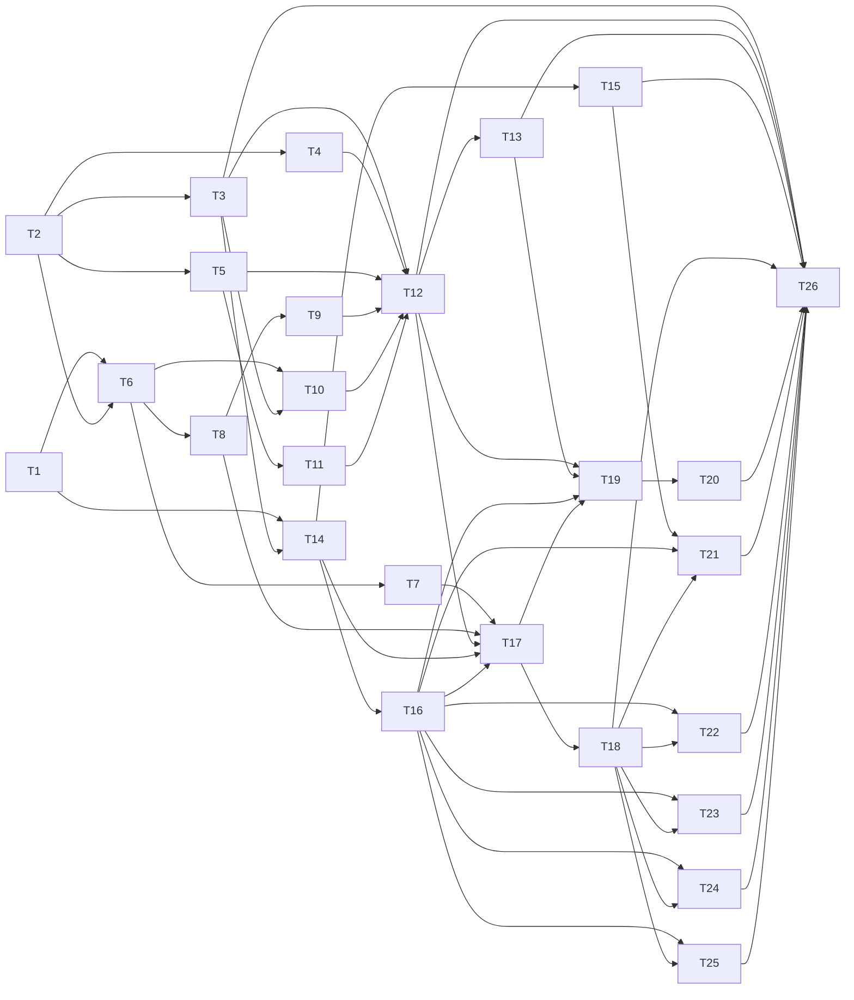

# タスク: 03-web-desktop（デスクトップの Web UI）

> 親の割れ目（親 `tasks.md`「subtask の割れ目」）: architecture の段階 11〜14。作るもの＝Web の `net/`・`term/`・`keys/`・
> `store/`・`actions/`・`components/`・`main.ts`（`packages/web` は未作成なので足場から作る）。
> 境界の約束＝モバイル（04）が再利用する部品：`KeyInputController.injectKey`・`TerminalRegistry` の容量の切替・`ViewSync`・ストア。
> 担当の AC＝AC1〜AC10・AC13・AC14・AC17（RendererPool・LRU）・AC-I1〜AC-I5 のうち、親 tasks「受け入れ基準の分担」の 03 の列。
> サーバ（01・02）と `protocol` の型は変えない（変える必要が出たら 01 の側で変え、decisions.md に残す）。

## 実装方針

- **architecture.md の Web の表と「Web の主要な型と port」を正とする**（D27・D28・D30）。design.md と architecture.md が
  食い違う箇所は architecture を採り、判断を decisions.md に残す（例：WebGL の上限はモバイル 2＝architecture。design は 4）。
- **Vue に依存しない部品から積む**（architecture「依存の規則」4）: `net/`・`term/`・`keys/` は Vue と Pinia を import しない。
  純粋な部品（`KeyRouter` と各モード・`measure`・集約と done の導出）は、DOM も xterm.js も無しで単体テストを先に書ける。
  xterm.js を使う部品（`QueryFilter`・`CopyTarget`・`TerminalRegistry`）は、テスト環境で実物の `@xterm/xterm` を動かして確かめる。
- **端末の出力はストアを通さない**（D16・規則 5）: `Connection` →（`TerminalSinkPort`）→ `TerminalRegistry` → xterm.js。
- **循環する port は組み立ての後に `bind` する 2 段階**（architecture「設計判断」DI の行）。組み立ては `main.ts` だけ。
- **herdr の既定の挙動に合わせる**: キー・モード・集約・閉じる確認は、T1 で herdr のソース（`da6bcd5`。Apache-2.0・D5）を
  確かめてから作る。design の「未確認」のまま作らない（02 の D45 と同じ進め方）。
  **tasks の段階で先読みした見立てを decisions.md D55 に書いた**（下の各タスクはその見立てで書いてある。T1 で確定させる）。
  requirements と herdr が食い違う 2 点（prefix の時間切れ＝AC-I1、busy の確認＝AC-I2）は requirements を優先する。
  手元の clone: `/tmp/claude-1000/-workspaces-web-tn-multiplexer/c632e6df-a135-4509-8171-f75f9470b7d0/scratchpad/herdr`
  （無ければ `git clone https://github.com/herdrdev/herdr && git -C herdr checkout da6bcd5969779bfe0396bcf89a8025d4375d611e`）。
- **モバイル（04）が乗る口を最初から開けておく**: `KeyInputController.injectKey`、`TerminalRegistry` の容量（24 / 2）を外から
  切り替える口、`RendererPool` の上限を外から与える口、`hello` の `kind` を外から与える口。モバイルの判定と UI そのものは 04。

## 作業順序と依存関係

下の `依存:` に従う。依存では表せない順序の理由:

- **T1（herdr の挙動の確認）と T2（足場と xterm.js のテスト環境）を最初に行う**（親 tasks「不確実な箇所を先に確かめる」）。
  - T1 の結果が D55 の見立てと食い違ったら、該当のタスク（T6〜T9・T15・T17・T18・T21〜T24）の記述をここで直す（範囲は変えない）。
  - T2 で、実物の `@xterm/xterm` がテスト環境（happy-dom か jsdom）で生成・`write`・パーサのハンドラの登録まで動くかを確かめる。
    動かなければ、xterm.js を使う部品のテストの方法（偽の Terminal に寄せる範囲）をここで決め直す。
- **純粋な部品（T6〜T8・T15）は早く書ける**が、KeyRouter と各モードは T1 の確認結果を前提にする。
- **描画部品（T19〜T25）はストアと ActionDispatcher（T14〜T18）の後**。部品の単体テストはストアを直接組み立てて行う。
- **T26（組み立てと実地の確認）で初めて全体が 1 本につながる**。ここで実物のサーバ＋ビルドした Web UI をブラウザで開いて確かめる。

（図は説明。正典は各タスクの `依存:` 行）

## リスク / 留意点

- **CSP と xterm.js**: サーバは `Content-Security-Policy: default-src 'self'` を返す（01。`style-src` の指定なし）。
  xterm.js の DOM レンダラーは実行時に `<style>` 要素を作ってテーマの色を書き込むので、インラインの style として
  **ブラウザに拒否される恐れがある**。T2 でビルドした成果物を実際のブラウザ（Playwright の Chromium）で開いて確かめ、
  拒否されるなら 01 の `HttpServer` の CSP に `style-src 'self' 'unsafe-inline'` を足す（01 の成果物への変更。decisions.md に残す）。
- **テスト環境の xterm.js**: happy-dom / jsdom には canvas・WebGL・レイアウト（要素の寸法）が無い。`open()` 後の描画・
  セルの寸法・WebGL は単体テストでは確かめられないので、`measure` は寸法を引数で受ける純関数にし、`RendererPool` は
  WebGL アドオンの生成を注入できる形にする。描画そのものは T26 の実地の確認と 05 の E2E で見る。
- **xterm.js の未確認の挙動**（design の推測・U5）: ダブルクリックでの単語の選択（M5）、`Ctrl+Shift+V` / `Ctrl+V` の貼り付けと
  bracketed paste、ブラウザの xterm.js が色の問い合わせ（OSC 10/11）に応答するか。該当のタスク（T4・T10・T11）で実物を確かめる。
- **フォーカスの報告（`CSI ? 1004`）**: サイズ権限を持つクライアントだけが送る（design「問い合わせの握りつぶし」）。
  xterm.js は `onData` で `\x1b[I` / `\x1b[O` を出すので、`TerminalRegistry` が権限の有無（`Tab.sizeOwnerClientId` と自分の
  clientId）で落とす。
- **ESLint**: 既存の設定は `.ts` だけを見て `env: node`。`.vue` は `vue-tsc` の型検査で見る（ESLint に Vue のプラグインは
  足さない。足場の判断として decisions.md に残す）。`packages/web` の `.ts` はブラウザの環境として検査する。
- **規模**: タスクは 26 件。描画部品は数が多いが、各部品は 1 つの関心に絞り、テストでストアとアクションの呼び出しを確かめる。

## テスト方針

- **単体テスト（Vitest。`packages/web` は happy-dom か jsdom の環境。T2 で決める）**
  - `net/Connection`: 偽の WebSocket・偽の `fetch`・偽の時計で、ログイン・`/api/session` の確認・再接続の間隔（1〜30 秒の倍々）・
    close コード `4401`・`client.detach` の後に再接続しないこと・要求と応答の対応付け・フレームの振り分け。
  - `KeyRouter` と各モード: 全遷移の表（prefix の時間切れは偽の時計）。IME の変換中・keydown 以外を prefix と見なさないこと。
  - `QueryFilter`・`CopyTarget`: 実物の `@xterm/xterm` に問い合わせ・画面を書き込んで確かめる（応答の `onData` が出ないこと等）。
  - `TerminalRegistry`: LRU（24 / 2）の破棄の順・`pane.unsubscribe`・予約した購読・SNAPSHOT の適用の順（reset → resize → write）。
  - `ViewSync`: `client.view` → 予約した `pane.subscribe` の順に送ること。
  - ストア: snapshot と全イベントの反映、連鎖して閉じるときの整合、集約（D19）と done の導出、既読の保存と初期値。
  - `ActionDispatcher`: `Action` ごとの方式の呼び出し・作成後のフォーカス・閉じる前の確認の条件。
  - 描画部品（`@vue/test-utils`）: クリック・キーボード・ダイアログの開閉とフォーカスの戻り先・メニュー。
- **サーバは契約のモックで代用する**（親 tasks「テスト方針」）。ただし `protocol` の型とコーデックは実物を使う。
- **実地の確認（T26・test 工程）**: 実物のサーバ＋ビルドした Web UI を Playwright の Chromium で開き、ログイン → 表示 → 入力の
  エコー → 分割 → 名前変更 → 閉じる、を一巡する使い捨てのスクリプトで確かめる（E2E 一式は 05 の成果物）。CSP の拒否が
  コンソールに出ていないことも確かめる。
- smoke（`aidev smoke`）: ビルドした Web UI が配信されること（placeholder ではない `index.html` と、それが参照する資産）を足す（T26）。

## タスク

- [x] T1: D55 の見立て（herdr の UI まわりの挙動）をソースで確定させ、decisions.md に記録する（コードの差分は生まない）。
      D55 の 12 項目それぞれを直読で確かめ、引用の行を確定させる。とくに次を決める：
      research F3（M1〜M11）に無いマウス操作（tab バーのホイール・サイドバーの幅のドラッグ等）を MVP に入れるか後続にするか、
      サイドバーの折りたたみ（herdr は compact / hidden）をどちらにするか、done の既読の条件（ウィンドウのフォーカス）、
      `Splitter` のキーボード操作の移動量（resize モードの 0.05 に揃えるか、APG の慣習の 2% か）。
      herdr と違うまま残すもの（D55 の prefix の時間切れ・busy の確認・「未検証」の印・tab の名前の番号・D24 など）は、
      05 の対応表（AC15）に載せる一覧としてまとめる。
      対象: `[herdr]src/client/shell/`（`input.rs`・`copy_mode.rs`・`mouse.rs`・`context_menu.rs`・`overlay_input.rs`・`sidebar.rs`・
      `endpoint_agent_state.rs`）・`[herdr]src/config/model.rs`・`[herdr]src/workspace/aggregate.rs` / 根拠: decisions.md D55
      依存: なし
      AC: AC7, AC13, AC-I1, AC-I2
- [x] T2: `packages/web` の足場を作る。Vue 3＋Vite＋Pinia＋xterm.js 6（`@xterm/xterm`・`addon-webgl`・`addon-unicode11`・
      `addon-search`・`addon-web-links`）、`vue-tsc`、Vitest（DOM の環境）＋`@vue/test-utils`。
      `vite.config.ts`（開発時は `/api`・`/ws` をサーバへ中継。出力は `packages/web/dist`＝サーバの `webDistDirFor()` が配る場所）、
      `index.html`・空の `App.vue`、ルートの `build`・`typecheck`・`lint` に web を含める。
      あわせて、テスト環境で実物の `@xterm/xterm` が生成・`write`・`parser.register*Handler` まで動くことを確かめ、
      ビルドした成果物をサーバ経由でブラウザ（Playwright の Chromium）に読み込ませて CSP の拒否が出ないかを確かめる（リスク参照）。
      実施結果：xterm.js の DOM レンダラーがテーマの色をインライン style で書き込み、既存の CSP（`style-src` 未指定＝
      `default-src 'self'` にフォールバック）に実際に拒否された（D57 の前段で実測）。`HttpServer.ts` の CSP に
      `style-src 'self' 'unsafe-inline'` を追加して解消を確認した。加えて、ルートの `vitest.workspace.ts`
      （`defineWorkspace`）が vitest 5 系で機能しておらず `packages/web` の `environment: "happy-dom"` が適用されて
      いなかったことが分かり、`vitest.config.ts`（`test.projects`）に置き換えた（D57）。
      対象: `packages/web/`（新規）・`package.json`・`.eslintrc.cjs`・`vitest.config.ts`（新規。`vitest.workspace.ts` を置換）・
      `packages/server/src/http/HttpServer.ts`（CSP） / 根拠: D57
      依存: なし
      AC: AC4
- [x] T3: `net/ports.ts`（Web の port の型）と `net/Connection`（`ConnectionPort` の実装）。ログイン（`POST /api/login`）・
      ログアウト・`GET /api/session` の確認、WebSocket の接続と再接続（1〜30 秒の倍々）、要求と応答の id の対応付けと失敗の変換、
      `client.hello` からのやり直し、snapshot とイベントを `StorePort` へ、OUTPUT / SNAPSHOT を `TerminalSinkPort` へ振り分ける。
      `pane.size_changed` は `TerminalSinkPort.onSizeChanged`（xterm.js の resize を即座に）と `StorePort.applyEvent`
      （非所有クライアントの表示のため store の pane.cols/rows も更新）の両方へ送る（実装時の判断。architecture の文言は
      どちらとも取れたため、両方に流す方を採った）。close コード `4401` はすぐ `onAuthRequired`、`client.detach` の後は
      再接続しない。`hello` の `kind` は外から与える（04 が `mobile` を渡す）。
      実装中に見つけた不具合（`client.hello`失敗時の `ws.close()` が、既に close 済みの socket に対して二重に
      close イベントを起こし、意図した切断（4401・detach）の直後に誤って再接続してしまう）を修正（D58）。
      対象: `packages/web/src/net/ports.ts`・`packages/web/src/net/Connection.ts`（新規）/ 根拠: architecture「Web の主要な型と port」「7. 認証の流れと切断の見分け」、D58
      依存: T2
      AC: AC8, AC9, AC10
- [x] T4: `term/QueryFilter`（D17）。ブラウザの xterm.js で DA1・DA2・DSR 5 / CPR・DECRQM・DECRQSS・OSC 4/10/11/12 の問い合わせ・
      XTVERSION を握りつぶし、応答（`onData`）を出させない。色の問い合わせ（OSC 4/10/11/12）は実際に色を設定する OSC
      （`?` を含まない）と区別する（Mirror.ts と同じ判定）。実装中に、ブラウザ側の xterm.js への応答が `write()` の
      直後ではなくマクロタスクで届くことが分かった（D59。テストの待ち方に影響）。DA1 は実物のブラウザ側 xterm.js が
      実際に応答することを確認した（U5 の隣接事実）。
      対象: `packages/web/src/term/QueryFilter.ts`（新規）/ 根拠: design「ブラウザ側での問い合わせの握りつぶし」、D59
      依存: T2
      AC: AC4
- [x] T5: `term/measure`（枠の寸法とセルの寸法 → cols/rows の純関数）・`term/RendererPool`（表示中の WebGL の上限。
      デスクトップ 12・モバイル 2 を外から与える。`onContextLoss` で DOM に戻す。WebGL アドオンの生成は注入）・
      `term/clipboard`（`navigator.clipboard.writeText`/`readText`。失敗時の知らせは呼び出し側が出す）。
      design.md と architecture.md でモバイルの WebGL 上限が食い違っていたので architecture.md の値（2）を採った（D60）。
      対象: `packages/web/src/term/measure.ts`・`RendererPool.ts`・`clipboard.ts`（新規）/ 根拠: architecture の Web の表、D60
      依存: T2
      AC: AC4, AC5, AC17
- [x] T6: `keys/keymap`（herdr の既定キー表。MVP の行と「後続」の行）と `keys/KeyRouter`（モードの状態機械：terminal / prefix /
      navigate / copy / resize / dialog）。prefix の後の 1 キーの解釈（herdr と同じ：もう一度 prefix で `\x02` を送る、Esc で取り消し、
      割り当てのあるキーは実行して元のモードへ＝copy モード中の pane なら copy へ、割り当ての無いキーは取り消して捨てる）、
      copy モード中も prefix が効く、後続のキーは `notYet`、3 秒の時間切れ（AC-I1。herdr には無い。D55。偽の時計）、
      keydown 以外と IME の変換中を prefix と見なさない、navigate / copy / resize の解釈は各モードへ委ねる（`SubModeInterpreter`
      を注入。T7・T8 が実装。無い間は Esc だけ terminal へ戻す）。`keys/actions.ts` に `Action`・`KeyDecision`・`KeyInput`・
      `Mode`・`CopyCommand` の共有の型を分離した（`keymap.ts`/`KeyRouter.ts` の循環 import を避けるため。実装時の判断）。
      対象: `packages/web/src/keys/keymap.ts`・`KeyRouter.ts`・`actions.ts`（新規）/ 根拠: architecture「keys/KeyRouter.ts」の型、design「キー操作」
      依存: T1, T2
      AC: AC13, AC-I1, AC-I3, AC-I5
      追記（test 工程で発見・修正。D81）: `handleInPrefix` の「割り当ての無いキーは prefix を抜ける」が、
      `Shift+<文字>` の直前に必ず発生する `Shift` 単体の keydown まで「割り当ての無いキー」として
      扱ってしまい、`prefix+Shift+<文字>`（P/T/X/N/W/D/H/J/K/L/R）が全滅していた。実機の Chromium を
      使う実地の確認で発見・修正。修飾キー単体を無視するガードを追加。
- [x] T7: `keys/NavigateMode` と `keys/ResizeMode`（architecture の `Action` 型のとおりに実装。副作用なし）。
      navigate＝`↑/↓`→`{navigate, op:'up'|'down'}`、`h/j/k/l`・`←/→`→`{navigate, op:'paneDir', dir}`（留まる）、
      `Enter`→`activate`（抜ける）、`Esc`→`cancel`（抜ける）。**`1-9` の直接切替・prefix 割り当ての prefix 無しでの実行は
      実装しない**（D62。architecture の `Action` 型に該当する形が無い。意図的な簡略化）。
      resize＝`h/j/k/l`・矢印→`{resizeBy, dir, amount:0.05}`（D56 の訂正 3。留まる）、`Esc`・`Enter`・素の `r`→抜ける
      （herdr の実測）。**境界をどう探すか（フォーカス中の pane からどの split を動かすか）は 01-server-core の
      `LayoutTree.resizeBy` が既に実装済みで、herdr の「最寄りの境界＋フォールバック」より単純（直接の親 split だけ）。
      この単純な意味論のまま変えない**（D61。01 は承認済みで、この subtask の範囲外）。
      `KeyRouter` との結合テスト（実物の `NavigateMode`/`ResizeMode` を注入）も追加した。
      対象: `packages/web/src/keys/NavigateMode.ts`・`ResizeMode.ts`（新規）/ 根拠: D61, D62
      依存: T6
      AC: AC3, AC7, AC13, AC-I3
- [x] T8: `keys/CopyMode`（copy モードのキー → `CopyCommand`。design.md の原文どおりの一覧を実装。`0 ^ $`・Home/End・
      `g/G` は未確認のまま見送った（D63。D55/D56 の一覧はここでは採らない）。`ctrl+b` は KeyRouter が prefix として
      先取りするので割り当てない（死んだキーを実装しない）。
      `q`・`y`・`Enter` は常に抜ける。`Esc`（`clearOrExit`）はここでは抜けたと判断せず、`CopyTarget`（T9）の結果を見て
      `ActionDispatcher`（T18）が判断する（D63）。architecture の `CopyCommand` 型に単位（行頭・行末・先頭・末尾）を足した。
      対象: `packages/web/src/keys/CopyMode.ts`（新規）/ 根拠: architecture の `CopyCommand` 型、design「copy モード」、D63
      依存: T6
      AC: AC5, AC13
- [x] T9: `CopyTarget`（`CopyCommand` を xterm.js の buffer・選択 API・`@xterm/addon-search` に当てる実装。単位ごとの移動・
      検索と繰り返し・文字単位 / 行単位の選択・yank で選択したテキストを返す）。**選択が無いときの yank が現在の検索の
      一致を返す**ことは、`SearchAddon.findNext` が実物の xterm.js で一致箇所を選択状態にすることを実測で確認したので、
      特別な分岐なしにそのまま満たせた（テストで確認）。単語/WORD/段落の移動は行をまたがない簡略化（D64）。
      copy モード中も出力は止めない。copy モードは pane に属し、その pane に戻ると再開する。**同時に 1 pane しか copy モードを
      持てない**（別の pane で入ると前のものは破棄する。D56 の訂正 5）——`TerminalRegistry`（T12）が単一の保持元になる。
      対象: `packages/web/src/term/CopyTarget.ts`（新規）/ 根拠: D56, D64
      依存: T2, T8
      AC: AC5
- [x] T10: `keys/KeyInputController`。xterm.js ごとの `attachCustomKeyEventHandler`（`attach`）・端末以外にフォーカスがあるときの
      `handleDomKey`・モバイルの追加キーの `injectKey`・`setMode`・`bind`。`KeyRouter.handle` の結果（pass / consume / send / action）に
      従い、横取りしたキーは `preventDefault()`。モードの変化を `ModeSink` へ。
      貼り付け：`Ctrl+Shift+V`（Win/Linux）は手動で検知して `preventDefault()`・`navigator.clipboard.readText()`・
      `term.paste()`（bracketed paste は xterm.js 自身が処理）。`Cmd+V`（mac）はブラウザの標準の貼り付けなので
      pass するだけでよい（xterm.js 自身の paste イベント処理に任せる。実物で確認）。`Ctrl+V`（修飾無し）は
      KeyRouter に割り当てが無いので自然に pass され、design のとおり端末へ `^V` として届く（特別な処理は不要）。
      対象: `packages/web/src/keys/KeyInputController.ts`（新規）
      依存: T3, T6
      AC: AC13, AC-I5, AC12
- [x] T11: `term/MouseBridge`。選択の終了（mouseup）でのクリップボードへのコピー（M4。成功/失敗どちらもトースト）、
      リンクの起動（M6：`addon-web-links`。Ctrl/Cmd＋クリックでの下線・新規タブは addon 自体の既定の挙動）、
      右クリックの振り分け（M7：ブラウザの既定のメニューは常に止め、pane の `rightClick` が `pane` かつ
      `term.modes.mouseTrackingMode !== 'none'` のときだけ何もせず＝アプリへ渡す。それ以外は `UiPort.openContextMenu`）。
      **M5（ダブルクリックで単語の選択）を実物の Chromium で確認**：`@xterm/xterm` 6.0.0 は素のままで選択する
      （`select()` API による自前の補完は不要。D65）。
      対象: `packages/web/src/term/MouseBridge.ts`（新規）/ 根拠: design「マウス操作」、D65
      依存: T5
      AC: AC5, AC14
- [x] T12: `term/TerminalRegistry`（`TerminalSinkPort` の実装。D66：`MouseBridge` は pane ごとのファクトリで受け取り、
      `QueryFilter` は関数として直接呼ぶ）。pane → `TermEntry` の LRU（容量は外から切り替える。デスクトップ 24・モバイル 2）、
      `acquire`（無ければ xterm.js を作り、`unicode11`・`search`・WebGL（`RendererPool` 経由）を付け、
      `QueryFilter`・`MouseBridge`・`KeyInputController` を取り付け、`term.onData` を `sendInput` へ、`pane.subscribe` を予約する）・
      `release`・`evictIfNeeded`（表示していない最古を破棄して `pane.unsubscribe`）・`takePendingSubscriptions`・`focus`。
      `onSnapshot`（reset → resize → write）・`onOutput`・`onSizeChanged`。
      **フォーカスの報告はサイズ権限を持つときだけ送る**：xterm.js は `DECSET 1004` が有効なとき `onData` で
      `\x1b[I`/`\x1b[O`（CSI I/O）をそのまま出すことを実物で確認した。`term.onData` のハンドラでこの 2 つの
      バイト列だけを判定し、`hasSizeAuthority(paneId)` が false なら送らない（省略時は常に送る）。
      snapshot の `host.windowsBuild` からの `windowsPty` は `terminalOptions` の上書きとして T26 で渡す設計にした
      （TerminalRegistry 自体は snapshot を知らない）。テーマは `protocol` の `DEFAULT_THEME`（`term/theme.ts` で変換）。
      対象: `packages/web/src/term/TerminalRegistry.ts`・`theme.ts`（新規）/ 根拠: architecture「term/TerminalRegistry.ts」の型・「4. tab の切替」、D66
      依存: T3, T4, T5, T9, T10, T11
      AC: AC4, AC5, AC8, AC17
- [x] T13: `term/ViewSync`。表示が変わるたびに、枠の寸法から cols/rows を求めて `client.view`（表示とサイズ）→ 予約した
      `pane.subscribe`（`scrollbackLines` は外から渡すゲッター。デスクトップは snapshot の `limits`、モバイルは 1000）の順に送る。
      同じ内容の申告は繰り返さない（直前の payload と JSON 比較）。セルの寸法は xterm.js が公開していないので、
      `@xterm/addon-fit` と同じ内部 API（`_core._renderService.dimensions.css.cell`）を読む（実物で存在を確認）。
      対象: `packages/web/src/term/ViewSync.ts`（新規）/ 根拠: architecture「1. 接続と初回表示」
      依存: T12
      AC: AC4, AC8, AC9
- [x] T14: `store/session`（Pinia。workspace / tab / pane・フォーカス・limits・host の保持。Map で持つ）と
      `store/StoreAdapter`（`StorePort` の実装：snapshot と全イベントの反映。連鎖して閉じるとき
      （`pane.closed` → `tab.closed` → `workspace.closed`）は各イベントが独立して Map を操作するだけなので
      整合は自然に保たれる）。`onAuthRequired`/`onConnectionState`/`pane.exited`/`client.error` は
      `store/view`（T16）へ直接依存せず、注入したコールバックへ委ねた（D67）。
      対象: `packages/web/src/store/session.ts`・`StoreAdapter.ts`（新規）/ 根拠: D67
      依存: T1, T3
      AC: AC1, AC2, AC3, AC6, AC8
- [x] T15: `store/seen`（エージェントの `instanceId` ごとの既読。localStorage。記録が無ければ `serverSeenSeq` を初期値に）と、
      集約（workspace は配下の全 pane の状態の最大値。blocked ＞ done ＞ working ＞ idle ＞ unknown。D19。tab の段は経由しない
      ——サイドバーは tab の状態を表示しないので、tab 単位の集約は不要。D56 の訂正 6）・done の導出（`idle` かつ
      `completionSeq > seenSeq`）・既読を進める条件（**pane が表示に含まれていて（破棄されていない）、かつ
      `document.hasFocus()` が false と分かっていない＝true または未確認のとき**。D56 の訂正 6。herdr のクライアント側の
      既読条件に合わせる。herdr にはサーバ側・セッション全体で共有される既読もあるが、本製品は design のとおり
      クライアントごとの既読だけにする＝意図的な差。05 の対応表に載せる）の getter。
      対象: `packages/web/src/store/seen.ts`（新規）・`store/session.ts` の getter / 根拠: D56
      依存: T14
      AC: AC6, AC7
- [x] T16: `store/view`（このクライアントの表示：workspace / tab / フォーカス中の pane・sessionStorage・hello 直後の表示の決め方・
      モードの写し（`ModeSink`）・開いているダイアログ・接続の状態・トースト・サイドバーの折りたたみ）。
      対象: `packages/web/src/store/view.ts`（新規）/ 根拠: design「フォーカスと表示」
      依存: T14
      AC: AC7, AC8, AC9, AC-I4
- [x] T17: `actions/ActionDispatcher`（その 1：構造の操作）。split・focusDir・swap・cyclePane（レイアウト木の深さ優先。
      端で反対へ）・zoom・tabDelta・tabIndex を方式へ（`view.focusedPaneId`/`view.tabId` を対象にする）。
      **newTab はダイアログを開くだけ**（herdr の `prompt_new_tab_name` 既定 true。`confirmNewTab` で実際に送る）。
      **newWorkspace は名前を尋ねず `workspace.create({})` を直接送る**（herdr の `prompt_new_workspace_name` 既定 false。
      当初ダイアログ経由で実装しかけていたのを design の記述どおりに訂正した。D68）。閉じる前の確認の条件
      （workspace は常に、pane / tab は busy の pane を含むとき。D23）を判定し、確認が要れば `confirmClose` 用の
      ダイアログ文脈（`view.openDialogWithContext`）を開く。**herdr の worktree グループ経由の追加確認（D56 の訂正 2）は
      本製品では扱わない**（グルーピングは D6 の後続 work）。**navigate モードからの他操作の実行（D56 の訂正 4）は
      D62 で実装しないと決めた**ので、ここでは対応不要（navigate は `{type:'navigate', op}` しか生成しない）。
      `ActionPort`・`FocusPort` を実装する。
      対象: `packages/web/src/actions/ActionDispatcher.ts`（新規）・`store/view.ts`（`DialogContext`・
      `openDialogWithContext`・`closeDialog` を追加）/ 根拠: D56, D62, D68
      依存: T7, T8, T12, T14, T16
      AC: AC1, AC2, AC3, AC-I2, AC-I4
- [x] T18: `actions/ActionDispatcher`（その 2：モード・ダイアログ・その他）。`enterMode`（navigate だけ選択の初期値を
      置く。ほかは KeyRouter 自身が遷移済み）・`exitMode`（`keys.setMode('terminal')`）・navigate の操作（up/down は
      workspace の一覧を巡回、activate で確定＋`workspace.focus`、paneDir は focusDir と同経路）・resizeBy（`pane.resize`）・
      copy（`TerminalRegistry.get(paneId).copy.apply()` の結果を見て、`copiedText` があれば `term/clipboard`・
      `exited` なら `keys.setMode('terminal')`。D63 の「Esc の判断はここで行う」を実装）・help・goto（ダイアログを開く）・
      名前の変更（workspace/tab/pane。空欄は tab/workspace は送らない・pane は `label:null` で消去扱い）・toggleSidebar・
      detach・notYet（トースト）。メニュー専用の操作：`pasteFromMenu`・`clearPaneName`・`setRightClickTarget`
      （`pane.input.set`）。**「フォーカス中の pane との入れ替え」は実装しない**（D69：`pane.swap` が方向指定のみで
      任意の対象を指定できないプロトコルの制約）。`UiPort`（`openContextMenu`・`toast`）を実装した。
      **ログイン・再接続の画面からの要求は ActionDispatcher を経由せず、T25 の各コンポーネントが `ConnectionPort` を
      直接呼ぶ**（`login`/`connect` は元々 `ConnectionPort` 自身のメソッドなので、仲介する理由が無い。実装時の判断）。
      ダイアログを閉じたら開く前の pane へフォーカスを戻す（`store/view.ts` の `closeDialog` が担う。T17 で実装済み）。
      対象: `packages/web/src/actions/ActionDispatcher.ts`・`store/view.ts`（`navigateSelection`・`contextMenu` を追加）/ 根拠: D63, D69
      依存: T17
      AC: AC5, AC7, AC13, AC14, AC-I1, AC-I4
- [x] T19: `components/PaneLayout`（レイアウト木の再帰描画・zoom 中は 1 つだけ。描画後に `ViewSync.commit`）と
      `components/Splitter`（`role=separator`・`aria-valuenow`。Pointer Events のドラッグで `layout.set_split_ratio` を 50ms 間隔に
      まとめて送る。キーボードの矢印で 2% ずつ）。`TerminalPane`（T20）が無いので葉ノードは名前付きスコープ付き
      スロット（`#pane`）で疎結合にした（D71）。部品の受け渡しは provide/inject（`injection.ts`。D70）を新設した。
      対象: `packages/web/src/components/PaneLayout.vue`・`Splitter.vue`・`injection.ts`（新規）/ 根拠: design「マウス操作」M2、D70, D71
      依存: T12, T13, T16, T17
      AC: AC3, AC14
- [x] T20: `components/TerminalPane`（`TerminalRegistry.acquire` で要素を借りて差し込み、外れたら `release`。`view` のフォーカス中の
      pane が自分ならフォーカスする。クリックでフォーカス（M1。`@mousedown.capture` で xterm.js 自身のマウス処理より
      先に走らせる）。サイズ権限（`session.hasSizeAuthority(tabId)`。D72 で `clientId` の保存漏れを発見・修正して実装）が
      無ければ `terminal-pane-scaled` クラスを付ける（CSS 側で縮小・余白。ピクセル単位の実地確認は T26/05）。
      `overscroll-behavior: contain`。`status: 'failed'` の pane は xterm.js を作らず理由を表示する。
      対象: `packages/web/src/components/TerminalPane.vue`（新規）/ 根拠: design「サイズ権限」「マウス操作」M1・M8、D72
      依存: T19
      AC: AC4, AC9, AC14, AC-I5
- [x] T21: `components/Sidebar`（D56 の訂正 9。「spaces」区画：［状態の印・名前］と［ブランチ・↑N ↓M（両方 0 なら 2 行目を
      出さない）］の 2 行。「agents」区画：［状態の印・workspace・tab］と［エージェント名・「未検証」の印］の 2 行（herdr の
      既定はエージェント行に「マシン」も出すが、本製品は 1 ホスト固定なので出さない）。行のクリックで移動しフォーカス
      （M1・AC-I4）、workspace の行の右クリックでメニュー（M3。項目は T22 の `ContextMenu` を参照。「名前の変更・閉じる」の
      2 項目のみ）、navigate モードでの選択の表示、`prefix+b` での折りたたみ（単純な 2 値の切替。折りたたみ時は幅を
      縮めた compact 表示にする。herdr の既定に合わせる）、**サイドバーの幅のドラッグとダブルクリックでの既定幅への
      復元**（D56 の訂正 11。research F3 に無いが herdr にある操作。M2 に準じた `Splitter` 相当の扱いにする）。
      対象: `packages/web/src/components/Sidebar.vue`（新規）/ 根拠: D56
      依存: T15, T16, T18
      AC: AC1, AC6, AC7, AC14
- [x] T22: `components/TabBar`（tab の一覧・クリックで切替・右クリックのメニュー・拡大中の印「Z」。状態の印は出さない。
      tab バー上のホイールで前 / 次の tab に切り替える。D56 の訂正 11）と `components/ContextMenu`（APG の Menu。
      矢印・Enter・Esc・外側クリック。項目は D56 の訂正 10：pane＝名前の変更・名前の消去（名前があるときだけ）・
      右へ分割・下へ分割・拡大表示・右クリックの宛先の切替・貼り付け（design の Web 固有の追加）・閉じる。
      **フォーカス中の pane との入れ替えは出さない**（D69：`pane.swap` が方向指定のみのプロトコルの制約）。
      tab＝新規（その tab の workspace を対象にする）・名前の変更・閉じる。workspace＝**名前の変更・閉じる の 2 項目のみ**）。
      **右クリックした対象はフォーカス中/表示中とは限らない**と気づき、`ActionDispatcher` に「任意の対象」版の
      メソッド（`splitPane`・`closePaneById`・`renameTabById` 等）を追加した（D73）。
      対象: `packages/web/src/components/TabBar.vue`・`ContextMenu.vue`（新規）・`actions/ActionDispatcher.ts`
      （「任意の対象」版のメソッドを追加）/ 根拠: D56, D69, D73
      依存: T16, T18
      AC: AC2, AC3, AC14
- [x] T23: `components/NameDialog`（今の名前を入力済み・全選択で開く。新規 tab は tab の数＋1 を入力済みにし、空または変更なしで
      確定したら名前を送らない（D55 の 12）。Enter で確定・Esc で取り消し）と
      `components/ConfirmDialog`（`role=alertdialog`・最初のフォーカスは「キャンセル」・`y` / `n`）。どちらも `<dialog>.showModal()`、
      Esc と外側のクリックで取り消して閉じ、開く前の pane にフォーカスを戻す。
      対象: `packages/web/src/components/NameDialog.vue`・`ConfirmDialog.vue`（新規）/ 根拠: design「ダイアログ」
      依存: T16, T18
      AC: AC1, AC2, AC3, AC-I1, AC-I2, AC-I4
      完了メモ: happy-dom が `<dialog>.showModal()`/`.close()` を実サポートすることを実測で確認してから実装
      （probe テストで検証、本体には残していない）。`view.dialogContext`（T18）の種類ごとにプリフィル値と
      タイトルを出し分ける。`confirm`/`cancel` 等、`inject` で得た非 null 断定済みの `actions` を参照する
      関数は `function` 宣言ではなく `const ... = (): void => {}` のアロー関数にする必要があると判明
      （TS の const 絞り込みは `function` 宣言のボディには及ばない。`ContextMenu.vue` が既にアロー関数の
      み使っていて気づかなかった落とし穴）。「開く前の pane にフォーカスを戻す」は `view.closeDialog()`
      の既存実装（`preDialogFocusPaneId` の復元）とネイティブ `<dialog>.close()` のフォーカス復帰の両方で
      担保される（前者はストアの一貫性、後者が実際の DOM フォーカス）。新規 tab の「変更なしで確定したら
      送らない」は、一度は簡略化して見送った（D74）が、T24 着手前の herdr 追加調査で
      `overlay_input.rs:963-975` に正確な実装（`trimmed != default_name`）を見つけたため実装し直した
      （D75。D74 は撤回）。tab の rename（既存 tab）側の「auto_name のときだけ変更なしを見送る」は
      本製品の `Tab` 型に対応フラグが無く対象外のまま（D75 に記録）。テスト: `NameDialog.test.ts`
      （10 件）・`ConfirmDialog.test.ts`（7 件）。
- [x] T24: `components/HelpDialog`（D56 の訂正 8：群（全体・移動・workspace / tab・pane。`custom` 群は本製品にカスタム
      キーバインドが無いので常に出さない）ごとのキーの一覧・後続のキーは灰色・`/` で絞り込み。**絞り込み中**は `Esc` で
      絞り込みを消して離れる（閉じない）・`Enter` で閉じる・`j/k` 等のスクロールは効かない。**絞り込んでいないとき**は
      `Esc`・`Enter`・`?` で閉じ、`j/k`・PgUp/PgDn・Home/End でスクロールする）と `components/GotoPicker`（D56 の訂正 7：
      workspace → tab → pane の木（本製品は 1 ホスト固定なので machine の段は無い）。最初は全展開。`/` で文字の絞り込み
      （名前・ブランチ・cwd・tab の名前）、`b/w/i/d` で状態の絞り込み・`a` で解除・`Backspace` でどちらの絞り込みも消す、
      Space で開閉、`j/k`・Home/End・`ctrl+d/u` で移動、Enter で移動、**`Esc` は検索欄からフォーカスを外すだけで絞り込みの
      内容は保持する**（消えない）。
      対象: `packages/web/src/components/HelpDialog.vue`・`GotoPicker.vue`（新規）/ 根拠: D56
      完了メモ: 実装前に herdr の `src/input/keybind_help.rs`・`src/client/shell/overlay_input.rs`・
      `aggregate_navigation.rs` を直接読み、群ごとのキー配属・Esc/Enter/スクロール/状態フィルタの正確な
      相互作用を D56 より高い精度で確定（D76）。特に **HelpDialog の Esc（絞り込み中）は文字を消すが、
      GotoPicker の Esc（絞り込み中）は消さない**という非対称性を発見し、両方の実装・テストで区別した。
      `swap`（H/J/K/L）は herdr 自身のヘルプにも出てこないため HelpDialog から省いた。`depthFirstPaneIds`
      を `ActionDispatcher.ts` から `term/layoutOrder.ts` に切り出し、`GotoPicker.vue`（tab 内の pane の
      並び順）と共有。「変更なしで確定しても名前を送らない」の T23 の議論と同様、herdr の一次資料を
      当たったことで tasks.md の記述より精密な仕様に到達した。テスト: `HelpDialog.test.ts`（10 件）・
      `GotoPicker.test.ts`（15 件）。
      依存: T16, T18
      AC: AC7, AC13, AC-I1, AC-I3, AC-I4
- [x] T25: `components/LoginView`（token の入力・URL の `#token` での自動ログインと `history.replaceState` での消去）・
      `DetachedView`（「再接続」ボタン）・`ReconnectOverlay`・`PrefixIndicator`（PREFIX の帯）・`Toast`（「pane にフォーカスが入ったら
      一度だけ `Ctrl+B ?` でキー一覧」の案内を含む）。
      対象: `packages/web/src/components/LoginView.vue`・`DetachedView.vue`・`ReconnectOverlay.vue`・`PrefixIndicator.vue`・`Toast.vue`（新規）
      依存: T16, T18
      AC: AC8, AC10, AC-I1
      完了メモ: `net/Connection.ts`（T3）が `checkSessionThenOpen`/`onAuthRequired`/`onConnectionState`
      （'detached'/'reconnecting' を含む）を既に実装済みだったため、この 5 部品はどれも「今の
      `view`/`conn` の状態を読んで表示するだけ」で済んだ（新規の配線は不要。T26 の `App.vue` がこれらを
      state に応じて出し分ける）。`LoginView` は `ConnectionPort.login()` 後に明示的に `connect()` を
      呼ぶ必要がある点（doc comment に既に明記）に注意して実装。`#token=` の自動ログインと
      `history.replaceState` は happy-dom で実際に `window.location.hash`/`window.history.replaceState`
      を動かして検証済み。`Toast` の「一度だけ」は `localStorage`（`wtm.seen.v1` と同じ永続化の流儀）で
      判定——設計に持続範囲の指定は無いため、ブラウザをまたいでも二度と出さない側を選んだ（実装判断）。
      `DetachedView`/`LoginView` も `inject` した port を参照する関数は T23 で判明したアロー関数の規則に
      従う。テスト: `LoginView.test.ts`（5 件）・`DetachedView.test.ts`（1 件）・
      `ReconnectOverlay.test.ts`（1 件）・`PrefixIndicator.test.ts`（1 件）・`Toast.test.ts`（4 件）。
- [x] T26: Web の `main.ts`（composition root：Pinia・`StoreAdapter`・`Connection`・`QueryFilter`・`RendererPool`・`MouseBridge`・
      `KeyRouter`・`KeyInputController`・`TerminalRegistry`・`ViewSync`・`ActionDispatcher` を組み、循環する port を `bind`）と `App.vue`
      （接続の状態で LoginView / DetachedView / 本体を切り替える。ブラウザのタブのタイトルに `{hostname}: {workspace}`＝H14）。
      smoke にビルドした Web UI の配信の確認を足す。実物のサーバ＋ビルドした Web UI を Playwright の Chromium で開いて一巡を確かめる
      （テスト方針「実地の確認」）。
      対象: `packages/web/src/main.ts`・`App.vue`・`packages/server/src/smoke.ts`
      依存: T3, T12, T13, T15, T18, T20, T21, T22, T23, T24, T25
      AC: AC4, AC8, AC10
      完了メモ: 循環する port（`Connection`⇄`TerminalRegistry`・`TerminalRegistry`⇄`ActionDispatcher`）は
      「後から埋める箱」パターンで結線（D77。`KeyInputController.bind()` は既存のまま使用）。
      `store/view.ts` の `restoreView`・`store/seen.ts` の `markSeen` はこれまで呼び出し元が無かった
      未結線のメソッドだったため、`StoreAdapter.applySnapshot`（`restoreView`）と `main.ts`（`markSeen`。
      全 pane を対象にする簡略化つき）でここに結線した。ダイアログの開閉と `KeyRouter` のモードを同期する
      `watch`、端末以外にフォーカスがあるときの window レベルの keydown 経路も新設——後者は実機の
      Chromium で「xterm.js の内部 textarea にフォーカスがある間は素通しする」ガードが必須と判明した
      （`attachCustomKeyEventHandler` は `preventDefault` しても `stopPropagation` しないため、window まで
      同じ keydown が届き、prefix の二重処理が起きる。実測で確認）。
      smoke（Playwright の実機 Chromium）で **2 件の実バグ**を発見・修正した：(1) `HelpDialog`/`GotoPicker`
      の無条件 `display: flex` が `<dialog>` の既定の非表示を上書きし、閉じていてもクリックを奪う
      不具合（D78。`[open]` に限定して修正）、(2) `smoke.ts` 自身の WebSocket クライアントが
      「待っていない間に届いた message を取りこぼす」不具合（D79。`net/Connection.ts` と同じ持続的
      ハンドラ方式に書き直した）——どちらも happy-dom の単体テストでは検出できない種類の不具合で、
      「実地の確認」の価値を裏付けた。`playwright` を `packages/server` の devDependency に追加し、
      `playwright install chromium` でブラウザ本体を別途取得した（D80。新しい環境で最初に smoke を
      走らせる前にこのコマンドが要る）。`main.ts` 自体の単体テストは書いていない（副作用を伴う
      composition root で、単体テストより実地の smoke の方が正しい検証手段と判断。T2 の `main.ts`
      にもテストが無い前例と整合）。テスト: `App.test.ts`（4 件）・`StoreAdapter.test.ts` に 1 件追加。
- [x] T27: 接続が使える状態（`open`）でない間は端末への入力を止め、オーバーレイにその旨を出す
      （親 decisions.md D95。利用者の判断で 05-e2e-docs 完了後に追加したタスク）。
      `Connection` の `open` を hello 成功後に移し、切断の検知で即 `reconnecting` にする・
      `TerminalRegistry.setInputEnabled(enabled)`（`onData` で止める）・`main.ts` で
      `view.connectionState` を watch して呼ぶ・`ReconnectOverlay.vue` を `connecting`/`reconnecting` で出し
      「つながるまで入力できません」を添える。
      対象: `packages/web/src/net/Connection.ts`・`packages/web/src/term/TerminalRegistry.ts`・
      `packages/web/src/main.ts`・`packages/web/src/components/ReconnectOverlay.vue`
      依存: T26
      AC: AC8
      完了メモ: 当初は xterm.js の `disableStdin` で止め、対象に `Connection.ts` を含めていなかった。
      独立点検（delegated・1 ラウンド・指摘 7 件）で、`disableStdin` がモバイルでソフトキーボードを閉じうる
      （内部 textarea の `readOnly`）こと、`open` が hello より前に立つため hello 失敗時に黙って捨てる窓が
      あること、`connecting` の間は入力が止まるのに何も表示されないこと、等の指摘を受けて全て反映した
      （review.md「タスク点検ログ」）。対象の外（`Connection.ts`）に触れたので unplanned_lookups に 1 を数える。
      テスト：`Connection.test.ts` 3 件追加・1 件更新、`TerminalRegistry.test.ts` 2 件追加、
      `ReconnectOverlay.test.ts` を書き直し（2 件）。`pnpm -s typecheck && lint && test`（758 passed）。
- [x] T28: `@xterm/xterm/css/xterm.css` を読み込む（親 decisions.md D96。親の統合 test で発見・差し戻し）。
      smoke の Web の確認に「描画用 canvas が `.xterm-screen` の中にある・入力用 textarea が見えていない」を足す。
      対象: `packages/web/src/main.ts`・`packages/server/src/smoke.ts`
      依存: T26
      AC: AC4
      完了メモ: import を外すと smoke が `terminal canvas is outside .xterm-screen (xterm.css missing?)` で
      失敗し（exit 4）、戻すと通ることを実地に確認した。実物の Claude Code・Codex の TUI が描かれることも
      スクリーンショットで確認した。smoke.ts は `Array.from` を使う（server のビルドは DOM の反復処理の
      型を持たない。D96 の付随の記録）。
- [x] T29: 焦点と表示の食い違いを直す（親 decisions.md D97。親の統合 test → 03 の test で発見・差し戻し）。
      (1) 方向での焦点移動（`h`/`j`/`k`/`l`・navigate の paneDir）を、クライアントで移動先を求めて即座に
      焦点を移し `pane.focus` を送る形にする（`cyclePane` と同じ。サーバの `LayoutTree.neighbor` と同じ規則を
      `term/layoutOrder.ts` の `neighborPaneId` に移植）。(2) 表示中の pane / tab / workspace が閉じられたら、
      残っているものへ表示と焦点を移す（`store/viewRepair.ts` の `repairView` を `StoreAdapter.applyEvent` の
      たびに呼ぶ）。
      対象: `packages/web/src/actions/ActionDispatcher.ts`・`packages/web/src/term/layoutOrder.ts`・
      `packages/web/src/store/viewRepair.ts`（新規）・`packages/web/src/store/StoreAdapter.ts`
      依存: T17, T18, T26
      AC: AC1, AC2, AC3, AC-I3, AC-I4
      完了メモ: 実物の Chromium で、閉じた後の表示と焦点を確認した（修正前：pane を閉じると焦点が BODY へ落ち、
      tab を閉じると端末が 1 つも表示されず、workspace を閉じると tab バーごと消えていた。修正後：いずれも残りの
      ものが表示され、焦点が端末にある）。間欠的に落ちていた `workspace-tab-pane.spec.ts` の pane の test は
      5 回連続で pass。独立点検（delegated・1 ラウンド・指摘 4 件）で、ダイアログ中の焦点の奪い取り・古い
      `activeTabId`/`focusedPaneId` によるサーバとの選び方のずれ・workspace を閉じる連鎖の途中で中身の無い tab へ
      移る件を受けて全て反映した（review.md「タスク点検ログ」）。テスト：`layoutOrder.test.ts`（新規 4 件）・
      `viewRepair.test.ts`（新規 8 件）・`StoreAdapter.test.ts`（3 件追加）・`ActionDispatcher.test.ts`（focusDir の
      2 件を新しい振る舞いに書き換え、1 件追加）。`pnpm -s test`（774 passed）・常設の E2E 29 件 pass。
- [x] T30: 新しい pane を作る操作（分割・新しい tab・新しい workspace）の応答を待つ間の入力を溜め、新しい pane へ流す
      （親 decisions.md D99。利用者の判断）。`net/InputGate`（`ConnectionPort` を包む入力の関所）を新設し、`main.ts` で
      `TerminalRegistry`・`KeyInputController` の送り先にする。`ActionDispatcher` の `splitPane`・`confirmNewTab`・
      `newWorkspace` が要求の前に `holdInput` し、応答で `release`、失敗で `cancel` する。
      対象: `packages/web/src/net/InputGate.ts`（新規）・`packages/web/src/actions/ActionDispatcher.ts`・`packages/web/src/main.ts`・
      `packages/web/src/net/ports.ts`・`packages/web/src/term/TerminalRegistry.ts`
      依存: T17, T26
      AC: AC1, AC2, AC3, AC-I4
      完了メモ: 独立点検（delegated・1 ラウンド・指摘 6 件）を受けて、(1) ポインタ操作から出た入力（マウスの報告・
      alt screen でのホイールの矢印キーへの変換）は溜めない（`TerminalRegistry` が `origin: "pointer"` の印を付ける。
      印はイベントの配送後のタスクで下ろす——ブラウザ自身が配るイベントではリスナーごとにマイクロタスクが走るので、
      マイクロタスクで下ろすと xterm.js のリスナーより前に下りてしまうことを実物の Chromium で確認）、(2) 保持が重なったら
      順番つきの列にして、打った順番とどの操作の後に打ったかを保つ、(3) 新しい pane が既に閉じている・zoom で隠れている
      ときは元の pane へ戻す、(4) テストを強めた（E2E は新しい pane が打った行を先頭から丸ごとエコーしたかで判定・単体の
      「失敗なら元へ」は失敗前に溜めていることも確かめる・`confirmNewTab` の単体テストを追加）。zoom 中の分割そのものは
      サーバが zoom を解除しない（herdr は解除する）のが原因なので 01 で直す（D100）。IME の変換中の文字は `onData` に出る前なので
      溜まらない（既知の制約。D99）。E2E 2 件（直後の入力が新しい pane へ・ホイールの矢印キーは元の pane へ）は、
      どちらも関所／印を外すと落ちることを確かめた。`pnpm -s test`（788 passed）。
- [x] T31: 表示する pane を切り替えたとき、画面から外れた pane の登録を消す（親 decisions.md D105。05 の T13 の作業中に発見・親の統合 test
      ラウンド5）。`PaneLayout.vue` の単一 pane の葉の ref が、外すときにもその時点の `singlePaneId`（既に新しい pane）を読むため、
      古い pane が `ownLeaves` に残り `client.view` に `cols:1, rows:1` で載り続け、モバイル（サイズ権限を持つ）では隠れた pane の PTY を
      サーバが 1×1 に縮める。
      対象: `packages/web/src/components/PaneLayout.vue`・回帰テスト（単体と E2E）
      依存: T30
      AC: AC12, AC4
- [x] T32: ログインの失敗を理由ごとに示す（親 decisions.md D105。01 の review ラウンド5 で発見）。`Connection.login` が 204 以外を全て
      false にし、`LoginView` が 401（token の誤り）・403（Origin の不一致＝`--origin` が要る）・429（失敗の続きすぎ）・通信の失敗を同じ
      「ログインできませんでした」で出すため、403 の利用者が token の誤りと思い込んで `wtm token reset` へ進んでしまう。
      対象: `packages/web/src/net/Connection.ts` `login`・`packages/web/src/net/ports.ts`・`packages/web/src/net/InputGate.ts`・
      `packages/web/src/components/LoginView.vue`・テスト
      依存: T30
      AC: AC10, AC11
      完了メモ（T31・T32）: 新しい実装コンテキストで実装（D105）。T31：葉の ref を描いた時点の paneId と要素を覚える関数にし、
      解除は要素が一致するときだけ（入れ替えで新しい葉の登録が古い葉の解除より先に届くため）。T32：`LoginResult`（401・403・429・
      その他・通信の失敗）と理由ごとの文言（403 は写せる `--origin <このページの Origin>`）・`Retry-After` の正規化・ログインの成功後は
      「接続中…」で入力を止め、接続の確認で認証を求められたら戻す（`authRequiredCount`）。独立点検は T31 が 0 件、T32 が 4 件（docs の
      古い記述・403 と 429 の文言・`Retry-After` の端の値）で、すべて直した。足したテスト（単体・E2E）は修正を外すと落ちる
      （E2E：隠れた p1 が 53×24 → 1×1、「ログインできませんでした」のまま等）。`pnpm -s test`（922 passed）・既定の E2E 42 passed。
- [x] T33: 統合 review ラウンド1 の 03 の範囲を直す（親 decisions.md D107）。(a) 再接続（自動・503 からの再試行・再ログイン・DetachedView の
      「再接続」）の後、新しい接続に表示と購読を張り直す（サーバは接続ごとに新しい clientId に購読・view・fit を持つ。`ViewSync.lastPayload`
      を接続ごとに捨て、表示中の pane を購読し直す。04 が fit を送り直せる口も用意する）。(b) 表示領域の大きさの変化（窓・サイドバーの
      幅や折りたたみ）に `client.view` を追従させる（デスクトップ。モバイルの測り方は 04）。(c) 有効な Cookie のまま `/api/session` が
      403（許可外の Host。01 の D106）なら、「再接続中…」のまま黙って再試行せず理由と `--origin` を示す。(d) サーバの `client.error` の
      英語の message をそのまま toast に出さず、code から日本語の文言を引く。
      対象: `packages/web/src/net/Connection.ts`・`packages/web/src/term/ViewSync.ts`・`packages/web/src/term/TerminalRegistry.ts`・
      `packages/web/src/components/PaneLayout.vue`・`packages/web/src/main.ts`・`packages/web/src/store/view.ts`・関連の画面・E2E
      依存: T32
      AC: AC4, AC8, AC10, AC11
      完了メモ: 新しい実装コンテキストで実装（D107）。(a) hello が通るたびに `ViewSync.onConnectionOpened` で `lastPayload` を捨て、
      表示中の pane を購読し直す（`client.view` → 04 の fit の口 `onViewEstablished` → `pane.subscribe`。hello の前は送らない）。
      SNAPSHOT は `write("\x1bc"+text)` で書き込みの列の中で RIS する（`reset()` では古い出力が重なっていた）。(b) デスクトップの
      `followResize`（ResizeObserver・100ms に 1 回）。(c) `/api/session` の 403 でも `/ws` を 1 回試し、それも開く前に閉じたら
      `rejected`（理由・`--origin`・再試行）。確認は 204 なのに開けない試みが 3 回続いたら `--origin` の手がかりを出す。
      (d) `client.error` を日本語に。作業中に見つけた xterm.js の `scrollback` の既定 1000 行（design はデスクトップ 5000）も直した。
      独立点検の 5 件のうち 4 件を直し、1 件（RIS で戻らない端末のモード）は既知の制約として D107 に記録し backlog へ。足した
      テストはどれも修正を外すと落ちる（E2E：再接続の後に SNAPSHOT・OUTPUT が届かない・窓を狭めても列が 148 のまま等）。
      `pnpm -s test`（1000 passed）・既定の E2E 51 passed。
- [x] T34: マウスの右クリックとリンクを design どおりにする（親 decisions.md D110。05 の T15 の作業中に発見・D109）。(M7-1) 既定の宛先
      （`rightClick: 'herdr'`）のままでも、アプリがマウス報告を求めていると、右クリックでメニューが開くのと同時に報告もアプリへ届く
      （`MouseBridge` が xterm.js の mousedown を止めていない）。(M7-2) design の「pane の枠の右クリックは常にメニューを開く」が未実装で、
      「pane に送る」にした後はマウスを使うアプリが動いている間その pane のメニューを開く手段が無い。(M6) Ctrl を押さないクリックでも
      リンクが開く（design は Ctrl+クリック）。
      対象: `packages/web/src/term/MouseBridge.ts`・`packages/web/src/term/TerminalRegistry.ts`・`packages/web/src/components/TerminalPane.vue`
      等・E2E
      依存: T33
      AC: AC14
      完了メモ: 新しい実装コンテキストで実装（D110）。M7-1：メニューを開く右クリックでアプリが報告を求めているとき xterm.js の
      mousedown に届かせない（対の mouseup の握りつぶしは blur・次の mousedown／mousemove で必ず外す・左右を重ねた押し方の後始末）。
      M7-2：葉の外側の 4px の枠 `PaneFrame`（右クリックで常にメニュー・APG の menu button・選ばれている pane の枠と端末の入力欄だけを
      Tab の順に入れる）。M6：OSC 8 と `@xterm/addon-web-links` を同じ判定に通し、Ctrl（Cmd）＋クリックで http/https だけを
      `noopener,noreferrer` で開く（モバイルのタップでは開かない）。独立点検の 5 件（should 2・nit 3）を直した。足したテストは
      修正を外すと落ちる。`pnpm -s test`（1066 passed）・既定の E2E 60 passed。
