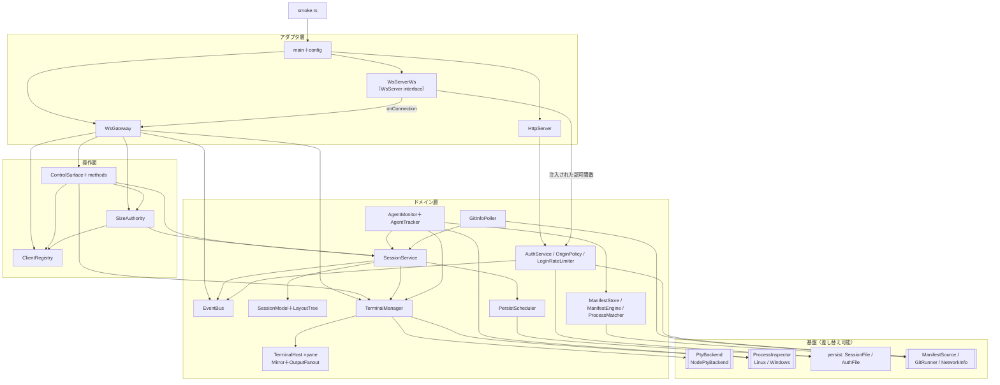
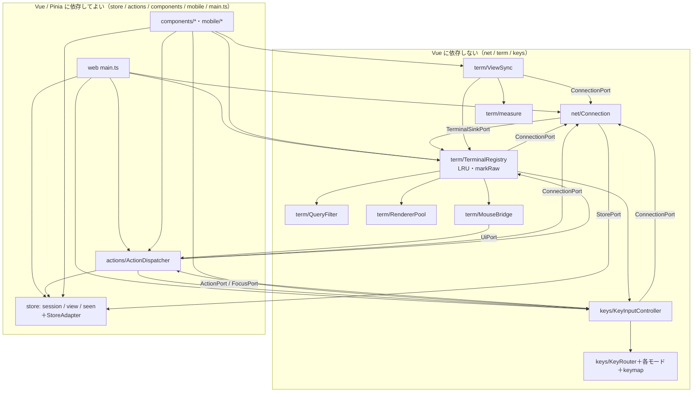
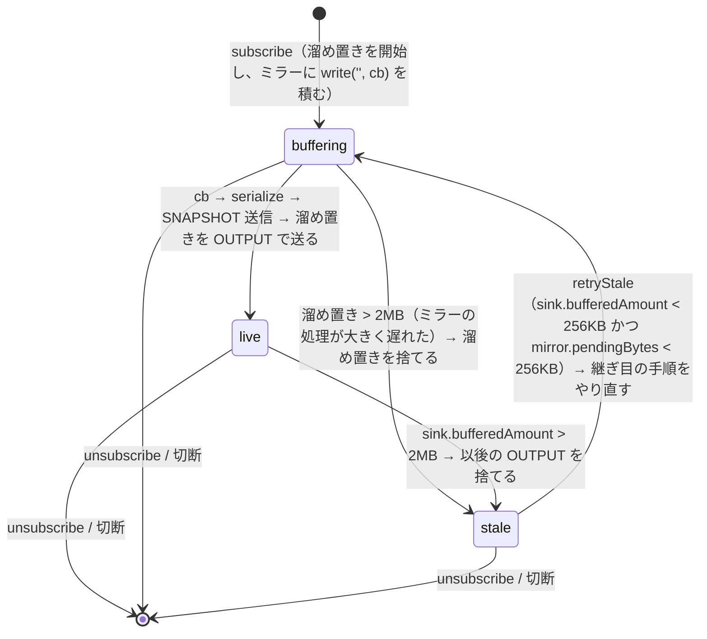
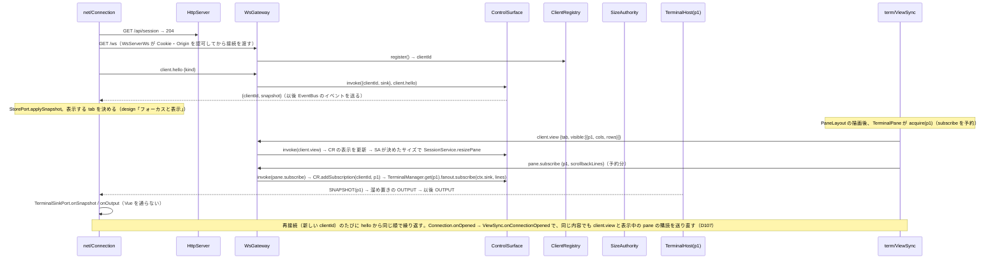
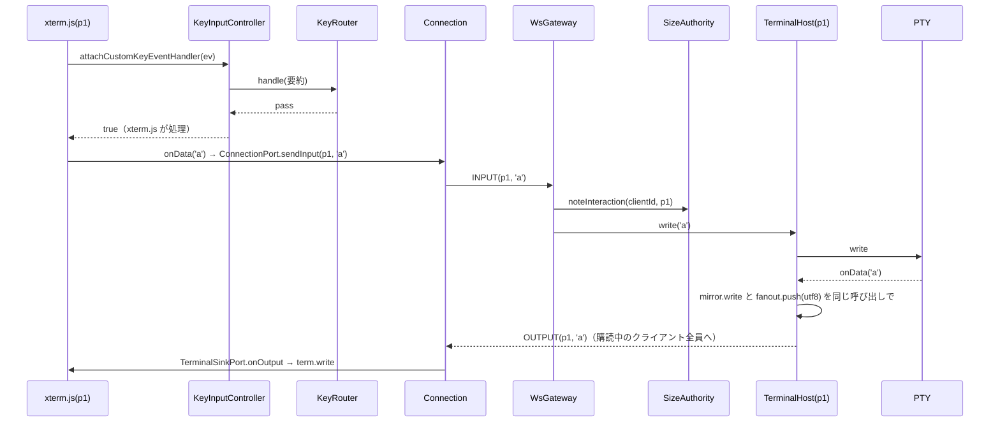
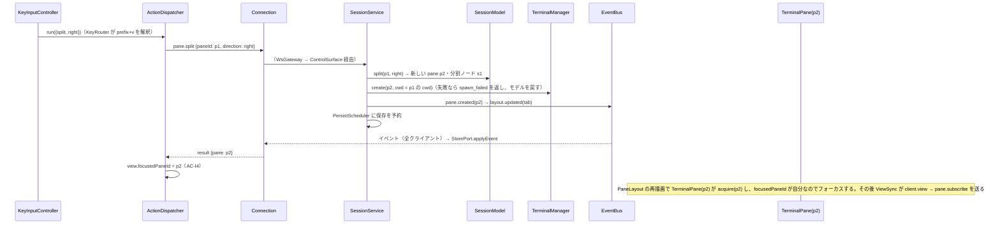
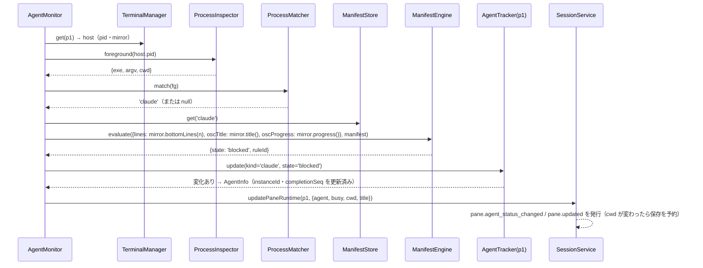

# 設計: Web ターミナルマルチプレクサ（herdr 相当）— MVP 基盤の構造

> 前提：design.md（承認済み）と decisions.md の D25〜D31。**購読の方式（D30）と xterm.js の寿命（D28）は、この文書を正とする**
> （design.md の方針 5 を改めた）。出典の略記は research.md と同じ。
> 改訂：独立点検（1 巡目・29 件）を受けて全体を整理した（2026-09-18）。

## アーキテクチャ概要

3 つのパッケージからなる。依存の向きは次のとおり。

- `web` と `server` は `protocol` にだけ依存し、互いには依存しない。
- `protocol` は外部に依存しない。例外は入力の検証に使う zod（D29）。

**サーバは 4 つの層に分かれる**（D25 の「3 層」は、アダプタ・操作面・ドメインの 3 つを指す。その下に差し替え可能な基盤を置く）。





- 循環している辺（`CONN`⇄`REG`、`REG`→`KIC`→`AD`→`REG`、`REG`→`MB`→`AD`）は **port を組み立ての後に bind する 2 段階**で解く（「設計判断」の DI の行）。

**依存の規則**（review で点検する）

1. **サーバは上の層から下の層へだけ依存する**（層を飛ばすのはよい。逆向きは禁止）。
   - ドメイン層は `ws`・`http` を import しない。
   - node-pty・`/proc`・`@vscode/windows-process-tree`・`fs`・`child_process`・`os.networkInterfaces()` は基盤の中だけで使い、ドメイン層は interface 越しに使う
     （`PtyBackend`・`ProcessInspector`・`SessionFile`/`AuthFile`・`ManifestSource`・`GitRunner`・`NetworkInfo`）。
2. **`ControlSurface` のハンドラは、呼び出し元のトランスポートを知らない。**
   受け取るのは `ctx: MethodContext`（`clientId` と、アダプタが実装した `ClientSink`）と、検証済みの `params` だけ。
3. **SessionModel を書き換えるのは `SessionService` だけ**（イベントの発行と保存の予約も一緒に行うため）。
   `AgentMonitor`・`GitInfoPoller`・`SizeAuthority` も、`SessionService` の更新用メソッドを呼ぶ。
4. **Web の `net/`・`term/`・`keys/` は、Vue と Pinia を import しない。**
   Vue と Pinia に依存してよいのは `store/`・`actions/`・`components/`・`mobile/`・`main.ts`。
   `net/` と `term/` がストアや UI に触れるときは、port（interface）越しにする。port の実装は `main.ts` で渡す。
5. **端末の出力のバイト列は、`net/Connection` →（`TerminalSinkPort`）→ `term/TerminalRegistry` → xterm.js の経路だけを通る**（D16）。
   ストアや Vue の ref に入れない。
6. **ログ（`log/Logger`）と小さな純関数（`util/net` の `isLoopback` 等）は全モジュールが使う横断的な部品**なので、図では省く。

## コンポーネント / モジュール

### サーバ（`packages/server/src/`）

| モジュール | 層 | 責務 | 依存する相手 |
|---|---|---|---|
| `main.ts` | アダプタ | CLI（`serve` / `token reset`。引数の解釈は `cliArgs.ts`）、部品の組み立て（composition root。DI のライブラリは使わずコンストラクタで渡す）、`AuthService.ensureToken()` の結果に応じた URL の表示（初回だけ token 付き。表示する行は純関数の `startupBanner.ts`）、**作った token を必ず一度表示する**（`listen()` の後の何の失敗でも、起動の途中の終了のシグナルでも。D103）、終了のシグナル（SIGINT・SIGTERM・SIGHUP。`listen()` の前から受け付け、起動の途中ならその段を終えてから `close()`。D103）の処理。引数の誤り（未知のコマンド・サブコマンド、`token reset` に serve のオプション）は終了コード 2。`token reset` は状態ディレクトリのロックを取ってから `auth.json` を書き換える（`wtm serve` が動いていれば終了コード 2。D103） | 全部 |
| `config.ts` | アダプタ | 起動オプションの解釈と検証。**ループバック以外で証明書が無ければエラー**（終了コード 2）。状態ディレクトリと既定値（D20・D22）。`ConfigError`（終了コード 2）の文言：待ち受けの失敗の判定と案内（`isBindFailure`（`syscall` で見る）・`listenFailureHint`（`code` で見る）・両方を合わせた `bindFailureHint`。D102・D103 で 1 か所に）・同じ状態ディレクトリの使用中（`stateDirInUseError`。D103） | `util/net`（`isLoopback`。横断） |
| `http/HttpServer` | アダプタ | 静的配信（`web/dist`）、`POST /api/login`・`POST /api/logout`・`GET /api/session`、セキュリティヘッダ、TLS（`config` の結果に従うだけ）。解釈できない request-target は 400（ログに書かない。`util/net` の `requestPathname`）、想定外の失敗の error 行は `LogThrottle` で間引く（D103）。`/api/login` の Origin の検査は `OriginRejectionLog.admit`。`/api/session` は Cookie が有効なときだけ `OriginRejectionLog.admitGet`（Host。Origin が付いていればそれも。不可なら 403。Cookie が無効なら Host を問わず 401。D106）。静的ファイルと `/api/logout` は検査しない | `AuthService`・`OriginRejectionLog`（必須。`OriginPolicy` を持つ）・`LoginRateLimiter` |
| `ws/WsServer`（interface）・`ws/WsServerWs` | アダプタ | upgrade の受け付け。Origin を `OriginRejectionLog.admit`（不可なら記録して 403。D102・D103）で、Cookie を注入された認可関数（`AuthService`）で検証する（不可なら 401）。解釈できない request-target は 400（ログに書かない）、想定外の失敗の error 行は `LogThrottle` で間引く（D103）。起動の途中（`setReady(false)` の間）は 503。permessage-deflate（D31）。接続ができたら `onConnection` で `WsGateway` に渡す | `ws`・`OriginRejectionLog`（必須。`HttpServer` と同じ実体）・注入された認可関数 |
| `ws/WsGateway` | アダプタ | 1 接続の寿命（`WsServer` の `onConnection` で `WsConnection` とセッションの id を受け取る）。接続時に `ClientRegistry.register` で clientId を得る。`WsConnection.onDrain` で `fanout.retryStale()` を呼ぶ。切断時は `ClientRegistry.subscriptions(clientId)` の各 pane で `fanout.unsubscribe` を呼んでから `unregister`。`auth.session_revoked` を受けたら、そのセッションの接続を close コード `4401` で閉じる。JSON → `ControlSurface.invoke`、INPUT → `TerminalManager.get(paneId).write`、入力を `SizeAuthority.noteInteraction` に通知。`EventBus` の購読と送信。`ClientSink` の実装。不正なフレームの計数（10 秒の窓は単調な時計で測る・差し替え可。D106）。close コード `4401`／`1008` | `ControlSurface`・`ClientRegistry`・`SizeAuthority`・`EventBus`・`TerminalManager` |
| `surface/ControlSurface` | 操作面 | 方式名 → `{ schema, handler }` の登録表。zod で検証して呼び、例外を `{ code, message }` に変換する | （登録された `methods/*`） |
| `surface/methods/*.ts` | 操作面 | 方式ごとのハンドラ：`workspace` / `tab` / `pane` / `layout` / `client`（hello・view・fit・detach）/ `subscribe`（`pane.subscribe`・`unsubscribe`） | `SessionService`・`ClientRegistry`・`SizeAuthority`・`TerminalManager` |
| `clients/ClientRegistry` | 操作面 | 接続中のクライアント（clientId の払い出し・kind・fit・表示中の tab と申告されたサイズ・最後に操作した時刻・購読中の pane） | なし |
| `clients/SizeAuthority` | 操作面 | tab ごとのサイズ権限の決定と移譲（design「サイズ権限」）。権限を持てるのはデスクトップと `client.fit` を有効にしたクライアントだけで、`noteInteraction`・`onViewChanged`・`onFitChanged`・`onKindChanged`・移譲のどれもこれを確かめる。fit を有効にしたら種別を問わず取り、資格を失ったら（fit の無効化・hello し直した種別）手放す（D13・D106）。決まったサイズを `SessionService.resizePane` に渡す | `ClientRegistry`・`SessionService` |
| `bus/EventBus` | ドメイン | 型付きのイベントの発行と購読。**同期**で呼ぶ（発行した順に届く） | なし |
| `session/SessionModel` | ドメイン | workspace / tab / pane の保持（Map）、id の払い出し（`nextId`）、レイアウトの操作（`LayoutTree` を使う）。**副作用なし** | `session/LayoutTree` |
| `session/LayoutTree` | ドメイン | 二分木の純関数：split・remove・swap・neighbor（方向の隣）・cycleOrder・setRatio・resizeBy・findSplit・leaves | なし |
| `session/SessionService` | ドメイン | **モデルを書き換える唯一の入口**。利用者の操作（作成・分割・閉じる等）と、実行時の情報の更新（`resizePane`・`updatePaneRuntime`（busy・cwd・title・agent）・`updateWorkspaceGit`）。<br/>検証 → モデルの変更 → 端末の生成・破棄 → イベント → 保存の予約（構造と cwd が変わったとき）。<br/>`TerminalManager.create` のたびに `TerminalHost.onExit` を購読し、シェルの終了で `pane.exited` と連鎖して閉じる処理（D18）を行う。workspace が 0 個になったときの自動作成（D24）。起動時の `restore` | `SessionModel`・`TerminalManager`・`EventBus`・`PersistScheduler` |
| `session/PersistScheduler` | ドメイン | 保存の予約を 500ms まとめて `SessionFile.save` を呼ぶ。終了時は即時に書く | `SessionFile` |
| `terminal/TerminalManager` | ドメイン | pane の id → `TerminalHost` の対応（`get`）。`PtyBackend.spawn` でシェルを起動し（既定シェルは `ProcessInspector.defaultShell()`）、得た `PtyProcess` を渡して `TerminalHost` を作る（`create`）。`resize`・`dispose` | `PtyBackend`・`TerminalHost`・`ProcessInspector` |
| `terminal/TerminalHost` | ドメイン | pane 1 つ分の端末。`PtyProcess`（注入）＋`Mirror`＋`OutputFanout`＋流量制御（下記） | `Mirror`・`OutputFanout` |
| `terminal/Mirror` | ドメイン | `@xterm/headless` の包み。未処理のバイト数の計上、serialize、問い合わせへの応答（`onResponse` → PTY）、色の問い合わせへの応答の追加（D17）、OSC 0/2・7・9;4 の取得、判定用の下部の行の取り出し | `@xterm/headless`・`@xterm/addon-serialize` |
| `terminal/OutputFanout` | ドメイン | 購読者ごとの状態（下記）。溜め置き・スナップショットの継ぎ目・停滞と再開 | `Mirror` |
| `agent/AgentMonitor` | ドメイン | 判定の周期（出力あり 500ms / なし 1 秒）と、pane ごとの `AgentTracker`。結果を `SessionService.updatePaneRuntime` で反映する | `TerminalManager`・`SessionService`・`ProcessInspector`・`ProcessMatcher`・`ManifestStore`・`ManifestEngine` |
| `agent/AgentTracker` | ドメイン | 1 pane 分の状態（kind・instanceId・state・completionSeq・serverSeenSeq）と遷移（design「エージェントの状態」） | なし |
| `agent/ManifestStore` | ドメイン | 判定ルールの読み込み（ファイルの取得は `ManifestSource` 越し）と、正規表現の変換（U2） | `smol-toml`・`ManifestSource` |
| `agent/ManifestEngine` | ドメイン | ルールの評価（純関数）：region の切り出し・照合・`priority`・`skip_state_update` | なし |
| `agent/ProcessMatcher` | ドメイン | 前面プロセスの情報 → エージェントの種類（純関数の対応表） | なし |
| `git/GitInfoPoller` | ドメイン | workspace の cwd ごとに 5 秒間隔でブランチと ahead/behind を取り、変化したら `SessionService.updateWorkspaceGit` | `SessionService`・`GitRunner` |
| `auth/AuthService` | ドメイン | 初回の token の生成（`ensureToken`）、token の検証（scrypt）、セッションの発行と失効（失効時は `auth.session_revoked` を発行。知らないセッションの logout では `auth.json` を書き直さない。D103）、Cookie の解釈（`%` の並びが壊れた値はセッション無し。D103）、`wtm token reset`、upgrade の認可関数（`AuthorizeUpgrade`。型もここで定義する）の提供 | `AuthFile`・`EventBus`・`OriginPolicy` |
| `auth/OriginPolicy` | ドメイン | 許可ホストの計算（ループバック・待ち受けアドレス・全インタフェース・`--origin`）と Origin の判定（`isAllowed`）・Host だけの判定（`isHostAllowed`：許可ホストか `--origin` の Origin の `URL.host`——既定ポートの Origin なら `host:443`／`host:80` も。Origin を付けない GET 用。D106） | `NetworkInfo`・`util/net` |
| `auth/OriginRejectionLog` | ドメイン | Origin の検査と拒否のログ（`HttpServer`・`WsServerWs` で共通の 1 つ。`composeServer` が作って両方に渡す**必須の依存**——省けたころは、省くと `extraOrigins` の無い別の実体を黙って作り間引きの状態も分かれた。D103）。`admit(r, deny)` が判定（`OriginPolicy`）→ 記録 → `deny`（呼び出し側の 403）を 1 か所で行う（D103）。`admitGet(r, deny)` は Origin を付けない GET（`/api/session`）向けで、Origin が無ければ Host だけで判定する（D106）。記録（`origin rejected` の warn）：接続元・Origin・Host・許可ホスト・`--origin` の値（`extraOrigins`）。同じ接続元・Origin・Host は 60 秒に 1 回（`suppressed`）・組を問わず全体でも 60 秒に 20 行まで（`LogThrottle`。超えた件数は次の行の `suppressedOverall`）・200 文字で切る・表は 1000 件で空にする（D102）。時間は単調な時計で測る（D103） | `OriginPolicy`・`log/Logger`・`log/LogThrottle` |
| `auth/LoginRateLimiter` | ドメイン | ログインの失敗回数の計数（IP ごとに 1 分 5 回・1 時間 20 回。時計は単調な `performance.now()`・差し替え可。D106） | なし |
| `pty/PtyBackend`（interface）・`pty/NodePtyBackend` | 基盤 | シェルの起動。Windows では `useConptyDll` と `WTM_WINDOWS_CONPTY` の切替 | node-pty |
| `platform/ProcessInspector`（interface）・`LinuxProcessInspector`・`WindowsProcessInspector` | 基盤 | 前面プロセス（pid・argv・cwd）、busy、既定シェル | `/proc`・`@vscode/windows-process-tree` |
| `persist/SessionFile`・`persist/AuthFile` | 基盤 | 原子的な書き込み（一時ファイル → rename）、壊れたファイルの退避（最新 3 件）、権限（0600） | `fs` |
| `persist/StateDirLock` | 基盤 | 状態ディレクトリの排他のロック（`<状態ディレクトリ>/wtm.lock`、中身は pid とホスト名。`wx` で作る。使用中——ホスト名が違う（pid の生死を確かめられない）・自分の pid でこのプロセスが持っている・生きている pid——なら `StateDirInUseError`、そうでなければ取り直す。pid だけの古い形は同じホストとみなす。`release` は自分の pid・ホスト名のときだけ消し、失敗しても投げない（warn）。`isAlive`・`hostname` は差し替えられる。D103） | `fs`・`os.hostname()`・`process.kill(pid, 0)`・`log/Logger` |
| `infra/FsManifestSource`・`infra/ChildProcessGitRunner`・`infra/OsNetworkInfo` | 基盤 | `ManifestSource`（判定ルールのファイルの列挙と読み込み）・`GitRunner`（`git` の実行）・`NetworkInfo`（インタフェースの IP とホスト名）の実装 | `fs`・`child_process`・`os` |
| `util/net` | 横断 | `isLoopback(host)`・`lanIpv4Addresses`・`accessUrls`（URL にできないホストは並べない。D103）・`requestPathname`（HTTP の request-target の解釈。origin-form は固定の基底に文字列として連結して読むので `//foo` もただの経路。`*` 等は `undefined`。D103）等の純関数（OS に触れない） | なし |
| `log/Logger`・`log/LogThrottle` | 横断 | stderr と `<状態ディレクトリ>/server.log` への出力（MVP はローテーションなし）。`LogThrottle` は認証前の誰でも起こせる経路のログを窓（60 秒。単調な時計 `performance.now()` で測る）ごとに上限（20 行）までに抑え、書かなかった件数を次の行に渡す（D103） | なし |
| `smoke.ts` | アダプタ | 起動確認（D15）。`main` と同じ部品を空きポート・一時ディレクトリで組み、正規のログイン → workspace の作成 → echo の往復を確かめて終了 | `main` の部品 |

### Web（`packages/web/src/`）

| モジュール | Vue / Pinia | 責務 | 依存する相手 |
|---|---|---|---|
| `main.ts` | 可 | 部品の組み立て（Pinia・StoreAdapter・Connection・QueryFilter・RendererPool・MouseBridge・KeyRouter・KeyInputController・TerminalRegistry・ViewSync・ActionDispatcher）。循環する port は作った後に `bind` する（2 段階） | 全部 |
| `net/ports.ts` | **不可** | Web の port の型の定義（下記「Web の主要な型と port」） | なし |
| `net/Connection` | **不可** | ログイン（`POST /api/login`）・ログアウト・`/api/session` の確認。WebSocket の接続と再接続（1〜30 秒の倍々）。要求と応答の対応付け（id）。snapshot とイベントを `StorePort` へ、OUTPUT / SNAPSHOT / `pane.size_changed` を `TerminalSinkPort` へ振り分ける。`client.detach` の後は再接続しない（「再接続」ボタンで `connect()`）。`/api/session` が 403 なら `/ws` を 1 回だけ試し、それも開く前に閉じたら `onConnectionState('rejected')` にして繋ぎ直さない（「再試行」ボタンで `connect()`）。`/api/session` は 204 なのに開く前に閉じる試みが 3 回続いたら `onOriginRejectSuspected(true)`（開けたら false）。新しい接続で `client.hello` が通るたびに `onOpened`、閉じるたびに `onClosed` の listener を呼ぶ（`main.ts` が `ViewSync.onConnectionOpened`／`onConnectionClosed` をつなぐ。D107）。`ConnectionPort` を実装する | `StorePort`・`TerminalSinkPort`（どちらも `bind` で渡す） |
| `store/session`・`store/view`・`store/seen` | 可 | design と同じ（構造と状態・このクライアントの表示とモード・`instanceId` ごとの既読）。集約（D19）と done の導出の getter | なし |
| `store/StoreAdapter` | 可 | `StorePort` の実装（snapshot とイベントを各ストアに反映する） | 各ストア |
| `term/TerminalRegistry` | **不可** | pane の id → `TermEntry`（xterm.js・アドオン・DOM 要素・WebGL の有無・`CopyTarget`）。**LRU（デスクトップ 24・モバイル 2。D28）**。副作用のない参照は `get`。<br/>生成時に `QueryFilter`・`MouseBridge`・`KeyInputController` を xterm.js に取り付け、`term.onData` を `ConnectionPort.sendInput(paneId, …)` につなぎ、`pane.subscribe` を**予約**する（送るのは `ViewSync`）。新しい接続では全ての端末を未購読に戻し（`markAllUnsubscribed`）、表示したときに購読し直す（xterm.js は作り直さない）。xterm.js は SNAPSHOT に求める行数と同じ `scrollback` で作る（`getScrollbackLines`。D107）。破棄時に `pane.unsubscribe` を送る。`TerminalSinkPort` を実装する（SNAPSHOT は書き込みの列の中で RIS（`\x1bc`）で消してから書く——まだ処理していない前の書き込みを重ねない。D107） | `ConnectionPort`・`QueryFilter`・`RendererPool`・`MouseBridge`・`KeyInputController` |
| `term/ViewSync` | **不可** | 表示が変わるたびに、**`client.view`（表示とサイズ）→ 予約された `pane.subscribe`** の順で送る（サイズを決めてからスナップショットを取るため）。枠の大きさから cols/rows を計算する（枠は葉の要素で測る。表示が 1 つの pane だけで commit に `measureSinglePane` が付いていればそれで測る——モバイルは表示領域。2 つ以上なら使わず葉を測る。D108）。同じ内容は送らないが、新しい接続の hello の後（`onConnectionOpened`）は送り直し、root の `PaneLayout` が付けた関数（`attachCommitter`）で今の表示を commit し直す。新しい接続で最初の `client.view` を送った直後に `onViewEstablished` の listener を呼ぶ（04 が `client.fit` を送り直す口）。閉じてから次の hello まで（`onConnectionClosed` → `onConnectionOpened`）は何も送らない（D107） | `ConnectionPort`・`TerminalRegistry`・`measure` |
| `term/measure` | **不可** | 枠の大きさ → cols/rows（xterm.js のセルの寸法から） | なし |
| `term/QueryFilter` | **不可** | ブラウザ側で握りつぶす問い合わせの登録（D17） | なし |
| `term/RendererPool` | **不可** | WebGL の割り当て（表示中の最大 12・モバイル 2）と `onContextLoss` での DOM への切替 | なし |
| `term/clipboard` | **不可** | `navigator.clipboard` への書き込みと、失敗時の知らせ（M4 と copy モードの yank で共用） | なし |
| `term/MouseBridge` | **不可** | 選択の終了時のクリップボードへのコピー（M4。`term/clipboard`）、リンクの起動（M6：web-links と OSC 8 の `linkHandler`。Ctrl／macOS は Cmd を押しながらの主ボタンのクリックで、http/https だけを開く。下線・指のカーソルは修飾キーを押している間だけ——OSC 8 の提供元は xterm.js の内部で登録されるので、内部の `_linkProviderService` の各提供元の `provideLinks` を包んでリンクの `decorations` を差し替える。D110）、右クリックの振り分け（M7：アプリへ渡すか、`UiPort.openContextMenu` を呼ぶか。メニューを開くときは、`term.element` のキャプチャの mousedown で xterm.js の右ボタンの報告を止め、同じボタンの mouseup も止める——取りこぼしたら blur・次の押下や動きで待ちを外し、最後に離したボタンなら報告にならない mouseup で xterm.js の追跡を終わらせる。D110） | `UiPort`（`ActionDispatcher` が実装） |
| `keys/keymap` | **不可** | herdr の既定キー表（MVP の行と「後続」の行。design「既定のキー」） | なし |
| `keys/KeyRouter` | **不可** | モードの状態機械（terminal / prefix / navigate / copy / resize / dialog）。**モードの唯一の持ち主**。入力はキーイベントの要約、出力は `KeyDecision`。navigate / copy / resize の各モードの解釈は下の 3 つに委ねる | `keymap`・各モード |
| `keys/NavigateMode`・`keys/CopyMode`・`keys/ResizeMode` | **不可** | 各モードの内部状態とキーの解釈。どれも `Action`（copy は `{ type: 'copy', cmd }`）を返すだけで、副作用を持たない | なし |
| `keys/KeyInputController` | **不可** | 各 xterm.js の `attachCustomKeyEventHandler`（`attach`）と、端末以外にフォーカスがあるときの `keydown`（`handleDomKey`）と、モバイルの追加キー（`injectKey`）を受ける。`KeyRouter.handle` の結果に従う：`pass` なら xterm.js へ、`consume` なら捨てる、`send` なら `ConnectionPort.sendInput`、`action` なら `ActionPort.run`。モードの変更（`setMode`）を仲介し、変化を `ModeSink`（view ストア）へ知らせる | `KeyRouter`・`ActionPort`・`FocusPort`・`ModeSink`（いずれも `bind` で渡す）・`ConnectionPort` |
| `actions/ActionDispatcher` | 可 | `Action` の実行：方式の呼び出し、ストアの更新（表示・ダイアログ）、モードの変更は `KeyInputController.setMode` 経由、copy の命令を `TerminalRegistry.get(paneId).copy` へ（得たテキストは `term/clipboard` で書く）。ログイン・再接続の画面からの要求を `Connection` へ渡す。`ActionPort`・`UiPort`・`FocusPort` を実装する | `ConnectionPort`・各ストア・`TerminalRegistry`・`KeyInputController`・`term/clipboard` |
| `components/*` | 可 | Sidebar（Space パネル＝workspace の Tree、Agent パネル）・TabBar・PaneLayout（レイアウト木の再帰描画。描画後に `ViewSync` を呼ぶ。root は mount 時に `ViewSync.attachCommitter` へ commit の関数を付ける。`followResize`（デスクトップの本体だけ）なら葉を `ResizeObserver` で見て、大きさが変われば 100ms に 1 回まで commit し直す（間引きは `term/resizeThrottle`。モバイルと共有）。D107。`measureSinglePane`（モバイルの `MobileShell` だけ）は commit の `measureSinglePane` へ渡す。D108。`paneFrames`（デスクトップの本体だけ）なら各葉を `PaneFrame` で包む。D110）・PaneFrame（pane の枠：葉（測る要素）の外側の 4px の縁。右クリックは常にその pane のメニューを開き、押下は pane を選んで端末にフォーカスする。キーボードでは APG の menu button で、Tab で止まるのは選ばれている pane の枠だけ。枠の中にフォーカスがあるまま外れたら、選ばれている pane の端末へ移す。D110）・Splitter・TerminalPane（`TerminalRegistry.acquire` で要素を借りて差し込み、`view.focusedPaneId` が自分ならフォーカスする。端末の入力欄を Tab で止まる場所にするのは選ばれている pane だけ。D110）・ContextMenu（Esc・項目の選択で閉じたら、開く前にフォーカスしていた要素へ戻す。もう文書に無ければ選ばれている pane の端末へ。D110）・NameDialog・ConfirmDialog・HelpDialog・GotoPicker・LoginView・DetachedView・ReconnectOverlay（`rejected` では理由・`--origin <このページの Origin>`・「再試行」。D107）・PrefixIndicator・Toast | 各ストア・`TerminalRegistry`・`ViewSync`・`ActionDispatcher` |
| `mobile/*` | 可 | MobileShell（1 列）・ExtraKeys（one-shot / lock。押したキーを `KeyInputController` へ流す）・PanePicker・fit の切替（`useFitToScreen`。有効なら新しい接続の `ViewSync.onViewEstablished` で `client.fit` を送り直し、hello の通った接続が無い間は送らない。D108）・縮小表示・表示領域での申告と追従（`usePaneArea`：`PaneLayout` の `measureSinglePane` に表示領域の大きさを返す関数を渡し、表示領域を `ResizeObserver` で見て 100ms に 1 回まで `commitView`（`term/resizeThrottle`）。visual viewport の高さはピンチの拡大率を掛け戻して当てる（`useVisualViewportHeight`）。D108）・タッチのスクロール（U4） | 同上＋`KeyInputController`・`ViewSync` |

## インターフェース / データモデル

design.md の「インターフェース / データ構造」を前提に、構造を決めるための interface を定める。

### 方式の追加と変更（D30）

| 方式 | params | result | 備考 |
|---|---|---|---|
| `client.hello` | `{ protocol: 1, kind }` | `{ clientId, snapshot }` | clientId は接続時に `ClientRegistry.register` が払い出したもの（ctx と同じ値を返す） |
| `client.view` | `{ workspaceId, tabId, visible: [{ paneId, cols, rows }] }` | `{}` | **表示とサイズの申告だけ**（サイズ権限に使う）。design の `panes`・`scrollbackLines` はここから外した |
| `pane.subscribe` | `{ paneId, scrollbackLines }` | `{ cols, rows }` | 以後、この pane の SNAPSHOT → OUTPUT を送る。`scrollbackLines` は `limits.scrollbackLines` で切り詰める |
| `pane.unsubscribe` | `{ paneId }` | `{}` | この pane の OUTPUT を止める |

### サーバの主要な interface

```ts
// pty/PtyBackend.ts —— 差し替え点（D9）
interface PtySpawnOptions { shell: string; args: string[]; cwd: string; env: Record<string, string>; cols: number; rows: number }
interface PtyProcess {
  readonly pid: number;
  onData(cb: (chunk: string) => void): Disposable;   // node-pty は UTF-8 を復号した文字列で渡す
  onExit(cb: (e: { exitCode: number; signal?: number }) => void): Disposable;
  write(data: string | Uint8Array): void;
  resize(cols: number, rows: number): void;
  pause(): void; resume(): void;                     // E4
  kill(): void;
}
interface PtyBackend { spawn(opts: PtySpawnOptions): PtyProcess }

// ws/WsServer.ts —— 差し替え点（D9）
interface WsConnection {
  sendText(json: string): void; sendBinary(frame: Uint8Array): void;
  readonly bufferedAmount: number;
  onText(cb: (s: string) => void): void; onBinary(cb: (b: Uint8Array) => void): void;
  onDrain(cb: () => void): void; onClose(cb: (code: number) => void): void;
  close(code: number, reason: string): void;
}
// AuthorizeUpgrade の型は auth/AuthService.ts（ドメイン層）で定義し、アダプタ層がそれを import する（規則 1 の向き）
// type AuthorizeUpgrade = (req: { headers: Record<string, string | undefined>; remoteAddress: string }) => { ok: true; sessionId: string } | { ok: false };
interface WsServer { onConnection(cb: (conn: WsConnection, sessionId: string) => void): void }   // WsServerWs は AuthorizeUpgrade を受け取って作る

// terminal/OutputFanout.ts
interface ClientSink {                                // WsGateway が接続ごとに実装する
  readonly clientId: string;
  sendOutput(paneId: string, chunk: Uint8Array): void;
  sendSnapshot(paneId: string, cols: number, rows: number, text: string): void;
  readonly bufferedAmount: number;
}
interface OutputFanout {
  subscribe(sink: ClientSink, scrollbackLines: number): void;   // 継ぎ目の手順（design）を内部で行う
  unsubscribe(clientId: string): void;
  push(chunk: Uint8Array): void;                     // PTY の出力（TerminalHost が呼ぶ）
  retryStale(): void;                                // stale の購読者について、再開の条件を満たせば継ぎ目の手順をやり直す
}

// terminal/TerminalHost.ts
interface TerminalHost {
  readonly paneId: string; readonly pid: number;
  readonly mirror: Mirror; readonly fanout: OutputFanout;
  write(input: Uint8Array | string): void;            // ブラウザからの INPUT
  resize(cols: number, rows: number): void;           // PTY とミラーの両方
  lastOutputAt(): number;                             // AgentMonitor の周期に使う
  onExit(cb: (code: number) => void): Disposable;
  dispose(): void;
}
interface Mirror {
  write(chunk: string, done?: () => void): void; pendingBytes(): number;
  onDrained(cb: () => void): Disposable;              // pendingBytes が 256KB を下回ったとき
  serialize(scrollbackLines: number): { cols: number; rows: number; text: string };
  bottomLines(n: number): string[];                   // 画面（alt なら alt）の下部。判定用
  title(): string; progress(): string | null; cwdHint(): string | null;   // OSC 0/2・9;4・7
  onResponse(cb: (data: string) => void): Disposable;  // 問い合わせへの応答 → PTY
  resize(cols: number, rows: number): void;
}

// surface/ControlSurface.ts
interface MethodContext { clientId: string; sink: ClientSink }   // sink はトランスポートに依存しない interface（規則 2）
interface MethodDef<P, R> { schema: z.ZodType<P>; handler(ctx: MethodContext, params: P): Promise<R> | R }
class ControlSurface {
  register<P, R>(name: MethodName, def: MethodDef<P, R>): void;
  invoke(ctx: MethodContext, name: string, rawParams: unknown): Promise<Result>;   // 検証・例外の変換を一手に持つ
}

// session/SessionService.ts（抜粋。実行時の情報の更新口。規則 3）
interface PaneRuntimePatch { busy?: boolean; cwd?: string; title?: string; agent?: AgentInfo | null }
interface SessionService {
  resizePane(paneId: string, cols: number, rows: number): void;             // → TerminalManager.resize → pane.size_changed
  updatePaneRuntime(paneId: string, patch: PaneRuntimePatch): void;          // → pane.updated / pane.agent_status_changed（cwd の変化は保存を予約）
  updateWorkspaceGit(workspaceId: string, git: Workspace['git']): void;      // → workspace.updated
  restore(data: SessionFileData): void;                                     // 起動時の復元（design「再起動後の復元」）
  // 利用者の操作（createWorkspace・split・close…）は design の方式の表に対応する
}

// terminal/TerminalManager.ts
interface TerminalManager {
  get(paneId: string): TerminalHost | undefined;
  create(paneId: string, opts: { cwd: string; shell?: string; cols: number; rows: number }): TerminalHost;   // 失敗は例外（spawn_failed）
  resize(paneId: string, cols: number, rows: number): void;
  dispose(paneId: string): void;
}

// そのほかの部品（シグネチャのみ）
interface ClientRegistry {
  register(kind?: ClientKind): string;                // clientId を払い出す（hello で kind を確定）
  unregister(clientId: string): void;
  setView(clientId: string, view: ClientView): void; setFit(clientId: string, on: boolean): void;
  addSubscription(clientId: string, paneId: string): void; removeSubscription(clientId: string, paneId: string): void;
  subscriptions(clientId: string): string[];
}
interface SizeAuthority { noteInteraction(clientId: string, paneId: string): void; onViewChanged(clientId: string): void; onFitChanged(clientId: string): void /* client.fit の後。D106 */; onKindChanged(clientId: string): void /* client.hello の後。D106 */; onClientGone(clientId: string): void }
interface PersistScheduler { touch(): void; flush(): Promise<void>; cancel(): void /* 復元の前に失敗した起動の予約を取り消す（D102） */ }
interface SessionFile { load(): Promise<{ kind: 'ok'; data: SessionFileData } | { kind: 'missing' } | { kind: 'corrupt'; backupPath: string }>; save(data: SessionFileData): Promise<void> }
interface ManifestSource { list(): Promise<string[]>; read(name: string): Promise<string> }
interface GitRunner { run(cwd: string, args: string[], timeoutMs: number): Promise<{ code: number; stdout: string }> }
interface NetworkInfo { addresses(): string[]; lanAddresses(): string[] /* 表示用。仮想ブリッジを除く（D101・D102） */; hostnames(): string[] }
interface ManifestStore { get(kind: string): CompiledManifest | undefined }
function match(fg: ForegroundProcess): string | null;                     // ProcessMatcher
interface AgentTracker { update(kind: string | null, state: AgentState | 'skip'): AgentInfo | null | 'unchanged' }
interface AuthServiceApi { ensureToken(): Promise<{ created: boolean; token?: string }>; /* ほか login・logout・verify・reset */ }

// platform/ProcessInspector.ts
interface ForegroundProcess { pid: number; exe: string; argv: string[]; cwd: string | null }
interface ProcessInspector {
  foreground(shellPid: number): Promise<ForegroundProcess | null>;   // シェル自身が前面ならシェルの情報
  isBusy(shellPid: number, fg: ForegroundProcess | null): boolean;
  defaultShell(): { shell: string; args: string[] };
}

// agent/ManifestEngine.ts（純関数）
interface DetectionSnapshot { lines: string[]; oscTitle: string; oscProgress: string | null }
function evaluate(snap: DetectionSnapshot, m: CompiledManifest): { state: AgentState; ruleId: string | null } | 'skip';
```

### 購読者の状態（`OutputFanout`）



- `retryStale` を呼ぶのは 2 か所：`WsGateway`（`WsConnection.onDrain`）と `TerminalHost`（`Mirror.onDrained`）。停滞の原因がブラウザ側でもミラー側でも、回復したら再開できる。
- **試行の世代**：継ぎ目の手順を始めるたびに、購読者ごとの世代番号を 1 増やし、`write('', cb)` の `cb` に世代番号を持たせる。
  `cb` が呼ばれたとき、世代が現在と違えば何もしない（捨てた試行・やり直した試行の古い `cb` で serialize しない）。

### 流量制御と文字列の変換（`TerminalHost`）

- PTY の `onData(chunk: string)` を受けたら、同じ呼び出しの中で次の 2 つを行う。これで、ミラーと購読者の順序が一致する。
  - `Mirror.write(chunk)` を呼ぶ。
  - `OutputFanout.push(utf8(chunk))` を呼ぶ。`TextEncoder` で 1 回だけ変換する。
- `Mirror.pendingBytes() > 1MB` で `pty.pause()` する。`Mirror.onDrained`（< 256KB）で `pty.resume()` と `fanout.retryStale()` を呼ぶ（design「流量制御」）。

### Web の主要な型と port

```ts
// net/ports.ts —— Vue に依存しない境界（規則 4）
interface ConnectionPort {
  request<M extends MethodName>(method: M, params: ParamsOf<M>): Promise<ResultOf<M>>;
  sendInput(paneId: string, bytes: string | Uint8Array): void;
  login(token: string): Promise<boolean>; logout(): Promise<void>;       // POST /api/login・/api/logout
  connect(): void;                                                       // 初回・ログイン後・「再接続」ボタン
}
interface StorePort {
  applySnapshot(s: SessionSnapshot): void; applyEvent(e: ServerEvent): void; onAuthRequired(): void;
  onConnectionState(s: 'connecting' | 'open' | 'reconnecting' | 'detached' | 'rejected'): void;   // rejected：/api/session が 403 で /ws も開く前に閉じた（D107）
  onOriginRejectSuspected(suspected: boolean): void;   // /api/session は 204 なのに /ws が開く前に閉じる試みが続いた（D107）
}
interface TerminalSinkPort {
  onOutput(paneId: string, chunk: Uint8Array): void;
  onSnapshot(paneId: string, cols: number, rows: number, text: string): void;   // resize → write('\x1bc' + text)（RIS を書き込みの列の中で。D107）
  onSizeChanged(paneId: string, cols: number, rows: number): void;              // pane.size_changed を受けたとき
}
interface ActionPort { run(action: Action): void }
interface UiPort { openContextMenu(target: MenuTarget, at: { x: number; y: number }): void; toast(message: string): void }
interface FocusPort { focusedPaneId(): string | null }
interface ModeSink { onModeChange(m: Mode): void }                       // view ストアへ（PrefixIndicator 等が読む）

// keys/KeyInputController.ts
interface KeyInputController {
  attach(term: Terminal, paneId: string): Disposable;                    // attachCustomKeyEventHandler を登録する
  handleDomKey(ev: KeyboardEvent): boolean;                             // 端末以外にフォーカスがあるとき
  injectKey(k: KeyInput): void;                                          // モバイルの追加キーの列
  setMode(m: Mode): void;                                                // ActionDispatcher がダイアログ等で呼ぶ
  bind(ports: { action: ActionPort; focus: FocusPort; mode: ModeSink }): void;
}

// term/ViewSync.ts
interface ViewSync {
  commit(view: {
    workspaceId: string; tabId: string; visible: { paneId: string; element: HTMLElement }[];
    measureSinglePane?: (paneId: string, element: HTMLElement) => { width: number; height: number };   // 表示が 1 つの pane だけのとき、葉の代わりに枠を測る（モバイルは表示領域。D108）
  }): void;                                            // client.view → 予約分の pane.subscribe
  attachCommitter(commit: () => void): () => void;     // root の PaneLayout が今の表示で commit し直す関数を付ける（D107）
  onConnectionOpened(): void;                          // 新しい接続の hello の後：lastPayload を捨て、全部を未購読にし、commit し直す（D107）
  onConnectionClosed(): void;                          // 閉じた：次の onConnectionOpened まで何も送らない（D107）
  onViewEstablished(listener: () => void): () => void; // 新しい接続の最初の client.view の直後（pane.subscribe より前）。04 の client.fit の送り直し（D107）
}
// net/Connection.ts（ConnectionPort の外。main.ts が使う）
//   onOpened(listener: (clientId: string) => void): () => void   // 新しい接続で client.hello が通るたび（D107）
//   onClosed(listener: () => void): () => void                   // WebSocket が閉じるたび（開く前に閉じた試みを含む。D107）

// keys/KeyRouter.ts —— Vue にも DOM にも依存しない
type Mode = 'terminal' | 'prefix' | 'navigate' | 'copy' | 'resize' | 'dialog';
interface KeyInput { key: string; code: string; ctrl: boolean; alt: boolean; shift: boolean; meta: boolean; type: 'keydown' | 'keyup' | 'keypress'; composing: boolean }
type KeyDecision =
  | { kind: 'pass' }                                  // xterm.js に渡す（terminal モードの通常の入力）
  | { kind: 'consume' }                               // 何もせず捨てる（割り当ての無いキー・keydown 以外のイベント等）
  | { kind: 'send'; bytes: string }                   // 端末へ直接送る（Ctrl+B Ctrl+B → '\x02'）
  | { kind: 'action'; action: Action };
type CopyCommand =
  | { op: 'move'; unit: 'char' | 'word' | 'WORD' | 'wordEnd' | 'WORDEnd' | 'paragraph' | 'page' | 'halfPage' | 'line'; dir: -1 | 1 }
  | { op: 'searchStart'; dir: -1 | 1 } | { op: 'searchInput'; text: string } | { op: 'searchNext'; reverse: boolean }
  | { op: 'selectStart'; linewise: boolean } | { op: 'yank' } | { op: 'clearOrExit' } | { op: 'exit' };
type Action =
  | { type: 'split'; dir: 'right' | 'down' } | { type: 'focusDir'; dir: Dir } | { type: 'swap'; dir: Dir }
  | { type: 'cyclePane'; delta: 1 | -1 } | { type: 'closePane' } | { type: 'zoom' } | { type: 'renamePane' }
  | { type: 'newTab' } | { type: 'tabDelta'; delta: 1 | -1 } | { type: 'tabIndex'; index: number }
  | { type: 'renameTab' } | { type: 'closeTab' }
  | { type: 'newWorkspace' } | { type: 'renameWorkspace' } | { type: 'closeWorkspace' }
  | { type: 'enterMode'; mode: 'navigate' | 'copy' | 'resize' } | { type: 'help' } | { type: 'goto' }
  | { type: 'toggleSidebar' } | { type: 'detach' } | { type: 'notYet'; work: string }   // 後続のキー
  | { type: 'navigate'; op: 'up' | 'down' | 'paneDir' | 'activate' | 'cancel'; dir?: Dir }
  | { type: 'resizeBy'; dir: Dir; amount: number } | { type: 'copy'; cmd: CopyCommand } | { type: 'exitMode' };
class KeyRouter {
  constructor(keymap: Keymap, clock: { now(): number; setTimeout(fn: () => void, ms: number): unknown; clearTimeout(h: unknown): void });
  readonly mode: Mode;
  handle(k: KeyInput): KeyDecision;                    // 3 秒の prefix の時間切れ（D21）は clock で扱う
  setMode(m: Mode): void;                              // ダイアログを開いた / 閉じた等、外からの遷移
  onModeChange(cb: (m: Mode) => void): void;
}

// term/TerminalRegistry.ts（TerminalSinkPort を実装する）
interface CopyTarget { apply(cmd: CopyCommand): { copiedText?: string; exited?: boolean } }   // xterm.js の buffer・選択・search アドオンの包み
interface TermEntry { paneId: string; term: Terminal; element: HTMLElement; webgl: boolean; lastUsed: number; copy: CopyTarget }
class TerminalRegistry implements TerminalSinkPort {
  constructor(capacity: number, conn: ConnectionPort, renderers: RendererPool, keys: KeyInputController, mouse: MouseBridge, queries: QueryFilter);
  get(paneId: string): TermEntry | undefined;           // 副作用なし
  acquire(paneId: string): TermEntry;                  // 無ければ作り、pane.subscribe を予約する。あれば LRU を更新する
  release(paneId: string): void;                       // 表示から外れた（保持は続ける）
  evictIfNeeded(): void;                               // 上限を超えたら、表示していない最古のものを破棄 → pane.unsubscribe
  takePendingSubscriptions(shown: Iterable<string>): string[];   // 表示する pane のうち今の接続で未購読のもの。ViewSync が client.view の後に送る
  markAllUnsubscribed(): void;                         // 新しい接続の hello の後（D107）
  focus(paneId: string): void;
}
```

## 処理フロー / シーケンス

### 1. 接続と初回表示



### 2. キー入力とエコー（非機能要件「応答性」の経路）



### 3. pane の分割



### 4. tab の切替（D28 の LRU）

1. `ActionDispatcher` が `store/view` の tab を変える。
2. `PaneLayout` が描き直され、新しい tab の各 `TerminalPane` が `TerminalRegistry.acquire` を呼ぶ。
   - **保持している pane**：DOM 要素を差し込むだけ（再受信なし）。
   - **保持していない pane**：xterm.js を作り、`pane.subscribe` を予約する。
3. 前の tab の pane は `release` する（保持は続く）。
   `evictIfNeeded` が、上限を超えた分だけ表示していない最古の pane を破棄し、`pane.unsubscribe` を送る。
4. `ViewSync` が `client.view`（表示とサイズ）→ 予約した `pane.subscribe` の順に送る。

### 5. エージェントの判定の 1 周期



- `ProcessInspector` の呼び出しは pane ごとに直列化し、前の周期が終わっていなければその pane を飛ばす（Windows のプロセスツリーの取得が遅いときの詰まりを防ぐ）。

### 6. 起動と再起動後の復元

1. `main` が `config` で起動オプションを検証する。ループバック以外で証明書が無ければ終了コード 2。
2. `composeServer` が部品を組み立てる。auth.json はまだ読まない（ロックを取った後に `listen()` で読む。D103）。証明書・秘密鍵を読めない・
   解釈できなければ終了コード 2。`WsServerWs` は `/ws` を受け付けない状態で作る（`setReady(false)`）。
3. `listen()` が次の順に進める（D102・D103。**ロックと待ち受けを最初に行う**）。
   0. **状態ディレクトリのロック**（`StateDirLock`。`<状態ディレクトリ>/wtm.lock`）。別の wtm が使っていれば
      `stateDirInUseError`（`ConfigError`。終了コード 2）。ポートを変えれば bind は両方成功するので、bind だけでは同じ
      状態ディレクトリの二重起動（手元用 7780 と LAN 用 8443 等）を止められない（D103）。続けて **auth.json を読む**
      （`AuthService.initialize()`。組み立ての時点では読まない——ロックの前に走った `wtm token reset` を見落とさないため）。
      以降の段で失敗したら、復元前の保存の予約を取り消してからロックを放して reject する（`main` は `close()` を呼ばずに終わる）。
   1. **待ち受け（bind）**。失敗（`EADDRINUSE`・`EACCES`・`EADDRNOTAVAIL`・`ENOTFOUND`・`EAI_AGAIN`）は reject し、`main` が
      `bindFailureHint`（`config.ts`。`syscall` が bind・名前解決のものだけ）の案内をつけて終了コード 2 にする。ここまでで
      失敗した起動は token を作らず・シェルを起動せず・`session.json`・`auth.json` に触れない（`close()` も、復元する前なら
      `session.json` へ書かない）。
   2. **token**：`AuthService.ensureToken()`。無ければ作る（`freshToken`。この後の段で失敗して `listen()` が reject しても
      読める——`main` は失敗の表示の前に token を表示する。**作った token は必ず一度表示される**）。
   3. **復元**：`SessionFile.load()` の結果で分かれる。
      - **ある**：`SessionService.restore(data)` が `SessionModel` を復元し、`nextId` を引き継ぐ。
        各 pane の `TerminalManager.create` を行い、失敗した pane は `status: 'failed'` にする。
      - **無い**：workspace を 1 つ作る（D24 と同じ処理。`ensureNotEmpty`）。
      - **壊れている**：`SessionFile` が `session-backups/` へ退避し、空で始める。
   4. **poller**：`GitInfoPoller`・`AgentMonitor` を開始する。
   5. **`/ws` の受け付けを始める**（`setReady(true)`）。それまでの upgrade は 503——復元は bus にイベントを出さないので、
      途中で hello したクライアントは作りかけのスナップショットのまま取り残されるため。HTTP（静的配信・`/api/*`）は
      bind の直後から応じる。
4. `listen()` が resolve してから、`main` が `wtm: listening on <host> port <port> (<scheme>)` と開ける URL
   （`startupLines`・`accessUrls`：`--origin` を先頭に、`localhost`・LAN の IPv4。URL にできないホストは並べない）を表示する。
   token を作ったときだけ `#token=` を付ける（URL が 1 つも無ければ token を単独で表示する）。`main` は `listen()` から表示までを
   1 つの try で囲み、**token を作った後に何が起きても**（`listen()` の後段の失敗・表示の組み立ての失敗）、まだ表示して
   いなければ終わる前に token を表示する（表示の失敗では `close()` してから終わる。D103）。
5. 終了のシグナル（SIGINT・SIGTERM・SIGHUP。`main` は `listen()` の前から受け付ける。起動の途中で受けたら作った token を
   表示し、`listen()` の段を終えてから）を受けたら（`close()`）、`/ws` の受け付けを止め（`setReady(false)`）→ `PersistScheduler.flush()`
   （復元を済ませる前なら `cancel()` で予約を取り消し、書かない）→ 全 `TerminalHost.dispose()` → 接続を閉じる →
   **状態ディレクトリのロックを放す**（途中で失敗しても放す。放すこと自体の失敗は warn だけ。D103）→ 終了する。落ちて残ったロックは、次の起動が pid を見て
   取り直す。
6. `wtm token reset` は同じロックを取ってから `auth.json` を書き換え、放す。`wtm serve` が動いていれば断る（終了コード 2。
   動いている側は token をメモリに持ったまま `auth.json` を読み直さず、次のログイン等で古い token に書き戻すため。D103）。

### 7. 認証の流れと切断の見分け

- `Connection` は WebSocket を開く前と、`close` を受けた後に `GET /api/session` を呼ぶ。
  - 401 なら `StorePort.onAuthRequired`（`LoginView` へ移る）。
  - 204 なら再接続する（1〜30 秒の倍々）。
  - サーバは、Cookie が有効でも Host（と、付いていれば Origin）が許可外なら 403 を返す（`/ws` も 403 になる宛先。D106）。
    403 なら `/ws` を 1 回だけ試す（`/ws` は Origin で許すので、Host を書き換える前段のプロキシの下ではつながる）。それも開く前に
    閉じたら `onConnectionState('rejected')`：繋ぎ直さず、`ReconnectOverlay` が理由と `--origin <このページの Origin>` と
    「再試行」（`connect()`）を出す。`/api/session` が 204 なのに開く前に閉じる試みが 3 回続いたら `onOriginRejectSuspected(true)`：
    繋ぎ直しは続け、`ReconnectOverlay` が「再接続中…」に Origin の拒否かもしれないことと `--origin` の行を添える。`store/view` は `rejected` でも `authRequired` を下ろす（403 は Cookie が有効な証拠。
    ログイン画面の「接続中…」のまま止めない。D107）。
  - 新しい接続で `client.hello` が通るたびに `onOpened` → `ViewSync.onConnectionOpened`：サーバは接続ごとに新しい clientId に
    購読・表示・fit を持つので、同じ内容でも `client.view` を送り直し、表示中の pane を購読し直す（D107）。
- close コード `4401` を受けたら、`/api/session` を待たずに `onAuthRequired` を呼ぶ。
- `client.detach` の後は `onConnectionState('detached')`（`DetachedView` と「再接続」ボタン）とし、自動では再接続しない。

## 設計判断

| # | 採用 | 退けた案と理由 |
|---|---|---|
| D25 | アダプタ・操作面・ドメインの 3 層（＋差し替え可能な基盤）。`ControlSurface` をトランスポートから独立させる | WebSocket のハンドラが直接モデルを触る案：後続の API で作り直しになる |
| D26 | pane ごとに `TerminalHost`（PTY＋ミラー＋配信＋流量制御）をまとめる | 3 つを別サービスにする案：継ぎ目と流量制御の順序の保証が分散する |
| D27 | Pinia＋Vue の外の `TerminalRegistry`＋純粋な `KeyRouter`。`net/`・`term/`・`keys/` は port 越しに UI とつなぐ | `reactive()` のモジュール：開発ツールで追えない。状態機械を Vue の中に置くと単体テストが重い |
| D28 | 表示したことのある pane の xterm.js を LRU で保持（24 / 2） | 破棄して作り直す：切替のたびに serialize（5,000 行で 56ms/pane）が単一スレッドを止める。すべて保持：メモリが pane の総数に比例 |
| D29 | zod 4・smol-toml・ws・Vitest・Playwright | TypeBox：JSON Schema は得られるが、zod 4 も書き出せる |
| D30 | 購読（`pane.subscribe`）と表示の申告（`client.view`）を分け、`ViewSync` が「view → subscribe」の順に送る | 1 つの方式にまとめる：D28 で範囲が一致しなくなった |
| D31 | permessage-deflate（1KB 以上だけ） | 圧縮なし：スナップショットが約 10 倍の大きさになる（evidence） |
| 新 | `EventBus` は同期で配り、ドメイン層に置く | 非同期のキュー：発行順と継ぎ目の順序の推論が難しくなる。操作面に置く：ドメインが上の層に依存してしまう |
| 新 | モデルを書き換える入口を `SessionService` 1 つにする（規則 3） | 判定や git の部品が直接書き換える：イベントの発行と保存の予約が漏れる |
| 新 | `MethodContext` に `ClientSink` を含める | ハンドラが clientId から sink を探す：操作面が接続の登録簿を持つことになる |
| 新 | DI のライブラリを使わず、`main.ts`（サーバと Web のそれぞれ）でコンストラクタに渡す。**循環する port（Web の `Connection`⇄`TerminalRegistry` 等）は、作った後に `bind` で渡す 2 段階** | DI コンテナ：部品は各 20 程度で、明示的な組み立てで足りる |
| 新 | OS に触る処理（ファイル・`git`・ネットワークの情報）は、ドメイン層から基盤の interface（`ManifestSource`・`GitRunner`・`NetworkInfo`）越しに使う | ドメインから直接呼ぶ：規則 1 に反し、単体テストで偽物に差し替えられない |
| 新 | モードの持ち主は `KeyRouter` 1 つにし、view ストアは `ModeSink` で写しを受ける | ストアとルーターの両方で持つ：食い違ったときにどちらが正か決められない |
| 新 | 開発時は Vite の dev サーバが `/api` と `/ws` をサーバへ中継し、本番はサーバが `web/dist` を配る | 本番でも別のサーバで配る案：Origin が 2 つになり、許可リストが複雑になる |

## tasks への申し送り

- **分割の単位**：上の 2 つの表のモジュールが、そのまま 1〜数タスクの単位になる。
  純関数の部品（`LayoutTree`・`SessionModel`・`ManifestEngine`・`ProcessMatcher`・`KeyRouter` と各モード・`SizeAuthority` の判定）は、単体テストを先に書ける。
  `OriginPolicy` も `NetworkInfo` を偽物に差し替えれば同じように試験できる。
- **順序の示唆**（依存の向きに沿い、下の層から積む）
  1. 足場：pnpm workspace・tsconfig・lint・Vitest。`third_party/herdr` の取り込みと NOTICE。`util/net`・`config.ts`・`log/Logger`。
  2. `protocol`：型・zod スキーマ・フレームのコーデック・既定のテーマ（色の問い合わせの応答にサーバも使う）。既定のキー表は Web の `keys/keymap` に置く（サーバは使わない）。
  3. 基盤：`persist/SessionFile`・`AuthFile`、`pty/PtyBackend`（node-pty）、`platform/ProcessInspector`（Linux）、`infra/*`（`ManifestSource`・`GitRunner`・`NetworkInfo`）。
  4. ドメインの純粋な部品：`LayoutTree`・`SessionModel`・`EventBus`。
  5. 端末：`Mirror`・`OutputFanout`・`TerminalHost`・`TerminalManager`。継ぎ目と流量制御は、偽の `PtyProcess` で単体テストする。
  6. **認証**：`AuthService`・`OriginPolicy`・`LoginRateLimiter` と `HttpServer`。WebSocket を開ける前に入れる（design「ドメイン固有の考慮」）。
  7. `SessionService`・`PersistScheduler`・復元（`restore`）。
  8. 操作面とアダプタ：`ControlSurface`・`methods/*`・`ClientRegistry`・`SizeAuthority`・`WsGateway`・`WsServerWs`。
  9. エージェント：`ManifestStore`（23 ファイルの読み込みテスト＝U2）・`ManifestEngine`（U1 の region の意味を herdr のソースで確かめてから）・`ProcessMatcher`・`AgentTracker`・`AgentMonitor`。
     その後、`ProcessInspector` の Windows 版。
  10. `GitInfoPoller`・`main.ts`（全部品の組み立て）・`smoke.ts`（ここで `aidev smoke` が通る状態にする）。
  11. Web の土台（Vue に依存しない部品）：`net/ports.ts`・`net/Connection`・`term/measure`・`term/QueryFilter`・`term/RendererPool`・`term/clipboard`。
  12. キーとマウス（Vue に依存しない部品）：`keys/keymap`・`KeyRouter`・`NavigateMode`・`CopyMode`（＋`CopyTarget`）・`ResizeMode`・`KeyInputController`・`term/MouseBridge`。
  13. `term/TerminalRegistry`・`term/ViewSync`・`store/*`・`StoreAdapter`・`actions/ActionDispatcher`・Web の `main.ts`。
  14. 描画部品：`PaneLayout`・`Splitter`・`TerminalPane`・`Sidebar`・`TabBar`・`LoginView`・`DetachedView`・`ReconnectOverlay`、
      `NameDialog`・`ConfirmDialog`・`HelpDialog`・`GotoPicker`・`PrefixIndicator`・`ContextMenu`・`Toast`。
  15. モバイル：`mobile/*`（1 列・追加キーの列・fit・縮小表示・タッチのスクロール）。
  16. E2E（Playwright）・性能の計測（AC17）・docs（TLS・WSL2・検証手順）・3 OS の検証（AC16）。
- **並行化の余地**：2 の後は、サーバ（3〜10）と Web（11〜15）を分けて進められる。9 の `ManifestEngine` はほかと独立している。
- **subtask への分割の検討**：規模が大きいので、tasks で subtask 分割を判定する価値がある。
  候補は「サーバの基盤（1〜8・10）」「エージェント判定（9）」「Web UI（11〜14）」「モバイル（15）」「検証（16）」。
  ただし 1 本の PR で着地させる前提（D2）なので、検証（16）は全体の統合後になる。
- **最初に確かめる未確認事項**：U1（region の意味）・U2（正規表現の変換）・U4（タッチスクロール）・D18 / D19 / D21 / D23 の herdr の実際の挙動（ソースで確認）。
  結果によっては、判定エンジンとキーの細部が変わる。
