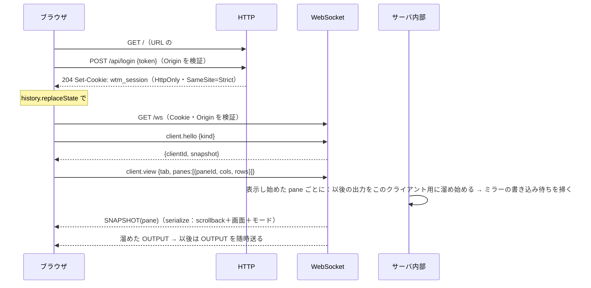
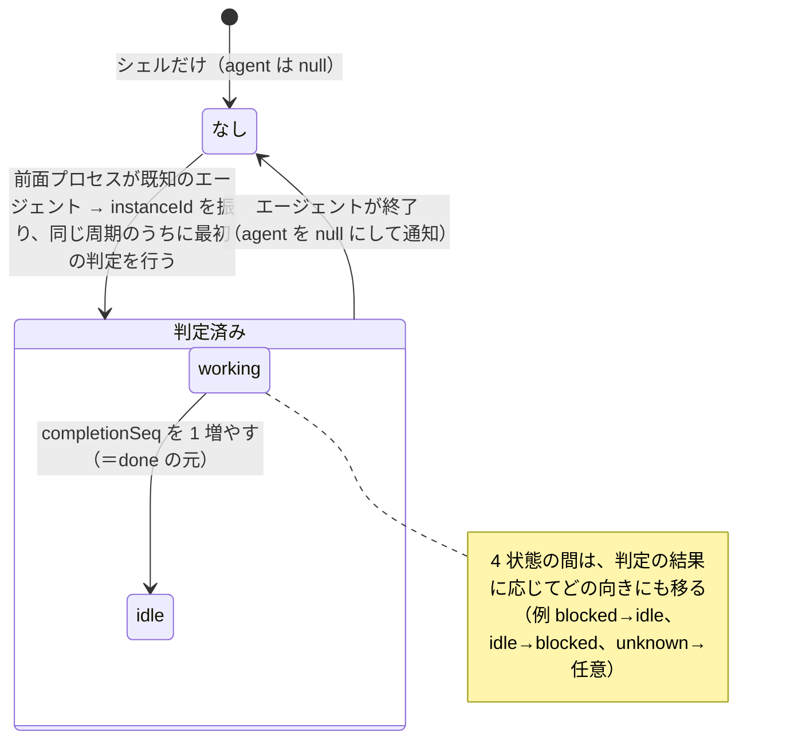
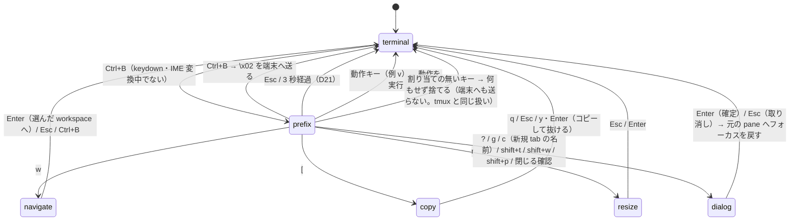

# 仕様: Web ターミナルマルチプレクサ（herdr 相当）— MVP 基盤

## 概要

1 ホスト上で常駐する **Node.js のサーバ**と、ブラウザで動く **Vue 3 の Web UI** の 2 つで構成する。

- **サーバの役割**
  - pane ごとに PTY（node-pty）を持つ。PTY の出力はサーバ側のエミュレータ（`@xterm/headless`）にも流し、画面の状態を常に保持する。
  - ブラウザが 1 台も繋がっていなくてもプロセスと画面の状態を持ち続ける（AC8）。
  - 再接続したブラウザには、画面を serialize して送る。
  - workspace / tab / pane の構成を `session.json` に保存し、再起動後にレイアウトを復元する（AC18）。
  - 前面プロセスと画面の下部から、エージェントの 4 状態（blocked / working / idle / unknown）を判定する。
    5 つ目の `done` は、ブラウザが既読の情報から導く（AC6）。判定には herdr の判定ルール（Apache-2.0）を同梱して使う。
- **Web UI の役割**
  - pane ごとに xterm.js を置き、サイドバー・tab バー・分割・ダイアログ・モバイル UI を Vue で描く。
  - キー操作は herdr 互換の prefix 方式（`Ctrl+B`）で行う。

両者は **1 本の WebSocket** で通信する。制御は JSON（herdr の socket API に寄せた方式名）、端末の入出力はバイナリで送る。
**アクセスには、localhost でも常に認証が要る**。ループバック以外で待ち受けるときは TLS が必須。

```mermaid
flowchart LR
  subgraph Browser["ブラウザ（Vue 3＋xterm.js）"]
    UI[Vue コンポーネント<br/>サイドバー / tab バー / 分割 / ダイアログ]
    ST[(構造・状態ストア<br/>reactive)]
    XT[pane ごとの xterm.js<br/>※出力は state を通さない]
    KM[キー操作<br/>prefix の状態機械]
  end
  subgraph Server["サーバ（Node.js 24）"]
    AU[認証<br/>token→Cookie・Origin 検証]
    HUB[クライアント管理<br/>表示中 pane・サイズ権限]
    SS[セッション<br/>workspace/tab/レイアウト]
    PH[PtyBackend<br/>node-pty]
    MI[端末ミラー<br/>@xterm/headless＋serialize]
    AD[エージェント判定<br/>前面プロセス＋herdr ルール]
    PS[(session.json<br/>auth.json)]
    GT[git 情報<br/>Space 行]
  end
  UI <--> ST
  KM --> UI
  XT -- 入力バイト --> WS((WebSocket 1 本))
  ST <-- JSON 制御/イベント --> WS
  WS -- 出力バイト/スナップショット --> XT
  WS <--> AU --> HUB
  HUB <--> SS
  SS --> PH
  PH -- 出力 --> MI
  MI -- 問い合わせへの応答 --> PH
  MI --> AD
  PH --> AD
  SS <--> PS
  AU <--> PS
  SS --> GT
  PH -- 出力（ミラーと並列に転送） --> HUB
```

> 出典の略記（`[H]`・`[H-cfg]`・`[H-root]`）は research.md の冒頭と同じ。herdr v0.9.1 のドキュメント・設定リファレンス・リポジトリ直下を指す。

## 設計方針

decisions.md の D9〜D16 で承認された方針に従う。要点と、この文書で新たに決めたことを並べる。
D15（プロセス構成・永続化の書き方・レイアウトのモデル・リポジトリ構成・smoke）はそれぞれ該当する節で引く。

1. **サーバは Node.js 24 LTS＋TypeScript**（D9）。
   PTY（`PtyBackend`）と WebSocket サーバ（`WsServer`）は interface の裏に置き、Bun 等へ差し替えられるようにする。
2. **Web UI は Vue 3＋Vite＋xterm.js 6**（D10）。
3. **端末の出力は Vue のリアクティブな状態を通さない**（D16）。受け取ったバイト列は、pane ごとの xterm.js へ直接 `write()` する。
   Vue が持つのは構造（workspace / tab / レイアウト）と状態（エージェント・サイズ等）だけ。
4. **WebSocket は 1 本**。制御は herdr の socket API に寄せた方式名の JSON、端末の入出力はバイナリで送る（D11）。
   後続「外部操作 API / CLI」は、同じ操作面をローカルソケットで公開すれば済むようにする。
5. **出力は、そのクライアントが画面に表示している pane の分だけ流す**（D11。surface interest）。
   表示し始めたときにスナップショットを送り、以後は差分を流す。
   〔architecture で変更（D28・D30）〕「表示している pane」は「ブラウザが保持している pane（LRU）」に改めた。購読は `pane.subscribe` / `pane.unsubscribe` で行い、詳細は architecture.md を正とする。
6. **端末からの問い合わせ（DA1・CPR 等）にはサーバのミラーだけが応答する**（新規。D17）。
   - ミラーが標準で応答しない色の問い合わせ（OSC 4/10/11/12）には、サーバが既定のテーマの色で応答する処理を足す（E1）。
   - ブラウザ側の xterm.js は同じ問い合わせに応答しないよう、パーサで握りつぶす。
   - 応答元を 1 つにしないと、ブラウザの台数分だけ応答が重複して PTY に届く。
   - ブラウザが 1 台も無いときにも応答できる（Windows の新しい ConPTY は DA1 の応答を待つ。research.md F8.8）。
7. **常に認証する**（D12）。ループバック以外で待ち受けるときは証明書が必須。
8. **サイズは herdr 互換**：同じ tab を見ているクライアントのうち、最後に操作したものが決める。モバイルは既定でサイズを決めない（D13）。
9. **状態判定は herdr の判定ルールを同梱し、判定エンジンを TypeScript で実装する**（D14）。MVP で検証するのは Claude Code と Codex。
10. **既定キーは herdr の既定値のうち、MVP の機能に対応するもの**。後続の機能に当たるキーは「未対応（後続）」と案内する。
11. **Windows 固有の差は `platform/` に閉じ込める**：PTY の起動、前面プロセスの検出、作業ディレクトリの取得。

### この文書で新たに決めたこと（decisions.md に追記する）

- **D17**：問い合わせへの応答はサーバのミラーだけが行う（方針 6）。
- **D18**：pane のシェルが終了したら、その pane を閉じる（tmux の既定と同じ）。最後の pane なら tab を、最後の tab なら workspace を閉じる。
  **herdr の挙動は未確認**。
- **D19**：状態の集約は **blocked ＞ done ＞ working ＞ idle ＞ unknown** の順で、上位の状態を代表として出す。
  herdr は「blocked は上位を blocked に見せる」「working は workspace を active に見せる」「done は見るまで残る」とだけ書いており（`[H]agents.mdx:94-96`）、working と done の順は未確認。
  利用者の対応が要る順に並べた。
- **D20**：scrollback の既定は **5,000 行**（上限は起動オプションで 10,000 行まで）。
  1 万行で 1 pane 約 25MB、16 pane で約 400MB を実測した（evidence/README.md）。
  herdr の既定は「pane あたり 10MB」（`[H-cfg]advanced.scrollback_limit_bytes`）で、単位が違う。
- **D21**：prefix 待ちは 3 秒で解除する（AC-I1 の「一定時間」）。**herdr の挙動は未確認**。
- **D22**：製品の仮称とコマンド名は `wtm`（web terminal multiplexer）。状態ディレクトリ名は `web-tn-multiplexer`。
- **D23**：resize モードのキーは `h/j/k/l` と矢印で、1 回ごとに境界を 2% 動かす。
  閉じる前に確認するのは、対象に `busy` の pane を含むときと、workspace を閉じるとき。**herdr の該当の挙動は未確認**（U3）。
- **D24**：workspace が 1 つも無くなったら、サーバが新しい workspace をホームディレクトリで自動的に作る。
  herdr は「workspace が無ければ自動で 1 つ開く」（`[H]quick-start.mdx:16`）。

## 対象範囲

リポジトリは空なので、すべて新規に追加する。pnpm workspace で 3 パッケージに分ける（D15）。

```text
package.json / pnpm-workspace.yaml / tsconfig.base.json / .gitignore
LICENSE（本製品）/ NOTICE（herdr 由来の資産の表示。D5）
third_party/herdr/
  LICENSE                      … herdr の Apache-2.0 全文
  README.md                    … 取得元のコミット（da6bcd5。research.md の出典の略記を参照）・取得日・変更点
  agent-detection/*.toml       … herdr の判定ルール 23 ファイル（無改変で同梱）
packages/protocol/             … サーバとブラウザが共有する型・定数・バイナリフレームのコーデック
  src/{ids,model,messages,events,frames,errors,keys}.ts
packages/server/               … Node.js サーバ
  src/main.ts                  … CLI（serve / token reset）
  src/config.ts                … 起動オプション・状態ディレクトリ
  src/http/                    … 静的配信・/api/login・/api/logout・セキュリティヘッダ・TLS
  src/auth/                    … token・セッション Cookie・試行回数の制限・Origin 検証
  src/ws/                      … WsServer（interface）＋ ws 実装・フレームの送受信・流量制御
  src/clients/                 … クライアントの登録・表示中 pane・サイズ権限
  src/session/                 … workspace/tab/pane のモデル・レイアウト木・操作・イベント発行
  src/persist/                 … session.json・auth.json の読み書き
  src/pty/                     … PtyBackend（interface）＋ node-pty 実装
  src/mirror/                  … @xterm/headless のミラー・serialize・OSC の取得
  src/agent/                   … 前面プロセスの特定・判定ルールのエンジン・状態の管理
  src/platform/{linux,windows}.ts … OS 固有の差（前面プロセス・cwd・既定シェル）
  src/git/                     … Space 行のブランチと ahead/behind
  src/smoke.ts                 … 起動確認（AC とは別。`pnpm smoke`）
packages/web/                  … Vue 3 の Web UI
  src/main.ts / App.vue
  src/net/                     … WebSocket 接続・再接続・フレームの振り分け
  src/store/                   … 構造と状態のストア（reactive）。出力は持たない
  src/term/                    … xterm.js の生成・破棄・WebGL の割り当て・問い合わせの握りつぶし・サイズ計算
  src/keys/                    … キーマップ・prefix の状態機械・各モード（navigate / copy / resize）
  src/components/              … Sidebar・TabBar・PaneLayout・Splitter・TerminalPane・ContextMenu・
                                  RenameDialog・ConfirmDialog・HelpDialog・GotoPicker・LoginView・
                                  MobileShell・ExtraKeys・PrefixIndicator・ReconnectOverlay
  src/mobile/                  … モバイル判定・縮小表示・修飾キーの one-shot / lock
e2e/                           … Playwright（デスクトップ Chrome・モバイルのエミュレーション）
docs/                          … 利用手順（TLS 証明書・WSL2 から LAN へ出す方法・3 OS での検証手順）
```

- 変更する既存ファイル：`.aidev/config.yml` の `smokeCommand`（D3 の宿題）、`.gitignore`。

## 依拠する既存の事実

**既存コード：該当なし。** リポジトリには `.aidev/`・`.gitignore`・`.git/` しかない。
aidev-00-start で `ls -la` を実行して確認し、以後この work 以外の変更は無い。

外部の事実（この設計が前提にしているもの）：

- **E1** `@xterm/headless` 6.0.0 の問い合わせへの応答（手元で実行して確認した。`evidence/query-response.mjs`・`query-response-2.mjs`、`evidence/README.md`）
  - **`onData` で応答するもの**：DA1・DA2・CPR（DSR 6）・DSR 5・DECRQM・DECRQSS。
  - **応答しないもの**：OSC 4/10/11/12 の色の問い合わせ、XTVERSION、XTWINOPS 18、kitty keyboard の問い合わせ。
  - `parser.registerCsiHandler` / `registerOscHandler` を持つ。
- **E2** `@xterm/addon-serialize` 0.14.0 について
  - 書き出すもの：scrollback・alt 画面・主要なモード。
  - 書き出さないもの：OSC 8 のリンクと画像（research.md F8.4。xterm.js #4531・#5845）。
  - 「experimental」と明記されている（README を直接確認。research.md F8.4）。
- **E3** 解析速度と serialize の時間
  - VT の解析は Node 24 で約 52MB/s（実測。evidence/README.md）。
  - serialize は scrollback 1 万行で約 57ms（同上）。
  - メモリは 1 pane 約 25MB（120 桁・1 万行。同上）。
- **E4** node-pty 1.2.0-beta.15 の型定義に `pause()` / `resume()` / `useConptyDll` / `process` がある（`npm pack` で確認。evidence/README.md）。
  1.2 系から Linux 向けのビルド済みバイナリがある（research.md F8.1）。
- **E5** `@vscode/windows-process-tree` 0.8.0 が npm に公開されている（`npm view` で確認）。子孫プロセスの走査に使う（research.md F8.11）。
- **E6** Linux の前面プロセスは `/proc/<pid>/stat` の第 8 欄（tpgid）で取れる（research.md F8.10。proc_pid_stat(5)）。
- **E7** Chrome / Edge は `Ctrl+W` / `T` / `N` / `Tab` 等をページに渡さない。`Ctrl+B` は渡す（research.md F10.1）。
- **E8** Chromium の WebGL コンテキストの上限は、デスクトップ 16・Android 8（research.md F10.6）。
- **E9** herdr の既定キー・マウス操作・状態の定義・サイズの決め方・セッション状態は research.md F2〜F6 のとおり。
- **E10** herdr の判定ルールの記法：`region` 11 種・`contains` / `regex` / `line_regex` / `any` / `all` / `not`・`priority`・`visible_*`・`skip_state_update`
  （`third_party` に取り込む元ファイルを grep で集計した。design 開始時）。
- **未確認（coding の最初に確かめる）**
  - **U1** 判定ルールの `region` の意味：`after_last_prompt_marker`・`last_non_empty_above_prompt_box`・`prompt_box_body`・`after_last_horizontal_rule` 等。
    ドキュメントに定義が無い。herdr の判定エンジンのソース（Apache-2.0。D5）を読んで合わせる。
  - **U2** 判定ルールの正規表現（Rust の構文）を JavaScript の `RegExp`（`u`・`v` フラグ）へ変換できるか。
    全 23 ファイルを読み込むテストで確かめる。
  - **U3** herdr の resize モードのキー、pane を閉じるときの確認、prefix の時間切れ、シェル終了時の pane の扱い（ドキュメントに記載なし。D18・D21・D23 で自前に決めた）。
  - **U5** ブラウザ側の `@xterm/xterm` が色の問い合わせ（OSC 10/11）に応答するか。どちらにしても D17 で握りつぶすので、設計は変わらない。
  - **U4** `@xterm/xterm` 6.0.0 のタッチスクロールは壊れている（research.md F10.9。#5489）。修正を含む版の有無を coding 時に確かめ、無ければ自前のタッチ処理で補う。

## インターフェース / データ構造

### 識別子

- workspace は `w<n>`、tab は `t<n>`、pane は `p<n>`、レイアウトの分割ノードは `s<n>`、検出したエージェントは `a<n>`。
  `n` は種類ごとの単調増加の整数で、`session.json` の `nextId` に保存し、再起動後も続きから振る。
- 画面に出す pane の番号は herdr と同じ `w1:p1` 形式で組み立てる（表示用）。

### セッションのモデル（`packages/protocol/src/model.ts`）

```ts
type AgentState = 'blocked' | 'working' | 'idle' | 'unknown';   // サーバが判定する 4 状態
type DisplayState = AgentState | 'done';                         // 表示用。done はクライアントが既読から導く

interface Workspace {
  id: string; label: string; cwd: string;
  tabIds: string[];
  activeTabId: string;             // サーバ全体で最後に選ばれた tab（クライアントがこの workspace を開いたときの既定。下記「フォーカス」）
  groupId: string | null;          // 後続「グルーピング」用に予約。MVP では常に null（D6）
  git: { branch: string | null; ahead: number; behind: number } | null;
    // サイドバーの Space パネル（workspace の一覧）の 2 行目（F7 の H20）。workspace の cwd で 5 秒ごとに取り直す
}
interface Tab {
  id: string; workspaceId: string; label: string;
  layout: LayoutNode;
  focusedPaneId: string;           // サーバ全体で最後にフォーカスされた pane（クライアントがこの tab を開いたときの既定）
  zoomedPaneId: string | null;
  sizeOwnerClientId: string | null;   // サイズ権限（下記）
}
type LayoutNode =
  | { type: 'pane'; paneId: string }
  | { type: 'split'; id: string; dir: 'right' | 'down'; ratio: number; a: LayoutNode; b: LayoutNode };
  // ratio は a 側の割合（0.05〜0.95）。right＝左右に並べる、down＝上下に並べる。
  // herdr の split_vertical は「side by side」、split_horizontal は「stacked」（[H-cfg]keys.split_vertical / split_horizontal）
interface Pane {
  id: string; tabId: string; label: string | null;
  cwd: string; cols: number; rows: number;
  shell: string;                   // 作成時の --shell の値（OS の既定で起動したら空文字）。記録用で、復元は保存値を読まず
                                   // 今の --shell か OS の既定で起動する（01 の T27）
  status: 'running' | 'failed';    // failed＝復元時にシェルを起動できなかった（D18 の例外。下記「再起動後の復元」）
  failure: string | null;          // failed の理由（画面に表示する）
  busy: boolean;                   // 前面プロセスがシェル以外か（閉じる前の確認に使う）
  title: string;                   // 最新の OSC 0/2（安全化済み）
  rightClick: 'herdr' | 'pane';    // 右クリックの宛先（F3 の M7）
  agent: AgentInfo | null;
}
interface AgentInfo {
  instanceId: string;              // 検出のたびに振る `a<n>`（再起動後も重複しない。既読の記録のキーに使う）
  kind: string;                    // 'claude' | 'codex' | …（herdr の agent id）
  label: string;                   // 表示名（例 "Claude Code"）
  state: AgentState;
  completionSeq: number;           // working→idle になるたびに 1 増やす（done の判定に使う）
  serverSeenSeq: number;           // サーバ側の既読。pane.focus を受けたら completionSeq に揃える（後続の API と新しいブラウザの初期値に使う）
  verified: boolean;               // MVP で検証済みのエージェントか（Claude Code・Codex だけ true）
  since: number;                   // 状態が変わった時刻（epoch ms）
}
interface SessionSnapshot {
  protocol: 1; serverVersion: string;
  host: { os: 'linux' | 'windows'; windowsBuild: number | null; hostname: string };   // macOS はサーバの対象外（requirements の対象 OS）
  workspaces: Workspace[]; tabs: Tab[]; panes: Pane[];
  focus: { workspaceId: string; tabId: string; paneId: string } | null;   // サーバ全体の最後のフォーカス（永続化・後続の API 用）
  limits: { scrollbackLines: number };
}
```

### WebSocket の通信（`/ws`）

**接続の条件**：
- handshake 時に、**Origin が許可リストに一致**し、**セッション Cookie が有効**であること。
- どちらかを満たさなければ、HTTP 403 で upgrade を拒否する（D12）。
- **Origin の許可リスト**（`/api/login` の POST も同じ検査をする。`GET /api/session` は Host で見る——下記。D106）
  - 基本：`Host` ヘッダが許可ホストのどれかで、かつ `Origin` が `<スキーム>://<Host ヘッダ>` と一致すること（同一オリジン）。
  - **許可ホスト**（それぞれ待ち受けポート付き）
    - `localhost`・`127.0.0.1`・`[::1]`
    - 待ち受けアドレス。`0.0.0.0` / `::` なら、ホストの全ネットワークインタフェースの IP とホスト名（`os.hostname()` の値だけ。
      `.local`・FQDN 等の別名は逆引きしないので含まない）
    - `--origin` で足したもの（`URL.origin` にそろえる。一致すれば `Host` は問わない）
  - 許可ホスト以外の `Host` を拒否するのは、DNS rebinding を防ぐため（research.md F9.3）。
  - **`GET /api/session`（D106）**：ブラウザは同じオリジンの GET に `Origin` を付けないので、Cookie が有効なら `Host` を
    許可ホスト（と `--origin` の Origin のホスト——`URL.host`。既定ポートならポート無しと、ポートを付けた `host:443`（http は
    `host:80`）。それ以外は `host:port`）に照らし、
    `Origin` が付いていればそれも上の規則で確かめる（付いていて許可外なら拒否）。許可外なら 403——`/ws` が 403 で断る宛先
    （`--origin` を付けずに再起動した・転送した名前で開いた）では `/api/session` も 403 になり、ブラウザが理由を見分けられる
    （以前は 204 で、ブラウザは理由を示さず再接続を続けた）。**Cookie が無効なら Host を問わず 401 のまま**：ブラウザは 401 で
    ログイン画面を出し、ログインの POST の 403 で理由を示す（D105）ので、Cookie の無い最初の訪問に 403 を返すとログイン画面に
    届かない。静的ファイル（ログイン画面。秘密を含まない）と `POST /api/logout`（その Cookie のセッションを消すだけ）は
    検査しない。前段のプロキシが `Host` を許可ホストでも `--origin` のホストでもない名前に書き換える構成では、`/ws`（Origin で
    許す）は通るが `/api/session` は 403 になる（プロキシに元の `Host` を渡させるか、書き換え先を `--origin` に足す）。
  - **許可リストは、サーバ自身のインタフェースと待ち受けポートからしか作れない**（D102）。ブラウザが実際に開く宛先
    （アドレス・ポート・名前）がそこに無い構成——ポート転送（WSL2 の NAT＋Windows の portproxy）・リバースプロキシ・
    Tailscale の名前——では、**ブラウザが開く Origin を `--origin` で渡す必要がある**（渡さなければ 403）。
    構成ごとの指定は下記「ブラウザが届く宛先と `--origin`」。
  - 拒否したときは、`/api/login`・`/api/session`・`/ws` のどれでも `origin rejected` を warn でログに残す（接続元・`Origin`・`Host`・
    許可ホストの一覧・`--origin` で許可した Origin（`extraOrigins`。渡していれば）・`--origin` で許可できる旨。下記「エラー処理 /
    異常系」）。拒否は認証の前に誰でも起こせ、`server.log` はローテーションしないので、同じ（接続元・`Origin`・`Host`）は
    60 秒に 1 回だけ書き（書かなかった件数は次の行の `suppressed`）、`Origin`・`Host` は 200 文字で切る。間引きの表は
    1000 件を超えたら空にする。組を変え続ける相手に備えて、**組を問わず全体でも 60 秒に 20 行まで**にする（超えた件数は
    次に書く行の `suppressedOverall`）。判定・記録・403 は `/api/login`・`/api/session`・`/ws` で同じ処理を通る（D103・D106）。
- **認証の失敗と切断の見分け方**
  - ブラウザの WebSocket API は、upgrade が 403 で拒否されたことを区別できない。
    そこでブラウザは、接続する前と切断された後に `GET /api/session` を呼んで確かめる（401 ならログイン画面、403 なら下記、
    それ以外は再接続する）。
    403 は、Cookie は有効だがこの宛先の `Host`（と、付いていれば `Origin`）を許可していないことを示す（D106）。`/ws` は `Origin` で
    許すかを見る（`--origin` に一致すれば `Host` を問わない）ので、前段のプロキシが `Host` を許可外の名前に書き換える構成では、
    403 でも `/ws` はつながる。そこでブラウザは **403 でも `/ws` を 1 回だけ試し**、開けばそのまま進む。それも開く前に閉じたら
    **自動では繋ぎ直さず**、「再接続中…」の重ね表示の代わりに理由（このページのアドレスをサーバが許可していない・ログインは
    有効）と、写せる形の `--origin <このページの Origin>`（ログイン画面の 403 と同じ示し方。D105）と「再試行」ボタンを出す
    （`--origin` を付けてサーバを起動し直した後に押す）。ログインの直後の確認で 403 になったときも、ログイン画面の「接続中…」の
    まま止めず、同じ表示へ移る（D107）。
  - 逆に `/api/session` は 204 なのに `/ws` だけが 403 になる構成もある（`Host` を許可内の名前で渡すプロキシの下で、ページの
    `Origin` が許可されていない）。ブラウザは区別できないので、204 の後に WebSocket が開く前に閉じる試みが 3 回続いたら、
    繋ぎ直しは続けたまま「再接続中…」に、サーバがこのページの `Origin` を拒否しているかもしれないことと `--origin` の行を添える
    （開けたら消す。起動の途中の 503 で出さないよう 3 回待つ。D107）。
  - 接続中にセッションが失効したとき（ログアウト）は、サーバが close コード `4401` で閉じる。`wtm token reset` は
    `wtm serve` を止めてから行う（動いている間は断る。D103）ので、接続中の失効にはならない。

**テキストフレーム（JSON）**
- 要求：`{ "id": "r1", "method": "pane.split", "params": {…} }`
- 応答：`{ "id": "r1", "result": {…} }` または `{ "id": "r1", "error": { "code": "not_found", "message": "…" } }`
- イベント：`{ "event": "layout.updated", "data": {…} }`

**バイナリフレーム**：`[型 u8][pane id の長さ u8][pane id（UTF-8）][本体]`

| 型 | 向き | 本体 |
|---|---|---|
| `0x01 OUTPUT` | サーバ→ブラウザ | PTY の出力バイト列 |
| `0x02 SNAPSHOT` | サーバ→ブラウザ | `cols u16`・`rows u16`・serialize した文字列（UTF-8） |
| `0x03 INPUT` | ブラウザ→サーバ | 端末への入力バイト列（キー・貼り付け・マウスの報告） |

**方式**（herdr の socket API の名前に合わせる。`[H]socket-api.mdx:93-114`）

| 方式 | params | result | 備考 |
|---|---|---|---|
| `client.hello` | `{ protocol: 1, kind: 'desktop'\|'mobile' }` | `{ clientId, snapshot: SessionSnapshot }` | 接続後の最初の要求。応答と同時に以後のイベントを流し始める（Node は単一スレッドなので、スナップショットとイベントの間に抜けは生じない） |
| `client.view` | `{ workspaceId, tabId, panes: [{ paneId, cols, rows }], scrollbackLines }` | `{}` | 表示している pane とそのサイズを申告する。新しく見え始めた pane には SNAPSHOT を送る。`scrollbackLines` は SNAPSHOT に含める scrollback の行数で、`limits.scrollbackLines` を上限に切り詰める（デスクトップは上限値、モバイルは 1000 を申告する）。ブラウザは表示が変わったときと、**表示領域の大きさが変わったとき**（デスクトップは窓・サイドバーの幅や折りたたみ（D107）、モバイルは回転・窓の大きさ・ソフトキーボード・追加キーの列の開閉（D108）。100ms に 1 回まで）に送り直す。モバイルは縮小の枠の中の葉ではなく、表示領域いっぱいに端末を置いたときの大きさを申告する（D108）。表示・購読・fit はサーバが**接続（clientId）ごとに**持つので、ブラウザは新しい接続の `client.hello` が通るたびに、同じ内容でも `client.view` と表示中の pane の購読を送り直す。接続が閉じてから次の hello が通るまでは送らない（D107） |
| `client.fit` | `{ enabled: boolean }` | `{}` | モバイルの「この端末に合わせる」（D13）。サーバは接続ごとに持つので、有効にしたまま繋ぎ直したブラウザは新しい接続の最初の `client.view` の直後に送り直す（D108） |
| `workspace.create` | `{ cwd?, label? }` | `{ workspace, tab, pane }` | 最初の tab と pane も作る（`[H]cli-reference.mdx:170`） |
| `workspace.rename` / `workspace.focus` / `workspace.close` | `{ workspaceId, label? }` | `{}` | |
| `tab.create` | `{ workspaceId, label? }` | `{ tab, pane }` | |
| `tab.rename` / `tab.focus` / `tab.close` | `{ tabId, label? }` | `{}` | 最後の tab を閉じると workspace も閉じる（`[H]cli-reference.mdx:198`） |
| `pane.split` | `{ paneId, direction: 'right'\|'down', ratio? }` | `{ pane }` | 新しい pane は元の pane の cwd を引き継ぐ（`new_cwd = follow`。F7 の H36） |
| `pane.close` / `pane.focus` / `pane.rename` | `{ paneId, label? }` | `{}` | `pane.focus` はサーバ側の既読（`serverSeenSeq`）も進める。最後の pane を閉じると tab も、最後の tab なら workspace も閉じる（D18 と同じ連鎖） |
| `pane.focus_direction` / `pane.swap` | `{ paneId, direction: 'left'\|'right'\|'up'\|'down' }` | `{ paneId }` | |
| `pane.zoom` | `{ paneId, mode: 'toggle'\|'on'\|'off' }` | `{}` | |
| `pane.resize` | `{ paneId, direction, amount }` | `{}` | resize モード。amount は比率の増減（例 0.02） |
| `layout.set_split_ratio` | `{ tabId, splitId, ratio }` | `{}` | 境界のドラッグ |
| `pane.input.set` | `{ paneId, rightClick: 'herdr'\|'pane' }` | `{}` | herdr の同名の方式 |
| `client.detach` | `{}` | `{}` | `prefix+q`。このブラウザの接続だけを切る。ブラウザは自動では再接続せず、「切り離しました」の画面と「再接続」ボタンを出す |

- **pane の巡回**（`prefix+tab` / `prefix+shift+tab`）は、ブラウザがレイアウト木を深さ優先でたどって次 / 前の pane を求め、`pane.focus` を送る（専用の方式は設けない）。

**イベント**（`data` の形）

| イベント | data |
|---|---|
| `workspace.created`・`workspace.updated` | `{ workspace }` |
| `workspace.closed` | `{ workspaceId }` |
| `tab.created`・`tab.updated` | `{ tab }` |
| `tab.closed` | `{ tabId }` |
| `layout.updated` | `{ tab }` |
| `pane.created`・`pane.updated` | `{ pane }` |
| `pane.exited` | `{ paneId, exitCode }`（シェルの終了。直後に `pane.closed` が続く。D18） |
| `pane.closed` | `{ paneId }` |
| `pane.agent_status_changed` | `{ paneId, agent }`（`agent` は `AgentInfo` か、エージェントが居なくなったら `null`） |
| `pane.size_changed` | `{ paneId, cols, rows }` |
| `session.focus_changed` | `{ focus }`（サーバ全体の最後のフォーカス。ほかのクライアントの表示は動かさない） |
| `client.error` | `{ code, message }`（要求 id の無い不正なフレームへの通知） |

- 連鎖して閉じるとき（pane → tab → workspace）は、`pane.closed` → `tab.closed` → `workspace.closed` の順に送る。
  最後の workspace が閉じたら、続けて新しい workspace の `workspace.created` を送る（D24）。

**エラーコード**：`unauthorized`（接続中にセッションが失効した直後の要求）/ `not_found` / `invalid_params` / `spawn_failed` / `internal`

### HTTP

| 経路 | 認証 | 内容 |
|---|---|---|
| `GET /`・静的ファイル | 不要 | Web UI（ログイン画面を含む）。秘密は含まない |
| `POST /api/login` | 不要（ここで認証する） | 本体 `{ token }`。成功で 204 と `Set-Cookie: wtm_session=…; HttpOnly; SameSite=Strict; Path=/;`（HTTPS なら `Secure`）。失敗で 401。Origin も検証する |
| `POST /api/logout` | 要 | セッションを失効させる |
| `GET /api/session` | 要 | Cookie が無効なら 401。有効でも `Host`（`Origin` が付いていれば `Origin` も）が許可外なら 403（D106）。有効で許可内なら 204（WebSocket の切断の原因を見分ける） |
| `GET /ws` | 要 | WebSocket の upgrade |

- **全応答に付けるヘッダ**
  - `Content-Security-Policy: default-src 'self'; connect-src 'self'; img-src 'self' data:; frame-ancestors 'none'`
  - `X-Frame-Options: DENY`、`Referrer-Policy: no-referrer`、`X-Content-Type-Options: nosniff`
- **ログインの試行回数の制限**：同じ IP から 1 分に 5 回、1 時間に 20 回まで失敗できる。超えたら 429 を返す。
  時間は単調な時計で測る（D106）。
- **認証前の誰でも送れる入力でログを膨らませない**（`server.log` はローテーションしない。D103）
  - request-target の origin-form（`/…`）は、そのままの経路として扱う。`//`・`/\`・`//foo` もただの経路（スキーム相対として
    別のホストに読まない。利用者が `https://host//foo` と打つとブラウザは `//foo` を送る——SPA を返す）。`//evil.example/api/login`
    は `/api/login` ではなく、`//ws` は `/ws` ではない。absolute-form（`http(s)://…`）はその経路。解釈できない request-target
    （`*`・authority-form 等）は、HTTP なら 400、`/ws` の upgrade なら 400 を書いて閉じる。どれもログには書かない。
  - `%` の並びが壊れた Cookie の値（`wtm_session=%E0%A4%A` 等）は、セッション無しとして扱う（`/api/session` は 401）。
  - 知らないセッションの `POST /api/logout` では `auth.json` を書き直さない。
  - それでも起きる想定外の失敗（500・upgrade の失敗）の error 行は、60 秒に 20 行まで（超えた件数は次の行の `suppressed`）。
    間引きの時間は単調な時計で測る（壁時計は時刻の合わせ直しで戻りうる）。

### 永続化の形式

`<状態ディレクトリ>/session.json`
- 状態ディレクトリ：Linux は `${XDG_STATE_HOME:-~/.local/state}/web-tn-multiplexer`、Windows は `%LOCALAPPDATA%\web-tn-multiplexer`。`--state-dir` で上書きできる。

```json
{ "schema": 1, "savedAt": "2026-09-18T10:00:00Z", "nextId": { "w": 3, "t": 5, "p": 9, "s": 4, "a": 12 },
  "workspaces": [ { "id": "w1", "label": "api", "cwd": "/home/u/api", "activeTabId": "t1",
    "tabs": [ { "id": "t1", "label": "agents", "focusedPaneId": "p1", "zoomedPaneId": null,
      "layout": { "type": "split", "id": "s1", "dir": "right", "ratio": 0.5,
        "a": { "type": "pane", "paneId": "p1" }, "b": { "type": "pane", "paneId": "p2" } },
      "panes": [ { "id": "p1", "label": null, "cwd": "/home/u/api", "shell": "/bin/bash" }, … ] } ] } ],
  "focus": { "workspaceId": "w1", "tabId": "t1", "paneId": "p1" } }
```

`<状態ディレクトリ>/auth.json`（ファイルの権限は 0600。Windows では作成者だけが読めるフォルダに置く）

```json
{ "schema": 1, "token": { "salt": "…", "hash": "…", "createdAt": "…" },
  "sessions": [ { "idHash": "…", "createdAt": "…", "lastSeenAt": "…" } ] }
```

- セッションの有効期間は、最後の利用から 14 日（使うたびに延びる）。
- `wtm token reset` で token を作り直し、全セッションを失効させる。**`wtm serve` が同じ状態ディレクトリで動いている間は
  断る**（終了コード 2。動いている側は token とセッションをメモリに持ったまま `auth.json` を読み直さないので、新しい
  token を受け付けず、次のログイン等で `auth.json` を古い token に書き戻すため。D103）。

`<状態ディレクトリ>/wtm.lock`（排他のロック。D103）
- 中身は持ち主の pid とホスト名（2 行）。`wtm serve` が `listen()` の最初（auth.json の読み込み・bind・token・復元より前。
  **auth.json もロックを取ってから読む**——組み立ての時点で読むと、ロックの前に走った `wtm token reset` の新しい token を
  見落とし、古い token を書き戻す）に `wx`（無ければ作る）で作り、終了時（SIGINT / SIGTERM / SIGHUP）と起動の失敗時に消す。
  消せなくても（Windows のウイルス対策等が開いている）終了の仕方は変えない（warn を書くだけ。残ったロックは次の起動が
  取り直す）。`wtm token reset` も作り直しの間だけ持つ。
- 既にあれば中身を見て、次のどれかなら使用中として断る。どれでもなければ（落ちて残ったロック）取り直す。
  - ホスト名が自分と違う：別のマシン（共有のディレクトリ）・別のコンテナ（ボリュームの共有）のもので、pid の生死を
    こちらから確かめられない。落ちて残ったものなら（コンテナを作り直すとホスト名が変わる）、案内のとおり手で消す。
  - 自分と同じ pid：このプロセスが持っているときだけ使用中。持っていなければ前に同じホスト・同じ pid で動いたプロセスの
    残り（同じコンテナを再起動すると毎回同じ pid になる）。
  - それ以外：その pid が生きている（`process.kill(pid, 0)`。`EPERM` も生きているとみなす）。
  - pid だけの古い形のロックは、同じホストのものとして扱う。
- pid が別のプロセスに再利用されていると生きているとみなす（案内でロックのファイルを消すよう伝える）。古いロックを 2 つの
  起動が同時に取り直す競合は扱わない。

### 起動オプション（`wtm serve`）

| オプション | 既定 | 意味 |
|---|---|---|
| `--host` | `127.0.0.1` | 待ち受けるアドレス。ループバック以外なら `--cert` / `--key` が必須（無ければ起動を拒否） |
| `--port` | `7780` | 待ち受けるポート |
| `--cert` / `--key` | なし | TLS の証明書と秘密鍵（PEM） |
| `--origin` | なし（複数指定可） | 追加で許す Origin（`scheme://host[:port]`）。ブラウザが開く宛先がこのマシンのインタフェース・待ち受けポートに無いとき（ポート転送・リバースプロキシ・Tailscale の名前）は必須。起動時に開ける URL の先頭に並べる（D102） |
| `--state-dir` | 上記 | 状態ディレクトリ。同じ状態ディレクトリの `wtm serve` は、ポートが違っても 1 つしか動かせない（`wtm.lock`。D103）。手元用と LAN 用を並行して動かすなら分ける |
| `--scrollback` | `5000` | pane ごとの scrollback の行数（上限 10000。D20） |
| `--shell` | 下記 | 新しい pane のシェル。既定は Unix が `$SHELL`→`/bin/sh`、Windows が `powershell.exe`（herdr と同じ。`[H]configuration.mdx:76`） |

**起動時の表示**（D101・D102・D103）
- 待ち受け（bind）に成功してから表示する。失敗したら token を作らず、終了コード 2 で理由と対処を表示する（下記「エラー処理 / 異常系」）。
- **作った token は必ず一度表示する**：token は bind の直後に作るので、その後に何が起きても——その後の段（復元・最初の
  workspace の作成）での起動の失敗も、`listen()` に成功した後の表示の組み立ての失敗（インタフェースの列挙の失敗等）も、
  起動の途中で受けた終了のシグナルも——
  まだ表示していなければ、終了する前に `wtm: token（今回作成・この表示が最後）: <token>` と「失くしたら `wtm token reset`」を
  表示する（D103。以前は `listen()` の失敗のときしか保証しておらず、成功した後の URL の組み立てで token を失っていた）。
- `wtm: listening on <host> port <port> (http|https)`（URL の形にしない。端末がリンクにして、開けない `0.0.0.0` を開かせないため）。
- 続けて、開ける URL ごとに 1 行ずつ `wtm: open <URL>/` を表示する。token を新規に作ったときだけ `/#token=<token>` を付け、
  この 1 回だけ表示する。2 回目以降は URL だけを表示し、token を忘れたら `wtm token reset` で作り直すよう案内する。
- 開ける URL が 1 つも組み立てられないとき（`--host` がゾーン付きの IPv6 `fe80::1%eth0` 等で、`--origin` も無い）は、
  その旨と「`--origin` で渡せば表示する」を出し、作った token は `wtm: token（今回作成）: <token>` の形で表示する（D103）。
- **開ける URL**（同じ Origin は 1 つにする）
  1. `--origin` で渡したもの（**先頭**）。ブラウザが開く宛先がこのマシンから見えない構成では、これだけが開けて証明書とも一致する。
  2. `0.0.0.0` / `::` で待ち受けるときは `localhost` と、このマシンの LAN の IPv4（ループバックの I/F に載ったもの・
     リンクローカル `169.254.*`・仮想のブリッジ——`docker0`・`br-<12 桁の 16 進>`（docker）・`virbr*`・`veth*`・`cni*`・
     `podman*` 等と、Windows の Hyper-V の内部スイッチ（`vEthernet (WSL)`・`vEthernet (WSL (Hyper-V firewall))`・
     `vEthernet (Default Switch)`・`vEthernet (nat)`・`vEthernet (DockerNAT)` と**完全に一致する名前**だけ）等——を除く）。
     ホストを明示したときはそのホスト。仮想のブリッジを除くのは表示だけで、許可リストは変えない（そのアドレスで届けば
     許可する）。利用者が名前を付けたもの（外部スイッチの `vEthernet (<名前>)`——母艦の実際の LAN の IP が載る。
     `WSLBridge` のように既知の名前で始まることもある——や `br-lan` 等）は、前方一致で落とさないよう除かない。
     WSL2 の mirrored モードでは Windows の仮想アダプタも `eth1` 等の名前で見えるので、名前では除けない。
  3. URL にできないホスト（ゾーン付きの IPv6。WHATWG URL はゾーン識別子を受け付けず——RFC 6874 の `%25` の形も不可——
     ブラウザでも開けない）は並べない（D103）。

**ブラウザが届く宛先と `--origin`**（D102。証明書の入手は docs/tls-setup.md）

| 構成 | `--port` | `--origin` | ブラウザで開く URL | 証明書の SAN |
|---|---|---|---|---|
| Linux（LAN に直接つながる） | 任意（例 8443） | IP か OS のホスト名（`os.hostname()` の値そのもの）で開くなら不要。別名（`myhost.local`・FQDN 等）で開くなら必須 | `https://<LAN の IP>:<port>`（表示される） | その LAN の IP（名前で開くならその名前も） |
| WSL2 の mirrored モード | 任意 | 不要（Windows のインタフェースが WSL に見える） | `https://<母艦の LAN の IP>:<port>`（表示される。仮想アダプタの 172.x 等も並びうる） | 母艦の LAN の IP |
| WSL2 の NAT＋Windows の portproxy | portproxy の `connectport`（`listenport` と同じ値にそろえる。例 8443） | **必須**：`https://<母艦の LAN の IP>:<listenport>` | `--origin` の URL（表示の先頭）。表示される 172.x は母艦からしか開けない | 母艦の LAN の IP |
| Windows ネイティブ | 任意（除外ポート範囲の外） | 不要 | `https://<LAN の IP>:<port>`（表示される。`vEthernet (WSL)` 等は除く） | その LAN の IP |
| Tailscale（`tailscale cert`） | 任意（例 7780） | **必須**：`https://<machine>.<tailnet>.ts.net:<port>` | `--origin` の URL（表示の先頭） | その ts.net の名前（証明書はこの名前にしか一致しない） |
| リバースプロキシ（TLS はプロキシ側） | 任意（プロキシの転送先） | **必須**：`https://<プロキシの名前>[:<port>]` | `--origin` の URL（表示の先頭） | プロキシの証明書（wtm 側は `--host 127.0.0.1` なら不要） |

### 判定ルールのエンジン（`packages/server/src/agent/`）

- `ManifestLoader`：`third_party/herdr/agent-detection/index.toml` と各ファイルを読み込み、正規表現を JavaScript 用に変換する（U2）。
  読めないファイルは、そのエージェントだけ無効にしてログに残す。
- `ProcessMatcher`：前面プロセスの実行ファイル名・引数から、エージェントの種類を決める自前の対応表。
  - 例：`claude`、または `node` の引数に Claude Code のパッケージのパスを含むなら claude。`codex` も同様。
    **パッケージのパスの具体的な形は未確認**（推測）。coding の最初に、実際に起動したプロセスの cmdline を見て対応表を作る。
  - 残りの約 20 種も、herdr の agent id と実行ファイル名で対応させる（`[H]agent-automation.mdx:44` の kind 一覧）。
- `DetectionSnapshot`：ミラーの現在の画面（alt 画面なら alt 画面）の下部の行、最新の OSC タイトル、最新の OSC 9;4 の進捗。
- `ManifestEngine.evaluate(snapshot, manifest) → { state: AgentState, ruleId: string | null } | 'skip'`
  - ルールを `priority` の高い順に評価し、最初に一致したものの `state` を採る。
  - `skip_state_update` のルールが一致したら `'skip'` を返し、呼び出し側は状態を更新しない。
  - どのルールにも一致しなければ `{ state: 'idle', ruleId: null }`（`[H]agents.mdx:61`）。
  - そのエージェントのルールが読み込めていない（ファイルの読み込み失敗等）ときは、呼び出し側が `unknown` にする。

## 振る舞いの詳細

### 接続・ログイン・初回表示



**スナップショットと差分の継ぎ目**（出力の欠落・重複を防ぐ）：pane を表示し始めたクライアントには、次の順で送る。

1. 要求を受けた時点で、そのクライアント用の「溜め置き」を開始する。以後の PTY 出力はミラーとこの溜め置きの両方に入る。
2. 同時にミラーへ空の書き込み（`write('', cb)`）を積む。
3. `cb` が呼ばれた時点のミラーは、要求より前の出力をすべて反映しているので、ここで serialize して SNAPSHOT を送る。
4. 溜め置きを OUTPUT として送り、以後は直接送る。

### フォーカスと表示（複数クライアント。AC9）

- **表示はクライアントごとに独立**している（`[H]concepts.mdx:73`「each can view its own workspace and tab」）。
  各ブラウザは、自分が見ている workspace / tab / pane を自分で持つ（sessionStorage に保存）。
- **フォーカス系の方式**（`workspace.focus` / `tab.focus` / `pane.focus`）は、送ったクライアントの表示を変える。
  同時に、サーバ全体の「最後の選択」（`Workspace.activeTabId`・`Tab.focusedPaneId`・`SessionSnapshot.focus`）も更新し、`session.focus_changed` 等で配る。
  **ほかのクライアントの表示は動かさない**。
- **「最後の選択」の使い道**：クライアントがその workspace / tab を開いたときの既定、再起動後の復元（AC18）、後続の API。
- **hello した直後の表示**：sessionStorage に前回の表示があり、その tab がまだあればそれを、無ければサーバ全体の `focus` を表示する。

### サイズ権限（AC9・D13）

- tab ごとに `sizeOwnerClientId` を持つ。
- **権限を取る操作**：その tab の pane への入力、`pane.focus` / `tab.focus` / `workspace.focus`、レイアウトの操作。
  対象はデスクトップのクライアントと、`client.fit` を有効にしたモバイルのクライアント。
- **権限を持てるのは、デスクトップと `client.fit` を有効にしたクライアントだけ**（D13）。権限を取る・受け取るどの経路も
  この資格を確かめる（D106）：
  - 誰も権限を持たない tab は、資格のあるクライアントが `client.view` を送ったときに取る。fit していないモバイルしか
    見ていなければ、権限者は無いまま、pane のサイズもそのまま（デスクトップを閉じた後にスマートフォンで開いても縮まない）。
  - `client.fit` を有効にすると、**クライアントの種別を問わず**表示中の tab の権限を（他のクライアントが持っていても）取る。
    1 列の画面は画面幅で決まり（下記「モバイル」の判定）、`client.hello` の `kind`（`(pointer: coarse)`）とは別なので、幅を
    狭めたデスクトップの窓にも「この端末に合わせる」が出る。押すのは「この画面に PTY を合わせたい」という意思として扱う。
  - `client.fit` を無効にして資格を失うと（モバイル）、持っている権限を手放す（下の「権限の移り方」と同じく、その tab を
    見ていて最後に操作した資格のある別のクライアントへ移すか、居なければ無しにしてサイズを保つ）。デスクトップは無効にしても
    資格が残るので手放さない。
  - `client.hello` し直して資格の無い種別（fit していないモバイル）に変わったときも、同じく手放す。
- **サイズの適用**：pane のサイズは、権限を持つクライアントが `client.view` で申告した `cols`/`rows` にする。PTY とミラーの両方を resize し、`pane.size_changed` を配る。
- **権限を持たないクライアントの表示**：xterm.js をサーバのサイズで描く。
  - デスクトップ：枠に収まらなければ縦横比を保って縮小し、余れば余白にする。
  - モバイル：画面幅に合わせて縮小し、縦にはみ出す分は枠内でスクロールする。
- **権限の移り方**：権限を持つクライアントが切断するか別の tab へ移ったら、その tab を見ていて最後に操作した別のクライアントへ移す。
  誰もいなければ、サイズはそのまま保つ（`[H]configuration.mdx:65`）。
- **クライアントが 1 台も無いとき**：新しい pane は 120×40 で作る（`[H-cfg]server.headless_cols` / `headless_rows`）。

### 流量制御（非機能要件「応答性」「規模」）

- **PTY→ミラー**：ミラーの未処理の書き込みが 1MB を超えたら `pty.pause()`、256KB を下回ったら `pty.resume()` する（E4）。
- **サーバ→ブラウザ**：クライアントの `bufferedAmount` が 2MB を超えたら、そのクライアントへの OUTPUT の送信を止め、該当 pane に「古い」印を付ける。
  256KB を下回ったら、古い pane には差分ではなく新しい SNAPSHOT を送る（遅い回線のモバイルでもサーバのメモリが膨らまない）。
- **描画**：WebGL は表示中の pane に最大 12 個（モバイルは 4 個）まで使い、残りは DOM レンダラーで描く。
  `onContextLoss` が来たら WebGL を破棄して DOM に戻す（E8）。

### エージェントの状態（AC6・AC7）



- **エージェントを見つけたとき**：`instanceId` を振り、同じ周期のうちに最初の判定を行う。
  最初の `pane.agent_status_changed` は、判定済みの状態で送る（「判定中」という中間の状態は持たない）。
  判定ルールが読み込めていないエージェントは `unknown` にする。
- **判定の周期**
  - 出力があった pane は 500ms ごと、出力が無い pane も 1 秒ごとに判定する。
  - 判定そのものは数 ms（推測）なので、出力の有無にかかわらず、状態の変化は 2 秒以内に一覧へ反映される（非機能要件）。
  - 判定の順は、前面プロセスの特定（プラットフォーム層）→ エージェントの種類 → 判定ルールの評価。
- **前面プロセスの特定**
  - Linux：シェルの `/proc/<pid>/stat` の tpgid から `/proc/<tpgid>/cmdline` を読む（E6）。argv[0] が `node` でも、引数の全体で種類を判定する（research.md F8.10）。
  - Windows：`@vscode/windows-process-tree` でシェルの子孫を取り、最も深い子孫から順に対応表に当てる（E5・research.md F4.9）。
- **busy**：前面プロセスがシェル以外なら true。Windows ではシェルに子孫がいれば true。
- **done（未読）はクライアントごとに持つ**（`[H]concepts.mdx:51`）
  - ブラウザは**エージェントの `instanceId` ごと**に `seenSeq` を持ち、localStorage に保存する。
    `instanceId` は再起動後も重複しないので、古い既読が新しいエージェントに混ざらない。
  - そのエージェントの記録がまだ無いブラウザ（初めて開いたブラウザ等）は、`seenSeq` の初期値を `serverSeenSeq` にする。
    ほかのブラウザで見た完了は、新しいブラウザでも既読として扱う。
  - `state == 'idle' かつ completionSeq > seenSeq` なら `done` と表示する。
  - その pane が表示中の tab にあり、ページが見えているとき（`document.visibilityState == 'visible'`）に `seenSeq = completionSeq` にする。
  - サーバは `pane.focus` を受けたら `serverSeenSeq = completionSeq` にする。`serverSeenSeq` はエージェントと共にメモリにだけ持ち、永続化しない（エージェントは再起動を越えないため）。
- **集約**：pane → tab → workspace へ、blocked ＞ done ＞ working ＞ idle ＞ unknown の順で代表を出す（D19）。
- **未検証の表示**：`verified == false` のエージェントには、サイドバーに「未検証」の印を付ける。

### キー操作（AC13・AC-I1〜AC-I5）



- **terminal モードとそれ以外のモード**
  - 端末の入力を妨げない約束（AC-I5）は、**terminal モード**（pane にフォーカスがあり、ほかのモードに入っていない状態）が対象。
    terminal モードで横取りするのは prefix と、その直後の 1 キーだけ。
  - navigate・copy・resize・ダイアログの各モードは、利用者が prefix で明示的に入るモード。
    その間のキーはモードが消費し、抜けると terminal モードに戻る。
- **横取りの口**：xterm.js の `attachCustomKeyEventHandler` で判定する。
  keydown 以外のイベントと、IME の変換中（`isComposing` か keyCode 229）は prefix と判定しない（research.md F10.4）。
  横取りしたキーは `preventDefault()` して `false` を返し、端末へ送らない。
- **prefix の表示**：prefix を待っている間は、画面下部に「PREFIX」の帯を出す（AC-I1）。
- **既定のキー**（herdr の既定。research.md F2）

| 分類 | MVP で動かすキー |
|---|---|
| pane | `prefix+v`・`prefix+minus`・`prefix+h/j/k/l`・`prefix+shift+h/j/k/l`・`prefix+tab`・`prefix+shift+tab`・`prefix+x`・`prefix+z`・`prefix+r`・`prefix+shift+p`・`prefix+[` |
| tab | `prefix+c`・`prefix+n`・`prefix+p`・`prefix+1..9`・`prefix+shift+t`・`prefix+shift+x` |
| workspace | `prefix+shift+n`・`prefix+shift+w`・`prefix+shift+d`・`prefix+w`（navigate） |
| 共通 | `prefix+?`（ヘルプ）・`prefix+g`（goto）・`prefix+b`（サイドバーの折りたたみ）・`prefix+q`（このブラウザを切り離す） |
| 後続（押すと「未対応（後続: ◯◯）」と案内し、ヘルプでは灰色で表示） | `prefix+s`（外観と設定）・`prefix+shift+r`（外観と設定）・`prefix+o`（通知）・`prefix+shift+g`（グルーピング）・`prefix+e`（端末機能の拡張） |

- **navigate モード**（`prefix+w`）：サイドバーの workspace の行にフォーカスを移す。
  ↑/↓ で workspace を選び、`h/j/k/l` と ←/→ で pane を選ぶ。Enter で決定、Esc か `Ctrl+B` で取り消す（`[H]connecting-machines.mdx:48`・`[H-cfg]keys.navigate_*`）。
- **copy モード**（`prefix+[`）：herdr と同じ操作を xterm.js の選択 API と `@xterm/addon-search` で実装する（`[H]keyboard.mdx:85`）。
  - 移動：`h/j/k/l`、`w/b/e`・`W/B/E`、`{`/`}`、`PageUp`/`PageDown`、`ctrl+f`、`ctrl+u`/`ctrl+d`。
  - 検索：`/`・`?`、繰り返しは `n`/`N`。
  - 選択とコピー：`v`・Space・`V` で選択、`y`・Enter でコピー、`q`・Esc で抜ける。
  - copy モード中も出力は止めない。
- **resize モード**（`prefix+r`）：`h/j/k/l` と矢印で、フォーカス中の pane の境界を 2% ずつ動かす。Esc か Enter で抜ける（D23。herdr のキーは未確認＝U3）。
- **pane の巡回**（`prefix+tab` / `prefix+shift+tab`）：レイアウト木を深さ優先でたどった順で、次 / 前の pane へフォーカスする（`pane.focus`。端では反対側へ回る）。
- **ダイアログ**（名前の入力・閉じる確認・ヘルプ・goto）
  - `<dialog>.showModal()` で開く。Tab はダイアログ内で循環する。
  - **閉じ方はすべてのダイアログで共通**：Esc か、ダイアログの外側（背景）のクリックで、取り消して閉じる（AC-I1）。
  - 閉じたら、開く前の pane の xterm.js にフォーカスを戻す（research.md F11）。
  - **名前の入力**：変更（`prefix+shift+t` / `shift+w` / `shift+p`）は、今の名前を入力済み・全選択で開く。
    新規 tab の作成（`prefix+c`）は、空欄で開く（`[H-cfg]ui.prompt_new_tab_name` の既定 true）。空のまま確定したら既定の名前を付ける。
    新規 workspace の作成（`prefix+shift+n`）は名前を尋ねない（`[H-cfg]ui.prompt_new_workspace_name` の既定 false）。
    Enter で確定、Esc で取り消す（tmux と APG の Dialog。research.md F11・F11.2）。
  - **閉じる確認**：`role=alertdialog` で、最初のフォーカスを「キャンセル」に置く。`y`/`n` でも確定・取り消しできる（tmux の confirm-before。research.md F11.2）。
    確認を出すのは、閉じる対象に `busy` の pane を含むとき（AC-I2）と、workspace を閉じるとき（herdr の `confirm_close` の既定。`[H-cfg]ui.confirm_close`）。
  - 入力欄の編集はブラウザ標準の操作に任せる。herdr の emacs 風のキー（`Ctrl+W` 等）は、ブラウザではタブを閉じてしまうので再現しない（research.md「実装時の注意」）。
- **フォーカスの抜け道（WCAG 2.1.2）**：端末は Tab と Esc をそのまま受け取る。
  - サイドバーへは `prefix+w`、ヘルプへは `prefix+?` で抜けられる。
  - pane にフォーカスが入ったとき、画面下部に「Ctrl+B ? でキー一覧」と一度だけ案内する。
- **ヘルプ**（`prefix+?`）：キーの一覧を出す。`/` で絞り込み、Backspace で編集、`ctrl+u` で消去する（`[H]keyboard.mdx:18`）。
- **goto**（`prefix+g`）：workspace・tab・pane・エージェントの一覧から、文字入力で絞り込んで移動する（combobox＋listbox）。

### マウス操作（AC14。research.md F3 の M1〜M11）

| # | 実装 |
|---|---|
| M1 | pane・tab・サイドバーの行のクリックでフォーカスする。pane へのクリックは、アプリがマウス報告を求めていてもフォーカスの移動を先に行う |
| M2 | `Splitter` コンポーネント（`role=separator`・`aria-valuenow`）を Pointer Events でドラッグする。動かしている間は `layout.set_split_ratio` を 50ms 間隔にまとめて送る。キーボードでは矢印で 2% ずつ動かす（APG の Window Splitter） |
| M3 | 右クリックで `ContextMenu`（APG の Menu）を開く。pane のメニューは「右へ分割・下へ分割・拡大表示・名前変更・貼り付け・右クリックを pane に送る・閉じる」、tab のメニューは「新規・名前変更・閉じる」、サイドバーの workspace のメニューは「新規・名前変更・閉じる」。Esc・項目の選択で閉じたら、開く前にフォーカスしていた要素（右クリックした端末・tab 等、キーボードで開いた pane の枠）へフォーカスを戻す（APG。D110） |
| M4 | xterm.js の選択が終わった時点（mouseup）で `navigator.clipboard.writeText()` にコピーし、「コピーしました」を短く表示する（`[H-cfg]ui.copy_on_select` の既定 true） |
| M5 | ダブルクリックで単語を選択する（xterm.js の選択の標準機能。**xterm.js がダブルクリックで単語を選択することは未確認**。coding の最初に確かめ、無ければ `select()` API で補う） |
| M6 | `@xterm/addon-web-links` と OSC 8 の `linkHandler` で、Ctrl（macOS は Cmd）を押しながらの主ボタンのクリックで新しいタブに開く（`window.open(url, '_blank', 'noopener,noreferrer')`）。ただのクリック・右クリックでは開かない。開くのは http/https だけ（OSC 8 はアプリが任意の URI を出せるので、`javascript:` 等は開かない）。Ctrl を押しながら重ねると下線と指のカーソルを出し、押していない間は出さない（D110）。タッチ端末のタップには修飾キーが無いので開かない（別の開き方は用意しない。既知の制約。D110） |
| M7 | pane の `rightClick` が `pane` で、アプリがマウス報告を求めているときは、右クリックをアプリへ渡す。それ以外はメニューを開き、アプリがマウス報告を求めていても右ボタンの報告（押した・離した）は送らない（D110）。pane の枠（デスクトップで pane ごとに端末の外周に置く 4px の縁）の右クリックは常にメニューを開く。枠はキーボードでも開ける（APG の menu button。Enter・Space・↓・Shift+F10・ContextMenu キー）。Tab で止まるのは選ばれている pane の枠と端末だけ（roving tabindex）で、キーボードでは、prefix のキー（`h/j/k/l`・`Tab`）で pane を選び、端末の外（ページの先頭。端末の中では Tab は端末へ届くので、ブラウザのキーで出る）から Tab で、サイドバー → tab バーの tab → その pane より前の分割の境界 → その pane の枠 と進む（D110） |
| M8 | ホイールは xterm.js が処理する（アプリがマウス報告を求めていればアプリへ、そうでなければ scrollback）。1 ノッチ 3 行 |
| M9 | xterm.js のスクロールバーを表示する |
| M10 | （マシンの折りたたみ。後続「複数ホストの集約」） |
| M11 | アプリがマウス報告を求めているとき、xterm.js が報告を生成して INPUT で送る。Shift＋クリックで、報告を送らずに文字を選択する（macOS 以外。research.md F10.8） |

- **貼り付け**：`Ctrl+Shift+V`（macOS は `Cmd+V`）と右クリックメニューの「貼り付け」で行う。
  - 前者はブラウザの paste イベントを xterm.js が受け、bracketed paste のモード（E1 の `modes.bracketedPasteMode` で確認できる）に従って送る（推測：xterm.js の paste の実装。coding で確かめる）。
  - メニューの「貼り付け」は `navigator.clipboard.readText()` を使う（Chromium では許可を求められる。research.md F10.10）。
  - `Ctrl+V` は端末へ `^V` として送る（端末アプリと同じ）。

### ブラウザ側での問い合わせの握りつぶし（D17）

- ブラウザの xterm.js は、`parser.registerCsiHandler` / `registerDcsHandler` / `registerOscHandler` で次の問い合わせを受け、`true` を返して応答させない。
  - DA1（`CSI c`）・DA2（`CSI > c`）・DSR 5 / CPR（`CSI n`）・DECRQM（`CSI ? Ps $ p`）・DECRQSS（`DCS $ q … ST`）
  - 色の問い合わせ（`OSC 4 ; n ; ?`・`OSC 10/11/12 ; ?`）
  - XTVERSION（`CSI > q`）
- **応答の分担**（E1）
  - DA1・DA2・DSR 5・CPR・DECRQM・DECRQSS：ミラーが標準で応答する。
  - 色の問い合わせ：ミラーが標準では応答しないので、サーバがミラーに `registerOscHandler` を足し、既定のテーマ（`packages/protocol` に定数で置き、ブラウザと共有する）の色で応答する。
  - XTVERSION・XTWINOPS 18・kitty keyboard の問い合わせ：**どこからも応答しない**（ミラーの標準と同じ。アプリは応答が無いものとして動く前提）。
    ブラウザ側では XTVERSION を念のため握りつぶす（U5 と同じく、ブラウザの xterm.js が応答するかは確かめていない）。
- **フォーカスの報告**（`CSI ? 1004`）は、利用者の操作から生まれるのでブラウザ側で生成する。
  ただし送るのはサイズ権限を持つクライアントだけ（複数のブラウザから矛盾した報告が届かないように）。

### モバイル（AC12・D13）

- **判定**
  - 画面幅が 768 CSS px 未満なら、1 列のレイアウトにする（herdr の 64 桁以下で 1 列に切り替える考え方に対応。F7 の H35）。
  - `(pointer: coarse)` なら `kind: 'mobile'` として hello する。
- **1 列のレイアウト**
  - 上部のバーから、workspace / tab の切替と、エージェントの一覧を全画面のピッカーで開ける。
  - 表示する pane は 1 つで、pane のピッカーで切り替える（zellij の Web のモバイル UI と同じ考え方。research.md F11.9）。
- **追加キーの列**
  - ソフトキーボードの上に `Esc`・`Tab`・`Ctrl`・`Alt`・`↑`・`↓`・`←`・`→`・`PgUp`・`PgDn`・`Prefix` を置く。
  - `Ctrl`・`Alt` はタップで次の 1 キーだけ効き、長押しでロックする。`Prefix` は `Ctrl+B` と同じ（research.md F11.8）。
  - 列は「キーボード」ボタンで出し入れする。
- **サイズ**：既定ではサイズ権限を取らず、画面幅に合わせて縮小して表示する（誰も権限を持たない tab を見ても取らない。D106）。
  上部のバーの「この端末に合わせる」を有効にすると、`client.fit` でサイズ権限を取る。無効にすると手放す（D106）。
  サーバは fit を接続ごとに持つ（再接続した接続は fit していない）ので、有効にしたまま繋ぎ直したら、新しい接続の最初の
  `client.view` の直後に `client.fit` を送り直す（`ViewSync.onViewEstablished`。口は 03 が用意し、送り直すのは 04。D107・D108）。
  hello の通った接続が無い間（切断中・hello 待ち）に切り替えても送らず、有効にした分は次の接続で送る（D108）。
  - `client.view` の大きさは、表示領域（上部のバーと追加キーの列を除いた pane の置き場）いっぱいに端末を置いたときの cols/rows
    （表示領域 ÷ セルの寸法）にする。縮小の枠（PTY の大きさ × セルの寸法を縮小したもの）の中の葉は測らない——葉の大きさは
    PTY の大きさで決まるので、測ると申告と PTY の大きさが互いに影響し合い、fit 中に画面の大きさへ広げも縮めもできない（D108）。
  - 表示領域の大きさの変化（回転・窓の大きさ・ソフトキーボード・追加キーの列の開閉）に追従して送り直す（100ms に 1 回まで。D108）。
  - fit していない間は、この申告で PTY の大きさは変わらない（表示と購読のために送る）。fit 中は PTY がこの大きさになる（D13・D106・D108）。
- **スクロールと入力**：縦のスワイプは scrollback のスクロールにする（xterm.js 6.0.0 の不具合を補う自前処理。U4）。
  ソフトキーボードで入力するときは、visual viewport の高さに合わせて表示領域を詰める。ピンチで拡大しても表示領域の大きさは
  変えない（visual viewport の高さに拡大率を掛け戻す。拡大したままのソフトキーボードの開閉には追従する。D108）。

### 再起動後の復元（AC18・D7）

- **保存の契機**
  - 構造が変わったとき（workspace / tab / pane の増減、名前・レイアウト・フォーカスの変化）。500ms まとめてから書き込む。
  - 終了のシグナル（SIGINT / SIGTERM / SIGHUP——端末を閉じた・Windows ではコンソールを閉じた——、Windows の Ctrl+C）を受けたとき。
    シグナルは起動の最初（`listen()` の前）から受け付ける。起動の途中で受けたら、作った token を表示し、その段（復元等）を
    終えてから閉じる（もう一度受けたら待たずに終わる）。Node は起動時にシグナルの扱いを既定に戻すので、`nohup` の下でも
    SIGHUP で終わる（D103）。
  - 書き込みは一時ファイルに書いてから rename する（D15）。
- **pane の cwd**
  - Linux：前面プロセスか、シェルの `/proc/<pid>/cwd`。
  - Windows：起動時の cwd と、シェルが OSC 7 で知らせた cwd（herdr も Windows の cwd の追従は部分的。`[H]windows-beta.mdx:62-70`）。
- **起動時の復元**
  - 状態ディレクトリのロック（`wtm.lock`）・auth.json の読み込み・待ち受け（bind）・token の作成の後に行う（D102・D103。同じ状態ディレクトリの
    wtm が動いている起動・待ち受けに失敗した起動はシェルを起動せず、`session.json`・`auth.json` にも触れない）。
    復元が終わるまで `/ws` は受け付けない（503。復元は bus にイベントを出さないので、途中で hello したクライアントは
    作りかけのスナップショットのまま取り残される。ブラウザは間隔を空けて繋ぎ直す）。
  - `session.json` を読み、同じ id・レイアウト・名前・フォーカスで workspace / tab を作り直す。
  - 各 pane は、保存した cwd（無くなっていればホーム）で新しいシェルを起動する。
  - シェルを起動できなかった pane は閉じずに `status: 'failed'` で残し、理由を表示する（上記「エラー処理 / 異常系」。閉じると構成が気づかれないまま消えるため）。
- **ファイルが壊れていたとき**：`session-backups/<日時>.json` へ退避してから空の状態で始め、ログに残す（`[H]session-state.mdx:35-37`。退避は最新 3 件まで保持）。
- **ファイルが無いとき**：workspace を 1 つ自動で作る（`[H]quick-start.mdx:16`）。cwd はサーバを起動したディレクトリ。

## ドメイン固有の考慮

- **端末への入力はホスト上の任意のコマンド実行と同じ**。認証・Origin 検証・TLS は最初のタスクで入れ、後回しにしない（research.md R5）。
  テストでも、認証を迂回する口を製品のコードに作らない（smoke は正規のログインを通る）。
- **Windows**
  - node-pty は `useConptyDll: true` で、同梱の新しい ConPTY を使う。herdr が同梱する理由は、古い system ConPTY が Kitty keyboard のシーケンスを落とすため（research.md F8.7）。
    環境変数 `WTM_WINDOWS_CONPTY=system` で OS 付属の ConPTY に戻せる（herdr の `HERDR_WINDOWS_CONPTY=system` と同じ考え方。`[H]windows-beta.mdx:108`）。
  - ブラウザの xterm.js には `windowsPty` オプション（ConPTY の reflow の差を補う。research.md F10・F8.6 の出典の xterm.d.ts）を、snapshot の `host.windowsBuild` から設定する。
  - 前面プロセスは子孫の走査で判定し、Unix の前面プロセスグループと完全には同等でないことを README に書く（herdr と同じ制約。`[H]windows-beta.mdx:52`）。
- **WSL2**
  - サーバは WSL 内で Linux として動く。Windows 側のブラウザからは localhost で届く（既定の NAT モード。research.md F9.6）。ループバックなので TLS は不要。
  - LAN・スマートフォンから使うには、mirrored モードか portproxy に加えて TLS が要る。手順を `docs/` に書く（research.md F9.6）。
  - **NAT＋portproxy**（D102）：別のマシンのブラウザが開くのは `https://<母艦の LAN の IP>:<listenport>` で、この IP は
    WSL のインタフェースに無い。`--port` を portproxy の `connectport` に合わせ（`listenport` と同じ値にそろえる）、
    `--origin https://<母艦の LAN の IP>:<listenport>` を渡す。証明書の SAN に母艦の LAN の IP を入れる。表示される
    WSL の IP（172.x）は母艦からしか開けない。
  - **mirrored**：Windows のインタフェース（母艦の LAN の IP を含む）が WSL に見えるので `--origin` は要らない。
    Windows の仮想アダプタ（Hyper-V の 172.x 等）も `eth1` 等の名前で見え、名前では見分けられないので、表示にも並びうる。
- **エージェントの argv[0] は `node` になりうる**（research.md F8.10）。対応表は引数の全体を見る。
- **herdr の判定ルールの同梱**（D5・D14）
  - 取得元のコミットと取得日を `third_party/herdr/README.md` に記録し、ファイル自体は無改変で置く。
  - 正規表現の変換は読み込み時に行う。
  - `NOTICE` に herdr の著作権表示を載せる。
- **scrollback のメモリ**：1 pane 約 12MB（5,000 行の見込み。1 万行で 25MB の実測から推定）。16 pane で約 200MB（D20）。

## エラー処理 / 異常系

| 事象 | 扱い |
|---|---|
| シェルの起動に失敗（実行ファイルが無い等） | 要求（`workspace.create` / `tab.create` / `pane.split`）には `spawn_failed` を返し、作りかけの pane は作らない。**復元時の失敗**は、その pane を `status: 'failed'`・`failure: <理由>` にして残し、理由を表示する（利用者が閉じるまで残す。D18 の例外） |
| シェルの終了 | pane を閉じる（D18）。最後の pane なら tab を、最後の tab なら workspace を閉じる。閉じた旨を短く表示する |
| WebSocket の切断 | ブラウザは「再接続中」を重ねて表示し、1 秒から 30 秒まで間隔を倍にしながら再接続する。つながったら hello からやり直し、同じ内容でも `client.view` を送り直して表示中の pane を購読し直す（サーバは接続ごとに新しい clientId を振り、前の接続の購読・表示・fit を引き継がない。xterm.js は作り直さず、届いた SNAPSHOT で中身を置き換える。D107）。サーバ側の状態はそのまま。`/api/session` が 403 で、`/ws` も開く前に閉じたら繋ぎ直さず、理由と `--origin <このページの Origin>` と「再試行」を出す。`/api/session` は 204 なのに `/ws` が開く前に閉じる試みが 3 回続いたら、繋ぎ直しを続けたまま Origin の拒否かもしれないことと `--origin` の行を添える（D107） |
| Cookie の失効・認証失敗 | ログイン画面に戻る |
| Origin の不一致 | upgrade（`/ws`）・`/api/login`・Cookie が有効な `/api/session`（`Host` で見る。D106）を 403 で拒否し、`origin rejected` を warn でログに残す（接続元・`Origin`・`Host`・許可ホストの一覧・`--origin` で許可した Origin（`extraOrigins`）・`--origin` で許可できる旨。同じ（接続元・`Origin`・`Host`）は 60 秒に 1 回（`suppressed`）・組を問わず全体でも 60 秒に 20 行まで（`suppressedOverall`）・`Origin`/`Host` は 200 文字まで。D102・D103・D106） |
| 解釈できない request-target（`*`・authority-form 等）・`%` の並びが壊れた Cookie の値 | request-target は 400（`/ws` の upgrade も 400 を書いて閉じる）、Cookie はセッション無し（401）。どちらもログに書かない（認証前の誰でも送れる。`//`・`/\`・`//foo` は誤りではなく、ただの経路として SPA を返す。D103） |
| HTTP・upgrade の処理の想定外の失敗 | 500（upgrade は閉じる）。error 行（`http request failed`・`ws upgrade failed`）は 60 秒に 20 行まで（超えた件数は次の行の `suppressed`。D103） |
| token を作った後の起動の失敗（最初の workspace のシェルを起動できない・待ち受けた後の表示の組み立ての失敗等） | 作った token を表示してから終了する（token 付きの URL は起動に成功したときしか出ないため。終了コード 1。D102・D103） |
| 起動の途中（復元が終わる前）の `/ws` の upgrade | 503 で断る。ブラウザは `/api/session` を確かめてから間隔を空けて繋ぎ直す（D102） |
| `--host` がループバック以外で証明書が無い | 起動を拒否し、終了コード 2 で理由と対処（`--cert` / `--key`、docs の手順）を表示する |
| 証明書・秘密鍵を読めない・解釈できない | 終了コード 2 で理由と対処を表示する（token はまだ作っていない。D102） |
| 同じ状態ディレクトリの wtm が既に動いている（ポートが違っても。`wtm.lock` の pid が生きている・別のホストのロック） | 終了コード 2 で、使っている pid（別のホストならそのホスト名）と対処（別の `--state-dir` を指定する・pid が wtm でない／そのホストで動いていなければロックのファイルを消す）を表示する。ロックは auth.json の読み込み・bind より前に取るので、token を作らず・シェルを起動せず・`session.json`・`auth.json` に触れない。落ちて残ったロック（同じホストで pid が生きていない）は取り直して起動する（D103） |
| 起動の途中（復元等）で終了のシグナル（SIGINT / SIGTERM / SIGHUP）を受けた | 作った token を表示し、その段を終えてから閉じて（ロックを放して）終了コード 0 で終わる。もう一度受けたら待たずに終了コード 1 で終わる（D103） |
| CLI の引数の誤り（未知のコマンド・サブコマンド・オプション、値の無いオプション、`wtm token reset` に `wtm serve` のオプション） | 終了コード 2 で理由と使い方を表示する（help を出して終了コード 0 にはしない。help はコマンドが無い・`help`・`--help`・`-h` のときだけ。D103） |
| `wtm serve` が動いている状態ディレクトリへの `wtm token reset` | 終了コード 2 で断り、`wtm serve` を止めてから実行するよう案内する（`auth.json` に触れない。D103） |
| 待ち受けの失敗（ポートが使用中 `EADDRINUSE`・権限の無いポート `EACCES`・このマシンに無いアドレス `EADDRNOTAVAIL`・解決できない名前 `ENOTFOUND`／`EAI_AGAIN`） | 終了コード 2 で理由と対処を表示する（`EADDRINUSE` は別のポートにするなら `--state-dir` も分けるよう、`EACCES` は Linux の 1024 未満のポートと Windows の除外ポート範囲を案内する）。bind はロックの次・token の前に行うので、token を作らず・シェルを起動せず・`session.json` に触れない（D102）。同じ状態ディレクトリの wtm が動いている場合は、ポートが同じでもこの前にロックで断る（bind だけでは、ポートが違う二重起動を止められない。D103） |
| `session.json` の読み込み失敗 | 退避してから空で始める（上記） |
| `session.json` の書き込み失敗 | ログに残し、次の契機でやり直す。実行は止めない |
| 判定ルールの読み込み失敗 | そのエージェントのルールだけ無効にする（状態は `unknown`）。ログに残す |
| 前面プロセスの取得失敗（権限・競合） | その周期はエージェントの判定を変えない |
| クライアントの送信が詰まる | 流量制御（上記）で送信を止め、回復したらスナップショットを送り直す |
| 不正なフレーム・大きすぎる入力（1MB 超） | そのフレームを捨てる。要求 id のある JSON なら `invalid_params` の応答を、id の無いもの（バイナリ・解析できない JSON）なら `client.error` イベントを返す。10 秒間に 10 回を超えたら close コード `1008` で接続を閉じる（10 秒は単調な時計で測る。D106）。ブラウザは `client.error` の `message`（英語の固定文）を出さず、`code` から日本語の文言を引いて toast に出す（`invalid_params` は「送った内容をサーバが受け付けませんでした（1 回の貼り付けが 1MB を超えた等）」。知らない code は汎用の文言に code を添える。D107） |
| クリップボードへの書き込み失敗（権限の拒否） | 「コピーできませんでした」と表示する。選択はそのまま残す |

## 受け入れ基準との対応

各 AC に、入力の出所（利用者の操作 → どの部品 → どの方式）を書く。

- AC1: 利用者の `prefix+shift+n` / `shift+w` / `shift+d`、サイドバーの workspace のメニュー、navigate モードの Enter
  → `workspace.create` / `rename` / `close` / `focus` → サーバのセッションが変わる → `workspace.*` イベントでサイドバーを更新する。
  閉じるときは確認ダイアログを経る。
- AC2: `prefix+c`（作成時に名前を尋ねる。`[H-cfg]ui.prompt_new_tab_name` の既定 true）/ `n` / `p` / `1..9` / `shift+t` / `shift+x`、tab バーのクリックとメニュー
  → `tab.*` → `tab.*` イベントで tab バーを更新する。
- AC3: `prefix+v` / `minus` / `h/j/k/l` / `shift+h/j/k/l` / `tab` / `shift+tab` / `x` / `z` / `r` / `shift+p`、境界のドラッグ、pane のメニュー
  → `pane.split` / `focus_direction` / `swap` / `close` / `zoom` / `resize` / `rename`、`layout.set_split_ratio` → `layout.updated` で `PaneLayout` を描き直す。
- AC4: 端末アプリの出力（PTY → OUTPUT → xterm.js）と利用者の入力（xterm.js → INPUT → PTY）。
  - 256 色 / TrueColor・全角・マウスの報告は xterm.js が扱う（全角は `@xterm/addon-unicode11`）。
  - IME は xterm.js の textarea が受ける。
  - サイズへの追従は `client.view` → サイズ権限 → PTY の resize。
  - 検証は vim・htop・Claude Code で行う。
- AC5: scrollback はサーバのミラー（`--scrollback`）から SNAPSHOT で届き、以後はブラウザの xterm.js が持つ。
  ブラウザの xterm.js も SNAPSHOT に求める行数と同じ `scrollback` で作る（デスクトップは `limits.scrollbackLines`、モバイルは 1,000。D107）。
  コピーは M4・M5 と copy モード、貼り付けは `Ctrl+Shift+V` とメニュー。
- AC6: 前面プロセス（プラットフォーム層）と画面（ミラー）→ `ManifestEngine` → `pane.agent_status_changed` → サイドバーのエージェントの行。
  Claude Code と Codex は実際に起動して、blocked（承認の画面）・working・idle・done を確かめる。
  2 秒以内は、判定の周期（500ms）と E2E の計測で確かめる。
- AC7: サイドバーの行のクリック / navigate モード / goto → `pane.focus`（workspace の行は `workspace.focus`）→ その pane の xterm.js にフォーカスする。
  集約は、ブラウザのストアで tab と workspace ごとに D19 の順で計算する。
- AC8: ブラウザを閉じても、サーバの PTY とミラーは動き続ける（`client.detach` や切断は、クライアントの登録を消すだけ）。
  再接続したら `client.hello` の snapshot で構成が戻り、`client.view` の SNAPSHOT で画面と scrollback が戻る。
  同じページのまま繋ぎ直したとき（自動の再接続・つながらない試みの後の再試行・「再接続」ボタン・再ログイン）も、新しい接続に
  表示と購読を張り直して SNAPSHOT で戻し、以後の OUTPUT を受ける（D107。E2E はブラウザが受けたフレームを接続ごとに見る）。
  **復元されないもの**：OSC 8 のリンクと画像（E2）。docs に明記する。
- AC9: 2 つ目のクライアントも `hello` / `view` で同じ pane を購読し、INPUT はどちらからでも受け付ける。
  サイズはサイズ権限に従う。イベントはすべてのクライアントに配る。
- AC10: `/ws` の upgrade で Cookie と Origin を検証し、HTTP の API も Cookie を要求する（`/api/login` だけ例外）。
  静的ファイルに秘密は含めない。E2E で、Cookie 無し・Origin 違い・token 誤りの 3 つを拒否されることを確かめる。
- AC11: `--host 0.0.0.0 --cert … --key …` で起動し、別のマシンのブラウザから `https://` でログインして、AC1〜AC9 の操作を行う。
  証明書の用意は docs の手順（mkcert / `tailscale cert`）。
- AC12: モバイルのレイアウト（1 列・ピッカー・追加キーの列・Prefix ボタン）→ 同じ方式群。実機の iOS Safari / Android Chrome で確かめる。
- AC13: 上記「既定のキー」の表の MVP の行が、すべて動くこと。E2E でキーごとに操作と結果を確かめる。対応表は research.md F2。
- AC14: 上記「マウス操作」の表の M1〜M9・M11 が動くこと（M10 は後続）。
- AC15: research.md F7 の 49 項目の分類（ゲートで確定。D6〜D8）と、下の「MVP の項目と AC の対応」の表で満たす。
- AC16: Linux（CI と手元）・WSL2（手元）・Windows ネイティブ（WSL2 の母艦の Windows）で、AC1〜AC14 と AC18 を確かめる。
  - 自動化できる部分は Playwright で 3 環境に対して回す。
  - IME・モバイルの実機は、手順書（`docs/verification.md`）で確かめる。
  - OS の差は `platform/` と node-pty の中に閉じる。
- AC17: 計測用の E2E で測る。
  - 遅延：1 文字の INPUT を送ってから、その文字を含む OUTPUT がブラウザで描かれるまで。200 回の p95。LAN の計測は別のマシンのブラウザから行う。
  - 規模：pane を 16 個開き、うち 1 個で大量出力（`yes` 相当）を流したまま、別の pane の遅延を測る。
  - 状態の反映：判定ルールに当たる画面を出してから、`pane.agent_status_changed` を受けるまで。
- AC18: `wtm serve` を止めて再び起動し、ブラウザで再接続する。
  `session.json` から、workspace / tab / pane の構成・名前・レイアウト・フォーカスと各 pane の cwd（`pwd` で確認）が戻ることを確かめる。
- AC-I1: ダイアログとヘルプは、`prefix+` のキーと、メニュー・ボタンのクリックで開く。Esc と外側クリックで閉じる（`<dialog>`）。
  確定しなければストアを変えない。prefix の帯は Esc・3 秒の経過で消える（D21）。
- AC-I2: 名前変更は Enter で確定、Esc で取り消す（入力欄の値は捨てる）。
  `busy` を含む pane / tab / workspace と、workspace そのものを閉じるときは確認ダイアログを出す（最初のフォーカスは「キャンセル」）。
  キャンセルでは何も送らない。
- AC-I3: 上記「既定のキー」と navigate / goto / ヘルプ / resize モードで、MVP の全操作をマウスなしで行える。E2E はキーボードだけで一巡する。
- AC-I4
  - 作成系の方式の応答で、新しい pane / tab / workspace にフォーカスを移す。
  - サイドバーで選んだら `pane.focus` の後に xterm.js へフォーカスする。
  - ダイアログを閉じたら、開く前の要素（pane）にフォーカスを戻す。
- AC-I5
  - terminal モードで `attachCustomKeyEventHandler` が横取りするのは、prefix と、その直後の 1 キーだけ。それ以外は xterm.js がそのまま INPUT で送る。
    navigate / copy / resize / ダイアログは利用者が明示的に入るモードで、この約束の対象外（上記「terminal モードとそれ以外のモード」）。
  - `Ctrl+B Ctrl+B` で `\x02` を送る。
  - ホイールは pane の枠内で止め（`overscroll-behavior: contain`）、ページや他の pane へ伝えない。
  - ブラウザが `Ctrl+W` でページを閉じても、サーバの状態は失われない（AC8）。

### MVP の項目と AC の対応（AC15）

research.md F7 で「MVP」または「読み替え（MVP）」とした項目：

| F7 | AC |
|---|---|
| H01 | AC1・AC-I2 |
| H02 | AC2 |
| H03 | AC3 |
| H05 | AC4 |
| H06・H07・H08 | AC5 |
| H09・H10 | AC14 |
| H14 | AC4（ブラウザのタブのタイトルに `{hostname}: {workspace}` を出す。`[H-cfg]ui.window_title` の既定） |
| H15 | AC4（IME の入力） |
| H16・H19・H20 | AC6・AC7 |
| H27・H28 | AC13・AC-I1・AC-I3 |
| H30 | AC8 |
| H31 | AC18 |
| H34 | AC9 |
| H35 | AC12 |
| H36 | AC3（分割時の cwd の引き継ぎ） |
| H49 | AC16 |
