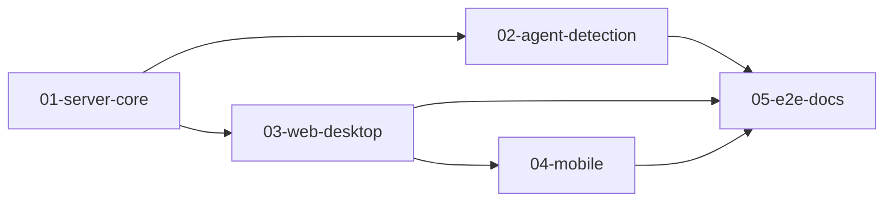

# タスク: Web ターミナルマルチプレクサ（herdr 相当）— MVP 基盤（親・メタ tasks）

> この work は **5 つの subtask に分割した**（decisions.md D32）。この文書は親の「メタ tasks」で、割れ目・順序・受け入れ基準の分担を定める。
> **各 subtask の詳細なタスク（`T<n>` のチェックリスト）は、その subtask の tasks 工程で作る**（ここには書かない。protocol-subtask.md）。
> 受け入れ基準の被覆（`aidev coverage`）は、親＋全 subtask の家族単位で数える。

## 実装方針

- architecture.md の「tasks への申し送り」の 16 段階を、依存の向きに沿って 5 つの subtask に割る。
- **PR は 1 本**（D2）。各 subtask は tasks → coding → test → review を回す。全 subtask の review が承認されたら、親で統合 test → 統合 review → deliver。
- 各 subtask の test は、**単独で検証できる範囲（単体・契約のモック）**に限る。ブラウザとサーバを結んだ検証、3 OS・実機の検証は、親の統合 test で行う。

## subtask の割れ目

| subtask | architecture の段階 | 作るもの（主なモジュール） | 境界の約束（ほかの subtask へ渡すもの） |
|---|---|---|---|
| `01-server-core` | 1〜8・10 | 足場（pnpm workspace・tsconfig・lint・Vitest・`third_party/herdr`・NOTICE）、`protocol` パッケージ、サーバの基盤・ドメイン・操作面・アダプタ（エージェント判定を除く）、`main.ts`、`smoke.ts` | **`protocol` の型・zod スキーマ・フレームのコーデック**（03 が使う）。`AgentMonitor` を差し込む口（`SessionService.updatePaneRuntime` と `TerminalManager`）。`ProcessInspector`（Linux・Windows。前面プロセスと cwd。02 も使う） |
| `02-agent-detection` | 9 | `ManifestStore`・`ManifestEngine`・`ProcessMatcher`・`AgentTracker`・`AgentMonitor`、`ManifestSource` の実装、`main.ts` への組み込み | `pane.agent_status_changed` と `AgentInfo`（型は 01 の `protocol` で定義済みのものを使う） |
| `03-web-desktop` | 11〜14 | Web の `net/`・`term/`・`keys/`・`store/`・`actions/`・`components/`・`main.ts` | モバイルが再利用する部品（`KeyInputController.injectKey`・`TerminalRegistry` の容量の切替・`ViewSync`・ストア） |
| `04-mobile` | 15 | `mobile/*`（1 列・追加キーの列・fit・縮小表示・タッチのスクロール） | なし |
| `05-e2e-docs` | 16 の成果物 | Playwright の E2E 一式、性能の計測（AC17）、docs（TLS の証明書・WSL2 から LAN へ出す方法・3 OS と実機の検証手順・herdr との対応表） | 親の統合 test が使う E2E と手順書 |

## 作業順序と依存関係

subtask 間の順序の正典は、各 subtask の `state.yml` の `dependsOn`（`aidev new --depends` で刻んだ）。

- **`01-server-core` は `03-web-desktop` の producer**。`protocol` パッケージ（方式・イベント・フレームの型）が固まるまで、03 は着手しない。
  型を変えるときは 01 の側で変え、03 はそれに追従する。
- **`02` と `03` は、どちらも 01 だけに依存する**。カーソルは `02 → 03` の順に進むが、02 の結果を 03 は使わない（サイドバーの状態の表示は `protocol` の型だけで作れる）。
- **不確実な箇所を先に確かめる**
  - 02 の最初のタスク：U1（判定ルールの `region` の意味を herdr のソースで確かめる）と U2（23 ファイルの正規表現を変換できるか）。
  - 03 の最初のタスク：D18・D19・D21・D23（herdr の実際の挙動をソースで確かめる。キーや集約の細部が変わりうる）。
  - 04 の最初のタスク：U4（xterm.js のタッチスクロール）。
  - 見立てが外れたら、その subtask の tasks を分解し直す（範囲そのものは変えない）。

## 受け入れ基準の分担

各 subtask の tasks は、下の表で自分に割り当てられた AC を、自分のタスクの `AC:` 欄で参照する（被覆は家族単位で `aidev coverage` が数える）。

| AC | 01 server-core | 02 agent-detection | 03 web-desktop | 04 mobile | 05 e2e-docs | 親の統合 test |
|---|---|---|---|---|---|---|
| AC1〜AC3（workspace / tab / pane の操作） | 方式と SessionService | | UI・キー・メニュー | | E2E | 通しの確認 |
| AC4（端末の表示と入力） | PTY・ミラー・問い合わせの応答 | | xterm.js・unicode11・IME・問い合わせの握りつぶし | | E2E（vim・htop） | Claude Code・実機の IME |
| AC5（scrollback・コピー・貼り付け） | SNAPSHOT の scrollback | | copy モード・選択・貼り付け | | E2E | |
| AC6（エージェントの状態） | 差し込み口 | 判定一式 | サイドバーの表示 | | E2E（偽のエージェントの画面） | Claude Code・Codex の実物 |
| AC7（サイドバーからの移動と集約） | | | 一式 | | E2E | |
| AC8（ブラウザを閉じても継続・復元） | TerminalHost・継ぎ目 | | 再接続・LRU | | E2E | |
| AC9（同時接続） | ClientRegistry・SizeAuthority | | view とサイズの申告 | | E2E（2 コンテキスト） | |
| AC10（認証） | AuthService・OriginPolicy・upgrade の検証 | | LoginView・切断の見分け | | E2E（拒否の 3 パターン） | |
| AC11（別マシンから TLS） | TLS・許可ホスト | | | | docs（証明書の用意） | 別マシンから確認 |
| AC12（モバイル） | | | | 一式 | E2E（モバイルのエミュレーション） | 実機（iOS Safari・Android Chrome） |
| AC13（既定キー） | | | keymap・KeyRouter・各モード | | E2E（キーごと） | |
| AC14（マウス） | | | MouseBridge・メニュー・Splitter | | E2E | |
| AC15（herdr との対応表） | | | | | docs に対応表（research F7 と design の対応の表を最新化） | |
| AC16（3 OS） | Windows の PTY・ProcessInspector | Windows の前面プロセスでの判定 | | | 検証の手順書 | **3 OS で実施** |
| AC17（性能） | 流量制御 | 判定の周期 | RendererPool・LRU | | 計測の仕組み | 計測の実施 |
| AC18（再起動後の復元） | SessionFile・restore | | | | E2E | |
| AC-I1〜AC-I5（操作性） | | | 一式 | モバイルでの差分（AC-I1・AC-I3 の追加キー） | E2E | |

## リスク / 留意点

- **規模**：タスクは 60〜80 件の見込み。subtask の review ごとに指摘を潰し、親の統合 review に持ち越さない。
- **01 の `protocol` の型の変更**：03 の着手後に変えると手戻りが大きい。01 の review で `protocol` を重点的に見る。
- **Windows ネイティブ**：01 と 02 は Windows の実装を含む。単体テストは Linux で回し、Windows での実行は親の統合 test で確かめる（WSL2 の母艦の Windows を使う）。
- **herdr の挙動の確認（U1・D18〜D23）**：結果によって、判定エンジンとキーの細部が変わる。各 subtask の最初のタスクで確かめる。
- **xterm.js のモバイルの不具合（U4）**：04 で、自前のタッチ処理で補えるかを最初に確かめる。
- **セキュリティ**：01 で、認証（段階 6）を WebSocket の方式（段階 8）より先に入れる（design「ドメイン固有の考慮」）。
- **architecture の独立点検の残り**：2 巡目の修正が新たに生んだ食い違いが残っている可能性がある（decisions.md）。各 subtask の tasks で `対象` 欄を書くときに拾う。

## テスト方針

- **subtask の test**（単独で検証できる範囲）
  - 01：純関数（LayoutTree・SessionModel・OriginPolicy・SizeAuthority の判定）の単体テスト。
    TerminalHost の継ぎ目と流量制御は、偽の PtyProcess で確かめる。認証と Origin の拒否を HTTP / WebSocket の結合テストで確かめる（実物の node-pty・Linux）。smoke。
  - 02：ManifestEngine（herdr のルールと、画面の fixture）、23 ファイルの読み込み、ProcessMatcher（cmdline の fixture）、AgentTracker の遷移。
  - 03：KeyRouter と各モードの全遷移、TerminalRegistry の LRU、ストアの集約と done の導出、コンポーネントの単体テスト。サーバは契約のモックで代用する。
  - 04：追加キーの one-shot / lock、モバイルの判定、fit の切替。
  - 05：E2E そのものが成果物。05 の test では、E2E がローカルの Linux で通ることを確かめる。
- **親の統合 test**
  - E2E 一式（デスクトップ Chrome と、モバイルのエミュレーション）。
  - 3 OS（Linux・WSL2・Windows ネイティブ）での AC1〜AC14 と AC18。
  - 実機（別マシンのブラウザ・iOS Safari・Android Chrome・日本語の IME）。
  - 性能の計測（AC17）と smoke（`aidev smoke`）。

## タスク

（この親 work は subtask に分割したので、`T<n>` のチェックリストは各 subtask の `tasks.md` に置く）
