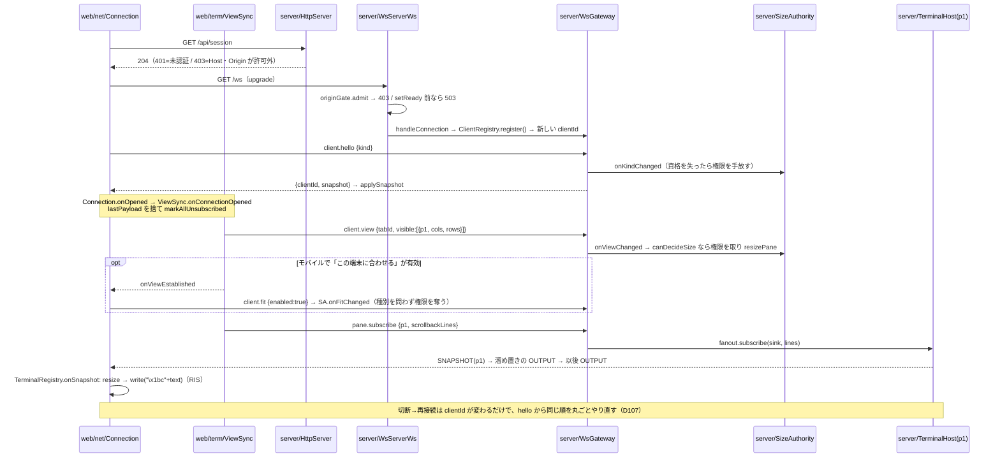
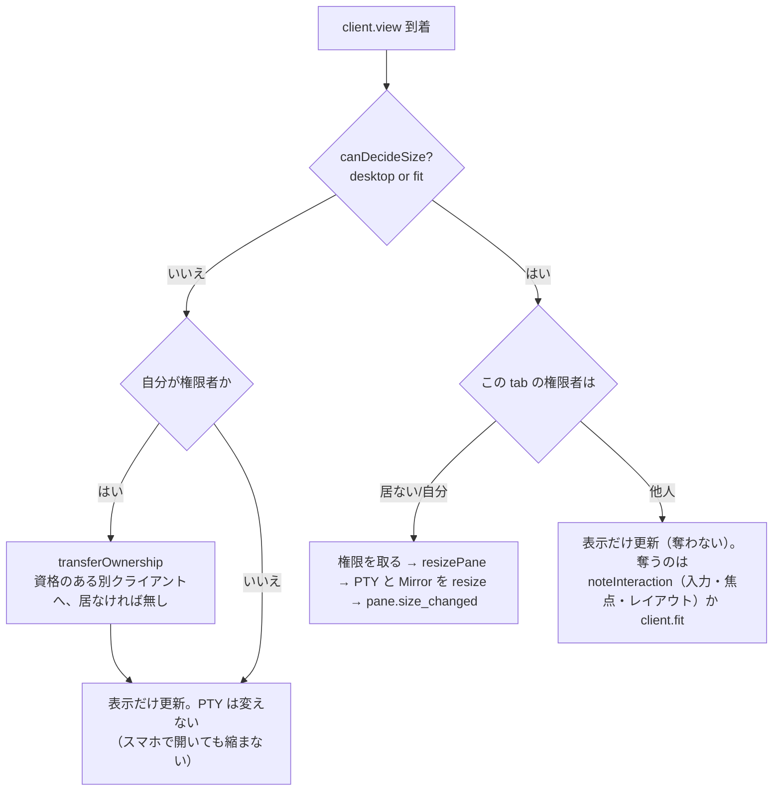
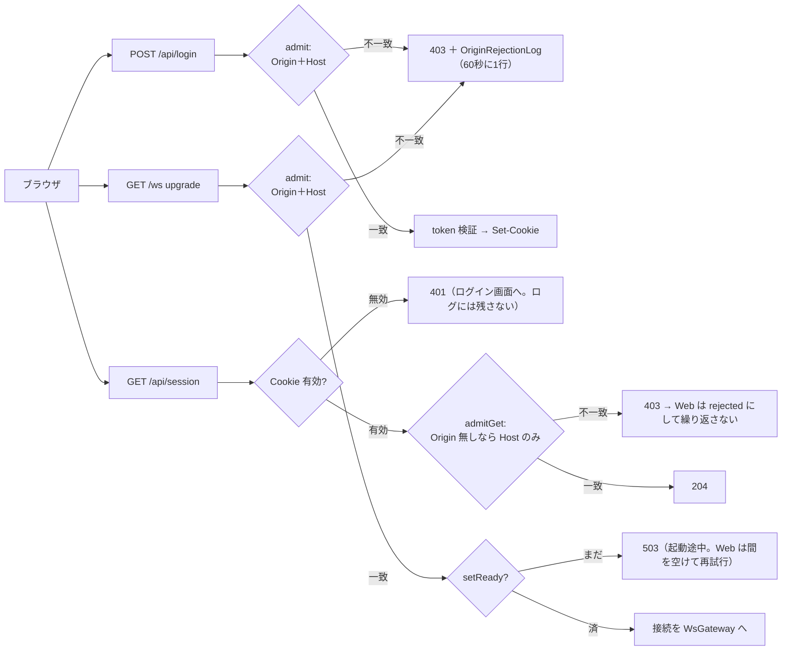

# レビューガイド: wtm — Web ターミナルマルチプレクサ（MVP 基盤）

## 変更概要 / 目的

コミットが 1 つも無い新規リポジトリで、**リポジトリ全体がこの変更**。herdr（Rust の TUI マルチプレクサ）の操作感をブラウザに載せ、
ローカルの PTY を session → workspace → tab → pane の階層で扱う。pnpm ワークスペースの 4 パッケージ：

| パッケージ | 中身 | 規模（テスト込み） |
|---|---|---|
| [`packages/protocol`](packages/protocol/src/index.ts:1) | ワイヤプロトコル（JSON の method / event ＋ バイナリフレーム） | 11 ファイル / 689 行 |
| [`packages/server`](packages/server/src/main.ts:1) | PTY・セッションモデル・流量制御・認証・HTTP/WS | 102 ファイル / 14,570 行 |
| [`packages/web`](packages/web/src/main.ts:1) | Vue 3 ＋ xterm.js（デスクトップ / モバイルの 2 つの殻） | 107 ファイル / 16,664 行 |
| [`packages/e2e`](packages/e2e/src/specs/smoke.spec.ts:1) | Playwright の E2E（12 spec） | 19 ファイル / 3,384 行 |

受け入れ基準は AC1〜AC18 ＋ AC-I1〜AC-I5（[requirements.md:120](.aidev/works/20260918-web-terminal-multiplexer/requirements.md:120)）。
自動で確かめられる分は**全て pass**（単体 1,066 / E2E 60。[test-result.md:331](.aidev/works/20260918-web-terminal-multiplexer/test-result.md:331)）。
AC11（別マシンからの TLS）・AC12（実機のモバイル）・AC16（WSL2・Windows ネイティブ）・AC17（実機での性能の判断）は**一部**で、手順を
[`docs/verification.md`](docs/verification.md:1) に揃えて利用者の実機確認に回している。統合 review はラウンド2 で must・should ゼロ
（[review.md:17](.aidev/works/20260918-web-terminal-multiplexer/review.md:17)）。

## 重要ポイント

決定の全文は `decisions.md`（D1〜D110）。**D88 以降が統合テストとレビューで出た分**で、実質的な設計はそこで固まっている。

**1. pane のサイズ権限（D13・D106）— 最重要。** tab ごとに `sizeOwnerClientId` を 1 つだけ持ち、**PTY の大きさはその 1 クライアントの
`client.view` で決まる**。資格は [`canDecideSize`](packages/server/src/clients/SizeAuthority.ts:39)（`kind === "desktop" || fit`）の 1 関数に
まとめ、権限を取る／受け取る**全経路**が通る。D106 以前は [`onViewChanged`](packages/server/src/clients/SizeAuthority.ts:59) だけ抜けていて、
デスクトップを閉じた後にスマホで開くだけで PTY が縮んだ。あわせて [`onFitChanged`](packages/server/src/clients/SizeAuthority.ts:78)
（「この端末に合わせる」は**種別を問わず**奪う）・[`onKindChanged`](packages/server/src/clients/SizeAuthority.ts:96)（hello し直しで資格を
失ったら手放す）・[`transferOwnership`](packages/server/src/clients/SizeAuthority.ts:131)（移譲先も同じ資格で絞る）を追加。入口は
[`surface/methods/client.ts:6`](packages/server/src/surface/methods/client.ts:6) と
[`WsGateway.ts:114`](packages/server/src/ws/WsGateway.ts:114)（INPUT フレーム＝打てば奪う）。

**2. 流量制御（D98）— 「設計はあったが動いていなかった」。** 購読者は buffering → live ⇄ stale の 3 状態。`bufferedAmount` が 2MB 超で
stale、256KB 未満で SNAPSHOT を送り直す（[OutputFanout.ts:23](packages/server/src/terminal/OutputFanout.ts:23) の閾値・
[`retryStale:94`](packages/server/src/terminal/OutputFanout.ts:94)）。復帰の起点 `onDrain` が **`ws` の WebSocket が `drain` を emit しない
ため一度も呼ばれておらず**、混雑中に少し出力して黙った pane は永久に止まっていた →
[50ms のポーリングに変更](packages/server/src/ws/WsServerWs.ts:150)（名前に反してイベントではない）。加えて OUTPUT を 1 通ずつ
permessage-deflate していて送信口が約 0.8MB/s まで落ちていた → [OUTPUT だけ非圧縮](packages/server/src/ws/WsGateway.ts:74)。上流には別に
PTY の pause/resume がある（[TerminalHost.ts:44](packages/server/src/terminal/TerminalHost.ts:44)。ミラーの未処理 1MB 超で停止）。

**3. 新しい pane を作る間の入力の保持（D99）。** 分割・新 tab・新 workspace は応答（シェル起動確認の 300ms 込み）まで焦点を移せず、その間に
打った文字が元の pane に入っていた。[`InputGate`](packages/web/src/net/InputGate.ts:103) が `ConnectionPort` を包み `sendInput` だけを関所に
する（[:87](packages/web/src/net/InputGate.ts:87)。5 秒で元の pane へ戻す失敗安全が [:19](packages/web/src/net/InputGate.ts:19)）。
**ポインタ由来の入力とフォーカス報告は溜めない**。呼び出しは [`splitPane`](packages/web/src/actions/ActionDispatcher.ts:197)・
[`confirmNewTab`](packages/web/src/actions/ActionDispatcher.ts:149)・[`newWorkspace`](packages/web/src/actions/ActionDispatcher.ts:331)、
戻し先の判定が [`releaseHold`](packages/web/src/actions/ActionDispatcher.ts:169)。結線は 1 か所（[web/main.ts:82](packages/web/src/main.ts:82)）。

**4. 再接続で表示と購読を張り直す（D107）— review ラウンド1 の must。** サーバは**接続ごとに新しい clientId** を振り
（[WsGateway.ts:64](packages/server/src/ws/WsGateway.ts:64)）、購読・view・fit をそれに持つ。Web は `lastPayload` を接続をまたいで持っていた
ため、自動再接続・503 からの再試行・再ログイン・切り離しからの「再接続」の後は**画面が止まっていた**（入力だけ届く）。
[`Connection.onOpened`](packages/web/src/net/Connection.ts:166)（hello が通るたび）→
[`ViewSync.onConnectionOpened`](packages/web/src/term/ViewSync.ts:129) が `lastPayload` を捨て
[`markAllUnsubscribed`](packages/web/src/term/TerminalRegistry.ts:128) して commit し直す。閉じてから次の hello までは
[何も送らない](packages/web/src/term/ViewSync.ts:141)。04 向けの口が [`onViewEstablished`](packages/web/src/term/ViewSync.ts:152)。

**5. Origin / Host の許可リストと 3 つの拒否経路（D102・D103・D106・D107）。** 許可リストはサーバ自身のインタフェースからしか作れない →
転送・リバースプロキシ・Tailscale では **`--origin` が必須**で、それを開ける URL の先頭に出す。判定は
[`isAllowed`](packages/server/src/auth/OriginPolicy.ts:61)（Origin 優先、Host は小文字化して比較）と、Origin の付かない GET 用の
[`isHostAllowed`](packages/server/src/auth/OriginPolicy.ts:71)。記録は 1 か所に集約（[`admit`](packages/server/src/auth/OriginRejectionLog.ts:76) /
[`admitGet`](packages/server/src/auth/OriginRejectionLog.ts:85)。同じ組を 60 秒に 1 行・200 文字で切る）——拒否は**認証前に誰でも何度でも
起こせる**ので、この間引きは security の一部。拒否点は `POST /api/login`（[HttpServer.ts:112](packages/server/src/http/HttpServer.ts:112)）・
`GET /api/session`（[HttpServer.ts:165](packages/server/src/http/HttpServer.ts:165)。**Cookie の確認が先**で、無効なら Host を問わず 401）・
`GET /ws` の upgrade（[WsServerWs.ts:90](packages/server/src/ws/WsServerWs.ts:90)。起動途中は [503](packages/server/src/ws/WsServerWs.ts:95)）。
クライアント側は [`checkSession`](packages/web/src/net/Connection.ts:203) が 204/401/403 を分け、403 でも **`/ws` を 1 回だけ試してから**
[`rejected`](packages/web/src/net/Connection.ts:350) にする（Host だけ書き換える前段プロキシの救済）。

**6. 状態ディレクトリのロック（D103）。** ポートが違えば bind では止まらないので、二重起動で全シェルが二重に立ち `session.json` /
`auth.json` を上書きし合っていた。[`acquire`](packages/server/src/persist/StateDirLock.ts:104) が `wx` で `wtm.lock`（pid ＋ ホスト名の 2 行）を
作り、[`isInUse`](packages/server/src/persist/StateDirLock.ts:179) が残骸を見分ける——**ホスト名が違えば常に使用中**（コンテナ / 共有
ディレクトリでは pid を信用できない）、同じホストなら [`process.kill(pid, 0)`](packages/server/src/persist/StateDirLock.ts:45)。`listen()` の
**最初**に取る（[composeServer.ts:180](packages/server/src/composeServer.ts:180)。auth.json の読み込みより前）。`wtm token reset` も同じロックを
取る（[main.ts:119](packages/server/src/main.ts:119)。動作中は終了コード 2 ＝ [main.ts:152](packages/server/src/main.ts:152)）。

**7. スナップショットと RIS（D107）。** サーバのミラーは `@xterm/headless` ＋ serialize addon
（[Mirror.serialize](packages/server/src/terminal/Mirror.ts:107)）、継ぎ目は
[`startBuffering`](packages/server/src/terminal/OutputFanout.ts:108)（SNAPSHOT → 溜め置き → live）。ブラウザ側は `term.reset()` をやめて
**`\x1bc`（RIS）を書き込みの列の中で**流す（[TerminalRegistry.ts:159](packages/web/src/term/TerminalRegistry.ts:159)）——`reset()` はその場で
消すだけで xterm.js の未処理の書き込みを消さないため、古い出力が SNAPSHOT の後に流れ込んでいた。**代償**：スナップショットが持たない
モード（`?25`・`?1006`・DECSTBM・DECSCUSR・OSC 8）は再接続で既定に戻る（「既知の制約」）。

**8. モバイルの fit と測り方（D108）。** モバイルの葉は縮小枠（`naturalSize × scale`）の中にあり、葉を測ると「PTY → 葉 → 申告 → PTY」が
回って縮む（実測 53→51 列）。そこで **`client.view` は表示領域 `.mobile-shell-pane` で測る**
（[`measureSinglePane`](packages/web/src/mobile/usePaneArea.ts:44)・[MobileShell.vue:96](packages/web/src/mobile/MobileShell.vue:96)）。`ViewSync`
は**表示が 1 pane のときだけ**この口を使う（[ViewSync.ts:81](packages/web/src/term/ViewSync.ts:81)）。再接続後は
[`onViewEstablished` で `client.fit` を送り直す](packages/web/src/mobile/useFitToScreen.ts:92)（以前はボタンが押された表示のまま権限が無く、
等倍で画面からはみ出した）。[`toggleFit`](packages/web/src/mobile/useFitToScreen.ts:84) は `open` の間だけ送る。ピンチの拡大率は
[掛け戻す](packages/web/src/mobile/useVisualViewport.ts:43)（さもないと拡大のたびに SIGWINCH が飛ぶ）。

**9. マウスとリンク（D110）。** 右クリックでメニューを開くとき、xterm.js が出す `\e[<2;…M` をキャプチャ段階で止める
（[MouseBridge.ts:163](packages/web/src/term/MouseBridge.ts:163)。対になる mouseup の抑止と取りこぼしの後始末が
[:179](packages/web/src/term/MouseBridge.ts:179)）。pane の枠 4px を新設（[`PaneFrame.vue:91`](packages/web/src/components/PaneFrame.vue:91)・
CSS は [:119](packages/web/src/components/PaneFrame.vue:119)）——枠の右クリックは**設定やアプリの報告に関わらず常に**メニューで、APG の
menu button ＋ roving tabindex（選択中の pane だけ Tab で止まる）。リンクは **Ctrl（macOS は Cmd）＋主ボタン、http(s) のみ**
（[`activateLink`](packages/web/src/term/MouseBridge.ts:239)、`allowNonHttpProtocols: false` は
[:83](packages/web/src/term/MouseBridge.ts:83)）。下線と指カーソルも修飾キー押下中だけ。

## 処理フロー

### 接続 → hello → view →（fit）→ subscribe → output（再接続を含む）

### サイズ権限の判定（`client.view` が届いたとき）と、Origin / Host の 3 つの拒否経路

## 主要な変更箇所

**サーバの中核**
- [`composeServer.ts:175`](packages/server/src/composeServer.ts:175) — `listen()` の順序が全ての前提。**ロック → auth.json → bind → token → 復元 → poller → `/ws` 開放**（D102・D103）。この順でないと失敗した起動が token を失い、他プロセスの状態を壊す。[`close():226`](packages/server/src/composeServer.ts:226) は逆順で、最後にロックを放す。
- [`main.ts:91`](packages/server/src/main.ts:91) — 起動表示。`try/finally` で「作った token は何があっても必ず一度出す」を担保（[:31](packages/server/src/main.ts:31)）。シグナルは `listen()` の**前**から受ける（[:69](packages/server/src/main.ts:69)）。
- [`clients/SizeAuthority.ts:39`](packages/server/src/clients/SizeAuthority.ts:39) — 権限モデル。ここだけは全文を読む価値がある（150 行）。
- [`ws/WsGateway.ts:63`](packages/server/src/ws/WsGateway.ts:63) — 接続ごとの clientId・INPUT の扱い・不正フレームの窓・切断時の後始末。
- [`terminal/OutputFanout.ts:23`](packages/server/src/terminal/OutputFanout.ts:23) — 流量制御と継ぎ目。世代カウンタ（[:61](packages/server/src/terminal/OutputFanout.ts:61)）で飛行中の SNAPSHOT を無効化する形に注意。
- [`util/net.ts:85`](packages/server/src/util/net.ts:85) — `accessUrls` / [`lanIpv4Addresses:66`](packages/server/src/util/net.ts:66) / [`requestPathname:126`](packages/server/src/util/net.ts:126)（`//`・`/\` を例外にしない。D103）。純関数なので単体テストが本体。

**Web クライアントの中核**
- [`web/main.ts:32`](packages/web/src/main.ts:32) — composition root。循環する port を「箱」で埋める方式（D77）と、`InputGate` を全入力の唯一の通り道にする結線（[:82](packages/web/src/main.ts:82)・[:133](packages/web/src/main.ts:133)）。
- [`net/Connection.ts:136`](packages/web/src/net/Connection.ts:136) — 接続・再接続・状態遷移（`open` / `reconnecting` / `rejected` / `detached`）。[`handleClose:330`](packages/web/src/net/Connection.ts:330) は非同期の確認より**先に** `reconnecting` にする（D95。入力を黙って捨てない）。
- [`term/ViewSync.ts:77`](packages/web/src/term/ViewSync.ts:77) — `client.view` → `pane.subscribe` の唯一の出口。
- [`components/PaneLayout.vue:143`](packages/web/src/components/PaneLayout.vue:143) — `commitView`、`followResize` の `ResizeObserver`（[:93](packages/web/src/components/PaneLayout.vue:93)）、`PaneFrame` での包み（[:178](packages/web/src/components/PaneLayout.vue:178)）。
- [`keys/KeyInputController.ts:1`](packages/web/src/keys/KeyInputController.ts:1) ＋ [`keys/keymap.ts:1`](packages/web/src/keys/keymap.ts:1) — herdr 互換の prefix（`Ctrl+B`）と copy / navigate / resize モード。

**モバイルとプロトコル**
- [`App.vue:34`](packages/web/src/App.vue:34) — 幅 768px 未満で `MobileShell` に切り替え（`client.hello` の `kind` とは別軸。これが D106 の「種別を問わず fit を認める」判断の理由）。[`MobileShell.vue:55`](packages/web/src/mobile/MobileShell.vue:55) が fit・表示領域の測定・visual viewport の 3 つの composable の結線。
- [`protocol/src/messages.ts:156`](packages/protocol/src/messages.ts:156)（メソッド名と params / result の対応表）＋ [`frames.ts:9`](packages/protocol/src/frames.ts:9)（OUTPUT / SNAPSHOT / INPUT のバイナリ形式）。小さいので先に読むと全体が早い。

**E2E / docs**
- [`performance.spec.ts:40`](packages/e2e/src/specs/performance.spec.ts:40) — AC17。サーバ往復と[描画まで](packages/e2e/src/specs/performance.spec.ts:151)の 2 系統、[16 pane ＋ 大量出力](packages/e2e/src/specs/performance.spec.ts:165)。
- [`reconnect-restore.spec.ts:208`](packages/e2e/src/specs/reconnect-restore.spec.ts:208) — D107 の回帰（同じページのまま繋ぎ直して出力が届く）。これが無いと D107 の退行を検知できない。
- [`auth-rejection.spec.ts:203`](packages/e2e/src/specs/auth-rejection.spec.ts:203) — 403 で理由を出して止まる。[`:58`](packages/e2e/src/specs/auth-rejection.spec.ts:58) が `--origin` の案内。
- [`mobile.spec.ts:189`](packages/e2e/src/specs/mobile.spec.ts:189) / [`:268`](packages/e2e/src/specs/mobile.spec.ts:268) / [`:353`](packages/e2e/src/specs/mobile.spec.ts:353) — D108 の 3 本（再接続での fit・表示領域への追従・ピンチ）。
- [`playwright.config.ts:1`](packages/e2e/playwright.config.ts:1) — `workers: 1`（並列にすると CPU を取り合い性能計測が汚れる。D104）。
- [`docs/verification.md:1`](docs/verification.md:1) — 実機で埋める手順。[`docs/tls-setup.md:154`](docs/tls-setup.md:154) が `--origin` の構成別の表。[`docs/herdr-parity.md:16`](docs/herdr-parity.md:16) が AC15 の棚卸し表。

## リスク / 確認したい点

**実機に回した穴**（[test-result.md:364](.aidev/works/20260918-web-terminal-multiplexer/test-result.md:364)。手順は `docs/verification.md`）
- **AC16**：WSL2 を Windows のブラウザから使う構成（mirrored / NAT＋portproxy）と Windows ネイティブ（ConPTY・大文字ホスト名・Hyper-V の
  スイッチ名・コンソールを閉じたときの終わり方）。**ロックのホスト名判定と Windows の pid 判定は一度も実機で走っていない**——一番の未知数。
- **AC17**：**このサンドボックスでは目標未達**。大量出力が無ければ描画まで p95 25ms だが、`yes` を流したまま 16 pane 同時表示では p95 513ms
  （目標 50ms）。PTY 読み取りとミラーの解析がイベントループを占めるのが原因。GPU のある実機で測り直して合否を決める。閾値（2MB / 256KB）も
  実機で測ってから動かす方針（D98）。
- **AC11**：別マシンのブラウザから TLS で AC1〜AC9（同一マシンの LAN IP までしか自動化できていない）。**AC12**：実機の iPhone Safari /
  Android Chrome（タッチのスクロール・ソフトキーボード・xterm.js の既知課題 #3600・#3727）。
- Tailscale の鍵の権限・リバースプロキシの実環境・Windows のファイアウォール・IME の候補窓・マウス報告（M7・M11）・claude / codex 以外の
  約 20 エージェントの実物。

**既知の制約**（[docs/verification.md:594](docs/verification.md:594)。不具合ではなく今の版の限界）
- **TCP の半開きの間に打った文字は黙って消える**（D95）。ハートビートを送らないので、スリープ・回線切替の間はブラウザが切断に気づくまで
  数十秒かかり、その間の入力はどこにも届かない。*設計として受け入れるか ping を足すかは再検討の余地あり。*
- **再接続で戻らない端末のモード**（D107）：`?25`・`?1006`・DECSTBM・DECSCUSR・OSC 8。カーソルを隠す TUI でカーソルが見える、SGR マウス
  報告が旧形式で届いて右端・下端でずれる等が、**自動再接続のたびに**起こりうる。
- **IME で変換中の文字は新しい pane へ流れない**（D99）。確定が応答の後になると元の pane に入る。
- **モバイルの「この端末に合わせる」の食い違い**（D108）：768px をまたぐとボタンの表示だけ戻る／他のクライアントが打つとそちらが大きさを
  取り、スマホは押された表示のままはみ出す。**タッチ端末では端末内のリンクを開けない**（D110。修飾キーが無く代替を用意していない）。

**second opinion がほしい点**
1. **サイズ権限の移譲だけが壁時計のまま**。[`transferOwnership`](packages/server/src/clients/SizeAuthority.ts:136) は `lastInteractionAt` の
   降順で移譲先を選ぶが、その値は [`ClientRegistry.touch`](packages/server/src/clients/ClientRegistry.ts:78) の `Date.now()`。D103・D106 で
   ログの間引き・ログイン制限・不正フレームの窓は**すべて [`monotonicNow`](packages/server/src/log/LogThrottle.ts:55) に移した**のに、ここ
   だけ残っている。時刻が巻き戻ると「最後に操作した人が勝つ」が反転しうる。影響は小さいが方針としては揃えるべきでは。
2. **xterm.js 6.0.0 の内部への依存が 2 か所**（[`_core._linkProviderService`](packages/web/src/term/MouseBridge.ts:302)・
   [`getCellSize`](packages/web/src/term/measure.ts:29)）。版を固定して逃げているが更新時に静かに壊れる。フォールバックの妥当性
   （リンクは下線の出し分けだけ壊れる／セル寸法は 9×18 に落ちる）を見てほしい。
3. **backlog へ送った 2 件の扱い**——(a) サーバと Web で同じ規則を二重に持っている（レイアウトの隣接・深さ優先順、`/api/login` の状態
   コードの意味、ログイン制限の回数。[review.md:11](.aidev/works/20260918-web-terminal-multiplexer/review.md:11)）。`protocol` へ寄せるべきか。
   (b) `Connection` に 403 と 503 の切り分けが無く、Host を書き換えるプロキシ構成でサーバの起動途中に開くと `rejected`（「`--origin` を
   加えて」）という誤った理由が出る（「再試行」で回復する狭い経路）。
4. **`InputGate` が入力の唯一の通り道である前提**。新しい入力経路を足すとき関所を通し忘れると D99 が静かに壊れる。型や lint で縛れるか。
