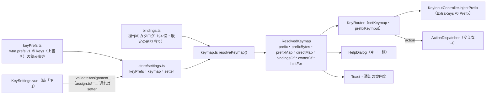
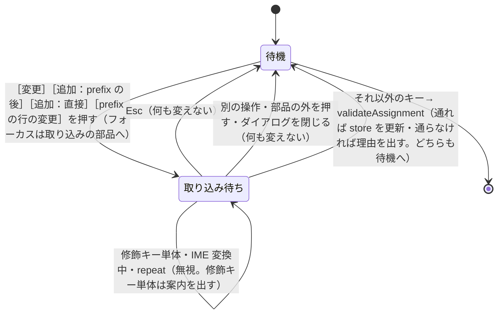

# 仕様: キー割り当てを変え、prefix を使わない直接のキーも使えるようにする（herdr のキー設定）

## 概要

キーの割り当てを **「操作のカタログ」＋「このブラウザの上書き」から 1 か所で解決した表（`ResolvedKeymap`）**にする。`KeyRouter` はその表を引くだけにし
（prefix の直書きと `DEFAULT_KEYMAP` の直引きをやめる）、prefix の後のキーに加えて**直接のキー**を引く。キー一覧・トースト・通知の案内文・モバイルの Prefix ボタンは
同じ表から作る。編集は設定画面の新しい節「キー」で、**押したキーをそのまま取り込む**（検証して、通れば即反映・保存）。
保存は既存の `wtm.prefs.v1`（ブラウザごと）に、**既定との差だけ**を herdr 風の文字列（`prefix+shift+h`・`ctrl+alt+d`・`prefix+alt+1..9`）で持つ。
サーバ・protocol は変えない。



## 設計方針

- **D1 単位は「操作」、名前は herdr の項目名**（`split_vertical`・`focus_pane_left`・`switch_tab`…）。将来の設定ファイル（H25b）・herdr の設定との相性のため。
  退けた案：本製品独自の名前（`split`・`focusDir` の `Action` の形をそのまま出す）——`Action` は `split{dir}` のように 1 操作が複数の割り当てを持つ
  形で、1 つのキーに 1 つの `Action` を引く用途に向く一方、利用者に見せる単位（「右へ分割」）とは一致しない。
- **D2 保存の形は herdr 風の文字列**で、**既定との差だけ**を持つ（`{ prefix?: string; bindings?: { <操作>: string[] } }`。`[]` は「割り当てなし」）。
  既定を保存しないので、更新で既定が変わっても差の無い操作には届く。構造化した形（`{via, key}`）も検討したが、devtools で読め、herdr の記法の部分集合（読み込みでは別名も受ける）で、
  表示にも同じ文字列を使えるので文字列にした。
- **D3 キーの照合は 1 つの正規形（chord）に集約する**。`KeyInput` → `chordOf()` → 文字列（`ctrl+alt+shift+d`・`shift+h`・`tab`・`?`）。
  文字は**小文字にそろえ、shift は明示のフラグ**で持つ（実測 F24：合成のキーは shift を付けても大文字にならない。実物のキーボードは shift 中に大文字を返すのが一般の挙動で、実物では測っていない。どちらでも同じ正規形になるよう、文字の大小に頼らない）。
  `event.key` が大文字の文字は shift 付きとみなす（今の `H`・`T` と同じ。CapsLock の `Q` は `shift+q`＝割り当てなしで、今と同じ）。
  記号・数字（1 文字で大小のないキー）は文字そのものが shift を表すので shift を持たない。名前のあるキー（`Tab`・矢印・F キー等）は shift を明示する。
  旧 `comboKey`（`KeyRouter.ts:41`）は置き換えて削除する（照合が 2 系統にならないように）。
- **D4 直接のキーは terminal モードでだけ効く**（copy・resize・navigate・prefix・dialog の中では引かない）。**使えるのは ctrl・alt・cmd のいずれかを含む chord か F キー**（AC5。
  文字・名前のあるキー〔`tab`・`enter`・矢印等〕・shift だけを付けたものは、端末への入力を奪うので使えない）。
  **繰り返し（`repeat`）の keydown は、割り当てのある直接のキーなら何もせず食う**——押しっぱなしで分割・pane の閉鎖が連発する事故を避ける。
  prefix 側の挙動（押しっぱなしの扱い）は今のまま（範囲外）。
- **D5 prefix は「端末へ送れる形」に限る**：`ctrl+<英字・[ \ ] ^ _ @・space>`（制御文字。shift は含まない：端末は `ctrl+a` と `ctrl+shift+a` を区別できない）・`alt+<1 文字>`（ESC 前置）・`ctrl+alt+<英字>`・修飾なしの F1〜F12（xterm の列）。
  prefix を 2 回押すと、その形のバイト列を端末へ送る（今の `\x02` の一般化）。送れない形（meta・名前のあるキー+修飾・shift 付き F キー等）は選ばせない（AC3）。
- **D6 環境差の扱い**（実機では確かめられない。verification.md）：
  (a) **AltGr で合成された文字は取り込まない**（AC6e）：`getModifierState("AltGraph")` が真で、`key` が英数字以外の 1 文字で、かつその文字が `code` の物理キーの US 配列の文字
  （シフトなしは `BracketLeft`＝`[` 等、シフトありは `{` 等、テンキーの記号。**同じ shift の状態の文字と比べる**〔decisions D14〕）と違うときに拒否する。英数字は通す。Firefox・Windows は Ctrl+Alt を両方押すだけで AltGraph が真になる（MDN。research F26）ので、
  US 配列の `ctrl+alt+[` は通り、ドイツ語配列の AltGr+8＝`[`（`Digit8` の文字は `8`）は拒否される。表に無い `code` は拒否側に倒す。
  イベントの状態で判定するので、保存した文字列の読み込みの検証の対象外（AC6 の対応に書く）。**取り込みだけでなく実行時にも同じ判定を使う**——`KeyRouter.handleDirect` は AltGr で合成された文字
  （ドイツ語配列の AltGr+8＝`[` は `ctrl+alt+[` と同じ形で届く）を直接のキーに当てず端末の入力として通す（おすすめ一式の `ctrl+alt+[`・`]` が、AltGr で `[`・`]` を打つ配列で端末に打てなくなるのを避ける。decisions D11）。
  (b) **macOS の Option の文字化けは `code` で元へ戻す**：**macOS のときだけ**（`chord.ts` の `setOptionComposes(true)` を `main.ts` が既存の `isMacPlatform()`〔`term/MouseBridge.ts`。`userAgentData.platform` も見て、iPadOS を含む。T10 の点検で新しい判定を作らず置き換えた〕で有効にする。既定は無効——ほかの環境では `code` が物理キーの位置〔QWERTY〕なので、
  Dvorak の Alt+`,`〔`KeyW`〕や AZERTY の Alt+é〔`Digit2`〕を別の chord にしてしまう）。有効なとき、`alt` だけ（ctrl・meta なし）で `key` が**非 ASCII の 1 文字か `Dead`**、かつ `code` が `Key<英字>`／`Digit<数字>` のとき、
  `code` の英字・数字を使う。ASCII の記号（Windows・Linux の Alt+Shift+数字の `!`）は戻さない。shift 付きの数字は shift が落ちて Option+数字と同じ chord になるので戻さない（化けた文字のまま＝どの割り当てにも当たらない）。**既知の制約**：macOS でも Dvorak・QWERTZ・AZERTY は `code` が QWERTY の位置なので、化けた Option の chord の表示が押した字と食い違う（取り込みと照合は同じ変換を通るので動作はそろう。`docs/verification.md` に書く）。**実機では未確認**。
  (c) ブラウザが先に受けて届かないキーは取り込めない＝割り当てられない（一覧は持たない。research F27）。
- **D7 読み込みの解決規則は herdr と同じ**：上書きした操作が**既定の操作に勝つ**。上書き同士の衝突は**カタログの順で先を残す**。衝突・不正な値は
  **値ごとに落とす**（残りは生かす）。編集の画面は衝突を作らせないので、これが働くのは壊れた保存値・古い版の値だけ。
- **D8 案内は `ResolvedKeymap` から作る**（`bindingsOf(id)`・`hintFor(id)`）。案内用の別の表を持たない。キー一覧の操作の集合は今と同じ
  （swap は herdr のヘルプにも無いので出さない〔20260918-web-terminal-multiplexer の decisions D76〕。**編集は節「キー」で全部できる**）。「tab / shift+tab（pane を巡回する）」は今の移動群の直書きだが、
  navigate モードは Tab を扱っていない（`NavigateMode.ts`）ので、割り当てから出す pane 群の巡回の行に置き換える。
- **D9 編集の部品**：各操作を `<details>`（開閉は標準の Enter/Space）で並べ、開くと編集の部品が出る。以下、割り当て 1 つを「割り当て」、その表示（`prefix+v` の枠）を chip と呼ぶ。
  部品は、割り当てごとの［変更］［削除］、操作ごとの［追加：prefix の後］［追加：直接］［既定に戻す］、prefix の行の［変更］［既定に戻す］。タブ停止を操作数（34）＋開いた 1 行に抑えるため。**取り込み待ちは 1 つだけ**（同時に 2 つは持たない）。
  確定は**押したキーそのもの**（macOS・Discord と同じ。research F28）。修飾キー単体は取り込まず、待ち続けてその旨を出す。
- **D10 戻し方**：操作ごと・prefix・すべて。すべては**インラインの確認**（［戻す］［やめる］。フォーカスは［やめる］）。設定画面はキーに依らず開ける（research F21）ので、
  キーが全滅しても戻れる。既定へ戻したとき、既定のキーが別の操作に使われていて戻せない分は、戻さずに知らせる。
- **D11 モバイル**：節は出す（AC1）が、先頭に「画面のキーボードでは割り当てを取り込めません。物理キーボードをつないだときに使えます」と書く。
  モバイルの Prefix ボタンは現在の prefix を注入する（`KeyInputController.injectPrefix()`）。

## 対象範囲

- 新規：`packages/web/src/keys/chord.ts`（chord の文法・変換・`chordOf`・prefix のバイト列）・`keys/bindings.ts`（操作のカタログ）・`keys/keyPrefs.ts`（保存の読み書き）・
  `keys/assign.ts`（取り込みの検証・戻し・おすすめの追加）・`components/KeySettings.vue`（節「キー」）と各テスト、`packages/e2e/src/specs/key-bindings.spec.ts`。
- 変更：`keys/keymap.ts`（`DEFAULT_KEYMAP` を「既定から解決した `ResolvedKeymap`」に。`resolveKeymap`）・`keys/KeyRouter.ts`・`keys/actions.ts`（`KeyInput` に `altGraph`・`repeat`）・
  `keys/KeyInputController.ts`（`toKeyInput`・`injectPrefix`）・`main.ts`・`store/settings.ts`・`components/SettingsDialog.vue`・`components/HelpDialog.vue`・`components/Toast.vue`・
  `notify/NotificationController.ts`・`mobile/ExtraKeys.vue`。既存テストの変更は、`comboKey` の単体テスト（`KeyRouter.test.ts:47-54`）・`HelpDialog.test.ts`（表示の群）・`SettingsDialog.test.ts`（節の数 4→5）・E2E の `settings.spec.ts`（節の数）に限る（`new KeyRouter(DEFAULT_KEYMAP, …)` のテストは名前を残すので変えない）。
- 文書：`docs/herdr-parity.md`（H26。H12 の行は、参照先の backlog 項目が割れるので新しい項目名に付け替える）・`docs/verification.md`・`.aidev/backlog/product-roadmap.md`。
- **変えない**：サーバ・protocol・`ActionDispatcher`・`CopyMode`/`NavigateMode`/`ResizeMode`・E2E の共通操作 `prefixKey`（既定のまま `Control+b`）。

## 依拠する既存の事実

- prefix は `combo === "ctrl+b"` の 2 か所（`packages/web/src/keys/KeyRouter.ts:82` 入る側・`:108` 2 度押し）。確かめた：`KeyRouter.ts` 全体。
- 割り当ては `DEFAULT_KEYMAP`（`keys/keymap.ts:23-67`）1 つで、`KeyRouter` はコンストラクタで受け取る（`KeyRouter.ts:64`）。使う側は `main.ts:98` と、
  `DEFAULT_KEYMAP` を渡すテスト（`new KeyRouter(` は `main.ts` 以外すべて `DEFAULT_KEYMAP`）・`HelpDialog.vue:3,30`。確かめた：grep。
- `KeyInput` は `key・code・ctrl・alt・shift・meta・type・composing`（`keys/actions.ts:9-18`）。`toKeyInput`（`KeyInputController.ts:38-49`）は DOM のイベントから作る。
  `KeyboardEventLike`（`:24-36`）は `getModifierState`・`repeat` を持たない。確かめた：`KeyInputController.ts`。
- キーの入口は xterm の `attachCustomKeyEventHandler`（`:145-148`）・window の keydown（`main.ts:247-251`。ダイアログ中・xterm の textarea にフォーカス中は何もしない）・
  モバイルの `injectKey`（`:162-176`）で、すべて `router.handle` に至る。確かめた：`KeyInputController.ts`・`main.ts`。
- ダイアログが開いている間は `view.openDialog` が立ち、`keys.setMode("dialog")`（`main.ts:236-239`）で Router は `consume`（`KeyRouter.ts:90-91`）。確かめた。
- 設定画面はネイティブ `<dialog>`。Esc は `@cancel` で `preventDefault()` してから閉じる（`SettingsDialog.vue:235-239`）。確かめた。
- **ネイティブ `<dialog>` の中で Esc の keydown に `preventDefault()` すると `cancel` も `close` も起きない（Chromium。実測。research F25）**。Firefox・Safari は未確認。
- 保存は `readPrefs`/`writePrefs`（`store/view.ts:50-70`。既存の値に併合して書く）。設定値は `store/settings.ts` が値ごとに検証して読む。確かめた。
- 案内の直書き 4 か所：`HelpDialog.vue:37-90`・`Toast.vue:36`・`NotificationController.ts:33`（`:310` で使う）・`ExtraKeys.vue:71-74`。ほかに画面に出るキー表記は無い（grep）。確かめた。
- `main.ts` は `pinia`・`view`・`settings` を Router の生成（`:98`）より前に作っている（`:55-59`）。`NotificationController` は `pinia` を受け取る（`:57`）。確かめた。
- `NOT_YET`（`R`・`e`）は `keymap.ts:13-16`。`ActionDispatcher` が「未対応（後続: …）」と出す（`actions/ActionDispatcher.ts:147-149`）。確かめた。
- `NavigateMode` は Tab を扱わない（`keys/NavigateMode.ts` の `switch`）。確かめた。
- herdr の仕様（衝突・予約・安全でない直接のキー・`1..9`・記法）は research F1〜F11b の根拠のとおり（`herdr:src/config/keybinds.rs`・`keyboard.mdx`）。
- macOS の Option・Windows の AltGr・Firefox/Safari の実際の挙動：**未確認**（実機が無い。verification.md に残す）。

## インターフェース / データ構造

### chord の文法（`keys/chord.ts`）

```
chord := (修飾 "+")* キー         修飾 := ctrl | alt | shift | cmd      （この順。cmd は event.metaKey）
キー  := 1 文字（小文字・数字・記号。"+" は plus、" " は space）
       | esc | enter | tab | space | backspace | delete | insert | left | right | up | down | home | end | pageup | pagedown | f1 … f24
binding := "prefix+" chord | chord | "prefix+" 修飾* "1..9" | 修飾* "1..9"        （範囲は switch_tab だけ。範囲の修飾は ctrl・alt・cmd で、shift は不可）
```

- 表記は herdr の `format_key_combo`（`herdr:src/config/keybinds.rs:1123`）に合わせる（`minus` 等の名前は読み込みで受ける：`minus`・`comma`・`period`・`slash`・`backslash`・`quote`・
  `semicolon`・`colon`・`percent`・`ampersand`・`backtick`・`plus`。書き出しは 1 文字のまま）。`meta` は herdr では alt を指すので受けない（誤解を避ける。`cmd`・`super`・`command` を受ける）。
- 読み込みで大文字 1 文字（`H`）は `shift+h`（herdr と同じ）。数字・記号への `shift+` は無効（配列で文字が変わるため）。
- `chordOf(k: KeyInput): string | null`：修飾キー単体・`Dead`・`Unidentified` 等は `null`（引かない）。手順：D6(b) の Option の復元 → 修飾の集合 → キー名の正規化（D3）。
- `parseBinding(s): ParsedBinding | null`（`{ via: "prefix"|"direct"; chord: string; range: boolean }`）・`formatBinding(b: ParsedBinding)`。
- `prefixBytes(chord): string | null`（D5）。`chordToKeyInput(chord): KeyInput`（`Router.prefixKeyInput()` の元。モバイルの Prefix ボタン用）。
- `isAltGrComposed(k)`（D6a）。
- `isDirectChord(chord): boolean`：**直接のキーに使える形（ctrl・alt・cmd を含む chord か F キー。D4）の唯一の判定**。`loadKeyPrefs`・`resolveKeymap` の予約・`validateAssignment` が使う（規則を 1 か所に置く。D3 と同じ理由）。
- `keyInputOf(ev: KeyboardEventLike): KeyInput`（今の `toKeyInput`。`altGraph`・`repeat` を足す）。`KeyInputController` と `KeySettings.vue` の取り込みが同じ変換を使う。

### 操作のカタログ（`keys/bindings.ts`）

`ActionDef = { id: ActionId; label: string; group: "全体" | "workspace / tab" | "pane"; defaults: readonly string[]; helpHidden?: true } & ( { action: Action } | { indexed: true; action: (n: number) => Action } )`。
順序が表示・衝突解決の順。**34 個**：

| 群 | 操作（id）と既定 |
|---|---|
| 全体 | `help` `prefix+?`／`detach` `prefix+q`／`settings` `prefix+s`／`open_notification_target` `prefix+o` |
| workspace / tab | `workspace_picker` `prefix+w`（navigate に入る）／`goto` `prefix+g`／`new_workspace` `prefix+shift+n`／`rename_workspace` `prefix+shift+w`／`close_workspace` `prefix+shift+d`／`new_worktree` `prefix+shift+g`／`new_tab` `prefix+c`／`next_tab` `prefix+n`／`previous_tab` `prefix+p`／`switch_tab` `prefix+1..9`（範囲）／`rename_tab` `prefix+shift+t`／`close_tab` `prefix+shift+x` |
| pane | `split_vertical` `prefix+v`／`split_horizontal` `prefix+-`／`focus_pane_left/down/up/right` `prefix+h/j/k/l`／`swap_pane_left/down/up/right` `prefix+shift+h/j/k/l`（`helpHidden`）／`cycle_pane_next` `prefix+tab`／`cycle_pane_previous` `prefix+shift+tab`／`close_pane` `prefix+x`／`zoom` `prefix+z`／`resize_mode` `prefix+r`／`rename_pane` `prefix+shift+p`／`copy_mode` `prefix+[`／`toggle_sidebar` `prefix+b` |

固定の予約（カタログの外）：`NOT_YET`＝`shift+r`（外観と設定）・`e`（端末機能の拡張）。**どの操作にも使われていなければ**「後続」の案内として prefixMap に入る（別の操作に割り当てればそちらが優先。AC2）。
**既定の割り当てから解決した表は、今の `DEFAULT_KEYMAP` と 1:1**（単体テストで、旧表を固定した値との一致を比べる。AC1・AC2）。

### 保存（`keys/keyPrefs.ts`）

- `KeyPrefs = { prefix: string | null; bindings: Partial<Record<ActionId, string[]>> }`。`wtm.prefs.v1` の `keys` に `{ prefix?, bindings? }`（差が無ければ `keys` ごと消す）。
- `loadKeyPrefs(raw: unknown): KeyPrefs`：形が違えば空。`prefix` は `parse`＋D5 で通るときだけ。`bindings` は既知の操作の文字列配列だけ、各文字列は `parseBinding` を通り、
  範囲は範囲の操作でだけ・直接は「ctrl・alt・cmd を含む chord か F キー」、を満たすものだけ残す。**ある操作の上書きの文字列が 1 つ以上あり全部落ちたら、その操作の上書きを消して既定へ戻す**
  （元から `[]` のときだけ「割り当てなし」として残す）。**衝突・予約の判定は `resolveKeymap` が行う**（D7）。
- `serializeKeyPrefs(p): { prefix?: string; bindings?: Record<string, string[]> } | undefined`。

### 解決した表（`keys/keymap.ts`）

```ts
interface ResolvedKeymap {
  readonly prefix: string;                                  // chord（既定 "ctrl+b"）
  readonly prefixBytes: string;                             // 2 度押しで端末へ送る列（既定 "\x02"）
  readonly prefixMap: ReadonlyMap<string, Action>;          // prefix の後のキー → 操作（NOT_YET を含む）
  readonly directMap: ReadonlyMap<string, Action>;          // 直接のキー → 操作
  bindingsOf(id: ActionId): readonly string[];              // 表示用：["prefix+v", "ctrl+alt+d"]
  ownerOf(via: "prefix" | "direct", chord: string): ActionId | null;   // 衝突の判定と案内
  hintFor(id: ActionId): string | null;                     // 案内文用：先頭の割り当て（"ctrl+b ?"・直接なら "ctrl+alt+/"）。無ければ null
}
function resolveKeymap(prefs: KeyPrefs): { keymap: ResolvedKeymap; problems: string[] };   // 純粋
export const DEFAULT_KEYMAP: ResolvedKeymap;                // resolveKeymap(空).keymap
```

`resolveKeymap` の手順：prefix の確定（不正なら既定）→ 上書きのある操作を**カタログ順**に登録（範囲は 9 個に展開。予約・衝突・不正・範囲と操作の食い違いは `problems` に記録して落とす）→ 上書きのない操作の既定を登録
（上書きに負けた分は落とす。**上書きが 1 つ以上あるのに 1 つも登録できなかった操作も、既定をここで登録し直す**〔`loadKeyPrefs` の「全部落ちたら既定へ」と結果をそろえる。元から `[]` の操作だけが「割り当てなし」〕）→ `NOT_YET` を空いていれば登録。予約：prefixMap では prefix と同じ chord・`esc`。directMap では prefix と同じ chord・`ctrl+shift+v`・**ctrl・alt・cmd のいずれも含まず F キーでもない chord**（文字・名前のあるキー・shift だけを付けたもの）・
修飾キー単体（＝chord にならない）。

### `KeyInput` の拡張（`keys/actions.ts`）

`altGraph?: boolean`（`getModifierState("AltGraph")`）・`repeat?: boolean`。どちらも省略可（既存のテストの作り方を壊さない）。`KeyboardEventLike` に `getModifierState?` と `repeat?` を足す。

### 取り込みの検証（`keys/assign.ts`）

```ts
type AssignTarget = { kind: "prefix" } | { kind: "binding"; id: ActionId; via: "prefix" | "direct"; replacing?: string };
function validateAssignment(km: ResolvedKeymap, target: AssignTarget, k: KeyInput): { ok: true; binding: string } | { ok: false; reason: string; ignore?: true };
```

`ignore: true` は修飾キー単体（取り込み待ちを続ける）。拒否の理由は日本語 1 文（AC6 の (a)〜(g)・prefix にできない形・範囲にできない形）。**他の操作が使っている**ときはその操作の名前を含める。
そのほか：`planReset(km, prefs, target)`（操作ごと・prefix・すべての戻し。戻せない分を返す）・`RECOMMENDED_DIRECT`（AC10 の一式。定数）と `applyRecommended(km, prefs, set?)`（新しい `prefs`・足せた分・すでにあった分・足せなかった分と理由）。

### store（`store/settings.ts`）

`keyPrefs`（ref）・`keymap`（computed＝`resolveKeymap(keyPrefs).keymap`）・`setKeyPrefix(chord)`・`setKeyBindings(id, string[])`（空配列は「割り当てなし」。**既定と同じ内容になったら上書きを消す**＝保存を最小に保ち、既定の更新が届く）・`resetKeyAction(id)`・`resetKeyPrefix()`・`resetAllKeys()`・`replaceKeyPrefs(prefs)`（すべての setter の共通の入口。戻し・おすすめ〔`planReset`・`applyRecommended`〕の結果を渡す）。
どれも反映と保存を同時に行う（`writePrefs({ keys })`）。**同じブラウザの別のウィンドウの変更には `storage` イベントで追従する**（`keys` は 1 つのまとまりをメモリの状態から丸ごと書くので、追従しないと古い状態から別の変更をしたとき先の変更を上書きする。decisions D13）。検証は呼ぶ側（`KeySettings`・`assign.ts`）が済ませる。ストアは、**読めない値**（構文が通らない文字列・送れない prefix）を渡されたら**反映せず捨てる**（二重の守り。衝突・予約は解決が同じ規則で落とす）。状態も保存も同じなら何もせず（keymap を作り直さない）、保存だけが状態と違うとき（壊れた `keys` が残っている等）は保存だけを直す。

## 振る舞いの詳細

### Router（`KeyRouter.ts`）

- `constructor(keymap: ResolvedKeymap, clock, subModes)`・`setKeymap(k)`・`prefixKeyInput(): KeyInput`（現在の prefix の `KeyInput`。`chordToKeyInput(keymap.prefix)`。モバイルの Prefix ボタンが使う）。`main.ts` は `new KeyRouter(settings.keymap, …)` の後、`watch(() => settings.keymap, (k) => router.setKeymap(k))`。
- `handle(k)`：`keydown` 以外・IME 変換中は `pass`（今のまま）→ `chord = chordOf(k)`。
  - `prefix` モード：修飾キー単体は待ち続ける（20260918-web-terminal-multiplexer の decisions D81）。`chord === prefix` → 戻り先へ戻り `send prefixBytes`（送る列が無い＝D5 で通らない値は入らない）。`esc` → 取り消し。`prefixMap.get(chord)` があれば `action`
    （`enterMode` なら移った先、それ以外は戻り先）。無ければ黙って捨てる。
  - `terminal`／`copy`：`chord === prefix` → prefix へ入る（今のまま。copy の戻り先の規則も同じ）。`terminal` だけ、続けて `directMap.get(chord)` があれば `action`
    （`enterMode` なら移る。`k.repeat` なら何もせず `consume`＝D4）。無ければ `pass`。
  - `navigate`／`resize`／`dialog`：今のまま。
- `chord` が `null` のとき：修飾キー単体（`MODIFIER_ONLY_KEYS`。20260918-web-terminal-multiplexer の decisions D81 の規則をそのまま持つ）は、terminal では `pass`・prefix 中は待ち続ける。それ以外の `null`（`Dead`・`Unidentified` 等）は、terminal では `pass`・prefix 中は割り当てのないキーとして prefix を抜ける（今と同じ）。

### 取り込み（`KeySettings.vue`）



- 取り込みの部品は 1 つだけ（`<button>` の見た目で、「キーを押してください（Esc で取り消し）」）。`keydown` を `preventDefault()`＋`stopPropagation()` で受ける（AC-I5。Chromium は Esc の keydown の `preventDefault()`
  だけで `cancel` が起きない。実測 F25）。念のため、取り込み待ちの間は `SettingsDialog` の `@cancel` も無視する（Firefox・Safari は未確認）。`KeySettings` は取り込み待ちかどうかを `v-model:capturing` で親へ知らせ、
  親の `onNativeCancel` がそれを見る。
- 終わったら**押したボタンへフォーカスを戻す**（確定して chip が作り直されるときは、新しい割り当ての［変更］へ。削除は同じ行の次の部品、無ければ［追加：prefix の後］）。
- 結果は `role="status"`（`aria-live="polite"`）の 1 行に出す（「`prefix+v` を右へ分割に割り当てました」「〜は「X」が使っています」）。
- 範囲の操作（`switch_tab`）は、押したキーが数字（1〜9）で **shift が押されていない**ときだけ通し、その修飾との組で範囲にする。shift 付きの数字は「範囲にできません」と拒否する
  （実物のキーボードは配列によって別の記号になり、合成のキーは shift を落とした数字になるため）。

### 節「キー」の構成

**置き場は設定画面の最後（端末の次）**＝通知・テーマ・表示・端末・キーの 5 節（AC1）。見出し「キー」→ 案内（1 行：「押したキーがそのまま割り当てられます。Esc で取り消し。ブラウザが先に受けるキー〔`Ctrl+T` など〕は届かないので割り当てられません」。
モバイルは先頭にモバイルの一言。D11）→ **prefix の行**（現在の chord・［変更］・［既定に戻す］）→ 群の見出しごとに操作ごとの `<details>` を並べた一覧（`summary` は「操作名　`prefix+v` / `ctrl+alt+d`（無ければ「なし」）」）→
［herdr のおすすめの直接のキー（ctrl+alt）を足す］・［すべて既定に戻す］（確認は D10）。おすすめのボタンには、**環境で届かないキーがある**旨の注記を添える（`aria-describedby` で結ぶ。届かないキーは［変更］で付け替える。decisions D13）。

### 案内の追従

- `HelpDialog.vue`：`HELP_GROUPS` を `settings.keymap` から作る computed にする。カタログの操作（`helpHidden` を除く）を群ごとに `{ keys: bindingsOf(id).join(" / ") || "なし", label }` で並べ、先頭の群に
  「prefix（現在の chord）」の行を足す（herdr と同じ。research F11b）。移動の群（navigate モードのキー）は、tab / shift+tab の行（D8）を除いて今のまま。「後続」の灰色の 2 行（`shift+r`・`e`）は、**そのキーが `prefixMap` でまだ「後続」の案内のときだけ**出す（別の操作に割り当てたら出さない）。絞り込み・スクロールは今のまま。
- `Toast.vue`：`useSettingsStore().keymap.hintFor("help")` があれば「{hint} でキー一覧」、無ければ出さず、表示済みにもしない。
- `NotificationController.ts`：`HINT_MESSAGE` を関数にし、`useSettingsStore(pinia).keymap.hintFor("settings")`（`pinia` は既に持つ）があれば「（後から {hint} でも変えられます）」、無ければ「（後から設定でも変えられます）」。
- `ExtraKeys.vue`：Prefix ボタンは `keys.injectPrefix()`（`KeyInputController` は Router を持つので、現在の prefix は Router の `prefixKeyInput()` 経由で得る）。**待機中の Ctrl/Alt を重ねず**（F キーの prefix が別のキーにならないように）、**terminal・copy・prefix 中のモードでだけ**働く（decisions D9）。

### おすすめの直接のキー（AC10）

`RECOMMENDED_DIRECT`（定数）：`focus_pane_left/down/up/right`＝`ctrl+alt+h/j/k/l`・`previous_tab`＝`ctrl+alt+[`・`next_tab`＝`ctrl+alt+]`・`new_tab`＝`ctrl+alt+c`・`split_vertical`＝`ctrl+alt+d`・
`split_horizontal`＝`ctrl+alt+shift+d`・`zoom`＝`ctrl+alt+z`（herdr の `keyboard.mdx` の一式。research F9）。各操作の現在の割り当てに**足す**（prefix の後は残す）。
すでにその操作が持っていれば何もしない（冪等）。別の操作が使っている・prefix と同じなら足さず、`{ chord, reason }` で返して画面に出す。

### 戻し方（AC9）

`planReset`：操作ごと＝その操作の上書きを消す。消したあとの表で、既定の割り当てのうち別の操作が使っているもの（D7 で落ちるもの）を「戻せなかった」として返す。prefix＝既定 `ctrl+b` が
prefix の後・直接のキーに使われていれば拒否（通常の prefix の変更と同じ検証）。すべて＝`keys` を消す。

## ドメイン固有の考慮

- **キーは端末の入力の最短経路**：`chordOf` は文字列 1 つを作り、`Map` を 2 回引くだけ（押すたびに表を作り直さない。表は割り当てが変わったときに 1 回）。
- **WCAG**：2.1.4（文字 1 打のショートカットは、無効化・付け替え・フォーカス時のみのどれか）— 直接のキーは ctrl・alt・cmd を含むか F キーだけで、付け替えもできる。2.1.2（キーボードトラップなし）—
  取り込み待ちは Esc で出られると画面に書く（AC-I1・AC-I5）。
- **環境差**：D6。AltGr・Option・Firefox・Safari・ブラウザが先に受けるキーは実機で確かめない。単体テスト（合成イベント）と `docs/verification.md` の手の確認で分ける。
- **herdr との違い**（docs/herdr-parity.md H26 に書く）：設定ファイルではなく設定画面で編集・ブラウザごと・`meta` の意味・ブラウザが取るキーは割り当てられない・prefix は端末へ送れる形だけ・
  navigate の移動キー・独自コマンド・一部の操作・herdr 以外のプリセットは対象外。

## エラー処理 / 異常系

- **保存値が壊れている**（JSON でない・形が違う・未知の操作・不正なキー・衝突）：`loadKeyPrefs`・`resolveKeymap` が値ごとに落として既定へ戻す。`problems` は開発者向けに 1 か所（`console.warn` ではなく、テストで検証できる戻り値）。
- **保存できない**（`localStorage` が使えない）：`writePrefs` が握りつぶす（この画面の間だけ効く）。
- **取り込みの検証に通らない**：割り当てを変えず、理由を出す。
- **prefix が予約や送れない形**：選ばせない。保存値にあれば既定へ戻す。
- **キーが全滅**：設定画面はキー以外から開け、［すべて既定に戻す］で戻せる（D10）。
- **`ActionDispatcher` が未知の `Action` を受ける**ことは無い（表に入るのはカタログの `Action` と `NOT_YET` だけ）。

## 受け入れ基準との対応

- AC1: 節「キー」（`KeySettings.vue`）が `settings.keymap` の `bindingsOf` を並べる。既定の表は今の `DEFAULT_KEYMAP` と 1:1（旧表を固定した値との一致を単体テストで比べる）。入力の出所：カタログ（`bindings.ts`）と `wtm.prefs.v1` の `keys`。
- AC2: 既定から解決した表が旧表と 1:1・`KeyRouter` の状態機械は prefix の判定と直接のキーの引きだけを足す（3 秒・Esc・黙って捨てる・修飾キー単体・IME・`NOT_YET`）。守りの主は**旧表を固定した値との一致のテスト**（T4）と、変えない既存テスト（`new KeyRouter(DEFAULT_KEYMAP, …)` を使う約 45 か所・E2E の `prefixKey`）。変える既存テストは対象範囲に挙げた 4 つだけ。
- AC3: `validateAssignment({kind:"prefix"})`（D5・AC6b・g）→ `setKeyPrefix` → `keymap.prefix` → Router（旧 prefix は `pass`・新 prefix で入る・2 度押しで `prefixBytes`）。入力の出所：取り込んだ `KeyInput`。
- AC4: `setKeyBindings(id, list)`。［変更］＝その割り当てを置き換え、［追加：…］＝末尾に足す、［削除］＝除く。Router は `prefixMap`（外したキーは黙って捨てる）。入力の出所：`settings.keymap.bindingsOf(id)`（現在の割り当て）と取り込んだ `KeyInput`。
- AC5: `directMap` と Router の terminal モードの引き（D4）。入口 3 つ（xterm・window・`injectKey`）はすべて `router.handle` を通る。効いたキーは既存の `handleTerminalKey`/`handleDomKey` が `preventDefault()` する（端末へ届かない）。
- AC6: `validateAssignment` の (a)〜(g)。入力の出所：取り込んだ `KeyInput` と `settings.keymap`（`ownerOf`・`prefix`）。(d) の修飾キー単体は「取り込まず、待ち続けて理由を出す」（`ignore`。requirements の AC6(d)・AC-I2 に書き戻した）。
  (e) は AltGr で**合成された文字**（D6a。requirements の AC6(e) に書き戻した）。(a)〜(d)・(f)・(g) は読み込みでも `resolveKeymap` が同じ規則で落とす。(e) はイベントの状態で判定するので読み込みの対象外。
- AC7: 範囲の操作（`switch_tab`）。取り込みは数字だけ・shift なしのときだけ通し、修飾との組で 9 個に展開（`ownerOf` は 9 個とも見て衝突を判定）。shift 付きは拒否（取り込みの節）。
- AC8: `store/settings.ts` の setter が `writePrefs({keys})`。`loadKeyPrefs`＋`resolveKeymap` が値ごとに落とす。入力の出所：`wtm.prefs.v1`。
- AC9: `planReset(km, prefs, target)`（`km`＝`settings.keymap`・`prefs`＝`settings.keyPrefs`・`target`＝押したボタン）＋store の `resetKeyAction`・`resetKeyPrefix`・`resetAllKeys`（と、その結果を渡す `replaceKeyPrefs`）。すべては D10 のインライン確認。設定画面の 3 つの入口は変えない。
  「戻した結果が AC2 の状態と同じ」が成り立つのは**すべて**。操作ごと・prefix は、既定のキーを別の操作が使っていればその分を戻さず知らせる（requirements の AC9 に書き戻した）。
- AC10: `RECOMMENDED_DIRECT`＋`applyRecommended(km, prefs, set?)`（新しい `prefs` と、足せた分・すでにあった分・足せなかった分と理由を返す。`set` は一式の差し替えで、テストが使う）。
- AC11: `HelpDialog`・`Toast`・`NotificationController`・`ExtraKeys` が `keymap` から作る（D8・案内の追従）。入力の出所：`settings.keymap`（`useSettingsStore`。`ExtraKeys` は Router の `prefixKeyInput()`）。
  キー一覧を開く操作の割り当てが空でも、節「キー」が全割り当てを見せ、設定画面はサイドバーのメニュー・モバイルの上部バーから開ける（research F21）。
- AC12: サーバ・protocol・`ActionDispatcher`・3 つのモードの中のキーは変えない。既存の単体テスト・E2E を全部走らせる。
- AC13: `docs/herdr-parity.md` H26・`docs/verification.md`。
- AC14: backlog の起票と元の項目の分割（deliver の台帳の同期）。
- AC-I1: 取り込み待ちの状態機械（上の図）。Esc・別の操作・ダイアログを閉じるで元のまま終わる。
- AC-I2: 確定は押したキー。通らなければ理由を出して待機へ。**ただし修飾キー単体は待ち続ける**（chord の途中。理由は出す）。すべて戻すはインライン確認（［やめる］は何も変えない）。
- AC-I3: `<details>`（Enter/Space）→ ［変更］［追加］［削除］［既定に戻す］は `<button>`。マウス不要。
- AC-I4: 取り込み待ちの部品へフォーカス→終了で**押したボタン**（［追加：…］・prefix の行の［変更］はそのまま残るのでそこへ）。作り直されるとき（確定した割り当ての［変更］）は新しい割り当ての［変更］へ、削除は同じ行の次の部品（無ければ［追加：prefix の後］）へ（requirements の AC-I4 に書き戻した）。
- AC-I5: 取り込み待ちの `keydown` を `preventDefault()`＋`stopPropagation()`。ダイアログ中は window・xterm の経路がキーを扱わない（`main.ts:237-250`）ので prefix にも直接のキーにも入らない。
  取り込み待ちでない間は既存どおり。ブラウザが先に受けるキーの案内は節の 1 行。
