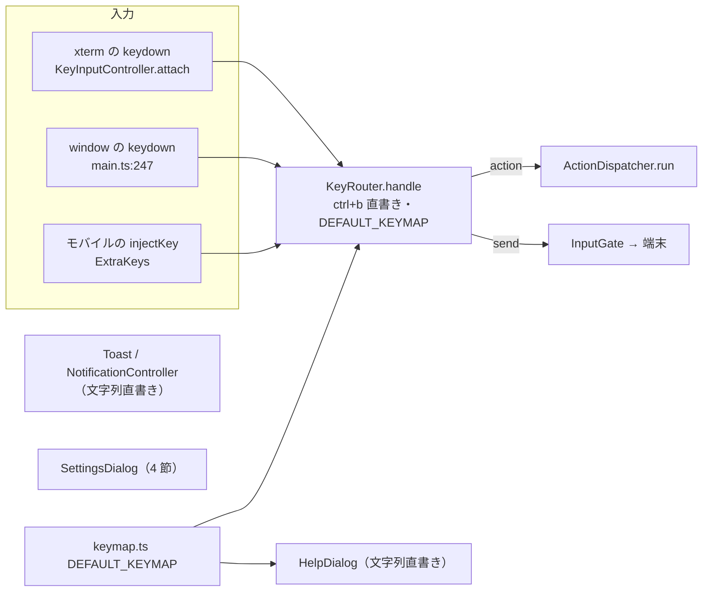

# 調査: キー割り当てのカスタマイズ（herdr のキー設定）

herdr の版は前の work と同じ `da6bcd5969779bfe0396bcf89a8025d4375d611e`（2026-09-18 の `master`）。`third_party/herdr` には
ソース全体が無い（README・`agent-detection/`・LICENSE だけ）ので、同じコミットを scratchpad に clone して読んだ
（`git clone --filter=blob:none` → `git checkout da6bcd59`）。以下の `herdr:` は clone 先の相対パス。

## 調査の問い

- Q1: herdr のキー設定は何を変えられ、どんな記法で、どう検証されるか（既定値・衝突・予約・安全でないキー）。
- Q2: 本製品のキー処理は、prefix・割り当て・案内をどこに直書きしているか。差し替えるとき何に触るか。
- Q3: ブラウザは修飾キー付きのキーをどう届けるか（`event.key` の値・shift・AltGr・Option・ブラウザが先に取るキー）。
- Q4: 設定画面（ネイティブ `<dialog>`）の中でキーを取り込むとき、Esc・フォーカスはどうなるか。
- Q5: 割り当ての保存・読み込みの仕組み（既存の `wtm.prefs.v1`）。
- Q6: 案内（キー一覧・トースト・通知の案内文・モバイルの Prefix ボタン）と E2E の追従先。
- Q7: 「キーを取り込んで割り当てる」UI の確立したパターン（UI の規範）。

## 判明した事実

### herdr のキー設定（Q1）

- F1: 設定は `[keys]` の表。`prefix`（文字列。既定 `ctrl+b`。`f12`・`esc` も書ける）と、操作ごとの項目（`new_tab`・`split_vertical` 等の
  約 55）。値は文字列か文字列の配列（`BindingConfig::One | Many`）。根拠 `herdr:src/config/keybinds.rs:20-25`、
  `herdr:src/config/model.rs:333-460`（項目の一覧と既定値。doc コメントに `Default: "prefix+shift+n"` 等）。
- F2: 記法は明示的。`prefix+n` は「prefix を押した次に n」、`ctrl+alt+n` は terminal モードで直接効く chord。
  修飾キーは `ctrl`・`alt`・`shift`・`cmd`、特殊キーは `enter`・`tab`・`esc`・`left`…、句読点は名前
  （`minus`・`comma`・`plus`・`ampersand`・`backtick`）。根拠 `herdr:docs/versions/0.9.1/website/src/content/docs/configuration.mdx:124-166`、
  実装 `herdr:src/config/keybinds.rs:1074-1121`（`parse_binding_string`。`prefix+` の接頭辞で `Prefix` か `Direct` に分ける）。
- F3: 範囲の記法 `1..9`。`switch_tab = "prefix+1..9"`（既定）・`"prefix+alt+1..9"` のように修飾キーを付けられる。
  展開すると `1`〜`9` の 9 個の割り当て。根拠 `herdr:.../configuration.mdx:168-179`、`herdr:src/config/keybinds.rs:1080-1100`。
- F4: **衝突は「先に登録した方を残し、後の方を無効にして診断を出す」**。種類（prefix の後／直接）ごとに別の表で数える。
  既定と利用者の設定がぶつけば利用者が勝つ。根拠 `herdr:src/config/keybinds.rs:398-449`（`BindingRegistry`）、
  `:1029-1071`（`reject_binding`。`kept {first_field}, disabled {field}` は `:1049-1058`）。
- F5: **prefix 自身を「prefix の後のキー」にできない**（prefix を 2 度押すとそのキーを端末へ送る規則があるため）。
  根拠 `herdr:src/config/keybinds.rs:1036-1046`（`reserved keybinding: … pressing the prefix twice sends a literal prefix key`）。
- F6: **修飾キーの無い文字（shift だけの文字を含む）を直接のキーにするのは「安全でない」として無効**にして診断を出す
  （端末への入力を奪うため。`use "prefix+n"` と勧める）。根拠 `herdr:src/config/keybinds.rs:1061-1069`、判定 `:1484-1488`
  （`is_unmodified_printable`。`shift` は差し引いて数える）。
- F7: navigate モードの移動キー（`navigate_workspace_*`・`navigate_pane_*`）だけは、prefix なしの素のキーを書ける
  別の表で、`prefix+`・`esc`・`enter`・`tab`・`shift+tab`・左右の矢印・素の `1`〜`9` は予約。copy・resize の中のキーは
  設定できない。根拠 `herdr:.../configuration.mdx:154`、`herdr:src/config/keybinds.rs:729-749`。
- F8: 任意の操作は既定では割り当てなし（`move_tab_previous`・`resize_pane_*`・`last_pane`・`previous_workspace`…）。
  「`prefix+` で prefix モード、直接使うなら修飾キー付きの chord」。根拠 `herdr:src/config/model.rs:374-450`。
- F9: 文書が勧める prefix なしの構成は **`ctrl+alt`**。理由：端末・デスクトップがほぼ使っておらず、macOS の Option の
  文字化けの影響を受けず、キーボードプロトコルの無い端末でも届く。避けるもの：`ctrl+alt+矢印`（GNOME・Ghostty・Konsole）、
  `ctrl+alt+t`（Ubuntu・Fedora の端末の起動）、`ctrl+alt+l/a`（KDE）、`ctrl+alt+s/u`（Konsole）、`ctrl+alt+f1..f12`
  （仮想コンソール）。一式は `focus_pane_*`=`ctrl+alt+h/j/k/l`、`previous_tab`=`ctrl+alt+[`、`next_tab`=`ctrl+alt+]`、`new_tab`=`ctrl+alt+c`、
  `split_vertical`=`ctrl+alt+d`、`split_horizontal`=`ctrl+alt+shift+d`、`zoom`=`ctrl+alt+z`（いずれも prefix の割り当てを残したまま足す）。
  根拠 `herdr:docs/versions/0.9.1/website/src/content/docs/keyboard.mdx`「Going prefix-free」。
- F10: キーの照合。文字は「実際の文字が同じ」か「両方に shift があって大小を無視して同じ」。shift だけが違う
  大文字の入力（古い端末）も受ける。記号はその文字そのもの（`!` は `1` の shift）。根拠 `herdr:src/config/keybinds.rs:1332-1456`。
- F11: herdr では設定の変更は `config.toml`＋再読み込み（`herdr server reload-config`・メニューの reload config）。
  設定画面（`prefix+s`）にはキーの編集が無い。本製品には利用者が書く設定ファイルが無いので、**編集の場所は設定画面になる**
  （`docs/herdr-parity.md` H25b・テーマの色の上書きと同じ論点。今回は設定ファイルを作らない）。根拠 `configuration.mdx:41-53`。

- F11b: herdr のキー一覧（`prefix+?`）は**現在の割り当て**から作る。`keybind_help_groups(keybinds, prefix)` が「global（prefix mode・keybinds・settings・detach・
  reload config・open notification target）／navigation／workspaces / tabs／pane…」の群ごとに `binding_label(&keybinds.<操作>)` を並べ、
  **割り当てが無ければ `unset`**、`1..9` の範囲は 1 つにまとめて `prefix+1..9` と出す（`indexed_label`）。先頭に **prefix 自身**を「prefix mode」の行として出す。
  根拠 `herdr:src/input/keybind_help.rs:38-140`。本製品の `HelpDialog.vue` の群分けも同じ群（D76）で、直書きを現在の割り当てからの生成に置き換えればよい。

### 本製品の実装（Q2・Q5・Q6）

- F12: prefix は `ctrl+b` の文字列比較で 2 か所に直書き。`KeyRouter.handle`（terminal・copy モードで prefix に入る）
  `packages/web/src/keys/KeyRouter.ts:82`、`handleInPrefix`（prefix 中の 2 度押し。`\x02` を端末へ送る）`:108-111`。
- F13: 割り当ては `DEFAULT_KEYMAP`（`Map<combo, Action>`。prefix の後のキーだけ）`packages/web/src/keys/keymap.ts:23-67`。
  `KeyRouter` は生成時に受け取り（`:64-68`）変えられない。使う所は `main.ts:98-103`（本番）・`HelpDialog.vue:3,29-33`（後続の案内の文言）と、
  テストの `new KeyRouter(DEFAULT_KEYMAP, …)`（約 45 か所）。
- F14: `comboKey`（`KeyRouter.ts:41-48`）は `ctrl+`・`alt+`・`meta+` の順に前置し、文字キーは `event.key` の大小で shift を表す
  （`H`＝shift+h）。`Tab`・`Enter`・`Escape`・矢印・`Home` 等（`SHIFT_INSENSITIVE_KEYS` `:30`）だけ `shift+` を足す。修飾キー単体の keydown は
  prefix 中に無視して待ち続ける（`MODIFIER_ONLY_KEYS` `:39`・`handleInPrefix` `:103-107`。D81）。
- F15: prefix の状態機械。terminal・copy モードで prefix を押すと `prefix` に入り 3 秒で戻す（`PREFIX_TIMEOUT_MS` `:6`・`enterPrefix` `:125-133`）。
  prefix 中は Esc で取り消し・prefix の 2 度押しで `\x02` を端末へ・割り当てのないキーは黙って捨てる・割り当てがあれば
  `action`（`enterMode` なら移った先のモード、それ以外は戻り先）（`:103-123`）。**直接のキーの経路は無い**（terminal モードの `pass` だけ `:83`）。
- F16: キーの入口は 3 つ。xterm の `attachCustomKeyEventHandler`（`KeyInputController.attach` `:145-148`）・端末以外にフォーカスがあるときの
  window の keydown（`main.ts:247-251` → `handleDomKey` `:151-155`。ダイアログが開いている間・xterm の textarea にフォーカスがある間は何もしない）・
  モバイルの `injectKey`（`:162-176`）。すべて `KeyRouter.handle` を通る。`KeyInput` は `key・code・ctrl・alt・shift・meta・type・composing`
  （`actions.ts:9-18`）で、**AltGraph の状態を持たない**（`KeyboardEventLike` `KeyInputController.ts:24-36` に `getModifierState` が無い）。
- F17: 案内の直書き 4 か所。`HelpDialog.vue:37-90`（`HELP_GROUPS` の `keys: "v"` 等。**`prefix+` を省いた表記**で、直接のキーを表せない）、
  `Toast.vue:36`（`"Ctrl+B ? でキー一覧"`）、`NotificationController.ts:33`（`"…後から prefix+s でも変えられます"`）、
  `ExtraKeys.vue:71-74`（Prefix ボタンが `{key:"b", ctrl:true}` を注入）。ほかに画面に出るキーの表記は無い
  （`<kbd>`・メニューの右端の表記・`title` は grep で 0 件）。
- F18: 「後続」の案内は `NOT_YET` の 2 つ（`R`＝reload_config・`e`＝edit_scrollback）で、`ActionDispatcher` が「未対応（後続: …）」と出す
  （`actions/ActionDispatcher.ts:147-149`）。
- F19: 保存は `wtm.prefs.v1` の 1 つの JSON（`readPrefs`/`writePrefs`。`store/view.ts:42-70`）。読み書きは try/catch の内側で、
  **既存の値に併合して書く**。設定の値は `store/settings.ts` が値ごとに検証して読む（`loadStatusSymbols` 等）。
- F20: 設定画面は 1 枚のネイティブ `<dialog>`（`SettingsDialog.vue:242`）。見出しで節を分け（通知 `:249`・テーマ `:288`・表示 `:344`・端末 `:356`）、
  Esc は `@cancel` で `preventDefault` してから自前で閉じる（`:235-239`）。開いている間は `view.openDialog` が立ち、
  window の keydown 経路と `KeyRouter`（`dialog` モード）はキーを扱わない（`main.ts:237-249`）。
- F21: 設定画面の入口は 3 つ（`prefix+s`・サイドバーのメニュー・モバイルの上部バー `MobileShell.vue:87`）。**キーが使えなくなっても設定画面へは行ける**。
- F22: E2E の共通操作 `prefixKey(page, key)` は `Control+b` の次に 1 キー（`packages/e2e/src/support/keys.ts:11-15`）。既定のままなら変わらない。
  E2E からキーを送ると、修飾キー付きの文字は**打った文字どおりの `event.key`**で届く（下の F24）。
- F23: `copy` モードの中の `ctrl+b`（ページアップ）は、prefix が `ctrl+b` である間は prefix に奪われて到達しない（`KeyRouter.ts:82`。
  `CopyMode.ts:6` は「`ctrl+b` は未確認のまま見送った」）。herdr の文書も同じ制約を書いている
  （`keyboard.mdx`「Copy mode」：別の prefix にすれば `ctrl+b` を copy モードで使える）。

### ブラウザのキー入力（Q3・Q4）

- F24（実測。Chromium・Playwright の合成キー。`page.keyboard.press`）:

  | 押したもの | `event.key` | `event.code` | 修飾 |
  |---|---|---|---|
  | `Control+Alt+d` | `d` | `KeyD` | ctrl・alt |
  | `Control+Alt+Shift+d`（小文字で指定） | `d` | `KeyD` | ctrl・alt・shift |
  | `Alt+Shift+D`（大文字で指定） | `D` | `KeyD` | alt・shift |
  | `Control+Alt+[` / `]` | `[` / `]` | `BracketLeft` / `BracketRight` | ctrl・alt |
  | `Control+Alt+1` / `Alt+1` | `1` | `Digit1` | ctrl・alt / alt |
  | `Control+Shift+Alt+ArrowLeft` | `ArrowLeft` | `ArrowLeft` | ctrl・shift・alt |
  | `Shift+Tab` | `Tab` | `Tab` | shift |
  | `Shift+1` / `Shift+/` | `1` / `/`（合成では変換されない） | `Digit1` / `Slash` | shift |
  | `Control+Shift+v` | `v` | `KeyV` | ctrl・shift |
  | `F5` / `F12` | `F5` / `F12` | 同 | なし |

  **合成のキーは shift を付けても文字を大文字にしない**（実物のキーボードは shift 中に `D`・`!` を返す）ので、shift の有無は `shiftKey` で見て、
  文字の大小に頼らない照合が要る（E2E は大文字で送れば実物に近い）。生の出力は `test-result.md` 側ではなくこの調査の実測（scratchpad `kbprobe/probe.mjs`）。
- F25（実測）: **ネイティブ `<dialog>`（`showModal()`）の中で、Esc の keydown に `preventDefault()` すると `cancel` も `close` も起きず、ダイアログは開いたまま**
  （Chromium。連続 2 回押しても同じ）。しないと `keydown` → `cancel` → `close`。取り込み待ちの Esc は keydown の `preventDefault()` で足りる。
  Firefox・Safari は未確認（`@cancel` を無視する保険も置く）。
- F26（既知の環境の差。実機では未確認）: macOS の Option（alt）は文字を別の文字に化かす（`Option+d` → `∂`）が、`event.code`（`KeyD`）は変わらない。
  Windows の AltGr は `ctrlKey` と `altKey` の両方が立つ入力として届き、`getModifierState("AltGraph")` が真。
  出典：MDN `KeyboardEvent.getModifierState()` の修飾キーの表——`"AltGraph"` は「**Alt と Ctrl が両方押されている、または AltGr が押されている**」
  （Firefox・Windows の列。https://developer.mozilla.org/en-US/docs/Web/API/KeyboardEvent/getModifierState）。Option の文字化けの記述は
  この調査では一次資料で確かめていない（`event.code` は物理キーの位置で文字化けの影響を受けない、という MDN の一般の説明にだけ依る）。
  design で「取り込む前に AltGraph を拒否する」「Option の化けは code で元の文字へ戻す」と決め、実機の確認は verification.md に回す。herdr は同じ問題を「Alt・Cmd・修飾付きの句読点は端末次第」と文書に書いて解決を利用者に任せている
  （`configuration.mdx:154`）。
- F27（既知。実機では未確認）: ブラウザが先に受けて**ページに届かない**キーがある（Chromium の `Ctrl+T`・`Ctrl+N`・`Ctrl+W`・`Ctrl+Shift+T/N/W`・`Ctrl+Tab`・
  `Ctrl+PageUp/PageDown` 等）。届かないので取り込みにも現れない＝割り当てられない。届いたものは `preventDefault()` で既定動作を止められるのが普通
  （`Ctrl+R`・`F5`・`Ctrl+L` 等。ただし止めてよいかは別）。出典：MDN Keyboard API——「Escape・Alt+Tab・Ctrl+N のようなキーは、
  通常ユーザーエージェントか OS が取る」。取る側を上書きする Keyboard Lock API（`navigator.keyboard.lock()`）は**全画面のときだけ・実験的**
  （https://developer.mozilla.org/en-US/docs/Web/API/Keyboard_API）。本 work は使わない（対象外に書く）。個々の予約キーの一覧は一次資料で確かめていない
  ので、本製品は一覧を持たず、「届いたキーだけを割り当てられる」で扱う。

### UI の規範（Q7）

- F28: キーの割り当てを取り込む画面の先例。
  - **VS Code（Keyboard Shortcuts エディタ）**：「Define Keybinding」でキーを取り込む入力を開き、「入力し終えたら **Enter で確定**」
    （和音〔chord〕を打てるので、Enter で区切る）。削除・重複の表示は右クリックの操作（`Remove Keybinding`・`Show Same Keybindings`）。
    出典 https://code.visualstudio.com/docs/configure/keybindings。
  - **macOS「キーボードショートカット」**：「Keyboard shortcut の欄をクリックし、使いたいキーの組を**押す**、そして Done」。
    すでに他のコマンドが使っている組は「**動かない**——新しい方か他方を変える」。出典 https://support.apple.com/guide/mac-help/create-keyboard-shortcuts-for-apps-mchlp2271/mac。
  - **Discord（Keybinds）**：「Add Keybind」→ Action の Record Keybind → **キーの組を押す**。**編集中はキーバインドが無効**
    （設定画面を離れると有効になる）。出典 https://support.discord.com/hc/en-us/articles/217083547-How-do-I-add-different-Keybinds ほか。
  - 3 つの共通点：**取り込み待ちの間は既存のキー操作が働かない**／押したキーを取り込む／取り消しの手段を持つ。違い：確定を「キーを押した瞬間」にするか
    「Enter を押したとき」にするか——**和音（2 打）を扱う VS Code は Enter を要る**が、本製品は 1 打（chord）だけなので**押した瞬間**で足りる
    （macOS・Discord と同じ）。
- F29: WAI-ARIA APG に「キーを取り込む部品」の型は無い。守るのは WCAG の 2 つ。**2.1.4 Character Key Shortcuts（A）**：文字・記号だけの 1 打のショートカットは
  「無効にできる・付け替えられる・フォーカス時だけ効く」のどれかが要る——本製品の直接のキーは修飾キー必須で 1 打の文字ショートカットを作らず、付け替えもできる。
  **2.1.2 No Keyboard Trap（A）**：キーボードだけで入ったフォーカスからキーボードだけで出られる——取り込み待ちがすべてのキー（Tab を含む）を食うので、
  **Esc で出られることを画面に書く**（AC-I1・AC-I5）。

## 影響範囲

- 変える：`keys/KeyRouter.ts`・`keys/keymap.ts`・`keys/KeyInputController.ts`（AltGraph・直接のキー）・`keys/actions.ts`（`KeyInput`）・
  `main.ts`（Router の生成・window の keydown）・`components/HelpDialog.vue`・`Toast.vue`・`notify/NotificationController.ts`・`mobile/ExtraKeys.vue`・
  `components/SettingsDialog.vue`（節の追加）・`store/settings.ts`（保存）。
- 変えない：サーバ・protocol（キーはブラウザの中で完結する）・`CopyMode`/`NavigateMode`/`ResizeMode` の中のキー・`ActionDispatcher` の操作の実体。

## 実現性 / リスク

- 実現性は高い（新しい依存も protocol の変更も要らない）。
- リスク R1：**押すたびに通る最短経路に手を入れる**。`KeyRouter.handle` は全キー入力が通る。割り当ての引きは、割り当てが変わったときに一度作る表を引くだけ（O(1)）にする。
- R2：**キーが効かなくなる事故**。prefix を空にできない・prefix を予約キーにできない・壊れた保存値は値ごとに落とす・すべてを既定へ戻す手段が
  キーに依らず（設定画面のボタン）ある、を守る。設定画面はキー以外（サイドバーのメニュー・モバイルの上部バー）からも開ける（F21）。
- R3：**取り込み待ちの間にキーが漏れる**（Esc でダイアログが閉じる・prefix に入る・端末へ届く）。F25 の実測で Esc は keydown の `preventDefault()` で止まる。
  ダイアログが開いている間は window・xterm の経路がキーを扱わない（F20）ので、取り込み側が受け止めれば足りる。
- R4：**環境差（Option・AltGr・ブラウザ先取り）は実機で確かめられない**（ユーザーが実機確認を後回しにしている。WSL の Chromium だけ）。
  取り込む前の拒否（AltGr）と code による復元は単体テストの合成イベントで守り、実機の確認は verification.md に残す（F26・F27）。
- R5：**既存テスト約 45 か所が `new KeyRouter(DEFAULT_KEYMAP, …)` に直に依存**（F13）。生成の形を変えるなら、既定の割り当てから作る同等の値を渡せる形を残す。

## 実装アンカー

- A1: prefix の判定 2 か所（`ctrl+b` の直書き）（`packages/web/src/keys/KeyRouter.ts:82`・`:108`）。
- A2: 既定の割り当て表（`packages/web/src/keys/keymap.ts:23-67`）と `NOT_YET`（`:13-16`）。
- A3: キーの入力（`KeyInput`）の形（`packages/web/src/keys/actions.ts:9-18`）と、DOM のイベントからの変換 `toKeyInput`（`KeyInputController.ts:38-49`）・
  `KeyboardEventLike`（`:24-36`）。
- A4: window の keydown（`packages/web/src/main.ts:247-251`）と Router・Controller の生成（`:98-103`）。
- A5: キー一覧の直書き（`packages/web/src/components/HelpDialog.vue:28-90`）。
- A6: トースト・通知の案内文・モバイルの Prefix ボタン（`Toast.vue:36`・`NotificationController.ts:33`・`ExtraKeys.vue:71-74`）。
- A7: 設定画面の節（`packages/web/src/components/SettingsDialog.vue:249-356`）・Esc（`:235-239`）・保存の入口（`store/settings.ts`・`store/view.ts:42-70`）。
- A8: E2E のキー操作（`packages/e2e/src/support/keys.ts:11-15`）。
- A9: 操作の実行（`packages/web/src/actions/ActionDispatcher.ts:72-167`。ここは変えない）。

## 実装時の注意

- N1：`comboKey` の既存の性質（文字は大小で shift を表す・`Tab` 等だけ `shift+`）に依るテストがある（`KeyRouter.test.ts:47-54`・`:100`・`:111`・`:140`）。
  ctrl・alt・meta を伴う文字だけ「小文字＋明示の shift」にそろえるなど、**既存の割り当て（`H`・`T` 等）の照合を壊さない**形にする。
- N2：`KeyRouter.enterPrefix` は `copy` モードでも prefix に入り、戻り先を覚える（`:125-127`）。prefix を変えても、この戻り先の規則は同じ。
- N3：`ExtraKeys` の Prefix ボタンは `ctrl` を付けて注入し、pending の修飾を重ねない工夫がある（`KeyInputController.ts:107-116` のコメント）。prefix が `alt+…` や F キーに
  なっても、注入するキーは `KeyInput` そのもの（実物の `KeyboardEvent` ではない）。
- N4：xterm は `attachCustomKeyEventHandler` が `false` を返してもブラウザの既定動作を止めない（`preventDefault()` は呼び出し側の責務。
  `KeyInputController.ts:171-187` のコメント）。直接のキーで `action` を返す経路も、必ず `preventDefault()` を通る（今の `handleTerminalKey`）。
- N5：設定画面の Esc は `@cancel` で `preventDefault()` してから閉じる（F20）。取り込み待ちの Esc は、`cancel` の前の keydown で止める（F25）。
- N6：E2E は**ビルドした dist**で走る（`pnpm build` が先）。E2E で shift 付きの文字を送るときは大文字で送る（F24）。

## design への申し送り

- 割り当ての単位・保存の形（herdr の文字列か内部の構造か）・`KeyInput` の正規化（shift・Option・AltGr）・Router への表の渡し方（差し替え可能な表）・
  `1..9` の範囲の扱い・prefix の 2 度押しで送るバイト列の作り方・案内文の作り方（現在の割り当てから 1 か所で）・節「キー」の置き場と取り込み待ちの見せ方・
  「後続」の案内（`R`・`e`）の残し方・直接のキーを効かせるモード（terminal だけ）・E2E の作り方（キーを送る側と検証する側）。
