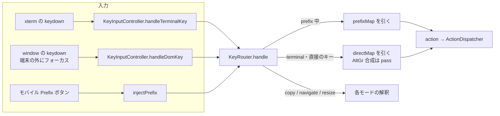
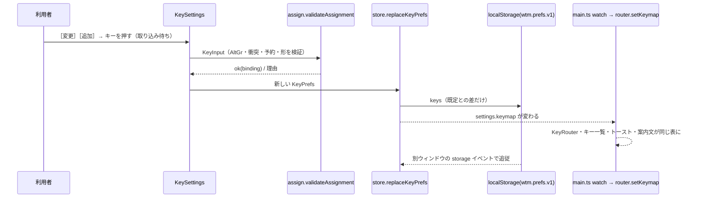

# レビューガイド: キー割り当てのカスタマイズ（20260921-keybinding-customization）

## 変更概要 / 目的

herdr の設定 `[keys]` に相当する機能を、**web の画面だけ**（サーバ・protocol は無変更）で足した。設定画面の節「キー」で、prefix（既定 `ctrl+b`）と 34 の操作の割り当てを**押したキーを取り込んで**変えられ、
prefix を押さない**直接のキー**（`ctrl+alt+d` のような 1 打）も付けられる。保存は「このブラウザ」の既定との差だけ（`wtm.prefs.v1` の `keys`）。何も変えなければ今のキー操作は 1 つも変わらない。
目的（requirements）：エージェントを何本も見張る利用者が prefix なしで pane を行き来でき、prefix を変えたい人が迷わず壊さずに変えられる状態。

## 重要ポイント

- **chord の正規形を 1 か所に集める**（`chord.ts`）：実キー照合・取り込み・保存・表示のすべてが同じ文字列（`ctrl+alt+shift+d`・`prefix+?` 等）を使う。**読める chord だけを作る**（`chordOf` と `parseChord` が同じ `isChordChar`）。
- **解決した表（`ResolvedKeymap`）を 1 か所で作り、全入口が同じ表を見る**（`keymap.ts`）：`KeyRouter`・キー一覧・トースト・通知の案内文・モバイルの Prefix ボタン。旧 `DEFAULT_KEYMAP`（Map）は既定から解決した表と 1:1（`keymap.test.ts` が旧表を固定した値と比べる）。
- **直接のキーのルール**（decisions D4）：terminal モードでだけ・ctrl/alt/cmd か F キーを含む・押しっぱなしは食う（`enterMode` の繰り返しが次のモードに漏れないよう `directHeld`）。herdr より厳しい（修飾なしの `tab`・矢印等も拒否）。
- **AltGr の扱い**（D6a・D14・D15）：AltGr で合成された文字は、取り込みでも**実行時にも**直接のキーに当てない。判定は「同じ物理キーを同じ shift の状態で押した US 配列の文字と違う」（`isAltGrComposed`）。**この関数は 2 回の差し戻しの中心**：ラウンド 1 の直しが退行を作り（`shift` を見ず両表と比較）、ラウンド 3 で「項を丸ごと消す変異」しか確かめていなかったテストの穴が出た。今は 97 個の変異の網羅が全部落ちる。
- **取り込みの UI**（D9・`KeySettings.vue`）：`
` 1 行ずつ・取り込みの部品は 1 つの `captureAttrs` を 3 入口が共有・Esc は取り込みだけを取り消し（親には次のタスクまで知らせない〔`holdCancel`〕。Firefox・Safari は未確認）・フォーカスは押したボタンへ戻す・結果は下に固定した `role="status"`。
- **保存は差だけ・壊れた値は値ごとに落とす**（`keyPrefs.ts`・`store/settings.ts`）。`replaceKeyPrefs` が読み直して正規化し、状態も保存も同じなら何もしない。別のウィンドウの変更は `storage` イベントで追従（D13）。
- 既知の差・受け入れた逸脱は decisions：D7（macOS 非 US 配列の Option の表示）・D8（CapsLock＋Shift）・D10（キー一覧の並び）・D11（`keydown` を止めるボタン上では届かない）・D13（おすすめ一式の環境差・CapsLock の直接のキー）。

## 処理フロー

## 主要な変更箇所

- `packages/web/src/keys/chord.ts:170,213,472` — `parseChord`・`chordOf`（正規形）・`isAltGrComposed`（AltGr 判定。**最も注意して読む所**）。`prefixBytes:365`（2 度押しで端末へ送る列）
- `packages/web/src/keys/bindings.ts:31` — 操作の目録 `ACTIONS`（34 個・herdr の `[keys]` の名前）と既定の割り当て
- `packages/web/src/keys/keyPrefs.ts:80,99` — 保存値の読み込み（値ごとに落とす）・書き出し（既定との差だけ）
- `packages/web/src/keys/keymap.ts:67` — `resolveKeymap`（上書きが既定に勝つ・衝突は先を残す・全部落ちたら既定へ）。`RESERVED_AFTER_PREFIX:34`
- `packages/web/src/keys/assign.ts:62,211,277` — `validateAssignment`（AC6 の (a)〜(g)）・`planReset`・`applyRecommended`（おすすめ一式）
- `packages/web/src/keys/KeyRouter.ts:75,115,127` — `handle`・`handleDirect`（直接のキー・AltGr のガード・押しっぱなし）・`handleInPrefix`
- `packages/web/src/keys/KeyInputController.ts:167` — `injectPrefix`（モバイル。prefix に入れるモードでだけ・待機中の Ctrl/Alt を重ねない）
- `packages/web/src/store/settings.ts:168,186` — `replaceKeyPrefs`・`storage` 追従
- `packages/web/src/components/KeySettings.vue:97,151,158` — `endCapture`・`captureAttrs`・`onCaptureKeydown`。`SettingsDialog.vue:243`（取り込み待ちの間は Esc で閉じない）
- `packages/web/src/main.ts:100,106` — `setOptionComposes(isMacPlatform())`・`watch(settings.keymap → router.setKeymap)`（配線。変異で E2E が落ちる）
- `packages/web/src/notify/NotificationController.ts:337`・`HelpDialog.vue`・`Toast.vue`・`mobile/ExtraKeys.vue:71` — 案内・一覧・Prefix ボタンが現在の割り当てに従う
- `packages/e2e/src/specs/key-bindings.spec.ts`（14 本）・`settings.spec.ts`（節が 5 つに）— 判定はブラウザが送ったフレーム・DOM・フォーカス
- `docs/herdr-parity.md`（H12・H25・H26）・`docs/verification.md`（手で確かめる項目・既知の制約）

## リスク / 確認したい点

- **実機で確かめていない環境差**（docs/verification.md「手で確かめる項目」・「既知の制約」）：Firefox・Safari の Esc と `cancel` の順序、Windows の AltGr（特に Firefox。記号の位置が US と違う配列は拒否されうる／AltGr の記号が US と同じ物理キーにある配列は合成と判定できない）、macOS の Option、IME、実機のモバイル。自動のテストは Linux の Chromium だけ。
- **`keydown` を止めるボタン（サイドバーの［＋新規］等）にフォーカスが残る間は prefix も直接のキーも届かない**（既存の挙動。backlog に起票）。
- **おすすめ一式には環境で届かないキーがある**（`Ctrl+Alt+L`〔KDE のロック〕・AltGr で `[` `]` を打つ配列の `Ctrl+Alt+[` `]`）。ボタンの脇に注記、［変更］で付け替える。
- 大文字は shift 付きとみなす既存の規則のため、CapsLock 中は直接のキー `ctrl+alt+d`／`ctrl+alt+shift+d` の対が区別できないことがある（未確認。D13）。
- **テストの実行範囲**：E2E の一式（116 本）は 2 回目の木で通り、その後の直しは影響する 2 spec（25 本）・単体・変異の網羅で確かめた（本番コードの最後の変更は `isAltGrComposed` と注記の `aria-describedby`）。review の差し戻しは上限の 3 回に達した（D14・D15）。
