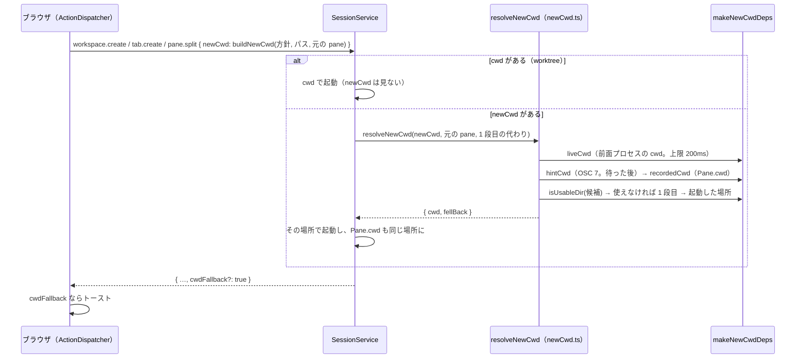

# レビューガイド: 新しい workspace・tab・pane を、いま見ている場所で開く（herdr の `terminal.new_cwd`）

## 変更概要 / 目的

新しい workspace・tab・分割を開く場所の方針を足した（引き継ぐ・ホーム・サーバを起動した場所・指定した場所。既定は herdr と同じ「引き継ぐ」）。
以前は新しい workspace がいつもサーバを起動した場所、新しい tab がその workspace を作った場所で開き、別のリポジトリへ移るたびに `cd` し直していた
（requirements「背景 / 課題」）。方針は**ブラウザごとの設定**（`prefix+s` の「端末」）で、作成の要求に載せる。場所を決めるのはサーバ。

## 重要ポイント

- **規則は 1 か所**：`packages/server/src/session/newCwd.ts` の `resolveNewCwd`（design「規則（ここが正典）」・D6）。`SessionService` の 3 つの作成は
  1 段目の代わり（workspace は起動した場所、tab はその workspace の場所、分割は元の pane の記録）を渡して呼ぶだけ。
- **「引き継ぐ」はその時点で読み直す**：前面プロセスの cwd（上限 200ms）→ OSC 7 → 記録された `Pane.cwd` の順（design D2・D4、decisions D9）。
  いちばん外側のシェルではなく前面のプロセスを読むので、入れ子のシェルやエージェントの中の `cd` も拾う。上限は前面プロセスの読み取りにだけ掛け、
  OSC 7 は上限を超えても読む（Windows は走査が遅いのに cwd を返さない。cross の点検）。
- **知らせるのはサーバが決める**：「引き継ぐ」以外の方針で代わりへ回したときだけ `cwdFallback: true`（design D9・decisions D5）。web は見直さずトーストを出す。
- **`cwd`（worktree を開く）が `newCwd` に勝つ**：web の worktree の経路は `newCwd` を送らず、サーバも `cwd` を優先して検証も代わりもしない（design D5）。
- **`newCwd` の無い要求は今までどおり**（古いクライアント・テストのクライアント）。`newCwdDeps` を持たない `SessionService` も今までどおり（テストの構築を触らないため）。
- **`Pane.cwd` は起動した場所と同じにする**・**`Workspace.cwd` は新しい workspace のときだけ**（git の情報と worktree が使う）。
- 設定の「指定した場所」は入れ終えた時点（`change`・Enter・**ダイアログを閉じたとき**）で確定する（decisions D8。実物の Chromium は閉じると `change` を立てる）。
- `parseOsc7` を、サーバが Windows のときだけ `/C:/…` → `C:\…` に直した（decisions D7。この work の範囲の外の `Mirror.ts` に触った）。

## 処理フロー

## 主要な変更箇所

- `packages/protocol/src/messages.ts` — `NewCwd`（4 つの方針の discriminated union）、3 つの作成の params の `newCwd?`、結果の `cwdFallback?`
- `packages/server/src/session/newCwd.ts` — `expandHome`・`resolveNewCwd`（上限つきの読み直し・2 段の代わり・`fellBack`）・`isUsableDir`・`makeNewCwdDeps`
- `packages/server/src/session/SessionService.ts` — `placeFor`（`newCwd` が無ければ値を、あれば Promise を返す。**余計な microtask を挟まない**ため——
  既存の「分割の猶予中の孤児」のテストが同期の起動を前提にしている）、3 つの作成、分割は場所を決めた後に分割元を確かめ直す
- `packages/server/src/composeServer.ts` — `defaultCwd` を 1 本にし、`makeNewCwdDeps` を `SessionService` へ
- `packages/web/src/actions/ActionDispatcher.ts` — `newCwdFor`・`focusedPaneIn`（元の pane の決め方。design D7）・`noteCwdFallback`
- `packages/web/src/components/SettingsDialog.vue` — 端末の節の「新しく開く場所」（ラジオ 4 つ＋入力欄。下書きの ref と v-model）
- `packages/e2e/src/specs/new-terminal-cwd.spec.ts` — ブラウザが受けたフレームで `pwd` を読む E2E 4 本
- `packages/server/src/composeServer.integration.test.ts` — 監視を動かさずに本物のシェルで読み直しを確かめる（E2E では記録の側で通ってしまうため）

## リスク / 確認したい点

- **Windows・macOS は実機で確かめていない**（test-result.md「未検証の穴」）。どちらも前面の cwd を読めず、シェルが OSC 7 を出さなければ「引き継ぐ」は
  元の pane を開いた場所になる（`docs/verification.md` の「既知の制約」）。
- 既定が「引き継ぐ」になったので、**web の作成の要求にはいつも `newCwd` が載る**。サーバを古いまま web だけ新しくすると、古いサーバの `z.object` は
  知らない `newCwd` を捨てて今までどおり動く（壊れはしない）。
- 前面でエージェントが動いている pane から作ると、エージェントを起動した場所で開く（Linux。design「ドメイン固有の考慮」）。
- 新しい workspace の名前は一律に「1」のまま（herdr は repo 名を自動の名前にする）。backlog に起票し、次の work で扱う。
