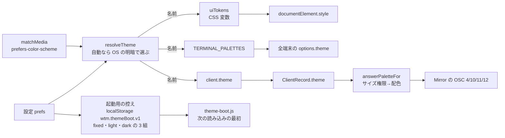

# 仕様: テーマを選び、OS の明暗に合わせて切り替える（herdr のテーマ）

## 概要

- **テーマは名前（17 種）で扱う**。名前ごとの**端末の配色**は `@wtm/protocol` に置き（サーバも答えに使う）、**画面の枠の色**
  （CSS 変数の値）は web が herdr の配色から組み立てる（dracula だけは今の値）。
- web は設定（1 つのテーマ・自動の切替・明るいとき・暗いとき）から**いま使うテーマの名前**を決め、画面の枠（`:root` の CSS 変数と
  `color-scheme`）・開いている全端末（`term.options.theme`）へ当て、**その名前をサーバへ伝える**（新しい方式 `client.theme`）。
- サーバの Mirror は色の問い合わせを受けた**その時点で**、pane の tab のサイズを決めているブラウザが伝えた名前から配色を引いて答える。
- 読み込みの直後は、`<head>` の小さな外部スクリプトが、**設定から作っておいた 3 組（固定・明るいとき・暗いとき）の控え**から
  いまの明暗で 1 組を選んで先に当てる（ちらつき防止）。



## 設計方針

- **D1 名前を運ぶ（配色そのものは運ばない）**：サーバへ送るのは `ThemeName` だけ。サーバは protocol の `TERMINAL_PALETTES` から配色を引く。
  スキーマ（`z.enum`）で検証でき、web とサーバの配色が食い違う余地が無い（web はサーバが配るので版は常に揃う）。
  退けた案：配色（19 色）を送る——検証が要り、答えの配色と画面の配色を 2 か所で持つことになる。
- **D2 端末の配色は上流の値＋3 つの規則**（3 つ目は coding で足した。decisions D10）：`TERMINAL_UPSTREAM`（**dracula を除く 16 テーマ**。配色集の値をそのまま。出典はファイルごとに
  注記。research F8）に `finalizePalette` で、(a) **文字と選択の色の比が 3 未満で、かつ背景色と選択の色の比のほうが大きいなら
  `selectionForeground` に背景色を入れる**（配色集の元の端末は選択した文字を反転させる前提。F10。該当は catppuccin・nord・
  gruvbox-light・kanagawa・kanagawa-lotus の 5 つ。tokyo-night-day は文字 2.49・背景 1.81 で背景のほうが悪いので当てない）、
  (b) **カーソルと背景の比が 3 未満ならカーソルを文字の色にする**（F11。catppuccin-latte 2.34・one-light 1.82 の 2 つ）を当てて
  `TERMINAL_PALETTES` を作る。(c) ブロックカーソルの下の文字（`cursorAccent`）を背景色にする（xterm.js の既定の #000000 は明るいテーマで読めない。
  decisions D10）。**dracula は `DEFAULT_THEME`（今の値）そのままで、選択の色・カーソルの下の文字の色も持たない**（今の xterm.js の既定を保つ。F9）。規則は protocol の中の 1 か所で、サーバの OSC 12 の答えも同じ値になる。上流の値から外れるので decisions D5 に残す。
- **D3 画面の枠の色は herdr の配色から機械的に作り、足りない色だけ明度を寄せる**（F13）：手で 16 テーマ分を書くと誤りやすい。
  寄せ方は `ensureContrast`（色を白か黒へ 1% ずつ混ぜ、全ての相手に対して比が足りた最初の色）。色相は保たれる。
  **全テーマの全組み合わせを単体テストで確かめる**（AC9）。dracula は今の値を定数で持つ（寄せない。CSS 変数の値で直すのは decisions D1 の
  アクセント #6070a1 だけ）。**dracula の正は `uiTokens.ts` の定数**で、`App.vue` の `:root`（JS が走る前の既定）はその写し——
  単体テストで `App.vue` の `:root` を読み、`uiTokens("dracula")` と全変数が一致することを確かめる。
- **D4 設定の画面は既存の節の流儀**（F18・F33・F36）：**選んだ時点で反映と保存**、取り消しは選び直し。部品は**ネイティブの `<select>`**
  （17 個をラジオで並べると節が長い。F35）。Windows・Linux の Chrome では閉じたまま上下キーで値が変わる（F35）ので、そのたびに反映され
  **試し見のように働く**（change が出ることは E2E で確かめる）。macOS では開いて選ぶ形になる見込み（出所なし。`docs/verification.md` で
  手で確かめる項目にする）。
  自動の切替は VS Code・GitHub の形（**切り替え 1 つ＋明るいとき・暗いとき**。F32・F33）。herdr の「Esc で開く前に戻す」は採らない
  （同じダイアログの他の項目は Esc で閉じても結果が残る。1 つの節だけ Esc の意味が変わると取り違える）。
- **D5 最初の描画は「設定から作った 3 組の控え」を、いまの明暗で選んで当てるだけ**（F23・F24）：`public/theme-boot.js`（classic・同じオリジン）が `<head>` で
  `wtm.themeBoot.v1` を読み、自動の切替なら `matchMedia` で明暗を選び、CSS 変数と `color-scheme` を `documentElement.style` に当てる。
  **名前の解決と配色の表は持たない**（本体と 2 か所に割らない）。**明暗の選び方（`auto ? (暗い ? dark : light) : fixed`、`matchMedia` が
  無ければ暗い）だけは本体と同じ規則を複製し、`themeBoot.test.ts` で本体の `resolveTheme` と同じ組を選ぶことを確かめる**。
  控えが無い・壊れていれば何もしない（`:root` の既定＝dracula のまま）。本体の `start()` は**省略の判定をせずに必ず当て直す**ので、控えが古くても自己修復する。
  控えは本体が **4 つの設定（`theme`・`themeAuto`・`themeLight`・`themeDark`）が変わったときと `start()` のとき**に、**保存された設定
  （`wtm.prefs.v1`）から**（同じブラウザの別のタブで変えた値にも揃える。review ラウンド 1）`lightDarkOf` で fixed・light・dark の 3 組を作って書く（`apply` とは別の処理。OS の明暗が変わっただけでは書かない）。置き場所は localStorage
  （`wtm.prefs.v1` と同じ）。
- **D6 答えの配色の引き方**（AC8 の書き戻し）：pane（`getPane`）の `Pane.tabId`（`model.ts:57`）→ tab（`getTab`）の `sizeOwnerClientId`
  （`model.ts:46`）→ そのクライアント（`clients.get`）の `theme`。**その人がいない・まだ伝えていない**ときは、`clients.list()` のうち
  **`view?.tabId === tab.id`（`ClientRegistry.ts:6-10` の `ClientView.tabId`。`client.view` で届く表示中の tab）で `theme` を持つもの**の
  `lastActedAt`（最後に操作した時刻。接続しただけでは 0。資格を問わず、作る操作の前にも進める。decisions D7・D13）が最新のもの（web は種別を問わず表示を `client.view` で送る——`term/ViewSync.ts:100`、方式は `messages.ts:31-35`——ので、
  fit していないモバイルだけが見ている場合もその配色になる）。
  **pane・tab がまだ引けない**（新しい pane はシェルの起動の猶予の後にモデルへ入る）**・その tab に答えられる人がいない**（新しい tab は
  `client.view` が届くまで誰も見ていない）なら、テーマを伝えた全クライアントのうち `lastActedAt` が最新のもの（作った本人。
  decisions D8・D13。coding の点検で足した）。それも無ければ dracula。Mirror は**問い合わせの瞬間に**引く（保持しない）。**結線**：`composeServer.ts` は `terminals`（`:123`）を
  `session`（`:132`）・`clients`（`:165`）より先に作るので、`TerminalManager` には「後から埋める箱」を引く関数を渡す（箱が空の間は dracula。
  実際には pane を作る復元は `listen()` の中——箱を埋めた後——なので、空の間に問い合わせは来ない。coding で確かめた）。`clients` を作った直後に箱を埋める。
- **D7 対の無いテーマの明暗の既定**（AC6 の書き戻し）：暗いときはそのテーマ、明るいときは `catppuccin-latte`（herdr が明るい側の
  名前を知らないときに落とす先。F4）。herdr は `(name, name)`＝入れても変わらない。入れた人は明るい画面を求めているので herdr と変える。
  明るいとき・暗いときの `<select>` の先頭に「既定（〈対の表示名〉）」を置き、選ぶと「まだ選んでいない」（null）に戻る。

## 対象範囲

- protocol：`src/theme.ts`（名前・上流の配色・規則・表）、`src/color.ts`（新規。相対輝度・コントラスト比・混色）、`src/messages.ts`
  （`client.theme`）、`src/index.ts`（export）。
- server：`clients/ClientRegistry.ts`（`theme`・`setTheme`・`lastActedAt`。decisions D13）、`clients/SizeAuthority.ts`（操作の時刻を資格を問わず
  進める。decisions D7）、`surface/methods/tab.ts`・`workspace.ts`・`pane.ts`（作る前に操作の時刻を進める。decisions D13）、`surface/methods/client.ts`（`client.theme`）、`terminal/Mirror.ts`
  （答えの配色を関数で受ける）、`terminal/TerminalHost.ts`・`terminal/TerminalManager.ts`（渡す）、`clients/answerPalette.ts`（新規。D6）、
  `composeServer.ts`（結線）。
- web：`theme/themes.ts`（新規。表示名・対・名前の解決・保存値の読み込み）、`theme/uiTokens.ts`（新規。herdr の配色の抜粋・dracula の定数・組み立て）、
  `theme/ThemeController.ts`（新規。当てる・OS の明暗の追従・送る・控え）、`store/settings.ts`（4 つの値・`systemDark`・`effectiveTheme`）、`term/theme.ts`・
  `term/TerminalRegistry.ts`（配色を受ける・入れ替える）、`components/SettingsDialog.vue`（テーマの欄）、`App.vue`（`:root` に新しい変数と
  `color-scheme`）、直に書いた色の 11 ファイル（下の「直に書いた色の置き換え」）、`GotoPicker.vue`（透明度。decisions D2）、`MobileShell.vue`・
  `ExtraKeys.vue`（押された状態の文字の色を `--wtm-accent-fg` に）、`main.ts`（結線：`useSettingsStore` が `loadThemePrefs(readPrefs())` で読む →
  `ThemeController` を作って `start()`（`TerminalRegistry` を作った後。`getTheme` は `toXtermTheme(TERMINAL_PALETTES[settings.effectiveTheme])`）→
  `connection.onOpened` で `resend()` → `app.mount`）、`public/theme-boot.js`（新規）・`index.html`。
- 単体テスト：protocol `color.test.ts`（新規）・`theme.test.ts`（新規。17 テーマの形・D2 の規則・dracula＝今の値）・`messages` のスキーマのテスト、
  server `answerPalette.test.ts`（新規。D6 の順）・`Mirror.test.ts`（`:27-38` は既定のまま通り、配色を関数で渡す場合を足す）・
  `ClientRegistry`・`surface/methods/index.test.ts`（`client.theme`）、web `theme/themes.test.ts`・`theme/uiTokens.test.ts`（AC9 の全テーマ×表の相手、
  `App.vue` の `:root` との一致）・`theme/ThemeController.test.ts`・`theme/themeBoot.test.ts`（`public/theme-boot.js` を読み込んで走らせる）・
  `store/settings.test.ts`・`term/TerminalRegistry.test.ts`・`components/SettingsDialog` のテスト（既存があれば）。
- e2e：`specs/theme-settings.spec.ts`（新規）。`specs/settings.spec.ts`（節が 4 つになり、節の並びの判定 3 か所と題 2 か所を直す。decisions D11）。
- 文書：`docs/herdr-parity.md`（H24）・`docs/verification.md`。backlog：`aidev backlog add product-roadmap.md …` で 2 件（AC14）。

## 依拠する既存の事実

- 端末の配色の型と既定：`packages/protocol/src/theme.ts:5-29`（`TerminalPalette`・`DEFAULT_THEME`）。`DEFAULT_THEME` は配色集の
  `Dracula.json` と 16 色・背景・文字・カーソルが一致する（research F9）。
- サーバの答え：`packages/server/src/terminal/Mirror.ts:62-66`（`registerOscHandler`）・`:152-176`（`handleColorQuery`・
  `handlePaletteQuery`。問い合わせ `?` だけに答える）。Mirror は `TerminalHost.ts:39` が作り、それは `TerminalManager.ts:52` が作る。
- サイズ権限：`packages/protocol/src/model.ts:46`（`Tab.sizeOwnerClientId`）、`packages/server/src/clients/SizeAuthority.ts:40-42`
  （`canDecideSize`）。tab・pane の引き方：`SessionService.ts:159-163`（`getTab`・`getPane`）。
- クライアントの状態：`packages/server/src/clients/ClientRegistry.ts:12-19`（`ClientRecord`）。接続ごとに新しい clientId（`Connection.ts:161-165`）。
  方式の先例 `client.fit`：`messages.ts:38`・`:215-218`、`surface/methods/client.ts` の `register("client.fit")`。接続ごとの送り直し：
  `main.ts:147-150`（`connection.onOpened`）。
- web の端末：`TerminalRegistry.ts:192-198`（作るときの `theme`）・`:65`（`entries`）。xterm.js 6 は `options.theme` の代入で色を作り直し、
  WebGL も追従する（research F21）。選択の色の既定は `rgba(255,255,255,0.3)`（F22）。
- CSS 変数：`App.vue:83-93`。`--wtm-accent`・`--wtm-error-fg` は `:root` に無い（F15）。直に書いた色は research F16 の各行。
- 設定：`store/settings.ts:60-105`（`set*` が反映と `writePrefs` を同時に行う）・`store/view.ts:50`・`:62`（`readPrefs`・`writePrefs`）。
  設定ダイアログの節と流儀：`SettingsDialog.vue:203-306`（`role="switch"`・ラジオ・確定ボタン無し）。入力欄は UA の既定の見た目
  （`SettingsDialog.vue:427-428` の注記）。
- herdr の画面の枠の配色（下の表の `p`）：herdr `da6bcd5969779bfe0396bcf89a8025d4375d611e` の `src/app/state.rs:78-527`（research F1）。
- クライアントの一覧の口：`ClientRegistry.ts:29-30`（`get`・`list`）。表示中の tab：`ClientRegistry.ts:6-10`（`ClientView`）に `client.view`
  （`messages.ts:31-35`。web は `term/ViewSync.ts:100` で送る）が入れる（`surface/methods/client.ts` の `setView`）。
- 設定ダイアログの入口：`prefix+s`（`keys/keymap.ts:57` → `ActionDispatcher.ts:141-142`）・サイドバーの［メニュー］の「設定」
  （`ContextMenu.vue:98`）・モバイルの上のバーの［設定］（`MobileShell.vue:87`）。どれも `view.openDialogWithContext({ kind: "settings" })`。
  閉じ方：`SettingsDialog.vue:192-204`（`cancel`・`onNativeCancel`・`@click.self`）。閉じたら開く前の pane へフォーカスを戻す
  （`store/view.ts:251-256` の `closeDialog`）。開くと `showModal()`（`SettingsDialog.vue:94`）——モーダルの `<dialog>` の外は inert になり、
  キー・ホイールは端末へ届かない（HTML の modal dialog の規定。前 work の AC-I5 と同じ仕組み）。ショートカットも動かない：ダイアログが
  開いている間は `KeyRouter` を `dialog` のモードにし（`main.ts:208-211`）、window の keydown は何もしない（`main.ts:219-220` の
  `if (view.openDialog) return`）。
- フォーカスの枠は `--wtm-fg` で描く（`Sidebar.vue:277`・`Splitter.vue:119`・`PaneFrame.vue:149` の `outline: 1px solid var(--wtm-fg, …)`）。
  pane の枠のフォーカスの枠は端末の背景に接する（`PaneFrame.vue:149`）。設定ダイアログの部品は UA の既定のフォーカスの枠（`color-scheme` に
  従う。decisions D4 の E2E で測る）。
- 状態の記号の 0.3 の丸（`StateIcon.vue:79-88`）は、エージェントが居ない行（`data-state="none"`）と、利用者が記号を「切」にしたときの
  unknown の丸。前者は情報を持たない飾り、後者は利用者が選んだ「色だけ」の表示（前 work の既定は「入」）。AC9 は既定の「入」で判定する
  （decisions D6）。
- 薄めた文字の透明度（`opacity` の grep の全数は research F40）。0.4・0.5 は無効な部品（`SettingsDialog.vue:384`・`TabBar.vue:106`）と
  「未対応」の行（`HelpDialog.vue:21-32`・`:290-291` の `help-dialog-grayed`。操作できない項目の表示）。後者を AC9 の対象外とすることは
  decisions D6 に残し、requirements の AC9 に書き戻した。
- CSP：`HttpServer.ts:25-26`（inline のスクリプト不可・同じオリジンの外部は可）。dist の下はどれも配る（`HttpServer.ts:175-201`）。
- 今の dracula のコントラスト（WCAG の相対輝度で計算。research の方法と同じ）：文字 #f8f8f2 とアクセント #6272a4 は **4.41**
  （`MobileShell.vue:153-155`・`ExtraKeys.vue:133-135` の押された状態の背景の上の文字）、0.6 に薄めた文字と選ばれた行 #44475a は **4.27**
  （`GotoPicker.vue:392-395` の `.goto-picker-meta`）。どちらも 4.5 を割る。

## インターフェース / データ構造

### protocol

```ts
// color.ts（新規）
export function relativeLuminance(hex: string): number;          // #rrggbb
export function contrastRatio(a: string, b: string): number;       // WCAG 2.x
export function mixHex(a: string, b: string, t: number): string;   // t=1 で a、0 で b。各成分は Math.round（四捨五入）
/** color を toward へ 0〜100% の 1% 刻みで混ぜ、全ての相手 a について contrastRatio(mixHex(候補, a, alpha), a) >= ratio になる最初の色。
 *  alpha は候補を相手の上に重ねる不透明度（薄めて描く文字の検査。既定 1）。届かなければ toward。 */
export function ensureContrast(color: string, against: readonly string[], ratio: number, toward: "#000000" | "#ffffff", alpha?: number): string;

// theme.ts
export const THEME_NAMES = ["catppuccin", "catppuccin-latte", "tokyo-night", "tokyo-night-day", "dracula", "nord", "gruvbox",
  "gruvbox-light", "one-dark", "one-light", "solarized", "solarized-light", "kanagawa", "kanagawa-lotus", "rose-pine",
  "rose-pine-dawn", "vesper"] as const;                             // herdr の THEME_NAMES の順から terminal を除く
export type ThemeName = (typeof THEME_NAMES)[number];
export function isThemeName(v: unknown): v is ThemeName;
export const DEFAULT_THEME_NAME: ThemeName = "dracula";
export const THEME_APPEARANCE: Readonly<Record<ThemeName, "light" | "dark">>;
export interface TerminalPalette {
  foreground: string; background: string; cursor: string;
  cursorAccent?: string;                                           // 追加（decisions D10。dracula は持たない）
  selectionBackground?: string; selectionForeground?: string;     // 追加（dracula は持たない）
  ansi: [/* 16 */];
}
const TERMINAL_UPSTREAM: Readonly<Record<Exclude<ThemeName, "dracula">, TerminalPalette>>;  // 配色集の値そのまま（export しない）
export function finalizePalette(p: TerminalPalette): TerminalPalette;           // D2 の (a)〜(c)
export const TERMINAL_PALETTES: Readonly<Record<ThemeName, TerminalPalette>>;  // dracula は DEFAULT_THEME、ほかは finalizePalette(上流)
export const DEFAULT_THEME: TerminalPalette;                        // = TERMINAL_PALETTES.dracula（今の値。名前は残す）

// messages.ts
export const ClientThemeParams = z.object({ theme: z.enum(THEME_NAMES) });
// METHOD_SCHEMAS["client.theme"]、結果は Record<string, never>
```

### server

```ts
// ClientRegistry.ts
interface ClientRecord { …; theme: ThemeName | null }               // register 時は null
interface ClientRegistry { …; setTheme(clientId: string, theme: ThemeName): void }

// answerPalette.ts（新規。D6）
export interface AnswerPaletteDeps {
  getPane(id: PaneId): Pane | undefined; getTab(id: TabId): Tab | undefined; clients: Pick<ClientRegistry, "get" | "list">;
}
export function answerPaletteFor(paneId: PaneId, deps: AnswerPaletteDeps): TerminalPalette;
/** composeServer の「後から埋める箱」（D6）。attach されるまでは DEFAULT_THEME を返す。 */
export function createPaletteSource(): { paletteFor(paneId: PaneId): TerminalPalette; attach(deps: AnswerPaletteDeps): void };

// Mirror.ts
constructor(cols, rows, scrollback, palette: () => TerminalPalette = () => DEFAULT_THEME)
// TerminalHost：palette を受けて Mirror へ。TerminalManager：`paletteFor?: (paneId) => TerminalPalette` を受け、host に `() => paletteFor(paneId)`。
```

### web

```ts
// theme/themes.ts
export const THEME_LABELS: Record<ThemeName, string>;
// catppuccin "Catppuccin Mocha"・catppuccin-latte "Catppuccin Latte"・tokyo-night "Tokyo Night"・tokyo-night-day "Tokyo Night Day"・
// dracula "Dracula"・nord "Nord"・gruvbox "Gruvbox Dark"・gruvbox-light "Gruvbox Light"・one-dark "One Dark"・one-light "One Light"・
// solarized "Solarized Dark"・solarized-light "Solarized Light"・kanagawa "Kanagawa Wave"・kanagawa-lotus "Kanagawa Lotus"・
// rose-pine "Rosé Pine"・rose-pine-dawn "Rosé Pine Dawn"・vesper "Vesper"（上流のテーマの正式な呼び名）
export function siblingThemes(name: ThemeName): { light: ThemeName; dark: ThemeName };  // 7 組＋D7
export interface ThemePrefs { theme: ThemeName; auto: boolean; light: ThemeName | null; dark: ThemeName | null } // null＝まだ選んでいない
export function lightDarkOf(p: ThemePrefs): { light: ThemeName; dark: ThemeName };      // null なら siblingThemes(p.theme)
export function resolveTheme(p: ThemePrefs, systemDark: boolean): ThemeName;
export function loadThemePrefs(raw: Record<string, unknown>): ThemePrefs;               // 値ごとに落とす（AC4）

// theme/uiTokens.ts
export const CSS_VARS = ["--wtm-bg", "--wtm-fg", "--wtm-menu-bg", "--wtm-menu-fg", "--wtm-menu-border", "--wtm-menu-active-bg",
  "--wtm-menu-hover-bg", "--wtm-accent", "--wtm-accent-fg", "--wtm-error-fg", "--wtm-warn-fg", "--wtm-state-blocked", "--wtm-state-working",
  "--wtm-state-done", "--wtm-state-idle", "--wtm-subtle-bg", "--wtm-backdrop", "--wtm-backdrop-strong"] as const;
export interface UiTokens { vars: Record<(typeof CSS_VARS)[number], string>; colorScheme: "light" | "dark" }
export function uiTokens(name: ThemeName): UiTokens;      // dracula は定数、ほかは組み立て（下表）
/** 淡い面（`--wtm-subtle-bg`。半透明）を不透明な下地に重ねた色（検査の相手に使う）。 */
export function subtleOver(tokens: UiTokens, base: string): string;

// theme/ThemeController.ts
type SettingsStore = ReturnType<typeof useSettingsStore>;
export const BOOT_KEY = "wtm.themeBoot.v1";
export interface BootVars { vars: UiTokens["vars"]; colorScheme: "light" | "dark" }
export interface BootCache { auto: boolean; fixed: BootVars; light: BootVars; dark: BootVars }
export class ThemeController {
  constructor(opts: { settings: SettingsStore; root: HTMLElement; media: MediaQueryList | null;
    setTerminalTheme(p: TerminalPalette): void; sendTheme(name: ThemeName): void; storage: Storage | null });
  start(): void;          // 省略せずに当てる・控えを書く・OS の明暗を聞き始める・effectiveTheme と 4 つの設定を watch
  apply(name: ThemeName): void;   // 振る舞いの「当てる」(1)〜(3)。直前に当てた名前と同じなら省く（start の 1 回目は省かない）
  writeBoot(): void;      // 控えを書く（4 つの設定の watch と start から）
  current(): ThemeName | null;    // 直前に当てた名前（start 前は null）
  resend(): void;         // 新しい接続の後に呼ぶ（main.ts の onOpened）
}

// store/settings.ts に追加（systemDark の初期値は true。ThemeController.start() が matchMedia の値で上書きする）
theme / themeAuto / themeLight / themeDark（ref）、systemDark（ref。ThemeController が更新）、effectiveTheme（computed）
setTheme(name)          // 自動の切替が入っていたら切る（AC7）
setThemeAuto(on) / setThemeLight(name | null) / setThemeDark(name | null)   // null＝既定（対）に戻す
// prefs のキー：theme・themeAuto・themeLight・themeDark

// term/theme.ts
export function toXtermTheme(p: TerminalPalette = DEFAULT_THEME): ITheme;
// TerminalRegistry：opts.getTheme?: () => ITheme（作るとき）と setTheme(theme: ITheme)（全 entries の options.theme を替える）
```

### 画面の枠の色の組み立て（dracula 以外。herdr の `Palette` を p、明暗を dark とする）

| 変数 | 値 | 寄せる条件（相手・比・向き） |
|---|---|---|
| `--wtm-menu-bg` | `p.panel_bg` | — |
| `--wtm-menu-border` | `p.surface0`（区切りの線。飾り） | — |
| `--wtm-menu-active-bg` | `p.surface0` | 枠の背景（menu-bg）に対して 1.5（review ラウンド 1。decisions D15） |
| `--wtm-pane-current` | `p.surface0`（選ばれている pane の枠。dracula は #44475a） | bg・端末の背景に対して 3（decisions D15） |
| `--wtm-menu-hover-bg` | `mix(menu-bg, active-bg, 0.5)` | — |
| `--wtm-bg` | dark：`mix(menu-bg, 黒, 0.75)`／light：`mix(menu-bg, 黒, 0.96)` | — |
| `--wtm-fg`・`--wtm-menu-fg` | `p.text` | `alpha = 0.7` で、bg・menu-bg・hover・active・`subtleOver(bg)`・`subtleOver(menu-bg)` の上で 4.5。フォーカスの枠として端末の背景（`TERMINAL_PALETTES[name].background`）に対して 3 |
| `--wtm-accent-fg` | fg と menu-bg のうち、`p.accent` の上で比が大きいほう | — |
| `--wtm-accent` | `p.accent` | accent-fg がその上で 4.5（accent-fg から遠ざかる向き） |
| `--wtm-error-fg` | `p.red` | bg・menu-bg・端末の背景の上で 4.5 |
| `--wtm-warn-fg` | `p.peach` | menu-bg・hover・active の上で 4.5（不透明で描く——サイドバーの 2 行目でも薄めない。decisions D16） |
| `--wtm-state-blocked`／`working`／`done`／`idle` | `p.red`／`p.yellow`／`p.green`／`p.overlay1` | bg・menu-bg・hover・active の上で 3 |
| `--wtm-subtle-bg` | dark：`rgba(255, 255, 255, 0.08)`／light：`rgba(0, 0, 0, 0.06)` | — |
| `--wtm-backdrop` | `rgba(0, 0, 0, 0.4)`（全テーマ同じ。黒い幕は明るいテーマでもダイアログを浮かせる——research「実装時の注意」。AC2 の「テーマの色」はテーマの表が決めるこの値で満たす） | — |
| `--wtm-backdrop-strong` | dark：`rgba(0, 0, 0, 0.5)`／light：`rgba(255, 255, 255, 0.6)`（再接続の表示はこの幕の上に文字を直に描く。decisions D9） | fg を 0.85 に薄めて、端末の背景・bg・menu-bg に幕を重ねた色の上で 4.5（検査だけ。寄せない） |
| `color-scheme` | `THEME_APPEARANCE[name]` | — |

「向き」は、文字・状態の色なら dark は白へ・light は黒へ。アクセントは accent-fg が明るければ黒へ・暗ければ白へ。dracula の値は今の
`App.vue:83-93` と F16 の値（`--wtm-accent-fg` は #f8f8f2、`--wtm-accent` は decisions D1 の #6070a1、`--wtm-subtle-bg` は
`rgba(255, 255, 255, 0.08)`、backdrop は上表の値）。

### 直に書いた色の置き換え（research F16 の 11 ファイル）

| ファイル | 今 | 置き換え |
|---|---|---|
| `StateIcon.vue:66-76` | 状態の 4 色 | `--wtm-state-blocked`・`-working`・`-done`・`-idle` |
| `Sidebar.vue:315` | #ffb86c | `--wtm-warn-fg` |
| `LoginView.vue:189`・`ReconnectOverlay.vue:104` | #ff5555 | `--wtm-error-fg` |
| `LoginView.vue:202`・`ReconnectOverlay.vue:108` | `rgba(255,255,255,0.08)` | `--wtm-subtle-bg` |
| `HelpDialog.vue:260`・`WorktreeOpenDialog.vue:128`・`GotoPicker.vue:342`・`WorktreeCreateDialog.vue:97`・`ConfirmDialog.vue:97`・`NameDialog.vue:140`・`SettingsDialog.vue:330` | 暗幕 0.4 | `--wtm-backdrop` |
| `ReconnectOverlay.vue:77` | 暗幕 0.5 | `--wtm-backdrop-strong` |

予備の値（`var(--x, <予備>)`）は dracula の値にする。`MobileShell.vue:154`・`ExtraKeys.vue:134` の `--wtm-accent` の予備も decisions D1 の
#6070a1 に揃える。

## 振る舞いの詳細

- **名前の解決**：`auto` が切なら `theme`。入なら `systemDark ? dark : light`（`lightDarkOf`）。`systemDark` は
  `matchMedia("(prefers-color-scheme: dark)").matches`（ブラウザが答えるならその値。OS に設定が無いときブラウザは light と答える見込み——
  出所なし。`docs/verification.md` で手で確かめる）。
  **`matchMedia` が無い＝分からない**ときは暗い（herdr の「分からなければ暗い」。`theme-boot.js` も同じ）。
- **設定を変える操作**（AC-I2 の書き戻し）：4 つとも**選んだ・押した時点で反映と保存**（確定ボタンは無い）。取り消しは選び直し・押し直し。
  Esc・背景のクリック・［閉じる］は**どれも結果を保つ**（既存の節と同じ）。1 つのテーマを選ぶと、自動の切替が入っていれば切る（AC7）。
  明るいとき・暗いときを選ぶと、その値を保存する（以後、1 つのテーマを変えても追従しない。AC6 の「まだ選んでいない間」）。先頭の
  「既定（〈対〉）」を選ぶと null に戻り、また追従する（D7）。
- **当てる**（`ThemeController.apply(name)`）：(1) `uiTokens(name)` の全変数を `root.style.setProperty`、`root.style.colorScheme`、
  `root.dataset.theme = name`、(2) `setTerminalTheme(TERMINAL_PALETTES[name])`（全端末の `options.theme`。F21）、
  (3) `sendTheme(name)`（接続が無ければ捨てる。次の接続で `resend`）。**直前に当てた名前と同じなら省く**（`start()` の 1 回目は省かない）。
- **起動用の控え**（`writeBoot`）：localStorage の `wtm.themeBoot.v1` に `BootCache`（`fixed`＝`theme`、`light`・`dark`＝`lightDarkOf` の 2 つ、
  それぞれの `uiTokens` の変数と `color-scheme`）。**4 つの設定が変わったときと `start()` のとき**に書く（OS の明暗が変わっただけでは書かない
  ——中身は変わらない）。`theme-boot.js` は `auto ? (暗い ? dark : light) : fixed` を当てる（`matchMedia` が無ければ暗い）。読み書きは
  どちらも try/catch（プライベートモード等で落ちない）。
- **OS の明暗の追従**：`media.addEventListener("change")` で `systemDark` を更新 → `effectiveTheme` が変われば当てる（AC5）。
- **サーバへ伝える**：`client.theme { theme }` を、新しい接続の `client.hello` が通るたび（`onOpened` から `resend`）と、`effectiveTheme` が
  変わるたびに送る。サーバは `ClientRecord.theme` に入れるだけ（保存しない・ほかのクライアントへ配らない）。
- **答える**（D6）：Mirror の OSC 10/11/12/4 のハンドラが `palette()` を呼び、その値で答える。OSC 4 は 0〜15 だけ（今と同じ）。
- **設定ダイアログ**（通知と表示の間に節「テーマ」。decisions D11——当初は表示の節の先頭に置く設計だった）：
  1. `<select>`「テーマ」：`<optgroup label="暗いテーマ">` 10 個・`<optgroup label="明るいテーマ">` 7 個。dracula に「（既定）」。
     自動の切替が入っている間は下に「OS の明暗に合わせている間は使いません。選ぶと、合わせるのをやめてこのテーマにします。」。
  2. `role="switch"`「OS の明暗に合わせる」（既存の切り替えと同じ見た目・入/切）。
  3. 入のときだけ `<select>`「明るいとき」「暗いとき」（先頭に「既定（〈対の表示名〉）」、続けて同じ 17 個）。
  4. `<p class="settings-note" aria-live="polite">`（`settings-note` は既存の注記の class。`SettingsDialog.vue:245` 等）「いま使っているテーマ：
     〈表示名〉」（入なら「（OS の設定が暗いため）」等を添える。AC7）。
  フォーカスは選んだ部品に残る（テーマを当てても部品を作り直さない。切り替えを押して 3 が出ても押した切り替えに残る。AC-I4）。
  ダイアログの上のキー・ホイールは端末へ届かない（`showModal()` の inert。依拠する既存の事実。AC-I5）。

## ドメイン固有の考慮

- **dracula の見た目を変える箇所（コントラストと AC10 のため）**：decisions D1 のアクセント、`.goto-picker-meta` の透明度 0.6 → 0.7（decisions D2）、
  `color-scheme: dark` でブラウザ標準の部品が暗く描かれる（AC10。decisions D3）。ほかは今と同じ（`settings.spec.ts:234` の blocked の色も同じ）。
  → decisions に残す。
- **入力欄の枠はブラウザが描く**（前 work の方針。`SettingsDialog.vue:427-428`）。`color-scheme` で明暗に合った枠になる。requirements の
  AC9 は、**ブラウザが描く枠を E2E で測って 3:1 以上**に書き改めた（decisions D4）。
- herdr との違い（`docs/herdr-parity.md` の H24 に書く）：テーマが端末の配色も決める／既定が dracula／`terminal` テーマが無い／
  自動の切替を設定画面から入れられる／対の無いテーマの明るい側が catppuccin-latte／設定画面で Esc しても戻さない／色の個別の上書き無し／
  明暗の変化をアプリへ知らせない（DSR 996・mode 2031）。
- OS 別：`prefers-color-scheme` は Windows・macOS で OS の設定に従う見込み、Linux はデスクトップの設定がブラウザに届くかが環境しだい
  （どれも出所なし。`docs/verification.md` で手で確かめる項目にする）。届かない場合は明るい扱いになる。

## エラー処理 / 異常系

- 保存された値：`theme` が名前でなければ dracula、`themeAuto` が boolean でなければ切、`themeLight`・`themeDark` が名前でなければ null
  （＝対の既定）。（AC4）
- `client.theme` の名前が知らない値：スキーマで `invalid_params`（web は常に正しい名前を送る）。送れなくても（接続なし・失敗）画面の
  色は変わる。答えは D6 の予備に落ちる。
- 控えの JSON が壊れている・形が違う：`theme-boot.js` は何もしない（既定の dracula の `:root`）。本体が起動後に正しい値を当てて書き直す。
- `matchMedia` が無い：`systemDark = true`・追従しない。

## 受け入れ基準との対応

- AC1: `SettingsDialog` の `<select>`「テーマ」が `THEME_NAMES` の 17 個を出す。入力は利用者の選択、出所は `THEME_NAMES`（protocol）。
- AC2: `ThemeController.apply` が CSS 変数（直に書いた色を全て変数へ置き換えた後。F16）と全端末の `options.theme` を替える。
  入力は `settings.effectiveTheme`。
- AC3: `set*` が `writePrefs` で保存、起動時に `loadThemePrefs(readPrefs())`、最初の描画は `theme-boot.js` と控え（D5）。
- AC4: `loadThemePrefs` の値ごとの落とし方（エラー処理）。何も無ければ dracula の定数＝今の `:root`。
- AC5: `media` の change → `systemDark` → `effectiveTheme` → `apply`。明るいとき・暗いときの `<select>` は 17 個。
- AC6: `siblingThemes`（7 組＋D7：対の無い 3 つは暗い＝自身・明るい＝catppuccin-latte）。「まだ選んでいない間」は `null` で表す。
  既定は `<select>` の選ばれた値として画面に出る。
- AC7: 切り替えの `aria-checked` と「いま使っているテーマ」の文。`setTheme` が自動の切替を切る。切ると `theme` に戻る（`resolveTheme`）。
- AC8: `client.theme` → `ClientRecord.theme` → `answerPaletteFor`（D6。予備の順も含む）→ Mirror。入力は web の `effectiveTheme`。
  確かめ方：単体（`answerPalette.test.ts` の順、`Mirror.test.ts` で関数の値で答えること）と E2E（research F38：pane の中の `node -e` で OSC 11 を
  問い合わせ、ブラウザが受けた画面で答えを読む。テーマを変えて再び問い合わせ、答えが変わる）。
- AC9: `uiTokens` の全テーマ×上表の相手の単体テスト（dracula も含む）。状態の 5 つ（unknown は `--wtm-fg`）・フォーカスの枠（`--wtm-fg`）・
  薄めた文字（0.7）。入力欄の枠は decisions D4 のとおり E2E で測る。
- AC10: `root.style.colorScheme`（と `theme-boot.js`）。E2E で `:root` の `color-scheme` とブラウザが描く入力欄の色を見る。
- AC11: `docs/herdr-parity.md` の H24 を「ドメイン固有の考慮」の herdr との違いで書き直す。
- AC12: `docs/verification.md` にテーマ・自動の切替（OS の設定の変え方）・色の問い合わせの確かめ方（`printf '\e]11;?\a'` の答えを読む手順）を書く。
  手で確かめる項目：Firefox・Safari の入力欄の枠とフォーカスの枠（decisions D4）、macOS の `<select>` の操作（D4）、OS に明暗の設定が無いときの扱い、
  Linux のデスクトップの明暗の設定がブラウザに届くか（下の見込み）。
- AC13: モバイルの上のバーの［設定］（`MobileShell.vue:87`）から同じ `SettingsDialog`、`MobileShell`・`ExtraKeys` は CSS 変数で描く。E2E はモバイルの文脈で 1 本。
- AC14: `aidev backlog add product-roadmap.md` で 2 件（色の個別の上書き・DSR 996/mode 2031）。
- AC-I1: 既存の設定ダイアログの中の欄（入口 3 つと閉じ方は「依拠する既存の事実」のとおりで、変えない）。
- AC-I2: 振る舞いの詳細「設定を変える操作」（選んだ時点で反映と保存・取り消しは選び直し・3 つの閉じ方はどれも保つ・4 つの設定とも同じ）。
- AC-I3: `<select>`（Tab で移る・上下キーで選ぶ）と `role="switch"`（Space・Enter）。`prefix+s` で開いて Esc で閉じる。
- AC-I4: `closeDialog`（`store/view.ts:251-256`）のフォーカスの戻し方＋当てても部品を作り直さない（フォーカスを持てる部品で `v-if` を付けるのは
  明るいとき・暗いときの欄だけ。注記は出し入れしてよい）。
- AC-I5: キー・ホイールは `showModal()` の inert で端末へ届かず、ショートカットは `main.ts:208-211`・`:219-220` で止まる（依拠する既存の事実）。
  E2E で、設定ダイアログの `<select>` の上で上下キーと prefix（Ctrl+B）→ `c` を押しても新しい tab の名前のダイアログが開かず、端末へ何も送らない
  ことを確かめる（coding で `n` から替えた——tab が 1 つだと `n` は何も起こさない）。
  当てるのは `options.theme` の代入だけ——端末の中身・scrollback は xterm.js が色だけを作り直して保つ（F21）、シェルの打ちかけの入力行は
  PTY の側にあり触らない。選択とスクロールの位置は xterm.js のブラウザ側の状態で、`_setTheme` が触るのは色だけ（F21）。**E2E**：自動の切替を
  入れ、copy モード（`prefix+[`）で 5 行遡って `V` で選んだまま `page.emulateMedia` で OS の明暗を切り替える（テーマが替わる）→ `y` で
  クリップボードに入った文字列が遡った行（先例 `scrollback-copy.spec.ts:28-44`）。スクロールの位置は、ホイールで遡ってから切り替え、スクロールバーの
  つまみの位置（`style.top`）が前後で同じ（xterm.js 6 の `.xterm-viewport` の `scrollTop` は常に 0 なので替えた。decisions D12）。
  打ちかけの `echo keep-<印>` は切り替えの後に Enter を押して、ブラウザが受けた画面に `keep-<印>` が出る。
