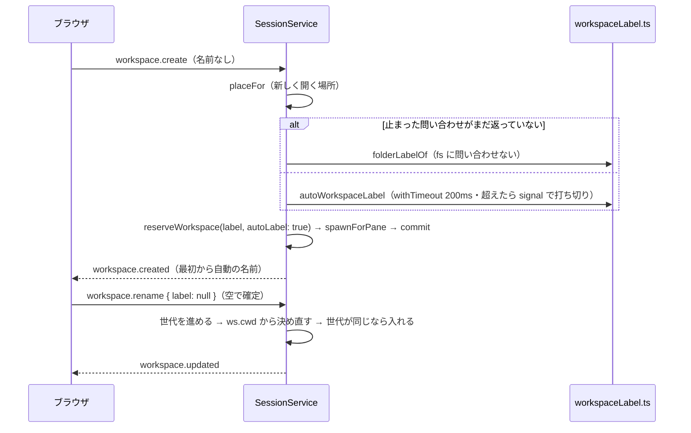

# レビューガイド: workspace の既定の名前を、開いた場所（リポジトリ）から自動で付ける

## 変更概要 / 目的

新しい workspace の名前は、どこで開いても一律に「1」だった。前の work（新しく開く場所）で別のリポジトリに開けるようになっても、サイドバーで
見分けられなかった。herdr と同じく、**名前を付けていない workspace を、開いた場所のリポジトリの根のフォルダ名（git の外ならフォルダ名・ホームなら `~`）
で呼ぶ**ようにした。付けた名前は上書きしない。名前を空にして確定すると自動の名前に戻る（herdr に無い操作）。

## 重要ポイント

- **`Workspace.label` は表示の名前のまま**、自動か付けたものかを `Workspace.autoLabel`（省略できない）で持つ（design D1・D2）。表示の 9 か所は変えていない。
- **規則は `packages/server/src/session/workspaceLabel.ts` の 1 か所**：herdr の `git_repo_root`・`git_dir_for_repo_root`・`git_dir_is_bare`・`read_git_config_value`・
  `fallback_label_from_cwd` を移した。**git のコマンドは使わない**（`.git` を読むだけ）。
- **作成は名前を決めてから予約と起動へ進む**（decisions D1）。起動の成功から commit までの間に await を挟むと、その間に終わったシェルの pane が残るため。
- **名前変更の `label: null` で自動に戻す**（pane の名前と同じ形）。待つ間の名前変更の競走は workspace ごとの世代の番号で解く（design D9）。web は空の確定を null にし、
  自動の名前のまま変えずに確定したら送らない（herdr の workspace と違う。decisions D2）。
- **復元で自動の名前を決め直す**（付けた名前はそのまま）。以前の版の `session.json` は「"1" なら自動」。`autoLabel` は任意の項目として保存する（古い版も読める）。
- **応答しない・遅いファイルシステム**（review ラウンド 1〜3 で 3 回差し戻して作り直した）：上限（200ms）を超えたたどりは以後 fs に問い合わせず、その問い合わせが
  **返るまで**はどの場所でも根を探さずフォルダ名にする（止まった stat は取り消せず libuv のスレッドを塞ぐので、重ねない）。復元は 1 つずつ、合計 1 秒を過ぎたら
  残りはフォルダ名。受け入れた割り切りは decisions D4。上限つきの待ちは前の work と共通の `session/withTimeout.ts` にまとめた。

## 処理フロー

## 主要な変更箇所

- `packages/server/src/session/workspaceLabel.ts` — 根の見つけ方と名前の規則（新規）
- `packages/server/src/session/withTimeout.ts` — 上限つきの待ち（新規。`newCwd.ts` の読み直しもこれを使う）
- `packages/server/src/session/SessionService.ts` — `createWorkspace`（名前を決めてから予約）・`renameWorkspace`（null・世代）・`restore`（1 つずつ・期限）・
  `labelLookupsStuck`（止まった問い合わせの数）
- `packages/server/src/session/SessionModel.ts` — `autoLabel` を 4 か所で扱う
- `packages/server/src/persist/SessionFile.ts`・`composeServer.ts` — 保存に `autoLabel`
- `packages/protocol/src/model.ts`・`messages.ts` — `Workspace.autoLabel`・`WorkspaceRenameParams.label` の null
- `packages/web/src/actions/ActionDispatcher.ts`・`components/NameDialog.vue` — 空の確定・変えずに確定・手掛かり
- `packages/e2e/src/specs/workspace-auto-label.spec.ts`・`support/frames.ts`（`watchReceivedEvents`）

## リスク / 確認したい点

- **Windows・macOS は実機で確かめていない**。Windows のホーム・根は `path.win32` の単体だけ、リポジトリの中の根の見つけ方は Windows では単体も無い。
- 応答しない fs の上に workspace があると、その間はほかの場所もフォルダ名になる（文書の「既知の制約」・decisions D4）。実物の止まったマウントでは確かめていない。
- `cd` に追従しない（herdr との違い）。サイドバーの git の情報も開いた場所から取っているので、両方をまとめて扱う別の work を backlog に起票した。
