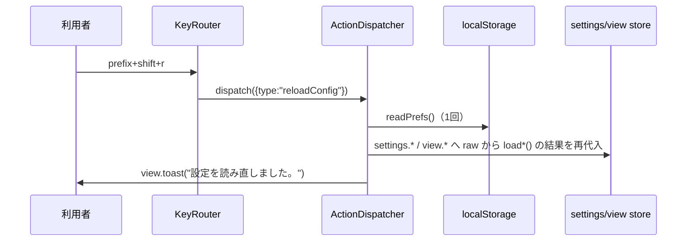

# レビューガイド: 外観と設定の残り（サイドバー並び順・tab バー自動非表示・pane 枠設定・reload_config）

## 変更概要 / 目的
herdr-parity の残り4項目（H21 サイドバー行の並び／H22 tab バーの自動非表示・時刻／H23 pane の枠・
エージェント名表示／H25b 設定の再読み込み）をまとめて実装した。詳細は `requirements.md`「目的 / ゴール」
「ユーザーストーリー」参照。

## 重要ポイント
- **D2**: workspace の並び順トグルは、requirements の記述（「設定画面に」）を design 工程で訂正し、
  `Sidebar.vue` 自身（agents 区画の既存トグルと同じ場所）に置いた。
- **D9/D10**: `TabBar.vue` の自動非表示は `onBeforeUnmount` ではなく `watch(visible, ...)` を使う
  （`v-if` が自分自身のテンプレートの根にあり、コンポーネント自体は unmount しないため）。
  条件式は `tabs.length !== 1`（`> 1` ではない——0個のときは「＋」の導線を保つため表示を維持する）。
- **T4 の MUST 修正**: `.pane-frame-name`（エージェント名ラベル）は DOM 順で `.pane-frame-body`
  （端末）より後に置く必要がある（`z-index:auto` の重なりは DOM 順で決まるため、前に置くと端末の
  下に隠れて見えなくなる。taskcheck がスクリーンショットで発見）。
- **D8**: pane 枠の太さを変えると、既存の `ResizeObserver`（`PaneLayout.vue`）経由で実際に PTY の
  リサイズ要求（`client.view`）が飛びうるが、cols/rows のセル境界を跨ぐかは px 実測次第で決定的で
  ない。E2E はこれを踏まえ「クラッシュ・エラーが起きないこと＋端末が機能し続けること」を確認する。
- **reload_config のスコープ（decisions D4）**: `settings`/`view` ストアの localStorage 由来の値
  だけを読み直す。`session`（workspace/tab/pane の構成）・通知の設定・`wtm.seen.v1` には触れない。

## 処理フロー（reload_config）

## 主要な変更箇所
- `packages/web/src/components/Sidebar.vue:155-161` — spaces 区画の並び順トグル
- `packages/web/src/components/TabBar.vue:22-75` — 自動非表示・フォーカス退避・時刻
- `packages/web/src/components/PaneFrame.vue:107-137` — エージェント名ラベル（DOM 順に注意）
- `packages/web/src/store/settings.ts:16-63` — `paneFrameThickness`/`paneAgentNameVisible`
- `packages/web/src/actions/ActionDispatcher.ts` の `reloadConfig()` — 設定の読み直し本体
- `packages/e2e/src/specs/appearance-settings.spec.ts` — この work の新規 E2E（6本）

## リスク / 確認したい点
- **E2E のフル完走確認が未了**（`test-result.md`「E2E について」）。このマシンが複数セッション
  同時稼働の共有環境でリソース競合が起きやすく、この work の途中でユーザーから「E2E はユーザーの
  明示的な依頼があるときだけ実行する」方針が示されたため、最後の完走確認は打ち切っている。
  新規・修正分とも個別の読解と部分的な実行では確認済みだが、次に E2E を回す機会に
  `appearance-settings.spec.ts` と、この PR が修正した既存 spec 6 ファイルを優先して確認してほしい。
- サイドバー行の色の条件付け・独自トークン（H21）、tab バーの位置切り替え（H22）、
  onboarding（H25b）は意図的に対象外（`.aidev/backlog/product-roadmap.md` に後続として残した）。
