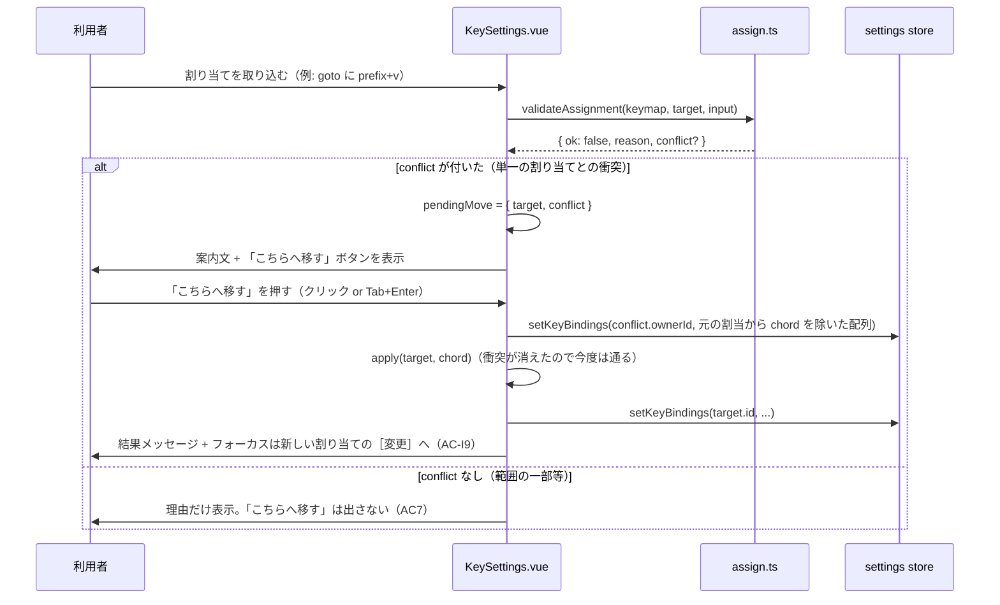
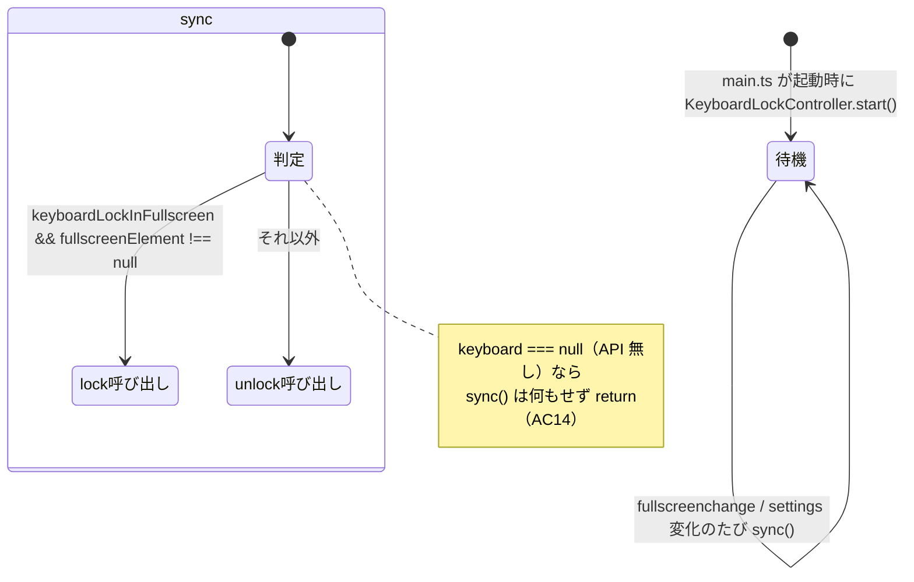

# レビューガイド: キーの設定の使い勝手

## 変更概要 / 目的

20260921-keybinding-customization（キー割り当てのカスタマイズ）を実装した本人視点で見つかった
4つの使い勝手の課題を解決する（`.aidev/backlog/product-roadmap.md` 31行目）。

1. **絞り込み（US1）**: 節「キー」の34個の操作を上から探すしかなかったのを、操作名・群名での
   絞り込み欄で狭められるようにする。
2. **こちらへ移す（US2）**: 割り当てが衝突したとき、衝突相手からその chord を外して今の対象へ
   移す操作を、案内文の直後のボタン1つでできるようにする。
3. **macOS の Option chord 表示補正（US3）**: 非 US 配列（Dvorak・QWERTZ・AZERTY）で、`alt+…` の
   表示を実際に押した字に合わせる（`navigator.keyboard.getLayoutMap()`。表示専用）。
4. **Keyboard Lock（US4）**: 全画面のときだけ、ブラウザ・OS が先取りするキー（`Ctrl+T` 等）を
   opt-in の switch で使えるようにする（実験的 API）。

## 重要ポイント

- **`AssignResult.conflict`（`assign.ts`）**: 既存の「文字列の理由」だけだった衝突結果に、
  衝突相手が**単一の（範囲でない）chord として特定できるときだけ**構造化フィールドを足した
  （`{ ownerId, via, chord }`）。範囲の操作（`switch_tab` の `prefix+1..9` 等）の一部や、
  移す先が特定できない衝突では `conflict` を付けない（AC7）——「こちらへ移す」を出すかどうかの
  判定が、この1箇所の事実に一元化されている（decisions D2・cross 点検で確認済み）。
- **`chordDisplay.ts` は表示専用**: 取り込み・照合に使う `chord.ts` の関数は一切 import せず、
  保存される chord 文字列自体は変えない（AC10）。`KeySettings.vue` の chip・prefix 行・
  `aria-label` のすべてで `displayFor()` を経由させる必要があり、review でこの経由漏れが2箇所
  見つかった（後述）。
- **`KeyboardLockController`**: 既存の `ThemeController` と同型のクラス（`start()`/`stop()`）。
  `fullscreenchange` イベントと設定の変化（`watch`）の両方を聞き、`sync()` で
  `settings.keyboardLockInFullscreen && fullscreenElement !== null` のときだけ `lock()` する。
  API が無い・失敗する環境では常に無害（AC14。`keyboard === null` の早期 return と `try/catch`
  の二重の安全網）。
- **[decisions D6] この E2E 環境には実は `navigator.keyboard` がある**：tasks.md 原文は「無い
  見込みが高い」という前提だったが、実装時に `isSecureContext: true`（`127.0.0.1` は
  potentially trustworthy origin）で API が実在することが分かった。E2E は「API を実地に消して
  無い場合」と「API はあるが全画面でない場合」の2本に分け、さらに cross 点検の指摘を受けて
  「実際に全画面へ入り `lock()`/`unlock()` が呼ばれる」ことも実ブラウザで確認する3本目を追加した
  （`main.ts` の配線自体を守る自動テストが無かったという cross 点検の指摘への対応）。
- **[decisions D7・review の must] 「こちらへ移す」ボタンが画面外に取り残される不具合**：
  `.keys-message`（案内文）だけが `position: sticky` で画面下に固定されており、直後に置いた
  ボタンは固定されない普通の要素として「メッセージの本来の（固定されない）位置」の直後に続いて
  いたため、一覧を少しスクロールしただけでボタンがダイアログの可視領域から大きく外れていた
  （実測: 可視領域高さ704pxに対しボタンのy座標が1880px前後）。`.keys-status-band` という共通の
  sticky コンテナへ両方をまとめて直した。`toBeVisible()`・`.click()`（自動スクロール）・Tab到達の
  テストはいずれもこの種の不具合を検出できず、`boundingBox()` の実測で初めて見つかった。

## 処理フロー

### 衝突 → こちらへ移す（US2）

### Keyboard Lock の生死（US4）

## 主要な変更箇所

- `packages/web/src/keys/assign.ts:45-59,176-193` — `AssignResult.conflict` の追加と、衝突相手が
  単一の chord として特定できるときだけ付ける判定（AC7）。
- `packages/web/src/keys/chordDisplay.ts`（新規） — `displayBinding()`。表示専用の chord 置き換え。
- `packages/web/src/keys/KeyboardLockController.ts`（新規） — `ThemeController` と同型のクラス。
- `packages/web/src/store/settings.ts:36-41,85-86,117-120` — `keyboardLockInFullscreen` 設定
  （既定 false）。`statusSymbols` と同じ「単純な boolean」の扱い（専用の `storage` リスナーは
  意図的に足さない。decisions D4）。
- `packages/web/src/main.ts:176-192` — `KeyboardLockController` の生成・配線・`start()`。
  `navigator.keyboard ?? null` の feature-detect。
- `packages/web/src/components/KeySettings.vue` — この work の中心。`filterText`/`actionsByGroup`
  （US1）・`pendingMove`/`moveHere()`（US2）・`onMounted`+`displayFor()`（US3）・
  `toggleKeyboardLock()`+switch（US4）・`.keys-status-band`（D7 の修正）。
- `packages/e2e/src/specs/key-bindings.spec.ts` — 新規テスト7本（絞り込み・こちらへ移す×2
  〔通常操作・sticky band の可視性〕・Keyboard Lock×3〔API無し・全画面でない・実際に全画面〕）。

## リスク / 確認したい点

- **AC12・AC13（Keyboard Lock が実際に予約キーを解放するか）は自動テストの対象外**——Playwright
  から「ブラウザ・OS がその後キーを横取りしなくなったか」を観測する手立てが無いため
  （decisions D6）。呼び出し自体（`lock()`/`unlock()` が正しいタイミングで呼ばれるか）は
  ユニット・E2E とも確認済みだが、**実際に効くかは `docs/verification.md` の手動確認へ回す**
  （deliver 時に追記予定）。
- **AC8（macOS の Option chord 表示）の実機確認**も同様に、この検証環境（Linux）では確認できず
  手動確認へ回す。
- 全 spec の E2E 実行で、この work と無関係な3件（`mobile.spec.ts`・`new-terminal-cwd.spec.ts`・
  `notifications.spec.ts`）が環境の負荷依存で flaky なことを確認済み（`test-result.md` 参照。
  `main` のクリーンな worktree でも再現するため、この work 由来ではない）。
