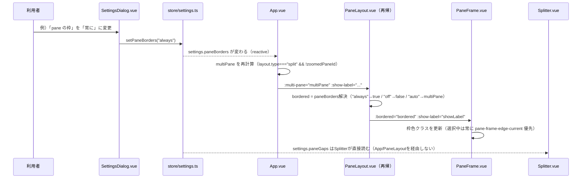
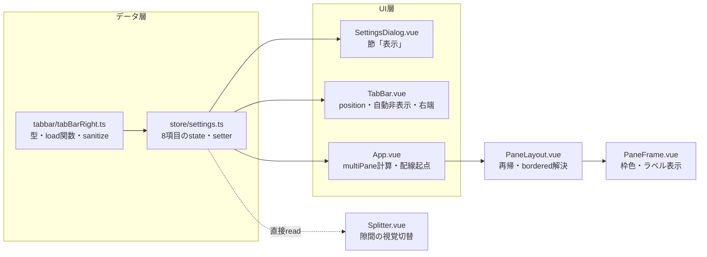

# レビューガイド: タブバーと pane の枠の外観設定（20260922-tabbar-pane-appearance）

## 変更概要 / 目的

herdr の `ui.tab_bar_position`／`ui.hide_tab_bar_when_single_tab`／`ui.tab_bar_right`／
`ui.tab_bar_right_separator`／`ui.pane_borders`／`ui.pane_outer_borders`／`ui.pane_gaps`／
`ui.show_agent_labels_on_pane_borders` に相当する 8 項目を、設定画面の節「表示」に足した。tab バーの位置
（上/下）・自動非表示・右端の表示（拡大の状態・接続先ホスト名・日時・固定文字列を並べられる）、pane の枠
（自動/常に/なし）・外周・隙間・エージェント名表示を選べる。押した時点で反映・保存（確定ボタンは無い）。

herdr の `pane_scrollbars`（インタラクティブなスクロールバー）・`tab_bar_right` の `Command` 種別（任意
コマンドの定期実行）・サイドバー行のカスタマイズ（H21）・設定の再読み込み（H25b）は対象外（詳しい理由は
requirements.md「スコープ / 対象外」・docs/herdr-parity.md H22・H23）。

## 重要ポイント

- **`multiPane`/`bordered`/`showLabel` の 3 段の受け渡し**（`App.vue` → `PaneLayout.vue` → `PaneFrame.vue`）。
  `App.vue` がタブごとに 1 回だけ「分割されているか」（`multiPane`）を計算し、`PaneLayout.vue` が再帰呼び出しへ
  そのまま引き継ぎつつ、葉の `PaneFrame` へ渡す直前に `settings.paneBorders`（3値）と組み合わせて `bordered`
  （計算済みの boolean）を解決する。**`PaneFrame.vue` 自身は `paneBorders`/`multiPane`/store のどれも知らない**
  （design のラウンド2の指摘で発見。`PaneFrame` の実インスタンス化位置が `PaneLayout.vue` 側だったと気付けた
  のがきっかけ。decisions D3〔design〕）。
- **`paneGaps` だけは非対称**：`Splitter.vue` が `useSettingsStore()` を自分で注入して直接読む（`App.vue`・
  `PaneLayout.vue` を経由しない）。`paneGaps` は構造上の位置に依らない単純なグローバル設定なので、`multiPane`
  のような prop 中継が要らないという設計判断（decisions D4）。
- **色・枠は「視覚のみ」**：`pane_borders`/`pane_outer_borders`/`pane_gaps` はどれも `padding`/`width`/`height`
  の数値を変えず、色・`outline`（`border` は使わない）の有無だけを切り替える。既存の pane の葉の大きさが
  そのまま PTY の cols/rows に直結する構造のため（design「依拠する既存の事実」）。
- **既定値のまま見た目が変わる点が 2 つある**（herdr の既定に合わせた意図的な例外。decisions の「AC9」節・
  docs/herdr-parity.md H23）：分割中の非選択 pane に新しい 1px の枠（`pane-frame-edge-bordered`）が付く・
  pane 領域の外周に新しい 1px の `outline` が付く。**単独 pane の見た目は変わらない**（常に選択中で、既存の
  強調 `pane-frame-edge-current` が `bordered` の値に関わらず優先されるため）——design の初期の想定はここが
  逆（単独 pane の見た目が変わる）だったが、実装時に訂正した（review の cross 点検で、この訂正が
  `docs/verification.md` の手動確認手順にまだ伝播していない箇所を発見・修正済み）。
- **`tab バー右端のエントリはプリセットに簡略化**：日時は herdr の strftime 自由書式ではなく
  `Intl.DateTimeFormat` ベースの 4 プリセット、ホスト名は接続先サーバのホスト名（herdr はクライアント
  ローカル）、`Command` 種別（任意コマンド実行）は対象外。
- **test 工程で既存 E2E 3 spec（4 本）への退行を発見**（decisions D8）：節「表示」に switch/select が
  1→11 個に増えたことで、既存の `settings.spec.ts`・`theme-settings.spec.ts` の**広いセレクタ**
  （`section[...] [role="switch"]`・`input.settings-path`）が複数要素に解決するようになり Playwright の
  strict mode に触れた。加えて Tab キーで辿る回数の上限（12 回）も超えた。3 箇所とも直し、影響する2 spec を
  単独で再実行して 19/19 pass を確認したあと、E2E 一式を再実行して 123/123 pass を確認した。

## 処理フロー

## 主要な変更箇所

- `packages/web/src/tabbar/tabBarRight.ts`（新規） — 型・`load*`/`sanitize*`/`formatDatetime`
- `packages/web/src/tabbar/tabBarClock.ts`（新規） — 日時エントリ用の1秒タイマー（不要時は張らない）
- `packages/web/src/store/settings.ts:198-393` 周辺 — 8項目のstate・setter・storageイベント追従
- `packages/web/src/components/TabBar.vue` — `position` prop（`order`スタイル含む）・自動非表示・右端エントリ
- `packages/web/src/App.vue:41-46,57-68` — `multiPane`計算・`TabBar`/`PaneLayout`への配線
- `packages/web/src/components/PaneLayout.vue:120-149,178-208` — `bordered`解決・再帰的なprop引き継ぎ
- `packages/web/src/components/PaneFrame.vue:109-125` — 枠色3状態・エージェント名の可視ラベル
- `packages/web/src/components/Splitter.vue:27,110` — `paneGaps`の直接読み込みと隙間の視覚切替
- `packages/web/src/components/SettingsDialog.vue:238-345,450-595` — 節「表示」への8項目のUI
- `packages/e2e/src/specs/tabbar-pane-appearance.spec.ts`（新規） — 7本
- `packages/e2e/src/specs/settings.spec.ts`・`theme-settings.spec.ts` — 既存3箇所の退行修正（decisions D8）
- `docs/herdr-parity.md`（H22・H23）・`docs/verification.md` — 機能の説明・手で確かめる項目・既知の制約

## リスク / 確認したい点

- **実機で確かめていない**：自動のテストは Linux の Chromium だけ。Firefox・Safari・macOS・Windows は
  20260921-theme-settings・20260921-keybinding-customization・20260922-theme-custom-overrides が既に
  洗い出した環境差の範囲に留まる、という判断で実機の確認はしていない。
- **pane の枠・外周・隙間は herdr と違い「視覚のみ」**（幾何は変えない）。herdr と見比べると、隙間を切った
  ときの詰まり方が本製品の方が控えめに見える（既知の制約として docs/verification.md に明記）。
- **tab バー右端の日時は 4 プリセットのみ**（herdr の strftime 自由書式は対象外）。
