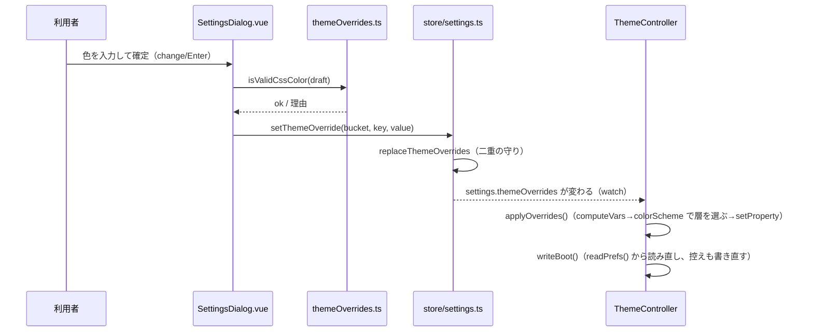

# レビューガイド: 色の個別の上書き（20260922-theme-custom-overrides）

## 変更概要 / 目的

herdr の `[theme.custom]`（個々の色の上書き）に相当する機能を追加した。設定画面の節「テーマ」の末尾に、上級者向けの
折りたたみ「色の個別の上書き（上級者向け）」を足し、本製品が実際に使う 19 個の CSS 変数（`uiTokens.ts` の `CSS_VARS`。
画面地・メニュー・強調・状態アイコン等）それぞれについて、「明るいとき」「暗いとき」の色を 1 つずつ上書きできる。
押した色がそのまま反映・保存され（確定ボタンは無い）、既定のコントラスト調整はかからない。色ごと・すべてまとめて
既定へ戻せる。

herdr の 19 トークンをそのまま持ち込むのではなく、本製品の 19 個の CSS 変数を対象にした（名前も粒度も herdr と
1:1 ではない）。詳しい対応は design.md「依拠する既存の事実」・research.md F4 の表を参照。

## 重要ポイント

- **色の妥当性判定は `CSS.supports` ではない**（`themeOverrides.ts` の `isValidCssColor`）。happy-dom（単体テストの
  DOM 実装）の `CSS.supports` は常に `true` を返すスタブで、拒否側を単体テストで確かめられない。代わりに、実物の
  要素の `style.color` へ代入して読み戻す方式にした（research F10）。
- **「明るいとき」「暗いとき」は `colorScheme` で選ぶ**（`ThemeController.computeVars`／`bootVars`）。`themeAuto`
  の真偽は見ない——herdr は自動切替が入のときだけ `.light`/`.dark` を重ねるが、本製品は自動切替を使わない利用者
  （1 つのテーマ固定）でも上書きが効くよう、意図的に逸脱している（decisions・research F2）。
- **`ThemeController.apply()` の「同じ名前なら省く」最適化は変えていない**。上書きの変更は `applyOverrides()` と
  いう別経路で反映する（テーマ名は変わらないため）。この落とし穴は research F5 で事前に洗い出し、
  `ThemeController.test.ts` に回帰テストがある。
- **保存は `keys`（20260921-keybinding-customization）と同じ形**：`store/settings.ts` の `replaceThemeOverrides` は
  `replaceKeyPrefs` と同じ「二重の守り」（読み直して正規化・状態と保存の両方が同じなら何もしない）。別のウィンドウの
  `storage` イベントにも追従する。
- **review で 2 回の差し戻し**があった（コード上の実装バグではなく、ドキュメント・テストの精度の指摘）：
  - タスク点検（T6）で、herdr のトークン数を「18」と誤って書いていた（実際は 19）。research・design・requirements・
    docs・実装のコメントの複数箇所に同じ誤りが伝播しており、review ラウンド 1 でも `.aidev/backlog/` の 1 箇所に
    再発しているのを見つけて直した（横断的な数値の一貫性は見落としやすい）。
  - タスク点検（T2）で、`writeBoot()` が保存値から読む、という設計上の保証を検証するテストが手薄だった（既存の
    テストが store と保存値の内容を偶然一致させたまま確認しており、変異で落ちなかった）。

## 処理フロー



```mermaid
flowchart LR
  subgraph 適用経路
    A[uiTokens(name)] --> C[computeVars]
    O[themeOverrides.light/dark] --> C
    C -->|colorScheme で選ぶ| D[mergeVars]
    D --> E[root.style.setProperty]
  end
  subgraph 起動用の控え
    A2[readPrefs 保存値] --> B2[bootVars]
    B2 --> D
    D --> F[localStorage: wtm.themeBoot.v1]
    F -->|theme-boot.js が読む| G[最初の描画]
  end
```

## 主要な変更箇所

- `packages/web/src/theme/themeOverrides.ts`（新規） — `ThemeOverrides`・`isValidCssColor`・`loadThemeOverrides`／
  `serializeThemeOverrides`・`withOverride`／`withoutOverride`・`mergeVars`・`CSS_VAR_LABELS`
- `packages/web/src/theme/ThemeController.ts:109-149` — `computeVars`・`apply`（早期 return は変えず）・
  `applyOverrides`（新設）・`writeBoot`／`bootVars`（上書きを含める）
- `packages/web/src/store/settings.ts:195-260` — `themeOverrides`（state）・`replaceThemeOverrides`（二重の守り）・
  `setThemeOverride`／`resetThemeOverride`／`resetAllThemeOverrides`・`storage` イベントへの追従
- `packages/web/src/components/SettingsDialog.vue:236-320`（script）・`:444-504`（template） — 折りたたみの UI・
  確定/拒否/既定に戻すの処理
- `packages/e2e/src/specs/theme-settings.spec.ts` — 4 本追加（反映・明暗の切替・拒否と既定に戻す・すべて既定に戻す）
- `docs/herdr-parity.md`（H24b・新規行）・`docs/verification.md`（機能の説明・手で確かめる項目・既知の制約）

## リスク / 確認したい点

- **実機で確かめていない**：自動のテストは Linux の Chromium だけ。Firefox・Safari・macOS・Windows の入力欄・
  確認ダイアログの見た目の差は、20260921 系の work が既に洗い出した範囲に留まる（新しい環境差は増えていない、という
  判断で、実機の確認はしていない）。
- **上書きに自動のコントラスト調整はしない**（herdr と同じ。利用者の責任）。読みにくい色を入れても止められない。
- **herdr の 18 トークンと 1:1 ではない**（本製品の 19 個の CSS 変数が対象）。docs にその対応関係と理由を書いた。
