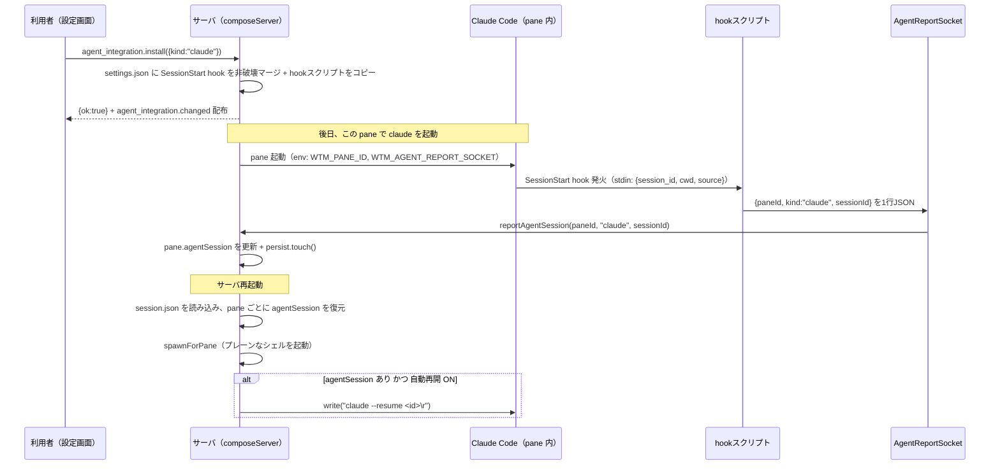

# レビューガイド: サーバ再起動後のエージェント会話の再開

## 変更概要 / 目的

Claude Code・Codex の会話を、サーバ再起動後も自動で再開できるようにする。herdr の同等機能（H32）は
herdr 独自の連携プロトコルに依存するため、本製品は両エージェント**公式**の hooks 機構を直接使う独自実装
にした（decisions.md D1）。導入は利用者の明示操作のみ（herdr と同じ設計。research.md F2）。

## 重要ポイント

- **pane と会話IDの対応は cwd 推測ではなく `WTM_PANE_ID` 環境変数**で行う。これにより、同一ディレクトリに
  同種エージェントの pane が複数あっても、ID なし方式（`claude --continue`/`codex resume --last`）が
  抱える「区別できない」問題（research.md F3.1〜F3.3）が構造的に発生しない（design D11）。
- **導入は明示操作、判定は都度**：「導入済みか」は永続化せず、対象の hooks 設定ファイルを都度読んで
  判定する（design D4）。利用者が手動でフックを消しても状態がズレない。
- **復元の分岐を増やさない**：resume コマンドは、既存の `spawnForPane`（プレーンなシェルの起動）が
  成功した**後**に pane へ書き込むだけ（design D10）。無効な会話IDは対象 CLI 自身がエラーで終わり、
  そのままプレーンなシェルとして使える（AC6）。
- **会話IDの失効はエージェント検出と連動**：画面判定でエージェントが消えたら（非 null→null）、
  会話参照も一緒に消す（design D9・`SessionService.updatePaneRuntime`）。古い会話を無関係な pane に
  再開してしまう事故を防ぐ。
- **`AgentIntegrationService` は interface + `Default…` 実装**（`TerminalManager`/`WorktreeService`
  と同じ既存パターン）。coding 中に一度は具象クラスのみで書いたが、`MethodDeps` のテストスタブが
  作れないことに気づいて分離した（review 参照）。

## 処理フロー

## 主要な変更箇所

- `packages/protocol/src/model.ts:71-89` — `Pane.agentSession`・`AgentIntegrationKind`・`AgentSessionRef`。
- `packages/server/src/agent/AgentReportSocket.ts` — ローカル IPC（Unix socket / Windows named pipe）。
- `packages/server/assets/agent-hook-report.cjs` — hook 本体（stdout 出力禁止・env 未設定なら無害）。
- `packages/server/src/agent/AgentIntegrationInstaller.ts` — 導入・解除の非破壊マージ、`installed` 判定。
- `packages/server/src/agent/AgentIntegrationService.ts` — RPC の実体・`agent_integration.changed` 配布。
- `packages/server/src/agent/resumeCommand.ts` — 再開コマンドの組み立て＋セッションIDのサニタイズ
  （シェルメタ文字を拒否。非機能要件「報告経路の安全性」）。
- `packages/server/src/session/SessionService.ts:462-497,535-605` — `updatePaneRuntime` の D8・D9、
  `restorePaneProcess`/`maybeResumeAgentSession` の D10・D11、`envForPane`。
- `packages/web/src/components/SettingsDialog.vue` — 「エージェント連携」節（AC-I1〜AC-I5）。

## リスク / 確認したい点

- **実物の Claude Code・Codex CLI との結線は未検証**（この開発環境に両 CLI がインストールされていない）。
  test-result.md の「未検証の穴」参照。マージ後、実際に使う環境での確認をお願いしたい。
- **Windows の named pipe の権限限定は未実装**（decisions.md D5）。Unix の `chmod 0600` 相当が無く、
  同一マシンの別ユーザーが report を送りつけられる可能性がある（実害は限定的——存在しない pane/
  無効なセッションIDは無視されるだけ）。Windows 実機を持つ方向けの後続タスクとして残した。
- hook の `command` 文字列のパスは素の二重引用符で囲んだ（`"${scriptPath}"`）。POSIX シェル・
  Windows の `cmd.exe` のどちらの規則にも通ると判断したが、確実性は実機でしか確かめられない。
