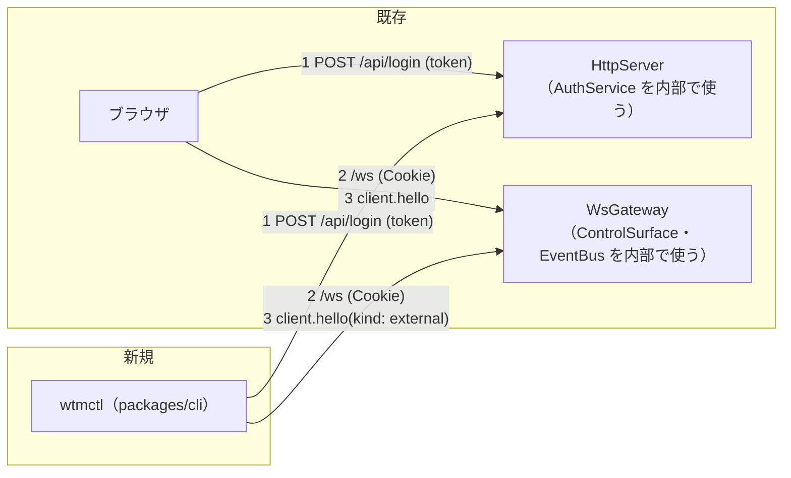
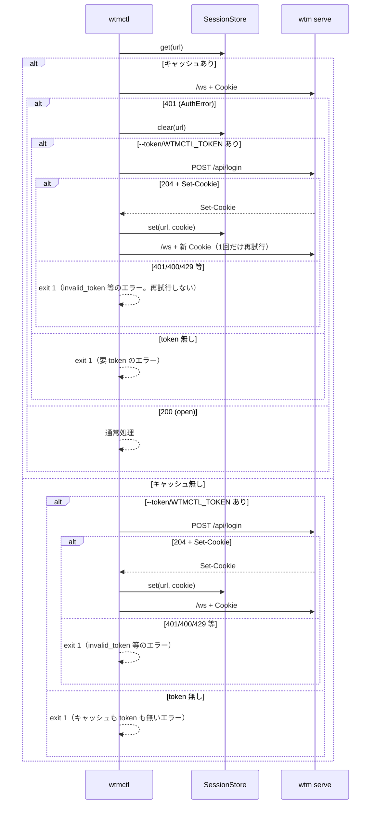

# 仕様: 外部操作 API / CLI（herdr の socket API / CLI 相当）

## 概要

新規パッケージ `packages/cli`（`@wtm/cli`。バイナリ名 `wtmctl`）を追加し、動いている `wtm serve` へ
**既存の認証・既存の WebSocket RPC・既存のイベント配信をそのまま使って**外部から接続する CLI を実装する。
サーバ側の変更は `client.hello` の `kind` に `"external"` を1値追加するだけに留める
（decisions.md D3・D4）。新しい HTTP ルート・新しいポート・新しいソケットは追加しない。



番号は接続シーケンスの順序（1〜3）を表す。`HttpServer`・`WsGateway` の内部構成（`AuthService`・
`ControlSurface`・`EventBus` 等）は「依拠する既存の事実」で個別にファイル名を挙げて説明する
（この図では既存の2エントリポイントだけを示し、内部構造は誇張しない）。

## 設計方針

1. **既存 RPC の再利用**（decisions.md D3）：`workspace.create`/`.rename`/`.close`・`tab.create`/`.close`・
   `pane.split`/`.close`、入力送信（バイナリ INPUT フレーム）、出力読取（`pane.subscribe` の SNAPSHOT/OUTPUT
   フレーム）、状態の一括取得・購読（`client.hello` の `snapshot` と、以後配られる `ServerEvent`）は
   **一切変更しない**。CLI 側だけを新規実装する。
2. **`client.hello.kind` に `"external"` を追加**（decisions.md D4）：CLI は常にこの値を送り、
   `SizeAuthority.canDecideSize`（`client.kind === "desktop" || client.fit`）の判定から自然に外れる
   （`SizeAuthority.ts` 自体は無変更）。
3. **認証状態はセッション cookie だけをローカルにキャッシュ**（decisions.md D5）。token はディスクに残さない。
4. **CLI は 1 コマンド＝1 プロセス起動**（herdr の CLI ラッパーと同じ使用感）。対話シェルは提供しない。
   `pane read --follow` と `watch` だけが「Ctrl-C まで動き続ける」長時間コマンドになる。
5. **herdr の広い機能一覧（socket-api.mdx の raw methods 表）のうち、backlog 行の文言
   「workspace 作成・分割・入力送信・出力読取・状態購読」に対応する最小集合、
   および同じ既存 RPC をそのまま呼ぶだけで実装コストがほぼ無い close/rename 系
   （`workspace.close`/`.rename`・`tab.close`・`pane.close`）だけを実装する**
   （research.md F1.5・F2、requirements.md「対象」——「作成・分割」と対になる後始末の操作が無いと
   CLI だけで作った workspace/tab/pane を CLI だけで片付けられず片手落ちになるため、この程度の追加は
   スコープ拡大ではなく「作成・分割」の完結に必要な最小限として扱う）。plugin・graphics・
   layout.export/apply・worktree・agent lifecycle・`send-keys`（論理キー名変換）は対象外
   （research.md F2.4・F4・F5、requirements.md「対象外」）。

## 対象範囲

### 新規

- `packages/cli/package.json`（`name: "@wtm/cli"`、`bin: { wtmctl: "./dist/main.js" }`、
  依存: `@wtm/protocol` (workspace:*)・`ws`（`^8.21.3`。既存パッケージと同一バージョンを使う）。
  devDependencies: `@types/ws`・`typescript`・`vitest`・**`@wtm/server` (workspace:*)**——統合テストが
  実サーバ（実 PTY）を起動するためだけに使う。CLI の実行時コードは `@wtm/server` に依存しない）
- `packages/cli/tsconfig.json` / `tsconfig.typecheck.json`（既存パッケージと同一パターン。
  `tsconfig.json` は `references: [{ path: "../protocol" }]` を持つ。`../server` への reference は
  追加しない——`typecheck` はプロジェクト参照を使わず `node_modules` 解決に頼る既存パターンのままでよく
  （`packages/web` 等で実証済み）、統合テストは `exclude: ["src/**/*.test.ts"]` によりビルド対象からも外れる）
- `packages/cli/src/main.ts`：エントリポイント（`#!/usr/bin/env node`）。`parseArgs` → 各コマンド実行 →
  終了コード。
- `packages/cli/src/cliArgs.ts`：`process.argv` → `Command`（判別共用体）への手書きパーサ
  （`packages/server/src/cliArgs.ts:22-87` の `parseArgs` と同じ流儀——未知のフラグ・値の無いフラグ・
  未知のサブコマンド・余分な位置引数はいずれも例外、外部ライブラリを使わない）。解析に失敗したら
  `CliUsageError`（`packages/server/src/config.ts:46-53` の `ConfigError` と同じ形：
  `message` と `hint`（使い方の案内）を持つ）を投げる。
- `packages/cli/src/session.ts`：`SessionStore`（cookie のローカルキャッシュ。`~/.wtmctl/session.json`）。
- `packages/cli/src/httpAuth.ts`：`login(url, token)`（`POST /api/login` → cookie）。
- `packages/cli/src/wsClient.ts`：`WtmClient`（`/ws` 接続・`client.hello`・RPC request/response・
  INPUT フレーム送信・OUTPUT/SNAPSHOT フレーム受信・`ServerEvent` 受信・認証失敗の検出）。
- `packages/cli/src/ansiStrip.ts`：`stripAnsi(text: string): string`（CSI/OSC の簡易除去）。
- `packages/cli/src/withSession.ts`：セッションキャッシュ＋1回だけの再ログインを共通化するヘルパー。
- `packages/cli/src/output.ts`：成功/失敗の出力整形と終了コードの決定。新しい例外型は作らず、
  `wsClient.ts` の `AuthError`/`RpcFailure` と `cliArgs.ts` の `CliUsageError`（手順3参照）を
  `instanceof` で判別して「終了コードと出力」表のとおりにマッピングする専用関数
  `reportAndExit(err: unknown): never` を持つ（想定外の例外は exit 1・`code: "internal"`）。
- `packages/cli/src/commands/{workspace,tab,pane,session}.ts`：各コマンドの実装（`session.ts` に
  `login`/`snapshot`/`watch` をまとめる。ファイル名衝突を避けるため、ヘルパーの `session.ts`
  （キャッシュ）とは別に `commands/session.ts` に置く）。
- 各 `*.test.ts`（純粋関数・パーサ・ANSI 除去・セッションキャッシュの単体テスト）。
- `packages/cli/src/main.integration.test.ts`：`@wtm/server` の `composeServer`
  （`[P]packages/server/src/testkit.ts:8`）で実サーバ・実 PTY を起動し、`wtmctl` の内部コマンド関数を
  直接呼んで一巡を確認する（AC1〜AC7・AC9 の実装後の実測。**AC10 はここでは扱わない**——AC10 の検証手段は
  「対象範囲」「受け入れ基準との対応」のとおり `SizeAuthority.test.ts`／`ClientRegistry.test.ts` の
  単体の回帰テストで、統合テストとは別物）。

### 変更

- `packages/protocol/src/messages.ts`：`clientKind` を `z.enum(["desktop", "mobile", "external"])` に
  拡張（`[P]packages/protocol/src/messages.ts:14`）。
- `packages/server/src/clients/ClientRegistry.ts`：`ClientKind` 型を `"desktop" | "mobile" | "external"` に
  拡張（`[P]packages/server/src/clients/ClientRegistry.ts:4`）。**`SizeAuthority.ts` は無変更**
  （`canDecideSize` は等値比較のみなので、値を1つ増やしても分岐を追加する必要がない）。
- `packages/server/src/clients/SizeAuthority.test.ts`（または `ClientRegistry.test.ts`）に、
  `kind: "external"` が `canDecideSize` を満たさないことを示す回帰テストを追加する（AC10）。
- `docs/herdr-parity.md`：H38 行を「対応した範囲（本 work の slug・対応 AC）」に更新し、H39・H40 行に
  「後続」として新しい backlog 項目名を追記する（H41 行は触らない。AGENTS.md の指示どおり）。
- `.aidev/backlog/product-roadmap.md`：deliver 工程で当該行を `[x]` にし、H39・H40 を新規後続として追加する
  （decisions.md D2。`aidev-70-deliver`「3.5」で実施——design 段階では行わない）。
- ルートの `package.json`・`pnpm-workspace.yaml`・`vitest.config.ts` は**変更不要**
  （`pnpm-workspace.yaml` の `packages/*`・`vitest.config.ts` の `test.projects: ["packages/*"]`・
  root の `build`/`typecheck`/`test` スクリプトの `pnpm -r --filter=./packages/*` は、いずれも
  ワイルドカードで新規パッケージを自動的に拾う。事実は `[P]pnpm-workspace.yaml:1-2`、
  `[P]vitest.config.ts:9-11`、`[P]package.json:9-12`）。**`pnpm install` の実行は必要**
  （新規パッケージの依存関係をロックファイル・`node_modules` に反映するため。coding 工程の最初の手順とする）。

## 依拠する既存の事実

- `POST /api/login` は body `{token}` を受け、成功で `204` を返し `Set-Cookie` ヘッダを付与する
  （`[P]packages/server/src/http/HttpServer.ts:103-134`）。失敗は `400`（token 無し）/`401`（不一致）/
  `429`（rate limit）/`403`（Origin/Host 拒否）。
- `/ws` の upgrade は `Origin`/`Host` が許可リストに無ければ `403`、cookie が無効なら `401`、起動中（`ready`
  が false）なら `503` を、いずれも**素のステータス行だけ**で返し、ボディは無い
  （`[P]packages/server/src/ws/WsServerWs.ts:74-104, 111-113`）。Node の `ws`（本リポジトリが使う
  `ws@^8.21.3`）はこれを `"unexpected-response"` イベントで受け取れる（`error` ではない）。確認済み：
  この環境に実際に解決される `@types/ws@8.18.1` の型定義
  `node_modules/.pnpm/@types+ws@8.18.1/node_modules/@types/ws/index.d.ts:139-142` が
  `on(event: "unexpected-response", listener: (request: ClientRequest, response: IncomingMessage) => void)`
  を宣言しており、`response.statusCode` で `401`/`403`/`503` を判別できる。
- `client.hello` の応答 `ClientHelloResult` は `{ clientId, snapshot }` で、`snapshot: SessionSnapshot`
  は `workspaces`/`tabs`/`panes`/`focus`/`host`/`limits` を含む（`[P]packages/protocol/src/messages.ts:27-30`、
  `[P]packages/protocol/src/model.ts:123-132`）。
- `ServerEvent`（`workspace.created` 等）は、接続中の**すべての**クライアントへ、`client.hello` を送る前から
  無条件に push される（`[P]packages/server/src/ws/WsGateway.ts:75-79`。bus の購読は `handleConnection` の
  最初の方で登録され、hello の処理（`handleText`）より先に効く）。**取りこぼしの窓は無い**（research.md F1.3）。
- RPC の成功/失敗は `{id, result}` / `{id, error: {code, message}}`（`[P]packages/protocol/src/messages.ts:339-347`）。
  イベントには `id` フィールドが**無い**——直接の根拠は2つ：(1) `ServerEvent`（`[P]packages/protocol/src/events.ts:8-72`
  の各イベント型）はどのバリアントも `event`/`data` の2フィールドのみで `id` を持たない、
  (2) 送信側 `[P]packages/server/src/ws/WsGateway.ts:75-79` の `conn.sendText(JSON.stringify(event))` は
  この `ServerEvent` をそのまま JSON 化するだけで `id` を付与しない。これにより、受信した JSON テキストに
  `id` があるかどうかで RPC 応答とイベントを区別できる（受信側 `[P]packages/server/src/ws/WsGateway.ts:132-138`
  の `handleText` が id を必須にしていることとも整合する）。
- 入力送信（`FRAME_TYPE.INPUT`）に対する**サーバからの ack は無い**。存在しない pane への INPUT は
  黙って無視される（`[P]packages/server/src/ws/WsGateway.ts:97`「閉じた直後の pane への入力。エラーには
  しない」）。そのため、CLI は送信前に `client.hello` で得た `snapshot.panes` の中に対象 `paneId` があるかを
  クライアント側で確認してから送る（無ければ `not_found` として即エラー。pane が hello の後・送信の前に
  閉じる TOCTOU は許容する——サーバ側 ack が無い以上、完全な保証はできない。既知の限界として記録する）。
- `pane.subscribe` の `scrollbackLines` は SNAPSHOT に含める行数を決める（`OutputFanout.subscribe` →
  `Mirror.serialize(scrollbackLines)`。`[P]packages/server/src/terminal/OutputFanout.ts:106-119`）。
  ブラウザは `snapshot.limits.scrollbackLines`（既定 5,000・上限はサーバの `--scrollback`）を使う
  （`[P]packages/web/src/main.ts:133`、`[P]packages/web/src/store/session.ts:19`）。CLI も同じ値
  （`hello.snapshot.limits.scrollbackLines`）を使う。
- SNAPSHOT フレームの本体は「cols u16 + rows u16 + serialize した文字列（UTF-8）」で、**既に UTF-8 文字列に
  デコード済み**（`[P]packages/protocol/src/frames.ts:5-7, 37-47`）。OUTPUT フレームの本体は
  デコードされていない生バイト列（`Uint8Array`。同 `frames.ts:60-61` の `DecodedFrame` の
  `OUTPUT` バリアントが `chunk: Uint8Array` を持つ）——これは確認済みの事実。
  一方、**このバイト列の区切り目が UTF-8 の文字境界と一致する保証は無い**（推測ではなく一般的な事実：
  PTY からの読み出し・ソケットの受信は任意のバイト数で行われ、送信側〔`Mirror`／node-pty〕・
  受信側〔`WsGateway`〕のどちらも UTF-8 の文字境界を意識してチャンクを切っていない。実際に境界が
  割れるかは負荷・出力パターン依存で、この設計では「割れないことを当てにしない」側に倒す）。
  CLI 側は `TextDecoder` の `stream: true` オプションで対応する（design「振る舞いの詳細」参照）。
- `packages/server/src/smoke.ts:159-231` が、CLI と同じ経路（login→cookie→ws→hello→workspace.create→
  pane.subscribe→INPUT フレーム）を既に動かしている実例（研究 F3.9）。`wsClient.ts` の実装はこのパターンを
  流用する（コード自体は共有しない——decisions.md に記載の判断は無いが、smoke.ts は起動確認の**硬いゲート**
  （`aidev-70-deliver` が PASS を必須にする）なので、リファクタで壊すリスクを避けるため今回は複製で構わない。
  この判断を decisions.md D6 として追記する）。

## インターフェース / データ構造

### コマンド一覧

```text
wtmctl login --url <URL> --token <TOKEN>
wtmctl workspace create [--cwd <path>] [--label <text>] [--url <URL>] [--token <TOKEN>]
wtmctl workspace close <workspaceId> [--url <URL>] [--token <TOKEN>]
wtmctl workspace rename <workspaceId> <label> [--url <URL>] [--token <TOKEN>]
wtmctl tab create [--workspace <id>] [--label <text>] [--url <URL>] [--token <TOKEN>]
wtmctl tab close <tabId> [--url <URL>] [--token <TOKEN>]
wtmctl pane split <paneId> --direction right|down [--ratio <0.05-0.95>] [--url <URL>] [--token <TOKEN>]
wtmctl pane close <paneId> [--url <URL>] [--token <TOKEN>]
wtmctl pane input <paneId> <text> [--url <URL>] [--token <TOKEN>]
wtmctl pane run <paneId> <command> [--url <URL>] [--token <TOKEN>]
wtmctl pane read <paneId> [--follow] [--raw] [--timeout <ms>] [--url <URL>] [--token <TOKEN>]
wtmctl snapshot [--url <URL>] [--token <TOKEN>]
wtmctl watch [--json] [--url <URL>] [--token <TOKEN>]
wtmctl --help / wtmctl help
```

- `--url` 省略時は環境変数 `WTMCTL_URL`、さらに省略時は `http://127.0.0.1:7780`
  （サーバの既定と同じ。`[P]packages/server/src/config.ts:6-10`）。
- `--token` 省略時は環境変数 `WTMCTL_TOKEN`。どちらも無ければ、キャッシュ済みセッションが無いときに
  ログインできない（FR12 のエラーで exit 1）。
- 解析エラー（未知のフラグ・必須引数の欠落・`--direction`/`--ratio` 等の値が不正）は exit 2、
  標準エラーへ人が読める1行のメッセージ（JSON 化しない。`wtm` 本体の `ConfigError` と同じ流儀。
  `[P]packages/server/src/main.ts:148-153`）。

### 終了コードと出力（FR13）

| コード | 意味 | 標準出力 | 標準エラー |
|---|---|---|---|
| 0 | 成功 | コマンドごとの結果（下記） | なし |
| 1 | サーバ/プロトコル/認証のエラー | なし | `{"error":{"code":string,"message":string}}` |
| 2 | CLI の使い方の誤り | なし | 人が読める1行 |

- RPC を伴うコマンド（`workspace.*`/`tab.*`/`pane split`/`pane close`）は、成功時に RPC の `result` を
  そのまま JSON で標準出力へ出す（herdr の `snake_case` とは異なり、本製品の既存の camelCase を維持する
  ――プロトコル全体の一貫性を優先する。decisions.md D7 として記録する）。
- `pane input`/`pane run` は成功時 `{"ok":true,"paneId":"<id>"}`（RPC ではないため ack が無いことは
  上記「依拠する既存の事実」のとおり。付帯情報として「実プロセスに届いたことまでは保証しない」ことを
  `--help` の説明文に明記する）。
- `pane read`（`--follow` 無し）は、成功時に**テキストを直接**標準出力へ出す（JSON で包まない。herdr の
  `pane read` が「prints UTF-8 terminal text directly」なのと同じ流儀。`[H]cli-reference.mdx:248`）。
  `--follow` はその後の OUTPUT を継続して標準出力へ出し続ける（Ctrl-C で終了。既定の SIGINT 処理に任せる
  ――明示的なシグナルハンドラは持たない。終了コードは Node の既定〔130〕になる。特別な後片付けは不要
  ――WebSocket はプロセス終了時に OS がクローズする）。
- `snapshot` は成功時に `hello.snapshot`（`SessionSnapshot`）をそのまま JSON で標準出力へ出す。
- `watch` は既定で人が読める1行（`<ISO8601> <event名> <dataのコンパクトJSON>`）、`--json` で
  `JSON.stringify(event)` のみ（NDJSON。スクリプトからの `jq` 等での消費を想定）。どちらも Ctrl-C まで
  流し続ける。

### `SessionStore`（`packages/cli/src/session.ts`）

```ts
interface CachedSession { cookie: string; createdAt: string }
interface SessionFile { sessions: Record<string /* origin文字列 */, CachedSession> }

interface SessionStore {
  get(url: string): Promise<string | undefined>; // cookie
  set(url: string, cookie: string): Promise<void>;
  clear(url: string): Promise<void>;
}
```

- 保存先：`join(homedir(), ".wtmctl", "session.json")`。ディレクトリは `0700`、ファイルは `0600` で作成する
  （`node:fs/promises` の `mkdir(dir, {recursive:true, mode:0o700})` / `writeFile(path, json, {mode:0o600})`）。
  Windows では POSIX パーミッションは無視される（Node の既定動作）が、他 OS 同様のコードで問題ない
  （追加のコードを要しない）。
- キーは `url` を `new URL(url)` で正規化した `origin`（`${protocol}//${host}`）文字列。
- ファイルが壊れている（JSON parse 失敗）場合は空として扱う（`{sessions: {}}` と同じ）――エラーで
  落とさない（利用者が手で壊れた設定を直せるよう、次の `login`/自動ログインで上書きされる）。

### `WtmClient`（`packages/cli/src/wsClient.ts`）

```ts
class AuthError extends Error {}
class RpcFailure extends Error { constructor(public code: string, message: string) }

interface WtmClient {
  hello(): Promise<{ clientId: string; snapshot: SessionSnapshot }>;
  request<M extends MethodName>(method: M, params: ParamsOf<M>): Promise<ResultOf<M>>;
  sendInput(paneId: string, bytes: Uint8Array): void;
  onEvent(cb: (evt: ServerEvent) => void): void;
  onOutput(cb: (paneId: string, chunk: Uint8Array) => void): void;
  onSnapshot(cb: (paneId: string, cols: number, rows: number, text: string) => void): void;
  /** サーバ側が接続を閉じた（想定していない切断）ときに1回だけ呼ばれる。`close()` を自分で呼んだ場合は呼ばれない
      （`pane read --follow`/`watch` がこれを見て「サーバが接続を切断した」エラーを出す。エラー処理表参照）。 */
  onClose(cb: (code: number, reason: string) => void): void;
  close(): void;
}

function connect(url: string, cookie: string): Promise<WtmClient>; // AuthError を投げうる
```

- `connect` は `new WebSocket(wsUrl, { headers: { cookie, origin, host } })`（`wsUrl` は `url` の scheme を
  `ws:`/`wss:` に置き換え、path `/ws` を付けたもの。`origin`/`host` は `url` から導出。
  `[P]packages/server/src/smoke.ts:191` と同じ組み立て）。
  `ws.once("unexpected-response", (_, res) => reject(new AuthError(...)))`
  を `open`/`error` と一緒に待つ（`res.statusCode` が 401 のときだけ `AuthError`、それ以外は通常の `Error`。
  同じ判定パターンの既存実例が `[P]packages/server/src/ws/WsGateway.integration.test.ts:254-262`）。
- 内部実装は `smoke.ts` の `createSmokeClient`（id→pending の Map・`ws.on("message")` の単一ハンドラ）と
  同じ設計（研究 F3.9・design「依拠する既存の事実」）だが、**コードは smoke.ts と共有せず複製する**
  （decisions.md D6）。

### `stripAnsi`（`packages/cli/src/ansiStrip.ts`）

- CSI（`ESC [ … <final byte>`）と OSC（`ESC ] … (BEL | ESC \\)`）のシーケンスを正規表現で除去する
  純関数。`sindresorhus/ansi-regex`（MIT）の公開パターンと同等の性質を持つ自前実装とする
  （新規の外部依存を増やさないため。decisions.md D8 として記録）。
- 入力に BEL（`\x07`）で終端しない OSC（一部端末は ST=`ESC \\` のみ）や、途中で切れた不完全なシーケンスが
  来ても例外を投げない（正規表現がマッチしなければそのまま残す。壊れた入力で CLI を落とさない）。

## 振る舞いの詳細

### 認証（FR1・FR12・AC7）



- `withSession(url, token, fn)` が上記を共通化する（`fn` は `(cookie) => Promise<T>`。`fn` 内で呼ぶ
  `wsClient.connect(url, cookie)`（「`WtmClient`」節の自由関数。`WtmClient` 自身のメソッドではない）が
  `AuthError` を投げたときだけ再ログインへ分岐し、他のエラー（`RpcFailure`・ネットワークエラー）は
  そのまま呼び出し元へ伝播して exit 1 にする）。
- `wtmctl login` コマンドは `withSession` を使わず、常に `httpAuth.login` を呼んでキャッシュを更新する
  （明示的な再ログインの手段として独立させる）。

### `workspace create` / `tab create` / `pane split`（FR2, FR4(前半), FR5, AC1, AC2）

1. `withSession` で `WtmClient` を得る。
2. `client.hello()` を送る（`kind: "external"`）。
3. 対応する RPC（`workspace.create`/`tab.create`/`pane.split`）を `request()` で呼ぶ。
4. 結果を JSON で標準出力へ、`close()` して exit 0。RPC がエラーを返したら `RpcFailure` として
   exit 1（`{"error":{"code":"...","message":"..."}}`）。

### `workspace close/rename` / `tab close` / `pane close`（FR3, FR4(後半), FR6。対応する AC は無い）

- 同上のパターンで、対応する RPC を呼び、その `result`（`{}`）をそのまま JSON で出す
  （「終了コードと出力」節の規則どおり——`{"ok":true}` のような独自の整形はしない。D7 の
  「変換せずそのまま出す」を close/rename 系にも一貫して適用する）。
- **requirements.md の完了条件 (AC1〜AC12) に、この4コマンドを個別に検証する AC は無い**
  （設計方針5のとおり、既存 RPC をそのまま呼ぶだけの薄いラッパーとして「作成・分割」の完結に追加した
  もので、requirements 起票時点では独立した受け入れ基準を割り当てていない）。正しさの担保は
  呼び出し先の既存 RPC 自身（`workspace.close`/`.rename`・`tab.close`・`pane.close`）が持つ既存のテストに
  委ね、本 work では「CLI からその RPC を正しいパラメータで呼べているか」だけを
  `commands/workspace.ts`・`commands/tab.ts`・`commands/pane.ts` の単体テスト（fake `WtmClient` を使う）で
  確認する。tasks.md ではこれらのタスクに `AC: なし` を明記する。

### `pane input` / `pane run`（FR7, FR8, AC3）

1. `hello()` の `snapshot.panes` に対象 `paneId` が無ければ `RpcFailure("not_found", ...)` として即 exit 1
   （サーバに行かない。「依拠する既存の事実」参照）。
2. `pane input` はテキストを UTF-8 バイト列にしてそのまま `sendInput(paneId, bytes)`。
   `pane run` は末尾に `"\n"` を足してから送る（herdr の bracketed paste によるアトミック化は行わない
   ――requirements「対象外」）。
3. フレーム送信後、`{"ok":true,"paneId":paneId}` を出して `close()`、exit 0。

### `pane read`（FR9, AC4）

1. `hello()` → `snapshot.limits.scrollbackLines` を得る。
2. `pane.subscribe({paneId, scrollbackLines})` を呼ぶ（対象が無ければ RPC が `not_found` を返す。
   既存の挙動をそのまま使う――input と違い、`pane.subscribe` は RPC なのでサーバ側の検証がそのまま効く）。
3. `onSnapshot` で最初の SNAPSHOT を受けるまで待つ（既定タイムアウト 5000ms、`--timeout` で上書き）。
   受けたら `--raw` 無しなら `stripAnsi(text)`、`--raw` ありなら `text` をそのまま標準出力へ書く。
4. `--follow` 無し：`pane.unsubscribe` を呼んで `close()`、exit 0。
   `--follow` あり：以後 `onOutput` で届く chunk を `TextDecoder("utf-8")` の**同一インスタンス**へ
   `decode(chunk, {stream: true})` して文字列にし、**手順3と同じ `--raw` の分岐**（`--raw` 無しなら
   `stripAnsi()` を通す、`--raw` ありならそのまま）を chunk ごとに適用してから都度標準出力へ書く
   （マルチバイト文字がフレーム境界をまたぐ対策は `TextDecoder` の `stream: true` が担う。
   「依拠する既存の事実」参照）。Ctrl-C まで継続。
   **既知の限界**：ANSI エスケープシーケンス自体が2つの OUTPUT フレームにまたがって届いた場合、
   `stripAnsi()` は chunk 単位で正規表現を掛けるため、そのシーケンスを検出できず断片がそのまま
   出力に残ることがある（SNAPSHOT は1つの文字列に対して1回だけ `stripAnsi()` を掛けるのでこの制約が
   無いが、`--follow` の継続ストリームでは chunk 境界をまたぐ完全性を保証しない）。正確さが必要な
   用途では `--raw` を使う。
5. タイムアウトした場合（手順3）は `RpcFailure("timeout", ...)` として exit 1。

### `snapshot`（FR10, AC5）

- `hello()` の `snapshot` を JSON で標準出力へ、`close()`、exit 0。

### `watch`（FR11, AC6）

1. `hello()` する（`snapshot` 自体は使わない。イベントの購読開始点を明確にするためだけに呼ぶ）。
2. `onEvent` で受けた `ServerEvent` を、`--json` なら `JSON.stringify(evt)`、無ければ
   `` `${new Date().toISOString()} ${evt.event} ${JSON.stringify(evt.data)}` `` を1行ずつ標準出力へ書く。
3. Ctrl-C まで継続（`pane read --follow` と同じ既定シグナル処理）。

## ドメイン固有の考慮

- **既存 RPC・フレーム・イベントの契約を変更しない**という制約（requirements 非機能要件）を、設計全体の
  第一原則に置いた（`client.hello.kind` への値追加だけが唯一のプロトコル変更）。
- **トークンを保存しない**（decisions.md D5）ため、CI 等の完全非対話環境では毎回 `--token`/`WTMCTL_TOKEN`
  を渡す前提になる（毎回ログインの HTTP 往復が1回増えるが、セキュリティを優先する）。
- **`kind: "external"` の追加は `SizeAuthority` の資格判定に影響する**（AC10）。影響範囲は
  「依拠する既存の事実」で確認済みで、`SizeAuthority.ts` 自体のコード変更は無い
  （`canDecideSize` の等値比較が新しい値を自動的に「資格なし」として扱う）。

## エラー処理 / 異常系

| 状況 | 扱い |
|---|---|
| `--url`/`--token` を書き間違えた・未知のフラグ | exit 2（CLI 使用誤り） |
| キャッシュも token も無い | exit 1、`{"error":{"code":"unauthenticated","message":"..."}}` |
| token はあるがサーバに拒否された（`/api/login` が 401） | exit 1、`{"error":{"code":"invalid_token",...}}` |
| `/ws` が 403（Origin/Host 拒否） | exit 1、`{"error":{"code":"forbidden",...}}`（AC9 の直接の証跡） |
| RPC が `not_found`/`invalid_params`/`internal` を返す | exit 1、サーバのエラーをそのまま JSON 化 |
| `pane input`/`pane run` の対象 pane が snapshot に無い | exit 1、`{"error":{"code":"not_found",...}}`（クライアント側判定） |
| `pane read` が SNAPSHOT を timeout まで受け取れない | exit 1、`{"error":{"code":"timeout",...}}` |
| ネットワーク到達不能（接続拒否・DNS 失敗） | exit 1、Node のエラーメッセージをそのまま `message` に入れる |
| `pane read --follow`/`watch` 中に Ctrl-C | 既定の SIGINT 処理（exit 130）。特別な後片付けコードは持たない |
| サーバが接続を切断した（`pane read --follow`/`watch` の途中） | `WtmClient.onClose`（「`WtmClient`」節参照）で気づき、exit 1、`{"error":{"code":"connection_closed",...}}` |

## 受け入れ基準との対応

- AC1: `workspace create` コマンド（振る舞いの詳細「workspace create...」）。`workspace.create` の応答を
  そのまま JSON で返す。統合テスト（`main.integration.test.ts`。AC3 と同じ節参照）で、実サーバに対して
  実行し、返った workspace/tab/pane の ID がサーバ側の状態（`session.snapshot()`）と一致することを確認する。
- AC2: `pane split` コマンド（同上）。新 pane の ID を含む応答を JSON で返す。統合テストで、分割後に
  レイアウトへ新 pane が実際に追加されていることを確認する。
- AC3: `pane input`/`pane run`（振る舞いの詳細）。統合テスト（`main.integration.test.ts`）で実 PTY へ
  `echo <marker>` を送り、`pane read` で marker を確認する往復を実測する。
- AC4: `pane read`（`--follow` 無し／あり）。統合テストで、他クライアント（テスト内の生 WS 接続）が
  出力した内容を `--follow` 中の `wtmctl` が受け取ることを確認する。
- AC5: `snapshot` コマンド。統合テストで `workspace.create` 直後に呼び、作成した workspace が含まれることを
  確認する。
- AC6: `watch` コマンド。統合テストで、テスト内の生 WS 接続（別クライアント）が `workspace.create` を
  呼んだ結果として `workspace.created` イベントを `watch` 側が受け取ることを確認する。
- AC7: `SessionStore` のキャッシュ（振る舞いの詳細「認証」）。統合テストで、1回目の呼び出しでキャッシュが
  作られ、2回目の呼び出しが `POST /api/login` を呼ばないこと（ログイン回数のカウントで検証）を確認する。
- AC8: 新規パッケージの `build`/`typecheck`/`test` スクリプトが既存パターンに従う（「対象範囲」）。
  coding 完了後に `pnpm -s build && pnpm -s typecheck && pnpm -s test && aidev smoke` を実行して確認する
  （test 工程）。
- AC9: `/ws` の Origin/Host 拒否をそのまま使う（「依拠する既存の事実」・エラー処理表）。統合テストで、
  許可されていない Origin を明示的に送って `AuthError`/`forbidden` になることを確認する。
- AC10: `client.hello.kind: "external"` を追加しても `SizeAuthority` の挙動が変わらないことを、
  `SizeAuthority.test.ts`（または `ClientRegistry.test.ts`）に回帰テストを足して確認する（「対象範囲」）。
- AC11: 新しい HTTP ルート・新しいポート・新しいソケットを追加していないこと（「対象範囲」に列挙した
  変更ファイルが `HttpServer.ts`/`WsServerWs.ts`/`main.ts`（サーバ起動オプション）を含まないことで示す。
  review 工程で最終確認する）。
- AC12: `docs/herdr-parity.md` の H38・H39・H40 行の更新（「対象範囲」）。

## decisions.md への追記予定

- D6: `wsClient.ts` は `smoke.ts` の `createSmokeClient` と設計を揃えるがコードは複製する（硬いゲートを
  壊すリスクを避けるため）。
- D7: RPC 結果の JSON 出力は camelCase のまま（herdr の snake_case には合わせない）。
- D8: `stripAnsi` は新規外部依存を追加せず自前実装する。
