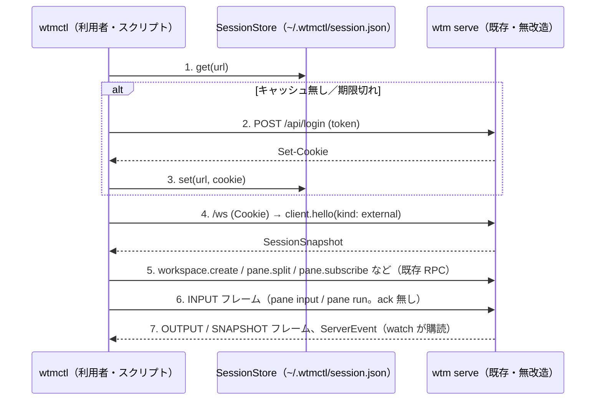

# レビューガイド: 外部操作 API / CLI（`wtmctl`）

## 変更概要 / 目的

ブラウザを介さずに、外部のスクリプト・CLI・他のプロセス（他の AI エージェント含む）から、動いている
`wtm serve` の workspace / tab / pane を作成・分割・入力送信・出力読取・状態購読できるようにする
（backlog「外部操作 API / CLI」。herdr の H38 相当）。新規パッケージ `packages/cli`（バイナリ名 `wtmctl`）を
追加し、**既存の認証（token→session cookie）・既存の WebSocket RPC・既存の Origin/Host 判定を無改造で
再利用**する。サーバ側の変更は `client.hello.kind` に `"external"` を1値追加するだけ。herdr の H39
（エージェント自動化）・H40（pane 直接接続・制御ストリーム）は、設計の質が異なる（新しい状態機械・
排他制御が要る）ため、意図して対象外にして後続 backlog 項目へ切り出した（decisions.md D2）。

## 重要ポイント

- **トランスポートの選択**（decisions.md D3）：herdr は「ローカルの信頼済みソケット」だが、本製品は
  リモート越しのアクセスが前提の製品のため、既存の `POST /api/login` → cookie → `/ws` の経路をそのまま
  使う設計にした。新しい HTTP ルート・ポート・ソケットは一切追加していない
  （`git diff --stat -- packages/server/src/http/HttpServer.ts packages/server/src/ws/WsServerWs.ts
  packages/server/src/main.ts` が無出力であることで確認できる）。
- **`client.hello.kind: "external"` の追加**（decisions.md D4）：画面を持たない CLI が、既定の `"desktop"`
  に乗ってしまうと pane サイズ権限（`SizeAuthority`）を意味なく奪う問題があった。第3の `kind` を足すだけで
  `SizeAuthority.ts` 自体は無改造のまま解決している（`canDecideSize` が等値比較だけなので、新しい値は
  自動的に「資格なし」側になる）。
- **`withSession` が `connect`/`close` を一手に引き受ける**（decisions.md D16。design からの実装時の
  改善）：各コマンドは `fn: (client: WtmClient) => Promise<T>` を渡すだけで、接続・認証の再試行・切断の
  後始末を書かずに済む。
- **`pane input`/`pane run` はサーバからの ack が無い**（INPUT フレームは元々そういう設計）ため、送信前に
  `client.hello()` の snapshot に対象 pane があるかをクライアント側で確認している（`requirePaneExists`）。
- **`pane read --follow`/`watch` は明示的な終了手段を持たない**（Ctrl-C 相当のみ）。design どおりの仕様だが、
  統合テストではこの性質のせいで接続の後始末を誤ると他のテストを汚染する事故が起きた（decisions.md D21）。
  修正後は専用のサーバインスタンスを使い、確認後にサーバごと閉じている。

## 処理フロー

## 主要な変更箇所

- `packages/protocol/src/messages.ts:14` — `clientKind` に `"external"` を追加。
- `packages/server/src/clients/ClientRegistry.ts:4` — `ClientKind` 型の拡張（`SizeAuthority.ts` は無変更）。
- `packages/web/src/net/ports.ts` / `packages/web/src/injection.ts` — `clientKind` の拡張に伴う型の
  波及を、ブラウザ専用の `DeviceKind`（`"desktop"|"mobile"`）を新設して切り離した（decisions.md D11。
  design には無かった、実装時に typecheck で見つけた影響）。
- `packages/cli/src/wsClient.ts` — `/ws` への接続・RPC・フレーム送受信の中核（`connect`/`WtmClient`）。
- `packages/cli/src/withSession.ts` — 認証キャッシュ＋1回だけの再ログイン（design のシーケンス図の実装）。
- `packages/cli/src/commands/{workspace,tab,pane,session}.ts` — 各サブコマンドの実体。
- `packages/cli/src/main.ts` — `cliArgs.parseArgs` → 各コマンドへのディスパッチ（網羅性チェック付き）。
- `packages/cli/src/main.integration.test.ts` — 実サーバ・実 PTY での一巡確認（AC1〜AC7, AC9）。
- `packages/cli/src/smoke.ts` / `.aidev/config.yml` — ビルド済み `dist/main.js` を子プロセスとして
  実際に起動する起動確認（`smokeCommands` に1行追加）。
- `docs/herdr-parity.md` — H38（対応範囲・slug）・H39/H40（後続 backlog 項目名）を更新。H41 は不可侵
  （別の未マージ PR の対象のため）。

## リスク / 確認したい点

- **`pane input`/`pane run` に ack が無い**ことは herdr 由来の既存の非対称性で、この work が作ったものでは
  ない。CLI 側は「送信できたこと」までしか保証しない旨を `--help` に明記しているが、スクリプト作者が
  誤解しないよう、利用ドキュメント（本 work のスコープ外）が必要になれば後続で足すとよい。
- **H39・H40 を後続に切り出した判断**（decisions.md D2）は、backlog 項目の文言をどこまで1 work に
  詰め込むかという裁量判断。`.aidev/backlog/product-roadmap.md` に追加する2つの後続項目名
  （「エージェント自動化 API / CLI」「pane 直接接続・制御ストリーム」）が今後の担当者に伝わる形かどうか、
  必要なら deliver 時にもう一度確認するとよい。
- **Windows・macOS の実機動作は未検証**（test-result.md「未検証の穴」）。Node の `fetch`/`ws` だけを使う
  実装なので原理上は動くはずだが、実測はしていない。
