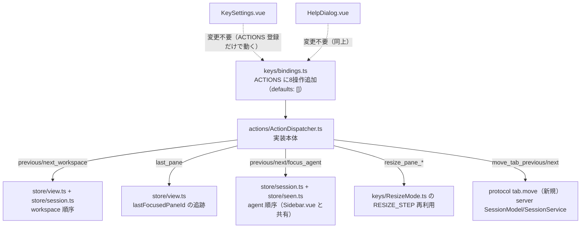

# 調査: herdr の8操作（前後 workspace・直前 pane・tab 並べ替え・resize 直接キー・agent 移動）の意味論

> **出典の略記**（`.aidev/works/20260921-keybinding-customization/research.md` と同じ書式）
> - `herdr:<path>:<行>` = herdr ソースの該当行（コミット `da6bcd5969779bfe0396bcf89a8025d4375d611e`。
>   `scratchpad/herdr` に `git clone --filter=blob:none` → `git checkout da6bcd59` して直読した。
>   `.aidev/works/20260918-web-terminal-multiplexer/research.md`・
>   `.aidev/works/20260921-keybinding-customization/research.md` と同じコミット・同じ取得手順）。
> - `docs/versions/0.9.1/website/src/content/docs/keyboard.mdx`・`concepts.mdx`・`agents.mdx` は grep で
>   該当行が 0 件だった（8操作いずれも名指しの記載が無い）。model.rs の doc コメント・main.rs のサンプル
>   設定・`src/client/shell/actions.rs`（実装本体）のほうが正確で一次資料として優る——**mdx の記載が無い
>   ことを理由に止めず、ソースを直読して解消した**。

## 調査の問い

- Q1: 8操作は herdr のキー設定（`[keys]`）に実在するか。既定は本当に「割り当てなし」か。
- Q2: `last_pane` は履歴スタックか、tmux の `last-window` 相当のトグルか。
- Q3: `previous_agent`/`next_agent`/`focus_agent` の対象は agent の状態を問わないか。順序は何を基準にするか。
      `focus_agent` は一覧を開くのか、範囲キーで直接ジャンプするのか。
- Q4: `previous_workspace`/`next_workspace` はどんな順序で workspace を巡回するか。navigate モードを
      経由するか、直接切り替えるか。
- Q5: `move_tab_previous`/`move_tab_next` の並べ替えの正確な規則は何か（隣と入れ替えるだけか、もっと
      複雑な移動か）。サーバ側に protocol メソッドがあるか。
- Q6: `resize_pane_left/down/up/right` は resize モードの1段階とどう違うか。

## 判明した事実

### F1: 8操作は全て herdr の設定モデルに実在し、既定は「割り当てなし」（Q1）

`herdr:src/config/model.rs:374-450` の doc コメントに1つずつ定義がある（抜粋）:

```
374: /// Select the previous workspace. Unset by default.
375: pub previous_workspace: BindingConfig,
376: /// Select the next workspace. Unset by default.
377: pub next_workspace: BindingConfig,
378: /// Focus the previous agent shown in the agent panel. Unset by default.
379: pub previous_agent: BindingConfig,
380: /// Focus the next agent shown in the agent panel. Unset by default.
381: pub next_agent: BindingConfig,
382: /// Focus an agent by index 1-9. Unset by default.
383: pub focus_agent: BindingConfig,
394: /// Move the active tab one position toward the front. Unset by default.
395: pub move_tab_previous: BindingConfig,
396: /// Move the active tab one position toward the back. Unset by default.
397: pub move_tab_next: BindingConfig,
430: /// Focus the last focused pane across workspaces and tabs. Unset by default.
431: pub last_pane: BindingConfig,
443: /// Resize the focused pane toward the left. Unset by default.
444: pub resize_pane_left: BindingConfig,
446: /// Resize the focused pane downward. Unset by default.
448: /// Resize the focused pane upward. Unset by default.
450: /// Resize the focused pane toward the right. Unset by default.
```

`herdr:src/main.rs:158-190`（サンプル設定のコメント）も同じ既定を裏付け、利用者への推奨バインドの例を
添える：

```
158: # previous_workspace = "" # optional, unset by default
159: # next_workspace = ""     # optional, unset by default
160: # previous_agent = ""     # optional, unset by default
161: # next_agent = ""         # optional, unset by default
162: # focus_agent = ""        # optional indexed binding, e.g. "prefix+alt+1..9"
168: # move_tab_previous = ""   # optional, e.g. "alt+shift+left" moves the tab toward the front
169: # move_tab_next = ""       # optional, e.g. "alt+shift+right" moves the tab toward the back
181: # last_pane = ""          # optional, unset by default; bind e.g. "prefix+tab" for global back-and-forth
187: # resize_pane_left = ""   # optional, e.g. "ctrl+shift+alt+left" resizes without entering resize mode
```

`focus_agent` が「indexed binding」と明記されている点、`last_pane` の例コメントが
**"global back-and-forth"**（全体を通じた行ったり来たり）と明記している点が Q2・Q3 に直結する。

### F2: `last_pane` はトグル（1スロットの「直前」を毎回更新）（Q2）

`herdr:src/client/shell/state.rs:1346-1353`：スナップショットが更新されるたび、**直前のスナップショットの
`focused_pane_id` が今回のものと異なれば**、その古い方を `self.previous_pane_id` に保存する。

```rust
} else if let Some(previous) = self
    .snapshot
    .as_deref()
    .and_then(|current| current.focused_pane_id.as_ref())
    .filter(|previous| Some(previous.as_str()) != snapshot.focused_pane_id.as_deref())
{
    self.previous_pane_id = Some(previous.clone());
}
```

これは **focus が変わるたび（`last_pane` を押した結果としての focus 変更も含む）に効く**ので、
1回押すたびに「今いる場所」と「直前の場所」が入れ替わる——履歴スタックではなく**単一スロットの
トグル**（tmux の `last-window` と同じ構造）。`herdr:src/client/shell/actions.rs:1052-1063` が実行時の
ガード：

```rust
KeybindAction::LastPane => {
    let pane_id = self.previous_pane_id.as_ref()?;
    if Some(pane_id.as_str()) == focused_pane.as_deref()
        || !snapshot.panes.iter().any(|pane| &pane.pane_id == pane_id)
    {
        return None;
    }
    Some(Method::PaneFocus(PaneTarget { pane_id: pane_id.clone() }))
}
```

「直前の pane が今の focus と同じ」「直前の pane がもう存在しない（閉じられた）」の2条件で
何もしない（`None`）。**workspace・tab をまたいで1つだけ**保持する（`main.rs:181` の
"across workspaces and tabs" とも整合）。

### F3: `previous_agent`/`next_agent`/`focus_agent` は「agent が検出された pane」全部が対象で、
状態は問わない。順序はサイドバーの並び順（grouped/priority）と同じ（Q3）

`herdr:src/client/shell/agent_sidebar.rs:20-50` の `ordered_agent_pane_ids`：

```rust
pub(super) fn ordered_agent_pane_ids(
    snapshot: &ClientShellSnapshot,
    sort: crate::config::AgentPanelSortConfig,
) -> Vec<String> {
    // (agent_view_label がある場合の特殊系は省略)
    let mut agents = snapshot.agents.iter().collect::<Vec<_>>();
    if sort == crate::config::AgentPanelSortConfig::Priority {
        agents.sort_by_key(|agent| {
            (std::cmp::Reverse(status_priority(agent.agent_status)),
             std::cmp::Reverse(agent.state_change_seq))
        });
    }
    agents.into_iter().map(|agent| agent.pane_id.clone()).collect()
}
```

`snapshot.agents` は「agent が検出されている pane」の一覧全体（状態でフィルタしない）。`sort` は
`grouped`（並べ替えない＝サーバの順）と `priority`（状態優先度→直近の変化順）の2値——**本製品の
`AgentSort`（`store/view.ts`）・`Sidebar.vue` の `agents` computed（グループ順／優先度順）と同じ設計**。

実行本体は `herdr:src/client/shell/actions.rs:851-880`：

```rust
KeybindAction::FocusAgent(index) => {
    let agents = ordered_agent_pane_ids(snapshot, self.config.agent_panel_sort);
    Some(Method::PaneFocus(PaneTarget { pane_id: agents.get(index)?.clone() }))
}
KeybindAction::PreviousAgent | KeybindAction::NextAgent => {
    let agents = ordered_agent_pane_ids(snapshot, self.config.agent_panel_sort);
    if agents.is_empty() { return None; }
    let current = agents.iter().position(|pane_id| Some(pane_id.as_str()) == snapshot.focused_pane_id.as_deref());
    let next = match (current, action) {
        (Some(current), PreviousAgent) => (current + agents.len() - 1) % agents.len(),
        (Some(current), NextAgent) => (current + 1) % agents.len(),
        (None, PreviousAgent) => agents.len() - 1,
        (None, NextAgent) => 0,
        _ => unreachable!(),
    };
    Some(Method::PaneFocus(PaneTarget { pane_id: agents[next].clone() }))
}
```

`focus_agent` は **`FocusAgent(index)`**——`indexed` な `KeybindAction`（`keybinds.rs:338`
`pub focus_agent: Vec<IndexedKeybind>`。`copy_effective_indexed_field!` マクロで登録。
`switch_tab`・`switch_workspace` と同じ「範囲キー→索引」の仕組み）。**一覧を開くのではなく、
その順位の agent の pane へ直接ジャンプする**。`previous_agent`/`next_agent` は現在の focus が
一覧に無いとき、`next_agent` は先頭（`index 0`）へ、`previous_agent` は末尾（`agents.len() - 1`）へ移る。

`keybind_help.rs:139-141`（キー一覧の群分け）は `previous_agent`/`next_agent`/`focus_agent` を
`workspaces / tabs` 群に置く（`agent` 専用の群を herdr 自身も作っていない）：

```rust
entry(binding_label(&keybinds.previous_agent), "previous agent"),
entry(binding_label(&keybinds.next_agent), "next agent"),
entry(indexed_label(&keybinds.focus_agent), "focus agent 1-9"),
```

### F4: `previous_workspace`/`next_workspace` はサイドバーの workspace 一覧の表示順で直接切り替える
（navigate モードを経由しない）（Q4）

`herdr:src/client/shell/actions.rs:901-921`：

```rust
KeybindAction::PreviousWorkspace | KeybindAction::NextWorkspace => {
    let entries = self.navigation_workspace_entries(snapshot);
    if entries.is_empty() { return None; }
    let current = entries.iter().position(|entry| snapshot.workspaces[entry.index].workspace_id == focused_workspace).unwrap_or(0);
    let delta = if action == PreviousWorkspace { -1 } else { 1 };
    let next = (current as isize + delta).rem_euclid(entries.len() as isize) as usize;
    let workspace_id = snapshot.workspaces[entries[next].index].workspace_id.clone();
    self.reveal_workspace(&workspace_id);
    Some(Method::WorkspaceFocus(WorkspaceTarget { workspace_id }))
}
```

`navigation_workspace_entries`（`herdr:src/client/shell/state.rs:1146-1160`）は
`render::workspace_entries(snapshot, collapsed_groups)`——**サイドバーに表示される workspace の並び
そのもの**（モバイルでは折りたたみグループを無視）。`Method::WorkspaceFocus` を直接発行しており、
navigate モード（矢印で選んで Enter で確定する `keys.workspace_picker`）は経由しない——**1 打で
即切り替わる**、`tabDelta`（`previous_tab`/`next_tab`）と同じ設計。

本製品には「折りたたみグループ」の概念が無いので、対応するのは `Sidebar.vue` の `spaces` computed
（`view.workspaceSort` を反映した順。`opened`＝`session.workspaces` の反復順・`name`＝ラベルの文字列順）
そのものになる。

### F5: `move_tab_previous`/`move_tab_next` は隣と入れ替えるだけ（先頭・末尾は巡回）（Q5）

`herdr:src/client/shell/actions.rs:952-978`（クライアント側。`insert_index` を計算して
`Method::TabMove` を発行）：

```rust
KeybindAction::MoveTabPrevious | KeybindAction::MoveTabNext => {
    let tabs = /* focused_workspace 内の tab 一覧 */;
    if tabs.len() <= 1 { return None; }
    let source = tabs.iter().position(|tab| tab.tab_id == focused_tab)?;
    let insert_index = if action == MoveTabNext {
        if source + 1 >= tabs.len() { 0 } else { source + 2 }
    } else if source == 0 { tabs.len() } else { source - 1 };
    Some(Method::TabMove(TabMoveParams { tab_id: focused_tab, insert_index }))
}
```

サーバ側の適用（`herdr:src/workspace.rs:591-611`。`Workspace::move_tab(source_idx, insert_idx)`）：

```rust
pub fn move_tab(&mut self, source_idx: usize, insert_idx: usize) -> bool {
    if source_idx >= self.tabs.len() || insert_idx > self.tabs.len() { return false; }
    let target_idx = if source_idx < insert_idx { insert_idx.saturating_sub(1) } else { insert_idx }
        .min(self.tabs.len().saturating_sub(1));
    if source_idx == target_idx { return false; }
    let tab = self.tabs.remove(source_idx);
    self.tabs.insert(target_idx, tab);
    // active_tab を root_pane で引き直す（インデックスがずれるため）
    ...
}
```

クライアントが送る `insert_index`（`source+2`／`source-1`／`0`／`tabs.len()`）とサーバの
`remove`→`insert` の組み合わせを机上で追うと、**結果は常に「focus 中の tab とその隣（前 or 後ろ）を
入れ替える」に一致する**（先頭の tab を「前へ」で末尾へ、末尾の tab を「後ろへ」で先頭へ、という巡回も
含む）。本製品では `Workspace.tabIds: string[]` を持つだけなので、herdr の `insert_index` 方式を
そのまま移植する必要はなく、**「対象 tab と隣（巡回込み）を配列内で swap する」**という結果だけを
再現すればよい（design で確定する）。

socket API にも `tab.move` が明記されている（`herdr:docs/versions/0.9.1/website/src/content/docs/socket-api.mdx:105`：
`"Tab | tab.create, tab.list, tab.get, tab.focus, tab.rename, tab.move, tab.close"`、`:822` に
`tab.moved` イベントの記載）——**本製品にはこの相当の protocol メソッド・server 実装が無い**
（`packages/protocol/src/messages.ts` に `tab.move` は存在せず、`packages/server/src/surface/methods/tab.ts`
にも `moveTab` 相当のハンドラが無い。2026-09-23 時点で grep 0 件）。この8操作の中で**唯一、既存の
protocol/server 機能の再配線だけでは終わらない**操作（新規メソッドの追加が要る）。

### F6: `resize_pane_left/down/up/right` は resize モード中の1段階と同じ量（Q6）

`herdr:src/client/shell/actions.rs:1070-1075`：

```rust
KeybindAction::ResizePaneLeft | ResizePaneDown | ResizePaneUp | ResizePaneRight =>
    Some(Method::PaneResize(PaneResizeParams { pane_id: focused_pane, direction: direction(action)?, amount: None })),
```

`amount: None` はサーバ側の既定量を使うことを意味し、resize モードの1回分の移動量と同じ扱い
（herdr のサーバはリサイズの既定刻み幅を持つ）。本製品では `ResizeMode.ts` の `RESIZE_STEP = 0.05`
（`prefix+r` に入った後の h/j/k/l の1段階）が同じ役割を持つ定数として既に存在する（`resizeBy` action
が `{ dir, amount: RESIZE_STEP }` で呼ばれている）ので、直接キー版もこの定数をそのまま再利用すればよい。

### F7: 8操作のキー一覧上の群（herdr との対応）

`herdr:src/input/keybind_help.rs:64-192`（`keybind_help_groups`）の群構成：

| herdr の群 | 該当する8操作 | 本製品の対応する群（`ActionGroup`） |
|---|---|---|
| `workspaces / tabs` | `previous_workspace`・`next_workspace`・`previous_agent`・`next_agent`・`focus_agent`・`move_tab_previous`・`move_tab_next` | `"workspace / tab"`（既存34操作の一部と同じ群） |
| `panes` | `resize_pane_left/down/up/right`・`last_pane` | `"pane"`（既存34操作の一部と同じ群） |

herdr は8操作いずれも独立した「agent」群や「resize」群を作っていない。また `resize_pane_*`・`last_pane`
は herdr のヘルプで**灰色表示にも非表示にもしていない**（`swap_pane_*` 相当の隠し扱いが無い）——
本製品の `helpHidden`（`ACTIONS` の任意フィールド。キー一覧から隠す）を8操作に付ける理由は無い。

## 影響範囲



- **変える**: `packages/web/src/keys/bindings.ts`（`ACTIONS`）・`packages/web/src/keys/actions.ts`
  （`Action` 判別共用体）・`packages/web/src/actions/ActionDispatcher.ts`（実装本体）・
  `packages/web/src/store/view.ts`（`lastFocusedPaneId`・workspace 順序のヘルパー）・
  `packages/web/src/store/session.ts` または新規ファイル（agent 順序のヘルパー、`Sidebar.vue` と共有）・
  `packages/protocol/src/messages.ts`（`tab.move` の params/result）・
  `packages/server/src/surface/methods/tab.ts`（ハンドラ登録）・
  `packages/server/src/session/SessionModel.ts`・`SessionService.ts`（`moveTab` 本体）・
  `docs/herdr-parity.md`（H26 の更新）。
- **変えない見込み**（design で最終確認）: `KeySettings.vue`・`HelpDialog.vue`（`ACTIONS` に登録するだけで
  既存の仕組みが拾う）・navigate/resize/copy モードの中身・既存34操作。

## 実現性 / リスク

- 実現性は高い。8操作のうち7つ（`previous_workspace`/`next_workspace`/`last_pane`/`resize_pane_*`/
  `previous_agent`/`next_agent`/`focus_agent`）は**既存の protocol メソッド（`workspace.focus`・
  `pane.focus`・`pane.resize`）の組み合わせだけ**で実現でき、新しい依存も protocol 変更も要らない。
- リスク R1（`move_tab_previous`/`move_tab_next` だけ）: **新規 protocol メソッドが要る**（F5）。
  クライアント・サーバ両方に手を入れるので、8操作の中でこの2つだけ影響範囲が広い。設計・実装・
  テストの見積もりをここだけ重めにする。
- リスク R2: `previous_agent`/`next_agent`/`focus_agent` の対象順序を `Sidebar.vue` の `agents`
  computed（既存）と食い違わせると、利用者が画面で見た順と操作の対象順がずれる（非機能要件）。
  共有関数として1箇所に括り出し、`Sidebar.vue` 側もそれを使うように寄せるか、少なくとも同じ入力
  （`session.panes`・`seen.getSeenSeq`・`view.agentSort`）から同じ規則で導く形にする必要がある。
- リスク R3: `focus_agent` を2つ目の `indexed: true` 操作にすると、`switch_tab` だけを前提にした
  既存の文言・テストが古くなる（`keymap.ts` のエラーメッセージ「範囲 1..9 は tab の番号選択だけに
  使えます」・`bindings.test.ts` の `indexed` 一覧アサーション）。見落とすと `aidev smoke`/単体テストは
  通るが文言が事実と食い違ったまま残る——design・tasks で明示的に洗い出す。
- リスク R4（小さい）: `last_pane` の追跡を `view.focusPane` に足すと、既存の全呼び出し箇所
  （cyclePane・focusDir・switchToTab 等、A5）の挙動をわずかでも変える。読むだけの追記（副作用の追加）
  で済むよう、既存の `focusedPaneId` の意味・型は変えない設計にする。

## 実装アンカー

- A1: 操作カタログ（`packages/web/src/keys/bindings.ts:31-288` の `ACTIONS`）。既定キー無しの操作を
  初めて登録する箇所——現行コードに `defaults: []` の前例は無い（`grep "defaults: \[\]"` 0件）。
- A2: pane 巡回の既存実装（`ActionDispatcher.cyclePane`。`packages/web/src/actions/ActionDispatcher.ts:412-422`）
  ——`previous_agent`/`next_agent` の「巡回」の参考になるが、対象が「tab 内の全 pane」ではなく
  「agent が検出された pane（workspace・tab をまたぐ）」である点が異なる。
- A3: tab 巡回の既存実装（`ActionDispatcher.tabDelta`。`:443-451`）——`previous_workspace`/`next_workspace`
  の「同じ workspace 内」を「session 全体の workspace 一覧」に置き換えた形に近い。
- A4: resize の既存実装（`ActionDispatcher.resizeBy`。`:567-571`）と `RESIZE_STEP`
  （`packages/web/src/keys/ResizeMode.ts:5`）。
- A5: `view.focusPane`（`packages/web/src/store/view.ts:242-244`）——全ての pane フォーカス変更が
  通る唯一の場所（`cyclePane`・`focusDir`・`switchToTab`・`activateNavigateSelection`・
  `Sidebar.vue` の `focusWorkspace`/`focusPane` 等、すべてここを通る）。`last_pane` の追跡はここに
  1箇所差し込めば全経路を拾える。
- A6: `Sidebar.vue` の `agents` computed（`packages/web/src/components/Sidebar.vue:48-66`）——
  `previous_agent`/`next_agent`/`focus_agent` が対象とすべき順序の**唯一の正**（利用者が画面で見る順と
  一致させる必要がある。design「非機能要件」）。
- A7: tab の CRUD protocol パターン（`packages/protocol/src/messages.ts:135-142`
  `TabRenameParams`/`TabFocusParams`/`TabCloseParams`、`packages/server/src/surface/methods/tab.ts`、
  `packages/server/src/session/SessionService.ts:324-354` の `renameTab`/`closeTab`）——`tab.move` は
  この形に揃える。`workspace.updated` イベントで `tabIds` の変化をブロードキャストする流儀は
  `SessionService.createTab`/`closeTab` のコメント（D88）が説明している。

## design への申し送り

- `last_pane` の追跡（`view.focusPane` への1箇所の差し込み）・workspace/agent の順序を求める共有関数の
  置き場（`Sidebar.vue` の計算ロジックと重複させない）・`tab.move` の protocol 形（`{tabId, direction}` か
  `{tabId, insertIndex}` か）とサーバ側の swap 実装・`focus_agent` を `indexed: true` にしたときの
  既存メッセージ（`keymap.ts` の「範囲 1..9 は tab の番号選択だけに使えます」等、`switch_tab` 専用を
  前提にした文言）の更新要否・`docs/herdr-parity.md` H26 の更新文面・`bindings.test.ts` の
  `indexed.map(...).toEqual(["switch_tab"])` 等、既存テストで「switch_tab だけ」を前提にしている箇所の洗い出し。
