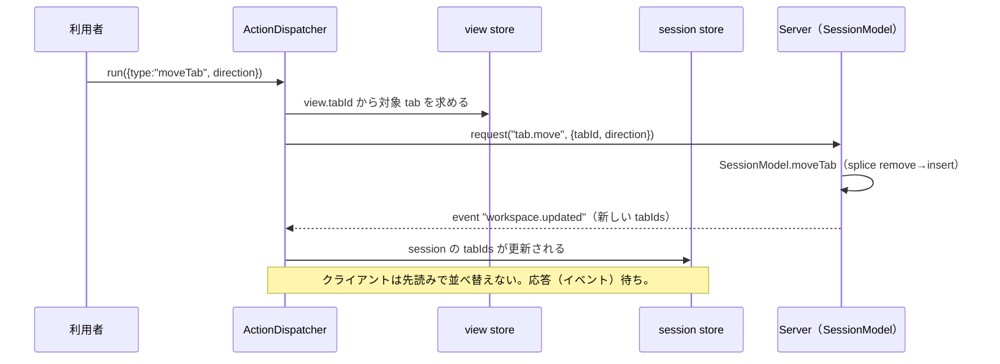
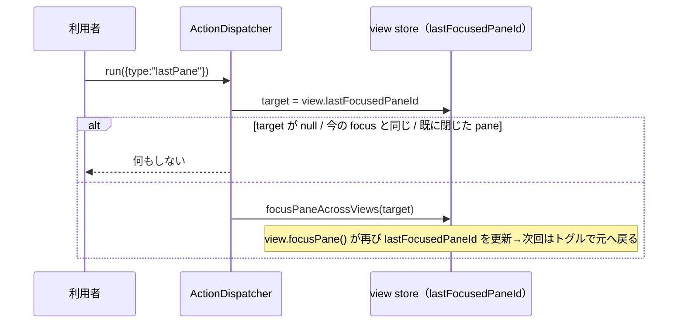

# レビューガイド: herdr にあって本製品に操作自体が無いものを足して割り当てられるようにする

## 変更概要 / 目的

herdr にあって本製品には操作自体が無かった8種12個の `ActionId`（`previous_workspace`/`next_workspace`・
`last_pane`・`move_tab_previous`/`move_tab_next`・`resize_pane_left/down/up/right`・`previous_agent`/
`next_agent`/`focus_agent`）を実装し、既存のキー割り当て基盤（`bindings.ts`）へ登録するだけで利用者が
任意のキーを割り当てて使えるようにした。既定キーは herdr と同じく全て「割り当てなし」。

## 重要ポイント

- **`tab.move` は新規 protocol メソッド**（唯一、既存メソッドの組み合わせだけでは終わらない操作。
  `packages/server/src/session/{SessionModel,SessionService}.ts`・`surface/methods/tab.ts`）。
  `{tabId, direction: "previous"|"next"}` という単純な形にした一方、サーバ側の実装は
  `Array.prototype.splice` の remove→insert で herdr の実際の挙動（単純な2要素 swap ではない）を
  再現している——`decisions.md` **D10** に、design 初期案（単純 swap）から実装中に修正した経緯と、
  修正後のテストが実際に旧実装の欠陥を検知することを確認した negative control の記録がある。
- **agent/workspace の対象順序は `Sidebar.vue` と共有する純関数**（`store/agentOrder.ts`・
  `store/workspaceOrder.ts`。新規）。`ActionDispatcher` と `Sidebar.vue` の両方がこれを呼ぶことで、
  「利用者が画面で見る順」と「`previous_agent`/`focus_agent` 等の操作対象順」が構造的に一致する
  （`decisions.md` D4）。`Sidebar.vue` の既存 computed のリファクタは振る舞い不変——既存の
  `Sidebar.test.ts`（41件）が無変更のまま通ることで確認済み。
- **`last_pane` は1スロットのトグル**（herdr の `previous_pane_id`・tmux の `last-window` と同じ構造）。
  `view.ts` の `focusPane()` 内に追跡ロジックを1箇所だけ差し込んだ（`lastFocusedPaneId`）。
  `paneId === null`（pane が無くなった遷移）のときは更新しない——「意味の無い直前」を作らないため。
- **`focus_agent` は `switch_tab` に次ぐ2つ目の `indexed: true` 操作**。既存の範囲キー基盤
  （`assign.ts` の `def?.indexed === true` 判定）は元から特定の id にハードコードされていなかったため、
  無改修で動いた。`switch_tab` だけを前提にしていた2箇所（エラー文言・`bindings.test.ts` の決め打ち）を
  一般化した。

## 処理フロー

## 主要な変更箇所

- `packages/protocol/src/messages.ts:22,147-151` — `TabMoveParams`。
- `packages/server/src/session/SessionModel.ts:329-354` — `moveTab`（splice 版。decisions D10）。
- `packages/web/src/actions/ActionDispatcher.ts:579-668` — 共有ヘルパー2つ・実行本体5メソッド。
- `packages/web/src/store/agentOrder.ts` / `workspaceOrder.ts` — 新規の共有純関数。
- `packages/web/src/components/Sidebar.vue:30-70` — 上記純関数を使う形への最小リファクタ。
- `packages/web/src/store/view.ts:176-180,245-251` — `lastFocusedPaneId` の追跡。
- `packages/web/src/keys/bindings.ts:150-200,282-317` — 12エントリの登録（`defaults: []`）。

## リスク / 確認したい点

- AC5「別のブラウザでも同じ並び順で見える」は `workspace.updated` イベント配信の単体テストレベルの
  確認に留まる（実際に2クライアントを繋いだ目視確認はE2E範囲でこの work の対象外。test-result.md
  「未検証の穴」参照）。既存の `tab.rename`/`tab.close` と同じ配信経路を使っているため、リスクは低いと
  判断している。
- `KeySettings.test.ts` の総数アサーション（`toHaveLength`）を `41`→`53` へ機械的に更新した
  （decisions D11）。今後さらに操作を追加するたびに同じ決め打ちがまた古くなる——次に触る人向けに
  decisions.md へ記録は残したが、根本的な対策（`ACTIONS.length` を動的に参照する等）は今回のスコープ外。
