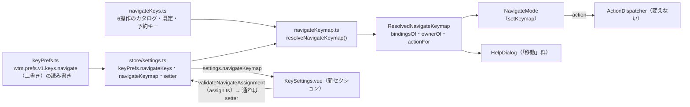

# 仕様: navigate モードの移動キーを変えられるようにする

## 概要

navigate モード（`prefix+w`）の6つの移動操作（`navigate_workspace_up`・`navigate_workspace_down`・
`navigate_pane_left`・`navigate_pane_down`・`navigate_pane_up`・`navigate_pane_right`）を、既存34操作の
表（`bindings.ts` の `ACTIONS`・`keymap.ts` の `ResolvedKeymap`）とは**独立した「別の表」**として実装する
（decisions D2）。新設する2ファイル（`navigateKeys.ts` のカタログ、`navigateKeymap.ts` の解決した表）は、
既存の `bindings.ts`/`keymap.ts` と同じ設計（カタログ＋上書きから解決・上書きが既定に勝つ・予約キーは
登録時に落とす）を、prefix 概念と `isDirectChord` の modifier 必須規則を除いて踏襲する。保存は既存の
`wtm.prefs.v1.keys` バケツに `navigate` という3つ目のサブキーを足す（`prefix`/`bindings` と並ぶ）。
`Enter`（決定）・`Escape`（取消）は今回の6操作に含まれないため触らない。`ArrowLeft`/`ArrowRight` による
pane の左右移動は予約キー（`left`/`right`）に触れるため表には載せられないが、**表の外の固定動作**として
`NavigateMode` に残し、既存の挙動を落とさない（decisions D3）。



## 設計方針

- **別の表にする理由**: 既存34操作の検証（`assign.ts` の `validateBinding`）は「prefix の後」か
  「`ctrl`/`alt`/`cmd` を含む chord か F キー（`isDirectChord`）」の2系統しか許さない。navigate モードは
  prefix 状態機械の外（`KeyRouter.currentMode === "navigate"` で `delegateToSubMode` に渡る。terminal
  モードのように端末入力を奪う心配が無い）にあるため、herdr 同様「bare な単一文字も許す」第三の検証規則が
  要る。既存の2系統に緩め穴を空けると34操作の回帰リスクになるため、完全に分離する（decisions D2）。
- **予約キーは登録の時点で落とす**: `esc`・`enter`・`tab`・`shift+tab`・`left`・`right` の6種と、
  修飾無しの `1`〜`9` の9種、計15 chord を `NAVIGATE_RESERVED_CHORDS` に持ち、`resolveNavigateKeymap`
  の登録時（既定・上書きのどちらも）に弾く。既存の `RESERVED_AFTER_PREFIX`/`RESERVED_DIRECT`
  （`keymap.ts`）と役割は同じだが、対象の chord も理由も別物なので混在させない。
- **矢印キーの扱い**: `navigate_pane_left`/`navigate_pane_right` の既定はカタログ上 `h`/`l` のみ（`left`/
  `right` は予約のため表に登録できない）。`ArrowLeft`/`ArrowRight` は `NavigateMode.handle()` の
  `Enter`/`Escape` と同格の固定 `case` として残し、表の割り当てをどう変えても常に pane 左右移動を行う
  （decisions D3。既存の挙動を落とさないため）。`navigate_workspace_up`/`navigate_workspace_down` は
  `up`/`down` が予約されていないため、表の既定としてそのまま登録し、ユーザーが変更・削除できる
  （削除すると矢印上下キーは navigate モード中で無反応になる。これは仕様どおりの「変えられる」動作）。
- **保存はバケツを増やさず、既存バケツにサブキーを足す**: `wtm.prefs.v1.keys` は「ブラウザごとの
  キー設定」という同じ性質を持つため、新しいトップレベルキーを起こさず `{ prefix?, bindings?, navigate? }`
  の3つ目として `navigate` を足す。後方互換（既存の `prefix`/`bindings` の読み書きは一切変えない）。
- **UI は既存の「取り込んで割り当てる」パターンをそのまま再利用**: `KeySettings.vue` の
  `captureAttrs`/`onCaptureKeydown`/`endCapture` 等の枠組みは、対象（`AssignTarget`）の種類が増えるだけで
  動作原理は変えない。navigate 用に新しい `NavigateAssignTarget`（`kind: "navigateKey"`）を追加し、
  `target` の型を `AssignTarget | NavigateAssignTarget | null` の合併にして、`kind` で分岐する。
- **「こちらへ移す」（20260922-keybinding-usability の衝突移動 UX）は navigate 側には設けない**:
  requirements の AC4 は「理由付きで拒否される」までを要求しており、移動の利便性までは要求していない。
  6操作しかなく衝突相手を目視して直すコストが低いため、スコープを絞り実装量を抑える（decisions には
  残さない軽微な判断だが、tasks/review で追跡できるようここに明記する）。

## 対象範囲

**新規**:
- `packages/web/src/keys/navigateKeys.ts`（カタログ・予約キー・型）
- `packages/web/src/keys/navigateKeys.test.ts`
- `packages/web/src/keys/navigateKeymap.ts`（解決した表）
- `packages/web/src/keys/navigateKeymap.test.ts`

**変更**:
- `packages/web/src/keys/NavigateMode.ts`（6操作を表から引く。`Enter`/`Escape`/矢印左右は固定 case のまま）
- `packages/web/src/keys/NavigateMode.test.ts`（既存の入出力を1:1で守りつつ、表を介する形へ更新）
- `packages/web/src/keys/keyPrefs.ts`（`KeyPrefs.navigateKeys` 追加・読み書き・`withNavigateBinding`/`withoutNavigateBinding`）
- `packages/web/src/keys/keyPrefs.test.ts`
- `packages/web/src/keys/assign.ts`（`NavigateAssignTarget`・`validateNavigateAssignment`・`planNavigateReset`）
- `packages/web/src/keys/assign.test.ts`
- `packages/web/src/store/settings.ts`（`navigateKeymap` computed・`setNavigateKeyBindings`/`resetNavigateKey`）
- `packages/web/src/main.ts`（`NavigateMode` に初期表を渡し、変更を `watch` で反映）
- `packages/web/src/components/KeySettings.vue`（新セクション）
- `packages/web/src/components/HelpDialog.vue`（「移動」群を現在の割り当てから作る）
- `docs/herdr-parity.md`（H26 の「対象外」記述を更新）

## 依拠する既存の事実

- 現行の navigate モードの固定キーと挙動: `packages/web/src/keys/NavigateMode.ts:11-34`
  （`ArrowUp`/`ArrowDown`＝workspace 上下、`h`/`ArrowLeft`・`j`・`k`・`l`/`ArrowRight`＝pane 方向、
  `Enter`＝決定＋退出、`Escape`＝取消＋退出、他は無視）。単体テストでの固定: `NavigateMode.test.ts:9-37`。
- herdr の予約キー（`esc`・`enter`・`tab`・`shift+tab`・左右矢印・素の `1`〜`9`）と、navigate 系だけが
  「prefix なしの素のキー」を書ける別表という事実: `.aidev/works/20260921-keybinding-customization/research.md`
  F7（`herdr:src/config/keybinds.rs:729-749` を実地に読んで確認済み。20260921 work で clone 済みの
  herdr ソースへの参照）。backlog 項目（`.aidev/backlog/product-roadmap.md:40`）も同内容を転記している。
- 既存34操作の「カタログ＋上書きから解決する」設計・登録アルゴリズム（上書きを先に登録、上書きが1つ以上
  あるのに1つも登録できなかった操作は既定を登録し直す）: `packages/web/src/keys/keymap.ts:68-151`
  （`resolveKeymap`）。navigate 版の `resolveNavigateKeymap` はこのアルゴリズムを踏襲する。
- chord の正規化・照合はすべて `chordOf`/`parseChord`/`formatChord`（`packages/web/src/keys/chord.ts`）に
  集約されている事実: 同ファイルの冒頭コメント（`chord.ts:1-15`）と `NAMED_KEYS`（`chord.ts:68-84`。
  `ArrowUp`→`up`・`ArrowLeft`→`left`・`Tab`→`tab`・`Escape`→`esc`・`Enter`→`enter`）。
  navigate 用の予約チェックもこの正規形（`esc`・`enter`・`tab`・`shift+tab`・`left`・`right`・`1`〜`9`）で行う。
- `KeyPrefs`/`wtm.prefs.v1.keys` の保存形・値ごとに落とす読み込み方針・別ウィンドウへの `storage` 追従:
  `packages/web/src/keys/keyPrefs.ts:1-141`、`packages/web/src/store/settings.ts:314-368`
  （`keyPrefs`/`keymap` の computed・`window.addEventListener("storage", …)`）。
- `KeySettings.vue` の取り込み UI（押したキーで即確定・`captureAttrs`/`onCaptureKeydown`/`endCapture`・
  フォーカス管理）: `packages/web/src/components/KeySettings.vue:37-371`。
- `HelpDialog.vue` の「移動」群が現在は固定文言である事実（変更対象）:
  `packages/web/src/components/HelpDialog.vue:11-12,51-57,71`。
- `main.ts` での `KeyRouter`/`NavigateMode` の組み立てと、割り当て変更の `watch` 反映:
  `packages/web/src/main.ts:104-109`。

## インターフェース / データ構造

### カタログ（`keys/navigateKeys.ts`・新規）

```ts
export interface NavigateKeyDef {
  readonly id: string;
  readonly label: string;
  /** 素の chord（`chord.ts` の正規形。prefix なし）の既定一覧。 */
  readonly defaults: readonly string[];
  readonly action: Action; // 常に固定の Action（indexed は無い）
}

export const NAVIGATE_KEYS = [
  { id: "navigate_workspace_up", label: "workspace を上へ選ぶ", defaults: ["up"],
    action: { type: "navigate", op: "up" } },
  { id: "navigate_workspace_down", label: "workspace を下へ選ぶ", defaults: ["down"],
    action: { type: "navigate", op: "down" } },
  { id: "navigate_pane_left", label: "pane を左へ選ぶ", defaults: ["h"],
    action: { type: "navigate", op: "paneDir", dir: "left" } },
  { id: "navigate_pane_down", label: "pane を下へ選ぶ", defaults: ["j"],
    action: { type: "navigate", op: "paneDir", dir: "down" } },
  { id: "navigate_pane_up", label: "pane を上へ選ぶ", defaults: ["k"],
    action: { type: "navigate", op: "paneDir", dir: "up" } },
  { id: "navigate_pane_right", label: "pane を右へ選ぶ", defaults: ["l"],
    action: { type: "navigate", op: "paneDir", dir: "right" } },
] as const satisfies readonly NavigateKeyDef[];

export type NavigateKeyId = (typeof NAVIGATE_KEYS)[number]["id"];
export function navigateKeyDef(id: string): NavigateKeyDef | undefined;
export function isNavigateKeyId(id: unknown): id is NavigateKeyId;

/** herdr の予約（research F7）。正規形（`chord.ts`）で持つ。 */
export const NAVIGATE_RESERVED_CHORDS: ReadonlySet<string> = new Set([
  "esc", "enter", "tab", "shift+tab", "left", "right",
  "1", "2", "3", "4", "5", "6", "7", "8", "9",
]);
```

`bindings.ts` の `ACTIONS`/`ActionDef` と並行だが独立した型（`ActionId` を継承・合併しない。34操作の
体系に一切依存させないことで、既存コードへの影響面積をゼロにする）。

### 解決した表（`keys/navigateKeymap.ts`・新規）

```ts
export interface ResolvedNavigateKeymap {
  bindingsOf(id: NavigateKeyId): readonly string[];
  ownerOf(chord: string): NavigateKeyId | null;
  actionFor(chord: string): Action | undefined;
}

export function resolveNavigateKeymap(
  prefs: Partial<Record<NavigateKeyId, string[]>>,
): { keymap: ResolvedNavigateKeymap; problems: string[] };

export const DEFAULT_NAVIGATE_KEYMAP: ResolvedNavigateKeymap;
```

登録アルゴリズムは `keymap.ts` の `resolveKeymap` と同型（`keymap.ts:68-151` を踏襲）:
1. 上書きのある操作をカタログ順に登録（`source: "user"`）。
2. 上書きの無い操作、または上書きが1つ以上あるのに1つも登録できなかった操作は既定を登録し直す
   （`source: "default"`）。
3. 各登録は chord を `parseChord`→`formatChord` で正規化し、(a) 読めない、(b) `NAVIGATE_RESERVED_CHORDS`
   に含まれる、(c) 既に別の操作が同じ chord を持つ、のいずれかなら**その chord だけ**落とす
   （`source: "user"` のときだけ `problems` に理由を積む。既定の登録失敗は黙って起きない設計——
   デフォルトの chord 集合は互いに衝突せず、予約でもないことをテストで保証する）。
- `prefix` 概念が無いので `via` は持たない。`ownerOf`/`actionFor` は chord 1本で引く。

### `KeyPrefs` の拡張（`keys/keyPrefs.ts`）

```ts
export interface KeyPrefs {
  prefix: string | null;
  bindings: Partial<Record<ActionId, string[]>>;
  navigateKeys: Partial<Record<NavigateKeyId, string[]>>; // 追加
}
```

- `emptyKeyPrefs()` は `navigateKeys: {}` を含める。
- `normalizeNavigateBinding(id: NavigateKeyId, raw: unknown): string | null`: 文字列以外・`parseChord`
  が読めない・`NAVIGATE_RESERVED_CHORDS` に含まれる、のいずれかで `null`。それ以外は正規形の chord文字列
  （`formatChord` の結果。`prefix+`/範囲の概念は無いので `parseBinding`/`formatBinding` は使わない）。
- `loadKeyPrefs(raw)`: 既存の `bindings` 読み込みループと並行して、`raw["navigate"]` を
  `NAVIGATE_KEYS` の順に読み、`normalizeNavigateBinding` で正規化した配列を `navigateKeys[id]` に積む
  （全滅したら上書き消去＝既定へ、既定と同一内容なら「差」として持たない——`bindings` と同じ2つの規則を
  そのまま適用）。
- `serializeKeyPrefs(p)`: `navigateKeys` に1つでもエントリがあれば `out.navigate` に積む（`NAVIGATE_KEYS`
  の順）。`prefix`/`bindings`/`navigate` のいずれも無ければ `undefined`（既存の「`keys` ごと消す」規則を
  そのまま継承）。
- `withNavigateBinding(prefs, id, list)`/`withoutNavigateBinding(prefs, id)`: `withBindings`/
  `withoutBindings` と同型（正規化・既定と同一なら上書き解除・空配列は「割り当てなし」）。

### 取り込みの検証（`keys/assign.ts`）

```ts
export type NavigateAssignTarget = { kind: "navigateKey"; id: NavigateKeyId; replacing?: string };

export function validateNavigateAssignment(
  km: ResolvedNavigateKeymap,
  target: NavigateAssignTarget,
  k: KeyInput,
): AssignResult; // 既存の AssignResult の ok/reason/ignore だけを使う。conflict は常に付けない（手順6）
```

判定順（`validateAssignment`/`validateBinding` と同じ骨格。prefix・`isDirectChord` 判定を除く）:
1. `k.type !== "keydown" || k.composing || k.repeat === true` → 待ち続ける（`IGNORE_SILENT`）。
2. `isModifierOnly(k)` → 待ち続ける（理由付き）。
3. `isAltGrComposed(k)` → 拒否（配列依存の文字は使えない。既存と同じ理由文）。
4. `chordOf(k)` が `null` → 拒否。
5. `NAVIGATE_RESERVED_CHORDS.has(chord)` → 拒否（「◯◯ は navigate モードで予約されているキーなので
   割り当てられません」）。
6. `km.ownerOf(chord)` が自分以外の操作 → 拒否（「◯◯ はすでに「label」が使っています」。
   **`conflict` は付けない**——「こちらへ移す」は navigate 側には設けない設計方針のため）。
7. 自分がすでにその chord を持ち、`replacing` で置き換える対象でもない → 拒否（「すでに割り当てられて
   います」）。
8. 上記いずれも通れば `{ ok: true, binding: chord }`（`prefix+` を付けない生の chord文字列）。

```ts
export type NavigateResetTarget = { kind: "navigateKey"; id: NavigateKeyId } | { kind: "allNavigateKeys" };

export function planNavigateReset(
  km: ResolvedNavigateKeymap,
  prefs: KeyPrefs,
  target: NavigateResetTarget,
): ResetPlan; // 既存の ResetPlan/SkippedBinding をそのまま使う
```
`planReset` の `"action"`/`"all"` 分岐と同じ考え方（1操作の上書きだけ外す／`navigateKeys` を丸ごと消す。
「既定のキーを他操作が使っていて戻せない」ケースは navigate 同士の衝突でも起こり得るため `skipped` を
そのまま使う）。

### store（`store/settings.ts`）

```ts
const keyPrefs = ref<KeyPrefs>(loadKeyPrefs(initial["keys"])); // 変更なし（navigateKeys も含む形に変わる）
const navigateKeymap = computed<ResolvedNavigateKeymap>(
  () => resolveNavigateKeymap(keyPrefs.value.navigateKeys).keymap,
);
function setNavigateKeyBindings(id: NavigateKeyId, bindings: readonly string[]): void {
  replaceKeyPrefs(withNavigateBinding(keyPrefs.value, id, bindings));
}
function resetNavigateKey(id: NavigateKeyId): void {
  replaceKeyPrefs(withoutNavigateBinding(keyPrefs.value, id));
}
```
`replaceKeyPrefs`（既存）・`storage` イベント追従（既存）・`resetAllKeys`（既存。`emptyKeyPrefs()` に
戻すので `navigateKeys` も一緒に既定へ戻る）はそのまま使う。**新しい関数を2つ足すだけ**で他は無改造。

### `NavigateMode.ts` の変更

```ts
export class NavigateMode implements SubModeInterpreter {
  constructor(private keymap: ResolvedNavigateKeymap = DEFAULT_NAVIGATE_KEYMAP) {}
  setKeymap(keymap: ResolvedNavigateKeymap): void { this.keymap = keymap; }

  handle(k: KeyInput): { action?: Action; exit?: boolean } {
    switch (k.key) {
      case "Enter":
        return { action: { type: "navigate", op: "activate" }, exit: true };
      case "Escape":
        return { action: { type: "navigate", op: "cancel" }, exit: true };
      case "ArrowLeft": // 予約キー（left）の固定動作。表の割り当てに関わらず常に効く（decisions D3）
        return { action: { type: "navigate", op: "paneDir", dir: "left" } };
      case "ArrowRight": // 同上（right）
        return { action: { type: "navigate", op: "paneDir", dir: "right" } };
      default: {
        const chord = chordOf(k);
        const action = chord === null ? undefined : this.keymap.actionFor(chord);
        return action ? { action } : {};
      }
    }
  }
}
```

## 振る舞いの詳細

### `main.ts` の配線

```ts
const navigateMode = new NavigateMode(settings.navigateKeymap); // 初期表を直接渡す（KeyRouter と同じ流儀）
const router = new KeyRouter(settings.keymap, clock, { navigate: navigateMode, copy: ..., resize: ... });
watch(() => settings.keymap, (km) => router.setKeymap(km));
watch(() => settings.navigateKeymap, (km) => navigateMode.setKeymap(km)); // 追加
```

### `KeySettings.vue` の新セクション

- 既存の「絞り込み」欄と3群（全体/workspace・tab/pane）の一覧の**後**、または専用の見出し
  「navigate モードの移動」の下に、6操作を並べる `<ul>` を追加する（既存の `<details>`/chip/
  ［追加］/［既定に戻す］の構造をそのまま流用。群見出し・絞り込みへの参加は任意——6件のみなので
  `filterText` の対象に含めても含めなくても良いが、一貫性のため**含める**：`actionsByGroup` と並ぶ
  `navigateEntriesFiltered` を用意し、絞り込み文字列でラベル一致を見る）。
- `target` の型を `AssignTarget | NavigateAssignTarget | null` に広げ、`isCapturing`/`captureHint`/
  `apply`/`onCaptureKeydown` を `t.kind === "navigateKey"` の分岐で拡張する（`validateNavigateAssignment`
  を呼ぶ・`settings.setNavigateKeyBindings`/`resetNavigateKey` を呼ぶ）。
- ［追加］ボタンは1種類のみ（prefix/direct の区別が無いため）。捕捉中の案内文は
  「navigate モードの中で押すキーを押してください（Esc で取り消し）」。
- 既存の `bindingsText`/`displayFor`（macOS レイアウト補正含む）・`removeBinding`・
  `describeSkip`・状態帯（`role="status"`）はそのまま共用する（navigate 用の `bindingsOf`/`resetAction`
  相当の薄いラッパーだけを新設）。

### `HelpDialog.vue`「移動」群の動的化

固定配列 `NAVIGATE_ENTRIES` を、`settings.navigateKeymap` から作る関数に置き換える:

```ts
function navigateEntry(id: NavigateKeyId): string {
  const list = settings.navigateKeymap.bindingsOf(id);
  return list.length === 0 ? "なし" : list.join(" / ");
}
const NAVIGATE_ENTRIES = computed<HelpEntry[]>(() => [
  { keys: "esc", label: "戻る" },
  { keys: navigateEntry("navigate_workspace_up"), label: "workspace を上へ選ぶ",
    grayed: navigateEntry("navigate_workspace_up") === "なし" },
  { keys: navigateEntry("navigate_workspace_down"), label: "workspace を下へ選ぶ",
    grayed: navigateEntry("navigate_workspace_down") === "なし" },
  { keys: `${navigateEntry("navigate_pane_left")} ・ ←`, label: "pane を左へ選ぶ" },
  { keys: navigateEntry("navigate_pane_down"), label: "pane を下へ選ぶ",
    grayed: navigateEntry("navigate_pane_down") === "なし" },
  { keys: navigateEntry("navigate_pane_up"), label: "pane を上へ選ぶ",
    grayed: navigateEntry("navigate_pane_up") === "なし" },
  { keys: `${navigateEntry("navigate_pane_right")} ・ →`, label: "pane を右へ選ぶ" },
  { keys: "enter", label: "選んだ workspace を開く" },
]);
```
左右2行は矢印キーが常に固定で効くことを利用者に見せるため「・ ←」「・ →」を常に添える（表の割り当てを
消しても矢印は効くという AC3/D3 の仕様を画面上でも正しく伝える）。ヘッダーコメント（`HelpDialog.vue:11-12`）
の「移動の群…固定の表記」という記述も、実装に合わせて書き換える。

### 保存例（`wtm.prefs.v1`）

```json
{ "keys": { "bindings": { "zoom": ["ctrl+alt+z"] },
            "navigate": { "navigate_pane_left": ["ctrl+h"], "navigate_workspace_up": [] } } }
```
（`navigate_workspace_up: []` は「割り当てなし」＝上矢印キーで workspace 上へ移動しなくなった状態。
`prefix`/`bindings` と同じ「空配列＝明示的な割り当てなし」規則。）

## ドメイン固有の考慮

- 本 work は `.aidev/conventions/regression-negative-control.md`（不具合修正時の回帰テスト）の対象では
  ない（新機能追加であり不具合修正ではない）が、**既存挙動の非破壊**という同種の要求があるため、
  `NavigateMode.test.ts` の既存アサーション（Arrow/h/j/k/l/Enter/Escape の入出力）は1件も変更せず、
  新しい表を介しても同じ入出力になることをそのまま検証し続ける（変異試験は本 work の対象外——
  「状態機械のテストは実物のモード解釈を渡す」という規約はコード変更を伴う不具合修正時の話で、
  今回は新設の検証ロジックのため、通常の網羅的ユニットテストで足りると判断する）。
- `.aidev/conventions/e2e-observe-browser.md`: このセッションでは E2E 一式の新規実行はユーザーの明示依頼が
  無いため行わない（requirements「対象外」）。単体テストと `aidev smoke` で検証する。

## エラー処理 / 異常系

- 予約キーの取り込み・保存値: 取り込み時は理由付きで拒否（画面へ表示）。保存値（他ブラウザからの
  コピー等で紛れ込んだ壊れた値）は `loadKeyPrefs`/`resolveNavigateKeymap` が黙って1件ずつ落とし、
  他の操作・他の設定に影響しない（既存34操作と同じ「値ごとに落とす」方針）。
- 6操作間の衝突: 取り込み時は理由付きで拒否。保存値の衝突（手書き・旧バージョンの残骸）は
  `resolveNavigateKeymap` が「先に登録された操作が勝つ」（カタログ順、上書き優先）で解決し、
  `problems` に記録する（既存 `resolveKeymap` と同じ規則）。
- `navigate_workspace_up`/`down` を両方「割り当てなし」にした場合: workspace の上下移動キーが無くなる
  （pane 移動・Enter/Escape は影響を受けない）。UI 側で警告はしない（既存34操作でも「割り当てなし」を
  許しており、同じ扱いにする）。

## 受け入れ基準との対応

- AC1: `KeySettings.vue` の新セクション（6操作の変更・追加・削除）。入力: requirements「対象」1項目。
- AC2: `NAVIGATE_RESERVED_CHORDS` による取り込み時拒否（`validateNavigateAssignment` 手順5）と、
  保存値読み込み時の同チェック（`normalizeNavigateBinding`）。入力: requirements「機能要件」2項目・
  research F7。
- AC3: `NAVIGATE_KEYS` の `defaults`（up/down/h/j/k/l）と、`NavigateMode.handle()` の `ArrowLeft`/
  `ArrowRight` 固定 case。入力: requirements「機能要件」4項目・decisions D3。
- AC4: `validateNavigateAssignment` 手順6・7（`ownerOf`/自己重複チェック）。入力: requirements
  「機能要件」3項目。
- AC5: `planNavigateReset`（`kind: "navigateKey"`）と `KeySettings.vue` の「既定に戻す」ボタン。
  入力: requirements「機能要件」7項目目（「操作ごとに既定へ戻せる。」）。
- AC6: `setNavigateKeyBindings`/`resetNavigateKey` が既存 `replaceKeyPrefs`（即時反映・保存・`storage`
  追従）を経由する。入力: requirements「機能要件」6項目目（doccheck 指摘により追記済み）。
- AC7: `HelpDialog.vue` の「移動」群の動的化。入力: requirements「対象」5項目・US3。
- AC8: `NavigateMode.test.ts` 等の既存アサーションを変更せず維持、既存34操作のファイル
  （`bindings.ts`・`ACTIONS`・`keymap.ts`・`ResolvedKeymap`）は一切変更しない。入力: requirements
  「非機能要件」1項目。
- AC9: `docs/herdr-parity.md` H26 の更新（本 work の着地時に反映）。入力: requirements「対象」6項目。
- AC-I1: ［変更］／［追加］ボタンで取り込み待ちに入り、`Escape` で取り消す（既存の取り込み開始（ボタンの
  click ハンドラ）・終了（`endCapture`）の仕組みをそのまま再利用）。入力: requirements「相互作用の受け入れ基準」AC-I1。
- AC-I2: 押した瞬間のキーで確定・`Escape` で元のまま取り消す（既存の `onCaptureKeydown` の確定/
  取消分岐をそのまま再利用）。入力: requirements「相互作用の受け入れ基準」AC-I2。
- AC-I3: フォーカス移動・取り込み・`role="status"` の読み上げまでマウス無しで完結する（既存部品の
  共用のため、既存34操作と同じキーボード完結性を引き継ぐ）。入力: requirements「相互作用の受け入れ基準」AC-I3。
- AC-I4: 変更確定後は変更後の割り当ての［変更］へ、削除後は次の部品へ戻る（既存の `apply`/
  `removeBinding` のフォーカス制御をそのまま再利用）。入力: requirements「相互作用の受け入れ基準」AC-I4。
- AC-I5: 取り込み待ちの間のキーは `preventDefault`/`stopPropagation` で漏らさない（既存の
  `captureAttrs`/`onCaptureKeydown` をそのまま再利用）。入力: requirements「相互作用の受け入れ基準」AC-I5。
