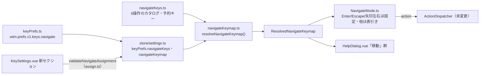

# レビューガイド: navigate モードの移動キーを変えられるようにする

## 変更概要 / 目的

navigate モード（`prefix+w`）の中の6つの移動操作（`navigate_workspace_up/down`・
`navigate_pane_left/down/up/right`）を、設定画面の節「キー」から個別に変更・追加・削除・既定へ戻せる
ようにした。既存の34〜35操作（`prefix+v` のような prefix の後のキー・`ctrl+alt+d` のような直接のキー）
とは検証規則が異なる（prefix 不要・bare な単一文字も許す）ため、**意図的に別の表**として実装した
（`keys/navigateKeys.ts`・`keys/navigateKeymap.ts`）。既存の34〜35操作の体系
（`keys/bindings.ts`・`keys/keymap.ts`）は一切変更していない。

## 重要ポイント

- **予約キー**（`esc`・`enter`・`tab`・`shift+tab`・`left`・`right`・修飾無しの`1`〜`9`）は herdr の
  仕様をそのまま踏襲し、6操作のどれにも割り当てられない（`navigateKeys.ts` の
  `NAVIGATE_RESERVED_CHORDS`）。
- **矢印キーの扱い**（decisions.md D3）: `left`/`right` は予約のため表に登録できないが、既存の
  「`ArrowLeft`/`ArrowRight` で pane を左右移動する」という挙動は落とせない。そこで
  `NavigateMode.ts` に `Enter`/`Escape` と同格の**固定 case**として残し、表の割り当てをどう変えても
  常に効くようにした。`navigate_pane_left`/`navigate_pane_right` の既定は `h`/`l` のみ（`up`/`down`
  は予約されていないので表の既定としてそのまま登録され、削除もできる——非対称なのは意図どおり）。
- **KeySettings.vue の `NavigateResetTarget` は design.md のスケッチから縮小した**（decisions.md D4）:
  design では `{kind:"navigateKey"} | {kind:"allNavigateKeys"}` の合併型だったが、「navigate だけを
  一括で戻す」ボタンは UI に存在しない（既存の「すべて既定に戻す」が `navigateKeys` も含めて戻すため）
  ので、未使用の分岐を実装しなかった。
- **coding 工程の独立点検（1タスク=1委譲。全19タスク+cross）で18件の指摘を検出・その場で解消済み**
  （`review.md`「タスク点検ログ」参照）。代表的なもの: `assign.ts` の未使用 import（lint エラーに
  なる実害あり）、`HelpDialog.vue` で pane 左右の行が「矢印は常に効く」という設計意図に反して灰色
  表示になっていたバグ（design のスケッチが正しく、実装がそこから逸れていた）。

## 処理フロー

## 主要な変更箇所

- `packages/web/src/keys/navigateKeys.ts`（新規） — 6操作のカタログ・既定値・予約キー集合
- `packages/web/src/keys/navigateKeymap.ts`（新規） — カタログ＋上書きから解決した表（`keymap.ts` の
  `resolveKeymap` と同じ2段階登録アルゴリズムを踏襲）
- `packages/web/src/keys/NavigateMode.ts:11-35` — `Enter`/`Escape`/`ArrowLeft`/`ArrowRight` は固定
  case、それ以外は `chordOf` で正規化して表を引く
- `packages/web/src/keys/keyPrefs.ts` — `KeyPrefs.navigateKeys`（必須フィールド）・
  `normalizeNavigateBinding`・`loadKeyPrefs`/`serializeKeyPrefs` の `navigate` サブキー・
  `withNavigateBinding`/`withoutNavigateBinding`
- `packages/web/src/keys/assign.ts`（末尾に追加） — `validateNavigateAssignment`（判定順は design.md
  「取り込みの検証」手順1〜8）・`planNavigateReset`
- `packages/web/src/store/settings.ts:327-338,437-450,488,515-516` — `navigateKeymap` computed・
  `setNavigateKeyBindings`/`resetNavigateKey`
- `packages/web/src/main.ts:101-112` — `NavigateMode` への初期表の注入と `watch` による反映
- `packages/web/src/components/KeySettings.vue` — `CaptureTarget` 合併型・navigate 専用セクション
  （既存の取り込み UI をそのまま再利用）
- `packages/web/src/components/HelpDialog.vue:55-86` — 「移動」群を `settings.navigateKeymap` から
  動的に作る（pane 左右の2行だけ `grayed` を立てない——矢印の固定フォールバックがあるため）
- `docs/herdr-parity.md`（H26c 行を新設。H26b と同じパターン）

## リスク / 確認したい点

- `KeyPrefs.navigateKeys` を既存の `bindings` と同じ**必須**フィールドにしたため、`emptyKeyPrefs()`
  を経由しない既存テストの `KeyPrefs` リテラル十数箇所に機械的な追従（`navigateKeys: {}` の追加）が
  必要になった（T9）。動作は変えていないが、diff の行数を押し上げている。
- E2E は対象外（requirements の対象外・ユーザーの明示依頼なし）。ブラウザ実機（Firefox・Safari・
  モバイル）での navigate セクションの見た目は未検証（test-result.md「未検証の穴」参照）。
- `navigate_workspace_up`/`navigate_workspace_down` の既定を利用者が削除すると、矢印上下キーが
  navigate モード中で無反応になる（仕様どおりの「変えられる」動作だが、初見では気づきにくいかもしれない）。
