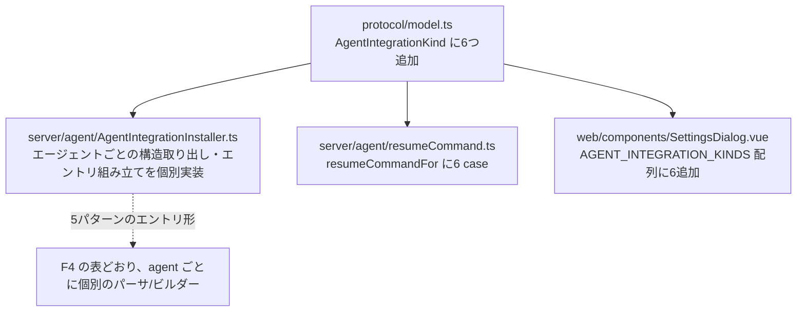

# 調査: Claude Code・Codex 以外の8エージェントへのセッション再開対応

> **出典の略記**: 各エージェント公式ドキュメントを WebSearch/WebFetch で直接取得（2026-09-23）。
> herdr 側の対応表（resume コマンド・統合方式の分類）は
> `.aidev/works/20260923-agent-session-resume/research.md` F1.2〜F1.4（herdr の
> `session-state.mdx`/`integrations.mdx` からの引用）を参照元とする。

## 調査の問い

- Q1: herdr が「session identity」型（Claude Code・Codex と同じく、hook はセッションIDの報告だけを行い、
      状態判定は引き続き画面検出）と分類する10エージェントのうち、実際に `SessionStart` 相当の
      hook（セッション開始時に一度だけ発火し、セッションIDを取得できるもの）を持つのはどれか。
- Q2: 持つものについて、hook の設定ファイルの場所・形式（JSON/YAML）・セッションIDの受け渡し方法
      （stdin JSON のフィールド名・環境変数）は何か。
- Q3: 本製品の既存の統合機構（`AgentIntegrationInstaller`。Claude Code・Codex 向けに作られた）は、
      これらのエージェントにそのまま拡張できる構造か。

## 判明した事実

### F1: 10エージェントのうち8つが `SessionStart` 相当の hook を持つ。Antigravity CLI・Qoder CLI は持たない（Q1）

最初の調査委託（サブエージェント）は10エージェント全てに `SessionStart` 相当の hook がある（Antigravity
CLIのみ除く）と報告したが、**その報告には少なくとも1件の誤り（Qoder CLI）があった**——`aidev-10-requirements`
の直前に、report にある URL を1つずつ自分で `WebFetch`/`WebSearch` して直接検証したところ判明した
（「表面上もっともらしいが未検証の報告を鵜呑みにしない」の実例。decisions.md D1 参照）。

- **Antigravity CLI**: `https://antigravity.google/docs/hooks/` を `WebFetch` で直接確認。文書に列挙される
  hook イベントは `PreToolUse`・`PostToolUse`・`PreInvocation`・`PostInvocation`・`Stop` の5つのみ——
  いずれもツール呼び出し・モデル呼び出しの前後、またはループ終了時に発火するもので、
  **セッション開始時に一度だけ発火するイベントは存在しない**。
- **Qoder CLI**: `https://docs.qoder.com/en/cli/hooks` を `WebSearch` で直接確認。「Qoder does not support
  the SessionStart hook event. Its supported events are: UserPromptSubmit, PreToolUse, PostToolUse,
  PostToolUseFailure, Stop.」と明記——**`SessionStart` が無いとドキュメント自身が明言している**。
- 残り8エージェントは、下記 F2 の一覧のとおり `SessionStart`（またはその同義語）を持つことを
  個別に一次資料で確認済み。

### F2: 8エージェントの hook 設定・セッションID受け渡しの一覧（Q2）

| agent | 設定ファイル | 形式 | セッションIDの受け渡し | 出典 |
|---|---|---|---|---|
| Cursor Agent CLI | `.cursor/hooks.json`（project）。バージョン1 | JSON | stdin JSON（`sessionStart`イベント。exact フィールド名は design で `cursor.com/docs/hooks` を再確認） | `cursor.com/docs/hooks` |
| GitHub Copilot CLI | `~/.copilot/hooks/*.json`（personal）／`.github/hooks/*.json`（repo） | JSON | stdin JSON: `sessionId`（camelCase）または `session_id`（PascalCase/VS Code互換）。他に `timestamp`・`cwd`・`source: "startup"\|"resume"\|"new"`・`initialPrompt?` | `docs.github.com/en/copilot/reference/hooks-reference` |
| Devin CLI | 設定ファイル（`SessionStart` 配列を持つ hook 設定。exact パスは design で確認） | JSON | `matcher`＋`hooks[].command` 形式（`herdr`/Claude Code と酷似したスキーマ）。stdin JSON に session 情報 | `docs.devin.ai/cli/extensibility/hooks/lifecycle-hooks` |
| Droid（Factory AI） | `docs.factory.ai/cli/configuration/hooks-guide` 参照（exact パスは design で確認） | JSON | `SessionStart` は9イベント中の1つ（他: `PreToolUse`・`PostToolUse`・`UserPromptSubmit`・`Notification`・`Stop`・`SubagentStop`・`PreCompact`・`SessionEnd`）。新規・再開どちらでも発火 | `docs.factory.ai/reference/hooks-reference` |
| Grok CLI（xAI Grok Build） | `~/.grok/hooks/*.json`（personal）／`<project>/.grok/hooks/*.json`（project） | JSON | stdin JSON: `hookEventName`・`sessionId`・`cwd`・`workspaceRoot`。環境変数: `GROK_SESSION_ID`・`GROK_HOOK_EVENT`・`GROK_HOOK_NAME`・`GROK_WORKSPACE_ROOT`・`GROK_PLUGIN_ROOT` | `docs.x.ai/build/features/hooks` |
| Qwen Code | `.qwen/settings.json`（project）／ユーザー設定 | JSON | `SessionStart` を含む hook 配列。`{"type":"command","command":"…"}` 形式。`async: true` でブロックしない実行も可（design で exact フィールド名を再確認） | `qwenlm.github.io/qwen-code-docs/en/users/features/hooks/` |
| Letta Code | `.letta/settings.local.json`（未コミット）→ `.letta/settings.json`（project）の優先順 | JSON | `SessionStart` hook。セッション開始時に一度だけ発火し、以降の hook が参照する会話スレッドを立てる（design で exact stdin フィールド名を再確認） | `docs.letta.com/letta-code/hooks/` |
| Hermes Agent（NousResearch） | `~/.hermes/config.yaml` | **YAML**（他7つと違い唯一の非JSON） | シェルスクリプトを hook として宣言し、サブプロセスとして起動。セッションIDの受け渡しは環境変数経由と推定（design で `hermes-agent.nousresearch.com/docs/user-guide/features/hooks` を再確認して確定） | `hermes-agent.nousresearch.com/docs/user-guide/features/hooks` |

**Cursor Agent CLI・Devin CLI・Droid・Qwen Code・Letta Code**の5つは、stdin JSON の正確なフィールド名
（`session_id` か `sessionId` か等）を design 工程で個別に再確認する（このリサーチの時点では
「`SessionStart` 相当の hook が実在する」ことの確認を優先し、全項目の完全な schema 採取は design へ
申し送る——F1 の教訓どおり、生成された報告を鵜呑みにせず1つずつ一次資料を当たる作業は時間を要するため、
design 工程でタスクの対象を絞ってから当たる方が手戻りが少ない）。

### F3: 既存の `AgentIntegrationInstaller` は kind ごとの分岐が1箇所だけだが、実際には「機械的に拡張できる」は誤りだった（Q3。F4で訂正）

**この F3 は当初「8エージェント全てに機械的に拡張できる」と結論していたが、design 直前の
再検証（F4）でこの結論は誤りだったと判明した**——`pathsFor` が1箇所の分岐で済むのは事実だが、
`sessionStartEntries`/`buildEntry`/`isOurs` 等、設定ファイルの**構造そのもの**（`hooks.SessionStart`
という PascalCase キー・`{matcher, hooks:[{type,command,async}]}` というエントリの形）に依存する
関数群は、6エージェントのうち1つも完全には一致しない（F4）。「配管（読み書きの周辺処理）は汎用、
中身の構造はエージェントごとに個別」というのが正確な言い方——過去の言い回し（本節見出し）は
参考として残すが、結論は F4 を正とする。

`packages/server/src/agent/AgentIntegrationInstaller.ts` の `pathsFor`（27-34行）が **唯一の per-kind 分岐**。
`{configFile, hooksDir, binName}` を返すだけで、JSON の読み込み・マージ・書き出し・`status`/`install`/
`uninstall` は完全に kind に依存しない汎用実装（`packages/server/src/agent/AgentIntegrationInstaller.ts`
全体を確認済み）。

- `packages/protocol/src/model.ts:81` の `AgentIntegrationKind = "claude" | "codex"` が唯一の union 型。
  新しい kind を足すと `Record<AgentIntegrationKind, ...>`（`messages.ts:262`）の網羅性チェックで
  抜けを型エラーとして検出できる（安全網として機能する）。
- `packages/web/src/components/SettingsDialog.vue:324-326,820` の UI は `AGENT_INTEGRATION_KINDS` 配列への
  `v-for` で、テンプレートの複製が要らない。
- `packages/server/src/agent/resumeCommand.ts:20-30` の `switch(kind)` へ resume コマンドの `case` を
  6つ追加するだけで済む（コマンド自体は herdr の対応表・各公式ドキュメントの CLI リファレンスで
  既に判明——F2 の表に列挙のとおり、`cursor-agent --resume <id>`・`copilot --resume=<id>`・
  `devin --resume <id>`・`droid --resume <id>`・`grok --resume <id>`・`qwen --resume <id>`）。
  ここは唯一「本当に機械的（case を足すだけ）」な箇所。

### F4: 6エージェントそれぞれの exact な hook 設定・エントリ形（設計直前の再検証。decisions D3）

design 直前に、8エージェント（当時）それぞれの公式ドキュメントを個別に再取得し、**リテラルな
JSON/設定例を引用**して確認した（F1で「もっともらしい報告に誤りが混入していた」経験を踏まえ、
paraphrase ではなく原文引用を徹底）。結果、**6エージェントのうち1つも既存コード
（`hooks.SessionStart` という PascalCase キー・`{matcher, hooks:[{type,command,async}]}` という
エントリ形）と完全には一致しないと判明した**：

| agent | 設定ファイル | トップレベルのキー構造 | hook エントリの形 | セッションIDの受け渡し |
|---|---|---|---|---|
| Cursor Agent CLI | `.cursor/hooks.json`（project）／`~/.cursor/hooks.json`（user） | `hooks.sessionStart`（**小文字始まり**） | `{command, timeout?, type?, failClosed?}`——`matcher`/`hooks[]` の入れ子が無いフラットな形 | stdin: `session_id`。env: `CURSOR_TRANSCRIPT_PATH`（パス。IDではない） |
| GitHub Copilot CLI | `~/.copilot/hooks/*.json`（personal。`$COPILOT_HOME/hooks/` も可）／`.github/hooks/*.json`（repo） | `hooks.sessionStart` または `hooks.SessionStart`（両方許容） | `{type, bash, powershell, command?, cwd?, env?, timeoutSec}`——bash/powershell 分岐キー。`hooks[]` の入れ子が無い | stdin: camelCase `sessionId` または PascalCase 系 `session_id`（2つの変種が文書化されている） |
| Devin CLI | **公式ドキュメントに exact なパスの記載が見当たらない**（design で追加確認・妥当な既定値の設計が要る） | `SessionStart` が**トップレベル直下のキー**（`hooks` でラップしない） | `{matcher, hooks:[{type:"command", command, timeout}]}`——`async` は無く `timeout` | stdin: `session_id`・`source` |
| Droid（Factory AI） | `~/.factory/hooks.json` | `SessionStart` が**トップレベル直下のキー**（「Standalone hooks.json files are keyed directly by event name」と明記） | `{matcher, hooks:[{type:"command", command, timeout}]}`（timeout既定60秒。`async` は無い） | stdin: `session_id`・`transcript_path`・`cwd`・`hook_event_name`・`source: startup\|resume\|clear\|compact` |
| Grok CLI（xAI） | `~/.grok/hooks/*.json`（personal）／`<project>/.grok/hooks/*.json` | `hooks.SessionStart`（PascalCase。既存コードと一致） | `{matcher, type:"command"\|"http", command/url, timeout}`——内側の `hooks[]` 配列が無いフラットな形 | stdin: `hookEventName`・`sessionId`・`cwd`・`workspaceRoot`。env: `GROK_SESSION_ID` 等 |
| Qwen Code | `.qwen/settings.json`（project/user） | `hooks.SessionStart`（PascalCase。既存コードと一致） | `{hooks:[{type,command,name,timeout,async,env,shell,statusMessage}]}`——**`async` を持つ。6つの中で既存コードに最も近い** | stdin: `session_id`・`cwd`・`hook_event_name`・`source: startup\|resume\|clear\|compact` |

**結論**: `hooks.SessionStart` の入れ物（トップレベル or ラップされたキー）だけでも3パターン
（`hooks.SessionStart` 直下・トップレベル直下・`hooks.sessionStart` 小文字）に分かれ、内側のエントリ形も
5パターンに分かれる。`AgentIntegrationInstaller` の抽象化（`pathsFor` だけの分岐）では吸収できず、
**エージェントごとに「トップレベル構造の取り出し」「エントリの組み立て」の2関数を持つ形へ拡張する
必要がある**——design で具体化する。

（Letta Code・Hermes Agent はこの再検証でセッションIDの受け渡し方法が文書上確認できず、
decisions D3 により対象から除外した。Antigravity CLI・Qoder CLI は F1 の時点で除外済み。）

## 影響範囲

- **変える**: `packages/protocol/src/model.ts`（`AgentIntegrationKind`）・
  `packages/protocol/src/messages.ts`（`Record<AgentIntegrationKind, ...>` 系）・
  `packages/server/src/agent/AgentIntegrationInstaller.ts`（F4 の3パターンのトップレベル構造・
  5パターンのエントリ形を吸収する抽象化、または agent ごとの個別関数）・
  `packages/server/src/agent/resumeCommand.ts`（6 case 追加）・
  `packages/web/src/components/SettingsDialog.vue`（`AGENT_INTEGRATION_KINDS` 配列）。
- **変えない見込み**（design で最終確認）: UI テンプレート構造自体（`AGENT_INTEGRATION_KINDS` 配列に
  追加するだけで拾われる設計のため。F4 の構造差分は server 側だけの問題）。

## 実現性 / リスク

- 実現性は高いが、F4 判明後は**「配管は汎用、中身はエージェントごとに個別実装」が正確な評価**
  （F3の当初評価「機械的に拡張できる」は誤りだった）。どの1つも本環境では**実機で動作確認できない**
  （実際にそのCLIをインストールし、hookが実際に呼ばれ、設定ファイルの書式が本当に正しいかを
  確かめる手段が無い）——Claude Code・Codex 版でも Windows の named pipe 等、環境依存の一部は
  `docs/verification.md` の手動確認に回した前例がある（`20260923-agent-session-resume` decisions D5）。
  **本 work はこれをさらに徹底したもの**——6エージェント全体が「公式ドキュメントの記述どおりに実装した
  が、実機での動作は未検証」という前提になる。
- リスク R1（最重要）: **公式ドキュメントの記述自体が誤っている・古い可能性**を否定できない
  （このリサーチで実際に、最初の調査委託の報告に1件の誤りが混入していたことが判明——F1）。
  対策として design 直前にもう一段の再検証（F4）を実施し、6エージェント全ての exact な schema を
  リテラル引用で確認済み。coding 時にも、実装するコードが F4 の表と一致するかを都度見比べる。
- リスク R2（Devin CLI）: 公式ドキュメントに設定ファイルの exact なパスの記載が見当たらなかった
  （F4）。design で、Claude Code・Codex の `CLAUDE_CONFIG_DIR`/`CODEX_HOME` と同様の環境変数
  オーバーライド＋既定パスのパターンを踏襲する案を軸に、追加の一次資料確認も試みたうえで確定する。
- リスク R3: F4 で判明した5パターンのエントリ形の違いを吸収する抽象化を誤ると、一見動きそうな
  コードが実際には対象エージェントの hook 機構と噛み合わない（例: `matcher`/`hooks[]` の入れ子を
  持たないエージェントに Claude Code 用の入れ子構造をそのまま書き込んでしまう等）。design で
  agent ごとの「トップレベル取り出し」「エントリ組み立て」を明示的に分離した設計にする。

## design への申し送り

- F4 の表（6エージェントの exact な設定ファイル・トップレベル構造・エントリ形・stdin フィールド名）を
  そのまま design の実装仕様の土台にする。既存の `sessionStartEntries`/`buildEntry` は Claude Code・
  Codex 専用として残し、6エージェント向けに新しい抽象化（またはエージェントごとの個別関数）を設計する。
- Devin CLI の設定ファイルパスを design でもう一段確認し、確定できなければ妥当な既定値＋
  環境変数オーバーライドの設計にする（R2）。
- `AgentIntegrationInstaller` の抽象化方針（1つの汎用関数に3パターンのトップレベル構造・
  5パターンのエントリ形を吸収させるか、agent ごとに専用の読み書き関数を持たせるか）を design で
  確定する。
