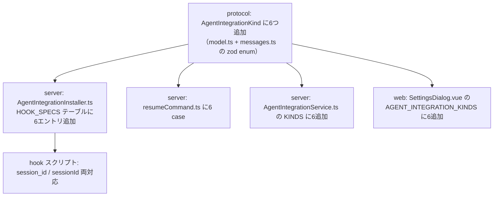
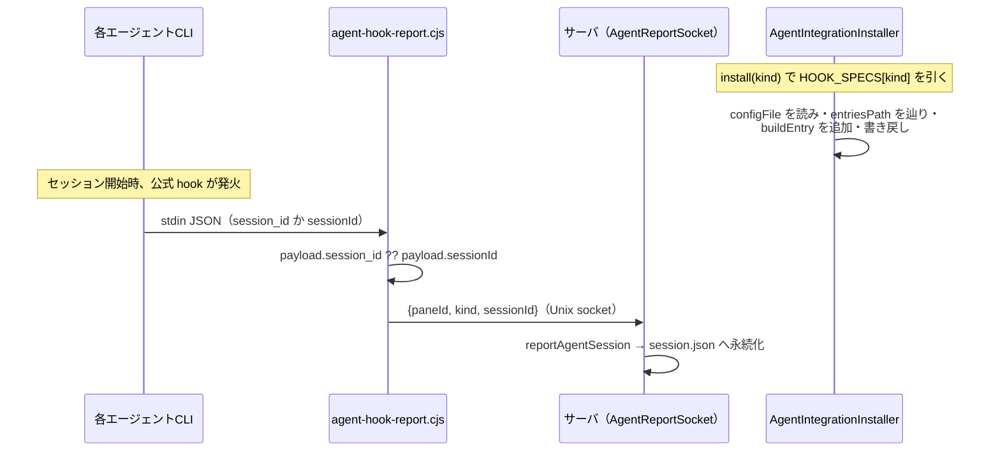

# レビューガイド: Claude Code・Codex 以外の6エージェントへセッション再開対応を広げる

## 変更概要 / 目的

既存の Claude Code・Codex 向けセッション再開機能（20260923-agent-session-resume）を、
Cursor Agent CLI・GitHub Copilot CLI・Devin CLI・Droid・Grok CLI・Qwen Code の6エージェントへ広げた。
herdr が resume 対応と記載する16エージェントのうち、実地調査（research.md F1・F4）で「公式に
`SessionStart` 相当の hook を持ち、その schema が確認できた」6つに絞り込んでいる。

## 重要ポイント

- **当初「機械的に拡張できる」と見積もっていたが、design 直前の再検証で覆った**（research.md
  F3→F4。decisions D3）。6エージェントは設定ファイルのトップレベル構造（`hooks.SessionStart` /
  `hooks.sessionStart` / トップレベル直下の `SessionStart`）・hook エントリの形（5パターン以上）が
  それぞれ異なり、単純な `pathsFor` の分岐拡張では吸収できなかった。
- **`HookSpec` インターフェースで吸収**（`AgentIntegrationInstaller.ts`）: 各 kind が
  `configFile`/`entriesPath`/`buildEntry`/`isOurs` を個別に持ち、汎用の `getPath`/`setPath` ヘルパーで
  ネストしたキー経路を辿る。既存の Claude Code・Codex もこの形へ移行したが、振る舞いは変えていない
  （既存テスト9件が無変更で通ることで確認）。
- **GitHub Copilot CLI・Grok CLI は「利用者の既存ファイルを読まず、専用ファイルを置く」方式**
  （`~/.copilot/hooks/wtm-agent-report.json` 等）。この2つはディレクトリ＋glob 形式の hook 設定
  （`~/.copilot/hooks/*.json`）で、マージ対象の唯一のファイルが定まらないため。
- **3回のスコープ絞り込みを経ている**（16→10→8→6。decisions D1〜D3）。特に D2・D3 は、
  「調査サブエージェントの報告を鵜呑みにせず、一次資料（各エージェントの公式ドキュメント）を
  直接 WebFetch/WebSearch で検証し直して、報告の誤り（Qoder CLI に実在しない hook）を実際に
  検出した」という経緯——`requirements.md` の非機能要件にも教訓として明記した。
- **6エージェントとも実機で動作確認できていない**（本開発環境に CLI 実体が無いため）。単体テストの
  範囲は「公式ドキュメントの記述どおりに設定ファイルへ書き込むか」までで、resume が実際に動くかは
  `docs/verification.md` の手動確認へ引き継いだ。Devin CLI だけは設定ファイルパス自体が
  ドキュメントに記載が無く、推測値（decisions D4）。
- **protocol 側の見落とし1件を coding 中に検出・修正**（decisions D5）: `messages.ts` の
  `agentIntegrationKind`（zod）が `model.ts` の `AgentIntegrationKind` とは別に
  `["claude","codex"]` をハードコードしており、design の「依拠する既存の事実」に含まれていなかった。
  `pnpm typecheck` の型エラーで発覚し、修正した。

## 処理フロー

## 主要な変更箇所

- `packages/protocol/src/model.ts:81` — `AgentIntegrationKind` の union。
- `packages/protocol/src/messages.ts:247` — `agentIntegrationKind`（zod。decisions D5）。
- `packages/server/src/agent/AgentIntegrationInstaller.ts` — `HookSpec`・`HOOK_SPECS`（全体を
  リファクタ。既存2 kind の移行を含む）。
- `packages/server/src/agent/resumeCommand.ts:20-40` — 6 case 追加。
- `packages/server/assets/agent-hook-report.cjs:40-45` — stdin フィールド名のフォールバック。
- `packages/web/src/components/SettingsDialog.vue:324-333` — `AGENT_INTEGRATION_KINDS` 配列。

## リスク / 確認したい点

- 6エージェントとも実機未検証（上記「重要ポイント」）。公式ドキュメントの記述が誤っている・
  将来変わる可能性は排除できない——利用者から実際に動かないという報告があれば、まず
  research.md F4 の該当エージェントの行を該当ドキュメントと突き合わせ直すのが最初の一手になる。
- Devin CLI の設定ファイルパスは推測値（decisions D4）。
- GitHub Copilot CLI・Grok CLI の「専用ファイルを置く」方式は、他の6 kind（利用者の既存ファイルへ
  マージ）と非対称——将来7つ目以降のエージェントを追加するとき、どちらの方式を選ぶかは
  そのエージェントの hook 設定がディレクトリ＋glob 形式かどうかで判断することになる。
