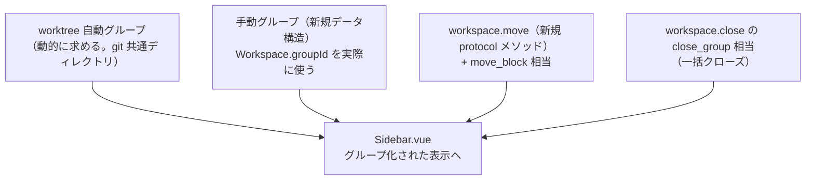

# 調査: workspace のグルーピングと並べ替え

> **出典の略記**: herdr ソースの該当行（コミット `da6bcd5969779bfe0396bcf89a8025d4375d611e`。
> `scratchpad/herdr` に `git clone --filter=blob:none` → 該当コミットを checkout して直読した。
> 過去の work（`20260918-web-terminal-multiplexer`・`20260921-keybinding-customization` 等）と
> 同じコミット・同じ取得手順）。本製品側は file:line で直接引用。

## 調査の問い

- Q1: 本製品には既にどんな土台があるか（`Workspace.groupId`・`tab.move`・`WorktreeService` 等）。
- Q2: herdr の Git worktree グループ化は自動か手動か。データ構造・可視化のルールは何か。
- Q3: herdr に「任意の束ね」（worktree に限らない手動グループ化）は存在するか。
- Q4: herdr の `workspace.move` の正確な形は何か。グループをまとめて動かす仕組みはあるか。
- Q5: herdr のグループの折りたたみ・グループを閉じる操作の仕組みはどうなっているか。

## 判明した事実

### F1: 本製品には既に土台がある（Q1）

- `packages/protocol/src/model.ts:26` に `Workspace.groupId: string | null` が既に定義されている。
  コメントは「後続『workspace のグルーピング』用に予約。MVP では常に null（decisions.md D6）」。
  `packages/protocol/src/` 全体を検索しても、`Group`/`WorkspaceGroup` に相当する型は他に存在しない
  （`groupId` という名前だけがあり、グループ自体の実体〔id・名前〕を表す型は無い）。
- `packages/server/src/session/SessionModel.ts:186,589` の2箇所（workspace 作成の経路）で、
  `groupId` は常に `null` を設定している。他に代入している箇所は無い。
- `tab.move`（`20260923-missing-keybinding-actions` で実装済み）は
  `packages/protocol/src/messages.ts:150-151,297,335`（`TabMoveParams`・`METHOD_SCHEMAS`・
  `MethodResultMap`）・`packages/server/src/session/SessionModel.ts:341`（`moveTab`）に存在する。
  **`workspace.move`/`moveWorkspace` に相当するものは存在しない**（protocol・server とも0件）。
- `packages/server/src/git/WorktreeService.ts:47-52`（`create(workspaceId, branch)`）は、
  元の workspace の `cwd` を読むだけで、作成した新しい workspace とその元 workspace を結び付ける
  情報は一切永続化していない（`workspace.create` を通常どおり呼ぶだけ）。
- `WorktreeService.ts:74-87`（`repoNameOf`）は `git rev-parse --git-common-dir` を実行し、
  `resolveCommonDir(cwd, common.stdout)` で絶対パスへ解決したうえで `repoNameFromGitCommonDir`
  （リポジトリ**名**だけを取り出す）を呼んで返す。**グループ化の判定キーには `repoNameOf` の
  戻り値（名前だけ）ではなく、`resolveCommonDir` が返す絶対パスそのものを再利用する必要がある**
  ——名前だけで同一判定すると、たまたま同じフォルダ名を持つ無関係な別リポジトリ（例: 別々の場所に
  ある2つの `backend` という名前のリポジトリ）を誤って同じグループに束ねてしまう（直接コードを
  読んで確認。`repoNameOf` は名前専用の既存の利用のされ方で、パス自体を返す関数はまだ無い——
  design で `resolveCommonDir` 相当をエクスポートするか、同等のロジックを新設する）。
- `packages/web/src/components/Sidebar.vue:29-41`（`spaces` computed）は完全なフラットリスト
  （`orderedWorkspaceIds` で並べ替えるだけ。グループ化・入れ子表示のロジックは無い）。
- `docs/herdr-parity.md` の該当行：H04（tab・workspace の並べ替え）は「後続:workspace の
  グルーピング」のまま——tab 側は実装済みなのに文書が古いまま（本 work で直す）。H21 の
  workspace 行の並びは「開いた順/名前順」の**ソートトグル**（`view.workspaceSort`）であり、
  本 work の「手動での並べ替え」とは別物。H37（worktree の作成・一覧）は済み。H37b
  （「Git worktree の削除とグループ化」）は未着手のまま——ただし backlog では「worktree の削除」は
  **別の行**として存在するため、本 work はグループ化の部分だけを対象にする。

### F2: herdr の Git worktree グループ化は完全に自動（Q2）

`herdr:src/workspace/git/discovery.rs:7-13,74-94` の `GitSpaceMetadata`：

```rust
pub struct GitSpaceMetadata {
    pub key: String,              // git の共通ディレクトリの正規化パス
    pub checkout_key: String,
    pub repo_name: String,        // .git の親ディレクトリ名（`.bare` の埋め込みリポジトリも考慮）
    pub repo_root: PathBuf,
    pub is_linked_worktree: bool,
}
```

`key` は `git rev-parse --git-common-dir` 相当で求めた正規化パス——**同じ `.git` 共通ディレクトリを
指す workspace は、`worktree.create` 経由で作ろうと単に `cd` して開こうと、自動的に同じ `key` を
持つ**。`herdr:src/workspace.rs:33-38,195` で `Workspace.worktree_space: Option<WorktreeSpaceMembership>`
としてこの情報を workspace 自身に持たせている。

**利用者が手動でグループを作る API・設定は存在しない**（`config/model.rs`・`client/shell/*.rs`・
`app/*.rs` を横断検索して0件）。

### F3: グループの可視化ルールと折りたたみ（Q2・Q5）

`herdr:src/client/shell/sidebar.rs:442-524`：同じ `key` を持つ workspace の集合は、**2人以上いて
かつ少なくとも1人が「非 linked（本体）」の checkout であるときだけ**視覚的なグループになる
（linked worktree が1つだけで本体が閉じられている場合等はグループ化されない）。本体（非 linked）が
先頭に「親」として（インデント無し）描画され、linked worktree はその下にインデントして描画される
（最後の子には木構造描画用のフラグが付く）。

折りたたみ状態は `collapsed_groups: HashSet<String>`（グループの `key` の集合）として、
**クライアント側の preferences に持つ**（`herdr:src/client/shell/preferences.rs:14,28`。サーバ側の
永続化ではない）。折りたたみ中でも、その中に focus 中の workspace があれば、その1行だけは
インデントされた状態で見える（`sidebar.rs:442-524` 内の分岐）。折りたたみの切り替えは
キーバインドではなく、クリックできる開閉アイコン（`▸`/`▾`）——`render_parent_group_toggle`
（`sidebar.rs:552-580`）が描画し、`context_menu.rs:283` で結線されている。

### F4: `workspace.move`・グループの一括移動・一括クローズ（Q4・Q5）

`herdr:src/api/schema/workspaces.rs:34-43`：

```rust
pub struct WorkspaceMoveParams {
    pub workspace_id: String,
    pub insert_index: usize,
}
pub struct WorkspaceMoveBlockParams {
    pub workspace_ids: Vec<String>,
    pub before_workspace_id: Option<String>,  // None なら末尾へ
}
pub struct WorkspaceCloseParams {
    pub workspace_id: String,
    pub close_group: bool,
}
```

- `WorkspaceMoveParams`：単一 workspace を `insert_index` の位置へ移動する（`tab.move` 以前の
  herdr 側の古い形——`tab.move` は既に `{tabId, direction}` という本製品独自の簡略形へ置き換え済み
  だが、`workspace.move` にはまだ対応する本製品側のメソッドが無い）。
- `WorkspaceMoveBlockParams`：**複数の workspace ID を、指定した anchor（`before_workspace_id`）の
  前へ、まとめて・順序を保ったまま移動する**。これが「グループを1つの単位として動かす」を実現する
  実際の仕組み——グループの親＋子をまとめて1回の呼び出しで動かせる。
- `WorkspaceCloseParams.close_group`：`true` なら、その workspace が worktree グループの親（本体）
  であるとき、束ねられた worktree も連鎖して閉じる。

サーバから各クライアントへ配布される情報（`herdr:src/api/schema/workspaces.rs:78-84`）：

```rust
pub struct WorkspaceWorktreeInfo {
    pub repo_key: String,
    pub repo_name: String,
    pub repo_root: String,
    pub checkout_path: String,
    pub is_linked_worktree: bool,
}
```

workspace のスナップショット・`workspace.list` にこの情報が添えられる——**クライアント側では
「同じ `repo_key` を持つ workspace をグループとして表示するだけ」で、グループの作成・削除という
概念自体がサーバ側にも無い**（あくまで動的に求まる関係性）。

## 影響範囲



- **変える**: `packages/protocol/src/model.ts`（`Workspace.groupId` を実際に使う。手動グループの
  実体を表す新しい型が要る）・`packages/protocol/src/messages.ts`（`workspace.move`・
  グループ関連の新規メソッド）・`packages/server/src/session/SessionModel.ts`・
  `SessionService.ts`（グループの状態管理・`moveWorkspace`）・`packages/server/src/git/
  WorktreeService.ts`（Git 共通ディレクトリの算出をワークスペース単位で再利用できるようにする）・
  `packages/web/src/components/Sidebar.vue`（グループ化された表示・D&D）・`docs/herdr-parity.md`
  （H04・H37・H37b の更新）。
- **変えない見込み**（design で最終確認）: 既存の workspace 作成・削除・切り替え・`view.workspaceSort`
  ソートトグル自体のロジック。

## 実現性 / リスク

- 実現性は高い。worktree 自動グループの判定材料（git 共通ディレクトリ）は
  `WorktreeService.repoNameOf` に既に実装があり、再利用できる。`Workspace.groupId` という
  予約フィールドがあるおかげで、手動グループの「所属」自体はデータモデルの変更が小さく済む。
- リスク R1: **手動グループと worktree 自動グループが重なったときの表示**——同じ workspace が
  理論上どちらの対象にもなりうる（worktree でありながら手動グループにも入れられる）。herdr には
  この重なりの概念自体が無い（herdr は自動グループしか持たない）ため参考にできない。design で
  独自に決める必要がある。
- リスク R2: `workspace.move` の params の形——D&D（anchor 指定が自然）とキーバインド（delta 指定が
  自然）の両方を1つの protocol メソッドでどう表現するか。`tab.move` の `{tabId, direction}` を
  そのまま踏襲すると D&D の「任意の位置へ」を表現しづらい（delta では届かない距離がある）。
  herdr の `insert_index` 方式に寄せるか、専用の別メソッドを2つ持つかは design で検討する。
- リスク R3: グループの一括移動（`WorkspaceMoveBlockParams` 相当）を D&D でどう発火させるか
  （グループのヘッダー行をつかむとメンバー全員が付いてくる、という UI の実装）。
  `20260923-pane-name-dnd-swap` で確立したポインタドラッグの流儀（`pointerdown`→`setPointerCapture`
  →`pointermove`→`pointerup`）を踏襲しつつ、「複数要素をまとめて動かす」表現は同 work には無かった
  新しい要素——design で具体化する。

## design への申し送り

- 手動グループの実体を表す新しいデータ構造（id・名前・メンバー一覧の持ち方）を design で確定する。
  `Workspace.groupId`（単一の所属先）で足りるか、それとも複数グループへの所属を許すかも合わせて
  決める（requirements は「任意の workspace を追加・削除できる」とだけ述べ、複数グループへの
  同時所属の可否までは決めていない）。
- worktree 自動グループと手動グループが重なったときの表示（R1）を設計する。
- `workspace.move` の protocol 形（R2）を確定する。
- グループの一括移動（R3）・一括クローズの UI 動線を具体化する。
- 「開いた順」「名前順」の既存ソートトグルと、グループ自体の並び順・グループ内の並び順の関係を
  設計する（グループが常にトグルより優先されるか等）。
