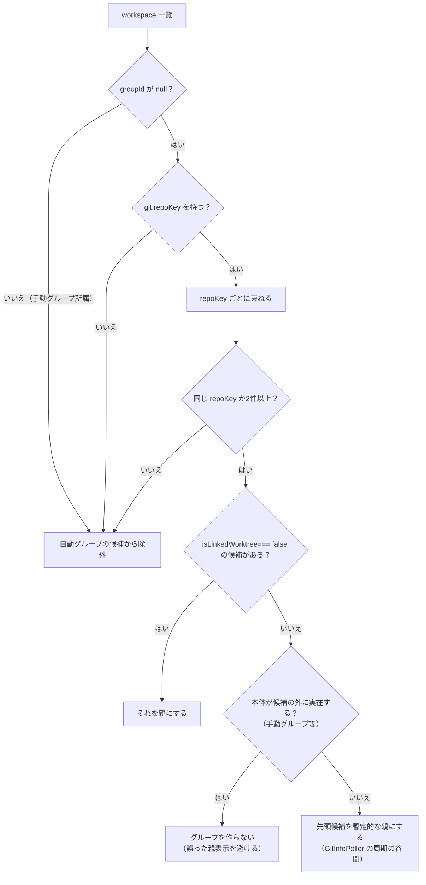
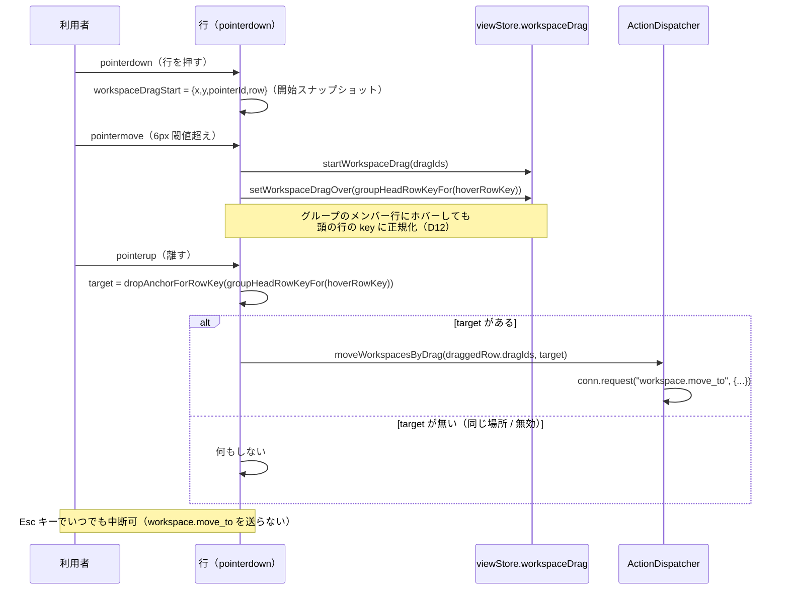

# レビューガイド: workspace のグルーピングと並べ替え

## 変更概要 / 目的

herdr パリティの一環として、workspace のサイドバー表示に「グループ」を導入する。

1. **worktree 自動グループ**（動的・herdr 前例あり）: 同じ git リポジトリ（`repoKey` が同じ）の
   worktree を自動的に束ねて表示する。
2. **手動named グループ**（herdr に前例が無い独自拡張。decisions D1）: 利用者が任意の workspace を
   自由に名前付きグループへまとめられる。
3. **D&D + キーバインドでの並べ替え**（decisions D3）: workspace の並び順自体をミュータブルにし、
   ドラッグ操作とキーバインドの両方で並べ替えられるようにする。

`requirements.md`/`design.md` に AC1〜AC11・AC-I1〜AC-I5 として定義。実装は
`packages/protocol`（スキーマ・イベント）・`packages/server`（session model・RPC・永続化）・
`packages/web`（サイドバー描画・D&D 状態機械・キーバインド）の3層にまたがる。

## 重要ポイント

- **サーバ/クライアントの二重実装**: 「どの workspace が worktree 自動グループを構成するか」の
  判定ロジックは、サーバ（`SessionModel.linkedWorktreeGroupMembers`）とクライアント
  （`workspaceGrouping.ts` の `autoGroupsOf`）で別々に実装している（別ランタイムなので
  TypeScript モジュールを共有できない）。cross-check で2ラウンド、この二重実装の食い違い
  （フォールバック親の判定条件の一部移植漏れ）が見つかり修正済み（`review.md`「タスク点検ログ」・
  `decisions.md` 参照）。**レビューではこの2つの実装が今も一致しているかを重点的に見てほしい。**
- **サーバ権威のトグル**（decisions D10）: グループの折りたたみは `group.toggle_collapsed
  {groupId}`（値を渡さずサーバに反転させる）。`pane.zoom` の `mode: "toggle"` と同じ流儀。
  クライアント側で `!collapsed` を計算する方式だと連続クリックで競合するため、この形に変更した。
- **`workspace.order_changed` イベント**（decisions D5）: `Map.set` は既存キーの位置を変えないため、
  並べ替え結果を配布するのに専用イベント（`workspaceIds: string[]` で新しい全順序を運ぶ）が要った。
- **行の一意性（`row.key`）と RPC アンカー（`dropAnchorId`）の分離**: 手動グループのヘッダー行と
  その先頭メンバー行は同じ `dropAnchorId`（workspace id）を持ちうる。ホバー中の行の特定には
  常に一意な `row.key`（`group:<id>` または workspace id）を使い、`dropAnchorId` は
  RPC を組み立てる最後の瞬間にしか使わない（taskcheck で発見・修正）。
- **review 工程で見つかった must/should 2件**（このラウンドで修正済み。詳細は
  `review.md`「レビュー（review 工程）」・`decisions.md` D11・D12）:
  - **must**: `Sidebar.vue` がグループをブロック単位でまとめる描画に切り替わったのに、
    `ActionDispatcher.workspaceDelta`/`navigate` が旧来の素の順序のままだった回帰。
    `visibleWorkspaceIdsInOrder`（共有純関数）に統一して解消。
  - **should**: グループの頭以外のメンバー行へのドロップが、ハイライトと実際の効果で
    食い違っていた。`groupHeadRowKeyFor` による正規化で解消。
- **未修正で backlog へ送った1件**（decisions D13）: キーバインドでの並べ替え（AC8）は
  flat な隣接1件だけを入れ替える単純な実装で、手動グループの非アンカーメンバーを動かすと
  画面上は無反応に見える edge case が残る。D&D 側は直したが、キーバインド側の是正は
  `workspace.move` の protocol 設計変更を要するため、このレビューの範囲では見送った。

## 処理フロー

### worktree 自動グループの判定（サーバ/クライアント共通の考え方）

### D&D（`Sidebar.vue`）の状態機械

## 主要な変更箇所

- `packages/protocol/src/model.ts:WorkspaceGroup` — グループ型の新設。`GitInfo.repoKey`/
  `isLinkedWorktree` の追加。
- `packages/protocol/src/messages.ts` — `workspace.move`/`workspace.move_to`・`group.*` の
  RPC スキーマ。
- `packages/server/src/session/SessionModel.ts:467`（`moveWorkspace`）/`:487`
  （`moveWorkspacesTo`）/ `linkedWorktreeGroupMembers` — 並べ替え・グループ CRUD・自動グループ判定。
- `packages/server/src/session/SessionService.ts` — `sameGit()` の比較項目に `repoKey`/
  `isLinkedWorktree` を追加した点が要注意（taskcheck で発見。ここが漏れていると
  `workspace.updated` の配布自体が止まる）。
- `packages/server/src/surface/methods/group.ts`（新規） — `group.*` RPC の結線層。
- `packages/web/src/store/workspaceGrouping.ts`（新規） — `autoGroupsOf`/`manualGroupsOf`/
  `groupedWorkspaceRows`/`visibleGroupMembers`/`visibleWorkspaceIdsInOrder`（後の2つは
  review round1 で追加）。
- `packages/web/src/components/Sidebar.vue` — `spaces` computed の全面書き換え・D&D
  ポインタイベント一式（`onRowPointerDown/Move/Up/Cancel`）・`groupHeadRowKeyFor`
  （review round1 で追加）。
- `packages/web/src/actions/ActionDispatcher.ts` — `moveWorkspace`/`moveWorkspacesByDrag`・
  手動グループの CRUD アクション一式・`workspaceDelta`/`navigate`（review round1 で
  `visibleWorkspaceIdsInOrder` に切り替え）。

## リスク / 確認したい点

- **サーバ/クライアントの二重実装が今後の変更で再び乖離しないか**——`autoGroupsOf` と
  `linkedWorktreeGroupMembers` は将来どちらか一方だけ変更されるリスクが構造的に残る
  （TypeScript を共有できない2ランタイムのため）。テストは両方に揃えてあるが、レビューでも
  両者を並べて確認してほしい。
- **backlog へ送った AC8 の edge case**（decisions D13）——優先度・対応時期の判断を仰ぎたい。
  影響範囲は狭い（手動グループの非アンカーメンバー×キーバインド操作×特定の flat 配置）が、
  design.md の概要文言（「グループはまとまりを保ったまま」）とは厳密には整合しない。
- **多クライアント同時操作でのグループ操作の競合**は unit/integration レベル（同一
  `SessionService` インスタンスへの2連続呼び出し）でしか確認しておらず、実際に2ブラウザを
  起動しての目視確認はしていない（`test-result.md`「未検証の穴」）。
