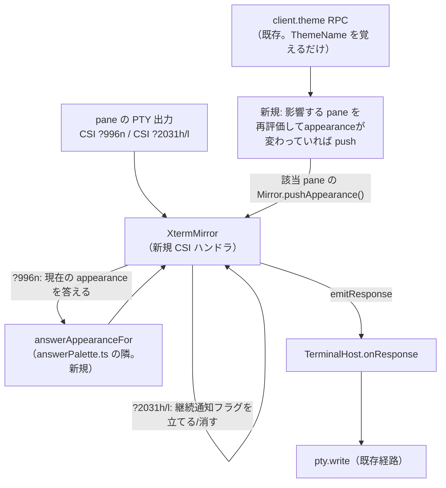

# 調査: 明暗の変化を端末の中のアプリへ知らせる（DSR 996/mode 2031）

## 調査の問い

- Q1: xterm.js（headless。`Mirror` が使う）は、CSI（`ESC [ ... final`）の私用シーケンス
  （prefix `?`）をフックする API を持つか。OSC ハンドラ（既存実装）と同じ形で使えるか。
- Q2: 「その pane が今どちらの明暗で見られているか」を決める既存の仕組みはあるか
  （requirements の未確定事項）。
- Q3: 応答（クエリへの返答）は既存のどの経路で PTY へ書き戻されるか。**自発的な通知**
  （クエリ無しで送る）も同じ経路が使えるか。
- Q4: 継続通知（mode 2031）の状態はどこに持たせるのが自然か（pane ごとの独立性・pane 破棄時の
  後始末＝AC4・AC5）。
- Q5: 「明暗が変わった」をいつ検知して通知を送ればよいか（何がトリガーになりうるか）。

## 判明した事実

- F1: **xterm.js headless の `IParser.registerCsiHandler(id, callback)` は既存の
  `registerOscHandler` と対になる CSI 用 API**（`node_modules/.pnpm/@xterm+headless@6.0.0/
  node_modules/@xterm/headless/typings/xterm-headless.d.ts:1242`）。
  `id: IFunctionIdentifier = { prefix?, intermediates?, final }`（同ファイル:1208-1223）。
  `prefix` は CSI/DCS で使える私用開始バイト（`\x3c`〜`\x3f`。`?` はこの範囲）。callback は
  `(params: (number | number[])[]) => boolean` を受け取り、**`false` を返すと「より前に
  登録されたハンドラを試す」**（同:1231-1238。「最後に登録したものが最初に試される」）。
  `CSI ? 996 n` は `{ prefix: "?", final: "n" }` で登録し `params[0] === 996` を見る形、
  `CSI ? 2031 h`/`CSI ? 2031 l` は `{ prefix: "?", final: "h" }`/`{ prefix: "?", final: "l" }`
  で登録し `params[0] === 2031` を見る形になる。
- F2: **既存の `Mirror.ts`（`packages/server/src/terminal/Mirror.ts:68-94`）が、まさにこの
  「headless の既定応答（DA1・DA2・CPR・DECRQM・DECRQSS）に加えて、色の問い合わせ
  （OSC 4/10/11/12）には headless が応答しないので独自ハンドラで応答する」という構造を
  既に実装している**（コメント:68, 72）。`registerOscHandler` で `data !== "?"` なら
  `false` を返して関与しない（クエリ以外の OSC は素通しする。`handleColorQuery`:162-166）という
  形が既に確立している——`registerCsiHandler` でも同じ形（対象の `Ps` 以外は `false` を返す）が
  自然に踏襲できる。
- F3: **私用 CSI の `prefix: "?"` は、prefix 無し（標準の CPR 等）とは別の関数識別子スロットに
  登録される**（F1 の型定義どおり。`{final:"n"}`〔prefix 無し〕と `{prefix:"?", final:"n"}`
  は別物）ため、既存の headless 標準応答（CPR＝`CSI 6n`・DSR＝`CSI 5n` 等、prefix 無し）とは
  衝突しない。`{prefix:"?", final:"h"}`/`{prefix:"?", final:"l"}`（DECSET/DECRST 私用モード全般）
  は、xterm.js が他の私用モード（カーソル可視化 mode 25・bracketed paste mode 2004 等）向けに
  内部で処理している可能性があるが、F1 の「最後に登録したものが最初に試され、`false` なら
  前のハンドラへ委譲する」仕組みにより、`Ps !== 2031` のときに `false` を返せば既存の処理に
  委譲される——衝突しない（未検証：headless が mode 2031 自体に何らかの組み込み処理を
  既に持っていないかは、実装時に `Terminal` のソース／実機動作で最終確認する）。
- F4: **「その pane が今どちらの明暗で見られているか」を決める、ほぼ同じ形の既存の仕組みが
  既にある**（`packages/server/src/clients/answerPalette.ts` 全体。20260921-theme-settings の
  design D6）。`answerPaletteFor(paneId, deps): TerminalPalette` は次の優先順位で解決する
  （同ファイル:20-31 のコメントがそのまま仕様）:
  1. その pane の tab のサイズを決めているクライアント（`Tab.sizeOwnerClientId`）が伝えた
     テーマ（`client.theme`）。
  2. いなければ、その tab を表示している（`ClientRecord.view.tabId` が一致）クライアントのうち
     `lastActedAt` が最新のもの。
  3. それも無ければ、テーマを伝えた全クライアントのうち `lastActedAt` が最新のもの。
  4. それも無ければ既定（`DEFAULT_THEME`）。
  **この関数は `ThemeName` を解決してから `TERMINAL_PALETTES[name]`（色）を引いているのではなく、
  各段階で直接 `TERMINAL_PALETTES[owner.theme]` 等を返しており、「解決した `ThemeName` そのもの」
  は関数の外に出てこない**（`answerPalette.ts:38,40,43`）——appearance（light/dark）を得るには、
  同じ優先順位で `ThemeName` を解決してから `THEME_APPEARANCE[name]`
  （`packages/protocol/src/theme.ts:39-56`）を引く必要があり、現状の `answerPaletteFor` を
  そのまま呼び出すだけでは得られない（design で「解決した `ThemeName` を返す」形にリファクタ
  するか、同じロジックを複製するかの判断が要る）。
- F5: **`ClientRecord.theme: ThemeName | null`**（`packages/server/src/clients/
  ClientRegistry.ts:29-33`）は `client.theme` RPC（`packages/server/src/surface/methods/
  client.ts:34-40`）で更新される。**現状このハンドラは「覚えるだけ（保存も配布もしない）」**
  （同ファイル:36 のコメント）——色の問い合わせに答える瞬間に `answerPalette.ts` が pull 型で
  引くだけで、push（自発的な通知）は存在しない。この work の「継続通知」（AC2）は、
  この pull 専用の仕組みに push を追加する初めてのケースになる。
- F6: **応答の書き戻し経路は確立済み**（`Mirror.onResponse(cb)` → `TerminalHost.ts:66`
  `this.disposables.push(this.mirror.onResponse((data) => this.pty.write(data)))`）。
  `Mirror` 内部で `emitResponse(data)`（`Mirror.ts:158-160`）を呼べば、クエリへの応答か
  自発的な通知かを問わず同じ経路で PTY へ届く——**mode 2031 が有効なときに `emitResponse` を
  呼ぶだけの新しいメソッド（例: `pushAppearance`）を `Mirror`/`XtermMirror` に足せば、
  クエリ不要の自発的な通知が既存の経路にそのまま乗る**。
- F7: **`TerminalManager.get(paneId): TerminalHost | undefined`（`TerminalManager.ts:16,36-37`）
  は `surface/methods/*.ts` の `MethodDeps.terminals` から既に到達可能**
  （`packages/server/src/surface/methods/deps.ts:9-16`）。`client.ts` のハンドラ
  （`client.theme` 等）から `deps.terminals.get(paneId)` で `TerminalHost`（→`.mirror`）に
  届く。`deps.session.snapshot()` で全 pane（`Pane[]`。各 `pane.tabId`）を列挙できる
  （既存の `SessionService.snapshot()`。過去の work で使用実績あり）。
- F8: **pane ごとに `Mirror`/`TerminalHost` インスタンスが1つ**（`TerminalManager.hosts: Map<PaneId,
  TerminalHost>`。`TerminalManager.ts:23`）。継続通知の状態（mode 2031 の有効/無効）を
  `Mirror` インスタンス自身に持たせれば、pane ごとの独立性（AC5）と、pane 破棄時の自動解放
  （AC4。`TerminalHost.dispose()`→`Mirror.dispose()`が既存の disposables を片付ける経路に
  自然に乗る——新しい後始末コードを足す必要が無い）の両方が既存の構造だけで満たせる。

## 影響範囲

- 変更が波及するファイル: `packages/server/src/terminal/Mirror.ts`（CSI ハンドラ2種・
  `pushAppearance` メソッド・mode 2031 の状態）／`packages/server/src/clients/
  answerPalette.ts`（`ThemeName` 解決を appearance と palette で共有する形にリファクタ、
  または `answerAppearanceFor` を新設）／`packages/server/src/surface/methods/client.ts`
  （`client.theme` ハンドラに push トリガーを追加）／`packages/protocol/src/theme.ts`
  （`THEME_APPEARANCE` は既存・変更不要）。
- 影響しない（既存のまま）: `TerminalHost.ts`（`onResponse`→`pty.write` の経路は変更不要。
  `Mirror` インターフェースへの新メソッド追加だけで済む見込み）・`OutputFanout.ts`・
  クライアント側（`packages/web`）は変更不要と見込まれる（appearance の解決は完全にサーバ側
  で完結し、新しいクライアント→サーバの情報伝達は要らない——既存の `client.theme` で足りる）。

## 実現性 / リスク

- 技術的に可能。既存の `registerOscHandler`/`answerPaletteFor`/`onResponse` の3つの確立した
  パターンを、CSI 版・appearance 版に横展開するだけで実現でき、新しい依存（ライブラリ）も
  新しいクライアント→サーバの通信路も要らない。
- リスク: **push のトリガー範囲が未確定**（design への申し送り）。`answerPaletteFor`/
  `answerAppearanceFor` の解決結果は `client.theme` だけでなく、`Tab.sizeOwnerClientId` の
  変化（`SizeAuthority.onViewChanged`/`onFitChanged` 等、既存の別の仕組み）・`ClientRecord.view`
  の変化（`client.view` RPC）でも変わりうる。全てのトリガーを網羅すると影響箇所が広がり、
  `client.theme` だけをトリガーにすると「テーマは変えていないが、tab の表示者が変わって
  appearance が変わった」ケースを見逃す。design で対応範囲を明示的に決める必要がある
  （**未検証**：headless の mode 2031 に対する既存の組み込み挙動。F3 参照）。
- リスク: **複数 pane への再評価コスト**。`client.theme` 1回の変更で、影響しうる全 pane
  （その client が sizeOwner／viewer／全体の勝者になっている全て）を毎回洗い出すと、
  pane 数に比例した計算になる。既存の `answerPaletteFor` は「1 pane につき呼ばれたときだけ
  計算する」pull 型なので、この計算コストの問題が今まで存在しなかった。pane 数の規模
  （既存 work で確認済み: 最低 16 pane を想定）では実害は無いと見込まれるが、design で
  一言触れておく。

## 実装アンカー

- A1: CSI ハンドラの追加（`packages/server/src/terminal/Mirror.ts:68-94` の並び。
  `registerOscHandler` の登録が並ぶ constructor 内）。
- A2: `pushAppearance`（仮称）メソッドの追加（`Mirror` interface:26-38・`XtermMirror` クラス。
  `emitResponse`:158-160 を再利用）。
- A3: `answerAppearanceFor`（新設。`packages/server/src/clients/answerPalette.ts` に
  `answerPaletteFor` と対で置くのが自然。共有ロジックへのリファクタも含めて design で決める）。
- A4: `client.theme` ハンドラへの push トリガー追加（`packages/server/src/surface/methods/
  client.ts:34-40`）。
- A5: `THEME_APPEARANCE`（`packages/protocol/src/theme.ts:39-56`）は既存・変更不要
  （そのまま参照する）。

## 実装時の注意

- **`Mirror.write` に投げてはならない**という既存の制約（`Mirror.ts:56` のコメント）は
  OSC/DSR ハンドラ内の話で、`emitResponse`/新設の `pushAppearance` には直接は関係しないが、
  同じ「headless は try/catch で囲わない」前提はハンドラ全般に及ぶ——新しい CSI ハンドラも
  投げない実装にする。
- **`answerPaletteFor` を変更するなら、既存の `answerPalette.test.ts` の期待を壊さないこと**
  （優先順位の4段階の意味は変えず、`ThemeName` を返す中間関数を切り出す形にリファクタする
  想定）。
- **`Ps` が `996`/`2031` 以外のときは必ず `false` を返す**（F1・F3）。既存の他の私用シーケンス
  （bracketed paste 等）を壊さないための唯一の防御線。

## design への申し送り

- 未確定事項（requirements.md）への回答材料:
  - 複数クライアントが同じ pane を別々のテーマで見ている場合にどちらを基準にするかは、
    **既存の `answerPaletteFor` と同じ優先順位（sizeOwner→最新の viewer→最新の全体）を
    そのまま appearance にも適用するのが最も一貫性がある**（F4）——色の問い合わせと明暗の
    問い合わせで別の基準を使う理由が無い。
  - CSI ハンドラの登録は `registerCsiHandler`（F1）を使う。`{prefix:"?", final:"n"}`・
    `{prefix:"?", final:"h"}`・`{prefix:"?", final:"l"}` の3種。
- push のトリガー範囲（実現性 / リスク参照）は design で明示的に決める。最小の対応
  （`client.theme` だけをトリガーにする）でも AC2 の文言（「利用者が設定を切り替える・OS の
  自動切替で変わる等」）は満たせる——OS の自動切替も、既存のクライアント側の `themeAuto`
  （`20260921-theme-settings`）が解決した結果を `client.theme` で送る既存経路に乗るはず
  （未確認。design で `20260921-theme-settings` の実装を確認する）。sizeOwner/view の変化も
  トリガーに含めるかは、スコープと実装コストを比較して design で判断する。
