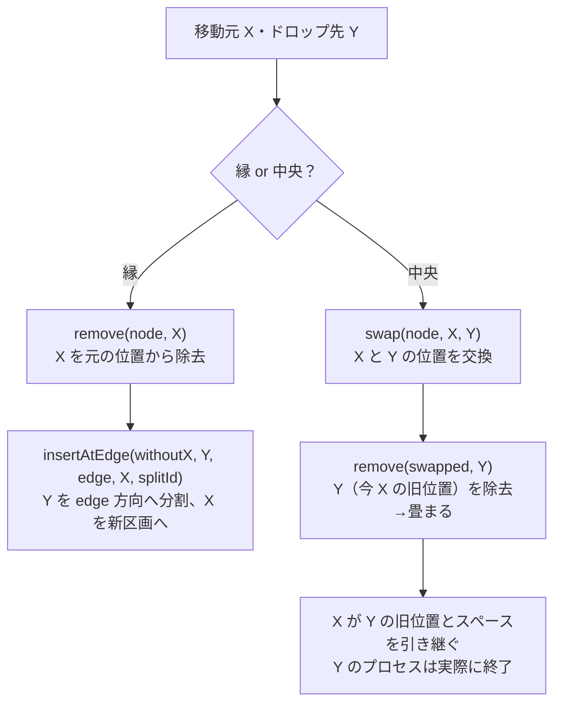
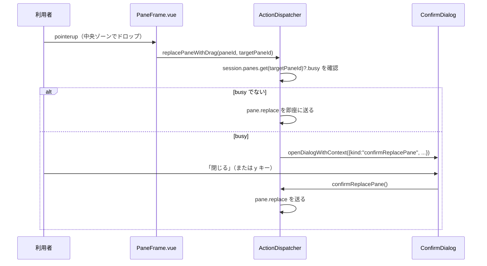

# レビューガイド: D&D による pane の分割・分割解除

## 変更概要 / 目的

`20260923-pane-name-dnd-swap` が確立した「pane の名前ラベルをドラッグする」操作を拡張し、
ドロップ先の pane 内のどこ（縁 or 中央）へ落としたかで結果を変える。

- **縁**（上/下/左/右）へドロップ: ドロップ先の pane をその方向へ分割し、ドラッグした pane が
  新しい区画に入る（新しい pane は作らない）。
- **中央**へドロップ: ドロップ先の pane を閉じ、ドラッグした pane がそのスペースを引き継ぐ
  （分割の解除。プロセスを実際に終了させる破壊的操作）。

いずれの操作でも、ドラッグした pane の元の位置の split は自動的に畳まれる。

## 重要ポイント

- **既存の「ドロップ先を問わず入れ替え」を意図的に置き換えた**（decisions.md D4）。縁/中央の
  2ゾーンに「分割」「分割解除」の2つの結果を割り当てると、`20260923-pane-name-dnd-swap` の
  「常に安全な入れ替え」という3つ目の結果を同じジェスチャの中に共存させる余地が無い。安全な
  操作（入れ替え）を破壊的操作（分割解除。プロセスを実際に終了させる）へ暗黙に置き換える
  トレードオフであり、requirements.md（AC11）と decisions.md（D4）にこの判断の経緯を明記した。
- **review 工程で must 1件を発見・修正**: 中央ドロップ（分割解除）が、ドロップ先が busy
  （動作中）でも確認なしに即座にプロセスを終了させていた。既存の `closePaneById`/`closeTabById`
  が持つ busy pane 確認（D23）と同じパターンで、`ConfirmDialog.vue` を拡張して塞いだ
  （`view.ts` に `confirmReplacePane` dialog context を追加）。
- **サーバ側のレイアウト操作は新規純関数1つだけ**（`LayoutTree.insertAtEdge`）で表現する。
  「分割解除」は既存の `swap`+`remove` の組み合わせで表現でき、新規関数は不要だった
  （research.md F5。机上で手計算し、実装後にユニットテストで裏付けた）。
- **クライアントのドラッグ機構は既存パターンをそのまま拡張**（Pointer Events・6px 閾値・
  Esc/ダイアログ/自消失での後始末。`20260923-pane-name-dnd-swap` から一切作り直していない）。
  新しいのはゾーン判定（`paneDragZone.ts`）と、ゾーンに応じた RPC の出し分けだけ。
- **cross-check で発見し、意図的に今回は直さなかったギャップ**（decisions.md D5）:
  複数クライアントが同じ tab を見ているとき、他クライアントの分割解除でちょうど消える pane に
  自分がローカルで focus していた場合、focus の復帰先（`viewRepair.ts` の「最初の葉」規則）が
  `replacePane` の実際の後継（ドラッグした pane 自身）とずれることがある。修正には protocol への
  「推奨後継」ヒント追加が必要で本 work の範囲を超えるため、backlog へ送った。

## 処理フロー

### レイアウト操作（サーバ側の考え方）

### ドロップ確定（クライアント側。busy 確認込み）

## 主要な変更箇所

- `packages/server/src/session/LayoutTree.ts` — `insertAtEdge`（新規純関数。4方向対応）。
- `packages/server/src/session/SessionModel.ts` — `moveToEdge`/`replacePane`。
- `packages/server/src/session/SessionService.ts` — 上記のイベント配布（`layout.updated`・
  `replacePane` は `pane.closed` も）。
- `packages/web/src/term/paneDragZone.ts`（新規） — `zoneAt`（ゾーン判定の純関数）。
- `packages/web/src/components/PaneFrame.vue` — ゾーン判定の呼び出し・視覚フィードバック
  （縁=水色、中央=赤系で区別）・ドロップ確定時の RPC 出し分け。
- `packages/web/src/actions/ActionDispatcher.ts:545` — `replacePaneWithDrag`（busy 確認込み）・
  `confirmReplacePane`。`swapPanesByDrag`（旧機能）は削除。
- `packages/web/src/components/ConfirmDialog.vue` — `confirmReplacePane` dialog context 対応。

## リスク / 確認したい点

- **decisions.md D4 のトレードオフ**（安全な入れ替え → 破壊的な分割解除ジェスチャへの置き換え）に
  ついて、review の独立点検は「busy pane 確認を足せば正当化できる」と判断し、その確認を実装した。
  この判断に異論があれば伺いたい。
- ゾーンのしきい値（縁30%・中央40%×40%）は VS Code のエディタ分割を参考にした推定値で、
  一次資料での検証はしていない（research.md F18）。実際に触って狭い/広いと感じる場合は
  調整の余地がある。
- 複数クライアント同時操作（AC10）・ゾーンオーバーレイの実ブラウザでの見た目は、jsdom 上の
  イベント合成でのみ確認しており、実ブラウザでの目視確認はしていない（test-result.md「未検証の穴」）。
