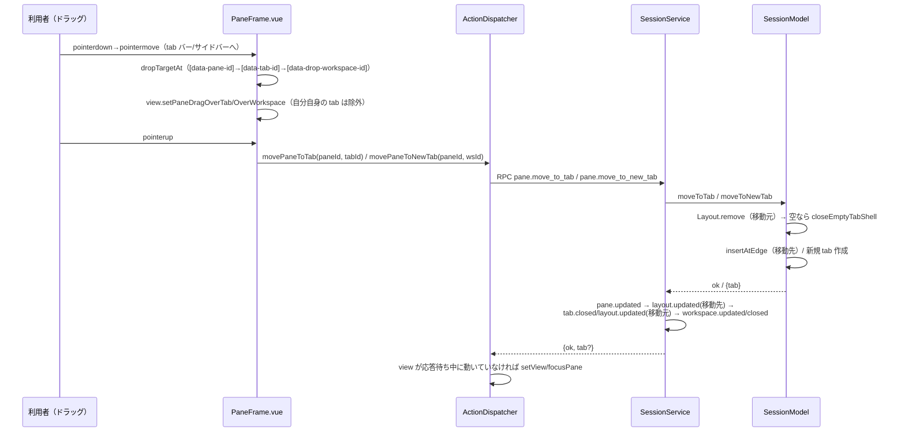

# レビューガイド: D&D による pane の別 tab・別 workspace への移動

## 変更概要 / 目的

pane の名前ラベルのドラッグ先を、既存の「同一 tab 内の pane（縁=分割・中央=分割解除）」
（`20260924-pane-dnd-split-move`）から、tab バーの既存 tab・サイドバーの workspace 行にも
広げる。tab バーの tab へドロップすると、その pane が対象 tab の focus 中の pane の右へ split
で入る。サイドバーの workspace 行へドロップすると、その workspace に新しい tab が作られ、
そこへ pane が移る。いずれもプロセスは一切終了させず（busy 確認は不要）、移動元の tab は
空になれば自動的に閉じる。

## 重要ポイント

- **`closeEmptyTabShell`（新規・private）**: 既存の `closeTabInternal`（pane を削除する）を
  移動の後始末に流用すると、移動中の pane 自体を消してしまう（research.md R1）。「pane を
  保持したまま tab の器だけを消す」専用の変種を用意した。
- **D3（decisions.md）**: `SessionService.moveToTab`/`moveToNewTab` は `pane.updated`
  （移動した pane 自身。新しい `tabId` を含む）を必ず1回発行する。design.md は当初これを
  挙げていなかったが、coding 中に `layout.updated` が `Tab` レコードしか運ばないこと
  （`StoreAdapter.ts`）、クライアント側の `viewRepair.ts`/`ActionDispatcher.closeTabById` が
  `pane.tabId` を直接参照していることに気付き、design を修正した。
- **D2（decisions.md）**: `view.setView`/`focusPane`・`registry.focus` は `PaneFrame.vue` では
  なく `ActionDispatcher` 側（RPC の応答を待ってから）で呼ぶ。`movePaneToNewTab` は新しい
  tab の id が応答まで分からないため、`movePaneToTab` も同じ形に揃えた。
- **review round1 の should 指摘への対応**: RPC の往復の間にユーザーが既に別の tab/workspace
  へ移っていた場合、応答到着時に強制的に元の移動先へ視点を引き戻さないよう、RPC 発行時点の
  `view.workspaceId`/`tabId` を控えて比較するガードを追加した。
- **D4（decisions.md）**: `moveToTab`/`moveToNewTab` はセッション全体のグローバル focus
  （`this.focus`）を更新しない。`moveToEdge`/`replacePane`（前回作業）と同じ既存の切り分け
  （レイアウトだけを書き換える操作は `tab.focusedPaneId` のみ更新）に従う判断で、この work
  では変更を見送った（review round1 の nit）。

## 処理フロー

## 主要な変更箇所

- `packages/server/src/session/SessionModel.ts:closeEmptyTabShell/moveToTab/moveToNewTab` —
  レイアウト操作の本体（research.md R1 の落とし穴を避けた変種）。
- `packages/server/src/session/SessionService.ts:moveToTab/moveToNewTab` — イベント配布
  （D3 で `pane.updated` を追加）。3分岐（移動元生存／tab閉鎖・workspace生存／
  workspace連鎖閉鎖〔D18〕）をテストで個別に確認。
- `packages/web/src/components/PaneFrame.vue:dropTargetAt` — 3種のドロップ先を優先順位付きで
  探す `DropHit` 判別共用体。
- `packages/web/src/actions/ActionDispatcher.ts:movePaneToTab/movePaneToNewTab` — RPC 応答後の
  view 切り替え（D2）＋応答待ち中の view 競合ガード（review round1 対応）。

## リスク / 確認したい点

- **AC10（複数クライアント同期）は EventBus のイベント配布を単体テストで確認したのみ**で、
  実ブラウザでの複数タブ・複数接続の目視確認は行っていない（test-result.md「未検証の穴」）。
- **D4 で見送った `this.focus` の非更新**は、ローカル保存 view の無い新規クライアントが移動
  直後に再接続すると、移動先ではなく元の focus が指す pane へ復元されうる、という狭いが実在
  する制約。backlog に追加済み（`moveToEdge`/`replacePane` も含めた横断的な見直しが必要）。
