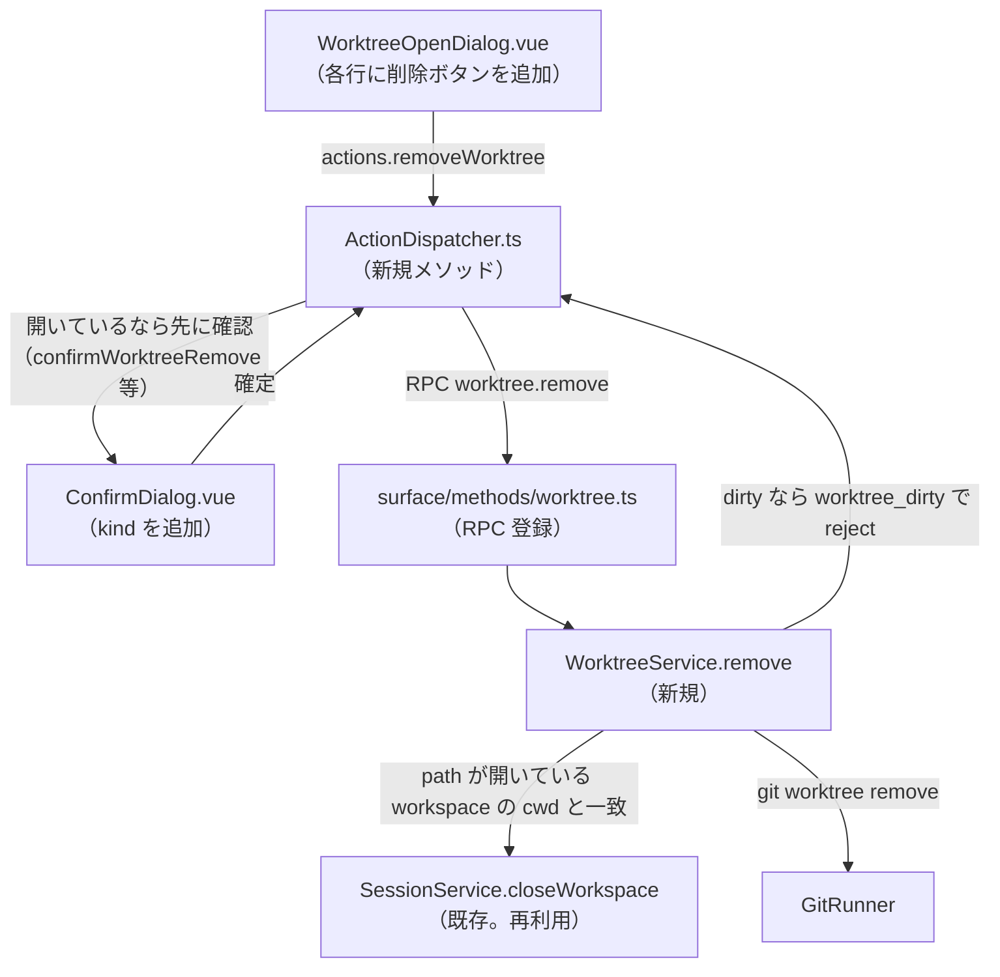

# 調査: worktree の削除

## 調査の問い

- Q1: `git worktree remove` の失敗（dirty／存在しない等）は、実際どんなメッセージ・exit code で返るか。
- Q2: 開いている workspace を閉じる処理を、`WorktreeService` からどう再利用できるか。
- Q3: 「worktree の一覧に削除操作を追加する」という UI 拡張は、既存のどのパターンに乗せられるか
  （確認ダイアログ・キーボード操作・フォーカス）。
- Q4: 複数クライアントでの同期（AC10）は、既存のどの仕組みで満たせるか。新しいイベントが要るか。
- Q5: エラーコードの体系（`ErrorCode`）はどう拡張すればよいか。
- Q6: `WorktreeService` の既存のテストの型（本物の git を使う）はどう拡張できるか。

## 判明した事実

- F1: **`git worktree remove` の実際の挙動（このリポジトリの git 2.43.0 で実測）**:
  - dirty（untracked ファイルが残っている）: exit 128、
    `stderr: fatal: '<path>' contains modified or untracked files, use --force to delete it`
  - `--force` を付けると成功（exit 0）。管理用の `.git/worktrees/<name>` も含めて片付く
    （git worktree remove の既定動作。追加のクリーンアップは不要）。
  - 既に存在しない／worktree でないパス: exit 128、
    `stderr: fatal: '<path>' is not a working tree`
  - herdr の判定文字列（`is_dirty_worktree_remove_error`／`is_not_working_tree_remove_error`。
    `scratchpad/herdr/src/worktree.rs:194-201`）と完全に一致することを実機で確認した。
    submodule 関連のエラー文字列（"working trees containing submodules cannot be moved or
    removed"）は herdr のソースにのみ確認済みで、このリポジトリでは実機確認していない
    （未検証。頻度が低いエッジケースなので `classifyWorktreeError` と同じく判定に含めてよいが、
    実測の裏取りは無い）。
- F2: **`classifyWorktreeError`（`packages/server/src/git/WorktreeService.ts:27-46`）は
  `add` の失敗だけを分類する関数**。`remove` 用の判定は無い（新設が要る）。
  同じファイル内に置くのが自然（`add`/`remove` は対になる操作）。
- F3: **`SessionService.closeWorkspace(id, closeLinkedWorktrees = false)`
  （`packages/server/src/session/SessionService.ts:285-289`）は既に public な async メソッド**。
  `closeWorkspaceOne`（同ファイル:290-298）が `pane.closed`→`tab.closed`→`workspace.closed`
  の順にイベントを配布し、`persist.touch()` も呼ぶ——**開いている workspace を閉じる処理を
  一から書く必要は無い**。`WorktreeService` は既に constructor で `SessionService` を
  受け取っている（`WorktreeService.ts:48-55`）ので、依存の向きはそのまま使える。
- F4: **「path が現在開いている workspace の cwd と一致するか」を調べる既存の索引は無い**
  （`SessionModel`/`SessionService` に cwd→workspace の逆引きは存在しない。grep で確認）。
  クライアント側の `ActionDispatcher.confirmWorktreeOpen`
  （`packages/web/src/actions/ActionDispatcher.ts:280-284`）は同じ問題を
  `[...session.workspaces.values()].find(w => w.cwd === path)` で解決している——
  サーバ側でも `SessionService.snapshot().workspaces.find(w => w.cwd === path)`
  （`snapshot()` は `packages/server/src/session/SessionService.ts:169` で定義済み、
  `SessionSnapshot.workspaces: Workspace[]` を持つ）で同じことができる。
- F5: **`ErrorCode`（`packages/protocol/src/errors.ts:2-14`）は閉じた union 型**。
  `worktree_branch_in_use`/`worktree_path_exists`/`worktree_no_commits`/
  `worktree_invalid_branch`/`worktree_failed`/`not_a_git_repository` が既存の worktree 系
  コード。対応する日本語メッセージは `packages/web/src/net/clientError.ts:19-26`
  （`clientErrorMessage` が引く表）にあり、**サーバの生の message は使わない**（D107。
  `worktreeErrorMessage`、`ActionDispatcher.ts:1032-1039`）。
- F6: **worktree 関連のイベントは現状ゼロ**（`packages/protocol/src/events.ts` を検索して確認）。
  `worktree.list`/`worktree.create` はどちらも request/response のみで、他クライアントへの
  push は無い——**別クライアントが `worktree.create` した worktree も、`worktreeOpen`
  ダイアログを開いているクライアントには自動で反映されない**（次に開き直すまで見えない）。
  この work で新しく削除の push イベントを作ると、既存の作成の非同期性と非対称になる。
- F7: **`GitRunner.run(cwd, args, timeoutMs)`（`packages/server/src/infra/GitRunner.ts:9-10`）
  は `cwd` を child_process の `cwd` オプションにそのまま渡す**（herdr の `-C <repo_root>` 相当を
  プロセス起動時の cwd で実現している）。`WorktreeService.list`/`create` は
  `this.cwdOf(workspaceId)`（呼び出し元の workspace の cwd。**削除対象のパスではない**）を
  git コマンドの実行場所にしている——`remove` も同じにすべき（削除対象のパス自体を実行場所に
  すると、削除の途中でそのディレクトリ自体が無くなる可能性があり不安定）。
- F8: **`ConfirmDialog.vue`（`packages/web/src/components/ConfirmDialog.vue`）は既に
  `DialogContext` の複数の `kind` を1コンポーネントで扱う拡張実績がある**（`confirmClose`・
  `confirmReplacePane`）。`role="alertdialog"`・開いたら最初のフォーカスは「キャンセル」・
  `y`/`n` キーでも確定/取消・`message` の `computed` に `kind` ごとの分岐を足すだけで新しい
  確認を追加できる（`ConfirmDialog.vue:33-42`）。
- F9: **`WorktreeOpenDialog.vue` の各行（`<li>`）はクリックで即座に「開く」を実行する**
  （`choose(index)`→`accept()`→`actions.confirmWorktreeOpen`。`WorktreeOpenDialog.vue:51-54`）。
  削除ボタンを行内に追加する場合、`@click.stop` 等でクリックの伝播を止めないと、削除ボタンを
  押しただけで「開く」も同時に実行されてしまう（要件の AC-I5 が指す懸念そのもの）。
- F10: **`WorktreeService.test.ts` の `sessionWith(cwd)`（`WorktreeService.test.ts:18-20`）は
  `getWorkspace` だけを実装する最小のスタブ**（`as unknown as SessionService` で型を合わせる）。
  `remove` の実装が `closeWorkspace`/`snapshot` を呼ぶようになったら、このスタブを
  それらのメソッドも持つよう拡張する必要がある（テストは本物の git を使う流儀
  ——`ChildProcessGitRunner`——なので、git 側は本物のまま、`SessionService` 側だけ差し替える）。

## 影響範囲

- 変更が波及するファイル: `packages/protocol/src/messages.ts`・`errors.ts`（RPC スキーマ・
  エラーコード追加）／`packages/server/src/git/WorktreeService.ts`（`remove` 追加。
  `classifyWorktreeError` の隣に判定関数を追加）／`packages/server/src/surface/methods/worktree.ts`
  （RPC 登録）／`packages/web/src/store/view.ts`（`DialogContext` 拡張）／
  `packages/web/src/components/WorktreeOpenDialog.vue`（削除ボタン）／
  `packages/web/src/components/ConfirmDialog.vue`（新しい `kind` の message 分岐）／
  `packages/web/src/actions/ActionDispatcher.ts`（新規メソッド・`worktreeErrorMessage` の
  マッピング拡張）／`packages/web/src/net/clientError.ts`（新しいエラーコードの日本語）。
- 影響しない（既存のまま）: `SessionModel.ts`（`closeWorkspace` を直接は変更しない）・
  `worktree.create`/`worktree.list`（挙動を変えない）・`GitInfoPoller`（無関係）。

## 実現性 / リスク

- 技術的に可能。`GitRunner`/`ChildProcessGitRunner` は任意の git サブコマンドを実行できる
  既存の抽象化があり、`remove` 用に新しいインフラは要らない。
- リスク: **submodule を含む worktree の削除エラー文字列は未検証**（F1 参照）。coding 時に
  実機で確認できなければ、herdr のパターンをそのまま踏襲し「未検証」と明記して進める
  （このリポジトリ自体に submodule は無いため、意図的に作らない限り再現できない）。
- リスク: **`worktree.remove` の実行中に対象 workspace の pane が busy（動作中プロセスあり）
  でも、確認さえ通れば強制的に閉じる**（`closeWorkspace` は busy 確認を持たない。既存の
  `closeWorkspaceById`（client）が `confirmClose` を必ず経由することと同じ扱い方——
  D23 の busy 確認は pane 単体の close 等の一部にしかない、既存の仕組みの範囲内）。

## 実装アンカー

- A1: エラーコード追加（`worktree_dirty`・`worktree_not_a_worktree` 等）
  （`packages/protocol/src/errors.ts:2-14`）— 既存の `worktree_*` 系の並びに追加。
- A2: `remove` の失敗分類関数（未特定 — `classifyWorktreeError` の隣、`WorktreeService.ts:27-46`
  の直後に新設する想定だが、関数名・分類の粒度は design で決める）。
- A3: `SessionService` への「cwd → workspace」解決（`SessionService.snapshot()`。
  `packages/server/src/session/SessionService.ts:169`）— 新しい専用メソッドを足すか、
  `WorktreeService` 側で `snapshot().workspaces.find(...)` を直接呼ぶかは design で決める。
- A4: `WorktreeService.remove`（新規。`packages/server/src/git/WorktreeService.ts`。
  `create`（:104-122）が最も近い precedent——`cwdOf`→`repoNameOf` は不要、対象は
  `workspaceId`〔実行場所解決用〕＋`path`〔削除対象〕の2つ）。
- A5: RPC スキーマ（`packages/protocol/src/messages.ts:319-343` の worktree セクション。
  `WorktreeCreateParams`/`Result` の並びに `WorktreeRemoveParams`/`Result` を追加）。
- A6: RPC 登録（`packages/server/src/surface/methods/worktree.ts`。既存の `worktree.list`/
  `worktree.create` 登録の並び）。
- A7: `DialogContext` 拡張（`packages/web/src/store/view.ts:174-190`。`confirmReplacePane` が
  最も近い precedent）。
- A8: `ConfirmDialog.vue` の `message` computed（:33-42）・`confirm()`（:70-73）への分岐追加。
- A9: `WorktreeOpenDialog.vue`（削除ボタンの追加箇所は `.worktree-open-dialog-item`
  ——:102-113）。
- A10: `ActionDispatcher.ts` 新規メソッド（`confirmWorktreeOpen`（:280〜）が最も近い precedent）・
  `worktreeErrorMessage`/`clientError.ts` のマッピング拡張。
- A11: `WorktreeService.test.ts` の `sessionWith`（:18-20）拡張。

## 実装時の注意

- **`GitRunner` の `cwd` は「削除対象のパス」ではなく「操作元の workspace の cwd」にする**
  （F7）。`create`/`list` と同じ形を踏襲しないと、削除の実行中に cwd 自体が消えて不安定になる。
- **`worktree_failed` に潰さない**——dirty と「既に存在しない」は利用者への伝え方が全く違う
  （前者は「--force で消しますか」、後者は「既に一覧が古い」）。新しいコードを分けて追加する。
- **`closeWorkspace` は busy 確認を持たない**（研究「実現性 / リスク」参照）。requirements の
  US2/AC4 が求める「閉じられることが伝わる確認」はクライアント側の確認ダイアログが担う——
  サーバ側に busy チェックを新設する必要は無い（design で明記すれば足りる）。
- **`worktree.list` の既存の非同期性（F6）を踏まえ、`worktree.remove` にも新しい push
  イベントを作らない選択肢がある**——一貫性を優先するなら、削除した本人のクライアントだけが
  ローカルで一覧を更新し（RPC の成功を受けて該当行を消す・ダイアログを閉じる等）、他クライアントは
  次に `worktree.list` を呼んだときに反映される、という既存パターンのままでよい。
  ただし開いていた workspace を閉じる副作用（`closeWorkspace`）は**既存のイベント配布で
  自動的に全クライアントへ伝わる**（F3）ので、AC10 の「反映される」はこの部分だけでも
  実質的に満たされる。

## design への申し送り

- 未確定事項（requirements.md）への回答材料:
  - 「開いている workspace を閉じてから削除」と「dirty なら --force 確認」の2つの確認は、
    **`ConfirmDialog.vue` の同じ枠組みで、別々の `DialogContext.kind` として順番に出す**のが
    最も既存パターンに沿う（F8）。1つのダイアログに畳むと、dirty かどうかは RPC を叩くまで
    分からない（サーバ側でしか判定できない）ため、先に「畳んだ」内容を出すには早すぎる。
  - 削除ボタンの見た目・配置は、`WorktreeOpenDialog.vue` の既存の行レイアウト
    （`.worktree-open-dialog-item`。ブランチ名＋パスの2行）に、行末へアイコンボタンを追加する
    形が既存のトーン（他のダイアログにアイコンボタンの precedent は無いため、テキストボタン
    「削除」でもよい——design で決める）。
  - AC10（複数クライアント同期）は、workspace を閉じる副作用については既存インフラで
    自動的に満たされる（F3）。一覧自体の即時同期は、既存の `worktree.list` の非同期性
    （F6）に合わせて見送ってよい（design で明記すれば AC10 を「workspace の閉鎖が伝わる」
    範囲で満たしたことにできる）。
- AC-I3/AC-I4（キー割り当て・フォーカス遷移）は、`ConfirmDialog.vue` の既存の y/n・
  「キャンセル」優先フォーカスをそのまま踏襲すれば自然に満たせる（新しい規約を作る必要はない）。
