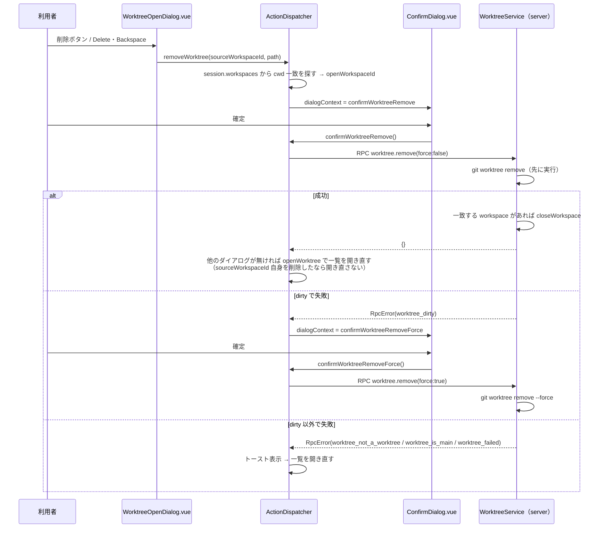

# レビューガイド: worktree の削除

## 変更概要 / 目的

既存の worktree 一覧ダイアログ（`WorktreeOpenDialog.vue`）の各行に削除操作を追加する。
`20260920-git-worktree-actions` で「削除はこの work の対象外」と明記されたまま残っていた
欠落を埋める。対象が現在開いている workspace の cwd と一致すれば、削除と同時にその workspace
も自動的に閉じる（herdr の「Delete worktree checkout...」と同じ挙動）。未コミットの変更
（dirty）が残っている場合は、通常の削除が失敗した後、`--force` での再実行を利用者に確認する
（herdr の2段階式と同じ）。

## 重要ポイント

- **`git worktree remove` を先に実行し、成功したときだけ `session.closeWorkspace` を呼ぶ**
  （`WorktreeService.remove`）。逆順にすると、dirty で失敗した場合に動いているシェルを先に
  失ってから「実は削除できませんでした」となる事故が起きる。taskcheck の must 指摘で、この
  順序を直接確かめるテストが欠けていたことが発覚し、追加した（review.md T2 参照）。
- **`view.dialogContext` は単一の値で、確認ダイアログを一覧ダイアログの「上に重ねる」ことは
  できない**という、design 作成中に発見した技術的制約への対処。確認の確定・取り消し・完了の
  いずれの結末でも、一覧ダイアログは一旦消え、`openWorktree` を呼び直すことで「元の一覧に
  戻れる」体験を実現している（requirements.md の当初の想定はこの制約と食い違っており、
  design で修正した）。
- **review round1 で発覚した「自己削除」ケース**: 一覧を開いた元の workspace 自身を削除する
  操作（自分が今いる workspace を右クリック→「worktree を開く…」→自分自身のエントリを
  削除、という自然な操作）で、成功後に `openWorktree(sourceWorkspaceId)` を呼ぶと
  `not_found` になり、削除成功が利用者に伝わらなかった。`sourceWorkspaceId === openWorkspaceId`
  のときは呼ばないよう修正——view の移動先は既存の `repairView`（`StoreAdapter.ts`。この work
  では変更していない）に任せる。
- **review round1 で発覚した RPC 応答待ち中の race**: `20260924-pane-move-cross-tab` の review
  で見つかったのと同じ種類の懸念——応答が返るまでの間に利用者が別のダイアログを開いていた
  場合、応答到着時に無条件でそれを奪ってしまう。`view.dialogContext === null`（何も割り込んで
  いない）ことを確認してから適用するよう修正した。
- **見送った既知の制約**（backlog に記録済み）: (1) 確認ダイアログの `openWorkspaceId` は
  開いた瞬間のスナップショットで、確定まで再評価されない——複数クライアントが同じ repo を
  開いている狭い競合で、確認の保証が効かないことがある。design が最初から「一覧の即時同期は
  作らない」と決めた既存のトレードオフの範囲内。(2) lock 済み worktree（`git worktree lock`）
  は `--force` 単体では削除できず（`-f -f` が要る）、専用のエラー分類が無い。

## 処理フロー

## 主要な変更箇所

- `packages/server/src/git/WorktreeService.ts:classifyWorktreeRemoveError/remove` — git の
  失敗分類（実機確認済み4パターン）と、削除→close の順序が本体。
- `packages/web/src/actions/ActionDispatcher.ts:removeWorktree/confirmWorktreeRemove/
  confirmWorktreeRemoveForce/sendWorktreeRemove` — 確認フロー・自己削除ガード・
  RPC 競合ガード。
- `packages/web/src/components/ConfirmDialog.vue` — `confirmWorktreeRemove`/
  `confirmWorktreeRemoveForce` の message・確定ボタン文言（decisions.md D1）・
  `cancel()` が一覧へ「戻る」形。
- `packages/web/src/components/WorktreeOpenDialog.vue` — 削除ボタン（`@click.stop`・
  `tabindex="-1"`）・`Delete`/`Backspace` キー。

## リスク / 確認したい点

- 実ブラウザでの複数タブ・複数クライアント同時接続による目視確認は行っていない
  （test-result.md「未検証の穴」）。
- backlog に記録した2つの既知の制約（多クライアント競合・lock 済み worktree）は、
  優先度が低いと判断して今回は対応していない。
