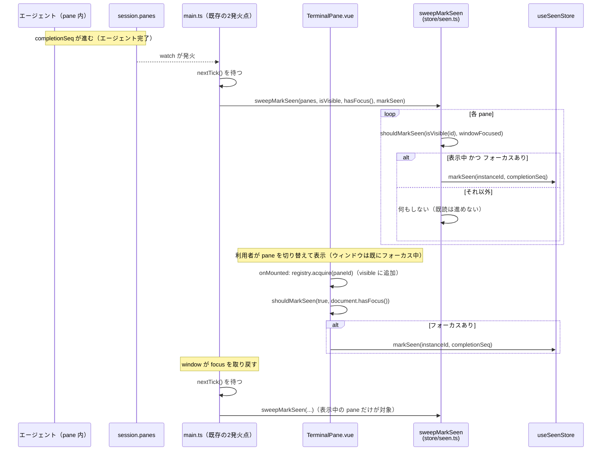

# レビューガイド: 既読（wtm.seen.v1）の意味論を直す

## 変更概要 / 目的

サイドバーの「完了」の印（`done` 表示）が、実際の完了通知（「完了しました」）と食い違う
バグを直す。既存の `main.ts` の `markVisibleAgentsSeen` は「ウィンドウにフォーカスがあれば
session 内の**全 pane**を既読にする」という意図的な簡略化になっており、これが
`displayStateFor` の `done` 判定を常に不成立にしていた。正しい規則
`shouldMarkSeen(paneVisible, windowFocused)`（既存・単体テスト済みだが本番未使用だった
純関数）を、pane ごとの実際の可視性（`TerminalRegistry.isVisible`）で判定する形に配線する。

## 重要ポイント

- **既読を進める判定は、必ず `shouldMarkSeen` を経由する**——`store/seen.ts` に新設した
  `sweepMarkSeen`（session 全体の掃引）と、`TerminalPane.vue` の `onMounted`（自分1つの
  直接判定）の**2箇所**が呼び出し元。判定ロジック自体（`paneVisible && windowFocused`）は
  複製されていない。
- **2つの異なるタイミングモデルが混在する（このリストで最も重要。review で最も詳しく
  検証された点）**:
  - `main.ts`（既存の2つの発火点: `completionSeq` の変化を見る `watch`・`window` の
    `focus` イベント）は `nextTick()` でラップしてから `TerminalRegistry.isVisible` を
    読む。`TerminalRegistry.ts` 自身のドキュメントコメントが「読む側は `await nextTick()`
    の後に呼ぶ（mount/unmount のフックは Vue のパッチ後に走るので、途中で読むと tab の
    切り替え中に空を拾う）」と明記しているため。
  - `TerminalPane.vue` の `onMounted` は `nextTick()` を**使わず**、`paneVisible` を
    自明に `true` として直接判定する。理由: `onMounted` 自身が「このコンポーネントが今
    マウントされた」＝「この pane が今画面に出た」という事実そのものであり、
    `registry.acquire(paneId)`（`visible.add(paneId)` を同期的に行う）が既読判定より
    **必ず先に、同一コールスタック内で**実行されるため（`onMounted` 冒頭で
    `registry.acquire` を呼んでから既読判定を行う、というコード内の順序がこの前提を
    支えている——順序を入れ替えると前提が崩れる）。
  - **なぜ `TerminalPane.vue` が必要か**: `TerminalRegistry.isVisible` は Vue の reactive
    ではなく `watch` できない。`main.ts` の2つの発火点だけでは「ウィンドウは既に
    フォーカスされたまま、利用者が pane を切り替えて表示する」という遷移を拾えない
    （`isVisible` の値が変わったこと自体を検知する手段が無いため）。`TerminalPane.vue` の
    `onMounted` は、この遷移が起きた**まさにその瞬間**に呼ばれる、既存のフックをそのまま
    使う。
- **`NotificationController` との対関係（review で確認）**: `notify/policy.ts` の
  `shouldQueue(a) = !(a.windowFocused && a.paneVisible)` は `shouldMarkSeen(paneVisible,
  windowFocused) = paneVisible && windowFocused` の**論理否定**そのもの——「表示中＋
  フォーカスあり」のときだけ通知を積まず・同時に既読も進む／それ以外は通知を積み・既読も
  進まない、という対称性が数式レベルで一致しており、サイドバーの印と通知が今後は構造的に
  一致する。
- **`main.ts` の配線には自動テストが無い（既知の制約）**: `main.ts` は export を持たない
  副作用専用のエントリポイントで、単体テストできない（`main.test.ts` は存在しない）。
  AC の裏付けは `sweepMarkSeen`（`seen.test.ts`）と `TerminalPane.vue`
  （`TerminalPane.test.ts`）の単体テストが担う。この配線自体を壊す変更（例えば
  `nextTick()` を誤って外す）は、現状のテストでは検知できない——将来同種の変更をする人は
  注意すること。

## 処理フロー

## 主要な変更箇所

- `packages/web/src/store/seen.ts` — `sweepMarkSeen`（新設）。`shouldMarkSeen`・`markSeen`
  自体は無改修。
- `packages/web/src/main.ts` — `markVisibleAgentsSeen` の本体を `sweepMarkSeen` 呼び出しに
  差し替え（`nextTick()` でラップ）。既存の2つの発火点自体は無改修。
- `packages/web/src/components/TerminalPane.vue` — `onMounted` に既読判定の2文を追加
  （`registry.acquire` の後）。

## リスク / 確認したい点

- 実際のブラウザで、複数 pane・複数 tab を行き来しながらエージェントを完了させ、サイドバーの
  完了の印と通知が実際に一致することを目視確認する検証は行っていない（test-result.md
  「未検証の穴」。このセッションの方針: E2E はユーザー依頼時のみ）。
- `nextTick()` の挿入により、表示中+フォーカスありの pane が完了した瞬間、理論上1 tick だけ
  `displayStateFor` が `"done"` を返しうる（直後に既読が反映され `"idle"` に戻る）。実害は
  考えにくいと判断し対応は見送った（decisions.md D2）。
