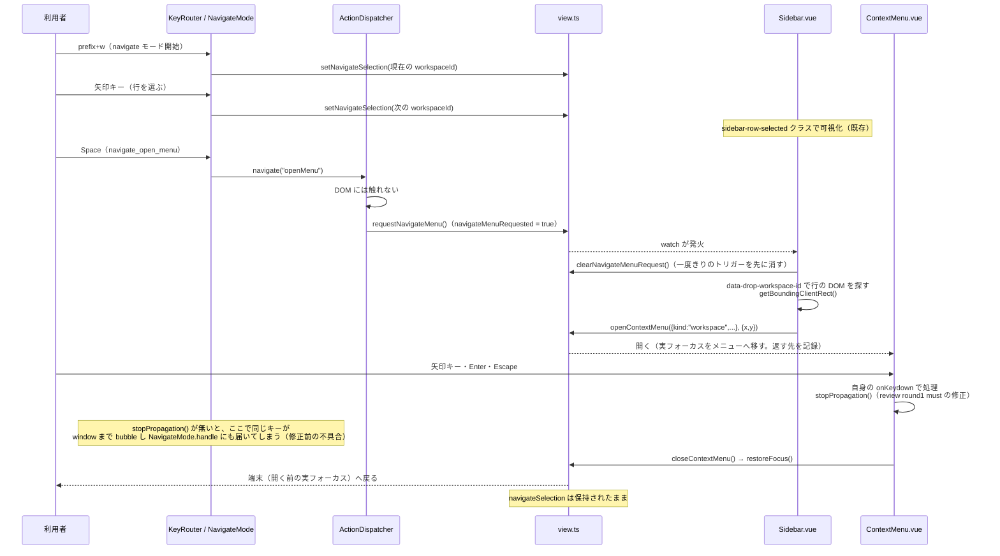

# レビューガイド: サイドバーの workspace 行のメニューをキーボードから開く

## 変更概要 / 目的

サイドバーの workspace 行のコンテキストメニュー（開く・名前を変更・worktree を開く…等）を、
右クリック以外にキーボードだけで開けるようにする。`pane` の枠（`PaneFrame.vue`）は既に
キーボード対応していたが、サイドバーの行は未対応だった、という herdr パリティのギャップ
（キーボードだけで完結する操作性）を埋める。

既存の「navigate モード」（`prefix+w` で開始、矢印キーで workspace 行の選択カーソルを動かす
既存の仮想カーソル機能）を拡張し、選択中の行で `Space` を押すとその行のメニューが開く。

## 重要ポイント

- **`ActionDispatcher` は DOM に一切触れない、という既存の設計原則を守った**: 新しい
  `case "openMenu":`（`ActionDispatcher.navigate()`）は `view.navigateSelection` があれば
  `view.requestNavigateMenu()`（真偽値フラグを立てるだけ）を呼ぶだけ。実際に DOM から
  `getBoundingClientRect()` を計算して `ContextMenu.vue` を開くのは、行の DOM を実際に持つ
  `Sidebar.vue` の `watch` が担う。`ActionDispatcher`（DOM 非依存）と `Sidebar.vue`（DOM
  依存）の境界を、`view.ts` の一度きりの真偽値フラグ（`navigateMenuRequested`）1つで橋渡し
  している。
- **7つ目の navigate キー（`navigate_open_menu`。既定 `space`）は、既存6件（全て移動系）と
  同じカタログ機構（`NAVIGATE_KEYS`/`resolveNavigateKeymap`）に乗せた**——`NavigateMode.ts`
  自体は無改修（既存の汎用パスが自動的に拾う）。カスタマイズ可能。
- **review round1 で見つかった must（このリストで最も重要）**: `ContextMenu.vue` の
  `onKeydown` は `ev.preventDefault()` は呼ぶが `ev.stopPropagation()` を一切呼んでいな
  かった（`PaneFrame.vue` の同種ハンドラは既に呼んでいる——precedent との非対称）。
  `main.ts` の window レベルの keydown listener（端末外のキーを `KeyRouter`/`NavigateMode`
  へ流す経路）は `view.openDialog` と `xterm-helper-textarea` 判定しかガードしておらず、
  `view.contextMenu`（メニューが開いているか）は見ていない。この組み合わせにより、
  **navigate モード中にメニューを開いた状態で矢印キー・`Space` を押すと、メニュー内の操作と
  同時に同じキーが window まで bubble し、`NavigateMode.handle` が `navigateSelection` を
  動かす・`openMenu` action を再発火する**という実害があった（design が明記する「メニューを
  閉じても navigateSelection は保持される（触らない）」が、閉じる前から崩れる）。修正:
  `ContextMenu.vue` の4分岐すべてに `stopPropagation()` を追加（`PaneFrame.vue` と同じ
  パターン）。**「変更しない」としていたファイルに手を入れる差し戻しが実際に発生した**——
  design 段階の「`ContextMenu.vue` は無改修で安全に流用できる」という前提（研究F7・F8）は、
  実は `stopPropagation()` の有無という window レベルの伝播の仕組みまでは検証しておらず、
  誤りだった。
- **メニューを閉じても navigate モードの選択（`navigateSelection`）は保持する**: `Sidebar.vue`
  も `ActionDispatcher` も `setNavigateSelection` を呼ばない。フォーカスの戻し先は既存の
  `ContextMenu.vue`「`returnFocusTo`/`restoreFocus`」機構（開く前の実フォーカス要素——navigate
  モードは実 DOM フォーカスを動かさない「仮想カーソル」なので、通常は端末の pane）にそのまま
  乗る。新しいフォーカス管理コードは書いていない。

## 処理フロー

## 主要な変更箇所

- `packages/web/src/components/ContextMenu.vue` — `onKeydown` の4分岐に
  `ev.stopPropagation()` を追加（review round1 must。decisions.md D4）。**このリストで
  最も重要**: この1行が無いと機能全体が navigate モードの状態を壊す。
- `packages/web/src/actions/ActionDispatcher.ts` — `navigate()` の `case "openMenu"`
  （DOM 非依存。`view.navigateSelection` があれば要求を立てるだけ）。
- `packages/web/src/components/Sidebar.vue` — `view.navigateMenuRequested` を見る
  `watch`（実際に DOM から位置を計算して `openContextMenu` を呼ぶ。一度きりのトリガーを
  DOM 処理より前に消す）。
- `packages/web/src/store/view.ts` — `navigateMenuRequested`（一度きりの真偽値フラグ）・
  `requestNavigateMenu`/`clearNavigateMenuRequest`。
- `packages/web/src/keys/navigateKeys.ts` — `NAVIGATE_KEYS` に7件目
  （`navigate_open_menu`。既定 `space`）。
- `packages/web/src/components/HelpDialog.vue`・`KeySettings.vue` — 発見可能性のための
  一覧更新（`KeySettings.vue` はコードは無改修、コメントのみ）。

## リスク / 確認したい点

- 実際のブラウザで `prefix+w`→矢印→`space`→メニュー操作を通しで操作する目視確認は行って
  いない（test-result.md「未検証の穴」。このセッションの方針: E2E はユーザー依頼時のみ）。
  `getBoundingClientRect()` は jsdom/happy-dom では実座標を返さないため、実際に正しい位置に
  メニューが開くかは vitest では検証できていない（`PaneFrame.vue` と同じ書き方であることの
  確認に留まる）。
- グループ見出し行・agent 行のメニューをキーボードから開くことは対象外（requirements.md
  「対象外」で明示）。
