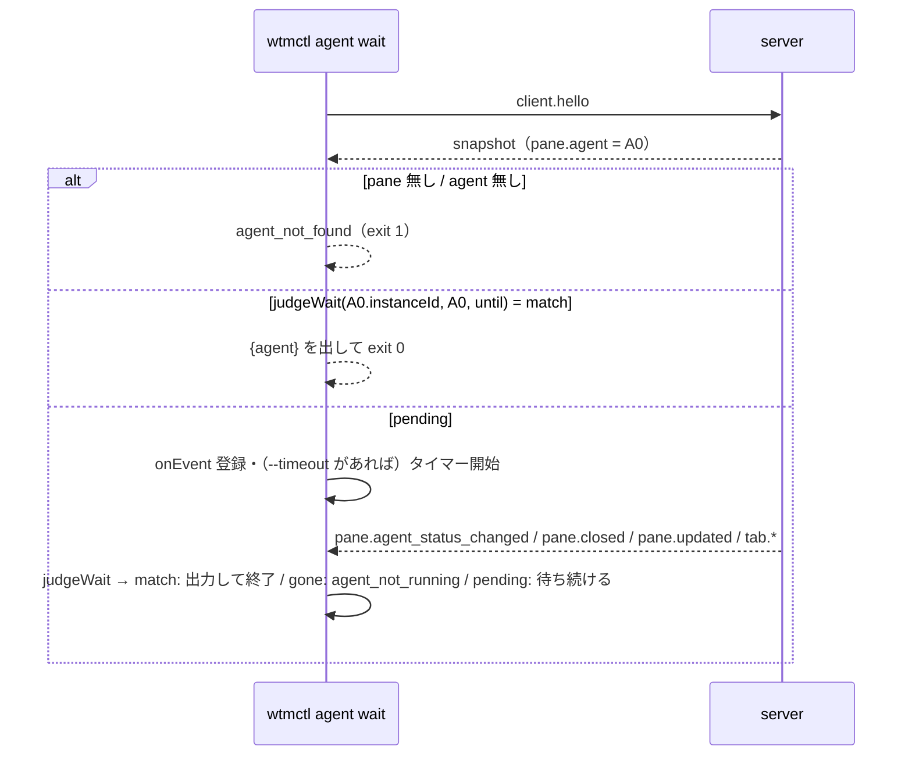

# 仕様: エージェント自動化 CLI（`wtmctl agent list / get / wait / read`）

## 概要

`packages/cli`（wtmctl）に `agent` コマンド群を足す。サーバ・プロトコル・web は変えない。
状態は `client.hello` の snapshot（`Pane.agent`）で初期値を取り、以後は同じ接続に push される
`pane.agent_status_changed` / `pane.closed` / `pane.updated` / `tab.created` / `tab.updated` イベントで追う。
画面の読み取りは既存の `pane read` と同じ `pane.subscribe` → SNAPSHOT の経路を使う。

## 設計方針

- **CLI だけで完結させる**（decisions.md D1）。herdr はサーバ側に `agent.wait` 相当の待ち合わせを持つが
  （herdr `src/api/wait.rs:132-172`）、本製品はサーバが既に全クライアントへ状態変化を push しているので、
  待ち合わせを CLI 側の接続の中で行えば新しい RPC が要らない。新しい入口を作らないので、既存の
  `withSession`（セッションキャッシュ・1 回だけの再ログイン・`--url` から組み立てる Origin）をそのまま通る。
  - 代替案: サーバに `agent.wait` RPC を足す——サーバ側で待ちを持つ（接続ごとの保留・時間切れ・切断時の後始末）
    ぶん変更が広がり、利点（複数 CLI が同じ待ちを共有する等）が本 work の用途に無いので退けた。
- **判定を純粋関数に切り出す**（`agentStatus.ts`）。状態の導出（`done`）・一致判定・「居なくなった」判定・
  出力の形への変換を、WebSocket を持たない関数にしてテストで直接叩けるようにする（負の確認で1箇所ずつ壊せる）。
- **状態の導出はブラウザと同じ規則**: `state === "idle" && completionSeq > serverSeenSeq` なら `done`、
  それ以外は `state` そのまま（`packages/web/src/store/seen.ts:57-61` の `displayStateFor` に、既読の値として
  サーバの `serverSeenSeq` を渡した場合と同じ。herdr の「CLI/API はサーバの既読を使う」
  〔`agent-automation.mdx` の `idle` と `done` の段落〕とも一致）。web のコードは import しない（cli は web に
  依存していない。`packages/cli/package.json`）。3 行の規則を複製し、複製であることをコメントに書く。
- **出力は camelCase、`wait`/`get` は `{ agent }` で包む**: 既存の wtmctl は RPC の結果を camelCase のまま出す
  （20260923-external-control-api decisions.md D7）。herdr は成功時の結果を `.result.agent` に置く
  （`agent-automation.mdx`「Successful `agent start`, `agent prompt`, and `agent wait` commands return the current
  agent at `.result.agent`」）。wtmctl には `.result` の層が無い（既存コマンドは結果そのものを出す）ので、
  `{ agent: … }` / `{ agents: [ … ] }` とする（`jq -r .agent.status` で herdr の `.result.agent.agent_status` に相当する値が取れる）。

## 対象範囲

- 追加: `packages/cli/src/agentStatus.ts`（純粋関数）・`packages/cli/src/agentStatus.test.ts`
- 追加: `packages/cli/src/commands/agent.ts`（`runAgentList` / `runAgentGet` / `runAgentWait` / `runAgentRead`）・
  `packages/cli/src/commands/agent.test.ts`（偽のクライアントでの単体テスト）
- 追加: `packages/cli/src/agent.integration.test.ts`（実サーバでの結合テスト。専用サーバを立てて閉じる）
- 変更: `packages/cli/src/cliArgs.ts`（`agent` の引数解釈・`USAGE`）・`cliArgs.test.ts`
- 変更: `packages/cli/src/main.ts`（分岐とヘルプ）
- 変更: `packages/cli/src/commands/pane.ts`（`pane read` の「SNAPSHOT を 1 回読む」部分を `agent read` と共有する
  関数として export する。振る舞いは変えない）
- 変更: `packages/cli/src/smoke.ts`（`agent list` を 1 行足す。`.aidev/config.yml` は触らない）
- 変更（deliver 工程）: `.aidev/backlog/product-roadmap.md` の本項目の行を `[x]`（本 work）と `[ ]`（残り 3 つ）に割る。
- 追加/変更（docs）: `docs/wtmctl.md`（新規。利用者向けの wtmctl の使い方。既存の docs に wtmctl の記述が
  無い——`grep -rln wtmctl docs` は `docs/herdr-parity.md` だけ）・`docs/herdr-parity.md` の H39 行

## 依拠する既存の事実

- `client.hello` の応答は同期のハンドラが `session.snapshot()` をその場で作って返す
  （`packages/server/src/surface/methods/client.ts:6-13`）。snapshot は `panes[]`（各 `Pane` が `tabId`・`agent`
  を持つ）と `tabs[]`（各 `Tab` が `workspaceId` を持つ）を含む（`packages/protocol/src/model.ts:50-60, 67-88, 151-161`）。
- イベントは接続の確立時点から全クライアントへ、発行と同時に `conn.sendText` で送られる
  （`packages/server/src/ws/WsGateway.ts:82-84`）。1 本の WebSocket 上の順序は保たれるので、hello の応答より後に
  届いたイベントは snapshot より新しい。CLI 側は hello の応答を受け取ったあとでイベントの購読を登録する
  （応答の `message` ハンドラが解決した Promise の続きは、次の `message` より先に走る。既存の `runWatch` が同じ
  前提で動いている。`packages/cli/src/commands/session.ts:55-60`）。
- エージェントの状態が変わると `pane.agent_status_changed { paneId, agent }` が出る。`agent` は変化後の
  `AgentInfo` の全体、または居なくなったとき `null`（`packages/protocol/src/events.ts:84-87`、
  `packages/server/src/session/SessionService.ts:826-834`）。別のエージェントに入れ替わると `AgentTracker` は
  新しい `instanceId` を振る（`packages/server/src/agent/AgentTracker.ts:76-92`）。
- `AgentInfo` は `instanceId` / `kind` / `label` / `state`（`blocked|working|idle|unknown`）/ `completionSeq` /
  `serverSeenSeq` / `verified` / `since` を持つ（`packages/protocol/src/model.ts:4, 107-122`）。
- pane が閉じる経路（pane・tab・workspace の close、置き換え）はすべて `pane.closed { paneId }` を出す
  （`SessionService.ts:414-416` の `publishPaneClosed` を `closeWorkspaceOne`・`closeTab`・`closePane` が呼ぶ。
  `SessionService.ts:419-426, 557-563, 612-620`）。
- pane が別の tab へ移ると `pane.updated { pane }`（新しい `tabId`）、新しい tab ができると `tab.created { tab }`
  が出る（`SessionService.ts:728, 756-757`）。tab の名前変更では `tab.updated { tab }` が出る（`SessionService.ts:535-538`）。
  どちらの `tab` も `workspaceId` を持つ（`Tab`。`packages/protocol/src/model.ts:50-60`）。
- `pane.updated` は `updatePaneRuntime` の中で busy/title/cwd が変わったときに出る。エージェントの変化はそれとは別に
  `pane.agent_status_changed` として出る（`SessionService.ts:826-837`）。よって待ちの判定は
  `pane.agent_status_changed` だけを見ればよく、`pane.updated` の `pane.agent` は使わない。
- `withSession(opts, store, fn)` はキャッシュ済み cookie で接続し、401 なら 1 回だけ `--token` で再ログインして
  やり直し、`fn` の終了後（成功・失敗とも）に接続を閉じる（`packages/cli/src/withSession.ts:15-45`）。
  接続は `connect()` が `--url` から Origin/Host ヘッダを組み立てる（`packages/cli/src/wsClient.ts:186-235`）。
- `cliArgs.ts` の `parseFlags` は `FlagSpec { bools?, values? }` を受け、値フラグは `Map<string, string>` に入る
  （同じフラグを 2 回書くと後の値で上書きされる）。正の整数の検査は `parsePositiveInt` がある
  （`packages/cli/src/cliArgs.ts:58-117`）。
- `followOutput` は `client.onClose` で `RpcFailure("connection_closed", …)` を投げる
  （`packages/cli/src/commands/pane.ts:82-94`）。認証・接続の失敗の code（`unauthenticated`/`invalid_token`/
  `forbidden`/`internal`）は `output.ts` の `classify` が決める（`packages/cli/src/output.ts:32-43`）。
- herdr 側の仕様（一次資料 `scratchpad/herdr` コミット `da6bcd5`）: 既定の待ち状態 idle/done/blocked は
  `src/api/wait.rs:523-535` の `agent_wait_statuses`、時間切れの文言 "timed out waiting for agent status" は
  `wait.rs:655-657`、居なくなったときの `agent_not_running` は `wait.rs:677-689`、recent の既定 80 行と
  `agent read` のオプション（`--follow` は無い）は `docs/next/website/src/content/docs/cli-reference.mdx:248, 334`。
- 既存の `pane read` は hello → `pane.subscribe { paneId, scrollbackLines }` → 最初の SNAPSHOT を待つ（既定 5000ms で
  `timeout`）→ `pane.unsubscribe` の順（`packages/cli/src/commands/pane.ts:66-105`、既定値は
  `packages/cli/src/cliArgs.ts:56`）。
- `WtmClient.request` の応答待ちの上限は 10 秒（`packages/cli/src/wsClient.ts:51`）。イベント待ちにはこの上限は
  掛からない（`onEvent` は期限を持たない。`wsClient.ts:160-162`）。
- 既存のエラーの出し方: `RpcFailure(code, message)` を投げると `reportAndExit` が stderr に
  `{"error":{"code","message"}}` を出して終了コード 1、`CliUsageError` は終了コード 2
  （`packages/cli/src/output.ts:38-66`）。
- 結合テストでは `composeServer` の戻り値の `session.updatePaneRuntime(paneId, { agent })` でエージェントの
  状態を注入できる。シェルが前面にいる pane では `AgentMonitor` の周期判定は `agent` を上書きしない
  （`AgentTracker.update` が `kind === null && info === null` で `"unchanged"` を返し、`AgentMonitor` は
  そのとき `patch.agent` を付けない。`packages/server/src/agent/AgentTracker.ts:69-72`、
  `packages/server/src/agent/AgentMonitor.ts:188-192`）。

## インターフェース / データ構造

### コマンド（`cliArgs.ts` の `Command` に追加）

```
wtmctl agent list [--url <URL>] [--token <TOKEN>]
wtmctl agent get <paneId> [--url <URL>] [--token <TOKEN>]
wtmctl agent wait <paneId> [--until working|blocked|idle|done|unknown]... [--timeout <ms>] [--url <URL>] [--token <TOKEN>]
wtmctl agent read <paneId> [--lines <N>] [--raw] [--timeout <ms>] [--url <URL>] [--token <TOKEN>]
```

```ts
| { kind: "agent-list"; opts: GlobalOpts }
| { kind: "agent-get"; opts: GlobalOpts; paneId: string }
| { kind: "agent-wait"; opts: GlobalOpts; paneId: string; until: AgentStatus[]; timeoutMs: number | undefined }
| { kind: "agent-read"; opts: GlobalOpts; paneId: string; lines: number; raw: boolean; timeoutMs: number }
```

- `--until` は繰り返し指定できる値フラグ。既存の `parseFlags` は値フラグを `Map` に 1 つだけ持つので、
  **繰り返しを集める `multi` を `FlagSpec` に足す**（`multi: ["--until"]` → `ParsedFlags.multi: Map<string, string[]>`）。
  値は 5 状態のどれかでなければ `CliUsageError`。省略時は `until: []`（既定の 3 状態への展開は `agentStatus.ts` の
  `resolveUntil` が行う。herdr の `agent_wait_statuses` と同じ置き場所の分け方）。
- `--timeout`（wait）は省略時 `undefined`（無期限）、指定時は正の整数（既存の `parsePositiveInt`）。
- `--lines` は正の整数、省略時 80。`--timeout`（read）は省略時 5000（既存の `pane read` と同じ）。

### `agentStatus.ts`

```ts
export type AgentStatus = "working" | "blocked" | "idle" | "done" | "unknown";
export const AGENT_STATUSES: readonly AgentStatus[];
export const DEFAULT_UNTIL: readonly AgentStatus[]; // ["idle", "done", "blocked"]

export function statusOf(agent: AgentInfo): AgentStatus;
export function resolveUntil(until: readonly AgentStatus[]): readonly AgentStatus[]; // 空なら DEFAULT_UNTIL

export interface AgentView {
  paneId: string; workspaceId: string | null; tabId: string;
  status: AgentStatus;            // herdr の agent_status 相当（done を含む 5 値）
  kind: string; label: string;
  state: AgentState;              // サーバの生の状態（done を含まない 4 値）
  instanceId: string; completionSeq: number; serverSeenSeq: number; since: number; verified: boolean;
}
export function toAgentView(pane: Pane, workspaceIdOfTab: (tabId: string) => string | null): AgentView; // pane.agent 非 null が前提

/** 待ちの 1 ステップの判定。 */
export type WaitVerdict = "match" | "gone" | "pending";
export function judgeWait(expectedInstanceId: string, current: AgentInfo | null, until: readonly AgentStatus[]): WaitVerdict;
```

- `judgeWait`: `current === null` または `current.instanceId !== expectedInstanceId` → `"gone"`、
  `until` に `statusOf(current)` が含まれる → `"match"`、それ以外 → `"pending"`。

### `lastLines`（`agentStatus.ts` に同居）

```ts
export function lastLines(text: string, n: number): string;
```
- 改行（`\r\n` / `\n`）で分け、**末尾の空行**（ANSI を除いて空白だけの行）を捨ててから、最後の `n` 行を
  `\n` でつないで返す（画面の下の空き行が 80 行の枠を食わないようにする。herdr の recent の既定 80 行に相当）。

### 出力

- `agent list`: `{"agents":[AgentView, …]}`（snapshot の `panes` の順。エージェントの居ない pane は含めない）
- `agent get` / `agent wait`: `{"agent":AgentView}`
- `agent read`: テキスト（既存の `printLine`。既定は `stripAnsi` 後、`--raw` はそのまま）。

## 振る舞いの詳細

### `agent get` / `agent list`

hello の snapshot から作る。`get` は pane が無い・`pane.agent === null` なら `RpcFailure("agent_not_found", …)`。

### `agent wait`



- 対象の `instanceId` は hello の時点のものに固定する（途中で入れ替わったら `gone`）。
- `pane.closed`（対象 pane）→ `agent_not_running`。
- `pane.updated`（対象 pane）→ `tabId` を更新する（出力の `tabId`/`workspaceId` を移動後の値にするため）。
  `pane.updated` の `pane.agent` は判定に使わない（上記「依拠する既存の事実」）。
- `tab.created` / `tab.updated` → tab → workspace の対応表を更新する。
- 時間切れ → `RpcFailure("timeout", "timed out waiting for agent status")`（herdr と同じ文言。`wait.rs:655-657`）。
- サーバからの切断 → `RpcFailure("connection_closed", …)`（既存の `followOutput` と同じ）。
- 終わるとき（一致・gone・時間切れ・切断のどれでも）タイマーを必ず解除する。接続は `withSession` が閉じる。

### `agent read`

hello → 対象 pane とエージェントの存在を確かめる（無ければ `agent_not_found`）→ 既存の `pane read` と同じ
「subscribe → 最初の SNAPSHOT → unsubscribe」（`pane.ts` から export する
`readPaneSnapshot(client, paneId, scrollbackLines, timeoutMs, unsubscribe): Promise<string>`。**hello は含まない**——
呼び出し側が先に hello を済ませ、その snapshot の `limits.scrollbackLines` を渡す。`runPaneRead` も同じ関数を使い、
`--follow` のときだけ `unsubscribe=false` で呼んで `followOutput` へ進む）→
`raw` でなければ `stripAnsi` → `lastLines(text, lines)` → `printLine`。
`--follow` は持たない（herdr の `agent read` にも無い）。

## ドメイン固有の考慮

- **安全**: 新しい RPC・HTTP・ソケットを作らない。サーバ側のコードを変えないので、認証（session cookie）・
  Origin/Host 検査・レート制限はすべて既存のまま効く。`agent` コマンドは `withSession` 以外の経路で接続しない。
- **herdr との違い（docs に書く）**: 対象は pane ID だけ（名前は無い）／`agent read --source` は無い（常に
  既存の SNAPSHOT〔スクロールバック込み〕の末尾 N 行）／alternate screen の自動スクロールは無い／
  `prompt --wait` が無いので、`pane run` 直後の `agent wait` はまだ `idle` のうちに即座に返りうる
  （回避策: `agent wait --until working --timeout …` を先に打ってから `agent wait`。ただし作業が極端に短いと
  `working` を見逃して時間切れになる）。
- **状態の呼び方**: `done` の規則をブラウザと揃える（上記「設計方針」）。サーバの既読（`serverSeenSeq`）は
  ブラウザで pane を focus したときに進む（`AgentMonitor.handleFocusChanged`。`AgentMonitor.ts:101-105`）。
  CLI の読み取り（get/wait/read）は既読を進めない（herdr の「reads do not」と同じ）。

## エラー処理 / 異常系

| 状況 | code | 終了コード |
|---|---|---|
| pane が無い / エージェントが検出されていない（get/wait/read） | `agent_not_found` | 1 |
| 待ち中にエージェントが null・入れ替わり・pane が閉じた | `agent_not_running` | 1 |
| `--timeout` 内に一致しない（wait）／SNAPSHOT が来ない（read） | `timeout` | 1 |
| 待ち中にサーバが切断 | `connection_closed` | 1 |
| 認証・Origin・接続の失敗 | 既存どおり（`unauthenticated`/`invalid_token`/`forbidden`/`internal`） | 1 |
| 未知の `--until` 値・不正な `--timeout`/`--lines`・引数の過不足・未知のサブコマンド | （使い方） | 2 |

## 受け入れ基準との対応

- AC1: `runAgentList` が hello の snapshot（入力: サーバの `panes[].agent`・`tabs[].workspaceId`）から
  `agent !== null` の pane だけを `toAgentView` で並べる。単体テスト（偽クライアント）と結合テスト（実サーバで
  エージェントを注入した pane と、注入していない pane）で確かめる。
- AC2: `statusOf` の単体テスト（idle かつ `completionSeq > serverSeenSeq` → done、idle で等しい → idle、
  working で差がある → working）。入力は `AgentInfo`。`runAgentGet` の単体テストで `{agent}` の形。
- AC3: `judgeWait` と `resolveUntil` の単体テスト（既定で idle/done/blocked は match、working/unknown は pending）、
  `runAgentWait` の単体テストで初期状態が一致すれば onEvent を登録せず即座に出力すること。
- AC4: 結合テスト——実サーバの pane に `working` のエージェントを注入 → `agent wait` を開始 →
  `session.updatePaneRuntime` で `idle`（completionSeq を 1 上げる）に変える → `{agent:{status:"done"}}` で返る。
  `--until` の複数指定は単体テスト（偽クライアントでイベントを流す）。入力はサーバの `pane.agent_status_changed`。
- AC5: 単体テスト（偽のタイマー `vi.useFakeTimers`）——`--timeout 1000` で 1000ms 進めると `timeout`、
  省略時は 60 秒進めても解決しない（既存の RPC 上限 10 秒より長い）。
- AC6: `judgeWait` の単体テスト（null → gone、instanceId 違い → gone）と `runAgentWait` の単体テスト
  （`pane.closed` → `agent_not_running`）。結合テストでも注入したエージェントを null にして確かめる。
- AC7: `lastLines` の単体テスト（末尾の空行を捨てる・最後の N 行・`\r\n`）と、`runAgentRead` の単体テスト
  （既定で stripAnsi・`--raw` でそのまま・SNAPSHOT が来なければ `timeout`）。結合テストでは、実 PTY の pane に
  `session.updatePaneRuntime` でエージェントを注入したうえで（入力: 上記「依拠する既存の事実」の注入手段）、
  `pane run` で `echo` した文字列が `agent read` に出ること。
- AC8: `runAgentGet`/`runAgentWait`/`runAgentRead` の単体テスト（pane 無し・agent 無し → `agent_not_found`）と
  `cliArgs.test.ts`（未知の `--until`・不正な数値・引数の過不足 → `CliUsageError`）。
- AC9: 実装が `withSession` を通ることを単体テストで確かめる（`withSession` をモックして呼ばれたこと）。
  `git diff --stat main...HEAD -- packages/server packages/protocol packages/web` が空であることを test 工程で記録する。
- AC10: test 工程で `pnpm -s build` / `pnpm -s typecheck`（終了コードで判定）/ `pnpm -s test` ×2 / `aidev smoke`。
- AC11: `docs/wtmctl.md` の新設（agent コマンドの使い方と herdr との違い）と `docs/herdr-parity.md` H39 行の更新、
  deliver での backlog 行の分割。
