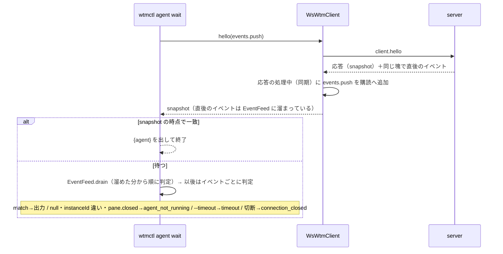

# レビューガイド: エージェント自動化 CLI（`wtmctl agent list / get / wait / read`）

## 変更概要 / 目的

herdr の `agent list/get/wait/read` 相当を `wtmctl`（`packages/cli`）に足した。スクリプトや別のエージェントが、
pane ID で指した検出済みエージェントの状態を知り、ポーリングを自作せずに目的の状態まで待ち、画面を読める。
**サーバ・プロトコル・web は変えていない**——既存の `client.hello` の snapshot と、全クライアントへ push される
`pane.agent_status_changed` を CLI 側で待ち合わせる（範囲の選び方は decisions.md D1）。

## 重要ポイント

- **購読を始める位置**（decisions.md D9）: `agent wait` は「hello の応答より後のイベントだけ」を「取りこぼさずに」
  受ける必要がある。`await hello()` の後で購読すると、`ws` が同じ受信の塊の複数フレームを同期に続けて配るため
  応答直後のイベントを取りこぼし、hello の前から購読すると snapshot より古いイベントで誤って一致しうる。
  `WtmClient.hello(onEventAfterHello)` を足し、応答を処理するその同期区間で購読に加えるようにした。
- **`done` の既読はサーバのもの**（D10）: 規則はブラウザと同じ（idle かつ未読の完了）だが、既読はサーバがフォーカスの
  移動でだけ進めるので、ブラウザのバッジと食い違うことがある（herdr も同じ）。
- `readPaneSnapshot` の切り出し（D8）: `pane read` の「表示してから解除」の順序を保つため、解除は呼び出し側に残した。

## 処理フロー

## 主要な変更箇所

- `packages/cli/src/agentStatus.ts` — 状態 5 値・`statusOf`（done の規則）・`judgeWait`（match/gone/pending）・`lastLines`
- `packages/cli/src/commands/agent.ts` — 4 コマンド。`EventFeed` と `waitForAgent` が待ち合わせの本体
- `packages/cli/src/wsClient.ts` — `hello(onEventAfterHello?)` と `requestRaw` の応答時フック（既存の呼び出しは変わらない）
- `packages/cli/src/cliArgs.ts` — `agent` の引数、`--until` の繰り返し（`FlagSpec.multi`）
- `packages/cli/src/agent.integration.test.ts` — 実サーバで状態を注入し、hello の完了を観測してから状態を変える
- `docs/wtmctl.md` — 利用者向けの使い方・herdr との違い・既知の限界

## リスク / 確認したい点

- 実際のエージェント（Claude Code 等）では確かめていない（状態は `updatePaneRuntime` で注入した）。
- prompt の送信（`agent prompt --wait`）は範囲外で、`pane input` で文字と CR を別々に送る回避策を docs に書いたが未検証。
- 名前による対象指定・`agent start`・skill ファイルは backlog の後続項目。
