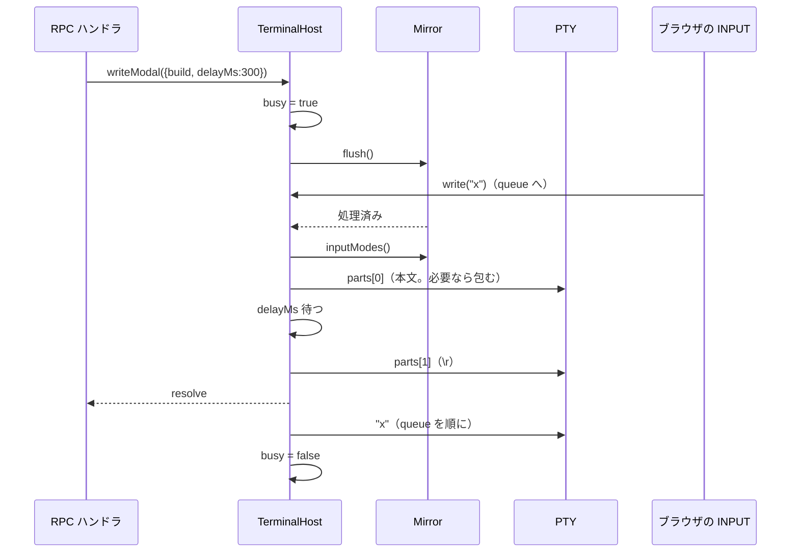
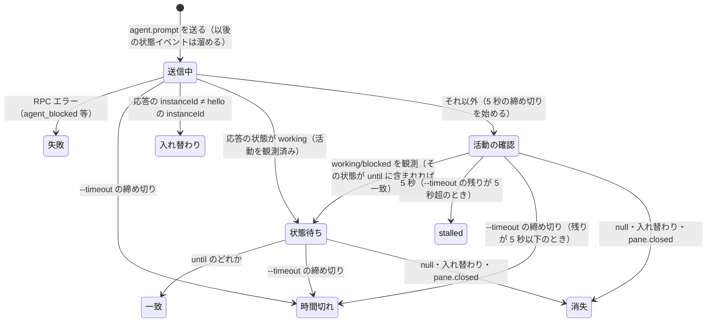

# 仕様: エージェントへの prompt 送信と待ち合わせ（`wtmctl agent prompt [--wait]`・`agent send-keys`）

## 概要

サーバに RPC `agent.prompt { paneId, text }` と `agent.send_keys { paneId, keys }` を足す。どちらも対象 pane の
`TerminalHost` に「ミラーを flush して**その瞬間の**端末のモードを読み、モードに合わせたバイト列を書く」入力
（以下「モード付き入力」）として積む。モード付き入力を書いている間（flush から最後の部分まで）に届いた他の入力は
後回しにし、終わったら届いた順に書く。prompt は「本文（bracketed paste が有効なら包む）→ 300ms → `\r`」の 2 部分、
send-keys は符号化したキー列の 1 部分。

CLI には `wtmctl agent prompt <paneId> <text> [--wait] [--until S]... [--timeout MS]` と
`wtmctl agent send-keys <paneId> <key>...` を足す。`--wait` の待ち合わせ（活動の確認・`agent_prompt_stalled`・
状態待ち）は前 work の `agent wait` と同じく、既存の `pane.agent_status_changed` の push を CLI 側で見て行う。

## 設計方針

- **送信はサーバ、待ち合わせは CLI**（decisions.md D1）。モード（bracketed paste・アプリケーションカーソル）を知っているのは
  サーバのミラーだけ（research F1・F2）で、割り込みを防げるのも PTY に書く `TerminalHost` だけ（F3）。待ち合わせは
  前 work で CLI 側に作った仕組み（hello の応答と同期して始める購読・`EventFeed`・`judgeWait`）がそのまま使え、
  サーバ側に接続ごとの待ちを持たずに済む。
  - 代替案: 待ち合わせもサーバの RPC（`agent.prompt` に `wait` を持たせる）にする——RPC の応答待ちの上限（CLI の 10 秒。
    `packages/cli/src/wsClient.ts:51`）を超える待ちになり、切断時の後始末もサーバに要るので退けた。
- **モードは flush してから読む**。`@xterm/headless` の書き込みは非同期で、書いた直後のモードは古い。空の書き込みの
  コールバックでそれまでの出力の処理を待ってから読む（research F1 の実測）。
- **後回しは `TerminalHost.write` の中で行う**。入力の経路（ブラウザ/CLI の INPUT・再開コマンド）は全部ここを通る（F3）。
  端末の問い合わせへの応答（`mirror.onResponse` → `pty.write`）は後回しにしない（応答を待って止まるアプリを止めないため）。
  モード付き入力が無いときは今までどおり即座に書く。
- **活動の確認の境目は「CLI が `agent.prompt` を送った瞬間」**。イベントには通し番号が無い（F10）ので、hello の応答から
  要求を送るまでに届いた状態のイベントは活動として数えない。要求を送った後に届いた `working`/`blocked` は数える。
  サーバが要求を処理し始める前に発行されたイベントがこの窓に入りうるが、(1) その時点で `blocked` ならサーバが
  `agent_blocked` で断り、(2) `working` ならサーバが返す「送信を始める時点のエージェント」が `working` になって活動の確認自体を
  省く。残るのは「処理前に `working` になり、処理前に `working` 以外へ戻った」場合だけで、herdr も要求を出す前の
  イベント番号を境目にしている（`src/api/wait.rs:218, 270-277`）ので同じ窓を持つ。
- **キーの符号化は xterm の既定（レガシー）の符号化**。kitty keyboard protocol は扱わない（decisions.md D1）。

## 対象範囲

- protocol: `packages/protocol/src/messages.ts`（`AgentPromptParams`・`AgentSendKeysParams` と 2 つの表への追加）、
  `packages/protocol/src/errors.ts`（code 5 つ）。
- server:
  - 追加 `packages/server/src/agent/agentInput.ts`（純関数: 包み方・キー名の解釈・符号化・定数）と `agentInput.test.ts`
  - 変更 `packages/server/src/terminal/Mirror.ts`（`inputModes()`・`flush()`）と `Mirror.test.ts`
  - 変更 `packages/server/src/terminal/TerminalHost.ts`（`writeModal()`・後回し・終了時の失敗）と追加 `TerminalHost.test.ts`
  - 追加 `packages/server/src/surface/methods/agent.ts`（2 つの RPC）と `agent.test.ts`、変更 `surface/methods/index.ts`
  - 変更（偽物の追従）: `Mirror` の偽物（`OutputFanout.test.ts`・`AgentMonitor.test.ts` の `FakeMirror`）に `inputModes`・`flush` を、
  `TerminalHost` の偽物（`GitInfoPoller.test.ts`・`AgentMonitor.test.ts`・`SizeAuthority.test.ts`・`surface/methods/index.test.ts`・
  `session/SessionService.test.ts`。`grep -rn "implements TerminalHost"` で 5 つ）に `writeModal` を足す
- web: `packages/web/src/net/clientError.ts`（新しい code の文言）と `clientError.test.ts`。
- cli: `packages/cli/src/cliArgs.ts`（2 コマンド・`USAGE`）・`main.ts`（分岐・ヘルプ）・`agentStatus.ts`（活動の確認の判定）・
  `commands/agent.ts`（`runAgentPrompt`・`runAgentSendKeys`）とそれぞれのテスト、`agent.integration.test.ts`（偽のエージェントの結合テスト）。
- docs: `docs/wtmctl.md`・`docs/herdr-parity.md`（H39 行）。deliver で `.aidev/backlog/product-roadmap.md` の本項目。

## 依拠する既存の事実

- ミラーのモードは `Terminal.modes.bracketedPasteMode`/`applicationCursorKeysMode` で読め、書き込みは非同期で、
  `write("", cb)` のコールバックはそれ以前の書き込みを処理した後に呼ばれる（research F1。typings `xterm-headless.d.ts:1335-1347` と実測）。
- `XtermMirror` は `@xterm/headless` を default import から取り出して使う（`packages/server/src/terminal/Mirror.ts:1-15`）。
- PTY への書き込みは `TerminalHost.write` → `pty.write`（`TerminalHost.ts:80-82`）。呼び出し元は `WsGateway.ts:115` と
  `SessionService.ts:1121`。問い合わせへの応答は `TerminalHost.ts:68` で `pty.write` を直接呼ぶ。`dispose` は多重呼び出しに安全で
  PTY を kill する（`TerminalHost.ts:95-106`）。PTY の終了は `pty.onExit` で分かる（`TerminalHost.ts:69-73`）。
- `TerminalManager.get(paneId)` で pane の `TerminalHost` を引ける（`TerminalManager.ts:43-45`）。
- pane のエージェントは `SessionService.getPane(id).agent`（`AgentInfo | null`。`SessionService.ts:214-216`、
  `packages/protocol/src/model.ts:107-122`）。状態は `state: "blocked"|"working"|"idle"|"unknown"`。
- RPC は `surface.register(name, { schema, handler })` で登録し、ハンドラが `RpcError(code, msg)` を投げるとその code で返り、
  zod の不一致は `invalid_params`（`packages/server/src/surface/ControlSurface.ts:33-48`、登録例 `surface/methods/pane.ts:150-158`）。
  ハンドラは async でよい（`pane.split`。`pane.ts:23-35`）。
- INPUT の経路はサイズ権限の「操作」を記録する（`WsGateway.ts:114` の `sizeAuthority.noteInteraction`）。外部クライアント
  （`kind: "external"`）は権限を取らず時刻だけ進む（`packages/server/src/clients/SizeAuthority.ts:49-55`）。
- `ErrorCode` の追加は web の `MESSAGES: Record<ErrorCode, string>` に網羅を要求する（`packages/web/src/net/clientError.ts:13`）。
- CLI の `WtmClient.request` は `ws.send` を Promise の executor 内で同期に行う（`packages/cli/src/wsClient.ts` の `requestRaw`）。
  応答待ちの上限は 10 秒（`wsClient.ts:51`）。`hello(onEventAfterHello)` は応答と同じ同期区間で購読を始める（前 work D9）。
- CLI の `EventFeed`・`requireAgentPane`・`viewOf`・`notRunning`（`packages/cli/src/commands/agent.ts`）、`statusOf`・`judgeWait`・
  `resolveUntil`・`AGENT_STATUSES`（`packages/cli/src/agentStatus.ts`）、`parseFlags` の `multi`・`parseTimerMs`・`parseAgentStatus`
  （`packages/cli/src/cliArgs.ts`）、`main.ts` の網羅チェック（`const exhaustive: never`）は前 work で入ったもの。
- 検出は argv[0] で行い、claude は OSC タイトルの braille 接頭辞で `working`・静的な接頭辞で `idle`（research F8・F9）。
  新しく見つけたエージェントの判定は 3 秒止まり、判定は 500ms 周期（research F9。`AgentTracker.ts:27-28`・`AgentMonitor.ts:21`）。
- CLI の状態は `statusOf`（`packages/cli/src/agentStatus.ts`）で導く: `state === "idle" && completionSeq > serverSeenSeq` なら `done`、
  それ以外は `state` そのまま。`--until` 省略時の既定は `DEFAULT_UNTIL = ["idle", "done", "blocked"]`（同ファイル。`resolveUntil` が空の
  配列をこれに置き換える）。
- RPC ハンドラは `MethodContext`（`clientId` を持つ）を第 1 引数に受ける（`packages/server/src/surface/ControlSurface.ts:10-16`）。
  テストは `ControlSurface.invoke(ctx, name, params)`（`ControlSurface.ts:31-48`）でスキーマ検証を含めて呼べる。
- CLI の `withSession(opts, store, fn)`（`packages/cli/src/withSession.ts:15`）が接続・再ログイン・後始末を行い、エラーは
  `reportAndExit`（`packages/cli/src/output.ts:55`）が stderr に JSON で出して終了コード 1（`CliUsageError` は 2）にする。
- herdr の仕様（300ms・5000ms・code・文言・キー名）は decisions.md D1 に出所つき。

## インターフェース / データ構造

### protocol

```ts
// messages.ts
export const MAX_AGENT_PROMPT_BYTES = 1024 * 1024; // INPUT フレームと同じ上限（WsGateway.ts:15）
export const AgentPromptParams = z.object({
  paneId: z.string(),
  text: z.string().refine((t) => new TextEncoder().encode(t).byteLength <= MAX_AGENT_PROMPT_BYTES, "text too large"),
});
export const AgentSendKeysParams = z.object({ paneId: z.string(), keys: z.array(z.string()).min(1).max(256) });
// 結果
"agent.prompt": { agent: AgentInfo };        // 送信を始める時点のエージェント
"agent.send_keys": Record<string, never>;
```

（protocol は web でも使うので `Buffer` を使わず `TextEncoder` で数える。）

```ts
// errors.ts の ErrorCode に追加
| "agent_not_found" | "agent_blocked" | "empty_agent_prompt" | "invalid_key" | "agent_prompt_failed"
```

- サーバが返す code だけを `ErrorCode` に足す。`agent_not_found` は前 work では CLI の中だけで作っていた code
  （`packages/cli/src/commands/agent.ts` の `requireAgentPane`）で、本 work でサーバも同じ名前で返すようになるので足す。
- `agent_prompt_stalled`・`agent_not_running`・`timeout`・`connection_closed` は CLI の中だけで作る code（`RpcFailure` に文字列で渡す。
  前 work の `agent wait` と同じ扱い）で、`ErrorCode` にも web の表にも足さない（サーバからは来ない）。

### server `agent/agentInput.ts`

```ts
export const AGENT_PROMPT_SUBMIT_DELAY_MS = 300;       // herdr AGENT_PROMPT_SUBMIT_DELAY
export interface InputModes { bracketedPaste: boolean; applicationCursorKeys: boolean }
export function pastePayload(text: string, bracketedPaste: boolean): string; // 有効なら ESC[200~ + text + ESC[201~
export interface KeySpec { key: string; ctrl: boolean; alt: boolean; shift: boolean } // key は正規化した名前か 1 文字
export function parseKey(name: string): KeySpec | null;                     // 不明なら null
export function encodeKey(spec: KeySpec, modes: InputModes): string | null; // 符号化できない組み合わせは null
```

キー名（herdr `src/config/keybinds.rs:1181-1290` の範囲のうち、下の表で符号化できるもの）:

- 区切りは `+`。修飾は `ctrl`/`control`・`alt`/`option`/`meta`・`shift`（大文字小文字を区別しない）。`cmd`/`super`/`hyper` は不明扱い。
- 別名: `C-c`/`c-c` → `ctrl+c`、`+` → `plus`。
- 名前: `enter`/`return`、`esc`/`escape`、`tab`（`shift+tab` は backtab）、`backspace`/`bs`、`space`、`up`/`down`/`left`/`right`、
  `f1`〜`f12`、記号名 `minus` `comma` `period` `slash` `backslash` `quote` `double_quote`/`double-quote` `semicolon` `colon`
  `percent` `ampersand` `backtick` `plus`、1 文字（大文字は shift つきの小文字として扱う）。

符号化（`m` = 1 + shift·1 + alt·2 + ctrl·4）:

解釈の細則: `+` で分けた部分に空のものがあれば不明（`ctrl++` は不明。`ctrl+plus` と書く。herdr と同じ）。記号名（`minus` 等）と
`space` 以外の 1 文字は下表の「文字 c」に当たる。shift は英字（大文字にする）・`tab`（backtab）・矢印と F キー（`m` に入る）にだけ効き、
記号の文字と `space` では無視する。ctrl+shift+英字は ctrl+英字と同じ。

| キー | 修飾なし | 修飾つき |
|---|---|---|
| enter | `\r` | alt: `ESC \r`、他は符号化不可 |
| esc | `ESC` | alt: `ESC ESC`、他は不可 |
| tab | `\t` | shift: `ESC[Z`、alt: `ESC\t`、他は不可 |
| backspace | `0x7f` | alt: `ESC 0x7f`、他は不可 |
| space | ` ` | ctrl: `0x00`、alt: `ESC ` |
| 矢印 | 通常 `ESC[A/B/C/D`、アプリケーションカーソル時 `ESCOA/B/C/D` | `ESC[1;{m}A/B/C/D` |
| f1〜f4 | `ESCOP/Q/R/S` | `ESC[1;{m}P/Q/R/S` |
| f5〜f12 | `ESC[15~` `17~` `18~` `19~` `20~` `21~` `23~` `24~` | `ESC[15;{m}~` 等 |
| 文字 c | c（shift なら大文字） | ctrl: 英字は `c & 0x1f`、`@[\]^_` は `& 0x1f`、`?` は `0x7f`、他は不可／alt: `ESC` ＋（alt を除いた符号） |

### server `Mirror` / `TerminalHost`

```ts
// Mirror
inputModes(): InputModes;   // term.modes から
flush(): Promise<void>;     // term.write("", resolve)

// TerminalHost
/** 端末のモードに合わせて作る入力（20260926-agent-prompt-send-keys）。parts の間に delayMs を置く。 */
export interface ModalInput { build(modes: InputModes): string[]; delayMs: number }
writeModal(input: ModalInput): Promise<void>;
```

`DefaultTerminalHost` の内部状態: `busy: boolean`（モード付き入力を処理中）と `queue: Array<{ kind: "raw"; data } | { kind: "modal"; input; resolve; reject }>`。

### server RPC（`surface/methods/agent.ts`）

- `agent.prompt`: 下の「振る舞い」。結果 `{ agent }`。
- `agent.send_keys`: 下の「振る舞い」。結果 `{}`。

### cli

```ts
// cliArgs.ts の Command に追加
| { kind: "agent-prompt"; opts: GlobalOpts; paneId: string; text: string; wait: boolean; until: AgentStatus[]; timeoutMs: number | undefined }
| { kind: "agent-send-keys"; opts: GlobalOpts; paneId: string; keys: string[] }

// agentStatus.ts
export const PROMPT_EFFECT_TIMEOUT_MS = 5000;           // herdr AGENT_PROMPT_EFFECT_TIMEOUT_MS
export class PromptWait {                               // 活動の確認 → 状態待ち の判定（純粋。時計を持たない）
  constructor(expectedInstanceId: string, until: readonly AgentStatus[], activityObserved: boolean);
  get activityObserved(): boolean;
  observe(current: AgentInfo | null): WaitVerdict;      // "match" | "gone" | "pending"
}
```

`PromptWait.observe`: `current` が null か `instanceId` 違い → `gone`。活動が未観測で `statusOf(current)` が `working`/`blocked` なら
活動を観測済みにする。活動を観測済みで `until` に `statusOf(current)` が含まれる → `match`。それ以外 → `pending`
（活動が未観測のうちは `until` に含まれる状態でも `pending`）。

出力: `agent prompt` は `{ agent: AgentView }`（`--wait` 無しはサーバが返したエージェント、`--wait` は一致した時点のもの）、
`agent send-keys` は `{ ok: true, paneId }`。

## 振る舞いの詳細

### `TerminalHost.writeModal` と後回し



- `write(data)`: `busy` なら `queue` の末尾へ `raw` として積む。そうでなければ即座に `pty.write`。
- `writeModal(input)`: `busy` なら `queue` の末尾へ `modal` として積み、順番が来たら始める。そうでなければすぐ始める。
  始めたら `busy = true` → `await mirror.flush()` → `parts = build(mirror.inputModes())` → `parts` を順に `pty.write`、
  部分の間で `delayMs` 待つ（`setTimeout`）→ resolve → `queue` を先頭から処理する（`raw` は即座に書き、`modal` に当たったら
  それを始めて止まる）→ `queue` が空になったら `busy = false`。
- 終了（`dispose` または PTY の終了）したら `closed = true` にし、処理中と `queue` の `modal` を `Error("terminal closed")` で reject し、
  `raw` は捨て、`queue` を空に、`busy = false` にし、部分の間の待ちの `setTimeout` を解除する。処理中の `mirror.flush()` が後から解決しても、
  `closed` を見て何も書かずに終わる。以後の `writeModal` は即座に reject、`write` は今までどおり `pty.write` に渡す（既存の振る舞い。
  dispose 後の書き込みは呼び出し元が `TerminalManager.get` で弾いている）。`build` が投げた場合も reject し、次の `queue` へ進む。

### `agent.prompt`（サーバ）

1. `text === ""` → `RpcError("empty_agent_prompt", "agent prompt must not be empty")`。
2. `pane = session.getPane(paneId)`。無い・`pane.agent === null` → `agent_not_found`。`terminals.get(paneId)` が無い → `agent_not_found`。
3. `pane.agent.state === "blocked"` → `agent_blocked`（"agent in pane <id> is blocked and requires interactive input"）。書かない。
4. `agent = pane.agent`（送信を始める時点）を控え、`sizeAuthority.noteInteraction(clientId, paneId)`。
5. `await host.writeModal({ build: (m) => [pastePayload(text, m.bracketedPaste), "\r"], delayMs: AGENT_PROMPT_SUBMIT_DELAY_MS })`。
   reject されたら `RpcError("agent_prompt_failed", <理由>)`。
6. `{ agent }` を返す。

### `agent.send_keys`（サーバ）

1. `specs = keys.map(parseKey)`。1 つでも null、または `encodeKey(spec, { bracketedPaste: false, applicationCursorKeys: false })` が null
   （符号化できない組み合わせ。可否はモードに依らない）なら `RpcError("invalid_key", "unsupported key <name>")`（書かない）。
2. pane・エージェント・`TerminalHost` の確認は `agent.prompt` の 2 と同じ（`blocked` は断らない）。
3. `noteInteraction` → `await host.writeModal({ build: (m) => [specs.map((s) => encodeKey(s, m)).join("")], delayMs: 0 })`。
   `writeModal` が reject されたら（pane が閉じた）`agent_not_found` で返す。
4. `{}` を返す。

### `wtmctl agent prompt`（CLI）



1. 開始時刻を取り、`--timeout` があれば締め切り＝開始＋`timeoutMs`。締め切りのタイマーを張る（`--wait` のときだけ）。
2. `hello(events.push)` → `requireAgentPane`（前 work の関数。無ければ `agent_not_found`）。
3. `--wait` 無し: `request("agent.prompt")` の結果のエージェントを `viewOf` で出す。
4. `--wait`: `events.drain(sink)` で購読を始める。`sink` は tab/pane の位置のイベントは常に反映し、状態のイベント
   （`pane.agent_status_changed`・対象の `pane.closed`）は「要求を送った後」だけ扱う。要求を送る直前に `submitted = true`。
   応答が来るまでは状態のイベントを配列に溜め、応答が来たら:
   - 応答の `agent.instanceId` が hello の時点と違えば `agent_not_running`。
   - `tracker = new PromptWait(instanceId, resolveUntil(until), statusOf(agent) === "working")`。活動を観測済みなら
     `tracker.observe(agent)` で即座に一致を判定する（`until` に `working` があれば一致）。
   - 溜めたイベントを順に `tracker.observe`（`pane.closed` は消失）。以後のイベントも同じ。
   - その時点で活動が未観測なら、締め切りまでの残りが `PROMPT_EFFECT_TIMEOUT_MS` を超える（または締め切りが無い）ときだけ
     5 秒のタイマーを張る。発火したら（まだ未観測なら）`agent_prompt_stalled`（"agent prompt produced no observed working or blocked
     state within 5000 ms; current status is <最新の status>"。最新の status は CLI が持つ「最後に見たエージェント」——応答の
     エージェント、以後は届いたイベントのエージェント——の `statusOf`）。残りが 5 秒以下なら張らない（締め切りのタイマーが `timeout` にする）。
   - 活動を観測したら 5 秒のタイマーを外す。
5. 一致 → そのエージェントを `viewOf`（位置は追跡した tab）で出す。消失 → `agent_not_running`。締め切り → `timeout`
   （"timed out waiting for agent status"。送信中に来ても同じ）。切断 → `connection_closed`。終わるときタイマーを全部外す。

### `wtmctl agent send-keys`（CLI）

`hello` → `requireAgentPane` → `request("agent.send_keys", { paneId, keys })` → `{ ok: true, paneId }`。

## ドメイン固有の考慮

- **安全**: 新しい入口は作らない。2 つの RPC は既存の WebSocket（token 認証の session cookie・Origin/Host 検査を通った接続）の
  `ControlSurface` に登録するだけで、既存の INPUT フレームで書けるのと同じ範囲のバイト列しか書けない（端末に書ける権限は
  既に INPUT で持っている）。本文の大きさは INPUT と同じ 1MB。`blocked` では書かないので、ダイアログへの誤答を prompt 経由で
  起こさない。CLI は `withSession` 以外で接続しない。
- **herdr との違い（docs に書く）**: 対象は pane ID だけ／キーの符号化は xterm の既定だけ（kitty keyboard protocol 無し）／
  Windows の Codex・Copilot 向けの回避策は無い／`agent_not_ready` は無い（検出されていれば送る）／`--timeout` が送信中に尽きたら
  その時点で `timeout`（herdr の Unix 版は送信の完了を待つ）。共通の注意として、`timeout`・`agent_prompt_stalled` は
  「送られなかった」ことを意味しない（再送の前に `agent read` で確かめる）。

## エラー処理 / 異常系

| 状況 | code | 終了コード |
|---|---|---|
| 本文が空 | `empty_agent_prompt` | 1 |
| pane が無い / エージェントが居ない / `TerminalHost` が無い | `agent_not_found` | 1 |
| エージェントが `blocked`（prompt のみ） | `agent_blocked` | 1 |
| 送信中に pane が終了・破棄された（prompt） | `agent_prompt_failed` | 1 |
| 不明なキー名・符号化できない組み合わせ（send-keys） | `invalid_key` | 1 |
| 本文が 1MB 超・keys が空/257 個以上（RPC の引数） | `invalid_params` | 1 |
| 5 秒以内に活動を観測できない（`--wait`） | `agent_prompt_stalled` | 1 |
| `--timeout` の締め切り（`--wait`） | `timeout` | 1 |
| 待ち中にエージェントが居なくなる・入れ替わる・pane が閉じる | `agent_not_running` | 1 |
| 待ち中の切断 | `connection_closed` | 1 |
| `agent.prompt` の応答が CLI の RPC の応答待ちの上限（10 秒）を超えた（別の送信の後ろで待たされた等） | `timeout` | 1 |
| `--until`/`--timeout` を `--wait` 無しで・未知の状態名・不正な `--timeout`・位置引数の過不足・キーが 0 個 | （使い方） | 2 |

send-keys の途中で pane が終了した場合（`writeModal` の reject）は `agent_not_found` で返す（エージェントも pane も既に無い）。

## 受け入れ基準との対応

- AC1: `pastePayload` の単体テスト（有効/無効）と、`TerminalHost.writeModal` の単体テスト（偽 PTY の `onData` に
  `ESC[?2004h`/`ESC[?2004l` を流してからの送信で包み方が変わる）。入力はミラーのモード（PTY の出力から）。`agent.prompt` の
  ハンドラのテストで `build` に本文が渡ること。
- AC2: `TerminalHost` の単体テスト（フェイクタイマー）で、本文を書いた後 299ms 進めても `\r` が無く、300ms で書かれる。
  遅延の値は `AGENT_PROMPT_SUBMIT_DELAY_MS`（ハンドラが渡す）。
- AC3: `TerminalHost` の単体テストで、送信中の `write` が `\r` の後に元の順序で書かれ、送信が無いときの `write` は即座に書かれる。
- AC4: `agent.prompt` のハンドラのテスト（`writeModal` が resolve してから `{ agent }` が返る）と、CLI `runAgentPrompt`
  （`--wait` 無し）の単体テスト（偽クライアント。出力 `{ agent }`）。
- AC5: `agent.prompt` のハンドラのテスト（`blocked` → `agent_blocked` で `writeModal` が呼ばれない／pane 無し・agent 無し →
  `agent_not_found`／空 → `empty_agent_prompt`）。入力は `session.getPane` の `agent.state`。
- AC6: `PromptWait` の単体テスト（活動未観測の `idle`/`done` は pending）と、`runAgentPrompt --wait` の単体テスト（要求を送る前に
  届いた `working` は数えない／送った後の `idle` だけでは返らない）。入力はサーバの `pane.agent_status_changed`。
- AC7: `runAgentPrompt --wait` の単体テスト（フェイクタイマー）: 応答の後 4999ms で未確定・5000ms で `agent_prompt_stalled`
  （メッセージに status）／`--timeout` の残りが 5000ms 以下なら締め切りで `timeout`／締め切り前に `working` が来れば stalled にならない。
- AC8: `PromptWait` と `runAgentPrompt --wait` の単体テスト（`working` の後の `idle` で一致・`blocked` の観測で既定なら即一致・
  `--until` の複数指定・応答が `working` なら確認を省く）。結合テスト（AC13）でも実際の遷移で確かめる。
- AC9: `runAgentPrompt --wait` の単体テスト（null・入れ替わり・`pane.closed`・応答の instanceId 違い → `agent_not_running`／
  締め切りで `timeout`／送信中の締め切りも `timeout`／`--timeout` 省略時は 5 秒以降 60 秒進めても返らない）。`cliArgs.test.ts` で終了コード 2 の各場合。
- AC10: `encodeKey`・`parseKey` の単体テスト（表の各行・アプリケーションカーソル）と、`agent.send_keys` のハンドラのテスト
  （`blocked` でも書く・`{}`）、CLI `runAgentSendKeys` の単体テスト（`{ ok: true, paneId }`）。
- AC11: `agent.send_keys` のハンドラのテスト（不明なキーを 1 つ含むと `invalid_key` で `writeModal` が呼ばれない・pane/agent 無し →
  `agent_not_found`）、`cliArgs.test.ts`（キー 0 個 → 使い方の誤り）。
- AC12: `surface/methods/index.ts` への登録（`ControlSurface` 経由でスキーマ検証されることをハンドラのテストで `invoke` から確かめる：
  1MB 超 → `invalid_params`）。CLI 2 コマンドが `withSession` を通ることを単体テスト（`withSession` をモック）。stderr の JSON は既存の
  `reportAndExit`（変更なし）。web の `MESSAGES` に 5 つの code（型検査が網羅を保証し、`clientError.test.ts` で汎用文言でないこと）。
- AC13: `agent.integration.test.ts` に偽のエージェントの結合テスト。node のスクリプトを `exec -a claude <node> <script>` で pane に起動し、
  スクリプトは `ESC[?2004h` を出して raw モードで stdin を読み、受け取ったチャンクと時刻をファイルに記録し、`\r` を受けたら OSC タイトルを
  `⠂ …`（working）にして 1.5 秒後に `✳ …`（idle）へ戻す。起動後は `✳ …` を出して検出の猶予（3 秒）を越え `idle` になるのを待ってから
  `runAgentPrompt --wait --timeout 30000` で複数行の本文を送る。確かめること: 成功（`status` が `idle`/`done`）／記録で `ESC[200~本文ESC[201~`
  が `\r` より前に 1 続きで届き、`\r` はその後に単独で届き、間が 250ms 以上ある。入力は実サーバの検出（research F8・F9）。
- AC14: `docs/wtmctl.md` に 2 コマンドと herdr との違い、`docs/herdr-parity.md` の H39 行の更新、deliver での backlog の `[x]`。
- AC15: test 工程で `pnpm -s build` → `pnpm -s typecheck`（終了コードで判定）/ `pnpm -s test` ×2 / `aidev smoke`。
