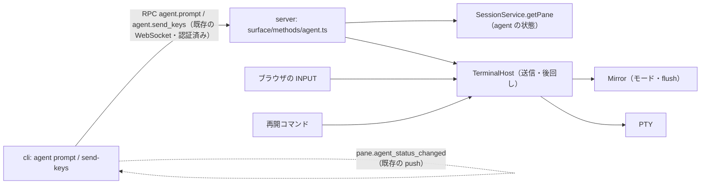

# 調査: エージェントへの prompt 送信と待ち合わせ

herdr 側の仕様（一次資料）は decisions.md D1 に出所つきで書いた。ここは本製品側の既存挙動と実装の起点。

## 調査の問い

- Q1: サーバのミラーは bracketed paste・アプリケーションカーソルのモードを「送る瞬間」に正しく持っているか。
- Q2: PTY への書き込みの経路は何本あり、どこで「送信中は後回し」を実現できるか。
- Q3: RPC のエラー code はどう決まり、新しい code を足すと何が波及するか。
- Q4: 実 PTY 上の偽のエージェント（node で書く）が既存の検出規則で `claude` として検出され、状態が画面から判定されるか。
- Q5: CLI 側で「送信を始めた後のイベント」の境目をどこに置けるか。
- Q6: `TerminalHost` の単体テストで、書き込みの順序と遅延を手で進める時計で確かめられるか。

## 判明した事実

- F1（Q1）: `@xterm/headless` の `Terminal.modes` は `bracketedPasteMode`・`applicationCursorKeysMode` を読める
  （`node_modules/.pnpm/@xterm+headless*/node_modules/@xterm/headless/typings/xterm-headless.d.ts:1335-1347` の `IModes`）。
  ただし `write()` は非同期に処理されるので、**書いた直後はモードが古い**。空文字の `write("", cb)` のコールバックは
  それ以前の書き込みを全部処理した後に呼ばれる。実測（scratchpad で node 実行）:
  `write("\x1b[?2004h\x1b[?1h")` の直後は `false false`、`write("", cb)` のコールバック内では `true true`、
  続けて `\x1b[?2004l` を書いて同様に待つと `false`。
- F2（Q1）: ミラーへの書き込みは PTY の出力ごとに `XtermMirror.write` が行う（`packages/server/src/terminal/TerminalHost.ts:43-55`、
  `Mirror.ts:132-142`。未処理のバイト数は `pendingBytes()`）。`Mirror` インタフェースにモードを読む口は無い（`Mirror.ts:25-47`）。
- F3（Q2）: PTY への書き込みは `TerminalHost.write`（`TerminalHost.ts:80-82`）を通るものが 2 本——ブラウザ/CLI の INPUT フレーム
  （`packages/server/src/ws/WsGateway.ts:112-115`）と、エージェントの再開コマンド（`packages/server/src/session/SessionService.ts:1121`）。
  端末の問い合わせへの応答（DA・CPR 等）は `this.pty.write` を直接呼ぶ別経路（`TerminalHost.ts:68`）で、`write` を通らない。
- F4（Q2）: `TerminalHost` を `implements` するテスト用の偽物が 3 つある（`packages/server/src/git/GitInfoPoller.test.ts:17`、
  `packages/server/src/agent/AgentMonitor.test.ts:56`、`packages/server/src/clients/SizeAuthority.test.ts` の同形のクラス）。
  `Mirror` を `implements` する偽物は 2 つ（`OutputFanout.test.ts:7`、`AgentMonitor.test.ts:17`）。インタフェースに
  必須のメソッドを足すとこれらの型検査が落ちる。
- F5（Q3）: RPC ハンドラが `RpcError(code, message)` を投げると `ControlSurface.invoke` がそのまま `{code, message}` で返す
  （`packages/server/src/surface/ControlSurface.ts:41-48`）。スキーマ（zod）の不一致は `invalid_params`（:34-36）。
  `ErrorCode` は `packages/protocol/src/errors.ts:2-22` の union で、web の `MESSAGES: Record<ErrorCode, string>`
  （`packages/web/src/net/clientError.ts:13`）が網羅を型で要求する。CLI は code を文字列のまま出す（`packages/cli/src/wsClient.ts` の `RpcFailure`）。
- F6（Q3）: RPC の登録は `surface.register(name, { schema, handler })`（例 `packages/server/src/surface/methods/pane.ts:150-158`）、
  メソッド名 → 引数・結果の型は `packages/protocol/src/messages.ts:400-500` の 2 つの表。登録関数は `surface/methods/index.ts` で束ねる。
  ハンドラは `MethodDeps`（`surface/methods/deps.ts`）の `session`・`terminals` を使える。
- F7（Q3）: WebSocket のテキストフレームの上限は 4MB（`packages/server/src/ws/WsServerWs.ts:16`）、INPUT フレームは 1MB
  （`WsGateway.ts:15`）。
- F8（Q4）: 検出は前面プロセスの `/proc/<pid>/cmdline` の argv[0] で行う（`packages/server/src/platform/LinuxProcessInspector.ts:63-64, 112-121`、
  `packages/server/src/agent/ProcessMatcher.ts:21-45`）。`exec -a claude <node の絶対パス> <script>` なら argv[0] が `claude` になる
  （E2E の偽エージェントは `exec -a claude bash <script>`。`packages/e2e/src/specs/agent-detection.spec.ts:14-19`。シバン経由だと argv[0] が
  インタプリタ名に書き換わる）。
- F9（Q4）: claude のマニフェストは OSC タイトルの braille 接頭辞（例 `⠂ project`）を `working`、静的な接頭辞（`✳ project`）を
  `idle` と判定する（`third_party/herdr/agent-detection/claude.toml:7-15, 217-`、`packages/server/src/agent/ManifestEngine.test.ts:78-88`）。
  新しいエージェントの判定は見つけてから 3 秒止まる（`packages/server/src/agent/AgentTracker.ts:27-28, 90`）。判定は 500ms 周期
  （`AgentMonitor.ts:21`）。`composeServer` は `listen` 後に `AgentMonitor` を動かす（`packages/server/src/composeServer.ts:199, 276`）。
- F10（Q5）: CLI の `WtmClient.hello(onEventAfterHello)` は hello の応答を受けたその場でイベントの購読を始める
  （`packages/cli/src/wsClient.ts` の `hello`、前 work の decisions.md D9）。イベントには通し番号が無い。1 本の WebSocket 上の
  順序は保たれ、イベントは発行と同時に全接続へ送られる（`WsGateway.ts:82-84`）。
- F11（Q6）: `DefaultTerminalHost` は `PtyProcess`（`packages/server/src/pty/PtyBackend.ts`）を受け取るだけなので、`write` を記録する
  偽の `PtyProcess` で単体テストできる（偽 PTY の例 `packages/server/src/terminal/TerminalManager.test.ts:6-21`）。ミラーは内部で
  `XtermMirror` を作る（`TerminalHost.ts:40`）ので、モードは偽 PTY の `onData` にエスケープを流して切り替えられる。

## 影響範囲

- protocol: `messages.ts`（2 メソッド）・`errors.ts`（新しい code）。web: `clientError.ts` の表。
- server: `Mirror`・`TerminalHost` のインタフェースとその偽物（F4）、新しい `surface/methods/agent.ts`、`index.ts`。
- cli: `cliArgs.ts`・`main.ts`・`commands/agent.ts`・`agentStatus.ts` とテスト。

## 実現性 / リスク

- モードは flush してから読めば「送る瞬間」の値になる（F1）。flush の間に届く出力は、その後にまた読み直さない限り反映されないが、
  それは送る瞬間の後の変化で、herdr も同じ（送る時点の端末の状態で決める）。
- 「後回し」は `TerminalHost.write` の中で実現できる（F3 の 2 本とも通る）。問い合わせへの応答は後回しにしない（F3。
  応答を待って止まるアプリを止めないため）。
- 偽のエージェントは node で書けば、受け取ったバイト列と時刻を正確に記録できる（F8）。検出の 3 秒の猶予（F9）を越えて
  `idle` になるのを待ってから送る必要がある。

## 実装アンカー

- A1: モードの読み取りと flush を足す（`packages/server/src/terminal/Mirror.ts:25-47` の `Mirror`、`XtermMirror` の `write` 付近 :132）。
- A2: 送信と後回し（`packages/server/src/terminal/TerminalHost.ts:8-19` の `TerminalHost`、`write` :80-82、`dispose` :95-）。
- A3: 偽物の追従（`GitInfoPoller.test.ts:17`・`AgentMonitor.test.ts:17, 56`・`SizeAuthority.test.ts`・`OutputFanout.test.ts:7`）。
- A4: RPC の登録（新規 `packages/server/src/surface/methods/agent.ts`、`surface/methods/index.ts`）。
- A5: RPC の型（`packages/protocol/src/messages.ts:400-500`）、エラー code（`packages/protocol/src/errors.ts:2-22`）。
- A6: web の表（`packages/web/src/net/clientError.ts:13-38`）。
- A7: CLI の引数（`packages/cli/src/cliArgs.ts` の `USAGE`・`Command`・`parseAgent`）、分岐とヘルプ（`packages/cli/src/main.ts:31-39, 78-85`）、
  実行（`packages/cli/src/commands/agent.ts` の `EventFeed`・`requireAgentPane`・`viewOf`）、判定（`packages/cli/src/agentStatus.ts` の `statusOf`・`judgeWait`）。
- A8: 結合テストの土台（`packages/cli/src/agent.integration.test.ts:1-120` の実サーバの立て方・`captureStdout`）。

## 実装時の注意

- `@xterm/headless` は default import から取り出す（`Mirror.ts:1-4` のコメント。named import は `node dist` で落ちる）。
- `TerminalHost.write` は今は同期で PTY に書く。送信が無いときの挙動（即座に書く）は変えない（既存テストと E2E の前提）。
- 問い合わせへの応答（`mirror.onResponse` → `pty.write`）は後回しにしない。
- `SessionService` は並行の別 work（名前付き session）が触る領域なので、読み取り（`getPane`）だけを使い変更しない。

## design への申し送り

- RPC の結果に何を返すか（送信を始める時点のエージェント）と、CLI の「送信を始めた後」の境目（要求を送る瞬間）を design で確定する。
- 送信中に pane が閉じる・PTY が終わる場合のエラー code（`agent_prompt_failed`）を design で確定する。
- キー名 → バイト列の表（xterm の既定の符号化）を design に書く。
