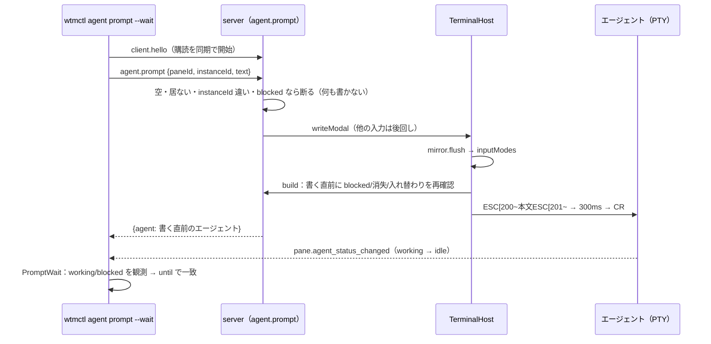

# レビューガイド: `wtmctl agent prompt [--wait]`・`agent send-keys`

## 変更概要 / 目的

herdr の `agent prompt`（`--wait`）・`agent send-keys` 相当。エージェントへ複数行の指示を 1 つの貼り付けとして渡し、300ms 後の Enter で確定させる。
`blocked`（承認・質問の入力待ち）には送らない。`--wait` は送った仕事が始まった（working/blocked を観測した）ことを確かめてから終わるまで待つ。
送信（モードの判定・遅延 Enter・割り込みの後回し）はサーバ、待ち合わせは CLI（前 work の `agent wait` と同じ push のイベント）。範囲の選び方は decisions.md D1。

## 重要ポイント

- **送る瞬間のモード**: `@xterm/headless` の書き込みは非同期なので、`Mirror.flush()`（空の書き込みのコールバック）でそれまでの出力を処理してから `inputModes()` を読む（research F1）。
- **送信中の割り込みを後回し**: `TerminalHost.writeModal()` の処理中（flush から Enter まで）に届いた `write`/`writeModal` はキューに積み、終わったら届いた順に書く。端末の問い合わせへの応答は後回しにしない。
- **誤送信を防ぐ 3 段の確認**: 受け付け時（`blocked`・CLI が見た `instanceId` との一致。D12）→ 書く直前（`build` の中で blocked・消失・入れ替わり。D7）→ CLI 側で応答の `instanceId`。
- **活動の確認の境目**: CLI は `agent.prompt` を送った後に届いた状態だけを数える。サーバは本文を書く直前のエージェントを返し（D10）、それが working なら確認を省く。5 秒で `agent_prompt_stalled`、`--timeout` の残りが 5 秒以下なら締め切りの `timeout`。
- **herdr との違い**（docs/wtmctl.md 末尾）: 本文中の貼り付けの印を取り除く（D11）・書く直前の再確認（D7）・Windows の回避策と kitty keyboard は無い。

## 処理フロー

## 主要な変更箇所

- `packages/server/src/terminal/TerminalHost.ts` — `writeModal`・`runModal`・`drainQueue`・`closeInput`（後回しと終了時の後始末）
- `packages/server/src/terminal/Mirror.ts` — `inputModes`・`flush`
- `packages/server/src/agent/agentInput.ts` — `pastePayload`（印の除去）・`parseKey`・`encodeKey`（xterm の既定の符号化の表）
- `packages/server/src/surface/methods/agent.ts` — 2 つの RPC と 3 段の確認
- `packages/cli/src/commands/agent.ts` — `promptAndWait`（境目・stall のタイマー・締め切り）・`runAgentSendKeys`
- `packages/cli/src/agentStatus.ts` — `PromptWait`
- `packages/cli/src/agentPrompt.integration.test.ts` — node の偽エージェント（argv[0]=claude）での結合テスト

## リスク / 確認したい点

- **本物のエージェント（Claude Code・Codex）での送信は未検証**（偽のエージェントのみ）。backlog に確認を `[ ]` で残す（D13）。
- 状態の判定は 500ms 周期なので、書く直前の再確認にも判定の遅れの分の窓は残る（D7・D10）。
- `TerminalHost` のインタフェースに `writeModal` を足したので、テスト用の偽物 5 つ（並行 work が触る `SessionService.test.ts` を含む）に 1 メソッドずつ足している。
- `--wait` 中の `agent_not_running`・`timeout`・`agent_prompt_stalled`・`agent_prompt_failed` は「送られなかった」ことを意味しない（docs に明記）。
