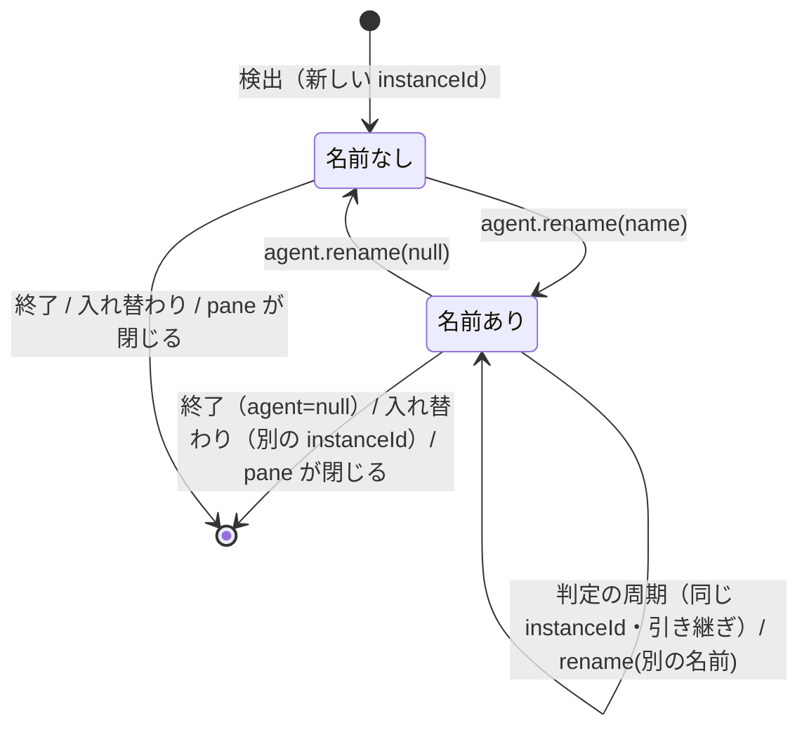

# 仕様: エージェントの名前（`wtmctl agent rename` と名前による対象指定）

## 概要

`AgentInfo` に省略可の `name` を足し、サーバの `SessionService` が名前の設定・一意性の検査・判定の周期をまたいだ
引き継ぎを受け持つ。名前を変える RPC `agent.rename` を既存の `/ws` に足し、`wtmctl agent rename` から呼ぶ。
エージェントを指す CLI のサブコマンドは、hello の snapshot で「pane ID → 名前」の順に対象を解決し、以後は
既存どおり `paneId` と `instanceId` で動く。web はサイドバーのエージェントの行と pane の呼び名に名前を出す。

## 設計方針

- **名前は `SessionService` が持つ公開状態（`Pane.agent`）の一部とし、検出（`AgentTracker`）には持たせない**
  （decisions.md D2）。名前は利用者の操作で決まる値で、検出の結果ではない。`SessionService` は全 pane を見られるので
  一意性の検査をその場で原子的に行え（JS の 1 回の同期処理）、判定の周期の `updatePaneRuntime` で「同じ `instanceId` なら
  前の名前を引き継ぐ」規則を 1 か所に置ける。cli の smoke のように検出を経ずに注入したエージェントにも同じに効く。
- **`AgentInfo.name` は省略可（`name?: string`）**。省略＝名前なし（decisions.md D3）。既存の `AgentInfo` のリテラル
  （30 ファイル。research F2.5）と、名前を知らない受け手をそのまま通す。CLI の出力（`AgentView`）では `name: string | null`
  に正規化して常に出す（herdr の `AgentInfo.name` は `Option<String>` で常に出る。research F1.3）。
- **名前の解決は CLI で行う**（decisions.md D4）。既存のサブコマンドは hello の snapshot で pane を引き、
  書き込みの RPC に `instanceId` を渡してサーバが 2 回照合している（research F4.1〜F4.3）。名前もその場で pane と
  `instanceId` に解決すれば、入れ替わりの照合（FR12）を変えずに使える。サーバの RPC は pane ID だけを受ける。
- 名前は `instanceId`（検出の 1 回分）に付く。本製品は種類が変わる・前面からエージェントが消えると新しい
  `instanceId` で作り直す（research F2.2）ので、「終了・入れ替わりで消える」（FR8）は引き継ぎの条件
  （同じ `instanceId` のときだけ）から自然に出る。

## 対象範囲

- protocol: `packages/protocol/src/model.ts`（`AgentInfo.name`）・新規 `packages/protocol/src/agentName.ts`（書式の
  判定。テスト `agentName.test.ts`）・`packages/protocol/src/index.ts`（export）・`packages/protocol/src/messages.ts`
  （`AgentRenameParams`・`AgentRenameResult`・`METHOD_SCHEMAS`・`MethodResultMap`）・`packages/protocol/src/errors.ts`
  （`invalid_agent_name`・`agent_name_taken`）。
- server: `packages/server/src/session/SessionService.ts`（`renameAgent`・`updatePaneRuntime` の引き継ぎ・`sameAgent`）・
  `packages/server/src/surface/methods/agent.ts`（`agent.rename` の登録）。テストは新しいファイル
  `SessionService.agentName.test.ts`・`surface/methods/agentRename.test.ts`（並行 work との重なりを避ける。research「実装時の注意」）。
- cli: `packages/cli/src/agentTarget.ts`（新規。対象の解決。テスト `agentTarget.test.ts`）・`packages/cli/src/agentStatus.ts`（`AgentView.name`）・
  `packages/cli/src/commands/agent.ts`（解決の差し替え・`runAgentRename`）・`packages/cli/src/cliArgs.ts`
  （`agent rename`・位置引数の名前を `target` に）・`packages/cli/src/main.ts`（help・switch）・`packages/cli/src/smoke.ts`。`agent rename` の解析のテストは
  `cliArgs.test.ts` に新しい `it`、`runAgentRename` と名前での指定のテストは新しいファイル `commands/agentRename.test.ts`。
- web: `packages/web/src/store/paneName.ts`・`packages/web/src/components/Sidebar.vue`。テストは `paneName.test.ts`・
  `Sidebar.test.ts` に新しい `it`。
- docs: `docs/wtmctl.md`・`docs/herdr-parity.md`（H39）。

## 依拠する既存の事実

- `AgentInfo` は `packages/protocol/src/model.ts:107-122`、`Pane.agent` は `:84`。
- 本番で `Pane.agent` を変えるのは `AgentMonitor` の `judge`（`packages/server/src/agent/AgentMonitor.ts:195-199`）と
  `handleFocusChanged`（`:100-105`）だけで、どちらも `SessionService.updatePaneRuntime`（`SessionService.ts:888`）を通る
  （`grep -rn "updatePaneRuntime" packages/server/src --include=*.ts` で、テスト以外の呼び出しはこの 2 つと
  `session.updatePaneRuntime` 自身の定義）。
- `AgentTracker` は種類が変わる／初めて見つけると新しい `instanceId` を払い出し（`AgentTracker.ts:94-110`）、前面から
  消えると `null` を返す（`:86-90`）。状態の更新は `{ ...current, … }` で `instanceId` を保つ（`:118-124`・`:130-134`）。
  `AgentTracker` の `info` は名前を知らない（本 design でも持たせない）。
- `SessionModel.updatePaneRuntime` は `agent` を丸ごと置き換える（`packages/server/src/session/SessionModel.ts:838-850`）。
- `sameAgent`（`SessionService.ts:1177-1190`）が全項目を比べ、違うときだけ `pane.agent_status_changed` を発行する（`:902, 909-911`）。
- pane が閉じると pane ごと消え、`Pane.agent` も消える（`SessionModel.closePane` が pane の表から消す
  `packages/server/src/session/SessionModel.ts:325-334`、tab・workspace を閉じるときも同じく `:527`・`:560`。
  `AgentMonitor.tick` は消えた pane の tracker を捨てる `AgentMonitor.ts:113-120`）。
- CLI の見え方の `workspaceId` は hello の snapshot の tab から引く（`packages/cli/src/commands/agent.ts:40-62`
  `workspacesByTab`・`viewOf`）。`wait` の途中の入れ替わり・消失は `agent_not_running`（`commands/agent.ts:78-80`
  `notRunning`・`:130-150`）。未知の `--` 始まりの引数は `CliUsageError("unknown option")`（`packages/cli/src/cliArgs.ts:131`）。
- `SessionService` は既に `RpcError` を投げる（`SessionService.ts:21, 265`）。
- CLI の対象の解決と照合は research F4.1〜F4.4（`packages/cli/src/commands/agent.ts:45-50`・
  `packages/server/src/surface/methods/agent.ts:20-49`・`packages/cli/src/agentStatus.ts:107-114`・`packages/cli/src/cliArgs.ts:327-402`）。
- 終了コード: `RpcFailure`（`packages/cli/src/wsClient.ts:27-35`。`code` は任意の文字列）は 1、`CliUsageError` は 2
  （`packages/cli/src/output.ts` `reportAndExit`）。CLI だけが出す code（`agent_not_running` 等）も `RpcFailure` で投げている。
- web: `packages/web/src/store/paneName.ts:12`（`PaneFrame.vue`・`GotoPicker.vue`・`notify/describe.ts` が使う）・
  `packages/web/src/components/Sidebar.vue:466-469`。web は `pane.agent_status_changed` の `agent` で丸ごと置き換える
  （`packages/web/src/store/StoreAdapter.ts:129-135`）。
- `AgentInfo` はサーバ（`packages/server/src/persist/SessionFile.ts:9-22, 91`）にも web（`packages/web/src/store/seen.ts:10-21`
  は `instanceId` をキーにした既読だけ）にも保存されない。
- herdr の仕様は research F1.1〜F1.7。

## インターフェース / データ構造

### protocol

```ts
// model.ts の AgentInfo に追加
/** 利用者が付けた名前（20260926-agent-start-rename。herdr の agent name）。無ければ項目自体を持たない。 */
name?: string;

// agentName.ts（新規）
export const AGENT_NAME_MAX_LENGTH = 32;
/** herdr の `valid_agent_name`（`[a-z][a-z0-9_-]{0,31}`）。 */
export function isValidAgentName(name: string): boolean;

// messages.ts
export const AgentRenameParams = z.object({
  paneId,
  instanceId: z.string().min(1).optional(),
  name: z.string().nullable(), // null で外す。書式はサーバが invalid_agent_name で返す（schema で弾くと invalid_params になるため）
});
export interface AgentRenameResult { agent: AgentInfo }
// METHOD_SCHEMAS に "agent.rename": AgentRenameParams、MethodResultMap に "agent.rename": AgentRenameResult

// errors.ts の ErrorCode に "invalid_agent_name" | "agent_name_taken" を追加
```

### server

```ts
// SessionService
/**
 * 名前を付ける／外す（null）。pane が無い・エージェントが居ない・expectedInstanceId と違う → agent_not_found、
 * 書式違反 → invalid_agent_name、他の live なエージェントが同じ名前 → agent_name_taken。どれも何も変えない。
 * 変わったら pane.agent_status_changed を発行する。戻り値は変更後の AgentInfo。
 */
renameAgent(paneId: PaneId, expectedInstanceId: string | undefined, name: string | null): AgentInfo;
```

`registerAgentMethods` に `agent.rename` を足す: `({ agent: deps.session.renameAgent(params.paneId, params.instanceId, params.name) })`。

### cli

```ts
// agentTarget.ts（新規）
export interface AgentPane { paneId: string; tabId: string; agent: AgentInfo }
/** FR5: pane ID の pane にエージェントが居ればそれ、無ければ名前で探す。 */
export function resolveAgentTarget(snapshot: SessionSnapshot, target: string): AgentPane;

// agentStatus.ts の AgentView に name: string | null を追加（toAgentView は agent.name ?? null）

// cliArgs.ts の Command
| { kind: "agent-rename"; opts: GlobalOpts; target: string; name: string | null }
// 既存の agent-get / wait / read / prompt / send-keys の paneId は target に改名する
```

## 振る舞いの詳細

### 名前の引き継ぎ（`SessionService.updatePaneRuntime`）

`patch.agent` が非 null で、今の `pane.agent` が同じ `instanceId` かつ名前を持ち、`patch.agent` が `name` を持たない
（`AgentTracker` から来た）とき、`patch.agent` に今の名前を載せてから比較・反映する。`instanceId` が違う
（入れ替わり）・`patch.agent` が null（終了）のときは引き継がない＝名前は消える（FR8）。



### `SessionService.renameAgent`

1. pane が無い → `agent_not_found`（`pane not found: <id>`）。`pane.agent` が null → `agent_not_found`
   （`no agent detected in pane: <id>`）。`expectedInstanceId` があり違う → `agent_not_found`（`agent <id> is no longer running in pane: <pane>`）。
2. `name` が非 null で `isValidAgentName` が偽 → `invalid_agent_name`（herdr と同じ文言
   「agent name must start with a lowercase letter and contain only lowercase letters, digits, '-' or '_' (1-32 characters)」）。
3. `name` が非 null で、他の pane の `agent?.name === name` → `agent_name_taken`（`agent name <name> is already used by pane <paneId>`）。
4. 次の `AgentInfo` を作る（null なら `name` の項目を持たないオブジェクト。非 null なら `{ ...agent, name }`）。
   `sameAgent` で違えば `SessionModel.updatePaneRuntime(paneId, { agent: next })`（`this.model` の方）と `pane.agent_status_changed` の発行。
   同じ（同じ名前の付け直し・名前なしへの `--clear`）なら何もせず成功（herdr も成功を返す。research F1.2）。
5. 保存（`persist.touch()`）はしない（名前は保存しない。requirements「対象外」）。

`SessionService.updatePaneRuntime` は経由しない（経由すると引き継ぎの規則が `--clear` を打ち消すため）。

### `sameAgent`

比べる項目に `name` を足す（research R2）。

### CLI の対象の解決（`resolveAgentTarget`）

1. `snapshot.panes` に `id === target` の pane があり `agent` が非 null → その pane。
2. `agent?.name === target` の pane を集める。1 件 → それ。2 件以上 → `agent_target_ambiguous`（候補の pane ID を
   メッセージに並べる。一意性を守る限り起こらない防御。herdr と同じ code）。
3. 0 件 → `agent_not_found`。どちらも `RpcFailure` で投げる（終了コード 1。`agent_target_ambiguous` は CLI だけが出す code で、
   protocol の `ErrorCode` には足さない）。`id === target` の pane があった（エージェントが居ない）なら
   `no agent detected in pane: <target>`、無ければ `agent target not found: <target>`。

`agent get/wait/read/prompt/send-keys` は `requireAgentPane` の代わりにこれを使い、以後の処理（RPC・`pane.subscribe`・待ち）は
解決した `paneId` で行う。`agent send-keys` の出力 `{"ok":true,"paneId":…}` は解決した pane ID を出す。

### `wtmctl agent rename <target> <name>|--clear`

- 引数: 位置引数がちょうど 2 つ（`<target> <name>`）、または位置引数 1 つと `--clear`。`--clear` と `<name>` の両方・
  どちらも無い・余分な位置引数は `CliUsageError`（終了コード 2）。`<name>` が `--` で始まると未知のオプションとして
  拒否される（既存の `pane input` と同じ制約）。
- 実行: hello → `resolveAgentTarget` → `agent.rename`（`paneId`・`instanceId`・`name`）→ `{"agent":{…}}`（`AgentView`）を出す。
  見え方は RPC が返した `AgentInfo` と、`resolveAgentTarget` の `tabId`、hello の snapshot の tab から引いた `workspaceId`
  （`workspacesByTab`→`viewOf`。「依拠する既存の事実」）で作る。

### help（`main.ts`）と smoke（`smoke.ts`）

- help: `wtmctl agent rename <target> <name>|--clear [--url <URL>] [--token <TOKEN>]` の行を足し、既存の agent の行の `<paneId>` を
  `<target>` に改め、「<target> は pane ID か、agent rename で付けた名前です。」の 1 行を足す。`cliArgs.ts` の USAGE も同じ。
- smoke: 既存の「検出を経ずに注入したエージェント」（`smoke.ts:169-171`）に、ビルド済みの `wtmctl` で
  `agent rename <paneId> smoke-agent` → `agent get smoke-agent` の `name` が `smoke-agent` → `agent rename smoke-agent --clear` →
  `agent get <paneId>` の `name` が `null`、を足す（`agent.rename` の RPC・`SessionService.renameAgent`・名前での解決の配線を
  ビルドした成果物で確かめる）。

### web

- `paneNameOf`: `pane.label || pane.agent?.name || pane.agent?.label || pane.title || fallback`。
- サイドバーのエージェントの行の 2 行目: 名前があれば名前を種類の表示名の前に出す
  （`<span v-if="agent.name" class="sidebar-agent-name">{{ agent.name }}</span>`）。名前の無い行は今と同じ。
  名前は `[a-z0-9_-]` だけなので表示で崩れない（Vue の補間はエスケープする）。

## ドメイン固有の考慮

- **安全面**: 新しい入口は作らず、`agent.rename` は既存の `/ws`（トークン認証・Origin 検査）の上の RPC として
  `METHOD_SCHEMAS` に足すだけ（既存の `agent.prompt` と同じ経路）。rename は PTY に何も書かない。名前の書式は
  サーバが検査するので、web の表示・CLI の引数に制御文字や長い文字列が入らない。
- **`agent start` の安全面（本 work の対象外。backlog の兄弟へ申し送る）**: 起動するコマンドは kind の固定表
  （herdr `src/detect/mod.rs:153-182` と同じく種類 → 実行ファイル名）からだけ決め、利用者が渡せるのは `--` の後の
  引数だけにする。引数は制御文字を拒否し（herdr `src/app/agents.rs:154-160`）、シェル（POSIX／PowerShell／cmd.exe）ごとに
  クォートして 1 つのコマンド行にする。任意のコマンド行は受けない（任意のコマンド実行は既存の `pane run` の役目）。
- **互換**: 名前を持たない `AgentInfo` は項目自体が無いので、JSON・web の表示・既存のテストのリテラルは今と同じ。
  CLI の出力は `name: null` が増えるだけ（AC15）。pane ID での指定は解決の 1 段目で今と同じ pane を返す。
- **並行 work**: 既存のテストファイルの書き換えは、Command の `paneId` → `target` の改名に伴う最小限に留め、
  足すテストは新しいファイルか新しい `it` にする。

## エラー処理 / 異常系

| 場面 | code | 終了コード |
|---|---|---|
| 書式違反の名前 | `invalid_agent_name` | 1 |
| 他のエージェントが使っている名前 | `agent_name_taken` | 1 |
| 対象が見つからない・エージェントが居ない・解決後に入れ替わった | `agent_not_found` | 1 |
| 同じ名前が 2 つ以上（防御。CLI の `RpcFailure`） | `agent_target_ambiguous` | 1 |
| `wait` の途中で入れ替わった・消えた（既存のまま） | `agent_not_running` | 1 |
| 引数の形の誤り | （使用誤り） | 2 |

名前で解決した後の `prompt`/`send-keys` の途中の入れ替わりは既存のサーバの照合（`agent_not_found`）、`wait` の途中は
既存の `agent_not_running` のまま。

## 受け入れ基準との対応

- AC1: `renameAgent` の手順 4（入力: CLI の `<target>`→`resolveAgentTarget`→RPC の `paneId`/`name`）。以後の `agent get` は
  hello の snapshot の `Pane.agent.name`（引き継ぎで判定の周期をまたいで残る）→ `AgentView.name`。
- AC2: `--clear` → `name: null` → `renameAgent` の手順 4 で項目なし → `AgentView.name` は `null`。
- AC3: `isValidAgentName`（protocol）を `renameAgent` の手順 2 で使う。入力は CLI の `<name>` をそのまま RPC へ。
- AC4: `renameAgent` の手順 3（他の pane の `agent.name` と比べる。自分の pane は除く）。
- AC5: `resolveAgentTarget` の手順 3（CLI）と `renameAgent` の手順 1（サーバ）。
- AC6: `cliArgs.ts` の `agent rename` の解析（位置引数の数と `--clear` の組み合わせ）。
- AC7: `resolveAgentTarget` を各サブコマンドの入口で使い、以後は解決した `paneId`/`instanceId` で既存の処理。
- AC8: `resolveAgentTarget` の手順 1 → 2 の順。
- AC9: `AgentView.name`（`toAgentView` が `agent.name ?? null`）。`rename` の出力も `AgentView`。
- AC10: 引き継ぎの条件（同じ `instanceId` のときだけ）＋ pane が閉じると pane ごと消える → `resolveAgentTarget` の手順 3。
  入れ替わった新しい `AgentInfo` は `AgentTracker` が名前なしで作る。
- AC11: `prompt`/`send-keys` は既存の `instanceId` の照合（research F4.2）、`rename` は `renameAgent` の手順 1 の照合。
  CLI は名前から解決した `instanceId` を渡す。
- AC12: `renameAgent` の手順 4 の発行と `sameAgent` の `name`。
- AC13: `paneNameOf` と `Sidebar.vue` の変更。入力は `pane.agent.name`（StoreAdapter が丸ごと置き換えて保持）。
- AC14: docs の更新（`docs/wtmctl.md` の「エージェント（`agent`）」「herdr との対応と違い」・`docs/herdr-parity.md` の H39）。
- AC15: `name` が省略可（D3）で既存のリテラル・受け手はそのまま、CLI の出力は `name` が増えるだけ。既存の CLI・web のテストが
  変更なし（Command の改名を除く）で通ることで確かめる。
