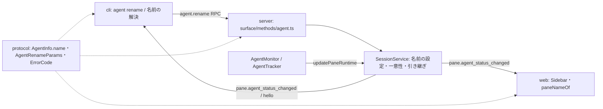

# 調査: エージェントの名前（`agent rename` と名前による対象指定）

発火条件（protocol.md「4.5」）: **影響が横断的**（protocol の `AgentInfo`・server・web・cli の 4 パッケージ）。
herdr の一次資料は主エージェントが直読した（`/workspaces/web-tn-multiplexer/scratchpad/herdr`。以下 herdr）。

## 調査の問い

- Q1: herdr の名前の規則・一意性・消える条件・対象の解決順・エラー code は何か。
- Q2: 本製品で `AgentInfo` を作る・変える・比べる・保存する場所はどこか（名前を足すと何に波及するか）。
- Q3: `AgentInfo` を持つ保存・表示・プロトコルの互換はどうなっているか（名前の項目の形の判断材料）。
- Q4: 既存の CLI は pane ID をどこで解決し、書き込みの競合をどう防いでいるか。
- Q5: web で名前を出すべき場所はどこか。

## 判明した事実

### Q1: herdr の仕様

- F1.1 名前の書式: 先頭が `a-z`、長さ 32 以下、残りは `a-z0-9-_`（herdr `src/app/agents.rs:14-20` `valid_agent_name`。
  テスト `:470-490` が `""`・`" reviewer"`・`"Reviewer"`・`"1reviewer"`・`"reviewer.one"`・33 文字を拒み、
  `"a"`・`"reviewer-one"`・`"reviewer_2"`・32 文字を受ける）。外れると `invalid_agent_name`（`:325-328`）。
- F1.2 一意性: live なエージェント（`collect_agent_infos`＝いまエージェントとして見えている pane）の中で、
  自分以外に同じ名前があれば `agent_name_taken`（`src/app/agents.rs:101-109, 449-459, 351-370`）。
  同じエージェントへの同じ名前の付け直しは、自分を除いて比べるので成功する。
- F1.3 rename の対象: 解決できない → `agent_not_found`（`agent_target_error_body` `:291-295`）。解決した pane が
  エージェントを持たない → `agent_not_found`「does not currently host an agent」（`:125-127, 330-333`）。
  `--clear` は `name: None`（`src/cli/agent.rs:751-768`）。rename は pane のラベル（`manual_label`）を変えない
  （`src/app/api/agents.rs:795-822` のテスト）。成功すると `AgentInfo` を返す（`src/app/api/agents.rs:64-71`）。
- F1.4 対象の解決順: まず pane ID として解釈し、その pane がエージェントを持てばそれ。次に名前が一致する pane を
  集め、1 件ならそれ・2 件以上なら `agent_target_ambiguous`・0 件なら `agent_not_found`
  （`src/app/terminal_targets.rs:75-104, 115-137`。pane ID に見える名前 `p_1` の扱いは `src/app/mod.rs:2558` のテスト）。
- F1.5 消える条件: 「A name follows the current pane occupant and is cleared when that agent exits, is released, or is replaced.
  Temporary detection uncertainty does not clear it.」（`docs/next/website/src/content/docs/cli-reference.mdx:348`）。
  pane の移動では名前が付いたまま（`:238`）。エージェントを指す全コマンドが名前か pane ID を受ける（`:346`）。
- F1.6 CLI の終了コード: エラー応答は 1、使用誤りは 2（`src/cli/agent.rs:751-755` の usage で `Ok(2)`）。
- F1.7 名前は session に保存され、復元時に戻る（`src/persist/restore.rs:494-548`）。サイドバーのエージェントの行に
  名前を出す（`CHANGELOG.md:769`「Sidebar agent entries now show user-assigned agent names when available」）。

### Q2: 本製品の `AgentInfo` の出入り

- F2.1 型: `packages/protocol/src/model.ts:107-122`（`instanceId`・`kind`・`label`・`state`・`completionSeq`・
  `serverSeenSeq`・`verified`・`since`）。`Pane.agent: AgentInfo | null`（`:84`）。
- F2.2 作るのは `AgentTracker.update`（`packages/server/src/agent/AgentTracker.ts:83-126`）。種類が変わる／初めて
  見つけると **新しい `instanceId`** で作り直す（`:94-110`）。前面にエージェントが居なくなると `null`（`:86-90`）。
  状態の更新は `{ ...current, state, since, completionSeq }`（`:118-124`）。`markSeen` も `{ ...this.info, serverSeenSeq }`（`:130-134`）。
- F2.3 反映は `SessionService.updatePaneRuntime`（`packages/server/src/session/SessionService.ts:888-919`）→
  `SessionModel.updatePaneRuntime`（`packages/server/src/session/SessionModel.ts:838-850`。`agent` は丸ごと置き換え）。
  `sameAgent`（`SessionService.ts:1177-1190`）が全項目を比べ、変わったときだけ `pane.agent_status_changed` を発行する
  （`:909-911`）。**比べる項目に無いものが変わっても発行されない**。
- F2.4 `AgentInfo` を `updatePaneRuntime` に渡すのは本番では `AgentMonitor.judge`（`AgentMonitor.ts:195-199`）と
  `handleFocusChanged`（`:100-105`）だけ。cli の smoke は検出を経ずに直接注入している（`packages/cli/src/smoke.ts:169-171`）。
- F2.5 `AgentInfo` のリテラルを持つファイルは 30（`grep -rln serverSeenSeq packages --include=*.ts --include=*.vue`。
  web 17・server 7・cli 5・protocol 1）。必須の項目を足すと、これらのテストの型検査が全部落ちる。

### Q3: 互換

- F3.1 サーバの保存（`packages/server/src/persist/SessionFile.ts:9-22, 91`）は `agentSession` だけを持ち、`AgentInfo` は
  保存しない（再起動で検出し直し、新しい `instanceId` になる）。
- F3.2 web の保存は既読の記録だけで、キーは `instanceId`（`packages/web/src/store/seen.ts:10-21`）。`AgentInfo` 自体は保存しない。
- F3.3 web は `pane.agent_status_changed` の `agent` で丸ごと置き換える（`packages/web/src/store/StoreAdapter.ts:129-135`）。
- F3.4 プロトコルに版の交渉は無く、web・cli・server は同じリポジトリから同時に配られる。

### Q4: 既存の CLI の対象の解決と競合の防ぎ方

- F4.1 `agent get/wait/read/prompt/send-keys` は `client.hello()` の snapshot から pane を引く
  （`packages/cli/src/commands/agent.ts:45-50` `requireAgentPane`）。
- F4.2 書き込みの RPC（`agent.prompt`/`agent.send_keys`）は `paneId` と、CLI が hello で見た `instanceId` を送り、サーバは
  受け付け時と書く直前の 2 回、同じ `instanceId` かを確かめる（`packages/server/src/surface/methods/agent.ts:20-49`・
  `packages/protocol/src/messages.ts` の `AgentPromptParams`）。違えば `agent_not_found`。
- F4.3 待ちは `instanceId` で相手を追い、入れ替わり・消失・pane の close で `agent_not_running`
  （`packages/cli/src/agentStatus.ts:107-114` `judgeWait`・`commands/agent.ts:130-150`）。
- F4.4 引数の解析は `packages/cli/src/cliArgs.ts:327-402` `parseAgent`。位置引数の名前は `paneId`。使用誤りは
  `CliUsageError`（終了コード 2）、`RpcFailure(code: string)` は 1（`packages/cli/src/output.ts`・`wsClient.ts:27-35`）。
- F4.5 pane ID は `p1` のような形（`packages/protocol/src/ids.ts:4`）で、名前の書式（F1.1）にも合う。

### Q5: web で名前を出す場所

- F5.1 サイドバーのエージェントの行は `agent.label` を出す（`packages/web/src/components/Sidebar.vue:466-469`）。
- F5.2 pane の呼び名の唯一の置き場は `paneNameOf`（`packages/web/src/store/paneName.ts:12`。`pane.label || pane.agent?.label ||
  pane.title || fallback`）。使うのは `PaneFrame.vue`・`GotoPicker.vue`・`notify/describe.ts`。
- F5.3 携帯の pane 選択（`packages/web/src/mobile/PanePicker.vue:110`）も `agent.label` を出す。

## 影響範囲

## 実現性 / リスク

- 実現可能。新しい入口は要らず、既存の `/ws` の RPC を 1 つ足す（`METHOD_SCHEMAS`。`messages.ts`）。
- リスク R1: `AgentTracker` は名前を知らないので、名前を `SessionService` 側だけで持つと、次の判定の周期の
  `updatePaneRuntime`（F2.3 の丸ごと置き換え）で名前が消える。引き継ぎの規則が要る。
- リスク R2: `sameAgent` に名前を足し忘れると、rename が他のクライアントへ届かない（F2.3）。
- リスク R3: 本製品は検出が 1 回外れるだけで `instanceId` が変わる（F2.2）ので、herdr の「一時的な揺れでは消えない」
  （F1.5）とは違い、名前も消える。既存の `agent wait` 等と同じ性質で、requirements の対象外に入れてある。

## 実装アンカー

- A1: `AgentInfo` の型（`packages/protocol/src/model.ts:107`）。
- A2: RPC の型と表（`packages/protocol/src/messages.ts` の `AgentSendKeysParams` の後・`METHOD_SCHEMAS`・`MethodResultMap`）。
- A3: エラー code（`packages/protocol/src/errors.ts:23-28`）。
- A4: 名前の設定の置き場の候補（`packages/server/src/session/SessionService.ts:888` `updatePaneRuntime`・`:1177` `sameAgent`）。
- A5: RPC の登録（`packages/server/src/surface/methods/agent.ts:57` `registerAgentMethods`）。テストの作りは
  `packages/server/src/surface/methods/agent.test.ts:40-60` の `setup`（`session` をフェイクにしている）。
- A6: CLI の解決（`packages/cli/src/commands/agent.ts:45` `requireAgentPane`）・見え方（`packages/cli/src/agentStatus.ts:44-73`
  `AgentView`/`toAgentView`）・引数（`packages/cli/src/cliArgs.ts:327` `parseAgent`・`:25-30` USAGE）・
  入口（`packages/cli/src/main.ts:24-40` の help・`:57-110` の switch）。
- A7: web（`packages/web/src/components/Sidebar.vue:466`・`packages/web/src/store/paneName.ts:12`）。
- A8: smoke（`packages/cli/src/smoke.ts:166-190`）。

## 実装時の注意

- `SessionModel.updatePaneRuntime` は `agent` を丸ごと置き換える（F2.3）。名前を引き継ぐなら `SessionService` 側で
  「同じ `instanceId` なら前の名前を持たせる」ようにする。`markSeen` の経路（F2.4 の `handleFocusChanged`）も同じ関数を通る。
- `AgentInfo` のリテラルを持つテストが 30 ファイルある（F2.5）。必須の項目にすると全部の型検査が落ちる。
- 並行して別の worktree（`load-flaky-tests`）が cli・server・web のテストファイルと空きポートの取り方を触っている。
  既存のテストファイルの大きな書き換えは避け、足す分は新しい `it`／新しいファイルにする。

## design への申し送り

- 名前の項目の形（必須か省略可か）: F2.5・F3.1〜F3.4 から、省略可にすれば既存のリテラル・受け手を変えずに済む。
- 名前の置き場: R1 を踏まえ、`AgentTracker`（検出）と `SessionService`（公開している状態）のどちらに持つか。
  cli の smoke は `AgentTracker` を経ずに注入している（F2.4）。
- 対象の解決: 既存の CLI は hello の snapshot で pane を引き `instanceId` をサーバに渡している（F4.1〜F4.3）。名前も同じ
  場所で解決すれば、入れ替わりの照合（FR12）をそのまま使える。
- `agent_target_ambiguous` は一意性（F1.2）を守る限り起こらないが、herdr と同じ code を防御として残すか。
