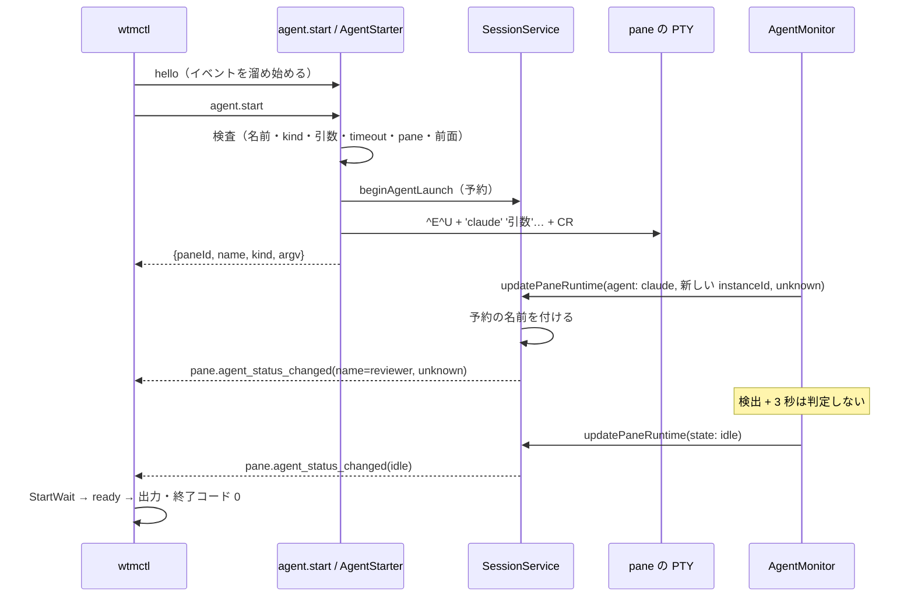

# 仕様: `wtmctl agent start`

## 概要

サーバに RPC `agent.start` を足す。サーバは引数・名前・pane・前面プロセスを検査し、**名前を予約して**から、pane の PTY に
「打ちかけの消去＋固定の実行ファイル名と単一引用符で包んだ引数（bracketed paste が有効なら貼り付けで包む）＋Enter」を書いて
**すぐ応答する**。その pane に期待した種類のエージェントが新しく検出されると、`SessionService` が予約していた名前をその
`AgentInfo` に付ける。CLI `wtmctl agent start` は hello の直後からイベントを溜め、RPC の応答の後、その pane のエージェントが
「名前付き・期待の種類・`idle`/`done`」になるまで待つ（`blocked` → `agent_not_ready` 等）。

## 設計方針

- **起動完了は CLI が待つ**（research F5.1：RPC の応答の上限 10 秒）。既存の `agent wait`・`agent prompt --wait` と同じく、
  hello の直後からの `pane.agent_status_changed` で判定する（F5.2）。
- **起動の状態は「予約」だけをサーバに持つ**。herdr の `Pending/Blocked/Active`（F1.8）のうち、`Blocked`/`Active` は本製品では
  名前付きの `AgentInfo.state`（`blocked`/`idle`）そのもので表せるので、別の状態として持たない（decisions.md D3）。
  herdr の「開始 + 3 秒の猶予」は、本製品の `AgentTracker` の「検出 + 3 秒は判定しない」（F3.1）が包むので、新しい猶予の仕組みは作らない。
- **名前付けは `SessionService` の中で、新しい検出を反映するその 1 回の `updatePaneRuntime` の中で行う**（R2 の順序の逆転を作らない）。
  名前は `agent.start` の受け付け時に `renameAgent` と**同じ検査**（共有する `assertAgentNameAvailable`）を通った予約から来る。
  `updatePaneRuntime` の呼び出し側（`AgentMonitor`）が名前を渡す経路は作らない（20260926-agent-start-rename D7）。
- **クォートは全部の引数を単一引用符で包む**（herdr の「安全な文字は裸」をやめる。decisions.md D1・D5）。実行ファイル名は
  固定表の値で、英小文字・数字・`-` だけ（テストで確かめる）なので裸で出す（利用者の alias・関数が効く点は herdr と同じ）。
- **打ちかけの消去 `\x05\x15`（Ctrl-E・Ctrl-U）を前に付ける**（herdr に無い。research F6.2。decisions.md D5）。効くことを実物で確かめたのは bash・dash だけで、
  zsh・ksh・mksh で効くかは**未確認**（test-result.md の「未検証の穴」に書く）。
- 検査・組み立ては純関数（`packages/server/src/agent/agentStart.ts`）、前面の確認・予約・書き込み・締め切りは
  `AgentStarter`（`packages/server/src/agent/AgentStarter.ts`）に置き、RPC は薄く呼ぶだけにする。

## 対象範囲

- protocol: `src/agentStart.ts`（新規。kind の表・timeout の範囲）・`src/messages.ts`（`AgentStartParams`・`AgentStartResult`・表）・
  `src/errors.ts`（code）・`src/index.ts`（再輸出）。
- server: `src/agent/agentStart.ts`（新規・純関数）・`src/agent/AgentStarter.ts`（新規）・`src/session/SessionService.ts`（予約・名前付け・
  検査の共有）・`src/surface/methods/agent.ts`（`agent.start`）・`src/surface/methods/deps.ts`（省略可の `agentStarter`）・`src/composeServer.ts`（組み立て）。
- cli: `src/cliArgs.ts`（`agent start` の解釈）・`src/commands/agentStart.ts`（新規。実行・再試行・待ち合わせ）・`src/agentStartWait.ts`（新規・純関数の判定）・
  `src/main.ts`（help・振り分け）・`src/smoke.ts`（配線の確認）。
- docs: `docs/wtmctl.md`・`docs/herdr-parity.md`（H39）。
- テスト（すべて新しいファイル）: 各新規モジュールの `*.test.ts`、既存モジュールの足した部分は `packages/server/src/session/SessionService.agentLaunch.test.ts`・
  `packages/cli/src/cliArgs.agentStart.test.ts`、実物の bash/dash で引数を確かめる `packages/server/src/agent/agentStart.shell.test.ts`、
  実サーバ・実 PTY・偽のエージェントの `packages/cli/src/agentStart.integration.test.ts`。

## 依拠する既存の事実

- 空いている bash・sh・dash では `foregroundJob(pid)` が `{processGroupId: pid, processes: [{pid, exe: "/bin/bash" 等}]}`、コマンド実行中は
  別の pgid（research F2.2 の実測・`LinuxProcessInspector.ts:24-31`）。`exe` は argv[0] 由来（`LinuxProcessInspector.ts:136-147`）。
- macOS 等では `/proc` が無く `foregroundJob` は null（`composeServer.ts:70-74`・F2.3）。Windows の `ForegroundJob` はグループではない（`ProcessInspector.ts:17`）。
- 新しい検出は新しい `instanceId`・`state: "unknown"` で始まり、3 秒は判定しない（`AgentTracker.ts:88-110`・F3.1）。前面から消えると null（`:78-82`）。
- `updatePaneRuntime` は同じ `instanceId` の間だけ前の名前を引き継ぎ、`sameAgent` が名前を比べる（`SessionService.ts:888-924, 1207-1221`）。
  `renameAgent` の検査（`SessionService.ts:929-951`）。
- `EventBus.publish` は同期（`EventBus.ts:6-7`・F3.4）。
- `TerminalHost.writeModal` は flush 後のモードで `build` を呼び、終了で reject（`TerminalHost.ts:124-160`）。`pastePayload`（`agentInput.ts:20-29`）。
- CLI の RPC の上限 10 秒（`wsClient.ts:54`）、`hello(onEventAfterHello)`・`EventFeed`（`commands/agent.ts:66-81`）、`parseFlags` は `--` を扱わない
  （`cliArgs.ts:110-139`）、`CliUsageError`=2・`RpcFailure`=1（`output.ts`）。
- `MethodDeps` を作るテストが 2 つある（`surface/methods/index.test.ts`・`ws/WsGateway.integration.test.ts:116`。F4.3）。
- 実物の bash 5.2.21・dash 0.5.12 で、`\x05\x15`＋コマンド行＋`\r` が打ちかけを消し、単一引用符の引数がそのまま届く（F6.2 の実測）。
- 本製品の検出できる種類（`packages/server/src/agent/agents.ts:22-45` `AGENTS`）と実行ファイル名からの逆引き（同 `lookupAgentKind`）。
- 既存のシンボル・code の場所: `isValidAgentName`・`INVALID_AGENT_NAME_MESSAGE`（`packages/protocol/src/agentName.ts`）、`invalid_agent_name`・`agent_name_taken`
  （`packages/protocol/src/errors.ts:28-30`）、CLI だけの `agent_not_running`（`packages/cli/src/commands/agent.ts:66` `notRunning`）・`connection_closed`
  （同 `:118, 229`）、`viewOf`（同 `:40`）・`withSession`（`packages/cli/src/withSession.ts`）、`PROCESS_INSPECTOR_TIMEOUT_MS = 2000`（`AgentMonitor.ts:34`）、
  `sizeAuthority.noteInteraction`（`surface/methods/agent.ts:66`）、`InputModes.bracketedPaste`（`packages/server/src/terminal/Mirror.ts:23-25`）。
- herdr の事実: 実行ファイルの表（research F1.4）、timeout の範囲と `AGENT_START_SETTLE_DELAY`（F1.3）、安全な文字を裸で出すクォート（F1.6）。

## インターフェース / データ構造

### protocol `src/agentStart.ts`（新規）

```ts
/** kind → 打ち込む実行ファイル名（herdr の interactive_agent_executable。omp・mastracode は検出できないので含めない）。 */
export const AGENT_START_EXECUTABLES: Readonly<Record<string, string>>; // pi claude codex gemini cursor(cursor-agent) devin agy cline opencode
  // copilot kimi kiro(kiro-cli) droid amp grok hermes kilo qodercli qwen letta maki muse
export function agentStartExecutable(kind: string): string | null; // Object.hasOwn で引く（__proto__ 等を拒む）
export const AGENT_START_KINDS: readonly string[];
export const AGENT_START_DEFAULT_TIMEOUT_MS = 30_000;
export const AGENT_START_SETTLE_MS = 3_000;        // timeout はこれより大きくなければならない（herdr の AGENT_START_SETTLE_DELAY。値そのものは不可）
export const AGENT_START_MAX_TIMEOUT_MS = 300_000;
export function isValidAgentStartTimeout(ms: number): boolean; // 整数・3000 < ms ≤ 300000
```

### protocol `src/messages.ts`

```ts
export const AgentStartParams = z.object({
  name: z.string(), kind: z.string(), paneId: z.string(),
  args: z.array(z.string()), timeoutMs: z.number().int().optional(),
});
export interface AgentStartResult { paneId: string; name: string; kind: string; /** 実行ファイルと引数（クォート前） */ argv: string[] }
// METHOD_SCHEMAS["agent.start"] / MethodResultMap["agent.start"]
```

### protocol `src/errors.ts` に足す code

`unsupported_agent_kind`・`invalid_agent_argument`・`invalid_agent_timeout`・`agent_pane_not_found`・`agent_pane_busy`・
`unsupported_agent_shell`（herdr に無い）・`agent_start_input_failed`。（CLI だけが出す `agent_not_ready`・`agent_kind_mismatch`・
`agent_start_failed`・`timeout` は `RpcFailure` の文字列で、`ErrorCode` には足さない——既存の `agent_not_running` と同じ扱い。）

### server `src/agent/agentStart.ts`（新規・純関数）

```ts
export const MAX_START_LINE_BYTES = 4000;
export const LINE_CLEAR = "\u0005\u0015";            // Ctrl-E（行末へ）・Ctrl-U（行の消去）
export const POSIX_START_SHELLS: ReadonlySet<string>; // sh bash dash zsh ksh mksh
export const OTHER_SHELLS: ReadonlySet<string>;       // fish csh tcsh elvish xonsh nu pwsh powershell cmd
export function hasControlChar(s: string): boolean;   // /[\u0000-\u001f\u007f-\u009f]/
export function quotePosixArg(s: string): string;     // "'" + s.replaceAll("'", "'\\''") + "'"
export function shellNameOf(exe: string): string;     // 最後の / か \ の後ろ・先頭の - を全部除く・末尾の .exe を除く・小文字化
export type ShellCheck = { kind: "available"; shell: string } | { kind: "busy" } | { kind: "unsupported"; shell: string };
export function checkShell(job: ForegroundJob | null, shellPid: number): ShellCheck;
export function buildStartLine(executable: string, args: readonly string[]): string; // [executable, ...args.map(quotePosixArg)].join(" ")
export function startInput(line: string, bracketedPaste: boolean): string[];        // ["\x03", LINE_CLEAR + pastePayload(line, bp) + "\r"]（decisions.md D9）
```

`checkShell`: `job === null` → busy／`job.processGroupId !== shellPid` → busy／`processes` に `pid !== shellPid` が 1 つでもある → busy／
`pid === shellPid` が無い → busy／`shellNameOf(exe)` が `POSIX_START_SHELLS` → available、`OTHER_SHELLS` → unsupported、それ以外（`exec vim` 等で
シェルでなくなった）→ busy。

### server `src/agent/AgentStarter.ts`（新規）

```ts
export interface AgentStarterOptions {
  session: Pick<SessionService, "getPane" | "assertAgentNameAvailable" | "beginAgentLaunch" | "endAgentLaunch" | "hasAgentLaunch">;
  terminals: Pick<TerminalManager, "get">;
  processInspector: Pick<ProcessInspector, "foregroundJob">;
  platform?: NodeJS.Platform;       // 既定 process.platform
  inspectTimeoutMs?: number;        // 既定 2000（AgentMonitor の PROCESS_INSPECTOR_TIMEOUT_MS と同じ値）
}
export class AgentStarter { start(params: AgentStartParams): Promise<AgentStartResult> }
```

### server `SessionService` に足すもの

```ts
/** 書式と一意性（live なエージェントの名前・起動中の予約。exceptPaneId の pane は除く）。外れれば RpcError（invalid_agent_name / agent_name_taken）。 */
assertAgentNameAvailable(name: string, exceptPaneId: PaneId | null): void;
/** 起動中の予約を作る。pane に予約があれば agent_pane_busy。名前は assertAgentNameAvailable で検査する。戻り値は予約の印（数）。 */
beginAgentLaunch(paneId: PaneId, name: string, kind: string): number;
/** 印が一致するときだけ予約を解く（締め切り・書き込みの失敗）。 */
endAgentLaunch(paneId: PaneId, token: number): void;
hasAgentLaunch(paneId: PaneId): boolean;
```

`renameAgent` の名前の検査は `assertAgentNameAvailable(name, paneId)` に置き換える（予約も見るようになる）。予約の一覧は
`Map<PaneId, {token, name, kind}>`。一意性の検査では、**今は存在しない pane の予約を数えない**（pane の close の経路ごとに消し込まなくてよい）。

`updatePaneRuntime` の最初（名前の引き継ぎの前）に:

```ts
const launch = this.agentLaunches.get(paneId);
if (launch && patch.agent && patch.agent.instanceId !== pane.agent?.instanceId) {
  this.agentLaunches.delete(paneId);                         // 新しい検出が来たら、種類が合っても違っても予約は終わり
  if (patch.agent.kind === launch.kind && this.isAgentNameFree(launch.name, paneId)) {
    patch = { ...patch, agent: { ...patch.agent, name: launch.name } };
  }
}
```

（付ける名前は予約から来る。呼び出し側（`AgentMonitor`）に名前を渡させる経路は作らない。既存の引き継ぎ（`SessionService.ts:904`）は
`patch.agent.name === undefined` かつ**同じ** `instanceId` のときだけ働くので、新しい `instanceId` に付けた予約の名前を上書きしない。）

`isAgentNameFree(name, exceptPaneId): boolean`（private。投げない版）: 他の pane の live な `agent.name` と、今も存在する他の pane の予約の名前の
どれとも重ならなければ true。書式は見ない（予約は `beginAgentLaunch` で書式を検査済み）。`assertAgentNameAvailable` は
「`isValidAgentName` → `isAgentNameFree`」の順に検査して投げる版。

### server RPC `agent.start`（`surface/methods/agent.ts`）

`deps.agentStarter` があるときだけ登録し、`deps.sizeAuthority.noteInteraction(ctx.clientId, params.paneId)` の後 `agentStarter.start(params)` を返す。
`MethodDeps.agentStarter?: AgentStarter`（省略可。F4.3 の 2 つのテストを変えない。decisions.md D7）。`composeServer` は
`new AgentStarter({ session, terminals, processInspector })` を渡す。

### cli

- `Command` に `{ kind: "agent-start"; opts; name: string; agentKind: string; paneId: string; timeoutMs: number | undefined; args: string[] }`。
- `src/agentStartWait.ts`（純関数）:

```ts
export type StartVerdict = { kind: "pending" } | { kind: "ready"; agent: AgentInfo } | { kind: "failed"; code: string; message: string };
export class StartWait {
  constructor(name: string, kind: string);
  observe(agent: AgentInfo | null): StartVerdict;   // その pane の今のエージェント
  paneClosed(): StartVerdict;                        // failed(agent_start_failed)
}
```

- `src/commands/agentStart.ts`: `runAgentStart(cmd, store, deps?)`。`deps` は `{ now, sleep }`（テスト用。既定は `Date.now`・`setTimeout`）。
- 再試行の定数: `START_BUSY_RETRY_MS = 2000`・`START_BUSY_POLL_MS = 100`。

## 振る舞いの詳細

### サーバ `AgentStarter.start`（順に検査し、最初に当たった誤りで何も書かずに返す）

1. `isValidAgentName(name)` でなければ `invalid_agent_name`。
2. `agentStartExecutable(kind)` が null なら `unsupported_agent_kind`。
3. `args` のどれかが `hasControlChar` なら `invalid_agent_argument`。
4. `timeoutMs ?? 30000` が `isValidAgentStartTimeout` でなければ `invalid_agent_timeout`。
5. `line = buildStartLine(executable, args)` の UTF-8 のバイト数が 4000 を超えれば `invalid_agent_argument`。
6. `session.assertAgentNameAvailable(name, null)`（`invalid_agent_name`/`agent_name_taken`）。
7. `session.getPane(paneId)` が無い、または `terminals.get(paneId)` が無ければ `agent_pane_not_found`。
8. `pane.agent !== null` または `session.hasAgentLaunch(paneId)` なら `agent_pane_busy`。
9. `platform === "win32"` なら `unsupported_agent_shell`。
10. `foregroundJob(host.pid)` を `inspectTimeoutMs` の上限で待つ（reject・時間切れは null とみなす）→ `checkShell`。busy → `agent_pane_busy`、
    unsupported → `unsupported_agent_shell`（メッセージに shell 名）。
11. await の後にもう一度 7・8 と名前の検査を行い（pane の close・他の起動・rename が割り込みうる）、同期のまま `beginAgentLaunch` で予約する。
12. `host.writeModal({ build: (modes) => startInput(line, modes.bracketedPaste), delayMs: START_INTERRUPT_DELAY_MS /* 200 */ })`（D9）。`build` の中で
    pane にエージェントが検出されていたら投げて何も書かない（`agent_pane_busy`）。reject したら `endAgentLaunch` し、`RpcError` はそのまま、それ以外は
    `agent_start_input_failed`。
13. `setTimeout(timeoutMs)` で `endAgentLaunch(paneId, token)`（`unref`）。検出で予約が先に終わっていれば何もしない（印が違う・無い）。
14. `{ paneId, name, kind, argv: [executable, ...args] }` を返す。

### 名前付け（`SessionService.updatePaneRuntime`）

- 予約のある pane に、今の `pane.agent` と違う `instanceId` の `AgentInfo` が来たら予約を終える。種類が合えば予約の名前を付けて反映する
  （同じ 1 回の反映・1 回の `pane.agent_status_changed`）。以後は既存の引き継ぎで同じ検出の間だけ名前が残る。
- 名前は締め切りで外さない（予約は検出で終わっているので、締め切りの `endAgentLaunch` は何もしない）。
- 締め切りまでに検出されなければ `endAgentLaunch` で予約が消え、名前はすぐ使える。



### CLI `runAgentStart`

1. `withSession` の中で `hello(events.push)`。締め切り `deadline = now() + (timeoutMs ?? 30000)`。
2. `agent.start` を送る。`agent_pane_busy` なら、最初の busy から 2 秒経つまで 100 ms（残りが短ければ残り）おいて送り直す。2 秒を過ぎたら最後の
   `agent_pane_busy` を投げる。ほかの誤りはそのまま投げる。
3. 「その pane の今のエージェント」は hello の snapshot のその pane の `agent` を初期値とし、hello 以降のその pane の `pane.agent_status_changed` で
   置き換えて追う（応答の前に届いたものも置き換えには使う）。応答の前は判定しない（hello 時点で居たエージェントは、サーバが `agent_pane_busy` で断る）。
   成功したら、その今のエージェントを `StartWait.observe` に渡し、以後の
   `pane.agent_status_changed`（その pane）を渡す。`pane.closed`（その pane）は `paneClosed()`。`ready` で `{ agent: viewOf(…) }` を出力。
   `failed` は `RpcFailure(code, message)` で投げる（終了コード 1）。
4. `deadline` に達したら `RpcFailure("timeout", "timed out waiting for agent startup")`。接続が切れたら `connection_closed`（既存と同じ）。

`StartWait.observe(agent)`（`named` は名前付きで見えた検出の `instanceId`。初期値 null）。**表の上の行から順に当て、最初に当たった行で決める**。
種類と名前が合う検出を初めて見たら、状態にかかわらずその時点で `named` にその `instanceId` を記録する（`unknown` を経ずに `idle`/`blocked` で見えても入れ替わりを判定できる）:

| 今のエージェント | 判定 |
|---|---|
| null | `named` があれば failed `agent_start_failed`（起動したエージェントが終了した）。無ければ pending（まだ起動していない） |
| 種類が違う | failed `agent_kind_mismatch` |
| 種類が合う・名前が違う（無い） | failed `agent_start_failed`（予約の名前が付かなかった・外された） |
| 種類と名前が合う・`named` があって `instanceId` が違う | failed `agent_start_failed`（入れ替わった） |
| 種類と名前が合う・`blocked` | failed `agent_not_ready`（名前は付いたまま） |
| 種類と名前が合う・`idle`/`done` | ready |
| 種類と名前が合う・`working`/`unknown` | pending |

### CLI の引数

`wtmctl agent start <name> --kind <KIND> --pane <paneId> [--timeout <ms>] [--url <URL>] [--token <TOKEN>] [-- <args>...]`。
最初の `--` で分け、前だけを `parseFlags` に渡す（後ろは全部エージェントの引数）。`<name>` の欠落・余分な位置引数・`--kind`/`--pane` の欠落・
未知のオプションは使用誤り。`--kind` が `AGENT_START_KINDS` に無ければ使用誤り（一覧を案内する）。`--timeout` は `^[0-9]+$` でなければ使用誤り
（範囲はサーバが判定）。

## ドメイン固有の考慮

- 既存の認証・Origin 検査の上の `/ws` の RPC だけ（新しい入口なし）。
- 書くのは固定表の実行ファイル名・単一引用符で包んだ引数・`\x05\x15`・貼り付けの印（有効時）・`\r` だけ。任意のコマンド行を受け付ける引数は無い。
- herdr との違い（docs に書く）: 対応シェルを POSIX 系に絞る・全部の引数を包む・打ちかけを消す・kind の別名を受けない・
  `agent_pane_busy` の再試行は条件を付けない・名前は検出後は締め切りで外さない・起動中は `agent list` に出ない・`unsupported_agent_shell`。

## エラー処理 / 異常系

- 前面の取得が reject・時間切れ → busy（確かめられないものは空きとみなさない）。macOS 等（`/proc` が無い）では `foregroundJob` が常に null なので、
  毎回 `agent_pane_busy`（CLI は 2 秒再試行してから返す）になる。対象 OS（Linux・WSL2・Windows）の外なので意図どおりとし、docs に「Linux／WSL2 のサーバだけ」と書く。
- 書き込みの reject（pane の終了）→ 予約を解いて `agent_start_input_failed`。
- 予約中に pane が閉じる → 一意性の検査で数えない。締め切りで消える。CLI は `pane.closed` で `agent_start_failed`。
- CLI の締め切りとサーバの締め切りはほぼ同時（CLI は送信前から、サーバは受け付けから数える）。CLI が `timeout` を返した直後の数十 ms は、
  まだ予約が残っていることがある（docs に書く）。

## 受け入れ基準との対応

- AC1: 結合テスト（実サーバ・bash の pane・PATH の先頭に偽の `claude`）で、出力の `name`・`kind` と、検出から `idle` までの時間（≥ 3 秒は
  `AgentTracker` の猶予による）を確かめる。入力は CLI の Command。
- AC2: 同じ結合テストで `agent get reviewer`・`agent list`（`runAgentGet`/`runAgentList`）。
- AC3: `SessionService` の単体テスト（予約中の `beginAgentLaunch`・`renameAgent` が `agent_name_taken`、`endAgentLaunch` 後は使える、
  別の種類の検出で予約が終わり名前が使える、名前付き後の `endAgentLaunch` は名前を外さない）と `AgentStarter` の単体テスト（フェイクタイマーで締め切り）。
- AC4: `AgentStarter` の単体テスト（書式違反・live な名前との重複で `writeModal` が呼ばれない）。
- AC5: cliArgs の単体テスト（表に無い kind → `CliUsageError`）・`AgentStarter`（`unsupported_agent_kind`・書かない）・表のテスト
  （server 側で `lookupAgentKind(executable) === kind` を全 kind・表の kind が `AGENTS` と一致・実行ファイル名が `^[a-z0-9-]+$`）。
- AC6: `agentStart.test.ts`（`hasControlChar` の各文字）と `AgentStarter`（`invalid_agent_argument`・4000 バイト超・書かない）。
- AC7: `agentStart.shell.test.ts`（実物の bash・dash に `buildStartLine` の行を標準入力から与え、`env <node> -e …` が受け取る argv を比べ、作業ディレクトリに
  ファイルが作られないこと）と、結合テストの対話的な bash・dash の PTY（偽の `claude` が記録した argv）。
- AC8: `AgentStarter` の単体テスト（sleep の前面・extra のメンバー・エージェント検出済み・予約中・null・reject・時間切れ（フェイクタイマー）・存在しない pane）
  と結合テスト（`sleep` 中の pane で `agent_pane_busy`・偽の `claude` が起動しない）。
- AC9: `checkShell`（fish・pwsh・cmd・`-bash`・`/usr/bin/zsh`・`/bin/sh`）と `AgentStarter`（`platform: "win32"`）。
- AC10: 結合テスト（打ちかけの `echo LEFTOVER…` の後に start。LEFTOVER の印のファイルが作られず、argv が一致）。bash・dash の両方。
- AC11: `startInput` の単体テスト（bracketed paste の有無でのバイト列）と `AgentStarter`（`writeModal` の `build` の戻り値）。
- AC12: `StartWait` の単体テスト（blocked → `agent_not_ready`）と `runAgentStart` の単体テスト（フェイクの client のイベントで終了コード 1 の `RpcFailure`）。
- AC13: `StartWait`（unknown・working は pending、idle・done は ready）と `runAgentStart`。
- AC14: `StartWait`（種類違い・名前違い・null・入れ替わり・pane の close）と `runAgentStart`（フェイクタイマーで締め切り → `timeout`）。
- AC15: cliArgs の単体テスト（非整数・`--` の後の `--kind`）と `AgentStarter`（3000・300001 → `invalid_agent_timeout`、省略で 30000 の締め切り）。
- AC16: `runAgentStart` の単体テスト（フェイクタイマー。busy を 2 回返した後に成功・2 秒 busy のままなら `agent_pane_busy`・100 ms の間隔）。
- AC17: docs の差分（review で読む）。
