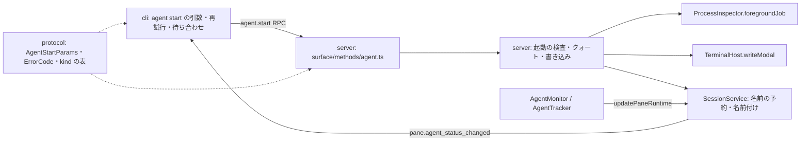

# 調査: `wtmctl agent start`

発火条件（protocol.md「4.5」）: **影響が横断的**（protocol の RPC・エラー code／server の前面プロセスの判定と PTY への書き込み／cli の待ち合わせ）
と、**未検証の既存挙動への依存**（空いているシェルで `foregroundJob` が何を返すか・`AgentTracker` の猶予）。decisions.md D2。
herdr の一次資料は主エージェントが直読した（`/workspaces/web-tn-multiplexer/scratchpad/herdr`。以下 herdr）。

## 調査の問い

- Q1: herdr の `agent start` の仕様（kind の表・実行ファイル・引数の検査とクォート・空いているシェル・起動の状態機械・締め切り・CLI の待ち合わせ・エラー code・終了コード）。
- Q2: 本製品の前面プロセスの取得は、空いているシェル・コマンド実行中のシェルで何を返すか。
- Q3: 本製品のエージェントの検出と名前の置き場（名前を付ける経路・猶予・イベントの順序）。
- Q4: PTY への書き込みの経路と、RPC の依存（`MethodDeps`）の組み立て。
- Q5: CLI の RPC・待ち合わせ・引数の解釈の既存の仕組み。
- Q6: 実物のシェル（この環境の bash・dash）で、クォートと打ちかけの消去が効くか。

## 判明した事実

### Q1: herdr

- F1.1 検査の順（`src/app/agents.rs:144-231` `start_agent`）: 名前の書式 → kind（`parse_agent_label`）→ 引数に `char::is_control` が 1 つでもあれば
  `InvalidArgument` → 名前の重複（live なエージェント＋起動中の名前。`agent_name_conflicts`）→ pane の解決 → pane が既にエージェントか起動中なら
  `TargetBusy` → 空いているシェル名（`available_shell_name`）が無ければ `TargetBusy` → コマンド行の組み立て → timeout の範囲 → 起動中にして書き込む。
- F1.2 エラー code（`src/app/agents.rs:233-290`）: `invalid_agent_name`・`unsupported_agent_kind`・`invalid_agent_argument`・`invalid_agent_timeout`・
  `agent_pane_not_found`・`agent_pane_busy`・`agent_pane_unavailable`・`agent_start_input_failed`・`agent_name_taken`。
- F1.3 timeout: 既定 30 秒、`3000 < t ≤ 300000`（`src/app/agents.rs:8-12, 196-203`）。CLI の `--timeout` の非整数は終了コード 2（`src/cli/agent.rs:948-953`）。
- F1.4 実行ファイルの表（`src/detect/mod.rs:153-182` `interactive_agent_executable`）: kind と同名、例外は `cursor`→`cursor-agent`（Windows は `.cmd`）・
  `kiro`→`kiro-cli`・`agy`→`agy`。`omp`・`mastracode` も含む（本製品は検出できない）。
- F1.5 空いているシェル（Unix。`src/platform/mod.rs:330-341`）: 前面プロセスグループ＝シェルの pid で、メンバーが全部シェルの pid、かつプロセス名が
  既知のシェル（`sh bash dash zsh fish ksh mksh csh tcsh elvish xonsh nu pwsh powershell cmd`。`:422-437`。名前は basename・先頭 `-` 除去・`.exe` 除去・
  小文字化。`:343-350`）。Windows は「シェルに子孫が無い」（`src/platform/windows.rs:1394-1405`）。
- F1.6 クォート（Unix。`src/platform/mod.rs:361-376`・`src/platform/linux.rs:321-339`）: pwsh/powershell 以外は全部 POSIX の単一引用符（`'` は `'\''`）。
  安全な文字だけの引数は裸で出す（`[A-Za-z0-9@%_+=:,./-]`）。テスト `src/platform/mod.rs:599-617`。Windows は PowerShell のスクリプトにし、cmd.exe には
  `-EncodedCommand`（`src/platform/windows.rs:938-990`）。
- F1.7 書き込み（`src/app/api_helpers.rs:25-67`）: bracketed paste が有効なら `ESC[200~…ESC[201~` で包み、Enter を続けて 1 回で書く。打ちかけの消去はしない。
- F1.8 起動の状態機械（`src/terminal/state.rs:1917-2046`）: `Pending{ready_after=開始+3秒, deadline=開始+timeout}`。期待の種類が `blocked` → `Blocked`
  （猶予中でも）。`deadline` を過ぎたら名前を外す。`ready_after` 後に期待の種類が `idle` → `Active`。別の種類が見えた・プロセスが終了した・一度見えた
  期待の種類が消えた → 名前を外す。`Blocked` → `idle` で `Active`。
- F1.9 CLI（`src/cli/agent.rs:289-436, 562-630`）: 起動の応答の後、100ms 間隔で名前を引き直し、`blocked` → `agent_not_ready`、`working`/`unknown` → 待つ、
  `idle`/`done` かつ `interactive_ready` → 成功、`launch_pending` でない `idle`/`done` → `agent_start_failed`、種類違い → `agent_kind_mismatch`、
  別の terminal・名前が消えた → `agent_name_not_found`、締め切り → `timeout`。`agent_pane_busy` は「シェルが初期化中」に見える間だけ 2 秒まで
  再試行（`:10, 355-404, 657-686`）。
- F1.10 文書（`docs/next/website/src/content/docs/cli-reference.mdx:341-350`・`agent-automation.mdx:42-49`）: 「start は名前必須」「既存の pane だけ使い
  レイアウトは作らない」「blocked なら即 `agent_not_ready`、名前は残り `agent read`/`send-keys` に使える」。

### Q2: 本製品の前面プロセス

- F2.1 `ProcessInspector.foregroundJob(shellPid)`（`packages/server/src/platform/ProcessInspector.ts:15-27`）。Linux は `/proc/<shellPid>/stat` の tpgid の
  グループの全メンバー（`packages/server/src/platform/LinuxProcessInspector.ts:24-31`）。`exe` は argv[0]（無ければ comm。`:136-147`）。
- F2.2 **実測**（node-pty で起動した bash・sh・dash。scratchpad の fg.mjs）: 空いているとき `{"processGroupId":<shellPid>,"processes":[{"pid":<shellPid>,"exe":"/bin/bash",...}]}`
  （sh は `/bin/sh`、dash は `/usr/bin/dash`）。`sleep 2` の実行中は `processGroupId` が sleep の pid で、メンバーは sleep だけ。
- F2.3 macOS 等では Linux 実装がそのまま使われ `/proc` が無いので null（`packages/server/src/composeServer.ts:70-74`）。Windows は `WindowsProcessInspector`
  （グループの代わりにシェルの pid を返す。`ProcessInspector.ts:17`）。
- F2.4 `AgentMonitor` は `foregroundJob` を 2 秒の上限つきで待つ（`packages/server/src/agent/AgentMonitor.ts:31-35, 198-209`）。`busy` は
  `processGroupId !== host.pid`（`:171`）。

### Q3: 検出と名前

- F3.1 `AgentTracker.update`（`packages/server/src/agent/AgentTracker.ts:66-118`）: 初めて見つけた・種類が変わったら新しい `instanceId` で `state: "unknown"` の
  `AgentInfo` を作り、以後 3 秒（`STARTUP_GRACE_MS`）は判定しない。猶予明け後の判定で `idle`/`working`/`blocked` になる。前面にエージェントが居なく
  なれば null。**herdr の「開始 + 3 秒」ではなく「検出 + 3 秒」**で、検出は開始より後なので herdr の猶予を包む。
- F3.2 `AgentMonitor` の周期は出力のある pane 500ms・無い pane 1000ms・猶予中 100ms（`AgentMonitor.ts:19-27`）。
- F3.3 名前: `SessionService.renameAgent`（`packages/server/src/session/SessionService.ts:929-951`）が書式（`isValidAgentName`）と一意性（他の pane の
  `agent.name`）を検査し、`updatePaneRuntime` を通さずモデルへ書いて `pane.agent_status_changed` を発行する。`updatePaneRuntime`（`:888-924`）は
  同じ `instanceId` の間だけ前の名前を引き継ぐ。**`patch.agent.name` を検査せずに反映する**（20260926-agent-start-rename decisions.md D7）。
- F3.4 `EventBus.publish` は購読者を**同期で**順に呼ぶ（`packages/server/src/bus/EventBus.ts:6-7`）。購読者の中で別の発行をすると、後ろの購読者には
  後の発行が先に届く。
- F3.5 名前の書式・メッセージは `packages/protocol/src/agentName.ts`。

### Q4: 書き込みと依存

- F4.1 `TerminalHost.writeModal({build(modes), delayMs})`（`packages/server/src/terminal/TerminalHost.ts:9-32, 124-160`）: ミラーの flush 後のモード
  （`bracketedPaste`・`applicationCursorKeys`）で `build` を呼び、書き終えるまで他の入力を後回しにする。終了で reject。
- F4.2 `pastePayload(text, bracketedPaste)`（`packages/server/src/agent/agentInput.ts:20-29`）が貼り付けの印で包む（本文中の印は除去）。
- F4.3 `MethodDeps`（`packages/server/src/surface/methods/deps.ts`）に `ProcessInspector` は無い。組み立ては `composeServer.ts:191`、テストでは
  `surface/methods/index.test.ts` と `ws/WsGateway.integration.test.ts:116` が同じ形を作る（後者は並行 work が触りうる結合テスト）。
- F4.4 RPC の登録は `surface/methods/agent.ts:57` `registerAgentMethods`。`agent.prompt` の「受け付け時と書く直前の 2 回確かめる」形（`:20-49, 60-90`）。

### Q5: CLI

- F5.1 RPC の応答の上限は 10 秒（`packages/cli/src/wsClient.ts:54, 130-137`）。**起動完了（最大 300 秒）を RPC の中で待てない**。
- F5.2 待ち合わせは `hello(onEventAfterHello)` の直後からのイベントを `EventFeed` に溜めて使う（`packages/cli/src/commands/agent.ts:66-81, 88-146`）。
- F5.3 `parseFlags` は `--` を扱わない（`--` で始まる語は全部オプション扱い。`packages/cli/src/cliArgs.ts:110-139`）。使用誤りは `CliUsageError`（2）、
  `RpcFailure(code)` は 1（`packages/cli/src/output.ts`）。
- F5.4 cli の smoke（`packages/cli/src/smoke.ts:159-184`）は検出を経ずに `AgentInfo` を注入した pane で `agent` の配線を確かめている。

### Q6: 実物のシェル（この環境）

- F6.1 使えるシェルは bash 5.2.21・dash 0.5.12（`which`。zsh・ksh・mksh・fish・pwsh は無い）。
- F6.2 **実測**（scratchpad の clr.mjs。node-pty の対話シェル `bash --norc --noprofile -i`・`dash -i`、PATH の先頭に引数を記録する偽の `claude`）:
  `echo LEFTOVER` を Enter なしで打った後に `\x05\x15`＋コマンド行（bash は bracketed paste 有効で包む・dash は無効で素のまま）＋`\r` を書くと、
  両方で偽の `claude` が起動し、引数の列（`; touch …`・`$(touch …)`・バッククォート・`a'b`・`c"d`・`!!`・空文字列・`-x`・`e\`・`~`・`*`・`%PATH%`・`日本`）が
  そのまま届き、touch のファイルは作られなかった。`\x05\x15` を外すと、両方で `claude` が起動しなかった（打ちかけと連結された）。

## 影響範囲

## 実現性 / リスク

- 実現可能。新しい入口は要らず、`/ws` の RPC を 1 つ足す。
- R1: 前面の確認（非同期）と書き込みの間に利用者がコマンドを打つと、確認をすり抜ける（herdr も同じ。`writeModal` の `build` は同期で、前面の再確認を
  中に入れられない）。
- R2: 名前付けを `pane.agent_status_changed` の購読者から `renameAgent` で行うと、F3.4 により購読者によって「名前あり」が「名前なし」より先に届く。
- R3: 前面のシェル名は argv[0] 由来（F2.1）。pane のシェルが `exec -a bash <別のプログラム>` のように名乗ると判定をすり抜ける（利用者自身の操作）。
- R4: 対話シェルの行編集が vi のコマンドモードなど既定でない状態だと、打ちかけの消去もコマンド行も期待どおりに解釈されない（herdr も同じ）。

## 実装アンカー

- A1: 名前の書式（`packages/protocol/src/agentName.ts`）・RPC の型と表（`packages/protocol/src/messages.ts:459-470, 524-526, 583-585`）・エラー code
  （`packages/protocol/src/errors.ts:23-34`）・再輸出（`packages/protocol/src/index.ts`）。
- A2: 種類の表（`packages/server/src/agent/agents.ts:22-45` `AGENTS`・`lookupAgentKind`）。
- A3: RPC の登録（`packages/server/src/surface/methods/agent.ts:57`）・依存（`surface/methods/deps.ts`）・組み立て（`composeServer.ts:133, 185-191`）。
- A4: 名前（`SessionService.ts:888-951` `updatePaneRuntime`・`renameAgent`・`:1207` `sameAgent`）。
- A5: 書き込み（`TerminalHost.ts` `writeModal`）・包み（`agentInput.ts` `pastePayload`）。
- A6: CLI（`cliArgs.ts:18-37` USAGE・`:40-80` `Command`・`:332` `parseAgent`・`commands/agent.ts` の `EventFeed`・`viewOf`・`main.ts:24-60` の help・`:57-112` の switch）。
- A7: 結合テストの偽のエージェント（`packages/cli/src/agentPrompt.integration.test.ts:20-120`。`exec -a claude` で argv[0] を claude にする）と
  `composeServer({ shell })`（`composeServer.ts:170`）。
- A8: smoke（`packages/cli/src/smoke.ts:159-184`）。

## 実装時の注意

- 並行 work（`load-flaky-tests`）が cli・server・web のテストと空きポートの取り方を触っている。既存の結合テスト（`*.integration.test.ts`）と
  `WsGateway.integration.test.ts` は書き換えない（F4.3。`MethodDeps` に必須の項目を足すと後者の型検査が落ちる）。足す分は新しいファイルにする。
- `cliArgs.ts`・`SessionService.ts` 等の既存ファイルは prettier で整形されていない（行幅）。`--write` は新規ファイルにだけ。
- `pastePayload` は本文中の貼り付けの印を取り除く（F4.2）。制御文字を先に拒むので、コマンド行には ESC が無い。

## design への申し送り

- 起動完了は RPC の中で待てない（F5.1）。サーバは打ち込んだ時点で返し、CLI がイベントで待つ。
- 名前の予約・名前付けの置き場: F3.3 の検査を共有し、R2 の順序の逆転を作らない形（`SessionService` の中で、新しい検出を反映するときに予約から
  名前を付ける等）。D7 の「`updatePaneRuntime` に名前付きの `AgentInfo` を渡す経路を作らない」を守る。
- 猶予は F3.1 の「検出 + 3 秒」で herdr の「開始 + 3 秒」を包むので、新しい猶予の仕組みは要らない。
- クォートは herdr の「安全な文字は裸」をやめて全部の引数を包むか（decisions.md D1）。打ちかけの消去 `\x05\x15` は F6.2 で効いた。
- 対応外のシェルの code（herdr に無い。`unsupported_agent_shell`）と、Windows のサーバの扱い。
- `agent_pane_busy` の再試行の条件（herdr は「初期化中に見える」ときだけ。本製品の CLI は前面プロセスの情報を持たない）。
