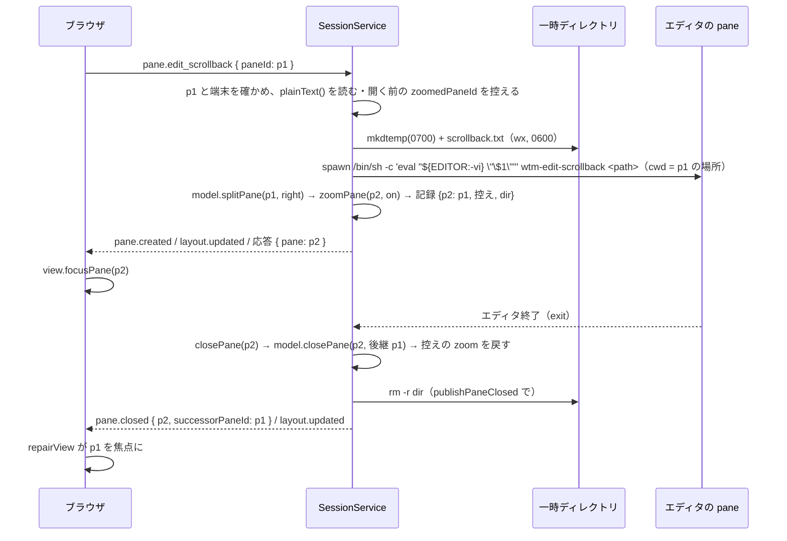

# 仕様: pane のスクロールバックを `$EDITOR` で開く（herdr の `edit_scrollback`）

## 概要

protocol に要求 `pane.edit_scrollback { paneId }`（応答 `{ pane }`）を 1 つ足す。サーバはその pane の
ミラー（`XtermMirror`）の通常バッファ全体を平文にして、OS の一時ディレクトリの下に作った専用の一時
ディレクトリ（0700）へ 0600 の新規ファイルとして書き、`/bin/sh -c 'eval "${EDITOR:-vi} \"\$1\""' <名前> <パス>`
（Windows は `VISUAL`→`EDITOR` を分解した argv＋パス）を起動した新しい pane を、対象の pane を分割して作り、
拡大表示にする。エディタの pane が（どの経路でも）閉じたら専用の一時ディレクトリを消し、`closePane`
経由（エディタの終了・利用者が閉じた）なら焦点を対象の pane へ、拡大表示を開く前へ戻す。ブラウザは
キーのカタログに `edit_scrollback`（既定 `prefix+e`）を足し、応答の pane へ焦点を移す。`prefix+e` の
「後続」の案内（`notYet` の仕組み）は最後の 1 件だったので仕組みごと外す。

## 設計方針

- **サーバ主導の 1 往復**。ブラウザからは pane の id だけを送り、書き出し・一時ファイル・エディタの起動・
  分割・拡大表示はサーバが 1 つの要求の中で行う（`pane.split` と同じ形。herdr もサーバ〔アプリ〕側で完結）。
  ブラウザに書き出した中身を返さない（秘密が混ざりうる中身を余計な経路に流さない）。
- **パスはコマンド文字列に埋め込まず位置引数（`$1`）で渡す**。herdr は `shell_quote` したパスを
  `scrollback_file=<quoted>` として文字列に埋め込むが、本製品は `sh -c <script> <$0> <$1>` の argv で渡す。
  script は固定の文字列で、パスが何を含んでも script の構文に入らない（AC7）。`$EDITOR` は herdr と同じく
  `eval` でシェルの語として解釈する（引数付きの値を許す。AC2）——`EDITOR` はサーバを動かす人が設定する
  サーバのプロセスの環境変数で、ブラウザからは来ない（非機能要件「安全」）。
- **一時ファイルは専用の一時ディレクトリの中に作る**。`fs.mkdtemp(join(tmpdir(), "wtm-scrollback-"))`
  （名前の末尾はランダムで推測できない。POSIX では 0700 で作られる）の中に `scrollback.txt` を
  `flag: "wx"`（既存なら失敗＝上書き・リンク追従をしない）・`mode: 0o600` で書く（AC6）。herdr の
  「pid＋ナノ秒の名前・create_new・0600」よりも、名前が推測できない・ディレクトリごと他人から見えない
  点で強い。後片付けはディレクトリごと `rm -r --force`（AC8）。
- **後片付けはサーバ側の 1 か所**（`SessionService` の `pane.closed` の発行と同じ場所）。herdr はシェルの
  `rm -f` とサーバの後片付けの二重だが、本製品は pane を閉じる全経路（`closePane`・`closeTab`・
  `closeWorkspace`・`replacePane`・シェルの終了からの連鎖）が `publishPaneClosed` を通るので、そこで消せば
  足りる。シェルの script に `rm` を持たせない（Windows でも同じ経路で消える・テストで確かめられる）。
  起動の失敗とサーバの停止は別に消す（下記「振る舞いの詳細」）。
- **書き出すのは通常バッファ**（`term.buffer.normal`）。`bottomLines` はエージェントの判定のために
  いま見えている画面（`buffer.active`）を読むが、スクロールバックを持つのは通常バッファだけで、
  代替画面（vim・less 等）には履歴が無い。代替画面を使うアプリの中で押しても、それまでの履歴が開ける方が
  目的（US1）に合う。herdr（ghostty）がどちらの画面を読むかは未確認（decisions.md D4）。
- **焦点・拡大表示の復帰は既存の仕組みに載せる**。`SessionModel.closePane` に「後継の希望」を渡せるように
  し、渡された pane が残っていればそれを tab の焦点・`RemovalResult.successorPaneId` にする。ブラウザは
  既に `pane.closed` の `successorPaneId` を焦点の後継として使う（`viewRepair.ts`）ので、ブラウザ側の
  変更は要らない（requirements の未確定事項の答え：表せる）。拡大表示は `closePane` の後に開く前の
  `zoomedPaneId` がまだ tab にあれば `zoomPane(…, "on")` で戻す。
- **`notYet`（「後続」の案内）の仕組みは外す**。`e` が最後の 1 件で、残せば `NOT_YET_BINDINGS` が空の
  死んだ経路（キー一覧の `notYetEntry` はテストでも踏めない）になる。画像表示（H13）は herdr に
  既定のキーが無いので、案内の仕組みは要らない。

### 検討した代替案

- **ブラウザに中身を返し、ブラウザ側で表示する（エディタを使わない）**: 目的（使い慣れたエディタで扱う）と
  herdr の挙動から外れる。退けた。
- **`pane.split` に `command` を足して汎用化する**: ブラウザから任意のコマンドを起動できる口になり、
  安全の前提（コマンドはサーバの環境から取る）が崩れる。退けた。
- **herdr と同じくパスを `shell_quote` して文字列に埋め込む**: 引用の関数に誤りがあれば注入になる。位置引数なら
  引用そのものが要らない。退けた。
- **エディタの pane を保存から外す（herdr と同じ）**: `toSessionFileData` でレイアウト木から外し、tab の焦点・
  拡大表示を直す処理が要り、保存・復元の既存の規則に手を入れることになる。requirements F10 のとおり
  既存の規則（普通のシェルとして戻る）に任せる。
- **Windows で `VISUAL`/`EDITOR` が無ければ `notepad.exe`（herdr）**: requirements F4 のとおり失敗にする。

## 対象範囲

- `packages/protocol/src/messages.ts`: `PaneEditScrollbackParams`・`PaneEditScrollbackResult`、
  `METHOD_SCHEMAS["pane.edit_scrollback"]`・`MethodResultMap["pane.edit_scrollback"]` を追加。
- `packages/protocol/src/events.ts`: `PaneClosedEvent.successorPaneId` の説明に「エディタの pane の後継」を追記（型は不変）。
- `packages/server/src/terminal/Mirror.ts`: `Mirror.plainText()` を追加（`XtermMirror` の実装）。
- 新規 `packages/server/src/terminal/scrollbackEditor.ts`: `scrollbackEditorArgv`・`splitWindowsCommandLine`・
  `writeScrollbackFile`・`removeScrollbackDir`。
- `packages/server/src/terminal/TerminalManager.ts`: `CreatePaneOptions.args` を追加（`shell` を渡すときの引数）。
- `packages/server/src/session/SessionModel.ts`: `closePane(paneId, preferredSuccessor?)`。
- `packages/server/src/session/SessionService.ts`: `editScrollback`・エディタの pane の記録・`publishPaneClosed` での
  後片付け・`closePane` での焦点／拡大表示の復帰・`disposeScrollbackEditors`（停止時）・`spawnForPane` の
  コマンド指定・オプション `scrollbackEditor`（テスト用の差し替え）。
- `packages/server/src/surface/methods/pane.ts`: `pane.edit_scrollback` のハンドラ。
- `packages/server/src/composeServer.ts`: `close()` で `session.disposeScrollbackEditors()` を待つ。
- テスト用の偽 `Mirror`（`OutputFanout.test.ts`・`AgentMonitor.test.ts`・`surface/methods/index.test.ts` の
  該当があれば）に `plainText` を足す。
- `packages/web/src/keys/actions.ts`: `{ type: "editScrollback" }` を追加、`{ type: "notYet" }` を削除。
- `packages/web/src/keys/bindings.ts`: `edit_scrollback` を `copy_mode` の直後に追加。
- `packages/web/src/keys/keymap.ts`: `NOT_YET_BINDINGS` と、それを表へ入れる処理を削除。
- `packages/web/src/components/HelpDialog.vue`: `notYetEntry` とその呼び出しを削除。
- `packages/web/src/actions/ActionDispatcher.ts`: `editScrollback` の処理を追加、`notYet` の case を削除。
- web のテスト: `bindings.test.ts`・`keymap.test.ts`・`KeyRouter.test.ts`・`HelpDialog.test.ts`・
  `ActionDispatcher.test.ts` の `notYet`/`e` の前提を置き換え、`edit_scrollback` のケースを足す。
- server のテスト: `Mirror.test.ts`（`plainText`）・新規 `scrollbackEditor.test.ts`・`SessionModel.test.ts`
  （後継の希望）・`SessionService.test.ts`（`editScrollback` 一式）・`surface/methods/index.test.ts`（要求の配線）・
  `TerminalManager` の引数（既存の結合テストに `args` の単体確認を足せるなら足す。無理なら偽の PTY で）。
- protocol のテスト: `messages.test.ts`（スキーマ）。
- docs: `docs/herdr-parity.md`（H11・H26 の対象外の記述）、`docs/verification.md`（キーの説明・手動確認）。
- backlog: `.aidev/backlog/product-roadmap.md:244` を割る（deliver）。

## 依拠する既存の事実

- 新しい pane の分割・拡大表示・焦点: `SessionService.splitPane`（`packages/server/src/session/SessionService.ts:580-610`）は
  `reserveNextPaneId`→`spawnForPane`→`model.splitPane`→`pane.created`・`layout.updated` の順。`SessionModel.splitPane`
  （`SessionModel.ts:304-317`）は拡大表示を解除し新しい pane を tab の焦点にする。`SessionModel.zoomPane`（`:795-800`）は
  `mode: "on"` でその pane を拡大表示にする。
- 一時ファイルの権限: `fs.mkdtemp` が POSIX で 0700 のディレクトリを作ること、`writeFile` の `flag: "wx"` が既存の
  パス（リンクを含む）で `EEXIST` になり書かないことは Node の文書の記述で、リポジトリの中では未確認。T3 のテストで
  実測する（0700/0600 の `stat`・既存のファイルとリンクがある場所への書き込みの失敗）。
- 起動の猶予: `spawnForPane`（`SessionService.ts:909-923`）と `raceSpawn`（同ファイル末尾）は、猶予中に 0 以外で終われば失敗、
  0 で終われば `alreadyExited`。`spawnForPane` は `this.shell` を `CreatePaneOptions.shell` に渡すだけで引数は渡せない。
- 引数: `DefaultTerminalManager.create`（`TerminalManager.ts:52-60`）は `opts.shell` を渡すと `args: []`、渡さなければ
  `ProcessInspector.defaultShell()` の `args`。`PtySpawnOptions.args`（`pty/PtyBackend.ts:4-11`）は node-pty の
  `spawn(file, args)` へそのまま渡る（`NodePtyBackend.ts:14-22`）。
- 環境変数: `envForPane`（`SessionService.ts:882-886`）は `process.env` に `WTM_PANE_ID` 等を足したもの。エディタの pane も
  これを使えば `EDITOR` はサーバのプロセスのものになる。
- pane を閉じる全経路が `publishPaneClosed`（`SessionService.ts:414-416`）を通る: `closeWorkspaceOne`（`:418-430`）・
  `closeTab`（`:557-575`）・`closePane`（`:612-636`）・`replacePane`（`:703-720`）。シェルの終了は `wireExit`→
  `closePaneAfterExit`→`closePane`（`:857-873`）。`grep -n "publishPaneClosed\|terminals.dispose"` で、pane を
  モデルから消す箇所がこれで全部であることを確かめた（`:520`・`:602`・`:919` の `terminals.dispose` はモデルへ入る前の
  失敗の後始末で、pane.closed を出さない）。
- 焦点の後継: `SessionModel.closePane`（`SessionModel.ts:324-342`）は閉じた pane が tab の焦点なら最初の葉を焦点にし、
  `setFocus` する。tab が生き残るときは `zoomedPaneId: null`（`:339`。D100）で拡大表示を必ず解除する。
  `SessionService.closePane`（`:612-636`）は tab が生き残れば `layout.updated` を 1 回出し（`:630-634`）、
  `session.focus_changed` は出さない（同メソッド内に発行が無い）。`RemovalResult.successorPaneId`（`SessionModel.ts:56-69`）は今は `SessionModel.replacePane`（`SessionModel.ts:792`）だけが埋め、
  `SessionService.closePane` は `result.successorPaneId` を `pane.closed` に載せる（`SessionService.ts:619`）。ブラウザは
  `StoreAdapter`（`packages/web/src/store/StoreAdapter.ts:67-69`）で `pane.closed` の `successorPaneId` を
  `repairView`（`viewRepair.ts:31-80`。引数名 `successorHint`）へ渡し、今の焦点が消えたときに後継として選ぶ（既存テスト
  `packages/web/src/store/viewRepair.test.ts:94`）。
- 例外の読み替え: `ControlSurface.invoke`（`packages/server/src/surface/ControlSurface.ts:31-52`）は `RpcError` をそのまま、
  `NotFoundError` を `not_found`、それ以外を `internal` にして返す（詳細はログにだけ残す）。
- 保存・復元: `restorePaneProcess`（`SessionService.ts:1010-1025`）は保存された pane を `spawnForPane(paneId, cwd)`
  （`this.shell`＝既定のシェル）で起こすので、エディタの pane は普通のシェルとして戻る（F10・AC12）。拡大表示の状態は
  `SessionModel.restoreWorkspace`（`:923` 付近の `zoomedPaneId: tabData.zoomedPaneId`）で保存どおりに戻る。
- 停止: `composeServer.close()`（`packages/server/src/composeServer.ts:290-311`）は保存を済ませてから全 pane の端末を
  `terminals.dispose` する。ここに後片付けを足す。
- ミラー: `XtermMirror`（`terminal/Mirror.ts`）は `@xterm/headless` の `Terminal` を持ち、`bottomLines` は
  `term.buffer.active` を読む（`:153-162`）。`IBuffer.normal`・`IBufferLine.isWrapped`・`translateToString(trimRight)` は
  `@xterm/headless` の型定義（`typings/xterm-headless.d.ts:1021,1043,1073`）にある。
- 方式の登録: `registerPaneMethods`（`surface/methods/pane.ts`）が `pane.*` を登録し、`registerAllMethods`
  （`surface/methods/index.ts:24`）から呼ばれる。スキーマは zod の `z.object`（`messages.ts`）で、宣言に無いキーは
  取り除かれる（zod の既定の挙動。`PaneCloseParams` 等と同じ形）。
- キーのカタログ: `ACTIONS`（`packages/web/src/keys/bindings.ts`）に足せば、キー一覧（`HelpDialog.vue` の `actionEntries`）と
  キー設定画面（`KeySettings.vue`）に出る（20260923-missing-keybinding-actions の design「依拠する既存の事実」で
  確認済みの仕組み。`HelpDialog.vue:48-53` の `actionEntries` を今回も直読）。利用者の上書きが既定に勝つ規則は
  `resolveKeymap`（`keymap.ts:88-190`）。
- 「後続」の案内: `NOT_YET_BINDINGS`（`keymap.ts:25-29`。残りは `e` の 1 件）・`resolveKeymap` の手順 3（`:168-171`）・
  `Action` の `notYet`（`actions.ts:72`）・`ActionDispatcher` の `case "notYet"`（`ActionDispatcher.ts:169-171`）・
  `HelpDialog.vue:39-44,112` の `notYetEntry`。`grep -rn "notYet\|NOT_YET"` で、これ以外に使う場所が無い
  （テストと e2e を含めて。e2e には無い）ことを確かめた。
- 新しい pane への焦点と入力の関所: `ActionDispatcher.splitPane`（`ActionDispatcher.ts:572-585`）が `pane.split` の応答で
  `view.focusPane`・`releaseHold` する形。

## インターフェース / データ構造

### protocol（`messages.ts`）

```ts
// 20260926-edit-scrollback（herdr の pane.edit_scrollback）。
export const PaneEditScrollbackParams = z.object({ paneId });
export type PaneEditScrollbackParams = z.infer<typeof PaneEditScrollbackParams>;
export interface PaneEditScrollbackResult {
  pane: Pane; // 開いたエディタの pane
}
// METHOD_SCHEMAS: "pane.edit_scrollback": PaneEditScrollbackParams
// MethodResultMap: "pane.edit_scrollback": PaneEditScrollbackResult
```

エラーは既存の `ErrorCode` の範囲: `not_found`（pane が無い・端末が無い）・`spawn_failed`（エディタを起動できない・
Windows でエディタが決まらない）・`internal`（一時ファイルを作れない。`ControlSurface` が RpcError 以外を internal にする）。

### server

```ts
// Mirror
plainText(): string; // 通常バッファの全行。折り返しを 1 行に戻し、各行の右端の空白を落とし、末尾の空行を除いて "\n" で結ぶ（空でなければ末尾に "\n"）

// terminal/scrollbackEditor.ts
export function scrollbackEditorArgv(path: string, platform: NodeJS.Platform, env: NodeJS.ProcessEnv): string[] | null;
//  Unix: ["/bin/sh", "-c", 'eval "${EDITOR:-vi} \\"\\$1\\""', "wtm-edit-scrollback", path]
//    ↑ JS の文字列。sh が受け取る script の正典は  eval "${EDITOR:-vi} \"\$1\""  （`\"`・`\$1` はバックスラッシュ付きで sh に渡る）
//  win32: VISUAL（空白だけは無いもの扱い）→ EDITOR を splitWindowsCommandLine し、末尾に path。どちらも無い・分解して空なら null
export function splitWindowsCommandLine(s: string): string[]; // 空白で区切り、" で囲んだ区間は空白を含めて 1 語（" 自体は落とす。\ はそのまま）
export async function writeScrollbackFile(text: string, root?: string, write?: typeof fs.writeFile): Promise<{ dir: string; path: string }>;
//  write はテストで書き込みの失敗を起こすための差し替え（既定は node:fs/promises の writeFile）
//  dir = mkdtemp(join(root ?? tmpdir(), "wtm-scrollback-")), path = join(dir, "scrollback.txt")（flag "wx", mode 0o600）。書けなければ dir を消して投げる
export async function removeScrollbackDir(dir: string): Promise<void>; // rm(dir, { recursive: true, force: true })

// TerminalManager
interface CreatePaneOptions { /* 既存 */ args?: string[] } // shell を渡すときだけ効く。省略は []

// SessionModel
closePane(paneId: PaneId, preferredSuccessor?: PaneId): RemovalResult;
//  閉じた後の tab に preferredSuccessor が残っていれば、閉じた pane が tab の焦点だったときの新しい焦点をそれにし、
//  RemovalResult.successorPaneId に入れる（tab ごと閉じる連鎖では無視）

// SessionService
interface SessionServiceOptions { /* 既存 */ scrollbackEditor?: { tmpRoot?: string; platform?: NodeJS.Platform; env?: NodeJS.ProcessEnv } }
async editScrollback(paneId: PaneId): Promise<{ pane: Pane }>;
async disposeScrollbackEditors(): Promise<void>; // 記録に残っている全エディタの一時ディレクトリを消す（停止時）
private spawnForPane(paneId: PaneId, cwd: string, command?: { shell: string; args: string[] }): Promise<{ ok: boolean; alreadyExited: boolean }>;
//  command を渡せば既定のシェル（this.shell）の代わりにそれを起動する（CreatePaneOptions.shell/args へ渡す）
// 内部の記録: Map<PaneId /*エディタ*/, { sourcePaneId: PaneId; previousZoomedPaneId: PaneId | null; dir: string }>
```

### web

```ts
// actions.ts
| { type: "editScrollback" }   // 追加
// { type: "notYet"; work: string } は削除

// bindings.ts（copy_mode の直後）
{ id: "edit_scrollback", label: "スクロールバックをエディタで開く", group: "pane", defaults: ["prefix+e"], action: { type: "editScrollback" } }
```

## 振る舞いの詳細



1. `editScrollback(paneId)`:
   1. `requirePane(paneId)`（無ければ `not_found`）。`terminals.get(paneId)` が無ければ `not_found`
      （復元に失敗した `status: failed` の pane など）。
   2. エディタが決まるかだけを先に見る（`scrollbackEditorArgv("", platform, env) === null`——Windows で
      `VISUAL`/`EDITOR` が無い——なら一時ファイルを作る前に `spawn_failed`）。argv そのものは手順 6 で実際のパスから作る。
   3. `text = host.mirror.plainText()`・`previousZoomedPaneId = tab.zoomedPaneId` を控える。
   4. `writeScrollbackFile(text, tmpRoot)`。失敗は投げる（`internal`。途中の dir は関数の中で消す）。
   5. 以降の失敗はすべて `removeScrollbackDir(dir)` してから投げる。
   6. `requirePane(paneId)` をもう一度（await の間に閉じられていないか）。`newPaneId = model.reserveNextPaneId()`、
      `argv = scrollbackEditorArgv(path, platform, env)`（手順 4 の実際のパス）で作り、
      `spawnForPane(newPaneId, source.cwd, { shell: argv[0], args: argv.slice(1) })`。失敗は `spawn_failed`。
   7. `model.splitPane(paneId, "right", undefined, newPaneId, { cwd: source.cwd, shell: argv[0], cols: source.cols, rows: source.rows })`
      （失敗なら `terminals.dispose(newPaneId)` して投げる。`splitPane` と同じ）→ `model.zoomPane(newPaneId, "on")`。
   8. 記録 `editors.set(newPaneId, { sourcePaneId: paneId, previousZoomedPaneId, dir })`。
   9. `pane.created`・`layout.updated`（拡大表示を含む tab）を出し、`persist.touch()`。
   10. `spawn.alreadyExited`（猶予中に 0 で終わった）なら `closePaneAfterExit(newPaneId, 0)`（下の 2. を通る）。
   11. `{ pane }` を返す。
2. `closePane(paneId)`（既存）に足す: 閉じる前に `editor = editors.get(paneId)`。`model.closePane(paneId, editor?.sourcePaneId)`。
   `model.closePane` は tab が生き残るとき拡大表示を必ず解除する（上の「依拠する既存の事実」）ので、`previousZoomedPaneId` が
   null（開く前は拡大表示でなかった）なら何もしなくてよい。tab が生き残り、`editor.previousZoomedPaneId` が非 null でその tab にまだあれば `model.zoomPane(それ, "on")`
   （既存の `layout.updated` の発行より前に行い、1 回の `layout.updated` に含める）。焦点が後継へ移ったなら
   `setFocus` は `model.closePane` の中で済む（既存と同じく `session.focus_changed` は出さない）。
3. `publishPaneClosed(paneId, …)`（既存）に足す: `editors` に記録があれば消し、`removeScrollbackDir(dir)` を
   待たずに始める（失敗はログに warn。投げない）。
4. `disposeScrollbackEditors()`: 記録に残っている全 dir を `removeScrollbackDir` し、記録を空にする。
   `composeServer.close()` が端末を dispose した後に await する。
5. `Mirror.plainText()`: `buffer.normal` の 0〜`length-1` 行を順に読み、次の行が `isWrapped` なら今の行は右端を
   削らずに（`translateToString(false)`）次の行とつなぎ、そうでなければ `translateToString(true)` で行を閉じる。
   末尾の空行を除き、`"\n"` で結んで末尾に `"\n"`（全体が空なら `""`）。
6. ブラウザ `editScrollback()`: `paneId = view.focusedPaneId`（無ければ何もしない）。`input.holdInput(paneId)`（D99。
   応答までに打った文字は新しい pane へ）→ `conn.request("pane.edit_scrollback", { paneId })` →
   成功で `view.focusPane(r.pane.id)`・`releaseHold(hold, r.pane.id)`、失敗で `hold.cancel()`・トースト
   「スクロールバックをエディタで開けませんでした」。

## ドメイン固有の考慮

- 安全（requirements 非機能要件・US2）:
  - パスはサーバが作り、ブラウザから来ない。script は固定文字列で、パスは `$1`（argv）として渡る。
    外側の二重引用符の中で `${EDITOR:-vi}` だけが先に展開され（`\"`・`\$` は文字の `"`・`$` になる）、`eval` が
    解釈するのは「`EDITOR` の値」＋` "$1"` という文字列（例 `code -w "$1"`）。`$1` は `eval` の中で初めて、二重引用符の中で
    展開されるので 1 語のまま（パスに `"`・`$`・`;`・空白・改行があっても構文にならない）。
  - `EDITOR` の値そのものは herdr と同じく信用する（サーバの運用者が設定する値。`eval` はそのためのもの）。
  - 一時ディレクトリ 0700・ファイル 0600・`wx`。`umask` が 0700 を狭めることはあっても広げることは無い。
  - サーバの異常終了（kill -9 等）では dir が残りうる（requirements AC8 の但し書き）。権限で守られる。
- 並行作業（外部操作 API / CLI の work）との衝突: `messages.ts` は宣言の追加と `METHOD_SCHEMAS`/`MethodResultMap` の
  各 1 行の追加だけ。`SessionService.ts` は新しいメソッドの追加と `closePane`・`publishPaneClosed`・`spawnForPane` の
  最小の変更。
- herdr との違い（docs に書く）: ①パスの渡し方（位置引数）②一時ファイルの置き方（専用ディレクトリ）③後片付けは
  サーバ側だけ ④Windows でエディタが無いときは失敗（herdr は notepad.exe）⑤再起動後は普通のシェルとして戻る
  （herdr は保存から外す）⑥成功のトーストは出さない ⑦通常バッファを書き出す（代替画面の中でも履歴が開く）
  ⑧要求はブラウザが対象の pane を名指しする（herdr の API はフォーカス中でなければ `stale_pane_target`。本製品は
  焦点がブラウザごとにあるので、名指しした pane が存在すれば開く）。

## エラー処理 / 異常系

| 場合 | 扱い | 残るもの |
|---|---|---|
| pane が無い | `not_found`（一時ファイルを作る前） | 何も |
| 端末が無い（failed の pane 等） | `not_found`（一時ファイルを作る前） | 何も |
| Windows でエディタが決まらない | `spawn_failed`（一時ファイルを作る前） | 何も |
| 一時ファイルを作れない | `internal`（`writeScrollbackFile` が途中の dir を消して投げる） | 何も |
| 書き出し中に対象の pane が閉じられた | `not_found`（dir を消す） | 何も |
| エディタが猶予中に 0 以外で終わる（起動できない等） | `spawn_failed`（`spawnForPane` が端末を dispose、dir を消す） | 何も |
| エディタが猶予中に 0 で終わる | pane をコミットしてすぐ閉じる（通常の終了と同じ後片付け） | 何も |
| `model.splitPane` が投げる（猶予中に分割元の tab が閉じた） | 端末を dispose、dir を消して投げる | 何も |
| dir の削除に失敗 | ログに warn。要求・閉じる処理は止めない | dir（権限で守られる） |

ブラウザはどのエラーでも同じトーストを出す（サーバの message は利用者に見せない。D107 と同じ考え方）。

## 受け入れ基準との対応

- AC1: 入力は `KeyRouter` が `prefix+e` から引く `{ type: "editScrollback" }`（カタログの既定）と `view.focusedPaneId`。
  `ActionDispatcher.editScrollback` が `pane.edit_scrollback` を送り、サーバの手順 1.6〜1.9 が同じ tab に分割・拡大表示し、
  応答で `view.focusPane`。作業場所は `source.cwd`（`requirePane` で取った対象の pane の記録）。
  確認: `ActionDispatcher.test`・`SessionService.test`（tab・`zoomedPaneId`・cwd・焦点）・`index.test`（配線）。
- AC2: 入力はサーバのプロセスの環境（`scrollbackEditorArgv` の `env`。本番は `process.env`、テストは差し替え）。
  Unix の argv は `eval "${EDITOR:-vi} \"\$1\""`（script の正典はインターフェースの節。空の `EDITOR` も `vi`）、Windows は `VISUAL`→`EDITOR`→null（null は
  AC5 の `spawn_failed`）。確認: `scrollbackEditor.test`（argv の形・実際に `/bin/sh` で走らせて、引数付きの `EDITOR`
  がパスを受け取ること・未設定で `vi` になること〔`vi` の代わりに PATH 先頭へ置いた偽の `vi` で〕）。
- AC3: 入力は対象の pane の `TerminalHost.mirror`。`plainText()` の規則（振る舞い 5）。確認: `Mirror.test`
  （スクロールバックへ押し出された行を含む・折り返しが 1 行に戻る・色の制御列が無い・末尾の空行が無い・代替画面の中でも通常バッファ）と
  `SessionService.test`（書いたファイルの中身が `plainText()` と同じ）。
- AC4: 入力はエディタの記録（`sourcePaneId`・`previousZoomedPaneId`）。エディタの終了は `wireExit`→`closePane`、
  利用者が閉じるのは `pane.close`→`closePane`。どちらも振る舞い 2 を通る。対象が既に無ければ `model.closePane` の
  既定（最初の葉）。確認: `SessionModel.test`（後継の希望）・`SessionService.test`（終了・閉じる・開く前に拡大表示
  だった・対象が先に閉じられていた）。ブラウザ側は既存の `viewRepair` の `successorHint`（既存テストあり）。
- AC5: 失敗の 4 場合（pane が無い・端末が無い・一時ファイルを作れない・エディタを起動できない〔Windows で決まらないを含む〕）と、
  表の「書き出し中に対象の pane が閉じられた」「`model.splitPane` が投げる」を「エラー処理」の表のとおり個別に `SessionService.test` で確かめる（新しい pane が model に無い・pane.created が出ない）。
  ブラウザのトーストは `ActionDispatcher.test`。
- AC6: 入力は `tmpdir()`（テストは `tmpRoot`）。`writeScrollbackFile` の mkdtemp・`wx`・0600。確認: `scrollbackEditor.test`
  （dir が 0700・ファイルが 0600・名前が呼ぶたびに違う・既存のファイル／リンクがある場所へは書かない〔`wx` の失敗〕）。
  Windows の権限は未検証の穴。
- AC7: 入力は `tmpRoot`（テストでは空白・`"`・`$`・`;`・`'` を含むディレクトリ名を作って渡す）。確認: `scrollbackEditor.test` で
  実際に `/bin/sh` を走らせ、偽のエディタが受け取った引数が 1 つでパスと一致し、注入用の印（例 `; touch <印>`）が作られないこと。
- AC8: 入力はエディタの記録の `dir`。確認: `SessionService.test`（終了・`pane.close`・`tab.close`・`workspace.close`・
  起動の失敗・`splitPane` の失敗・`disposeScrollbackEditors` の後に dir が無い）・`scrollbackEditor.test`（一時ファイルを作れない
  ——`write` の差し替えで書き込みを失敗させる——ときに途中の dir が消える）。停止の配線は `composeServer.close()` の
  1 行（結合テストで確かめられなければ未検証の穴に書く）。
- AC9: 入力は `ACTIONS`（カタログ）。確認: `bindings.test`（`edit_scrollback` がカタログにあり既定 `prefix+e`・pane 群）・
  `keymap.test`（既定の表で `e` が `editScrollback`）・`HelpDialog.test`（pane 群にその行があり「未対応」が出ない）・
  `KeyRouter.test`。キー設定画面は `ACTIONS` から描く既存の仕組み（`KeySettings.test` があれば 1 行確かめる）。
- AC10: 入力は利用者の上書き（`KeyPrefs.bindings`）。確認: `keymap.test`（`goto: ["prefix+e"]` の上書きで `e` が `goto`、
  `edit_scrollback` は落ちて割り当てなし〔既存の衝突の規則〕）。
- AC11: `docs/herdr-parity.md` の H11 行・H26 の対象外の記述、`docs/verification.md` の「共通：AC10・AC13・AC14・AC18（AC16）」節の AC13（20260918-web-terminal-multiplexer の AC。キーの一覧）の段落と手動確認の項目を更新する。
- AC12: 入力は保存された session（`toSessionFileData`）。既存の `restorePaneProcess` が既定のシェルで起こす。確認:
  `SessionService.test`（エディタの pane を含む保存データから `restore` したとき `createOptions` の `shell`/`args` が既定になる）。
- AC13: deliver で backlog 行を割る（`aidev verify` が消し込みを検査する）。
- AC14: 入力は `pane.edit_scrollback` の params。確認: `messages.test`（`paneId` 以外のキーは取り除かれる・`paneId` が
  無ければ通らない）。既存の型は変えない（`pnpm -s typecheck` が既存の利用箇所を通す）。
