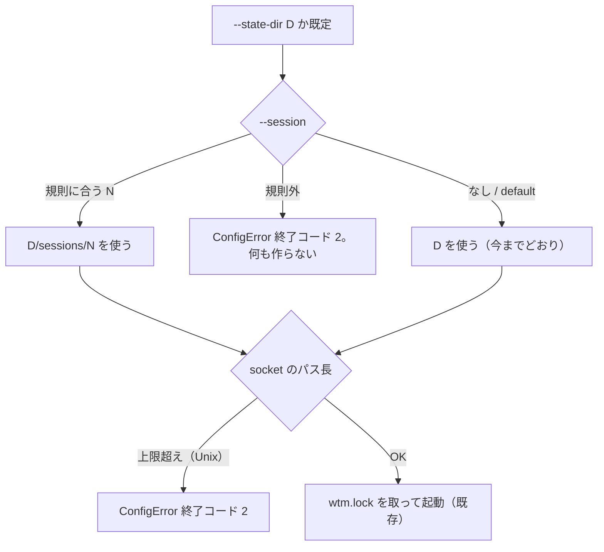

# 仕様: 名前付き session（herdr の `--session <name>` 相当）

## 概要

名前付き session を「**既定の状態ディレクトリの下の `sessions/<name>/` を状態ディレクトリとして使う**」ことで実現する。
本製品のサーバが状態として持つもの（`wtm.lock`・`auth.json`・`session.json`・`integrations.json`・`server.log`・
公式フック連携の socket）は、すべて状態ディレクトリ 1 つから組み立てられている（下記「依拠する既存の事実」）ので、
**状態ディレクトリを選び分けるだけで、herdr と同じ「pane・socket・保存状態がまるごと別」の名前空間になる**。
サーバの中（SessionService・永続化の形式・Web UI・protocol・wtmctl）は変えない。

足すもの:

1. `wtm serve --session <name>`・`wtm token reset --session <name>`（状態ディレクトリの選択）。
2. 名前の規則（`sessionNameProblem`）。herdr の規則に、Windows で作れない・別名になる名前と先頭の `-` の禁止を足す。
3. `wtm session list [--json] [--state-dir D]`・`wtm session delete <name> [--json] [--state-dir D]`。
4. 起動時の表示に session 名、ポート使用中・状態ディレクトリ使用中の案内に `--session`。
5. 状態ディレクトリが深くなることで起きうる「公式フック連携の socket のパスが長すぎて起動が落ちる」を、
   起動前の分かる案内（終了コード 2）にする。

## 設計方針

- **置き場所は herdr と同じ形**: herdr は既定の session を `<config_dir>` 直下、名前付きを `<config_dir>/sessions/<name>/`
  に置く。本製品も既定の session＝既定の状態ディレクトリ（今までどおり）、名前付き＝`<既定の状態ディレクトリ>/sessions/<name>/`。
  既存の状態ディレクトリの中身は動かさない（互換。`sessions/` という名前のファイル・ディレクトリは既存の状態ディレクトリに
  存在しない——下記「依拠する既存の事実」）。
- **`--state-dir` と併用できる**: `--state-dir D` は「既定の session の状態ディレクトリ」を差し替えるものと読み、
  `--session N` はその下の `D/sessions/N/` を選ぶ。herdr には `--state-dir` 相当が無いので本製品の拡張。
  代替案（`--state-dir` と `--session` の併用を禁じる）は、LAN 用の状態ディレクトリを別ディスクに置いている利用者が
  その下で名前付き session を使えなくなるので退けた（decisions D2）。
- **`default` は既定の session の別名**（herdr の `normalize_name`）。`--session default` は付けないのと同じ。
- **「動いているか」は `wtm.lock` で判定する**: herdr は session の socket に繋がるかで見る。本製品は同じ状態ディレクトリの
  排他を `wtm.lock`（pid とホスト名）で既に持っているので、その判定（`StateDirLock` の「使用中」の規則）を読み取り専用で
  使う。ポートは状態ディレクトリに記録されていないので一覧には出さない（対象外。decisions D1）。
- **削除はロックを取ってから消す**: 動いていないことを確かめてから消すまでの間に `wtm serve --session N` が起動すると、
  動いている session の状態を消してしまう。`StateDirLock` を取ってから消せば、その間の起動は `wtm.lock` で止まる。
- **名前の検証は 1 つの関数に集める**（`sessionNameProblem`）。状態ディレクトリを決める `resolveSessionStateDir` と、
  削除の `deleteSession` の両方がこれを通し、規則外なら同じ `ConfigError`（終了コード 2）を投げる。`wtm serve` は
  `resolveServeOptions` から、`wtm token reset` は `sessionCommands.ts` の `runTokenReset` から `resolveSessionStateDir` を呼ぶ。
- **テストのため `main.ts` に処理を置かない**: `main.ts` は読み込むと起動するので単体テストできない（既存の
  `cliArgs.ts` の分け方と同じ）。`session list/delete` は出力先を引数で受ける関数（`sessionCommands.ts`）にする。

## 対象範囲

- 追加: `packages/server/src/persist/namedSession.ts`（名前の規則・状態ディレクトリの解決・一覧・削除の本体）と
  `namedSession.test.ts`
- 追加: `packages/server/src/sessionCommands.ts`（`wtm session list/delete` の表示と終了コード、`main.ts` から移す `runTokenReset`）と `sessionCommands.test.ts`
- 変更: `packages/server/src/cliArgs.ts`（`--session`・`--json`・`session list|delete`）と `cliArgs.test.ts`
- 変更: `packages/server/src/config.ts`（`RawServeArgs.session`・`ServeOptions.sessionName`・状態ディレクトリの解決・
  socket のパスの長さの検査・案内文）と `config.test.ts`
- 変更: `packages/server/src/persist/StateDirLock.ts`（読み取り専用の `inspect()`）と `StateDirLock.test.ts`
- 変更: `packages/server/src/composeServer.ts`（`agentReportSocketPathFor` を `config.ts` へ移し、そこから import する）
- 変更: `packages/server/src/startupBanner.ts`（session 名の行）と `startupBanner.test.ts`
- 変更: `packages/server/src/main.ts`（`runTokenReset` を `sessionCommands.ts` へ移し、`session list/delete` を配線・help）
- 変更: `packages/server/src/composeServer.integration.test.ts`（名前付き session での起動）
- 変更: `docs/tls-setup.md`・`docs/verification.md`・`docs/herdr-parity.md`

## 依拠する既存の事実

- 状態ディレクトリから組み立てるもの: `wtm.lock`（`packages/server/src/persist/StateDirLock.ts` の `STATE_DIR_LOCK_FILE`・
  コンストラクタ）、`auth.json`・`auth-backups/`（`persist/AuthFile.ts` のコンストラクタ）、`session.json`・`session-backups/`
  （`persist/SessionFile.ts` のコンストラクタ）、`integrations.json`・`integrations-backups/`（`persist/IntegrationFile.ts`）、
  `server.log`（`composeServer.ts` の `new FileLogger(join(options.stateDir, "server.log"))`）、公式フック連携の socket
  （`composeServer.ts` の `agentReportSocketPathFor`：Unix は `<状態ディレクトリ>/agent-report.sock`、Windows は
  状態ディレクトリの sha256 から作る named pipe 名）。状態ディレクトリ以外に置く状態は、worktree の作成先
  （`--worktree-dir`。既定 `~/.wtm/worktrees`）と wtmctl のキャッシュ（`packages/cli/src/session.ts` の
  `defaultSessionFilePath`＝`~/.wtmctl/session.json`。キーは URL の origin）。どちらも session ごとに分ける必要は無い
  （worktree は Git のリポジトリの隣の作業ツリーで session に属さない。wtmctl は URL ごと）。
  → 以上から、既存の状態ディレクトリに `sessions` という名前のものは作られない（上の一覧に無い）。
- 状態ディレクトリの既定値: `config.ts` の `defaultStateDir`（Linux・macOS は `$XDG_STATE_HOME` か `~/.local/state` の下の
  `web-tn-multiplexer`、Windows は `%LOCALAPPDATA%\web-tn-multiplexer`）。`resolveServeOptions` が
  `args.stateDir ?? defaultStateDir(env)` で決める。`wtm token reset` は `main.ts` の `runTokenReset` で
  `stateDir ?? defaultStateDir()`。
- CLI の引数の解釈: `cliArgs.ts` の `parseArgs`。コマンドは `serve`・`token reset`・help。`--state-dir` だけが両方で使え、
  誤りは `ConfigError`（`main.ts` が終了コード 2）。`--opt=value` の形は受け付けない（`switch (arg)` の完全一致）。
- 「使用中」の規則: `StateDirLock` の `isInUse`（ホスト名が違えば使用中、同じ pid はこのプロセスで持っているときだけ、
  それ以外は `isPidAlive`）。`acquire()` は状態ディレクトリを `mkdir -p` する（`StateDirLock.ts` の `acquire` の
  `mkdir(dirname(this.path), { recursive: true })`）。`release()` は `ENOENT` を黙って返す（`release` の catch）。
  また、ロックのファイルの pid・ホスト名が自分のものでなければ消さない（`release` の `holder.pid !== this.pid || this.isOtherHost(holder)` で return）。
- 公式フック連携の socket の listen の失敗は起動全体の失敗になる: `composeServer.ts` の `listen()` の手順 2.5 の
  `await startAgentReportSocket(...)` が投げると catch でロックを放して投げ直し、`main.ts` の `runServe` では
  `bindFailureHint` が `syscall: "listen"` かつ未知の code（`EINVAL`）には `undefined` を返すので終了コード 1 になる。
  このとき token は作成済み（手順 2 の後）。
- Unix ドメイン socket のパスの長さ（手元で実測。Linux・Node v24.15.0。数えたのは絶対パスの UTF-8 のバイト長＝
  `Buffer.byteLength(path)`、NUL は含まない。記録は下記）: 108 バイトまで listen でき、109 バイトで `EINVAL`
  （Linux の `sun_path` は 108 バイトで、NUL 終端を要しない）。macOS の `sun_path` は 104 バイトで NUL 終端が要るとされるが
  **未確認**（手元に macOS が無い）——同じ数え方で 103 バイトを上限とみなす。**「今まで起動できていた長さは断らない」が
  実測で言えるのは Linux だけ**（macOS は未確認のまま）。
  ```
  106 ok
  107 ok
  108 ok
  109 EINVAL
  ```
- 案内文を確かめている既存のテスト: `config.test.ts`「ポートが使用中：--port と、並行して動かすなら --state-dir も分けることを
  案内する」（`toContain("並行して動かすなら --state-dir も分け")`）。状態ディレクトリ使用中の案内の文面は
  `composeServer.integration.test.ts` 等で `toThrow(ConfigError)`・message の一部を見ている（文面の hint 部分を足しても
  既存の断定は崩れない——実装時にテストを走らせて確かめる）。
- 起動時の表示: `startupBanner.ts` の `startupLines`（純関数）と、`main.ts` の `runServe` がそれを出す（`runServe` は
  `composeServer` の返す `server.options` から `host`・`port` 等を読む）。
- 案内文: `config.ts` の `listenFailureHint(code)`（EADDRINUSE 等の案内）・`bindFailureHint(err)`（`isBindFailure` のときだけ
  `listenFailureHint` を返す）・`stateDirInUseError(inUse, stateDir, command)`。`main.ts` の `runServe` は `bindFailureHint` が
  返した案内で `ConfigError` を作り終了コード 2（EADDRINUSE はここ）、`undefined` なら投げ直して終了コード 1。
- herdr の仕様（一次資料・読むだけ）: `scratchpad/herdr/src/session.rs`（`DEFAULT_SESSION_NAME = "default"`・
  `MAX_SESSION_NAME_LEN = 64`・`validate_name`・`data_dir_for`＝`config_dir/sessions/<name>`・`list_sessions`＝既定を先頭に、
  `sessions/` の下のディレクトリ（`file_type().is_dir()`）で規則に合い `default` でないものを名前順・`delete_session`＝
  `default` は拒否・動いていれば拒否・`exact_session_dir_for_delete` で綴りの完全一致を要求）、
  `src/cli.rs` の `run_session_command`（`list [--json]`・`attach`・`stop <name> [--json]`・`delete <name> [--json]`）、
  `print_session_table`（`name`・`status`（running/stopped）・`directory`・`socket` の列）、`print_session_error`
  （標準エラーに `{"error":{"code","message"}}`）、`session_delete`（失敗は `session_delete_failed` で終了コード 1）。
  `session.rs` の `normalize_name`（`default` を既定の session＝`None` に読む）・`session_info` の `running`＝
  `is_running_at`（socket のファイルがあり接続できる）。状態の置き場所は `crate::config::config_dir()` 固定で、
  `--state-dir` に当たる指定は無い（`session.rs` の `data_dir_for`・`configure_from_args` が読むのは `--session` と
  環境変数だけ）。
- ポートは状態ディレクトリに記録されていない: 状態ディレクトリに書くのは上の一覧のファイルだけで、`wtm.lock` の中身は
  pid とホスト名の 2 行（`StateDirLock.ts` の `tryCreate`）。ポートは `ServeOptions.port` としてメモリにだけある。
- `main.ts` の `main().catch` は `ConfigError` 以外の例外を `process.exit(1)` にする（`main.ts` 末尾）。

## インターフェース / データ構造

### `persist/namedSession.ts`

```ts
export const DEFAULT_SESSION_NAME = "default";
export const SESSIONS_DIR = "sessions";
export const MAX_SESSION_NAME_BYTES = 64;

/** 規則に合わなければ理由（日本語）を返す。合えば undefined。`default` は合う。 */
export function sessionNameProblem(name: string): string | undefined;

/** 既定の session の状態ディレクトリ `base` と名前から、その session の状態ディレクトリを返す。
 *  name が undefined・"default" なら base。規則外なら ConfigError（終了コード 2）。 */
export function resolveSessionStateDir(base: string, name: string | undefined): string;

export interface SessionEntry {
  name: string;          // 既定の session は "default"
  default: boolean;
  running: boolean;
  pid?: number;          // running のときだけ（wtm.lock の持ち主）
  host?: string;         // 持ち主が別のホストのときだけ
  stateDir: string;
}

/** 既定を先頭に、名前付きを名前順に。`sessions/` の下の、規則に合う名前のディレクトリ（シンボリックリンク・ファイルは除く）だけ。 */
export function listSessions(base: string): Promise<SessionEntry[]>;

export class SessionDeleteError extends Error { readonly code: "default" | "not-found" | "spelling" | "not-directory" | "running" | "remove-failed"; }

/** 動いていない名前付き session の状態ディレクトリを消す。消したものの SessionEntry を返す。 */
export function deleteSession(base: string, name: string): Promise<SessionEntry>;

/** 名前と完全に一致するエントリを返す。無ければ lstatPath が成功する（別の綴りが当たる）なら spelling、ENOENT なら not-found。 */
export function findExactEntry(entries: readonly Dirent[], name: string, lstatPath: () => Promise<unknown>): Promise<Dirent>;
```

### `StateDirLock.inspect()`

```ts
/** 読み取り専用：ロックの持ち主が使用中なら { pid, otherHost? }、そうでなければ undefined。ファイルを作らない・消さない。 */
async inspect(): Promise<{ pid: number; otherHost?: string } | undefined>;
```

### CLI（`cliArgs.ts`）

```
wtm serve [...] [--state-dir D] [--session NAME]
wtm token reset [--state-dir D] [--session NAME]
wtm session list [--state-dir D] [--json]
wtm session delete NAME [--state-dir D] [--json]
```

`ParsedArgs` に `command: "session-list" | "session-delete"` と `session?: string`（`--session`）・`sessionTarget?: string`
（delete の名前）・`json: boolean` を足す。`--session` は serve・token reset だけ、`--json` は session だけで使える
（他で使うと `ConfigError`）。`wtm session delete` の名前は位置引数ちょうど 1 つ。

### `config.ts`

- `RawServeArgs.session?: string`、`ServeOptions.sessionName: string | undefined`（名前付きのときだけ。`default` は undefined）。
- `resolveServeOptions(args, env, os = platform())`: `stateDir = resolveSessionStateDir(args.stateDir ?? defaultStateDir(env), args.session)`。
  続けて `os !== "win32"` なら `agentReportSocketPathFor(stateDir, os)` の `Buffer.byteLength` を検査し、上限
  （`os === "linux"` は 108、それ以外は 103）を超えれば `ConfigError`。
- `export function agentReportSocketPathFor(stateDir: string, os: NodeJS.Platform = platform()): string`——`composeServer.ts` の
  既存の関数（Unix は `<stateDir>/agent-report.sock`、Windows は sha256 の named pipe 名）を中身を変えずに移し、
  `composeServer.ts` はこれを import する（検査と実際に listen するパスを 1 つの関数から出す）。
- `composeServer(rawArgs: RawServeArgs)` は既存どおり中で `resolveServeOptions(rawArgs)` を呼ぶので、`RawServeArgs.session` を
  足せば `composeServer({ session: "work", stateDir })` がそのまま名前付き session を選び、規則外なら同じ `ConfigError` を投げる。
- `listenFailureHint("EADDRINUSE")` と `stateDirInUseError(..., "serve")` の文面に `--session` を足す。

### `sessionCommands.ts`

```ts
export interface CommandIo { out(line: string): void; err(line: string): void; }
export function runSessionList(base: string, json: boolean, io: CommandIo): Promise<number>;   // 0（読み取りの失敗は投げる→main が終了コード 1）
export function runSessionDelete(base: string, name: string, json: boolean, io: CommandIo): Promise<number>; // 0 / 1。規則外の名前は ConfigError を投げる→main が終了コード 2
export function runTokenReset(base: string, session: string | undefined, io: CommandIo): Promise<void>; // main.ts から移す。状態ディレクトリは resolveSessionStateDir(base, session)
```

`ConfigError` の表示（`--json` でも）は既存の `main` の catch（`wtm: <message>` と hint、終了コード 2）に任せる。
`--json` の `{"error":…}` を出すのは `runSessionDelete` の `SessionDeleteError`（終了コード 1）だけで、`wtm session list` の
読み取りの失敗は `--json` でも JSON にせず投げる（`main` の既定の扱い＝終了コード 1。想定外の失敗なので形を約束しない）。

表の形（herdr の `print_session_table` に合わせる）:
```
name                 status   directory
default              running  /home/you/.local/state/web-tn-multiplexer (pid 12345)
work                 stopped  /home/you/.local/state/web-tn-multiplexer/sessions/work
```
JSON: `{"sessions":[{"name":"default","default":true,"running":true,"pid":12345,"stateDir":"…"}, …]}`、
delete は `{"deleted":true,"session":{…}}`。失敗は標準エラーに `wtm: <理由>`（`--json` のときは
`{"error":{"code":"…","message":"…"}}`。herdr の `print_session_error` と同じ形）。

### 起動時の表示

`StartupInfo.session?: { name: string; stateDir: string }`。あれば `wtm: listening on …` の次の行に
`wtm: session <name>（状態ディレクトリ: <stateDir>）`。無ければ今までと 1 行も変わらない。

## 振る舞いの詳細



名前の規則（`sessionNameProblem`）——herdr の `validate_name` に ★ を足す:
- 空でない。64 バイト以下（ASCII だけなので文字数＝バイト数）。
- 使える文字は ASCII の英数字と `.` `_` `-` だけ（`/`・`\`・空白・制御文字・非 ASCII は不可→パスの区切り・トラバーサル不可）。
- `.`・`..` は不可。
- ★ 先頭の `-` は不可（`wtm session delete -x` がオプションと読まれて消せない名前を作らない）。
- ★ 末尾の `.` は不可（Windows はディレクトリ名の末尾の `.` を落とすので `work.` と `work` が同じ場所になる）。
- ★ Windows の予約デバイス名は不可（大文字小文字を問わず、最初の `.` より前が `CON` `PRN` `AUX` `NUL` `COM0`〜`COM9`
  `LPT0`〜`LPT9` のもの。`con.txt` も不可）。Windows 以外でも断る（同じ状態を Windows へ持ち出せる・同じ規則を全 OS で）。

一覧（`listSessions`）:
- 先頭は既定の session（`base`。状態ディレクトリが無くても出す——`stopped`）。
- `base/sessions` を `readdir(withFileTypes)` し、`isDirectory()`（シンボリックリンクは false）かつ規則に合い `default`
  でない名前だけを名前順に。`sessions` が無ければ既定だけ。
- running は `new StateDirLock(dir).inspect()`（ファイルを作らない）。

削除（`deleteSession`）の順:
1. `name === "default"` → `default`。2. 規則外 → `ConfigError`（終了コード 2）。
3. `findExactEntry`：`base/sessions` の `readdir(withFileTypes)` で名前が**完全に一致**するエントリを探す。無ければ
   `lstat(base/sessions/name)` が成功する（大文字小文字を区別しない FS で別の綴りが当たった）なら `spelling`、`ENOENT` なら `not-found`。
4. 一致したエントリが `isDirectory()` でない（シンボリックリンク・ファイル）→ `not-directory`（消さない）。
5. `new StateDirLock(dir).acquire()`。`StateDirInUseError` → `running`（pid・ホストを添える）。
6. `rm(dir, { recursive: true })`。失敗 → `remove-failed`（ロックを放す）。成功 → `release()`（`ENOENT` は黙る）。
   `rm` の後・`release()` の前に `wtm serve --session N` が起動して新しい `wtm.lock` を作っても、その中身は相手の pid なので
   `release()` は消さない（上記「依拠する既存の事実」）。相手は空の状態ディレクトリから新しく始める（消したものとは別物）。

終了コード: 引数・名前の規則の誤り＝2（既存の `ConfigError`）。削除の拒否・失敗＝1（herdr の `session_delete_failed` と同じ）。

## ドメイン固有の考慮

- **既存の保存状態の互換**: `--session` を付けなければ `resolveSessionStateDir(base, undefined) === base` で、
  状態ディレクトリの値は今までと同じ文字列になる。既存のファイルは移動・変換しない。
- **並行して動かすときのポート**: 名前付き session も既定のポートは 7780。2 つ目は `EADDRINUSE`（終了コード 2・案内つき）で
  止まるので、`--port` を分ける（docs に書く。ポートの記憶は対象外）。
- **wtmctl**: 別の session は別の URL（ポート）で、キャッシュのキーは origin なので混ざらない（`packages/cli/src/session.ts`）。
  変更しない。
- **Windows の named pipe 名**: 状態ディレクトリの sha256 から作るので、名前付き session ごとに別の名前になる（`agentReportSocketPathFor`）。
  パスの長さの検査は Unix だけ。

## エラー処理 / 異常系

- 規則外の名前: `ConfigError("invalid session name: <name>", <理由と規則>)`→ 終了コード 2。`resolveServeOptions` の中で
  `FileLogger`・`StateDirLock` より前に投げるので、何も作らない・読まない。
- socket のパスが長すぎる: `ConfigError("the state dir path is too long for the agent report socket: …", "--session に短い名前を
  付けるか、--state-dir に短いパスを指定してください（…バイトまで）")`→ 終了コード 2。**名前付きでない既存の起動でも、今まで
  終了コード 1 で落ちていた長さでは同じ案内になる**（Linux では、今まで起動できていた長さは今までどおり起動する——上限は実測の値。macOS の 103 バイトは未確認）。
- `wtm session list`: `sessions` の読み取りの失敗（`ENOENT` 以外）はそのまま投げる（終了コード 1）。個々のロックの読み取り失敗は
  `stopped` とみなす。
- `wtm session delete`: 上の 6 通りの拒否・失敗は終了コード 1 と理由。

## 受け入れ基準との対応

- AC1: `resolveServeOptions` が `stateDir` を `<base>/sessions/work` にし、以降の部品（ロック・auth・session・ログ）はすべて
  `options.stateDir` から作られる（上記「依拠する既存の事実」）。入力は `wtm serve` の `--session`（`cliArgs.ts`）。
  結合テストで `composeServer({ session: "work", stateDir: tmp })` を listen し、`tmp/sessions/work/` に `wtm.lock`・`auth.json`・
  `session.json`、`tmp/` 直下にどれも無いことを確かめる。
- AC2: `sessionNameProblem` の規則と `resolveSessionStateDir` の `ConfigError`。入力は `--session` の値（serve・token reset）と
  `wtm session delete` の位置引数。単体テストで規則外の名前の表を回し、`composeServer` が投げたときに一時ディレクトリの下に
  何も作られていないことを確かめる。
- AC3: `resolveSessionStateDir(base, "default") === base`。単体テスト。
- AC4: `resolveServeOptions({ stateDir: D, session: "work" })` の `stateDir === join(D, "sessions", "work")`。単体テスト。
- AC5: 同じ名前の 2 つ目は既存の `StateDirLock`（状態ディレクトリが同じ）で `ConfigError`、別の名前は別の状態ディレクトリ。
  結合テストで同じ名前の 2 つ目の listen が `ConfigError`、別の名前は別ポートで両方 listen できることを確かめる。
- AC6: `listSessions` と `runSessionList`。入力は `--state-dir`（または既定）の下の `sessions/` の実際のディレクトリと各 `wtm.lock`。
  単体テストで、規則外の名前のディレクトリ・ファイル・シンボリックリンクを混ぜて一覧・JSON を確かめる。
- AC7: `deleteSession` の手順 1・3・5 と `runSessionDelete` の終了コード。単体テスト（動いている＝同じプロセスでロックを持つ）。
- AC8: `deleteSession` の手順 3（完全一致・綴り違い）と 4（シンボリックリンクを消さない・リンク先が残る）。綴り違いは
  大文字小文字を区別する FS でも「エントリは無いが lstat は当たる」状況を作れないので、判定部分を関数に切り出して
  （`findExactEntry` に readdir の結果と lstat を渡す）単体テストする。
- AC9: `--session` 無しは `resolveSessionStateDir(base, undefined) === base`・`startupLines` は `session` が無ければ既存と同じ行。
  既存の `config.test.ts`・`startupBanner.test.ts`・`cliArgs.test.ts`・結合テストがそのまま通ること。
- AC10: `startupLines` の `session` 行。入力は `ServeOptions.sessionName`・`stateDir`——`composeServer` が返す `server.options`
  （`ComposedServer.options`。`main.ts` の `runServe` は既に `server.options` から `host`・`port`・`cert` 等を読んでいる）を
  `main.ts` が `startupLines` に渡す。単体テスト。
- AC11: `docs/tls-setup.md`「起動と運用の注意」に名前付き session の節、`docs/verification.md` の動かし方の注意と手動確認、
  `docs/herdr-parity.md` の H33 行（herdr との対応・違い・対象外）。
- AC12: `sessionCommands.ts` の `runTokenReset(base, session, io)`（`main.ts` から移す。`main.ts` は読み込むと起動するため）が
  `resolveSessionStateDir(base, session)` を使う。入力は `wtm token reset` の `--state-dir`（無ければ `defaultStateDir()`）と
  `--session`（`cliArgs.ts`）。単体テストで、既定の
  `auth.json` が変わらないことを確かめる。
- AC13: `listenFailureHint("EADDRINUSE")` と `stateDirInUseError(…, "serve")` の文面。単体テスト。
