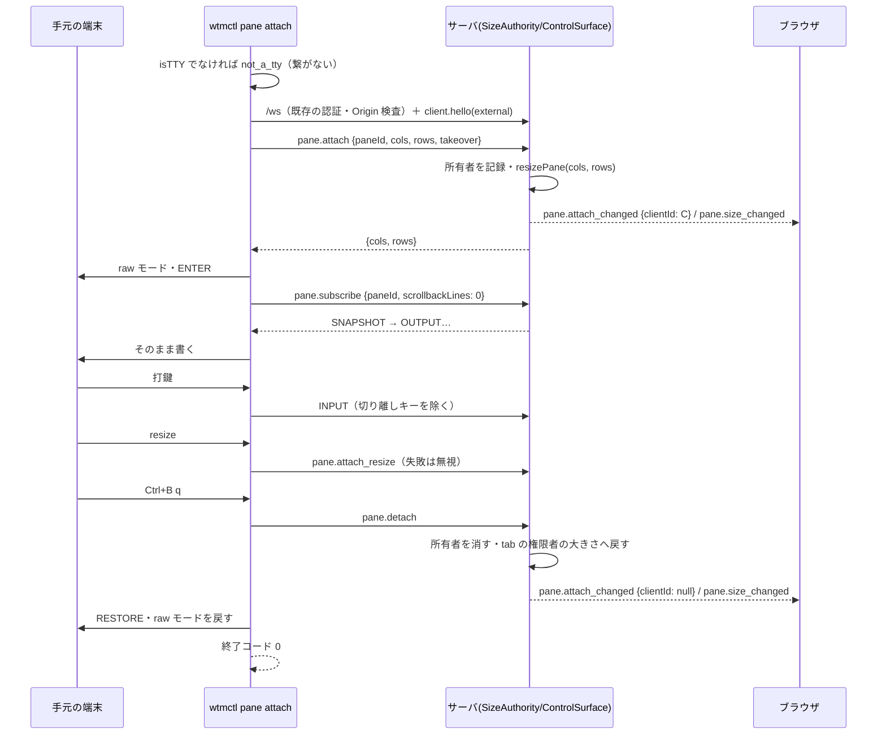
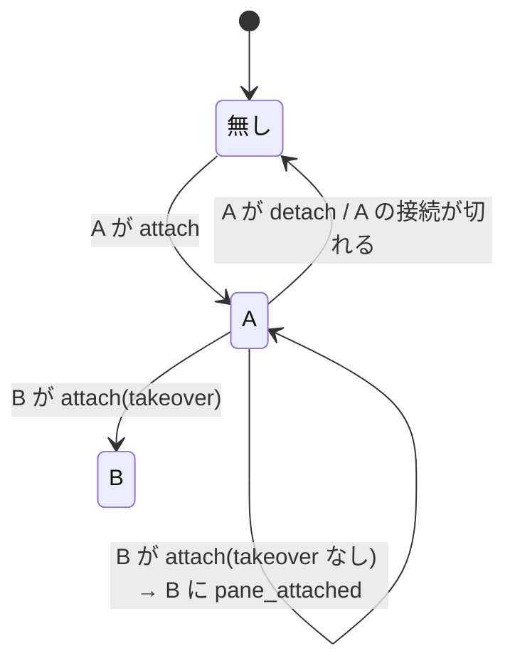

# 仕様: `wtmctl pane attach`——手元の端末を pane 1 枚に直結する（書き込み所有者の排他つき）

## 概要

サーバの `SizeAuthority` に「pane ごとの直結の所有者（高々 1 クライアント）」と「直結中の大きさの鍵」を足し、RPC `pane.attach`・`pane.attach_resize`・
`pane.detach` と、所有者の変化を全クライアントへ知らせるイベント `pane.attach_changed` を足す。CLI に `wtmctl pane attach <paneId> [--takeover]` を足し、
手元の端末を raw モード・代替画面にして、`pane.attach`（大きさを手元に合わせる）→ 既存の `pane.subscribe`（見えている画面＋以後の出力）→ 既存の
INPUT フレーム（打鍵）で pane に直結する。ブラウザ（`packages/web`）は変えない。

## 設計方針

- **所有者と大きさの鍵は `SizeAuthority` に持たせる**（decisions D2）。PTY の大きさを変える経路は `applyOwnerSize` の 1 箇所だけ（research F2）で、接続が切れたときの後始末
  `onClientGone` も既に WsGateway から呼ばれている（F4）。別部品にすると、SizeAuthority がそれを参照する依存と、WsGateway からの 2 本目の後始末の呼び出しが要る。
- **所有者の変化は全クライアントへのイベント `pane.attach_changed {paneId, clientId|null}` で知らせる**（decisions D3）。奪われた `wtmctl` は `clientId` が自分でなければ
  終わる。当人の接続を閉じる案は、SizeAuthority から WsGateway の接続表（`states`）への新しい経路が要り、同じ接続で別の用事をしている外部クライアントを巻き込む。
  イベントならブラウザは無視する（F5）ので web を変えずに済み、後続（ブラウザでの直結中の表示）がそのまま使える。
- **排他は直結クライアントどうしのもので、ブラウザの入力は止めない**（herdr と同じ。requirements「herdr の仕様」）。INPUT フレームの書き手は区別しない。
  所有者は**安全の境界ではない**（認証済みの接続は今までどおり誰でも INPUT を送れる）——大きさの奪い合いと、2 つの手元の端末が同じ pane を取り合う混乱を防ぐための調停。
- **出力の経路は既存の `pane.subscribe` を使い、直結専用のストリームは作らない**。`pane.attach` で大きさを変えてから購読すれば、SNAPSHOT はその大きさで出る（F1）。
- **手元の端末は代替画面に入って使い、終わるときに出る**（decisions D4）。切り離した後に、直結前の手元の画面（シェルの履歴）が元どおり戻る。

### ブラウザとの関係（奪う・奪われる・表示）

| 場面 | 振る舞い |
|---|---|
| ブラウザが打鍵する（INPUT） | 今までどおり pane に届く。`noteInteraction` は tab のサイズ権限を取るが、直結中の pane の大きさは変えない（鍵）。直結の所有者は変わらない。 |
| ブラウザが `client.view`・`client.fit`・フォーカス・レイアウト操作をする | 同上。同じ tab のほかの pane の大きさは今までどおり変わる。 |
| ブラウザが直結を奪う・切り離す | できない（今回は操作を作らない。ブラウザは `pane.attach` を送らない）。 |
| 直結が始まる・奪われる・終わる | 全クライアントへ `pane.attach_changed`。ブラウザは今は無視する。大きさの変化は既存の `pane.size_changed` で届き、ブラウザの xterm.js はその大きさで描く（`TerminalRegistry.onSizeChanged`。F5）。 |
| 直結が終わる（切り離し・接続断） | その tab のサイズ権限を持つクライアントの表示の大きさへ戻す（`applyOwnerSize`）。権限者がいなければ大きさはそのまま（既存の「権限者無しなら変えない」）。 |

## 対象範囲

- `packages/protocol/src/messages.ts`: `PaneAttachParams`・`PaneAttachResizeParams`・`PaneDetachParams`、`METHOD_SCHEMAS`・`MethodResultMap` への 3 行ずつ。
- `packages/protocol/src/events.ts`: `PaneAttachChangedEvent` と `ServerEvent` への追加。
- `packages/protocol/src/errors.ts`: `pane_attached`・`not_attached`（サーバが返す code）。CLI だけで作る code（`not_a_tty`・`attach_taken_over`・`pane_closed`・
  `connection_closed`）は `packages/cli/src/commands/attach.ts` で `RpcFailure` に入れる（protocol には足さない）。
- `packages/server/src/clients/SizeAuthority.ts`: 所有者の表・鍵・`attach`/`resizeAttached`/`detach`・`onClientGone` での解放・省略可能な第 3 引数（イベントの発行先）。
- `packages/server/src/surface/methods/attach.ts`（新）と `methods/index.ts` への登録。
- `packages/server/src/composeServer.ts`: `new DefaultSizeAuthority(clients, session, bus)`。
- `packages/server/src/testkit.ts`: `NodePtyBackend` を公開面に足す（cli の smoke・結合テストで実物の PTY の上で `wtmctl` を動かすため。decisions D5）。
- `packages/cli/src/attachKeys.ts`（新）: 切り離しキーの判定。
- `packages/cli/src/commands/attach.ts`（新）: `runPaneAttach`。
- `packages/cli/src/cliArgs.ts`・`packages/cli/src/main.ts`: `pane attach` の引数と入口・使い方。
- `packages/cli/src/smoke.ts`: 実物の PTY の上で `pane attach` を一巡させる手順を足す（`.aidev/config.yml` は変えない——既存の 2 本目の smoke がこれを走らせる）。
- `docs/wtmctl.md`・`docs/herdr-parity.md`（H40）。
- **変えない**: `packages/web`・`WsGateway`・`OutputFanout`・`TerminalHost`・`Mirror`。

## 依拠する既存の事実

- PTY の大きさを変えるのは `SessionService.resizePane`（`packages/server/src/session/SessionService.ts:879`）だけで、呼ぶのは `SizeAuthority.applyOwnerSize`
  （`packages/server/src/clients/SizeAuthority.ts:144`）だけ（research F2。`grep -rn "resizePane\|terminals.resize(" packages/server/src` のテスト以外）。
- `resizePane` は同じ大きさなら何もせずイベントも出さない（`SessionService.ts:882`）。変えたら `pane.size_changed` を publish する（`SessionService.ts:885`）。
  非所有者のブラウザはそれで xterm.js を `term.resize` する（`packages/web/src/term/TerminalRegistry.ts:197-199`）。
- `noteInteraction` は操作の時刻を進め、資格（デスクトップか fit）があれば `claim` でその pane の tab の権限を取り `applyOwnerSize` する
  （`SizeAuthority.ts:49-60`・`:119-124`）。`onClientGone` は持っていた tab ごとに `transferOwnership` し（`:106-110`）、移す先が無ければ権限者を null にして
  大きさは変えない（`:133-142`。`next` が無いと `applyOwnerSize` を呼ばない）——「権限者無しなら大きさはそのまま」の出所。
- 接続が閉じると WsGateway が購読を外し `sizeAuthority.onClientGone` を呼ぶ（`packages/server/src/ws/WsGateway.ts:124-131`）。
- `pane.subscribe` は購読者ごとにミラーの処理を待ってから serialize して SNAPSHOT を送り、続けて溜めた出力を送る（`packages/server/src/terminal/OutputFanout.ts:111-123`）。
  serialize の大きさはその時点のミラーの大きさ（`terminal/Mirror.ts:177-180`）、`TerminalHost.resize` はミラーを同期で変える（`terminal/TerminalHost.ts:193-196`）。
- SNAPSHOT（`serialize`）は端末のモードと、代替画面が有効ならその中身を含む（research F1・`@xterm/addon-serialize` 0.14.0 `typings/addon-serialize.d.ts:62-72`）。
- INPUT フレームは書き手を区別せず `noteInteraction` → `host.write`（`WsGateway.ts:93-116`）。
- web の `StoreAdapter` の `switch (e.event)` には `default` も網羅チェックも無い（`packages/web/src/store/StoreAdapter.ts`。research F5）——知らないイベントは何もしない。
- イベントの発行は `EventBus.publish`（同期・発行順。`packages/server/src/bus/EventBus.ts:16-21`）。WsGateway は bus の全イベントを全接続へ送る（`WsGateway.ts:82-84`）。
- CLI のエラーは `RpcFailure(code)` → `reportAndExit` が stderr に JSON・終了コード 1、`CliUsageError` は 2（`packages/cli/src/output.ts:55-66`）。
  `RpcFailure` の code は任意の文字列（`packages/cli/src/wsClient.ts:28-36`）で、`connection_closed`・`timeout` のような CLI だけの code が既にある
  （`packages/cli/src/commands/pane.ts:84-88`）。認証の失敗は `connect` が 401 を `AuthError`（→ `invalid_token`）、403 を `statusCode` 付きの Error（→ `forbidden`）にし
  （`wsClient.ts:192-238`・`output.ts:32-43` の `classify`）、`withSession` が 1 回だけ再ログインする（`packages/cli/src/withSession.ts:15-36`）。
  `WtmClient.onClose` は自分で `close()` したときは呼ばれない（`packages/cli/src/wsClient.ts:51`）。
- `client.hello` の結果に自分の `clientId` がある（`packages/protocol/src/messages.ts:31-34` `ClientHelloResult`）。
- pane のプロセスが終わると `pane.exited` の後に `pane.closed` が出る（`SessionService.ts:930-945`）。pane の id は再利用されない（`packages/protocol/src/ids.ts:1-24`）。
- node-pty の実装は `NodePtyBackend`（`packages/server/src/pty/NodePtyBackend.ts:11-26`）。
- smoke の 2 本目は `pnpm --filter @wtm/cli run smoke`（`.aidev/config.yml` の `smokeCommands`）で、cli の `smoke` スクリプトは `node dist/smoke.js`
  （`packages/cli/package.json` の `scripts.smoke`）——`smoke.ts` に手順を足せば設定を変えずに走る。

## インターフェース / データ構造

### protocol

```ts
// messages.ts
export const PaneAttachParams = z.object({
  paneId,
  cols: z.number().int().positive(),
  rows: z.number().int().positive(),
  takeover: z.boolean().optional(),
});
export interface PaneAttachResult { cols: number; rows: number } // 当てた大きさ
export const PaneAttachResizeParams = z.object({ paneId, cols: z.number().int().positive(), rows: z.number().int().positive() });
export const PaneDetachParams = z.object({ paneId });
// METHOD_SCHEMAS / MethodResultMap
"pane.attach": PaneAttachParams → PaneAttachResult
"pane.attach_resize": PaneAttachResizeParams → Record<string, never>
"pane.detach": PaneDetachParams → Record<string, never>

// events.ts
export interface PaneAttachChangedEvent {
  event: "pane.attach_changed";
  /** 直結の所有者（`client.hello` の clientId）。直結が終わったら null。 */
  data: { paneId: string; clientId: string | null };
}

// errors.ts の ErrorCode に "pane_attached" | "not_attached"
```

### server（`SizeAuthority` への追加）

```ts
export interface SizeAuthority {
  // 既存 …
  /** 直結の所有者になり、pane の大きさを cols×rows にする。別の所有者がいれば takeover が無い限り RpcError("pane_attached")。 */
  attach(clientId: string, paneId: PaneId, cols: number, rows: number, takeover: boolean): void;
  /** 所有者だけが大きさを変えられる。所有者でなければ RpcError("not_attached")。 */
  resizeAttached(clientId: string, paneId: PaneId, cols: number, rows: number): void;
  /** 所有者なら直結を終え、tab の権限者の大きさへ戻す。所有者でなければ何もしない。 */
  detach(clientId: string, paneId: PaneId): void;
  /** 直結中か（テスト・診断用）。 */
  attachOwner(paneId: PaneId): string | null;
}
constructor(clients, session, events?: { publish(e: ServerEvent): void })
```

- 内部状態: `attachments: Map<PaneId, string /* clientId */>`。
- `applyOwnerSize` は `attachments.has(paneId)` の pane を飛ばす（鍵）。
- `onClientGone(clientId)`: 既存の tab の権限の移譲の**後に**、その client が所有する直結を全部 `release` する（戻す大きさは移譲後の権限者のもの）。

### server（方式 `surface/methods/attach.ts`）

- `pane.attach`: pane が無ければ `not_found`。`sizeAuthority.attach(ctx.clientId, …)`。結果は当てた `{cols, rows}`。
- `pane.attach_resize`: pane が無ければ `not_found`。`sizeAuthority.resizeAttached(…)`。
- `pane.detach`: `sizeAuthority.detach(ctx.clientId, paneId)`（pane が無くても何もせず `{}`）。

### cli

```ts
// attachKeys.ts
export const ATTACH_PREFIX = 0x02; // Ctrl+B
export interface AttachKeyResult { forward: Uint8Array; detach: boolean }
export class AttachKeyFilter { feed(bytes: Uint8Array): AttachKeyResult }

// commands/attach.ts
export interface AttachTerminal {
  readonly isTTY: boolean;            // stdin と stdout の両方が端末か
  size(): { cols: number; rows: number };
  setRawMode(on: boolean): void;
  write(data: string | Uint8Array): void;
  onInput(cb: (bytes: Uint8Array) => void): () => void;   // 解除関数を返す
  onResize(cb: () => void): () => void;
}
export function processTerminal(): AttachTerminal; // process.stdin/stdout の実装
export async function runPaneAttach(cmd: PaneAttachCmd, store: SessionStore, term?: AttachTerminal): Promise<void>;

// cliArgs.ts の Command に
| { kind: "pane-attach"; opts: GlobalOpts; paneId: string; takeover: boolean }
```

- 手元の端末へ最初に書く列: `ENTER = "\x1b[?1049h\x1b[H\x1b[2J"`（代替画面に入り、消す）。
- 終わるときに書く列 `RESTORE`（decisions D4）: `\x1b[0m`（色）・`\x1b[?25h`（カーソル表示）・`\x1b[?1000l\x1b[?1002l\x1b[?1003l\x1b[?1005l\x1b[?1006l\x1b[?1015l\x1b[?1016l`
  （マウスの報告）・`\x1b[?1004l`（フォーカスの報告）・`\x1b[?2004l`（bracketed paste）・`\x1b[?1l\x1b>`（カーソルキー・キーパッド）・最後に `\x1b[?1049l`（代替画面から出る）。

## 振る舞いの詳細

### 直結の流れ



### 所有者の状態



- 所有者が変わるたび（無し→A・A→B・A→無し）に `pane.attach_changed` を 1 回発行する。同じ所有者の当て直しでは発行しない。
- **pane が閉じても所有者の項目はその場では消さない**（SizeAuthority は pane の終了を購読していない）。CLI は `pane_closed` で終わると接続を閉じるので、
  `onClientGone` の解放で消え、`pane.attach_changed {clientId: null}` が出る。解放は pane が無ければ大きさを戻さない（`getPane` が無ければ飛ばす）。
  pane の id は再利用されない（依拠する事実）ので、残った項目が別の pane の大きさに効くことは無い。
- 奪取では前の所有者の大きさへは戻さず、新しい所有者の大きさを当てる。

### CLI の終わり方

| きっかけ | 検出 | サーバへ | 終了 |
|---|---|---|---|
| `Ctrl+B q` | `AttachKeyFilter` | `pane.detach`（失敗は無視） | 0（stderr に `wtmctl: detached from <paneId>`） |
| 奪われた | `pane.attach_changed` で paneId が同じ・clientId が自分以外（null を含まない） | なし | 1 `attach_taken_over` |
| pane の終了 | `pane.exited`・`pane.closed` で paneId が同じ | なし | 1 `pane_closed` |
| 接続断 | `WtmClient.onClose` | なし | 1 `connection_closed` |

- どの終わり方でも——表の 4 つに加え、raw モードに入った後の想定外の失敗（`pane.subscribe` の失敗等）でも——入力・大きさの購読を外し、`RESTORE` を書き、
  raw モードを戻してから `withSession` を抜ける（`finally`。`reportAndExit` より前。research「実装時の注意」）。
- 終わりの判定は最初の 1 回だけ有効（後から届いたイベントは無視）。
- `pane.attach_changed` の `clientId: null`（自分の detach の結果）では終わらない（自分の detach は既に終わりの処理中）。

### 切り離しキー（`AttachKeyFilter`）

- 状態は「接頭辞を受けた直後か」の 1 ビット。読み取りの境界をまたいで保つ。
- 接頭辞を待っていないとき: `0x02` までを forward に入れ、`0x02` は保留にして次のバイトへ。
- 接頭辞の直後: `q`（0x71）→ detach（それまでの forward は送る。`q` 以降のバイトは捨てる）／`0x02` → `0x02` を 1 つ forward／それ以外 → `0x02` とそのバイトを forward。
- 読み取りの最後が接頭辞で終われば forward に含めず保留する（次の読み取りで決める）。

### 大きさ

- `pane.attach` の `cols/rows` は `term.size()`（`process.stdout.columns/rows`。0 や未定義なら 80×24）。
- 手元の `resize` のたびに `pane.attach_resize`。所有者でなくなっていれば `not_attached` が返るが、CLI は無視する（奪われたことはイベントで分かる）。

## ドメイン固有の考慮

- 新しい RPC は既存の `/ws` の `ControlSurface` にだけ登録する。`/ws` は upgrade の段階で Cookie のセッション認証と Origin/Host 検査を通った接続だけが使える
  （既存。`WsServerWs`・`AuthService.authorizeUpgrade`）。新しい HTTP の入口・待ち受けは作らない（AC12）。
- 所有者は安全の境界ではない（上記「設計方針」）。`docs/wtmctl.md` にもそう書く。
- herdr との違い（`docs/wtmctl.md` に書く）: 生の PTY の出力をそのまま流す（herdr はサーバで描き直したフレーム）ため、pane の代替画面の出入りやモードが手元の端末に
  そのまま届く。サーバ側のスクロール・マウスでの遡り・`agent attach`・observe/control は無い。Windows の端末からの直結は確かめていない。
- **ブラウザからの入力は止めない**・ブラウザは奪えない（herdr もフル UI の入力を止めない）。

## エラー処理 / 異常系

- 端末でない（stdin か stdout）: 繋ぐ前に `RpcFailure("not_a_tty")` → 終了コード 1（requirements FR9）。
- pane が無い: `pane.attach` が `not_found` → 終了コード 1（手元の端末はまだ触っていない）。
- 別の所有者がいる: `pane_attached`（message: `pane <id> already has an attached client; retry with --takeover`）→ 終了コード 1（手元の端末はまだ触っていない）。
- 認証の失敗・Origin の拒否: 既存の `withSession`・`connect` の扱いのまま（`invalid_token`・`forbidden` 等）。
- `pane.detach` の失敗（接続が既に切れている等）: 無視して終わりの処理を続ける。
- `pane.subscribe` が失敗（直結の後に pane が閉じた等）: そのエラーで終わる（RESTORE と raw モードの戻しは行う）。
- raw モードの切り替えに失敗: 例外を投げ、`finally` で戻せる範囲を戻す。

## 受け入れ基準との対応

- AC1: CLI が `pane.attach` の後に `pane.subscribe {scrollbackLines: 0}` を送り、SNAPSHOT と OUTPUT を手元に書く。入力の出所: `term.size()`・コマンドの `paneId`。
  結合テスト（実サーバ・偽の端末）で、SNAPSHOT の後に `echo` の出力が手元に届くことを見る。
- AC2: 打鍵は `AttachKeyFilter` を通して INPUT で送る。入力の出所: `term.onInput`。結合テストで偽の端末から `echo 印\r` を入れ、手元にその出力が出ることを見る。
- AC3: `SizeAuthority.attach` が `resizePane`、`term.onResize` → `pane.attach_resize` → `resizeAttached`。入力の出所: `term.size()`（`process.stdout.columns/rows`）と
  `term.onResize`（stdout の `resize`）。単体（SizeAuthority・CLI）と結合テスト（サーバのモデルの pane の大きさ）。
- AC4: `applyOwnerSize` が直結中の pane を飛ばす。単体テストでデスクトップの `client.view`（onViewChanged）・`noteInteraction`・`onFitChanged` の後も直結中の pane は変わらず、
  同じ tab のほかの pane は変わることを見る。入力の出所: ClientRegistry の view。
- AC5: `runPaneAttach` の最初で `term.isTTY` を見て `not_a_tty`。単体テストで接続（`withSession` の偽の store・`connect`）が呼ばれないことを見る。
- AC6: `AttachKeyFilter` の単体テスト（境界の分割を含む）と、CLI の単体テストで `Ctrl+B q` → `pane.detach` → 正常に返る（終了コード 0）。結合テストで切り離し後も
  pane が残る（`session.getPane`）。smoke で実物の PTY の上の `node dist/main.js pane attach` が `Ctrl+B q` で終了コード 0。
- AC7: CLI の単体テストで 4 つの終わり方と `pane.subscribe` の失敗のそれぞれで `RESTORE` が書かれ `setRawMode(false)` が呼ばれることと、接続断の code
  `connection_closed`。入力の出所: 偽の `WtmClient` のイベント・`onClose`・`request` の失敗。
- AC8: 入力の出所: `attachments` の既存の所有者と `takeover` の有無。`SizeAuthority.attach` の単体テストと、結合テスト（2 本目の `pane attach` が `pane_attached` で失敗し、1 本目は続く）。
- AC9: 入力の出所: `--takeover`（`cmd.takeover` → `pane.attach` の `takeover`）と `hello` の `clientId`。単体テストで takeover 後に所有者と大きさが新しい側になり `pane.attach_changed` が出ること、CLI の単体テストでそのイベントで `attach_taken_over` になること、
  結合テストで 1 本目が `attach_taken_over` で終わること。
- AC10: 入力の出所: tab の `sizeOwnerClientId` とその権限者の `ClientRegistry` の view。単体テストで detach・`onClientGone` の後に tab の権限者の view の大きさへ
  戻ること、権限者がいなければ変わらないこと（依拠する事実の `transferOwnership`）。
- AC11: 結合テストで、直結中に別の接続（ブラウザ相当の `WtmClient`）の購読に出力が届き、そこからの INPUT が pane に届くことを見る。
- AC12: 新しい方式は `ControlSurface` にだけ登録（上記「ドメイン固有の考慮」）。結合テストで、Cookie 無しの `/ws` の upgrade が 401、偽の Origin が 403 で、
  `pane.attach` まで届かないことを見る（既存の手法: 生の `ws` で Origin を偽る。external-control-api の decisions D20）。
- AC13: 入力の出所: `pane.exited`/`pane.closed` のイベント（`SessionService.ts:930-945`）。CLI の単体テストで `pane.exited`/`pane.closed` → `pane_closed`、結合テストで直結中の pane のシェルに `exit` を送ると `pane_closed` で終わる。
- AC14: `docs/wtmctl.md` に節を足し、`docs/herdr-parity.md` の H40 の行を「一部対応」に書き換える。
