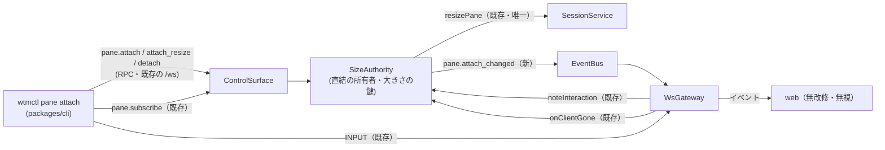

# 調査: `wtmctl pane attach` の土台（既存の購読・入力・大きさ・イベント・CLI）

発火条件（protocol.md「4.5」）: **影響が横断的**（protocol・server・cli の 3 パッケージにまたがり、ブラウザは変えない前提をイベントの扱いで確かめる必要がある）と、
**未検証の既存挙動に依存**（サイズ権限が PTY の大きさを変える経路が 1 つか・ブラウザが知らないイベントを無視するか）。autonomous なので実施。
herdr の一次資料は requirements.md「herdr の仕様」に主エージェントが直読した結果を置いた（ここでは繰り返さない）。

## 調査の問い

- Q1: pane の出力を受ける既存の経路と、最初の画面（SNAPSHOT）の中身は何か。
- Q2: PTY の大きさを変える経路はどこか（直結中に止めるべき箇所はいくつあるか）。
- Q3: 入力（INPUT フレーム）の経路と、そこに書き手の区別があるか。
- Q4: 接続が切れたときの後始末はどこで行われ、新しい後始末をどこに足せるか。
- Q5: 新しいイベントを足したとき、ブラウザ（`packages/web`）は壊れないか（型・実行時）。
- Q6: RPC の定義・エラーの code・CLI 側のエラー分類の形。
- Q7: CLI から手元の端末（raw モード・大きさ）を扱う手段と、それを実物の PTY の上で確かめる手段。

## 判明した事実

- F1（Q1）: 購読は `pane.subscribe {paneId, scrollbackLines}`（`packages/server/src/surface/methods/subscribe.ts:6-16`）。`OutputFanout.subscribe` が
  ミラーの処理を待ってから `mirror.serialize(scrollbackLines)` を SNAPSHOT で送り、その間に届いた出力を続けて送る（`terminal/OutputFanout.ts:50-62`・
  `:111-123`）。購読者は複数可（`subs: Map<clientId, …>`）。SNAPSHOT は `@xterm/addon-serialize` 0.14.0 の `serialize({scrollback})`
  （`terminal/Mirror.ts:177-180`）で、既定で端末のモード（bracketed paste `?2004h` 等）を含み、代替画面が有効なら `ESC[?1049h ESC[H` に続けて代替画面の中身を出す
  （`node_modules/.pnpm/@xterm+addon-serialize@0.14.0/.../lib/addon-serialize.js` の `1049h`・`?2004h` を grep で確認。`excludeModes`/`excludeAltBuffer` は既定 false——
  `typings/addon-serialize.d.ts:62-72`）。`scrollback: 0` で見えている画面だけになる（同 d.ts:58-62 の説明「下から N 行」）。
  - SNAPSHOT の `cols/rows` は serialize した時点のミラーの大きさ（`Mirror.ts:179`）。`subscribe` の後の `mirror.write("", cb)` のコールバックで serialize するので、
    購読の**前に**同期で `resize` していればその大きさで出る（`TerminalHost.resize` は PTY とミラーを同期で変える。`terminal/TerminalHost.ts:193-196`）。
- F2（Q2）: PTY の大きさを変える呼び出しは `SessionService.resizePane`（`session/SessionService.ts:879-886`。同じ大きさなら何もしない・変えたら
  `pane.size_changed` を publish）だけで、それを呼ぶのは `SizeAuthority.applyOwnerSize`（`clients/SizeAuthority.ts:144-151`）だけ
  （`grep -rn "resizePane\|terminals.resize(" packages/server/src` のテスト以外の結果）。`applyOwnerSize` は `claim`・`onViewChanged`・`transferOwnership` から呼ばれる。
  → 直結中の大きさの鍵は `applyOwnerSize` の 1 箇所で効かせられる。
- F3（Q3）: INPUT フレームは `WsGateway` の `onBinary` で `sizeAuthority.noteInteraction(clientId, paneId)` の後に `host.write(bytes)`（`ws/WsGateway.ts:93-116`）。
  書き手の区別・拒否は無く、認証済みの接続なら誰でも書ける。`noteInteraction` はデスクトップなら `claim` → `applyOwnerSize` へ進む（`SizeAuthority.ts:49-60`）ので、
  **ブラウザの打鍵が直結中の pane の大きさを戻す経路**になりうる（F2 の 1 箇所で止めれば塞がる）。
- F4（Q4）: 接続が閉じると `WsGateway` が全購読を外し、`sizeAuthority.onClientGone(clientId)` を呼び、`clients.unregister` する（`WsGateway.ts:124-131`）。
  `onClientGone` は持っていた tab の権限を移すだけ（`SizeAuthority.ts:106-110`）。→ 直結の後始末を `onClientGone` に足せば WsGateway を変えずに済む。
- F5（Q5）: web はイベントを `Connection.ts` で `pane.size_changed` だけ特別扱いし、残りを `store.applyEvent` に渡す（`packages/web/src/net/Connection.ts:304-313`）。
  `StoreAdapter.applyEventToSession` は `switch (e.event)` で、`default` も `never` の網羅チェックも無い（`packages/web/src/store/StoreAdapter.ts` の switch。
  `grep -n "default:\|never" StoreAdapter.ts` が 0 件）。→ `ServerEvent` の union に 1 種足しても web の型検査は通り、実行時は何もしない。
  `ServerEventName` を使うのは `packages/e2e/src/support/wsClient.ts` の型だけ（`grep -rln ServerEventName`）。
  - 非所有者のブラウザは `pane.size_changed` で xterm.js を `term.resize(cols, rows)` する（`packages/web/src/term/TerminalRegistry.ts:197-199`）。直結中の大きさも
    同じ経路でブラウザの表示に反映される（ブラウザを変えなくてよい）。
- F6（Q6）: RPC は `METHOD_SCHEMAS`（zod）と `MethodResultMap` に足し（`packages/protocol/src/messages.ts:429-534`）、`surface.register(name, {schema, handler})` で登録する
  （`surface/ControlSurface.ts:24-26`）。ハンドラの `ctx` は `{clientId, sink}`（`:9-12`）。`RpcError(code)` の code は `ErrorCode` の union（`protocol/src/errors.ts:2-28`）に
  足す。CLI 側の `RpcFailure.code` は任意の文字列で（`packages/cli/src/wsClient.ts:28-36`）、`reportAndExit` が `{error:{code,message}}` を stderr へ出し終了コード 1
  （`packages/cli/src/output.ts:55-66`）。`connection_closed` は `pane read --follow` が既に使っている（`packages/cli/src/commands/pane.ts:84-88`）。
  イベントの発行は `EventBus.publish`（同期・発行順。`bus/EventBus.ts:9-22`）で、`DefaultSizeAuthority` は今は bus を持たない（`composeServer.ts:189`
  `new DefaultSizeAuthority(clients, session)`）。
- F7（Q7）: Node v24.15.0（`node --version`）。`process.stdin.isTTY`・`setRawMode`・`process.stdout.columns/rows`・`'resize'` イベントで足りる（Node の `tty` 標準）。
  CLI のテストは `vi.spyOn(process.stdout, "write")` で出力を拾う流儀（`packages/cli/src/agentPrompt.integration.test.ts:40-55`）。実物の PTY は server の
  `NodePtyBackend`（`packages/server/src/pty/NodePtyBackend.ts:11-26`。node-pty 1.2.0-beta.15）にあるが、`@wtm/server` の公開面（`src/testkit.ts`）は
  `composeServer` と `lanIpv4Addresses` だけで、cli からは import できない。cli の smoke は `node dist/main.js …` を `execFile` で子プロセスとして起動する
  （`packages/cli/src/smoke.ts`。stdin は端末ではない）。
- F8: pane の id は種類ごとの単調増加（`p1`, `p2`…。`protocol/src/ids.ts:1-24`）で、`session.json` の `nextId` が持ち越すので同じサーバでは再利用されない。
  pane のプロセスが終わると `pane.exited` の後に `closePane` の連鎖で `pane.closed` が出る（`session/SessionService.ts:930-945`）。

## 影響範囲

- protocol: `messages.ts`（RPC 3 つ）・`events.ts`（イベント 1 つ）・`errors.ts`（code）。
- server: `clients/SizeAuthority.ts`（所有者・鍵・後始末）・`surface/methods/`（登録）・`composeServer.ts`（bus を渡す）・（任意）`testkit.ts`。
- cli: `cliArgs.ts`・`main.ts`・`commands/pane.ts` か新しいファイル・`docs/wtmctl.md`。

## 実現性 / リスク

- 大きさの鍵は F2 の 1 箇所で済み、後始末は F4 の既存の呼び出しに乗るので、WsGateway・web を変えずに実現できる。
- 手元の端末へ生の出力をそのまま流すので、pane が出した代替画面・マウスの報告等のモードは手元の端末に残る（herdr はサーバ側で描き直したフレームを送るので
  この問題が無い）。終わるときにモードを戻す列を書くことで緩和する（requirements FR5）。
- 手元の端末の文字コード・端末の種類（`TERM`）の違いは今回扱わない（pane は `xterm-256color` で起動する。`NodePtyBackend.ts:17`）。

## 実装アンカー

- A1: 大きさを当てる唯一の箇所（`packages/server/src/clients/SizeAuthority.ts:144` `applyOwnerSize`）。
- A2: 接続が切れたときの後始末（`packages/server/src/clients/SizeAuthority.ts:106` `onClientGone`・呼び出し元 `packages/server/src/ws/WsGateway.ts:129`）。
- A3: SizeAuthority の組み立て（`packages/server/src/composeServer.ts:189`）。
- A4: RPC の登録の束（`packages/server/src/surface/methods/index.ts`）と購読の方式（`surface/methods/subscribe.ts:6`）。
- A5: protocol の RPC 表（`packages/protocol/src/messages.ts:429` `METHOD_SCHEMAS`・`:482` `MethodResultMap`）・イベント union（`events.ts:108` `ServerEvent`）・`errors.ts:2` `ErrorCode`。
- A6: CLI の引数（`packages/cli/src/cliArgs.ts:245` `parsePane`・`Command` union `:47-71`・`USAGE` `:10-30`）・入口（`packages/cli/src/main.ts` の switch と `printHelp`）。
- A7: CLI の接続（`packages/cli/src/withSession.ts:15` `withSession`・`wsClient.ts:38` `WtmClient`）。
- A8: 既存テストの足場: `packages/server/src/clients/SizeAuthority.test.ts:1-75`（偽の PTY と `makeContext`）・`packages/cli/src/agentPrompt.integration.test.ts:80-100`（実サーバの起動）。
- A9: server の公開面（`packages/server/src/testkit.ts`）——実物の PTY で CLI を動かすなら `NodePtyBackend` をここから出す。

## 実装時の注意

- `DefaultSizeAuthority` を 2 引数で組み立てるテストが多数ある（`SizeAuthority.test.ts` の `makeContext` 等）。bus を足すなら省略可能な引数にする。
- `SessionService.resizePane` は大きさが同じなら何もせずイベントも出さない（`SessionService.ts:882`）——戻す処理を何度呼んでも害は無い。
- `ControlSurface.invoke` は `RpcError` 以外の例外を `internal` にしてクライアントへ詳細を出さない（`ControlSurface.ts:37-47`）。所有者の衝突は必ず `RpcError` で投げる。
- `WtmClient.onClose` は自分で `close()` したときは呼ばれない（`wsClient.ts:51`）。
- `reportAndExit` は `process.exit` を呼ぶ——raw モードを戻す前に呼ぶと手元の端末が raw のまま残る。戻してから投げる／返す順序にする。

## design への申し送り

- 所有者・鍵を `SizeAuthority` に持たせるか別部品にするか（F2・F4 は SizeAuthority に寄せると WsGateway を変えずに済むことを示す）。
- 奪われた側への知らせ方: 全体へのイベント（F5 によりブラウザは無視する）か、当人の接続を閉じるか（接続を閉じるには WsGateway の `states` への経路が要る）。
- 手元の端末への最初の描画（画面を消す列＋SNAPSHOT）と、終わるときに戻すモードの列。
- 実物の PTY の上での確認（F7: `NodePtyBackend` を公開面に足すか）と、smoke への追加の要否。
