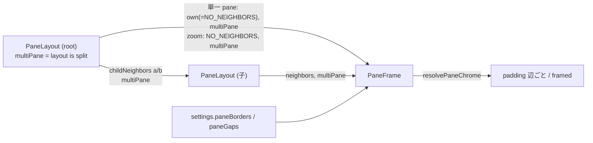

# 仕様: pane の枠の描画モードと隙間の入切

## 概要

pane の枠を「辺ごとの余白」として決め直す。外周の辺（隣に pane が無い辺）の余白は枠の描画モードで、隣と接する辺の余白は
隙間の設定で決める。どの辺に隣があるか・tab が分割されているかは `PaneLayout` が再帰の中で求めて `PaneFrame` へ渡し、
`PaneFrame` が設定（ストア）と合わせて描き分ける。判定そのものは純粋関数（新規 `packages/web/src/layout/paneChrome.ts`）に置く。
既定（常に・隙間入）は今と同じ 4 辺の余白になる。

## 設計方針

- **辺ごとの余白**: herdr の 4 通り（research F3）をそのまま辺ごとの規則にする。
  `padded[辺] = 隣がある ? 隙間の設定 : 枠を描くか`。枠を描くか（`framed`）は `常に` か、`分割時だけ` かつ tab が分割されているとき。
  | 描画モード×隙間 | 外周の辺 | 隣と接する辺 | herdr の対応 |
  |---|---|---|---|
  | 枠あり×隙間入（既定） | 余白 | 余白 | 各 pane が自分の枠を持つ |
  | 枠あり×隙間切 | 余白 | 0 | 境界を共有する |
  | 枠なし×隙間入 | 0 | 余白 | 1 セルの隙間 |
  | 枠なし×隙間切 | 0 | 0 | 隙間なしで接する |
- **判定の置き場（decisions D3）**: 構造（隣・分割）は `PaneLayout`、設定の読み出しは `PaneFrame`（既に `paneAgentNameVisible` を
  読んでいる。research F5）。`PaneLayout` はストアを読まない——既存の `PaneLayout.test.ts` の `mountLayout` は
  Pinia を入れずに mount しており（`PaneLayout.test.ts:34-55` の `global` に `plugins` が無い）、PR #12（research F15）のように
  `PaneLayout` の setup で `useSettingsStore()` を呼ぶと、それらのテストが active な Pinia が無いまま store を作ろうとして壊れる。
  枠を描かない呼び出し（`paneFrames` 無し。モバイル・`mountLayout`）では `PaneFrame` もストアに触れない（`PaneFrame.vue:40-42`）。
- **枠を描かない pane**: 外周の余白・選択の強調（`.pane-frame-edge-current`）・名前（`.pane-frame-name` と上の余白・薄い線）を
  描かない。名前は herdr と同じく枠の一部として消す（research F14。decisions D5）。
- **フォーカスの見え方（decisions D4）**: 余白が 0 の辺が 1 つでもある pane では、枠（メニューボタン）が `:focus-visible` のとき
  端末の上に重ねて内側 2px の outline を描く（背景は透明・`pointer-events: none`）。4 辺に余白がある pane（既定）は今の見え方の
  まま変えない。
- **分割の境界（`Splitter`）は変えない**（requirements の対象外）。隙間切で隣と接する辺の選択の強調が見えなくなることは受け入れる
  （decisions D4）。

## 対象範囲

- `packages/web/src/layout/paneChrome.ts`（新規）: 型と純粋関数。
- `packages/web/src/layout/paneChrome.test.ts`（新規）。
- `packages/web/src/store/settings.ts`: `paneBorders`・`paneGaps` の load/ref/set/storage 追従/return。
- `packages/web/src/components/PaneLayout.vue`: `multiPane`・`neighbors` の prop と、子・`PaneFrame` への受け渡し。
- `packages/web/src/components/PaneFrame.vue`: 辺ごとの余白（inline style）、`framed` による強調・名前の描き分け、余白 0 のときの
  フォーカスの見え方。
- `packages/web/src/components/SettingsDialog.vue`: 「表示」節に描画モードのラジオ・隙間のスイッチ・説明。
- `packages/web/src/actions/ActionDispatcher.ts`: `reloadConfig` に 2 項目。
- `packages/web/src/tabbar/tabBarRight.ts`・`tabBarRight.test.ts`: PR #12 の取り込みで残った未使用の `PaneBordersMode`・
  `loadPaneBordersMode`（既定 `"auto"`）を消す（decisions D6）。
- テスト: `settings.test.ts`・`PaneLayout.test.ts`・`PaneFrame.test.ts`・`SettingsDialog.test.ts`・`ActionDispatcher.test.ts`。
- docs: `docs/herdr-parity.md` H23 行、`docs/verification.md`。
- 変えない: `App.vue`（root の `PaneLayout` が自分の `layout` から分割を求めるので、渡すものは増えない）、`Splitter.vue`、
  `MobileShell.vue`。

## 依拠する既存の事実

- 枠の余白は `.pane-frame-enabled { padding: var(--wtm-pane-gap, 4px) }`（`PaneFrame.vue:310-312`）、名前表示時の上余白は
  `.pane-frame-enabled-named { padding-top: calc(var(--wtm-pane-gap, 4px) + 1.2em) }`（`PaneFrame.vue:321-323`）。選択の強調は `.pane-frame-edge-current`（`:332-335`）、名前の線は `.pane-frame-edge-named`（`:344-353`）。
- 端末（`.pane-frame-body`）は枠（`.pane-frame-edge`）の上に重なり、枠のフォーカスの見え方は余白の部分でしか見えない
  （`PaneFrame.vue:394-398,439-443`。research F12）。
- `ViewSync` が測るのは葉で、余白は葉の外。root は葉の大きさの変化を `ResizeObserver` で見て送り直す（`PaneLayout.vue:93-107,148`）。
- `PaneLayout` の再帰は `splitLayout.a`/`b` を子の `PaneLayout` に渡し、`dir` は `"right"`/`"down"`（`PaneLayout.vue:183-195`、
  `LayoutNode` の `dir`）。zoom 中は root が `singlePaneId = zoomedPaneId` を描き、`layout` は tab 全体の木のまま（`PaneLayout.vue:110`、
  `App.vue:69-70`）。
- `PaneLayout` の `isRoot` は既存（`registerLeaf` が無い＝root。`PaneLayout.vue:84`）。`zoomedPaneId` は root だけが受ける prop
  （`PaneLayout.vue:59`、`App.vue:70`。子へは渡していない `PaneLayout.vue:185,191`）。
- モバイルの `MobileShell` は `PaneLayout` を `pane-frames` 無しで使う（`MobileShell.vue:94-105`、`PaneLayout.vue:76-79`）。
- `PaneLayout.test.ts` の枠のテストは `mountFramed` で Pinia を入れて mount する（`PaneLayout.test.ts:375-389`）。
- `PaneFrame` は `enabled` のときだけストアを使う（`PaneFrame.vue:40-42`）。既存テストは `paneId`・`enabled` だけで mount する
  （`PaneFrame.test.ts:26-38`）。
- 外観設定の load/set/storage/reload の形（`store/settings.ts:98-100,268-271,391-401`、`ActionDispatcher.ts:1085-1110`）。
- 設定画面のラジオ（太さ）とスイッチ（外周）の部品（`SettingsDialog.vue:672-698`）。

## インターフェース / データ構造

```ts
// packages/web/src/layout/paneChrome.ts
export type PaneBorders = "always" | "auto" | "off";
export type PaneSide = "top" | "right" | "bottom" | "left";
export type PaneSides = Readonly<Record<PaneSide, boolean>>;
export const NO_NEIGHBORS: PaneSides; // すべて false
/** 分割の子（a/b）の隣。親の隣を引き継ぎ、分割の向きに応じて 1 辺を足す。right: a→right, b→left / down: a→bottom, b→top */
export function childNeighbors(parent: PaneSides, dir: "right" | "down", child: "a" | "b"): PaneSides;
export interface PaneChrome { framed: boolean; padded: PaneSides }
/** framed = borders==="always" || (borders==="auto" && multiPane)。padded[s] = neighbors[s] ? gaps : framed */
export function resolvePaneChrome(borders: PaneBorders, gaps: boolean, multiPane: boolean, neighbors: PaneSides): PaneChrome;
```

```ts
// store/settings.ts
export function loadPaneBorders(raw: unknown): PaneBorders; // 3 値のどれかでなければ "always"（D2）
export function loadPaneGaps(raw: unknown): boolean;         // boolean でなければ true
// store: paneBorders / paneGaps（ref）、setPaneBorders / setPaneGaps（反映と保存を同時に。wtm.prefs.v1 の同名キー）
```

- `PaneLayout` の prop 追加: `multiPane?: boolean`（子だけが受ける。root は `layout.type === "split"` から求める）、
  `neighbors?: PaneSides`（既定 `NO_NEIGHBORS`）。
- `PaneFrame` の prop 追加: `multiPane?: boolean`（既定 false）、`neighbors?: PaneSides`（既定 `NO_NEIGHBORS`）。

## 振る舞いの詳細

- `PaneLayout`:
  - `multiPaneResolved = isRoot ? layout.type === "split" : !!props.multiPane`。
  - 自分の隣 `own = props.neighbors ?? NO_NEIGHBORS`（root は prop を受けないので `NO_NEIGHBORS`）。
  - 単一 pane を描くとき、zoom 中（`props.zoomedPaneId` が真。root だけが受ける）なら `neighbors = NO_NEIGHBORS`（辺はすべて外周。research F2）、
    そうでなければ `own` を `PaneFrame` へ渡す。`multiPaneResolved` も渡す（root の単一 pane の tab なら false）。
  - 分割を描くとき、子 a には `childNeighbors(own, dir, "a")`、子 b には `childNeighbors(own, dir, "b")` と `multiPaneResolved` を渡す。
- `PaneFrame`（`enabled` のときだけ。偽なら今までどおり何もしない）:
  - `chrome = resolvePaneChrome(settings.paneBorders, settings.paneGaps, multiPane, neighbors)`。
  - 余白は root 要素の inline style で辺ごとに `var(--wtm-pane-gap, 4px)` か `0px`。名前の余白を取るとき（下）は上の辺を
    `calc(<上の余白> + 1.2em)`（上の余白が 0 なら `1.2em`）。CSS の `.pane-frame-enabled` の `padding` と
    `.pane-frame-enabled-named` の `padding-top` は inline style に置き換える（class は識別のため残す）。
  - `reserveNameSpace = paneAgentNameVisible && chrome.framed`、`showBorder = reserveNameSpace && 名前がある`。
  - 選択の強調 class（`pane-frame-edge-current`）は `selected && chrome.framed` のときだけ。`aria-current`・`tabindex`（roving）は
    `framed` に関わらず今まで通り（キーボードの経路を残す。AC-I5）。
  - 4 辺のどれかが `padded` でないとき、枠に `pane-frame-edge-flush` class を付ける。CSS:
    `.pane-frame-edge-flush:focus-visible { z-index: 1; background: transparent; outline: 2px solid var(--wtm-fg, #f8f8f2);
    outline-offset: -2px; pointer-events: none; }`。
- 設定画面（「表示」節。太さのラジオの直前）:
  - ラジオの `fieldset`（legend「pane の枠の表示」、`name="settings-pane-borders"`、値 `always`「常に」/`auto`「分割しているときだけ」/
    `off`「表示しない」）。`@change` で `settings.setPaneBorders`。
  - 説明 `<p class="settings-note">`: 枠を表示しない pane では、枠の右クリックでメニューを開く経路と名前の表示（ドラッグの掴み手）が
    無くなること、メニューは選んでいる pane の枠へ Tab で移って Enter で開けること。
  - スイッチ（`role="switch"`、文言「pane の間に隙間を空ける」、`aria-checked` = `paneGaps`）。`@click` で反転。
- 保存と同期: `set*` は `writePrefs({ paneBorders })` / `writePrefs({ paneGaps })`。PR #12 分の `storage` リスナーに 2 項目を足す。
  `reloadConfig` に `loadPaneBorders(raw["paneBorders"])`・`loadPaneGaps(raw["paneGaps"])` を足す。



## ドメイン固有の考慮

- 端末の大きさ: 余白を変えると葉が変わり、既存の `followResize` が `client.view` を送り直す（新しい仕組みは作らない）。既定では
  余白の値が今と同じなので端末の大きさも変わらない（AC1）。
- herdr との差: 既定は `always`（D2）。`always` と外周の枠の連動はしない・`Splitter` の線は残す（requirements の対象外）。
  旧形式の真偽値は読まない（requirements の対象外）。

## エラー処理 / 異常系

- 保存値が壊れている（型違い・未知の文字列）: `loadPaneBorders` は `"always"`、`loadPaneGaps` は `true`（起動を止めない。既存の
  `load*` と同じ）。
- `PaneFrame` を新しい props 無しで使う: `multiPane=false`・`NO_NEIGHBORS`。既定の設定（always・gaps 入）なら 4 辺に余白で今と同じ。

## 受け入れ基準との対応

- AC1: 入力はストアの既定（`loadPaneBorders`/`loadPaneGaps` の既定値）。`resolvePaneChrome("always", true, …)` はどの隣でも 4 辺
  `padded`・`framed`。`PaneFrame` の inline style が 4 辺 `var(--wtm-pane-gap, 4px)`、名前表示時の上が `calc(var(--wtm-pane-gap, 4px) + 1.2em)`
  で、変更前の CSS と同じ値。settings.test（既定と壊れた値）・PaneFrame.test / PaneLayout.test（既定の余白・強調・名前）で確かめる。PaneLayout.test で設定を変えるテストは `mountFramed` と同じく
  Pinia を入れて mount し、そのインスタンスの `useSettingsStore` を操作する。
- AC2: 入力は root の `layout.type`（分割か）と `settings.paneBorders="auto"`。単一 pane の tab は `framed=false`・外周のみなので余白 0・
  強調なし・名前なし。分割（zoom 中を含む）は `framed=true`。PaneLayout.test で単一・分割・zoom を確かめる。
- AC3: `settings.paneBorders="off"` → `framed=false`。外周の辺は 0、強調・名前なし。PaneLayout.test・paneChrome.test。
- AC4: 入力は `childNeighbors` が求めた辺ごとの隣と `settings.paneGaps=false`。隣と接する辺は 0、外周は `framed` どおり。入れ子
  （右分割の中の下分割等）の辺ごとの判定を paneChrome.test（`childNeighbors`）と PaneLayout.test で確かめる。
- AC5: `off`×隙間入 → 隣と接する辺だけ `padded`。paneChrome.test・PaneLayout.test。
- AC6: 入力は設定画面の操作・`storage` イベント・`reloadConfig`。`set*` が ref と `wtm.prefs.v1` を同時に更新し、新しいストアが読み戻す。
  settings.test（保存・読み戻し・storage）・SettingsDialog.test（操作）・ActionDispatcher.test（reload）・PaneFrame.test（ストアを変えると
  style/class がその場で変わる）。
- AC7: `MobileShell` は `paneFrames` を付けず、`PaneFrame` は `enabled` 偽で何もしない（変更なし）。PaneLayout.test の既存
  「paneFrames を付けない呼び出し」と、設定を `off` にしても `.pane-frame-enabled` が付かないことを確かめる。
- AC8: docs の 2 ファイルを更新する（deliver 前に目視で確認）。
- AC9: 余白を取る辺の値は常に `var(--wtm-pane-gap, 4px)`（太さの CSS 変数。`App.vue:50,56`）。`off`×隙間入の隣接辺、`always`×隙間切の
  外周辺の inline style がこの値であることを PaneLayout.test で確かめる。
- AC-I1: 「表示」節に 2 つの部品と説明文がある。閉じても値はストア・保存に残る（閉じる操作は値に触れない）。SettingsDialog.test。
- AC-I2: `@change` / `@click` で即 `set*`（確定ボタンなし）。SettingsDialog.test。
- AC-I3: ネイティブの同名ラジオ（矢印キーで選択が移るのはブラウザの挙動。research F11）と `button role=switch`（Space/Enter は button の
  既定の click）。jsdom ではネイティブの矢印キー操作は再現しないので、同名グループであること・switch が button であることを
  SettingsDialog.test で確かめ、実キー操作は未検証の穴に残す。
- AC-I4: 部品は操作で DOM から消えず、ハンドラはフォーカスを動かさない。SettingsDialog.test で操作後の `document.activeElement` を確かめる。
- AC-I5: `tabindex`・メニューを開くキーは `framed` に関わらず同じ。余白 0 の辺があると `pane-frame-edge-flush` が付き、focus-visible の
  outline を端末の上に描く。PaneFrame.test で class と tabindex・キーでメニューが開くことを確かめる（実際の見え方は未検証の穴）。
  設定部品のキーが漏れないのは既存の設定画面の仕組みのまま（部品は既存と同じ種類）。
