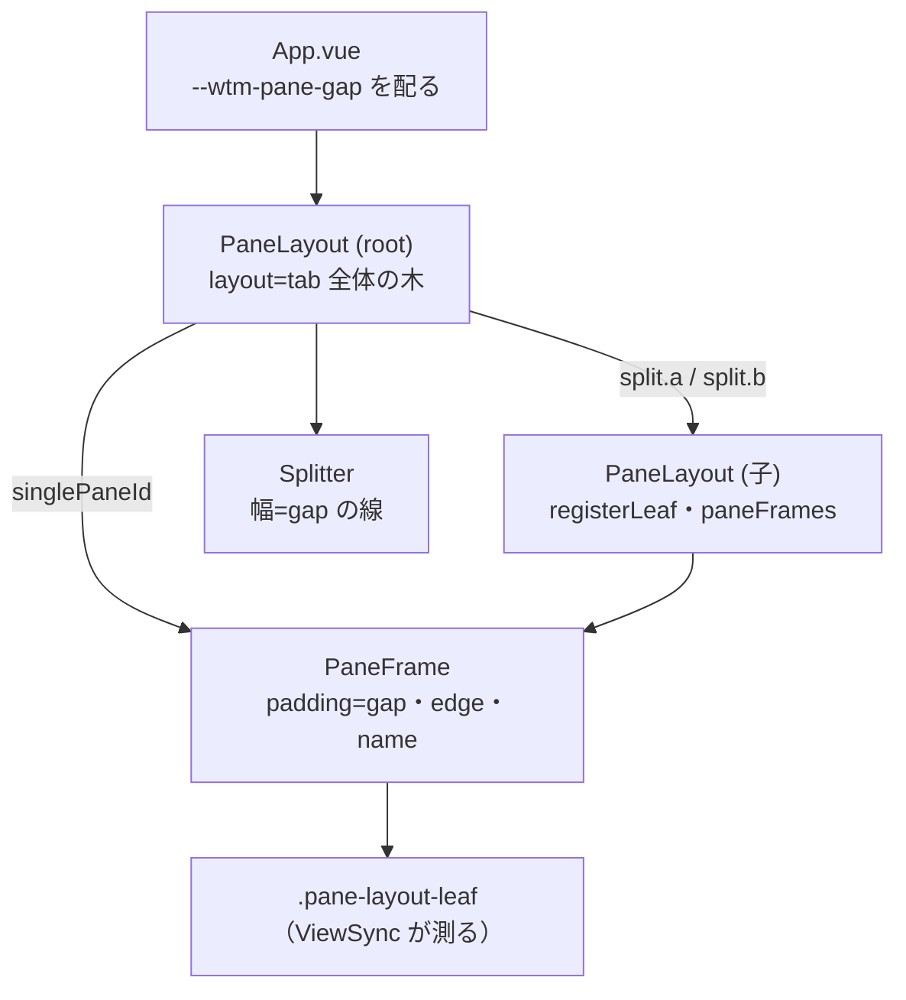

# 調査: pane の枠の描画モードと隙間の入切

## 調査の問い

- Q1: herdr の `pane_borders` / `pane_gaps` は正確にどう振る舞うか（値・既定・分割の判定・zoom・組み合わせ）。
- Q2: 本製品の今の枠・隙間は、どの要素のどの CSS で描かれているか。端末の大きさとの関係は。
- Q3: 「隣の pane と接する辺」をどこで判定できるか。
- Q4: 設定の保存・同期・再読み込みの既存の仕組みと、そこへ足す箇所。
- Q5: 設定画面の既存の部品（3 値の選択・入切）と、確立したパターン（APG）との対応。
- Q6: 枠を描かない pane で、メニューボタン（枠）のキーボードの経路とフォーカスの見え方はどうなるか。
- Q7: 名前ラベル（legend）と、それを掴み手にするドラッグとの関係。
- Q8: PR #12 の設計のうち使えるもの・使えないもの。

## 判明した事実

- F1（Q1）: herdr の `PaneBordersConfig` は `Auto`（既定）/`Always`/`Off`。`draws_borders()` は `Off` 以外、
  `shows_borders(multi_pane)` は `draws_borders() && (multi_pane || Always)`（`scratchpad/herdr/src/config/model.rs:848-863`）。
  旧形式の真偽値は `true`→`Auto`・`false`→`Off`（同 `:879-885`）。
- F2（Q1）: 分割の判定は `tab.layout.pane_count() > 1`（`src/ui/panes.rs:216,284`）。zoom 中の pane は
  `shows_borders(multi_pane) && pane_outer_borders` のとき `Borders::ALL`（同 `:222-227`）＝ zoom 中でも分割された tab なら
  分割扱いで、辺はすべて外周として扱う。
- F3（Q1）: `apply_pane_chrome`（`src/ui/panes.rs:92-160`）: 隙間が切なら右・下に隣がある辺の線を外して境界を共有する
  （`:132-139`）。枠を描かず（`Off`）隙間が入なら、右・下に隣がある pane を 1 セル縮めて隙間を空ける（`:119-126`）。
  外周の辺を消すのは `pane_outer_borders` が切のとき（`:140-153`）。隙間の既定は `true`（`src/main.rs:302-303`）。
- F4（Q1）: 共有した境界線のうち、選ばれた pane に接するセルは強調色（`src/ui/panes.rs:481-495`）。
- F5（Q2）: 枠は `PaneFrame.vue` の `.pane-frame-enabled { padding: var(--wtm-pane-gap, 4px) }`（`PaneFrame.vue:310-312`）の余白と、
  その中の `.pane-frame-edge`（`position:absolute; inset:0`。`:324-328`）。選ばれている pane は `.pane-frame-edge-current` で
  2px の線（`:332-335`）。名前表示が入なら上の余白を `calc(var(--wtm-pane-gap) + 1.2em)` に広げ（`:321-323`）、
  名前がある pane に 1px の薄い線（`:344-353`）。端末（`.pane-frame-body`）は `position:relative` で枠の上に重なる（`:439-443`）。
- F6（Q2）: 分割の境界は `Splitter.vue` の `.splitter`（幅/高さ `var(--wtm-pane-gap, 4px)`、背景 `--wtm-menu-border`。
  `Splitter.vue:112-129`）。`--wtm-pane-gap` は `App.vue:50,56` が `paneFrameThickness`（2/4/6px。`store/settings.ts:71-76`）から配る。
- F7（Q2）: `ViewSync` が測るのは葉（`.pane-layout-leaf`）で、枠の余白は葉の外（`PaneLayout.vue:50-53,148`）。
  デスクトップの root は葉を `ResizeObserver` で見て、大きさが変われば `client.view` を送り直す（`PaneLayout.vue:93-107`）。
  ＝ 余白を変えれば葉の大きさが変わり、既存の仕組みで cols/rows が送り直される（実画面での確認は E2E が要る）。
- F8（Q3）: `PaneLayout.vue` は自分自身を再帰させて分割の両側を描く（`PaneLayout.vue:183-195`）。右分割（`dir: "right"`）の
  `a` は右に、`b` は左に隣を持ち、下分割（`"down"`）の `a` は下に、`b` は上に隣を持つ。子へ渡している prop は
  `registerLeaf`・`paneFrames` だけ（`:185,191`）。単一 pane の描画は `singlePaneId`（zoom 中は zoom の pane。`:110,178-182`）。
  root に渡る `layout` は zoom 中も tab 全体の木（`App.vue:69-70`）。
- F9（Q4）: 外観設定は `store/settings.ts` の `ref(load*(initial[key]))` と `set*`（`writePrefs` で `wtm.prefs.v1` に保存）
  （例: `paneOuterBorders` `:98-100,158,268-271`）。別ウィンドウの変更は 2 つ目の `storage` リスナー（`:391-401`）で追従
  （`paneFrameThickness` は追従していない）。設定の再読み込みは `ActionDispatcher.reloadConfig`（`actions/ActionDispatcher.ts:1085-1110`）
  が `load*` を呼び直す。
- F10（Q5）: 設定画面の「表示」節（`SettingsDialog.vue:661-700`）に、3 値の選択はラジオの `fieldset`（太さ。`:672-685`）、
  入切は `role="switch"` の `button`（`:687-698`）がある。どちらも選んだ時点で `settings.set*` を呼び、確定ボタンは無い。
  既存テストは同じ部品を `name` 属性・文言で拾っている（`SettingsDialog.test.ts:470-498,570-580`）。
- F11（Q5・APG）: WAI-ARIA APG の Radio Group パターンは、Tab で群に入り（選ばれている項目へ）、矢印キーで選択を移し（移すと
  選ばれる）、Tab で群を出る。ネイティブの `input type=radio` の同名グループはこの挙動をブラウザが持つ。Switch パターンは
  `role="switch"` と `aria-checked`、Space で切り替え（`button` 要素なら Enter でも押せる）。macOS のシステム設定・GNOME の設定も
  3 値以上の排他の選択はラジオ／ポップアップ、入切はスイッチで、選んだ時点で効く（確定ボタンなし）。本製品の既存の部品（F10）は
  どちらもこの形で、食い違いは無い。
- F12（Q6）: 枠（`.pane-frame-edge`）は選ばれている pane だけ `tabindex=0`（roving。`PaneFrame.vue:264-265`）。フォーカスの見え方は
  `.pane-frame-edge:focus-visible` の outline（`-1px` の内側）と背景色（`:394-398`）で、端末（`.pane-frame-body`）が上に重なるため
  **見えるのは余白の部分だけ**。余白が 0 の辺では見えず、4 辺とも 0 ならフォーカスがあっても何も見えない。
- F13（Q6）: 枠の右クリック・押下は `.pane-frame-edge` の上でだけ起きる（`PaneFrame.vue:269-271`）。余白が 0 なら押せる面が無い。
- F14（Q7）: 名前ラベル（`.pane-frame-name`）は枠線に埋め込む legend で、pane のドラッグ（入れ替え・分割・他の tab へ移す）の
  掴み手を兼ねる（`PaneFrame.vue:283-295,123-182`）。herdr の `show_agent_labels_on_pane_borders` も枠の線の上に出すもので、
  枠が無ければ出ない（`src/ui/panes.rs:461-463` の早期 return）。
- F15（Q8）: PR #12（`fec25b31`）は `PaneLayout.vue` が `settings.paneBorders` を読み、`multiPane` を子へ再帰で渡して
  `bordered` を計算し、`PaneFrame` は「非選択の pane にも 1px の線を出すか」だけを受けた。余白（padding）は常に固定で、
  隙間の切は `Splitter` の背景を地の色にするだけ（幅は変えない）だった（`git diff $(git merge-base fec25b31 main) fec25b31 --
  packages/web/src/components/{PaneLayout,PaneFrame,Splitter}.vue`）。つまり #12 の「枠」は**非選択の pane の線**で、
  余白を取り去って端末を広げるものではなかった。
- F16: モバイルの `MobileShell` は `PaneLayout` を `paneFrames` 無しで使う（`mobile/MobileShell.vue:94-105`）。`PaneFrame` は
  `enabled` が偽ならストアに触れない（`PaneFrame.vue:33-34,40-42`）。

## 影響範囲

- `PaneLayout.vue`（隣の有無と分割の有無を子へ渡す）、`PaneFrame.vue`（辺ごとの余白・強調・名前の描き分け・フォーカスの見え方）、
  `store/settings.ts`（2 つの設定）、`SettingsDialog.vue`（2 つの部品と説明）、`ActionDispatcher.ts`（再読み込み）、
  `App.vue`（root へ渡す必要があれば）。`Splitter.vue` は変えない（requirements の対象外）。
- テスト: `PaneFrame.test.ts`・`PaneLayout.test.ts`・`settings.test.ts`・`SettingsDialog.test.ts`・`ActionDispatcher.test.ts`。
- docs: `docs/herdr-parity.md` H23 行、`docs/verification.md` の外観の確認手順。

## 実現性 / リスク

- 実現可能。辺ごとの余白は `padding-*` を辺ごとに `var(--wtm-pane-gap)` か `0` にすれば足り、太さの設定（F6）と両立する。
- リスク1: 余白 0 の辺では選択の強調・フォーカスの見え方が端末の下に隠れる（F12）。4 辺とも 0 になる設定（表示しない＋隙間切、
  分割時だけ＋単一 pane など）では、フォーカスの見え方を別の方法で出す必要がある。
- リスク2: 名前ラベルを枠と一緒に消すと、その pane はラベルのドラッグができなくなる（F14）。herdr と同じ扱いだが、説明に要る。
- リスク3: `PaneFrame.test.ts` の既存テストは props を `paneId`・`enabled` だけで mount している（`PaneFrame.test.ts:26-38`）。
  新しい props を省略したときに今と同じ描き方になる既定にしないと、既存テストの前提が崩れる。

## 実装アンカー

- A1: 単一 pane の描画と子への再帰（`packages/web/src/components/PaneLayout.vue:177-196`）。
- A2: props 定義（`PaneLayout.vue:55-80` `defineProps`）。
- A3: 枠の余白・強調・名前の class と CSS（`packages/web/src/components/PaneFrame.vue:250-296,300-353,394-398`）、
  `reserveNameSpace`・`showBorder`（`:65-70`）。
- A4: 設定の load/ref/set/storage/return（`packages/web/src/store/settings.ts:93-100,158,267-271,391-401,474-527`）。
- A5: 設定の再読み込み（`packages/web/src/actions/ActionDispatcher.ts:1085-1110` `reloadConfig`。import は同ファイル冒頭）。
- A6: 設定画面の「表示」節（`packages/web/src/components/SettingsDialog.vue:661-700`、script 側 `:165-220`）。
- A7: root への呼び出し（`packages/web/src/App.vue:65-77`）。

## 実装時の注意

- `PaneFrame` の props を省略したときは今と同じ（4 辺に余白・強調・名前）にする（リスク3）。モバイル（`enabled` 偽）は何も変えない。
- 余白は葉の外に保つ（F7）。枠の要素に `border` を足して外寸を変えない（`PaneFrame.vue:329-331` の注記と同じ理由）。
- `paneFrameThickness` は `storage` で追従していない（F9）が、この work で足す 2 つは PR #12 分と同じリスナーで追従させる。
- 既存の名前表示の上余白は `calc(var(--wtm-pane-gap, 4px) + 1.2em)`（`PaneFrame.vue:321-323`）。上の辺の余白が 0 になる場合
  （隙間切で上に隣がある）の扱いを決める必要がある。

## design への申し送り

- 余白を「辺ごと」に決める（外周の辺は枠の設定、隣と接する辺は隙間の設定）。F3 の herdr の 4 通りの組み合わせに対応させる。
- 隣の有無は `PaneLayout` が再帰の中で分かる（F8）。zoom 中は辺をすべて外周にする（F2）。
- 設定を読むのは `PaneFrame`（既に `paneAgentNameVisible` を読んでいる。F5）か `PaneLayout`（PR #12。F15）か。`PaneLayout` は今
  ストアを読んでいない（モバイルでも使う）。
- 余白 0 の辺・4 辺とも 0 の pane でのフォーカスの見え方（リスク1）と、隙間切で隠れる選択の強調（F4 との差）をどうするか。
- 名前ラベルは枠と一緒に消す（F14。herdr と同じ）。
