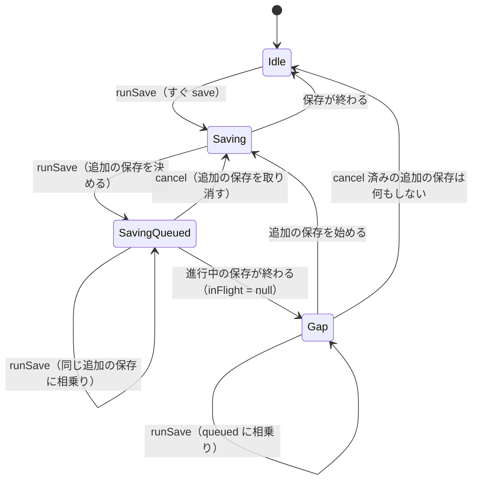

# 仕様: 進行中の保存に相乗りした flush・予約保存が、その後の変更を落とさないようにする

## 概要

`DefaultPersistScheduler` に「進行中の保存の後にもう 1 回保存する」予定（以下、**追加の保存**）を 1 つだけ持たせる。
保存が進行中に `flush()` や予約の時刻が来たら、進行中の保存に相乗りする代わりに追加の保存に相乗りする。追加の保存は
進行中の保存が（成功でも失敗でも）終わってから始まるので、2 つの `save()` が同時に走ることは無く、要求した時点より後に
スナップショットが取られる。`cancel()` は予約に加えて、まだ始まっていない追加の保存も取り消す。

## 設計方針

- **採用: 追加の保存を 1 つだけ持つ（coalescing follow-up）**。進行中の保存が終わった後の 1 回で、その間に要求された
  すべての変更を拾える（スナップショットは追加の保存の開始時に取られるため）。何度要求されても 1 回にまとまる。
- 退けた案 A「`flush()` は進行中の保存を待ってから毎回新しく保存する」: 要求の数だけ保存が走り、しかも待っていた複数の
  `flush()` が同時に新しい保存を始めて 2 つ同時に走りうる（直列化を別に要する）。
- 退けた案 B「世代番号（要求の世代と保存済みの世代）でループする」: 正しく作れるが、1 つの follow-up で足りる問題に対して
  状態が増える。
- `PersistScheduler` インターフェースは変えない（requirements「対象外」）。

## 対象範囲

- `packages/server/src/session/PersistScheduler.ts`（`DefaultPersistScheduler` の内部）
- `packages/server/src/session/PersistScheduler.test.ts`（回帰テストの追加）

## 依拠する既存の事実

- 相乗りの実装: `packages/server/src/session/PersistScheduler.ts:36-43`（`runSave()` が `inFlight` をそのまま返す）、
  `flush()` は `cancel()` を経由せず、自分で `clearTimeout` してから `runSave()` を待つ（同 52-58）。タイマーの発火も `runSave()` を呼ぶ（同 26-31）。
  予約の遅延は既定 500ms（同 21 の `delayMs = 500`。テストはコンストラクタに 500 を渡す）。
- スナップショットは保存の開始時点: `packages/server/src/composeServer.ts:154-156` で `save` は
  `sessionFile.save(toSessionFileData(session))`。`toSessionFileData`（同 328）は引数として `save()` を呼んだ時点で同期に評価される。
  `FsSessionFile.save`（`packages/server/src/persist/SessionFile.ts:151-153`）はそれを `writeFileAtomic` で書くだけ。
- `cancel()` の用途: `composeServer.ts:283`（起動の失敗時、復元前なら取り消す）・同 301-302（終了時、復元済みなら `flush()`、
  でなければ `cancel()`）。同じ終了経路で `flush()` と `cancel()` の両方は呼ばない。ロックの解放は同 308-310 の `finally` で、
  `flush()` の後に行われる。`cancel()` の「復元前の状態を書かない」は D102（`.aidev/works/20260918-web-terminal-multiplexer/decisions.md`
  の D102。`PersistScheduler.ts:6-9` のコメントも同じ番号を指す）の決定。
- 既存テストの書き方: `PersistScheduler.test.ts` は `vi.useFakeTimers()` と `vi.advanceTimersByTimeAsync` を使う。

## インターフェース / データ構造

公開の形は変えない。`DefaultPersistScheduler` の private を次のようにする。

```ts
private inFlight: Promise<void> | null = null;   // 実行中の save()（既存）
private queued: Promise<void> | null = null;     // 進行中の保存の後に行う追加の保存（新規）

private runSave(): Promise<void> {
  if (this.queued) return this.queued;           // 追加の保存が決まっていればそれに相乗り
  if (!this.inFlight) return this.startSave();   // 何も走っていなければすぐ保存
  const q = this.inFlight.catch(() => undefined).then(() => {
    if (this.queued !== q) return;               // cancel() で取り消された
    this.queued = null;
    return this.startSave();
  });
  this.queued = q;
  return q;
}

private startSave(): Promise<void> { /* 既存の runSave 本体（save() を呼んで inFlight に置く） */ }

cancel(): void { /* 既存のタイマー取り消し */ this.queued = null; }

// flush() は今までどおり cancel() を呼ばず、タイマーだけを取り消して runSave() を待つ（queued は消さない）。
```

## 振る舞いの詳細



（`Gap` は、進行中の保存が終わってから追加の保存が始まるまでのマイクロタスクの隙間。cancel 済みで `queued` が
`null` のときに隙間で `runSave()` が来た場合は `Idle` と同じくすぐ保存を始め、古い追加の保存の続きは何もしない。）

- `queued` を最初に見るのは、進行中の保存が終わって `inFlight` が `null` になった直後から、追加の保存が始まるまでの
  マイクロタスクの隙間で `runSave()` が呼ばれた場合に、新しい保存を別に始めて 2 つ同時に走らせないため。
- 追加の保存は `this.inFlight.catch(() => undefined)` の後に始まる。`inFlight` は `save().finally(...)` の Promise なので、
  その `finally` で `inFlight = null` にした後に続きが走る（`startSave()` の時点で `inFlight` は必ず `null`）。
- 取り消された追加の保存（`this.queued !== q`）は保存せずに解決する。取り消した後に `runSave()` が来た場合は、
  その時点の状態に応じて新しい保存（すぐ／追加）を決め直す。古い `q` の続きは何もしない。

## ドメイン固有の考慮

- 終了時（`close()`）の `flush()` は、この修正で「呼んだ時点までの変更」を書いてから解決する。ロックの解放は
  `flush()` の後（`composeServer.ts:308-310` の `finally`）なので、ロックを持ったまま書き終える順序は変わらない。
- 起動の失敗時（D102。上の「依拠する既存の事実」）は `cancel()` が追加の保存も取り消すので、修正前に無かった書き込みは生じない。進行中の保存は
  今までどおり止めない。

## エラー処理 / 異常系

- 進行中の保存が失敗しても、追加の保存は行う（`catch(() => undefined)` で前の失敗を握って続ける。前の失敗は、それを
  始めた呼び出し元が今までどおり受け取る）。
- 追加の保存が失敗したら、それに相乗りした `flush()` は reject する。タイマー経由は今までどおり `.catch` で握る。
- `cancel()` で取り消された追加の保存に相乗りしていた `flush()` は、保存せずに解決する（現状、同じ経路で `flush()` と
  `cancel()` を両方呼ぶ呼び出し元は無い）。

## 受け入れ基準との対応

- AC1: 入力は、テストが手で解決する Promise を返す `save`（1 回目は保留）と、その保留中に呼ぶ `flush()`。`runSave()` が
  追加の保存を決め、1 回目の解決後に `save()` の 2 回目が呼ばれ、`flush()` はその 2 回目の解決まで解決しない。
- AC2: 入力は、`touch()` → フェイクタイマーで 500ms 進めて 1 回目を開始（保留）→ 再び `touch()` → 500ms 進める。2 回目の
  タイマーの `runSave()` が追加の保存を決め、1 回目の解決後に 2 回目の `save()` が呼ばれる。
- AC3: 入力は、1 回目の保留中に `flush()` を複数回とタイマーの発火を重ねたもの。すべて同じ `queued` を返すので追加の
  `save()` は 1 回。テストの `save` が「実行中の数」を数え、最大値が 1 であることを確かめる。
- AC4: 入力は、1 回目を reject させる `save`。その保留中に呼んだ `flush()` は、2 回目の `save()`（成功）の結果で解決する。
- AC5: 負の確認は、`PersistScheduler.ts` を修正前（HEAD）に戻して AC1・AC2・AC4 のテストを走らせ、落ちる生の出力を
  test-result.md に貼る。戻した後は `cmp` で修正版と一致を確かめる。全体の `pnpm -s test` を 2 回流す。
- AC6: 入力は、保留無しの `save` と `flush()`。`save()` が 1 回だけ呼ばれ、`flush()` が解決する（`startSave()` の直行経路）。
- AC7: 入力は、`flush()` で 1 回目を始めて保留した状態で `touch()` → 500ms 進めて追加の保存を決め、`cancel()` → 1 回目を解決。`save()` は 1 回のまま。
